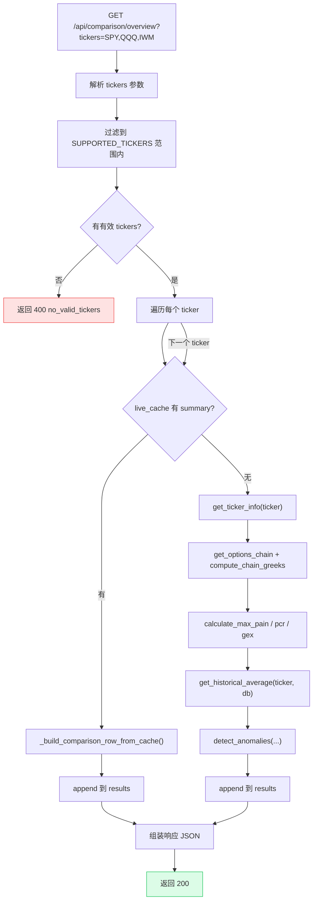
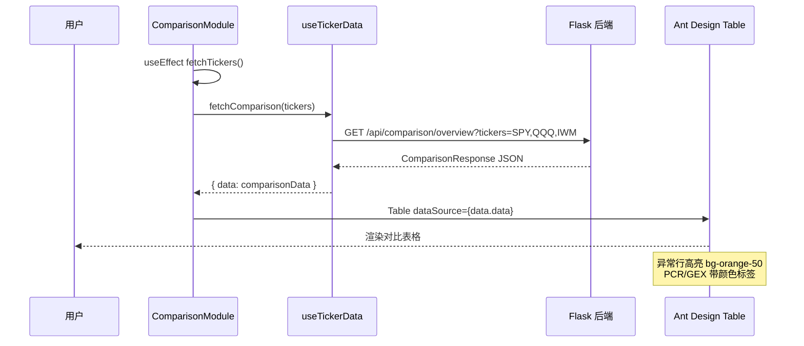

# Comparison API

Comparison API 提供多标的横向对比功能，支持异动检测（Anomaly Detection），帮助发现市场中的异常信号。

## 多标的对比聚合流程



## GET /api/comparison/overview

批量获取多个标的的核心指标并进行横向对比。支持自动异动检测，当指标触发阈值时在响应中标记异常。

**请求参数：**

| 参数 | 类型 | 必填 | 默认值 | 说明 |
|------|------|------|--------|------|
| `tickers` | string | 否 | `SPY,QQQ,IWM` | 逗号分隔的标的代码列表 |
| `expiration` | string | 否 | 最近到期日 | 到期日，格式 `YYYY-MM-DD` |

**请求示例：**

```
GET /api/comparison/overview?tickers=SPY,QQQ,IWM&expiration=2026-06-20
```

### 完整处理器代码

**源码位置：** `backend/api/comparison.py` 第 26-98 行

```python
# backend/api/comparison.py (第 26-98 行)
@comparison_bp.route("/api/comparison/overview", methods=["GET"])
def comparison_overview():
    # 1. 解析并过滤 tickers
    tickers_str = request.args.get("tickers", "SPY,QQQ,IWM")
    tickers = [t.strip().upper() for t in tickers_str.split(",") if t.strip()]
    expiration = request.args.get("expiration")

    # Filter to supported tickers only
    tickers = [t for t in tickers if t in Config.SUPPORTED_TICKERS]
    if not tickers:
        return error_response("no_valid_tickers",
            f"No valid tickers. Supported: {', '.join(Config.SUPPORTED_TICKERS)}",
            status=400)

    results = []
    for ticker in tickers:
        try:
            # 2. 尝试 live cache first
            cached = get_cached(ticker, "summary")
            if cached:
                row = _build_comparison_row_from_cache(ticker, cached)
                if row:
                    results.append(row)
                    continue

            # 3. 缓存未命中，直接获取
            info = get_ticker_info(ticker)
            chain = get_options_chain(ticker, expiration)
            chain = compute_chain_greeks(chain)
            calls = chain["calls"]
            puts = chain["puts"]
            spot = chain["spot_price"]

            # 4. 计算核心指标
            max_pain_result = calculate_max_pain(calls, puts)
            pcr_result = calculate_pcr(calls, puts)
            gex_result = calculate_gex(calls, puts, spot)
            deviation = round(spot - max_pain_result["max_pain_strike"], 2)

            # 5. 异动检测
            hist_avg = get_historical_average(ticker, db)
            anomalies = detect_anomalies(
                ticker=ticker,
                pcr={"pcr_volume": pcr_result["pcr_volume"], "pcr_oi": pcr_result["pcr_oi"]},
                gex={"value": gex_result["value"]},
                daily_change_pct=info["daily_change_pct"],
                calls_oi=pcr_result["total_call_oi"],
                puts_oi=pcr_result["total_put_oi"],
                calls_vol=pcr_result["total_call_volume"],
                puts_vol=pcr_result["total_put_volume"],
                historical_avg=hist_avg,
            )

            # 6. 构建对比行
            results.append({
                "ticker": ticker,
                "spot_price": spot,
                "daily_change_pct": info["daily_change_pct"],
                "max_pain": max_pain_result["max_pain_strike"],
                "deviation_from_max_pain": deviation,
                "pcr": {"volume": pcr_result["pcr_volume"], "oi": pcr_result["pcr_oi"],
                        "signal": pcr_result["signal"]},
                "gex": {"value": gex_result["value"], "formatted": gex_result["formatted"],
                        "regime": gex_result["regime"]},
                "total_call_oi": pcr_result["total_call_oi"],
                "total_put_oi": pcr_result["total_put_oi"],
                "total_call_volume": pcr_result["total_call_volume"],
                "total_put_volume": pcr_result["total_put_volume"],
                "anomalies": anomalies,
            })
        except Exception as e:
            # 7. 单个 ticker 失败不影响其他 ticker
            logger.warning(f"Comparison fetch failed for {ticker}: {e}")
            results.append({"ticker": ticker, "error": str(e), "anomalies": []})

    return jsonify({
        "data": results,
        "expiration_used": expiration or "nearest",
        "updated_at": datetime.now(timezone.utc).isoformat(),
    })
```

### 代码执行步骤解析

| 步骤 | 代码行 | 说明 |
|------|--------|------|
| 1. 参数解析 | 第 28-37 行 | 解析 `tickers` 参数，过滤到 `SUPPORTED_TICKERS` 范围 |
| 2. 缓存查询 | 第 43-48 行 | 对每个 ticker 查 `live_cache` 的 `summary` 缓存 |
| 3. 数据获取 | 第 51-55 行 | 缓存未命中时调用 yfinance |
| 4. 指标计算 | 第 58-61 行 | Max Pain、PCR、GEX 计算 |
| 5. 异动检测 | 第 63-74 行 | 调用 `detect_anomalies()` 与历史均值对比 |
| 6. 构建结果 | 第 76-89 行 | 组装单个 ticker 的对比数据行 |
| 7. 容错处理 | 第 90-92 行 | 单个 ticker 失败不影响整体 |

### 缓存构建函数

**源码位置：** `backend/api/comparison.py` 第 101-132 行

```python
# backend/api/comparison.py (第 101-132 行)
def _build_comparison_row_from_cache(ticker: str, cached: dict) -> dict | None:
    """Build a comparison row from a cached summary."""
    try:
        # Also check for anomalies using historical data
        hist_avg = get_historical_average(ticker, db)
        anomalies = detect_anomalies(
            ticker=ticker,
            pcr=cached.get("pcr", {}),
            gex=cached.get("gex", {}),
            daily_change_pct=cached.get("daily_change_pct", 0),
            calls_oi=0,    # 缓存数据中无完整 OI 信息
            puts_oi=0,
            calls_vol=0,
            puts_vol=0,
            historical_avg=hist_avg,
        )
        return {
            "ticker": ticker,
            "spot_price": cached["spot_price"],
            "daily_change_pct": cached.get("daily_change_pct", 0),
            "max_pain": cached["max_pain"],
            "deviation_from_max_pain": cached.get("deviation_from_max_pain", 0),
            "pcr": cached.get("pcr", {}),
            "gex": cached.get("gex", {}),
            "total_call_oi": 0,
            "total_put_oi": 0,
            "total_call_volume": 0,
            "total_put_volume": 0,
            "anomalies": anomalies,
        }
    except Exception:
        return None
```

**注意：** 当使用缓存构建对比行时，`total_call_oi`、`total_put_oi` 等字段为 0，因为缓存的 `summary` 中不包含完整的 OI 数据。异动检测仍会基于缓存中的 PCR 和 GEX 数据进行。

### 异动检测逻辑

异动检测由 `backend/services/anomaly.py` 中的 `detect_anomalies()` 函数实现：

```python
# backend/services/anomaly.py (第 9-92 行)
def detect_anomalies(
    ticker: str,
    pcr: dict,
    gex: dict,
    daily_change_pct: float,
    calls_oi: int,
    puts_oi: int,
    calls_vol: int,
    puts_vol: int,
    historical_avg: dict | None = None,
) -> list[dict]:
    """
    Flag anomalous data points.

    Checks:
    - OI single-day change > 20% (if historical available)
    - PCR extreme values (> 2.0 or < 0.5)
    - GEX sign flip (if historical available)
    - Price move > 3% (large underlying move)
    """
    anomalies = []

    # Extreme PCR
    if pcr["pcr_volume"] > 2.0 or pcr["pcr_oi"] > 2.0:
        anomalies.append({
            "field": "pcr", "value": pcr["pcr_oi"],
            "change_pct": 0, "type": "extreme",
        })
    elif pcr["pcr_volume"] < 0.5 and pcr["pcr_oi"] < 0.5:
        anomalies.append({
            "field": "pcr", "value": pcr["pcr_oi"],
            "change_pct": 0, "type": "extreme",
        })

    # Large price move
    if abs(daily_change_pct) > 3.0:
        anomalies.append({
            "field": "price", "value": daily_change_pct,
            "change_pct": daily_change_pct,
            "type": "spike" if daily_change_pct > 0 else "drop",
        })

    # OI change vs historical 5-day average
    if historical_avg and historical_avg.get("total_call_oi"):
        prev_call_oi = float(historical_avg["total_call_oi"])
        if prev_call_oi > 0:
            change = (calls_oi - prev_call_oi) / prev_call_oi * 100
            if abs(change) > 20:
                anomalies.append({
                    "field": "call_oi", "value": calls_oi,
                    "change_pct": round(change, 1),
                    "type": "spike" if change > 0 else "drop",
                })

    # GEX sign flip detection
    if historical_avg and historical_avg.get("gex") is not None:
        prev_gex = float(historical_avg["gex"])
        if (prev_gex > 0 and gex["value"] < 0) or (prev_gex < 0 and gex["value"] > 0):
            anomalies.append({
                "field": "gex", "value": gex["value"],
                "change_pct": 0, "type": "flip",
            })

    return anomalies
```

**异动类型汇总：**

| 类型 (type) | 触发条件 | 说明 |
|-------------|----------|------|
| `extreme` | `PCR > 2.0` 或 `PCR < 0.5` | 极端情绪信号 |
| `spike` | `日内涨幅 `> 3%` 或 OI 较 5 日均值增长 `> 20%`` | 显著上涨 / 持仓量异常增加 |
| `drop` | `日内跌幅 `> 3%` 或 OI 较 5 日均值下降 `> 20%`` | 显著下跌 / 持仓量异常减少 |
| `flip` | GEX 符号与 5 日均值相反 | Gamma 状态反转 |

**响应 (200)：**

```json
{
  "data": [
    {
      "ticker": "SPY",
      "spot_price": 585.42,
      "daily_change_pct": 0.37,
      "max_pain": 585.0,
      "deviation_from_max_pain": 0.42,
      "pcr": { "volume": 0.85, "oi": 0.92, "signal": "neutral" },
      "gex": { "value": 2500000000.0, "formatted": "$2.50B", "regime": "positive_gamma" },
      "total_call_oi": 250000,
      "total_put_oi": 280000,
      "total_call_volume": 1800000,
      "total_put_volume": 1600000,
      "anomalies": []
    },
    {
      "ticker": "QQQ",
      "spot_price": 495.20,
      "daily_change_pct": -3.5,
      "max_pain": 500.0,
      "deviation_from_max_pain": -4.80,
      "pcr": { "volume": 1.35, "oi": 1.28, "signal": "bearish" },
      "gex": { "value": -800000000.0, "formatted": "-$800.00M", "regime": "negative_gamma" },
      "total_call_oi": 180000,
      "total_put_oi": 220000,
      "total_call_volume": 1200000,
      "total_put_volume": 1500000,
      "anomalies": [
        { "field": "pcr", "value": 1.28, "change_pct": 0, "type": "extreme" },
        { "field": "price", "value": -3.5, "change_pct": -3.5, "type": "drop" }
      ]
    }
  ],
  "expiration_used": "2026-06-20",
  "updated_at": "2026-06-07T12:00:00Z"
}
```

### 前端对比表格渲染



**部分失败处理：** 如果某个标的的数据获取失败，该标的的 `error` 字段会包含错误信息，其余标的正常返回。不会因单个标的失败导致整个请求失败。

**错误响应：**

```json
// 400 - 无有效标的
{
  "error": "no_valid_tickers",
  "message": "No valid tickers. Supported: SPY, QQQ, IWM, TLT, XLF",
  "timestamp": "2026-06-07T12:00:00Z"
}
```

**缓存行为：** 优先使用每个标的的实时缓存 summary 数据，缓存未命中时回退到直接调用 yfinance。
