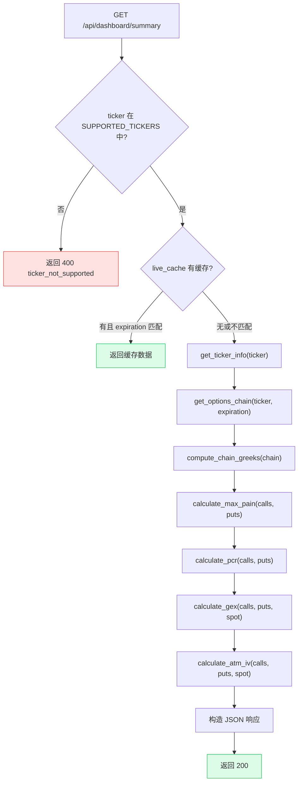
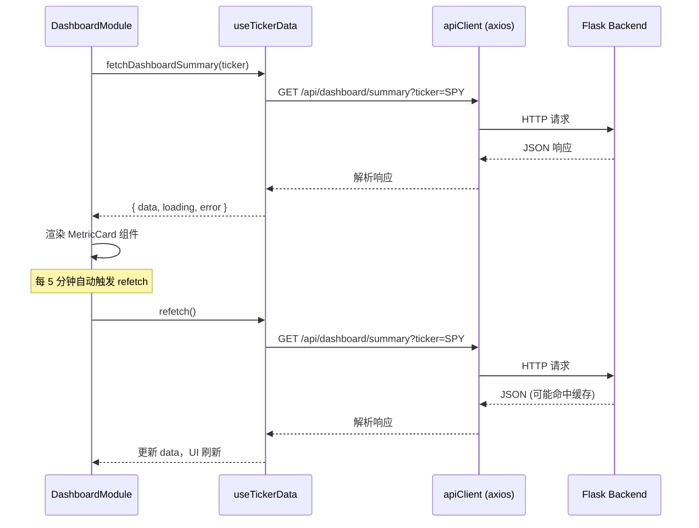

# Dashboard API

Dashboard API 提供核心指标概览，包括健康检查、支持标的列表、实时摘要和到期日查询。

## 端点处理流程



## Health 和 Tickers 端点

### GET /api/health

健康检查端点，用于确认服务是否正常运行。

**源码位置：** `backend/api/health.py` 第 14-23 行

```python
# backend/api/health.py (第 14-23 行)
@health_bp.route("/api/health", methods=["GET"])
def health_check():
    """Health check endpoint."""
    return jsonify(
        {
            "status": "ok",
            "service": "optiondash-api",
            "timestamp": datetime.now(timezone.utc).isoformat(),
        }
    )
```

**响应 (200)：**

```json
{
  "status": "ok",
  "service": "optiondash-api",
  "timestamp": "2026-06-07T12:00:00Z"
}
```

| 字段 | 类型 | 说明 |
|------|------|------|
| `status` | string | 固定为 `"ok"` |
| `service` | string | 服务名称 `"optiondash-api"` |
| `timestamp` | string | 当前 UTC 时间，ISO 8601 格式 |

### GET /api/tickers

返回当前配置支持的标的列表。

**源码位置：** `backend/api/health.py` 第 26-34 行

```python
# backend/api/health.py (第 26-34 行)
@health_bp.route("/api/tickers", methods=["GET"])
def list_tickers():
    """Return the list of configured supported tickers."""
    return jsonify(
        {
            "tickers": Config.SUPPORTED_TICKERS,
            "default": Config.SUPPORTED_TICKERS[0] if Config.SUPPORTED_TICKERS else "SPY",
        }
    )
```

**响应 (200)：**

```json
{
  "tickers": ["SPY", "QQQ", "IWM", "TLT", "XLF"],
  "default": "SPY"
}
```

**注意：** 标的列表由环境变量 `SUPPORTED_TICKERS` 配置，默认值为 `SPY,QQQ,IWM,TLT,XLF`。前端在启动时请求此接口，若失败则回退到内置的 `FALLBACK_TICKERS` 常量。

## Dashboard Summary 端点

### GET /api/dashboard/summary

核心仪表盘端点，返回指定标的的全部关键指标。这是前端首页的主要数据来源。

**请求参数：**

| 参数 | 类型 | 必填 | 默认值 | 说明 |
|------|------|------|--------|------|
| `ticker` | string | 否 | `SPY` | 标的代码 |
| `expiration` | string | 否 | 最近到期日 | 到期日，格式 `YYYY-MM-DD` |

**请求示例：**

```
GET /api/dashboard/summary?ticker=SPY&expiration=2026-06-20
```

#### 完整处理器代码

**源码位置：** `backend/api/dashboard.py` 第 25-78 行

```python
# backend/api/dashboard.py (第 25-78 行)
@dashboard_bp.route("/api/dashboard/summary", methods=["GET"])
def dashboard_summary():
    """Get core indicator overview for a ticker."""
    # 1. 参数解析：从 query string 获取 ticker 和 expiration
    ticker = request.args.get("ticker", "SPY").upper()
    expiration = request.args.get("expiration")

    # 2. 参数校验：ticker 必须在支持列表中
    if ticker not in Config.SUPPORTED_TICKERS:
        return ticker_not_supported(ticker)

    # 3. 尝试 live_cache（后台轮询器每 5 分钟预填充）
    cached = get_cached(ticker, "summary")
    if cached:
        if not expiration or cached.get("expiration_used") == expiration:
            return jsonify(cached)

    # 4. 缓存未命中，回退到直接获取 yfinance 数据
    try:
        info = get_ticker_info(ticker)           # 现价、日内涨跌
        chain = get_options_chain(ticker, expiration)  # 期权链
        chain = compute_chain_greeks(chain)       # 计算 Greeks

        calls = chain["calls"]
        puts = chain["puts"]

        # 5. 计算核心指标
        max_pain_result = calculate_max_pain(calls, puts)
        pcr_result = calculate_pcr(calls, puts)
        gex_result = calculate_gex(calls, puts, chain["spot_price"])
        atm_iv = calculate_atm_iv(calls, puts, chain["spot_price"])
        deviation = round(chain["spot_price"] - max_pain_result["max_pain_strike"], 2)

        # 6. 构造 JSON 响应
        return jsonify({
            "ticker": ticker,
            "spot_price": chain["spot_price"],
            "daily_change": info["daily_change"],
            "daily_change_pct": info["daily_change_pct"],
            "max_pain": max_pain_result["max_pain_strike"],
            "deviation_from_max_pain": deviation,
            "pcr": {
                "volume": pcr_result["pcr_volume"],
                "oi": pcr_result["pcr_oi"],
                "signal": pcr_result["signal"],
            },
            "gex": {
                "value": gex_result["value"],
                "formatted": gex_result["formatted"],
                "regime": gex_result["regime"],
            },
            "atm_iv": round(atm_iv, 4),
            "expiration_used": chain["expiration"],
            "updated_at": datetime.now(timezone.utc).isoformat(),
        })
    except Exception as e:
        logger.exception(f"Dashboard summary failed for {ticker}")
        return data_source_error(ticker, "dashboard_summary", e)
```

#### 代码执行步骤解析

| 步骤 | 代码行 | 说明 |
|------|--------|------|
| 1. 参数解析 | 第 28-29 行 | 从 URL query string 获取 `ticker`（默认 SPY）和 `expiration` |
| 2. 参数校验 | 第 31-32 行 | 检查 ticker 是否在 `Config.SUPPORTED_TICKERS` 中 |
| 3. 缓存查询 | 第 35-38 行 | 查 `live_cache` 表，如果命中且 expiration 匹配则直接返回 |
| 4. 数据获取 | 第 41-44 行 | 调用 yfinance 获取 ticker 信息、期权链、计算 Greeks |
| 5. 指标计算 | 第 49-53 行 | 计算 Max Pain、PCR、GEX、ATM IV |
| 6. 响应构造 | 第 55-75 行 | 组装 JSON 并返回 |

**响应 (200)：**

```json
{
  "ticker": "SPY",
  "spot_price": 585.42,
  "daily_change": 2.15,
  "daily_change_pct": 0.37,
  "max_pain": 585.0,
  "deviation_from_max_pain": 0.42,
  "pcr": {
    "volume": 0.85,
    "oi": 0.92,
    "signal": "neutral"
  },
  "gex": {
    "value": 2500000000.0,
    "formatted": "$2.50B",
    "regime": "positive_gamma"
  },
  "atm_iv": 0.185,
  "expiration_used": "2026-06-20",
  "updated_at": "2026-06-07T12:00:00Z"
}
```

**响应字段说明：**

| 字段 | 类型 | 说明 |
|------|------|------|
| `ticker` | string | 请求的标的代码 |
| `spot_price` | number | 当前现货价格 |
| `daily_change` | number | 日内价格变动（绝对值） |
| `daily_change_pct` | number | 日内价格变动百分比 |
| `max_pain` | number | Max Pain 行权价 |
| `deviation_from_max_pain` | number | 现货价格与 Max Pain 的偏差（`spot_price - max_pain`） |
| `pcr` | object | Put/Call Ratio 数据 |
| `pcr.volume` | number | 成交量 PCR |
| `pcr.oi` | number | 持仓量 PCR |
| `pcr.signal` | string | 信号：`"bullish"` / `"neutral"` / `"bearish"` |
| `gex` | object | Gamma Exposure 数据 |
| `gex.value` | number | GEX 绝对值（美元） |
| `gex.formatted` | string | 格式化的 GEX（如 `$2.50B`、`-$800.00M`） |
| `gex.regime` | string | GEX 状态：`"positive_gamma"` / `"negative_gamma"` |
| `atm_iv` | number | 平值隐含波动率 |
| `expiration_used` | string | 实际使用的到期日 |
| `updated_at` | string | 数据更新时间 |

#### PCR 信号逻辑

信号由 `pcr.oi` 和 `pcr.volume` 的加权复合值决定：

```
composite = pcr_oi x 0.6 + pcr_volume x 0.4
```

| 条件 | 信号 | 含义 |
|------|------|------|
| `composite > 1.2` | `"bearish"` | 看跌情绪占优 |
| `composite < 0.7` | `"bullish"` | 看涨情绪占优 |
| `0.7 <= composite <= 1.2` | `"neutral"` | 中性 |

前端渲染时的阈值判断代码（`frontend/src/modules/dashboard/index.tsx` 第 29-39 行）：

```tsx
// frontend/src/modules/dashboard/index.tsx (第 29-39 行)
const pcrSignal = useMemo(() => {
  if (!data?.pcr) return null;
  const { volume, oi } = data.pcr;
  if (volume > PCR_BEARISH_THRESHOLD || oi > PCR_BEARISH_THRESHOLD) {
    return { label: 'Bearish', color: 'red' };
  }
  if (volume < PCR_BULLISH_THRESHOLD || oi < PCR_BULLISH_THRESHOLD) {
    return { label: 'Bullish', color: 'green' };
  }
  return { label: 'Neutral', color: 'blue' };
}, [data]);
```

#### GEX Regime 逻辑

| 条件 | Regime | 含义 |
|------|--------|------|
| `GEX > 0` | `"positive_gamma"` | 做市商做多 Gamma，抑制波动 |
| `GEX <= 0` | `"negative_gamma"` | 做市商做空 Gamma，放大波动 |

**缓存行为：** 优先返回实时缓存数据。如果请求指定了 `expiration` 但缓存中的到期日不匹配，则回退到直接调用 yfinance 获取数据。

## Expirations 端点

### GET /api/dashboard/expirations

返回指定标的的可用期权到期日列表。

**源码位置：** `backend/api/dashboard.py` 第 81-100 行

```python
# backend/api/dashboard.py (第 81-100 行)
@dashboard_bp.route("/api/dashboard/expirations", methods=["GET"])
def dashboard_expirations():
    """Get available expiration dates for a ticker."""
    ticker = request.args.get("ticker", "SPY").upper()

    if ticker not in Config.SUPPORTED_TICKERS:
        return ticker_not_supported(ticker)

    # 1. Try live cache
    cached = get_cached(ticker, "expirations")
    if cached:
        return jsonify(cached)

    # 2. Fall back to direct fetch
    try:
        exps = get_expirations(ticker)
        return jsonify({"ticker": ticker, "expirations": exps})
    except Exception as e:
        logger.exception(f"Expirations fetch failed for {ticker}")
        return data_source_error(ticker, "expirations", e)
```

**请求参数：**

| 参数 | 类型 | 必填 | 默认值 | 说明 |
|------|------|------|--------|------|
| `ticker` | string | 否 | `SPY` | 标的代码 |

**响应 (200)：**

```json
{
  "ticker": "SPY",
  "expirations": [
    "2026-06-13",
    "2026-06-20",
    "2026-06-27",
    "2026-07-03",
    "2026-07-11",
    "2026-07-18",
    "2026-08-15"
  ]
}
```

| 字段 | 类型 | 说明 |
|------|------|------|
| `ticker` | string | 请求的标的代码 |
| `expirations` | string[] | 可用到期日数组，按日期升序排列 |

**注意：** 到期日列表来自 Yahoo Finance，取决于当前市场可用的期权合约。数据通过实时缓存加速，前端使用此列表填充到期日选择器。

## 前端消费方式

前端 `DashboardModule` 组件（`frontend/src/modules/dashboard/index.tsx`）使用自定义 Hook 获取数据：

```tsx
// frontend/src/modules/dashboard/index.tsx (第 14-27 行)
const DashboardModule: React.FC<Props> = ({ ticker = 'SPY' }) => {
  const fetchFn = useCallback(
    () => fetchDashboardSummary(ticker),
    [ticker],
  );
  const { data, loading, error, refetch } = useTickerData<DashboardSummary>(fetchFn);

  const fetchExpsFn = useCallback(
    () => fetchExpirations(ticker),
    [ticker],
  );
  const { data: expData } = useTickerData(fetchExpsFn);

  useAutoRefresh(refetch);  // 每 5 分钟自动刷新
  // ...
};
```

**数据流：**



## 通用错误响应

所有 Dashboard API 端点共享以下错误场景：

**400 - 不支持的标的：**

```json
{
  "error": "unsupported_ticker",
  "message": "Ticker 'INVALID' is not supported. Supported: SPY, QQQ, IWM, TLT, XLF",
  "timestamp": "2026-06-07T12:00:00Z",
  "details": {
    "ticker": "INVALID",
    "supported": ["SPY", "QQQ", "IWM", "TLT", "XLF"]
  }
}
```

**502 - 数据源错误：**

```json
{
  "error": "data_source_error",
  "message": "Failed to fetch dashboard_summary for SPY: <error details>",
  "timestamp": "2026-06-07T12:00:00Z",
  "details": {
    "ticker": "SPY",
    "source": "dashboard_summary",
    "reason": "<原始错误信息>"
  }
}
```

错误处理的详细说明请参阅 [错误处理文档](./errors.md)。
