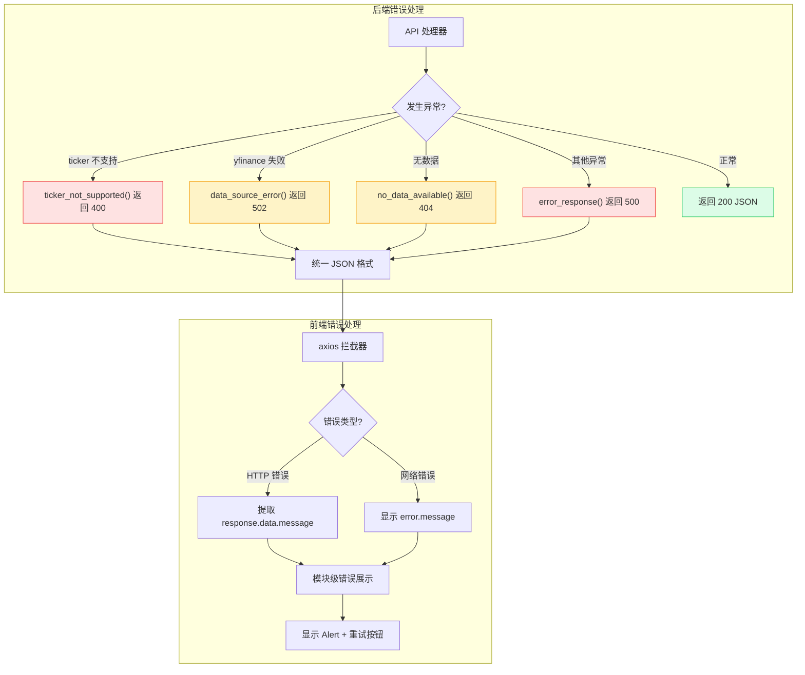
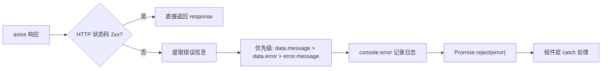
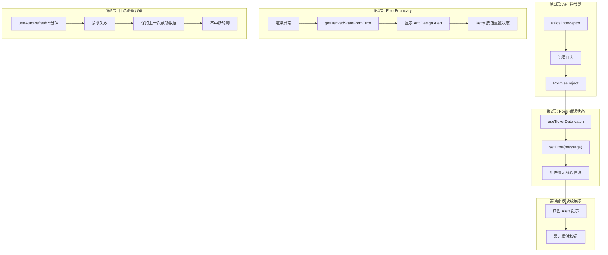

# 错误处理

本文档描述 OptionDash API 的统一错误响应格式、HTTP 状态码、错误代码定义以及前后端错误处理机制。

## 错误处理流程



## 错误响应格式

所有 API 错误均遵循统一的 JSON 结构，由 `backend/utils/errors.py` 中的 `error_response()` 函数生成：

```json
{
  "error": "ERROR_CODE",
  "message": "人类可读的错误描述",
  "timestamp": "2026-06-07T12:00:00Z",
  "details": {
    "ticker": "INVALID",
    "source": "yfinance",
    "reason": "Connection timeout"
  }
}
```

| 字段 | 类型 | 必有 | 说明 |
|------|------|------|------|
| `error` | string | 是 | 错误代码，大写蛇形命名 |
| `message` | string | 是 | 错误描述，包含上下文信息 |
| `timestamp` | string | 是 | ISO 8601 UTC 时间戳 |
| `details` | object | 否 | 附加上下文，包含具体错误原因 |

---

## HTTP 状态码

| 状态码 | 含义 | 使用场景 |
|--------|------|----------|
| `200` | 成功 | 请求正常完成 |
| `400` | 请求错误 | 标的不在支持列表中、缺少必填参数、指标名称无效 |
| `404` | 未找到 | 无可用数据（如数据库为空） |
| `500` | 服务器错误 | 未预期的内部错误 |
| `502` | 网关错误 | yfinance 数据获取失败（上游 Yahoo Finance 不可用） |

---

## 后端错误处理函数

`backend/utils/errors.py` 提供四个便捷错误函数，所有 API 蓝图统一使用。

### 完整源码

**源码位置：** `backend/utils/errors.py` 第 1-54 行

```python
# backend/utils/errors.py (第 1-54 行)
"""
Consistent error response formatting for all API endpoints.
"""

import logging
from datetime import datetime, timezone

from flask import jsonify

logger = logging.getLogger(__name__)


def error_response(error_code: str, message: str, status: int = 500, details: dict | None = None):
    """Return a consistent error JSON response with proper logging."""
    payload = {
        "error": error_code,
        "message": message,
        "timestamp": datetime.now(timezone.utc).isoformat(),
    }
    if details:
        payload["details"] = details

    logger.error(f"[{error_code}] {message}" + (f" details={details}" if details else ""))

    return jsonify(payload), status


def data_source_error(ticker: str, source: str, original_error: Exception) -> tuple:
    """Standard error when yfinance data is unavailable."""
    msg = f"Failed to fetch {source} for {ticker}: {original_error}"
    return error_response("data_source_error", msg, 502, {
        "ticker": ticker,
        "source": source,
        "reason": str(original_error),
    })


def ticker_not_supported(ticker: str) -> tuple:
    """Error when a ticker is not in the configured list."""
    from config import Config
    return error_response("unsupported_ticker",
        f"Ticker '{ticker}' is not supported. Supported: {', '.join(Config.SUPPORTED_TICKERS)}",
        status=400,
        details={"ticker": ticker, "supported": Config.SUPPORTED_TICKERS},
    )


def no_data_available(ticker: str, endpoint: str) -> tuple:
    """Error when no data could be retrieved for a ticker."""
    return error_response("no_data",
        f"No data available for {ticker} at {endpoint}. The data source may be unavailable or the ticker may have no options data.",
        status=404,
        details={"ticker": ticker},
    )
```

### error_response()

```python
def error_response(error_code: str, message: str, status: int = 500, details: dict | None = None)
```

通用错误响应函数。自动记录错误日志并返回格式化的 JSON 响应。

| 参数 | 类型 | 说明 |
|------|------|------|
| `error_code` | string | 错误代码 |
| `message` | string | 错误描述 |
| `status` | int | HTTP 状态码，默认 500 |
| `details` | dict | 可选，附加上下文 |

### ticker_not_supported()

```python
def ticker_not_supported(ticker: str) -> tuple
```

标的不支持时的专用错误。返回 HTTP 400，`details` 中包含请求的标的和支持的标的列表。

### data_source_error()

```python
def data_source_error(ticker: str, source: str, original_error: Exception) -> tuple
```

数据源获取失败时的专用错误。返回 HTTP 502，`details` 中包含标的、数据源名称和原始异常信息。

### no_data_available()

```python
def no_data_available(ticker: str, endpoint: str) -> tuple
```

无数据可用时的专用错误。返回 HTTP 404。

---

## 错误代码参考

| 错误代码 | HTTP 状态码 | 触发条件 | 说明 |
|----------|------------|----------|------|
| `unsupported_ticker` | 400 | 请求的标的不在 `SUPPORTED_TICKERS` 列表中 | 前端应使用 `/api/tickers` 获取有效列表 |
| `no_valid_tickers` | 400 | Comparison API 接收到的所有标的均无效 | 检查 `tickers` 参数格式 |
| `invalid_indicators` | 400 | Macro History API 接收到的所有指标名称均无效 | 有效值见 Macro API 文档 |
| `data_source_error` | 502 | yfinance 调用失败 | 可能是网络问题或 Yahoo Finance 服务不可用 |
| `no_data` | 404 | 指定标的和端点无可用数据 | 数据源可能不可用或标的无期权数据 |
| `INTERNAL_ERROR` | 500 | 未预期的服务器异常 | 通常伴随服务端日志中的异常堆栈 |

---

## 前端错误处理

前端采用多层错误处理策略，从底层 API 调用到顶层 UI 渲染层层防护。

### API 客户端拦截器

**源码位置：** `frontend/src/api/client.ts` 第 1-27 行

```typescript
// frontend/src/api/client.ts (第 1-27 行)
import axios from 'axios';
import { API_BASE_URL } from '../utils/constants';

const apiClient = axios.create({
  baseURL: API_BASE_URL,
  timeout: 30000,
  headers: {
    'Content-Type': 'application/json',
  },
});

// Response interceptor for error handling
apiClient.interceptors.response.use(
  (response) => response,
  (error) => {
    const message =
      error.response?.data?.message ||
      error.response?.data?.error ||
      error.message ||
      'An unexpected error occurred';

    console.error(`[API Error] ${error.config?.url}: ${message}`);
    return Promise.reject(error);
  }
);

export default apiClient;
```

**拦截器工作原理：**



### useTickerData Hook

**源码位置：** `frontend/src/hooks/useTickerData.ts` 第 30-63 行

```typescript
// frontend/src/hooks/useTickerData.ts (第 30-63 行)
export function useTickerData<T>(
  fetchFn: () => Promise<T>
): {
  data: T | null;
  loading: boolean;
  error: string | null;
  refetch: () => void;
} {
  const [data, setData] = useState<T | null>(null);
  const [loading, setLoading] = useState(true);
  const [error, setError] = useState<string | null>(null);

  const refetch = useCallback(async () => {
    setLoading(true);
    setError(null);
    try {
      const result = await fetchFn();
      setData(result);
    } catch (err: unknown) {
      const message =
        err instanceof Error ? err.message : 'Failed to fetch data';
      setError(message);
    } finally {
      setLoading(false);
    }
  }, [fetchFn]);

  useEffect(() => {
    refetch();
  }, [refetch]);

  return { data, loading, error, refetch };
}
```

**Hook 提供的状态管理：**

| 状态 | 类型 | 说明 |
|------|------|------|
| `data` | `T | null` | 成功获取的数据，失败时为 `null` |
| `loading` | `boolean` | 是否正在加载 |
| `error` | `string | null` | 错误信息，成功时为 `null` |
| `refetch` | `() => void` | 手动重新获取数据 |

### 模块级错误展示

每个数据模块独立处理错误状态。以 Dashboard 为例：

```tsx
// frontend/src/modules/dashboard/index.tsx (第 41-47 行)
if (error) {
  return (
    <div className="text-red-500 p-4 bg-red-50 rounded">
      Failed to load dashboard data: {error}
    </div>
  );
}
```

### ErrorBoundary 组件

**源码位置：** `frontend/src/components/ErrorBoundary.tsx` 第 1-53 行

```typescript
// frontend/src/components/ErrorBoundary.tsx (第 1-53 行)
import { Component, type ErrorInfo, type ReactNode } from 'react';
import { Alert, Button } from 'antd';

interface Props {
  children: ReactNode;
  fallbackTitle?: string;
}

interface State {
  hasError: boolean;
  error: Error | null;
}

class ErrorBoundary extends Component<Props, State> {
  constructor(props: Props) {
    super(props);
    this.state = { hasError: false, error: null };
  }

  static getDerivedStateFromError(error: Error): State {
    return { hasError: true, error };
  }

  componentDidCatch(error: Error, errorInfo: ErrorInfo) {
    console.error('ErrorBoundary caught:', error, errorInfo);
  }

  render() {
    if (this.state.hasError) {
      return (
        <Alert
          type="error"
          message={this.props.fallbackTitle || 'Something went wrong'}
          description={this.state.error?.message || 'An unexpected error occurred.'}
          action={
            <Button
              size="small"
              onClick={() => this.setState({ hasError: false, error: null })}
            >
              Retry
            </Button>
          }
          className="my-4"
          showIcon
        />
      );
    }

    return this.props.children;
  }
}

export default ErrorBoundary;
```

**ErrorBoundary 在 App.tsx 中的使用方式：**

```tsx
// frontend/src/App.tsx (第 94-98 行)
{
  key: 'dashboard',
  label: <span><DashboardOutlined /> Dashboard</span>,
  children: (
    <ErrorBoundary fallbackTitle="Dashboard module error">
      <DashboardModule ticker={ticker} />
    </ErrorBoundary>
  ),
},
```

**前端错误防护层级：**



### 轮询容错

后台自动刷新（每 5 分钟）遇到错误时：

- 不中断轮询周期
- 保持上一次成功获取的数据展示
- 静默记录错误，不弹出告警

---

## 常见错误排查

### 400: unsupported_ticker

**原因：** 请求的标的代码不在 `SUPPORTED_TICKERS` 环境变量中。

**解决：**
1. 调用 `GET /api/tickers` 获取有效标的列表
2. 如需添加新标的，设置环境变量 `SUPPORTED_TICKERS=SPY,QQQ,IWM,TLT,XLF,AAPL` 后重启服务

### 502: data_source_error

**原因：** yfinance 无法从 Yahoo Finance 获取数据。

**可能原因及解决：**
1. **网络问题** - 检查服务器网络连接
2. **Yahoo Finance 限流** - 系统内置速率限制器（默认 2 RPS），如仍被限流可调整 `RATE_LIMIT_RPS`
3. **市场休市** - 休市期间数据可能延迟
4. **标的无期权** - 确认标的有活跃的期权市场

### 空响应数组

**原因：** Historical API 返回的数组为空。

**解决：** 数据库中尚无历史快照。等待每日 16:30 ET 自动采集，或调用 `POST /api/historical/snapshot` 手动触发。
