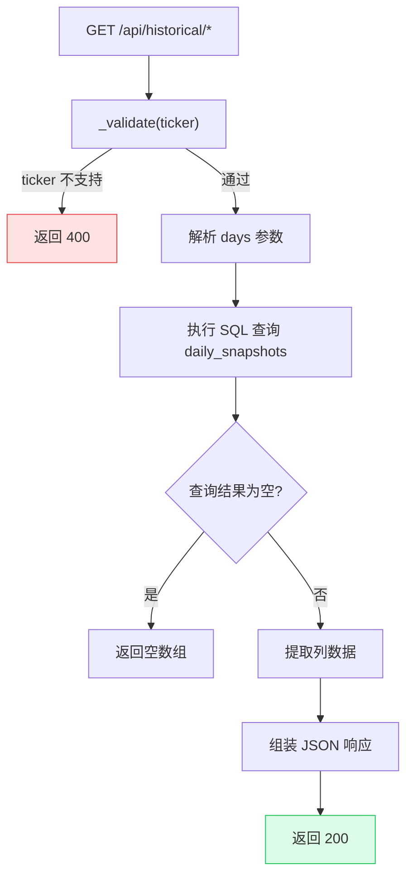
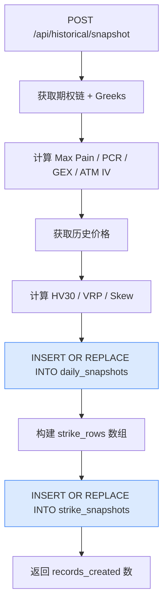

# Historical API

Historical API 提供历史趋势数据查询，数据来源于每日定时快照（`daily_snapshots` 表）。支持 Max Pain vs 价格、PCR/GEX 趋势、波动率和偏度等维度的历史分析。

## 历史数据查询流程



所有 GET 端点共享相同的 `_validate()` 函数：

```python
# backend/api/historical.py (第 26-29 行)
def _validate(ticker: str) -> tuple | None:
    if ticker not in Config.SUPPORTED_TICKERS:
        return ticker_not_supported(ticker)
    return None
```

## GET /api/historical/max-pain-vs-price

返回历史 Max Pain 和现货价格的对比数据，用于分析价格向 Max Pain 收敛的趋势。

**源码位置：** `backend/api/historical.py` 第 32-51 行

```python
# backend/api/historical.py (第 32-51 行)
@historical_bp.route("/api/historical/max-pain-vs-price", methods=["GET"])
def max_pain_vs_price():
    ticker = request.args.get("ticker", "SPY").upper()
    days = int(request.args.get("days", 90))
    err = _validate(ticker)
    if err:
        return err

    rows = db.execute(
        "SELECT date, spot_price, max_pain FROM daily_snapshots "
        "WHERE ticker = ? AND date >= date('now', ? || ' days') "
        "ORDER BY date ASC",
        (ticker, f"-{days}"),
    )
    return jsonify({
        "ticker": ticker,
        "dates": [r["date"] for r in rows],
        "prices": [r["spot_price"] for r in rows],
        "max_pains": [r["max_pain"] for r in rows],
    })
```

**SQL 查询：**

```sql
SELECT date, spot_price, max_pain FROM daily_snapshots
WHERE ticker = ? AND date >= date('now', ? || ' days')
ORDER BY date ASC
```

| 参数 | 说明 |
|------|------|
| `ticker` | 标的代码（如 `SPY`） |
| `-90` | 从今天往前推 90 天 |

**请求参数：**

| 参数 | 类型 | 必填 | 默认值 | 说明 |
|------|------|------|--------|------|
| `ticker` | string | 否 | `SPY` | 标的代码 |
| `days` | integer | 否 | `90` | 查询历史天数 |

**响应 (200)：**

```json
{
  "ticker": "SPY",
  "dates": ["2026-05-08", "2026-05-09", "2026-05-12", "2026-05-13"],
  "prices": [570.25, 572.80, 575.10, 578.45],
  "max_pains": [575.0, 575.0, 580.0, 580.0]
}
```

| 字段 | 类型 | 说明 |
|------|------|------|
| `ticker` | string | 标的代码 |
| `dates` | string[] | 日期数组，格式 `YYYY-MM-DD`，升序排列 |
| `prices` | number[] | 各日现货价格 |
| `max_pains` | number[] | 各日 Max Pain 行权价 |

---

## GET /api/historical/pcr-gex

返回历史 PCR 和 GEX 趋势数据，用于分析市场情绪和 Gamma 状态的变化。

**源码位置：** `backend/api/historical.py` 第 54-74 行

```python
# backend/api/historical.py (第 54-74 行)
@historical_bp.route("/api/historical/pcr-gex", methods=["GET"])
def pcr_gex_history():
    ticker = request.args.get("ticker", "SPY").upper()
    days = int(request.args.get("days", 90))
    err = _validate(ticker)
    if err:
        return err

    rows = db.execute(
        "SELECT date, pcr_volume, pcr_oi, gex FROM daily_snapshots "
        "WHERE ticker = ? AND date >= date('now', ? || ' days') "
        "ORDER BY date ASC",
        (ticker, f"-{days}"),
    )
    return jsonify({
        "ticker": ticker,
        "dates": [r["date"] for r in rows],
        "pcr_volume": [r["pcr_volume"] for r in rows],
        "pcr_oi": [r["pcr_oi"] for r in rows],
        "gex": [r["gex"] for r in rows],
    })
```

**SQL 查询：**

```sql
SELECT date, pcr_volume, pcr_oi, gex FROM daily_snapshots
WHERE ticker = ? AND date >= date('now', ? || ' days')
ORDER BY date ASC
```

**响应 (200)：**

```json
{
  "ticker": "SPY",
  "dates": ["2026-05-08", "2026-05-09", "2026-05-12"],
  "pcr_volume": [0.85, 0.92, 1.05],
  "pcr_oi": [0.92, 0.95, 1.10],
  "gex": [2500000000, 2200000000, -500000000]
}
```

| 字段 | 类型 | 说明 |
|------|------|------|
| `ticker` | string | 标的代码 |
| `dates` | string[] | 日期数组，升序排列 |
| `pcr_volume` | number[] | 各日成交量 PCR |
| `pcr_oi` | number[] | 各日持仓量 PCR |
| `gex` | number[] | 各日 GEX 值（美元） |

**数据说明：**
- GEX 符号变化（正转负或负转正）表示 Gamma 状态反转，是重要的市场结构信号
- PCR 持续高于 1.2 可能预示看跌情绪，持续低于 0.7 可能预示看涨情绪

---

## GET /api/historical/volatility

返回历史波动率指标，包括隐含波动率、历史波动率和波动率风险溢价。

**源码位置：** `backend/api/historical.py` 第 77-97 行

```python
# backend/api/historical.py (第 77-97 行)
@historical_bp.route("/api/historical/volatility", methods=["GET"])
def volatility_history():
    ticker = request.args.get("ticker", "SPY").upper()
    days = int(request.args.get("days", 90))
    err = _validate(ticker)
    if err:
        return err

    rows = db.execute(
        "SELECT date, atm_iv, hv30, vrp FROM daily_snapshots "
        "WHERE ticker = ? AND date >= date('now', ? || ' days') "
        "ORDER BY date ASC",
        (ticker, f"-{days}"),
    )
    return jsonify({
        "ticker": ticker,
        "dates": [r["date"] for r in rows],
        "atm_iv": [r["atm_iv"] for r in rows],
        "hv30": [r["hv30"] for r in rows],
        "vrp": [r["vrp"] for r in rows],
    })
```

**SQL 查询：**

```sql
SELECT date, atm_iv, hv30, vrp FROM daily_snapshots
WHERE ticker = ? AND date >= date('now', ? || ' days')
ORDER BY date ASC
```

**响应 (200)：**

```json
{
  "ticker": "SPY",
  "dates": ["2026-05-08", "2026-05-09", "2026-05-12"],
  "atm_iv": [0.185, 0.192, 0.210],
  "hv30": [0.152, 0.155, 0.160],
  "vrp": [0.033, 0.037, 0.050]
}
```

| 字段 | 类型 | 说明 |
|------|------|------|
| `ticker` | string | 标的代码 |
| `dates` | string[] | 日期数组，升序排列 |
| `atm_iv` | number[] | 各日平值隐含波动率（At-the-Money Implied Volatility） |
| `hv30` | number[] | 各日 30 日历史波动率（Historical Volatility 30-day） |
| `vrp` | number[] | 各日波动率风险溢价（Volatility Risk Premium = ATM IV - HV30） |

**指标说明：**
- **ATM IV** - 平值期权的隐含波动率，反映市场对未来波动的预期
- **HV30** - 过去 30 个交易日的实际波动率，反映历史波动水平
- **VRP** - 隐含波动率与历史波动率之差，通常为正值（市场倾向于高估波动率）

---

## GET /api/historical/skew

返回历史 25-Delta 偏度（Skew）数据，用于分析看涨/看跌期权的隐含波动率差异。

**源码位置：** `backend/api/historical.py` 第 100-118 行

```python
# backend/api/historical.py (第 100-118 行)
@historical_bp.route("/api/historical/skew", methods=["GET"])
def skew_history():
    ticker = request.args.get("ticker", "SPY").upper()
    days = int(request.args.get("days", 90))
    err = _validate(ticker)
    if err:
        return err

    rows = db.execute(
        "SELECT date, skew_25d FROM daily_snapshots "
        "WHERE ticker = ? AND date >= date('now', ? || ' days') "
        "ORDER BY date ASC",
        (ticker, f"-{days}"),
    )
    return jsonify({
        "ticker": ticker,
        "dates": [r["date"] for r in rows],
        "skew_25d": [r["skew_25d"] for r in rows],
    })
```

**SQL 查询：**

```sql
SELECT date, skew_25d FROM daily_snapshots
WHERE ticker = ? AND date >= date('now', ? || ' days')
ORDER BY date ASC
```

**响应 (200)：**

```json
{
  "ticker": "SPY",
  "dates": ["2026-05-08", "2026-05-09", "2026-05-12"],
  "skew_25d": [3.2, 3.5, 4.1]
}
```

| 字段 | 类型 | 说明 |
|------|------|------|
| `ticker` | string | 标的代码 |
| `dates` | string[] | 日期数组，升序排列 |
| `skew_25d` | number[] | 各日 25-Delta 偏度值 |

**指标说明：**
- 25-Delta Skew = 25-Delta Put IV - 25-Delta Call IV
- 正值表示看跌期权 IV 高于看涨期权（通常情况，市场对下行风险定价更高）
- Skew 扩大可能预示市场恐慌情绪上升

---

## POST /api/historical/snapshot

手动触发快照采集，将当前市场数据写入数据库。通常用于调试或补充缺失的每日快照。

**源码位置：** `backend/api/historical.py` 第 121-195 行

```python
# backend/api/historical.py (第 121-195 行)
@historical_bp.route("/api/historical/snapshot", methods=["POST"])
def take_snapshot():
    """Manually trigger a snapshot for a given ticker."""
    data = request.get_json(silent=True) or {}
    ticker = data.get("ticker", "SPY").upper()
    date_str = data.get("date", datetime.now(timezone.utc).strftime("%Y-%m-%d"))
    err = _validate(ticker)
    if err:
        return err

    try:
        # 1. 获取期权链并计算 Greeks
        chain = get_options_chain(ticker)
        chain = compute_chain_greeks(chain)
        calls = chain["calls"]
        puts = chain["puts"]
        spot = chain["spot_price"]

        # 2. 计算核心指标
        max_pain_result = calculate_max_pain(calls, puts)
        pcr_result = calculate_pcr(calls, puts)
        gex_result = calculate_gex(calls, puts, spot)
        atm_iv = calculate_atm_iv(calls, puts, spot)

        # 3. 计算波动率指标
        prices_df = get_historical_prices(ticker, period="90d")
        hv30 = calculate_hv(prices_df["Close"], window=30)
        vrp = calculate_vrp(atm_iv, hv30)
        skew = calculate_skew_25d(calls, puts, spot)

        # 4. 写入 daily_snapshots 表
        db.execute(
            """INSERT OR REPLACE INTO daily_snapshots
            (date, ticker, spot_price, max_pain, pcr_volume, pcr_oi, gex,
             atm_iv, hv30, vrp, skew_25d,
             total_call_volume, total_put_volume, total_call_oi, total_put_oi)
            VALUES (?, ?, ?, ?, ?, ?, ?, ?, ?, ?, ?, ?, ?, ?, ?)""",
            (date_str, ticker, spot,
             max_pain_result["max_pain_strike"],
             pcr_result["pcr_volume"], pcr_result["pcr_oi"],
             gex_result["value"], atm_iv, hv30, vrp, skew,
             pcr_result["total_call_volume"], pcr_result["total_put_volume"],
             pcr_result["total_call_oi"], pcr_result["total_put_oi"]),
        )

        # 5. 写入 strike_snapshots 表
        strike_rows = []
        for side_key, df in (("calls", calls), ("puts", puts)):
            for _, row in df.iterrows():
                strike_rows.append((
                    date_str, ticker, chain["expiration"],
                    safe_float(row["strike"]),
                    safe_int(row.get("open_interest")) if side_key == "calls" else 0,
                    safe_int(row.get("open_interest")) if side_key == "puts" else 0,
                    safe_int(row.get("volume")) if side_key == "calls" else 0,
                    safe_int(row.get("volume")) if side_key == "puts" else 0,
                    safe_float(row.get("implied_volatility")) if side_key == "calls" else 0.0,
                    safe_float(row.get("implied_volatility")) if side_key == "puts" else 0.0,
                    safe_float(row.get("gamma")) if side_key == "calls" else 0.0,
                    safe_float(row.get("gamma")) if side_key == "puts" else 0.0,
                    safe_float(row.get("delta")) if side_key == "calls" else 0.0,
                    safe_float(row.get("delta")) if side_key == "puts" else 0.0,
                ))

        db.execute_many(
            """INSERT OR REPLACE INTO strike_snapshots
            (date, ticker, expiration, strike,
             call_oi, put_oi, call_volume, put_volume,
             call_iv, put_iv, call_gamma, put_gamma, call_delta, put_delta)
            VALUES (?, ?, ?, ?, ?, ?, ?, ?, ?, ?, ?, ?, ?, ?)""",
            strike_rows,
        )

        return jsonify({
            "status": "ok", "ticker": ticker, "date": date_str,
            "records_created": len(strike_rows),
        })
    except Exception as e:
        logger.exception(f"Snapshot failed for {ticker}")
        return data_source_error(ticker, "snapshot", e)
```

**写入流程图：**



**请求方法：** `POST`

**请求头：** `Content-Type: application/json`

**请求体：**

| 字段 | 类型 | 必填 | 默认值 | 说明 |
|------|------|------|--------|------|
| `ticker` | string | 否 | `SPY` | 标的代码 |
| `date` | string | 否 | 当天日期 | 快照日期，格式 `YYYY-MM-DD` |

**响应 (200)：**

```json
{
  "status": "ok",
  "ticker": "SPY",
  "date": "2026-06-07",
  "records_created": 420
}
```

**注意：** 如果指定日期已存在快照，将使用 `INSERT OR REPLACE` 覆盖。

---

## 数据库表结构

历史数据存储在两张表中，定义于 `backend/database/schema.sql`：

```sql
-- backend/database/schema.sql (第 5-24 行)
CREATE TABLE IF NOT EXISTS daily_snapshots (
    id INTEGER PRIMARY KEY AUTOINCREMENT,
    date TEXT NOT NULL,                   -- YYYY-MM-DD
    ticker TEXT NOT NULL,
    spot_price REAL,
    max_pain REAL,
    pcr_volume REAL,                      -- Volume-based Put/Call Ratio
    pcr_oi REAL,                          -- OI-based Put/Call Ratio
    gex REAL,                             -- Gamma Exposure in USD
    atm_iv REAL,                          -- At-the-money implied volatility
    hv30 REAL,                            -- 30-day historical volatility
    vrp REAL,                             -- Volatility risk premium (IV - HV)
    skew_25d REAL,                        -- 25-Delta risk reversal
    total_call_volume INTEGER,
    total_put_volume INTEGER,
    total_call_oi INTEGER,
    total_put_oi INTEGER,
    created_at TIMESTAMP DEFAULT CURRENT_TIMESTAMP,
    UNIQUE(date, ticker)
);
```

```sql
-- backend/database/schema.sql (第 27-45 行)
CREATE TABLE IF NOT EXISTS strike_snapshots (
    id INTEGER PRIMARY KEY AUTOINCREMENT,
    date TEXT NOT NULL,
    ticker TEXT NOT NULL,
    expiration TEXT NOT NULL,              -- Expiration date YYYY-MM-DD
    strike REAL NOT NULL,
    call_oi INTEGER DEFAULT 0,
    put_oi INTEGER DEFAULT 0,
    call_volume INTEGER DEFAULT 0,
    put_volume INTEGER DEFAULT 0,
    call_iv REAL,
    put_iv REAL,
    call_gamma REAL,
    put_gamma REAL,
    call_delta REAL,
    put_delta REAL,
    created_at TIMESTAMP DEFAULT CURRENT_TIMESTAMP,
    UNIQUE(date, ticker, expiration, strike)
);
```

---

## 通用错误响应

所有 Historical API 端点共享以下错误场景：

**400 - 不支持的标的：**

```json
{
  "error": "unsupported_ticker",
  "message": "Ticker 'INVALID' is not supported. Supported: SPY, QQQ, IWM, TLT, XLF",
  "timestamp": "2026-06-07T12:00:00Z",
  "details": {
    "ticker": "INVALID",
    "supported": ["SPY", "QQQ", "IWM", "TLT", "XLF"]
  }
}
```

**502 - 数据源错误（仅 POST snapshot）：**

```json
{
  "error": "data_source_error",
  "message": "Failed to fetch snapshot for SPY: <error details>",
  "timestamp": "2026-06-07T12:00:00Z",
  "details": {
    "ticker": "SPY",
    "source": "snapshot",
    "reason": "<原始错误信息>"
  }
}
```

**注意事项：**
- GET 端点查询本地 SQLite 数据库，不依赖外部 API，响应速度很快（`< 100ms`）
- 如果数据库中没有历史数据（例如新部署），返回的数组为空
- POST snapshot 端点需要调用 yfinance，可能需要 1-5 秒
