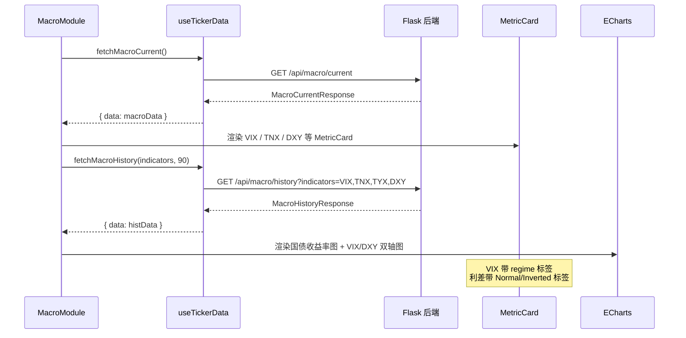

# Macro API

Macro API 提供宏观经济指标的实时快照和历史数据查询。指标数据来自 Yahoo Finance（yfinance），涵盖波动率指数、国债收益率、美元指数等关键宏观变量。

## 宏观指标端点流程

```mermaid
flowchart TD
    subgraph "GET /api/macro/current"
        A1["请求到达"] --> A2{"live_cache 有 MACRO/current?"}
        A2 -->|"有"| A3["返回缓存数据"]
        A2 -->|"无"| A4["get_macro_current()"]
        A4 --> A5["遍历 MACRO_SYMBOLS"]
        A5 --> A6["get_macro_indicator(symbol)"]
        A6 --> A7{"内存 TTL 缓存?"}
        A7 -->|"命中"| A8["返回缓存值"]
        A7 -->|"未命中"| A9["rate_limiter.wait()"]
        A9 --> A10["yf.Ticker(symbol).fast_info.last_price"]
        A10 --> A11["存入内存缓存"]
        A11 --> A12["计算 spread_10y3m = TNX - IRX"]
        A12 --> A13["返回 JSON"]
    end

    subgraph "GET /api/macro/history"
        B1["请求 indicators=VIX,TNX,SPREAD"] --> B2["验证指标名称"]
        B2 --> B3["遍历各指标"]
        B3 --> B4{"是 SPREAD?"}
        B4 -->|"是"| B5["分别获取 TNX 和 IRX 历史"]
        B5 --> B6["取交集日期计算利差"]
        B4 -->|"否"| B7["get_macro_history(symbol, period)"]
        B7 --> B8["yf.Ticker.history(period)"]
        B6 --> B9["按日期对齐所有指标"]
        B8 --> B9
        B9 --> B10["返回 JSON"]
    end

    style A3 fill:#dcfce7,stroke:#22c55e
    style A13 fill:#dcfce7,stroke:#22c55e
    style B10 fill:#dcfce7,stroke:#22c55e
```



## GET /api/macro/current

获取当前所有宏观经济指标的实时快照。

**源码位置：** `backend/api/macro.py` 第 23-37 行

```python
# backend/api/macro.py (第 23-37 行)
@macro_bp.route("/api/macro/current", methods=["GET"])
def macro_current():
    """Get current snapshot of all macro-economic indicators."""
    # 1. Try live cache
    cached = get_cached(MACRO_CACHE_TICKER, "current")
    if cached:
        return jsonify(cached)

    # 2. Fall back to direct fetch
    try:
        data = get_macro_current()
        return jsonify(data)
    except Exception as e:
        logger.exception("Macro current fetch failed")
        return data_source_error(MACRO_CACHE_TICKER, "macro_current", e)
```

**服务层实现** (`backend/services/macro_data.py` 第 44-66 行)：

```python
# backend/services/macro_data.py (第 44-66 行)
def get_macro_current() -> dict:
    """
    Fetch all macro indicators and compute derived values.
    Returns the full current snapshot.
    """
    indicators = {}
    for name, symbol in Config.MACRO_SYMBOLS.items():
        try:
            result = get_macro_indicator(symbol)
            indicators[name.lower()] = result["value"]
        except Exception as e:
            logger.error(f"Macro indicator {name} ({symbol}) failed: {e}")
            indicators[name.lower()] = None

    # Compute 10Y-3M spread
    tnx_val = indicators.get("tnx")
    irx_val = indicators.get("irx")
    indicators["spread_10y3m"] = (
        round(tnx_val - irx_val, 2)
        if (tnx_val is not None and irx_val is not None)
        else None
    )

    return {
        "indicators": indicators,
        "updated_at": datetime.now(timezone.utc).isoformat(),
    }
```

**单指标获取** (`backend/services/macro_data.py` 第 18-41 行)：

```python
# backend/services/macro_data.py (第 18-41 行)
def get_macro_indicator(symbol: str) -> dict:
    """Get the current value for a single macro indicator symbol."""
    cache_key = f"macro:{symbol}"
    cached = cache.get(cache_key)
    if cached:
        return cached

    rate_limiter.wait()
    t = yf.Ticker(symbol)

    try:
        price = float(t.fast_info.last_price)
        result = {
            "symbol": symbol,
            "value": round(price, 2),
            "updated_at": datetime.now(timezone.utc).isoformat(),
        }
        cache.set(cache_key, result)
        return result
    except Exception as e:
        logger.warning(f"Failed to fetch macro indicator {symbol}: {e}")
        if cached:
            return cached
        raise
```

**请求参数：** 无

**响应 (200)：**

```json
{
  "indicators": {
    "vix": 18.5,
    "tnx": 4.25,
    "tyx": 4.55,
    "irx": 4.10,
    "dxy": 102.3,
    "vvix": 92.5,
    "spread_10y3m": 0.15
  },
  "updated_at": "2026-06-07T12:00:00Z"
}
```

**字段说明：**

| 字段 | 类型 | 说明 |
|------|------|------|
| `indicators` | object | 指标键值对 |
| `indicators.vix` | number | CBOE 波动率指数 |
| `indicators.tnx` | number | 10 年期美国国债收益率 |
| `indicators.tyx` | number | 30 年期美国国债收益率 |
| `indicators.irx` | number | 3 个月期美国国债收益率 |
| `indicators.dxy` | number | 美元指数 |
| `indicators.vvix` | number | VIX 的波动率指数（VIX of VIX） |
| `indicators.spread_10y3m` | number | 10Y-3M 收益率利差（服务端计算：TNX - IRX） |
| `updated_at` | string | 数据更新时间 |

**指标与 yfinance 符号映射：**

配置定义在 `backend/config.py` 第 61-68 行：

```python
# backend/config.py (第 61-68 行)
MACRO_SYMBOLS = {
    "VIX": "^VIX",
    "TNX": "^TNX",
    "TYX": "^TYX",
    "IRX": "^IRX",
    "DXY": "DX-Y.NYB",
    "VVIX": "^VVIX",
}
```

| 字段名 | yfinance 符号 | 描述 | 典型范围 |
|--------|-------------|------|----------|
| `vix` | `^VIX` | CBOE 波动率指数 | 12-30 |
| `tnx` | `^TNX` | 10 年期国债收益率 (%) | 3.5-5.0 |
| `tyx` | `^TYX` | 30 年期国债收益率 (%) | 4.0-5.5 |
| `irx` | `^IRX` | 3 个月期国债收益率 (%) | 4.0-5.5 |
| `dxy` | `DX-Y.NYB` | 美元指数 | 95-110 |
| `vvix` | `^VVIX` | VIX 的波动率指数 | 80-120 |

**10Y-3M 利差 (spread_10y3m)：**

```
spread_10y3m = TNX - IRX
```

- 正值表示正常期限结构（长期收益率高于短期）
- 负值表示收益率曲线倒挂，通常被视为经济衰退的先行指标

---

## GET /api/macro/history

获取指定宏观经济指标的历史时间序列数据。支持查询单个或多个指标，自动按日期对齐。

**源码位置：** `backend/api/macro.py` 第 40-100 行

```python
# backend/api/macro.py (第 40-100 行)
@macro_bp.route("/api/macro/history", methods=["GET"])
def macro_history():
    """Get historical time series for requested macro indicators."""
    indicators_str = request.args.get("indicators", "VIX").upper()
    days = int(request.args.get("days", 90))

    # 1. 解析并验证指标名称
    requested = [name.strip() for name in indicators_str.split(",") if name.strip()]
    valid_indicators = []
    for name in requested:
        if name == "SPREAD":
            valid_indicators.append(name)
        elif name in Config.MACRO_SYMBOLS:
            valid_indicators.append(name)

    if not valid_indicators:
        return error_response(
            "invalid_indicators",
            f"No valid indicators in: {indicators_str}. Valid: {list(Config.MACRO_SYMBOLS.keys())}, SPREAD",
            status=400,
        )

    try:
        # 2. 获取各指标的历史数据
        series = {}
        all_dates = set()

        for name in valid_indicators:
            if name == "SPREAD":
                # SPREAD 需要分别获取 TNX 和 IRX 后计算
                tnx_df = get_macro_history(Config.MACRO_SYMBOLS["TNX"], f"{days}d")
                irx_df = get_macro_history(Config.MACRO_SYMBOLS["IRX"], f"{days}d")
                common = tnx_df.index.intersection(irx_df.index)
                values = {}
                for dt in common:
                    values[dt.strftime("%Y-%m-%d")] = round(
                        float(tnx_df.loc[dt, "Close"]) - float(irx_df.loc[dt, "Close"]), 2
                    )
                series["spread"] = values
                all_dates.update(values.keys())
            else:
                symbol = Config.MACRO_SYMBOLS[name]
                df = get_macro_history(symbol, f"{days}d")
                values = {}
                for dt in df.index:
                    values[dt.strftime("%Y-%m-%d")] = round(float(df.loc[dt, "Close"]), 2)
                series[name.lower()] = values
                all_dates.update(values.keys())

        # 3. 按日期对齐所有指标
        sorted_dates = sorted(all_dates)
        response = {
            "indicators": [
                name.lower() if name != "SPREAD" else "spread"
                for name in valid_indicators
            ],
            "dates": sorted_dates,
        }

        for key, date_map in series.items():
            response[key] = [date_map.get(d) for d in sorted_dates]

        response["updated_at"] = datetime.now(timezone.utc).isoformat()
        return jsonify(response)

    except Exception as e:
        logger.exception("Macro history fetch failed")
        return data_source_error(MACRO_CACHE_TICKER, "macro_history", e)
```

**历史数据获取服务** (`backend/services/macro_data.py` 第 69-87 行)：

```python
# backend/services/macro_data.py (第 69-87 行)
def get_macro_history(symbol: str, period: str = "90d") -> pd.DataFrame:
    """Get historical OHLCV data for a macro indicator."""
    cache_key = f"macro_hist:{symbol}:{period}"
    cached = cache.get(cache_key)
    if cached is not None:
        return cached

    rate_limiter.wait()
    t = yf.Ticker(symbol)

    try:
        df = t.history(period=period)
        cache.set(cache_key, df)
        return df
    except Exception as e:
        logger.warning(f"Failed to get macro history for {symbol}: {e}")
        if cached is not None:
            return cached
        raise
```

**请求参数：**

| 参数 | 类型 | 必填 | 默认值 | 说明 |
|------|------|------|--------|------|
| `indicators` | string | 否 | `VIX` | 逗号分隔的指标名称列表 |
| `days` | integer | 否 | `90` | 历史天数 |

**可选指标值：**
- `VIX` - CBOE 波动率指数
- `TNX` - 10 年期国债收益率
- `TYX` - 30 年期国债收益率
- `IRX` - 3 个月期国债收益率
- `DXY` - 美元指数
- `VVIX` - VIX 的波动率指数
- `SPREAD` - 10Y-3M 利差（服务端计算，由 TNX 和 IRX 推导）

**SPREAD 特殊处理：**

当请求包含 `SPREAD` 时，服务端会分别获取 TNX 和 IRX 的历史数据，取交集日期后计算利差：

```python
# backend/api/macro.py (第 67-75 行)
if name == "SPREAD":
    tnx_df = get_macro_history(Config.MACRO_SYMBOLS["TNX"], f"{days}d")
    irx_df = get_macro_history(Config.MACRO_SYMBOLS["IRX"], f"{days}d")
    common = tnx_df.index.intersection(irx_df.index)
    values = {}
    for dt in common:
        values[dt.strftime("%Y-%m-%d")] = round(
            float(tnx_df.loc[dt, "Close"]) - float(irx_df.loc[dt, "Close"]), 2
        )
    series["spread"] = values
```

**请求示例：**

```
GET /api/macro/history?indicators=VIX,TNX,SPREAD&days=30
```

**响应 (200)：**

```json
{
  "indicators": ["vix", "tnx", "spread"],
  "dates": ["2026-05-08", "2026-05-09", "2026-05-12"],
  "vix": [18.5, 19.2, 17.8],
  "tnx": [4.25, 4.28, 4.22],
  "spread": [0.15, 0.13, 0.12],
  "updated_at": "2026-06-07T12:00:00Z"
}
```

**错误响应：**

```json
// 400 - 无效指标
{
  "error": "invalid_indicators",
  "message": "No valid indicators in: INVALID1,INVALID2. Valid: ['VIX', 'TNX', 'TYX', 'IRX', 'DXY', 'VVIX'], SPREAD",
  "timestamp": "2026-06-07T12:00:00Z"
}
```

**缓存行为：** 每个指标的历史数据通过 yfinance TTL 缓存（5 分钟）加速。多个指标的请求会分别缓存，组合结果时按日期对齐。

## 前端宏观指标展示


