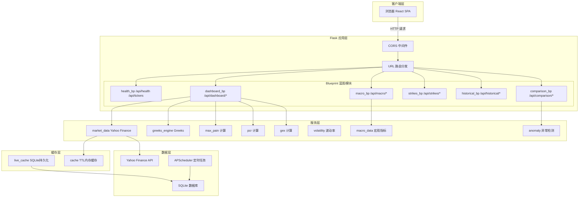
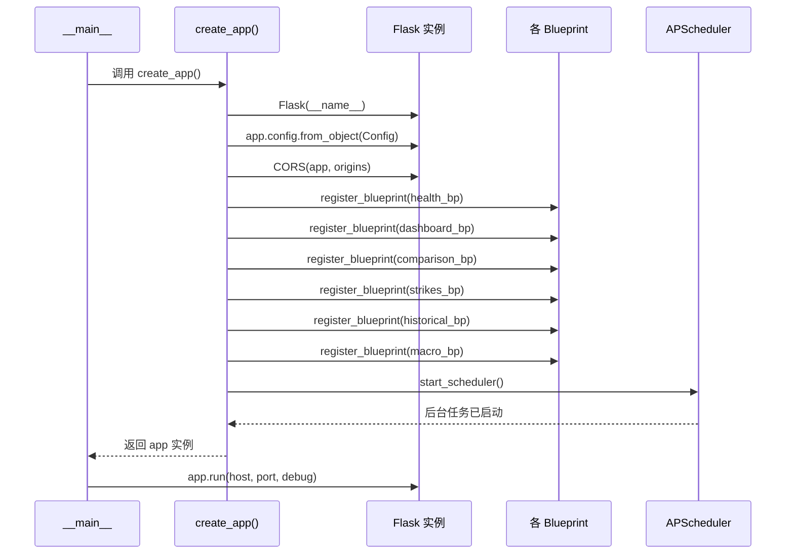
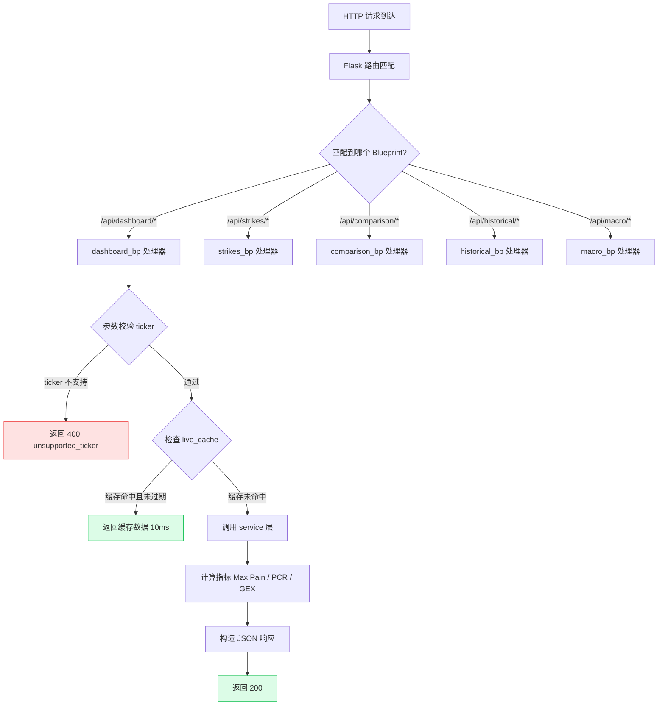
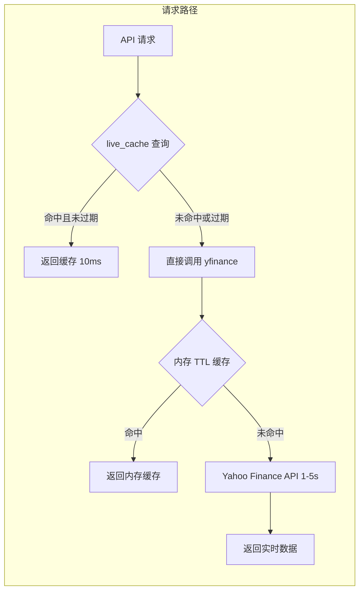

# API 架构总览

本文档描述 OptionDash 后端 API 的整体架构设计、请求处理流程和蓝图注册机制。

## 基础信息

| 项目 | 值 |
|------|-----|
| Base URL | `http://localhost:5001/api` |
| Content-Type | `application/json` |
| 协议 | HTTP / HTTPS |
| 编码 | UTF-8 |

所有 API 响应均为 JSON 格式。错误响应遵循统一的错误结构。

## 整体架构图

OptionDash 后端基于 **Flask** 框架构建，采用**应用工厂模式**（Application Factory Pattern）组织代码。所有 API 端点通过 Flask Blueprint（蓝图）注册，按功能模块划分。



## 应用工厂函数

应用入口位于 `backend/app.py`，使用工厂函数 `create_app()` 创建 Flask 实例：

```python
# backend/app.py (第 23-51 行)
def create_app() -> Flask:
    """Application factory."""
    app = Flask(__name__)
    app.config.from_object(Config)

    # CORS — 允许前端开发服务器跨域请求
    CORS(app, origins=Config.CORS_ORIGINS)

    # Register blueprints — 按功能模块注册蓝图
    app.register_blueprint(health_bp)
    app.register_blueprint(dashboard_bp)
    app.register_blueprint(comparison_bp)
    app.register_blueprint(strikes_bp)
    app.register_blueprint(historical_bp)
    app.register_blueprint(macro_bp)

    # Logging — 根据 DEBUG 模式设置日志级别
    logging.basicConfig(
        level=logging.DEBUG if Config.DEBUG else logging.INFO,
        format="%(asctime)s [%(levelname)s] %(name)s: %(message)s",
    )

    # Start background scheduler for daily snapshots
    try:
        start_scheduler()
    except Exception:
        logging.getLogger(__name__).warning(
            "Scheduler start failed (may already be running)"
        )

    return app
```

**关键设计要点：**

| 要点 | 说明 |
|------|------|
| 应用工厂模式 | `create_app()` 返回 `Flask` 实例，便于测试和多实例部署 |
| 配置外部化 | `Config` 类从环境变量读取所有配置，参见 `backend/config.py` |
| CORS 跨域 | 允许前端开发服务器 (`localhost:5173`) 跨域请求 |
| 蓝图分组 | 每个功能模块一个 Blueprint，独立管理路由和错误处理 |
| 后台调度器 | 应用启动时自动开启 APScheduler 定时任务（快照 + 轮询） |

## Blueprint 蓝图注册流程



## API 分组

| 分组 | 前缀 | 端点数 | 说明 |
|------|------|--------|------|
| Health | `/api/health`, `/api/tickers` | 2 | 健康检查与配置 |
| Dashboard | `/api/dashboard/*` | 2 | 核心指标概览 |
| Strikes | `/api/strikes/*` | 3 | 行权价级别分析 |
| Comparison | `/api/comparison/*` | 1 | 多标的对比 |
| Historical | `/api/historical/*` | 5 | 历史趋势数据 |
| Macro | `/api/macro/*` | 2 | 宏观经济指标 |
| **合计** | | **15** | |

## 请求处理流程

每个 API 请求经过以下处理链：



## 通用查询参数

| 参数 | 类型 | 默认值 | 说明 |
|------|------|--------|------|
| `ticker` | string | `SPY` | 股票/ETF 代码，需在 `SUPPORTED_TICKERS` 配置中 |
| `expiration` | string | 最近到期日 | 期权到期日，格式 `YYYY-MM-DD` |
| `days` | integer | `90` | 历史数据查询天数 |

## CORS 中间件配置

跨域资源共享（CORS）配置位于 `backend/config.py` 第 44-45 行：

```python
# backend/config.py (第 44-45 行)
# CORS
CORS_ORIGINS = os.environ.get("CORS_ORIGINS", "http://localhost:5173").split(",")
```

在应用工厂中启用：

```python
# backend/app.py (第 29 行)
CORS(app, origins=Config.CORS_ORIGINS)
```

前端开发服务器 (`localhost:5173`) 可以向后端 (`localhost:5001`) 发起跨域请求。在生产环境中，通过环境变量 `CORS_ORIGINS` 设置允许的前端域名。

## 全局配置项

所有可配置项定义在 `backend/config.py` 的 `Config` 类中：

```python
# backend/config.py (第 10-68 行)
class Config:
    """Base configuration."""

    # 数据库路径
    DATABASE_PATH = os.environ.get(
        "OPTIONDASH_DB", os.path.join(BASE_DIR, "data", "optiondash.db")
    )

    # 支持的标的列表（逗号分隔）
    SUPPORTED_TICKERS = [
        t.strip().upper()
        for t in os.environ.get(
            "SUPPORTED_TICKERS", "SPY,QQQ,IWM,TLT,XLF"
        ).split(",")
        if t.strip()
    ]

    # 内存缓存 TTL（秒）
    CACHE_TTL = int(os.environ.get("CACHE_TTL", 300))

    # 速率限制（每秒请求数）
    RATE_LIMIT_RPS = float(os.environ.get("RATE_LIMIT_RPS", 2.0))

    # 无风险利率（年化，用于 Black-Scholes）
    RISK_FREE_RATE = float(os.environ.get("RISK_FREE_RATE", 0.0525))

    # 宏观经济指标符号映射
    MACRO_SYMBOLS = {
        "VIX": "^VIX",
        "TNX": "^TNX",
        "TYX": "^TYX",
        "IRX": "^IRX",
        "DXY": "DX-Y.NYB",
        "VVIX": "^VVIX",
    }
```

| 配置项 | 默认值 | 说明 |
|--------|--------|------|
| `DATABASE_PATH` | `data/optiondash.db` | SQLite 数据库文件路径 |
| `SUPPORTED_TICKERS` | `SPY,QQQ,IWM,TLT,XLF` | 支持的标的列表 |
| `CACHE_TTL` | `300` (5分钟) | 内存缓存过期时间 |
| `CACHE_MAX_SIZE` | `128` | 内存缓存最大条目数 |
| `RATE_LIMIT_RPS` | `2.0` | 对 yfinance 的请求速率限制 |
| `RISK_FREE_RATE` | `0.0525` (5.25%) | Black-Scholes 无风险利率 |
| `POLL_INTERVAL_SEC` | `300` (5分钟) | 后台轮询间隔 |
| `LIVE_CACHE_TTL_SEC` | `600` (10分钟) | 持久化缓存过期时间 |
| `SNAPSHOT_HOUR` | `16` | 每日快照时间（小时，ET） |
| `SNAPSHOT_MINUTE` | `30` | 每日快照时间（分钟） |

## 支持的标的

默认支持以下标的，可通过环境变量 `SUPPORTED_TICKERS` 配置：

- `SPY` - S&P 500 ETF
- `QQQ` - 纳斯达克 100 ETF
- `IWM` - 罗素 2000 ETF
- `TLT` - 20+ 年美国国债 ETF
- `XLF` - 金融板块 ETF

## 缓存策略

系统采用两层缓存加速响应：



1. **实时缓存 (Live Cache)** - 后台定时轮询器每 5 分钟刷新数据，存入 SQLite `live_cache` 表，TTL 为 10 分钟。
2. **TTL 内存缓存** - yfinance 请求结果缓存 5 分钟（`CACHE_TTL=300`），避免频繁调用外部 API。

| 场景 | 响应时间 |
|------|----------|
| 命中 live_cache | `< 10ms` |
| 命中内存 TTL 缓存 | `< 50ms` |
| 直接调用 yfinance | `1-5s` |
| 历史数据库查询 | `< 100ms` |

## 通用错误格式

所有错误响应遵循以下结构：

```json
{
  "error": "ERROR_CODE",
  "message": "人类可读的错误描述",
  "timestamp": "2026-06-07T12:00:00Z",
  "details": {
    "ticker": "INVALID",
    "source": "yfinance"
  }
}
```

| 字段 | 类型 | 说明 |
|------|------|------|
| `error` | string | 错误代码，大写蛇形命名 |
| `message` | string | 错误描述信息 |
| `timestamp` | string | ISO 8601 UTC 时间戳 |
| `details` | object | 可选，包含额外上下文信息 |

完整的错误代码和处理方式请参阅 [错误处理](./errors.md)。

## 认证

当前 API 不需要认证。CORS 已配置，仅允许来自 `http://localhost:5173`（Vite 开发服务器）的跨域请求。

## API 端点汇总

| 模块 | 端点 | 方法 | 说明 |
|------|------|------|------|
| Health | `/api/health` | GET | 健康检查 |
| Health | `/api/tickers` | GET | 获取支持的标的列表 |
| Dashboard | `/api/dashboard/summary` | GET | 核心指标概览 |
| Dashboard | `/api/dashboard/expirations` | GET | 获取到期日列表 |
| Strikes | `/api/strikes/oi-wall` | GET | OI 墙分布 |
| Strikes | `/api/strikes/max-pain-curve` | GET | Max Pain 曲线 |
| Strikes | `/api/strikes/gex-distribution` | GET | GEX 分布 |
| Comparison | `/api/comparison/overview` | GET | 多标的对比 |
| Historical | `/api/historical/max-pain-vs-price` | GET | 历史 Max Pain vs 价格 |
| Historical | `/api/historical/pcr-gex` | GET | 历史 PCR/GEX 趋势 |
| Historical | `/api/historical/volatility` | GET | 历史波动率 |
| Historical | `/api/historical/skew` | GET | 历史 25D Skew |
| Historical | `/api/historical/snapshot` | POST | 手动触发快照 |
| Macro | `/api/macro/current` | GET | 当前宏观指标 |
| Macro | `/api/macro/history` | GET | 历史宏观指标 |
