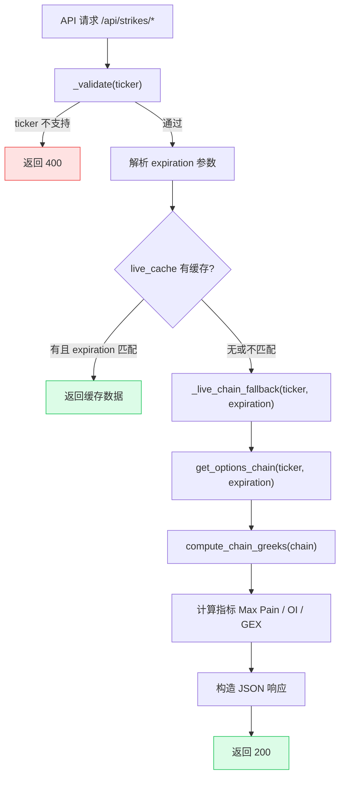
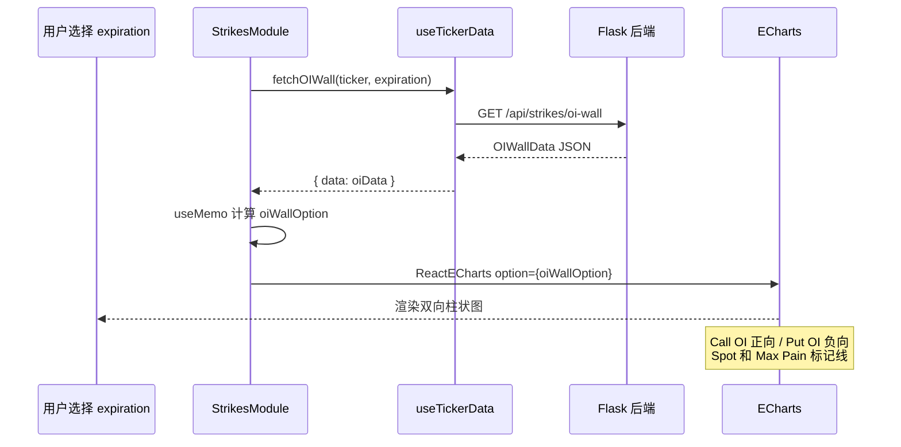

# Strikes API

Strikes API 提供行权价级别的期权数据分析，包括 OI 墙（OI Wall）、Max Pain 曲线和 GEX 分布。所有端点共享相同的请求验证和缓存回退逻辑。

## 端点处理流程



## OI Wall 前端渲染流程



## 共享辅助函数

三个端点共享两个辅助函数，定义在 `backend/api/strikes.py` 中。

### _validate() 参数校验

**源码位置：** `backend/api/strikes.py` 第 22-25 行

```python
# backend/api/strikes.py (第 22-25 行)
def _validate(ticker: str) -> tuple | None:
    if ticker not in Config.SUPPORTED_TICKERS:
        return ticker_not_supported(ticker)
    return None
```

**作用：** 检查 ticker 是否在 `Config.SUPPORTED_TICKERS` 列表中。如果不在，返回 `(jsonify(payload), status_code)` 元组；如果在，返回 `None`。

调用方通过判断返回值决定是否提前返回错误：

```python
err = _validate(ticker)
if err:
    return err  # 提前返回 400 错误
```

### _live_chain_fallback() 数据获取

**源码位置：** `backend/api/strikes.py` 第 28-35 行

```python
# backend/api/strikes.py (第 28-35 行)
def _live_chain_fallback(ticker: str, expiration: str | None):
    """Get option chain data via live cache or direct yfinance fallback."""
    if expiration is None:
        # Use the cached chain with whatever expiration the poller picked
        chain = get_options_chain(ticker, expiration)
        return compute_chain_greeks(chain)
    chain = get_options_chain(ticker, expiration)
    return compute_chain_greeks(chain)
```

**作用：** 封装了获取期权链数据并计算 Greeks 的统一流程。无论 `expiration` 是否为 `None`，都经过 `get_options_chain()` -> `compute_chain_greeks()` 的调用链。当 `expiration` 为 `None` 时，`get_options_chain()` 内部会自动选择最近的到期日。

### _col() 列名查找

**源码位置：** `backend/api/strikes.py` 第 134-138 行

```python
# backend/api/strikes.py (第 134-138 行)
def _col(df, candidates):
    for c in candidates:
        if c in df.columns:
            return c
    raise KeyError(f"None of {candidates} in {df.columns.tolist()}")
```

**作用：** 在 DataFrame 列名中查找匹配的列名，用于兼容 yfinance 不同版本的列名差异（如 `open_interest` vs `openInterest`）。

## GET /api/strikes/oi-wall

返回各行权价的看涨/看跌期权持仓量（OI）数据，用于绘制双向柱状图（OI Wall）。

**请求参数：**

| 参数 | 类型 | 必填 | 默认值 | 说明 |
|------|------|------|--------|------|
| `ticker` | string | 否 | `SPY` | 标的代码 |
| `expiration` | string | 否 | 最近到期日 | 到期日，格式 `YYYY-MM-DD` |

### 完整处理器代码

**源码位置：** `backend/api/strikes.py` 第 38-75 行

```python
# backend/api/strikes.py (第 38-75 行)
@strikes_bp.route("/api/strikes/oi-wall", methods=["GET"])
def oi_wall():
    ticker = request.args.get("ticker", "SPY").upper()
    expiration = request.args.get("expiration")

    # 1. 参数校验
    err = _validate(ticker)
    if err:
        return err

    # 2. 尝试 live_cache
    cached = get_cached(ticker, "oi_wall")
    if cached and (not expiration or cached.get("expiration") == expiration):
        return jsonify(cached)

    try:
        # 3. 获取期权链 + Greeks
        chain = _live_chain_fallback(ticker, expiration)
        max_pain_result = calculate_max_pain(chain["calls"], chain["puts"])
        chain = compute_chain_greeks(chain)

        # 4. 提取 OI 列（兼容不同列名）
        oi_col_c = _col(chain["calls"], ("open_interest",))
        oi_col_p = _col(chain["puts"], ("open_interest",))

        # 5. 合并所有行权价并排序
        all_strikes = sorted(
            set(chain["calls"]["strike"].tolist()) | set(chain["puts"]["strike"].tolist())
        )

        # 6. 构建行权价 -> OI 映射
        call_oi_map = dict(zip(chain["calls"]["strike"], chain["calls"][oi_col_c].fillna(0)))
        put_oi_map = dict(zip(chain["puts"]["strike"], chain["puts"][oi_col_p].fillna(0)))

        # 7. 返回响应
        return jsonify({
            "ticker": ticker,
            "expiration": chain["expiration"],
            "spot_price": chain["spot_price"],
            "max_pain": max_pain_result["max_pain_strike"],
            "strikes": [round(s, 2) for s in all_strikes],
            "call_oi": [int(call_oi_map.get(s, 0)) for s in all_strikes],
            "put_oi": [int(put_oi_map.get(s, 0)) for s in all_strikes],
        })
    except Exception as e:
        logger.exception(f"OI wall fetch failed for {ticker}")
        return data_source_error(ticker, "oi_wall", e)
```

**响应 (200)：**

```json
{
  "ticker": "SPY",
  "expiration": "2026-06-20",
  "spot_price": 585.42,
  "max_pain": 585.0,
  "strikes": [570, 575, 580, 585, 590, 595, 600],
  "call_oi": [15000, 22000, 35000, 42000, 38000, 25000, 18000],
  "put_oi": [20000, 28000, 32000, 45000, 40000, 30000, 22000]
}
```

| 字段 | 类型 | 说明 |
|------|------|------|
| `ticker` | string | 标的代码 |
| `expiration` | string | 到期日 |
| `spot_price` | number | 当前现货价格 |
| `max_pain` | number | Max Pain 行权价 |
| `strikes` | number[] | 行权价数组，升序排列 |
| `call_oi` | number[] | 各行权价的看涨期权持仓量 |
| `put_oi` | number[] | 各行权价的看跌期权持仓量 |

**数据说明：**
- `strikes` 为看涨和看跌期权行权价的并集，按升序排列
- `call_oi` 和 `put_oi` 中缺失的行权价默认为 0
- 前端通常将此数据绘制为以现货价格为中心的双向水平柱状图

## GET /api/strikes/max-pain-curve

返回各行权价对应的期权买方总损失，用于绘制 Max Pain 曲线。

**源码位置：** `backend/api/strikes.py` 第 78-102 行

```python
# backend/api/strikes.py (第 78-102 行)
@strikes_bp.route("/api/strikes/max-pain-curve", methods=["GET"])
def max_pain_curve():
    ticker = request.args.get("ticker", "SPY").upper()
    expiration = request.args.get("expiration")
    err = _validate(ticker)
    if err:
        return err

    cached = get_cached(ticker, "max_pain_curve")
    if cached and (not expiration or cached.get("expiration") == expiration):
        return jsonify(cached)

    try:
        chain = _live_chain_fallback(ticker, expiration)
        max_pain_result = calculate_max_pain(chain["calls"], chain["puts"])
        return jsonify({
            "ticker": ticker,
            "expiration": chain["expiration"],
            "strikes": max_pain_result["strikes"],
            "total_loss": max_pain_result["total_loss"],
            "max_pain_strike": max_pain_result["max_pain_strike"],
        })
    except Exception as e:
        logger.exception(f"Max pain curve failed for {ticker}")
        return data_source_error(ticker, "max_pain_curve", e)
```

**响应 (200)：**

```json
{
  "ticker": "SPY",
  "expiration": "2026-06-20",
  "strikes": [570, 575, 580, 585, 590, 595, 600],
  "total_loss": [125000000, 89000000, 52000000, 35000000, 48000000, 78000000, 115000000],
  "max_pain_strike": 585
}
```

| 字段 | 类型 | 说明 |
|------|------|------|
| `ticker` | string | 标的代码 |
| `expiration` | string | 到期日 |
| `strikes` | number[] | 行权价数组 |
| `total_loss` | number[] | 各行权价下期权买方的总损失（美元） |
| `max_pain_strike` | number | Max Pain 行权价（总损失最小的点） |

## GET /api/strikes/gex-distribution

返回各行权价的净 Gamma Exposure 分布，用于绘制 GEX 分布图。

**源码位置：** `backend/api/strikes.py` 第 105-131 行

```python
# backend/api/strikes.py (第 105-131 行)
@strikes_bp.route("/api/strikes/gex-distribution", methods=["GET"])
def gex_distribution():
    ticker = request.args.get("ticker", "SPY").upper()
    expiration = request.args.get("expiration")
    err = _validate(ticker)
    if err:
        return err

    cached = get_cached(ticker, "gex_distribution")
    if cached and (not expiration or cached.get("expiration") == expiration):
        return jsonify(cached)

    try:
        chain = _live_chain_fallback(ticker, expiration)
        chain = compute_chain_greeks(chain)
        dist = calculate_gex_distribution(chain["calls"], chain["puts"], chain["spot_price"])
        return jsonify({
            "ticker": ticker,
            "expiration": chain["expiration"],
            "spot_price": chain["spot_price"],
            "strikes": dist["strikes"],
            "gex_per_strike": dist["gex_per_strike"],
            "total_gex": dist["total_gex"],
        })
    except Exception as e:
        logger.exception(f"GEX distribution failed for {ticker}")
        return data_source_error(ticker, "gex_distribution", e)
```

**响应 (200)：**

```json
{
  "ticker": "SPY",
  "expiration": "2026-06-20",
  "spot_price": 585.42,
  "strikes": [570, 575, 580, 585, 590, 595, 600],
  "gex_per_strike": [-5000000, -2000000, 3000000, 8000000, 5000000, -1000000, -4000000],
  "total_gex": 4000000
}
```

| 字段 | 类型 | 说明 |
|------|------|------|
| `ticker` | string | 标的代码 |
| `expiration` | string | 到期日 |
| `spot_price` | number | 当前现货价格 |
| `strikes` | number[] | 行权价数组 |
| `gex_per_strike` | number[] | 各行权价的净 GEX（美元） |
| `total_gex` | number | 所有行权价 GEX 之和 |

**GEX 计算逻辑：**

```
call_gex = -call_OI x call_gamma x 100 x spot_price
put_gex  = +put_OI  x put_gamma  x 100 x spot_price
net_gex  = call_gex + put_gex
```

- 看涨期权 GEX 取负号（做市商视角，卖出看涨为做空 Gamma）
- 看跌期权 GEX 取正号（做市商买入看跌为做多 Gamma）
- 乘以 100 是因为每张期权合约对应 100 股

## 通用错误响应

所有 Strikes API 端点共享以下错误场景：

**400 - 不支持的标的：**

```json
{
  "error": "unsupported_ticker",
  "message": "Ticker 'INVALID' is not supported. Supported: SPY, QQQ, IWM, TLT, XLF",
  "timestamp": "2026-06-07T12:00:00Z",
  "details": {
    "ticker": "INVALID",
    "supported": ["SPY", "QQQ", "IWM", "TLT", "XLF"]
  }
}
```

**502 - 数据源错误：**

```json
{
  "error": "data_source_error",
  "message": "Failed to fetch gex_distribution for SPY: <error details>",
  "timestamp": "2026-06-07T12:00:00Z",
  "details": {
    "ticker": "SPY",
    "source": "gex_distribution",
    "reason": "<原始错误信息>"
  }
}
```

**缓存行为：** 三个端点均支持实时缓存。如果请求指定了 `expiration` 但缓存中的到期日不匹配，则绕过缓存直接获取数据。
