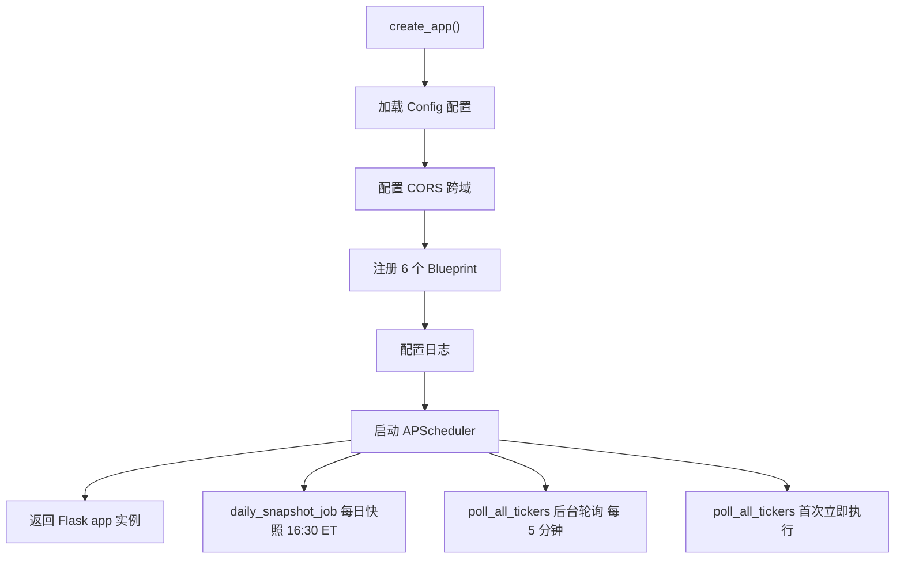
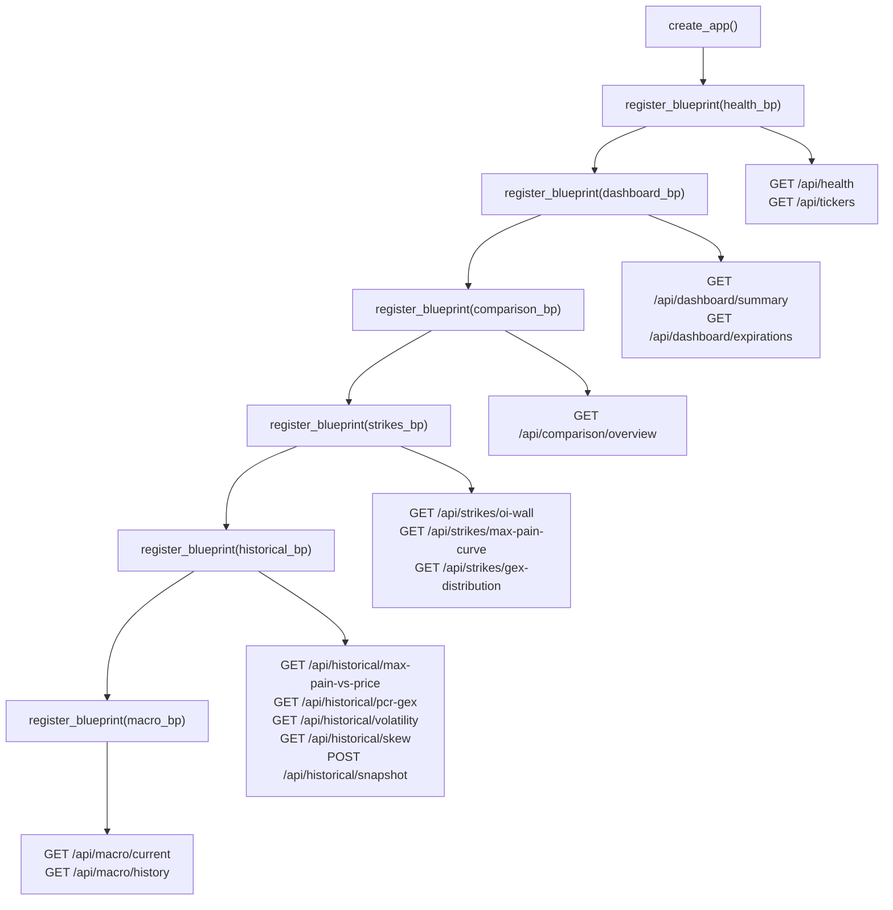
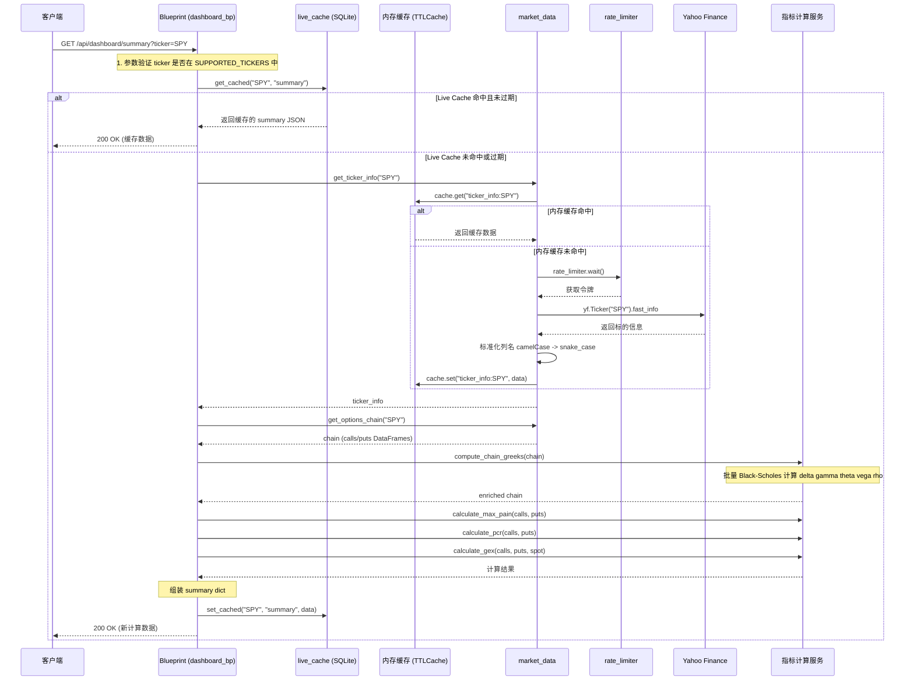
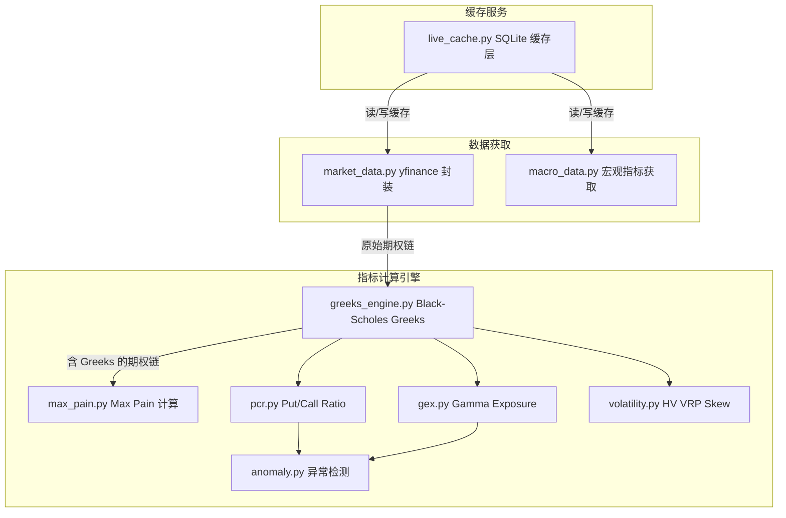
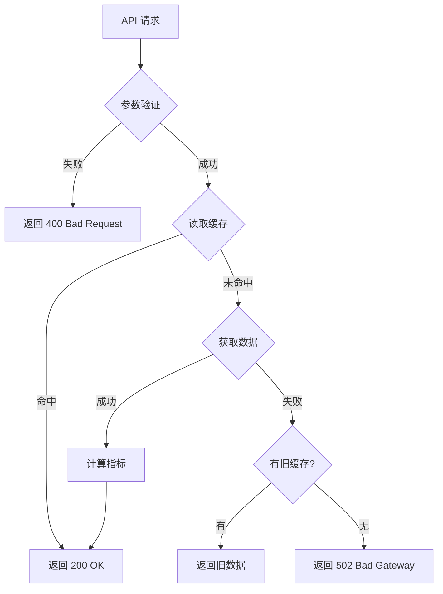

# 后端架构

OptionDash 后端采用 Flask 应用工厂模式，通过 Blueprint 组织路由，服务层封装业务逻辑，工具层提供缓存与速率控制等基础设施。本页将逐层深入讲解后端的每个组件。

---

## 应用工厂模式

Flask 应用通过 `create_app()` 工厂函数创建，位于 `backend/app.py`。工厂函数完成以下初始化工作：



**启动流程**：

1. 从 `Config` 类加载配置（数据库路径、缓存 TTL、支持的标的等）
2. 配置 CORS，允许前端跨域访问
3. 按顺序注册 6 个 Blueprint
4. 配置日志格式与级别
5. 启动 APScheduler，注册定时任务
6. 返回 Flask 应用实例

```python
# 文件: backend/app.py (第 23-51 行)
def create_app() -> Flask:
    """Application factory."""
    app = Flask(__name__)
    app.config.from_object(Config)

    CORS(app, origins=Config.CORS_ORIGINS)

    app.register_blueprint(health_bp)
    app.register_blueprint(dashboard_bp)
    app.register_blueprint(comparison_bp)
    app.register_blueprint(strikes_bp)
    app.register_blueprint(historical_bp)
    app.register_blueprint(macro_bp)

    logging.basicConfig(
        level=logging.DEBUG if Config.DEBUG else logging.INFO,
        format="%(asctime)s [%(levelname)s] %(name)s: %(message)s",
    )

    try:
        start_scheduler()
    except Exception:
        logging.getLogger(__name__).warning("Scheduler start failed")

    return app
```

**为什么使用应用工厂模式？**

- **测试友好**: 测试时可以创建不同的 app 实例，配置不同的数据库路径
- **避免循环导入**: Blueprint 和服务模块在函数内部导入，而非模块顶层
- **灵活部署**: 可以在不同环境中使用不同的配置创建 app

---

## Blueprint 注册流程

下图展示了 6 个 Blueprint 的注册顺序和各自的路由范围：



| Blueprint | 路由前缀 | 端点数量 | 职责 |
|-----------|---------|---------|------|
| `health_bp` | `/api` | 2 | 健康检查、支持的标的列表 |
| `dashboard_bp` | `/api/dashboard` | 2 | 仪表盘摘要、到期日列表 |
| `strikes_bp` | `/api/strikes` | 3 | OI Wall、Max Pain 曲线、GEX 分布 |
| `comparison_bp` | `/api/comparison` | 1 | 多标的横向对比 |
| `historical_bp` | `/api/historical` | 4 GET + 1 POST | 历史趋势数据、手动快照写入 |
| `macro_bp` | `/api/macro` | 2 | 宏观经济指标（当前值与历史） |

---

## 各 Blueprint 代码详解

### health_bp -- 健康检查

最简单的 Blueprint，提供系统状态检查和标的列表：

```python
# 文件: backend/api/health.py (第 11-34 行)
health_bp = Blueprint("health", __name__)

@health_bp.route("/api/health", methods=["GET"])
def health_check():
    """Health check endpoint."""
    return jsonify({
        "status": "ok",
        "service": "optiondash-api",
        "timestamp": datetime.now(timezone.utc).isoformat(),
    })

@health_bp.route("/api/tickers", methods=["GET"])
def list_tickers():
    """Return the list of configured supported tickers."""
    return jsonify({
        "tickers": Config.SUPPORTED_TICKERS,
        "default": Config.SUPPORTED_TICKERS[0] if Config.SUPPORTED_TICKERS else "SPY",
    })
```

前端在启动时调用 `/api/tickers` 获取支持的标的列表，用于填充 `TickerSelector` 下拉框。

### dashboard_bp -- 仪表盘摘要

核心 Blueprint，展示了 **缓存优先 + 回退获取** 的标准模式：

```python
# 文件: backend/api/dashboard.py (第 25-78 行)
@dashboard_bp.route("/api/dashboard/summary", methods=["GET"])
def dashboard_summary():
    """Get core indicator overview for a ticker."""
    ticker = request.args.get("ticker", "SPY").upper()
    expiration = request.args.get("expiration")

    # 1. 参数验证
    if ticker not in Config.SUPPORTED_TICKERS:
        return ticker_not_supported(ticker)

    # 2. 尝试从实时缓存获取
    cached = get_cached(ticker, "summary")
    if cached:
        if not expiration or cached.get("expiration_used") == expiration:
            return jsonify(cached)

    # 3. 缓存未命中，回退到直接获取
    try:
        info = get_ticker_info(ticker)
        chain = get_options_chain(ticker, expiration)
        chain = compute_chain_greeks(chain)

        calls = chain["calls"]
        puts = chain["puts"]

        max_pain_result = calculate_max_pain(calls, puts)
        pcr_result = calculate_pcr(calls, puts)
        gex_result = calculate_gex(calls, puts, chain["spot_price"])
        atm_iv = calculate_atm_iv(calls, puts, chain["spot_price"])

        return jsonify({
            "ticker": ticker,
            "spot_price": chain["spot_price"],
            "daily_change": info["daily_change"],
            "daily_change_pct": info["daily_change_pct"],
            "max_pain": max_pain_result["max_pain_strike"],
            "deviation_from_max_pain": deviation,
            "pcr": {
                "volume": pcr_result["pcr_volume"],
                "oi": pcr_result["pcr_oi"],
                "signal": pcr_result["signal"],
            },
            "gex": {
                "value": gex_result["value"],
                "formatted": gex_result["formatted"],
                "regime": gex_result["regime"],
            },
            "atm_iv": round(atm_iv, 4),
            "expiration_used": chain["expiration"],
            "updated_at": datetime.now(timezone.utc).isoformat(),
        })
    except Exception as e:
        logger.exception(f"Dashboard summary failed for {ticker}")
        return data_source_error(ticker, "dashboard_summary", e)
```

**处理流程**：

1. 从查询参数获取 `ticker` 和 `expiration`
2. 验证 ticker 是否在支持列表中
3. 优先从 `live_cache` 读取（由后台轮询器预热）
4. 缓存未命中时，调用 `market_data` 获取原始数据
5. 依次计算 Greeks、Max Pain、PCR、GEX、ATM IV
6. 组装 JSON 响应返回
7. 异常时返回标准化错误响应

### comparison_bp -- 多标的对比

展示了如何并行处理多个标的，并集成异常检测：

```python
# 文件: backend/api/comparison.py (第 26-98 行)
@comparison_bp.route("/api/comparison/overview", methods=["GET"])
def comparison_overview():
    tickers_str = request.args.get("tickers", "SPY,QQQ,IWM")
    tickers = [t.strip().upper() for t in tickers_str.split(",") if t.strip()]
    expiration = request.args.get("expiration")

    tickers = [t for t in tickers if t in Config.SUPPORTED_TICKERS]

    results = []
    for ticker in tickers:
        try:
            # 尝试从缓存构建对比行
            cached = get_cached(ticker, "summary")
            if cached:
                row = _build_comparison_row_from_cache(ticker, cached)
                if row:
                    results.append(row)
                    continue

            # 缓存未命中，直接获取并计算
            info = get_ticker_info(ticker)
            chain = get_options_chain(ticker, expiration)
            chain = compute_chain_greeks(chain)
            # ... 计算 max_pain, pcr, gex ...

            # 异常检测：与历史平均值对比
            hist_avg = get_historical_average(ticker, db)
            anomalies = detect_anomalies(
                ticker=ticker, pcr=pcr_result, gex=gex_result,
                daily_change_pct=info["daily_change_pct"],
                historical_avg=hist_avg,
            )

            results.append({
                "ticker": ticker,
                "spot_price": spot,
                # ... 其他字段 ...
                "anomalies": anomalies,
            })
        except Exception as e:
            results.append({"ticker": ticker, "error": str(e)})

    return jsonify({"data": results, "updated_at": datetime.now(timezone.utc).isoformat()})
```

### strikes_bp -- 行权价分析

展示了辅助函数 `_validate` 和 `_live_chain_fallback` 的复用模式：

```python
# 文件: backend/api/strikes.py (第 22-35 行)
def _validate(ticker: str) -> tuple | None:
    """通用的 ticker 验证函数，返回错误响应或 None。"""
    if ticker not in Config.SUPPORTED_TICKERS:
        return ticker_not_supported(ticker)
    return None

def _live_chain_fallback(ticker: str, expiration: str | None):
    """获取期权链数据，支持缓存或直接 yfinance 回退。"""
    chain = get_options_chain(ticker, expiration)
    return compute_chain_greeks(chain)
```

OI Wall 端点展示了缓存与过期匹配的逻辑：

```python
# 文件: backend/api/strikes.py (第 38-75 行)
@strikes_bp.route("/api/strikes/oi-wall", methods=["GET"])
def oi_wall():
    ticker = request.args.get("ticker", "SPY").upper()
    expiration = request.args.get("expiration")
    err = _validate(ticker)
    if err:
        return err

    # 尝试缓存：只有当缓存的过期日与请求的过期日匹配时才使用
    cached = get_cached(ticker, "oi_wall")
    if cached and (not expiration or cached.get("expiration") == expiration):
        return jsonify(cached)

    try:
        chain = _live_chain_fallback(ticker, expiration)
        # ... 构建 OI Wall 数据 ...
        return jsonify({...})
    except Exception as e:
        return data_source_error(ticker, "oi_wall", e)
```

### macro_bp -- 宏观指标

展示了多指标历史查询和日期对齐的逻辑：

```python
# 文件: backend/api/macro.py (第 40-100 行)
@macro_bp.route("/api/macro/history", methods=["GET"])
def macro_history():
    indicators_str = request.args.get("indicators", "VIX").upper()
    days = int(request.args.get("days", 90))

    requested = [name.strip() for name in indicators_str.split(",") if name.strip()]

    # 对每个指标分别获取历史数据
    series = {}
    all_dates = set()
    for name in valid_indicators:
        if name == "SPREAD":
            # 利差 = 10Y - 3M，需要获取两个指标再相减
            tnx_df = get_macro_history(Config.MACRO_SYMBOLS["TNX"], f"{days}d")
            irx_df = get_macro_history(Config.MACRO_SYMBOLS["IRX"], f"{days}d")
            # ... 计算利差 ...
        else:
            symbol = Config.MACRO_SYMBOLS[name]
            df = get_macro_history(symbol, f"{days}d")
            # ... 提取 Close 价格 ...

    # 将所有指标按日期对齐
    sorted_dates = sorted(all_dates)
    response = {"indicators": [...], "dates": sorted_dates}
    for key, date_map in series.items():
        response[key] = [date_map.get(d) for d in sorted_dates]
```

---

## 请求处理流程

以 `GET /api/dashboard/summary?ticker=SPY` 为例，展示完整的请求处理流程：



---

## 服务层详解

服务层是系统的核心业务逻辑层，每个服务模块专注于一类期权分析指标的计算：



### market_data.py -- 数据获取

封装 yfinance 调用，提供统一的数据获取接口。每个函数都实现了 **缓存 -> 限流 -> 获取 -> 缓存** 的模式：

```python
# 文件: backend/services/market_data.py (第 48-79 行)
def get_ticker_info(ticker: str) -> dict:
    """Get current price, daily change, 52-week range for a ticker."""
    cache_key = f"ticker_info:{ticker}"
    cached = cache.get(cache_key)       # 1. 先查内存缓存
    if cached:
        return cached

    rate_limiter.wait()                  # 2. 限流等待
    t = _ticker_obj(ticker)
    info = t.fast_info                   # 3. 调用 yfinance

    try:
        price = float(info.last_price)
        prev_close = float(info.previous_close) if info.previous_close else price
        daily_change = price - prev_close
        daily_change_pct = (daily_change / prev_close * 100) if prev_close else 0

        result = {
            "ticker": ticker,
            "spot_price": price,
            "daily_change": round(daily_change, 2),
            "daily_change_pct": round(daily_change_pct, 2),
            "updated_at": datetime.now(timezone.utc).isoformat(),
        }
        cache.set(cache_key, result)     # 4. 写入内存缓存
        return result
    except Exception as e:
        if cached:
            return cached                # 5. 失败时返回旧缓存
        raise
```

列名标准化将 yfinance 的 camelCase 转换为 snake_case：

```python
# 文件: backend/services/market_data.py (第 19-41 行)
_COLUMN_MAP = {
    "contractsymbol": "contract_symbol",
    "lasttradedate": "last_trade_date",
    "openinterest": "open_interest",
    "impliedvolatility": "implied_volatility",
    "inthemoney": "in_the_money",
    # ...
}

def _normalize_columns(df: pd.DataFrame) -> None:
    """Rename DataFrame columns from yfinance camelCase to snake_case."""
    lowered = [c.lower().replace(" ", "_") for c in df.columns]
    mapped = [_COLUMN_MAP.get(c, c) for c in lowered]
    df.columns = mapped
```

### greeks_engine.py -- 希腊字母计算

使用 `py_vollib_vectorized` 进行批量 Black-Scholes 计算，支持降级到逐合约计算：

```python
# 文件: backend/services/greeks_engine.py (第 16-61 行)
def compute_greeks(S, K, T, sigma, flag, r=None):
    """Compute Greeks for an array of option contracts."""
    if r is None:
        r = Config.RISK_FREE_RATE

    S_arr = np.full_like(K, S, dtype=float)
    T = np.maximum(T, 1e-6 / 365)  # clamp minimum T to ~1 second

    try:
        # 优先使用向量化批量计算
        greeks_df = get_all_greeks(flag, S_arr, K, T, r, sigma,
                                    model="black_scholes", return_as="dataframe")
    except Exception as e:
        # 降级为逐合约计算
        logger.warning(f"Batch Greeks failed: {e}, falling back to per-contract")
        return _compute_greeks_fallback(S, K, T, sigma, flag, r)

    result = pd.DataFrame()
    result["delta"] = greeks_df.get("delta", 0.0)
    result["gamma"] = greeks_df.get("gamma", 0.0)
    result["theta"] = greeks_df.get("theta", 0.0)
    result["vega"] = greeks_df.get("vega", 0.0)
    result["rho"] = greeks_df.get("rho", 0.0)

    result = result.fillna(0.0).replace([np.inf, -np.inf], 0.0)
    return result
```

### max_pain.py -- Max Pain 计算

遍历所有候选行权价，计算期权持有者总损失，取最小值：

```python
# 文件: backend/services/max_pain.py (第 10-62 行)
def calculate_max_pain(calls: pd.DataFrame, puts: pd.DataFrame) -> dict:
    all_strikes = sorted(set(calls["strike"].tolist()) | set(puts["strike"].tolist()))

    total_losses = []
    for K in all_strikes:
        # Call 持有者损失: max(0, K - strike) * OI * 100
        call_loss = np.sum(np.maximum(K - call_strikes, 0) * call_oi * 100)
        # Put 持有者损失: max(0, strike - K) * OI * 100
        put_loss = np.sum(np.maximum(put_strikes - K, 0) * put_oi * 100)
        total_losses.append(call_loss + put_loss)

    min_idx = int(np.argmin(total_losses))
    max_pain = all_strikes[min_idx]

    return {
        "max_pain_strike": round(max_pain, 2),
        "strikes": [round(s, 2) for s in all_strikes],
        "total_loss": [round(l, 2) for l in total_losses],
    }
```

### pcr.py -- Put/Call Ratio

计算成交量比和持仓量比，并给出综合信号：

```python
# 文件: backend/services/pcr.py (第 9-42 行)
def calculate_pcr(calls: pd.DataFrame, puts: pd.DataFrame) -> dict:
    pcr_volume = safe_divide(total_put_vol, total_call_vol, default=0.0)
    pcr_oi = safe_divide(total_put_oi, total_call_oi, default=0.0)

    # 综合信号: OI 权重 60%, Volume 权重 40%
    composite = pcr_oi * 0.6 + pcr_vol * 0.4
    if composite > 1.2:
        signal = "bearish"
    elif composite < 0.7:
        signal = "bullish"
    else:
        signal = "neutral"

    return {
        "pcr_volume": round(pcr_volume, 4),
        "pcr_oi": round(pcr_oi, 4),
        "signal": signal,
        "total_call_volume": int(total_call_vol),
        "total_put_volume": int(total_put_vol),
        "total_call_oi": int(total_call_oi),
        "total_put_oi": int(total_put_oi),
    }
```

### gex.py -- Gamma Exposure

从交易商视角计算 gamma 敞口，正值表示做多 gamma（抑制波动），负值表示做空 gamma（放大波动）：

```python
# 文件: backend/services/gex.py (第 11-56 行)
def calculate_gex(calls, puts, spot_price):
    # 交易商 GEX = -Sum(call_OI * call_gamma) + Sum(put_OI * put_gamma)
    dealer_gex_per_share = -np.sum(call_oi * call_gamma) + np.sum(put_oi * put_gamma)

    # 转换为美元: GEX * 100 * spot_price
    gex_dollar = float(dealer_gex_per_share * 100 * spot_price)

    regime = "positive_gamma" if gex_dollar > 0 else "negative_gamma"

    return {
        "value": round(gex_dollar, 2),
        "formatted": format_large_number(gex_dollar),
        "regime": regime,
    }
```

### volatility.py -- 波动率指标

包含四个独立的计算函数：

```python
# 文件: backend/services/volatility.py

# 1. 历史波动率 (HV)
def calculate_hv(prices, window=30):
    log_returns = np.diff(np.log(prices[-window - 1:]))
    return float(np.std(log_returns) * np.sqrt(252))

# 2. 平值隐含波动率 (ATM IV)
def calculate_atm_iv(calls, puts, spot):
    idx_c = (calls["strike"] - spot).abs().idxmin()
    idx_p = (puts["strike"] - spot).abs().idxmin()
    return (calls.loc[idx_c, "implied_volatility"] + puts.loc[idx_p, "implied_volatility"]) / 2

# 3. 波动率风险溢价 (VRP)
def calculate_vrp(atm_iv, hv30):
    return atm_iv - hv30  # 正值 = 期权相对历史被高估

# 4. 25-Delta 偏度
def calculate_skew_25d(calls, puts, spot):
    iv_25d_call = _interpolate_iv_at_delta(calls, ..., 0.25)
    iv_25d_put = _interpolate_iv_at_delta(puts, ..., -0.25)
    return iv_25d_put - iv_25d_call
```

---

## 工具层详解

### cache.py -- 内存 TTL 缓存

```python
# 文件: backend/utils/cache.py (第 10-41 行)
from cachetools import TTLCache

class CacheManager:
    """Simple TTL cache manager for market data."""
    def __init__(self, maxsize=None, ttl=None):
        self._cache = TTLCache(
            maxsize=maxsize or Config.CACHE_MAX_SIZE,  # 默认 128
            ttl=ttl or Config.CACHE_TTL,                # 默认 300 秒
        )

    def get(self, key):
        return self._cache.get(key)

    def set(self, key, value):
        self._cache[key] = value

    def delete(self, key):
        self._cache.pop(key, None)

    def clear(self):
        self._cache.clear()

# 模块级共享实例
cache = CacheManager()
```

### rate_limiter.py -- 令牌桶限流器

```python
# 文件: backend/utils/rate_limiter.py (第 11-62 行)
class RateLimiter:
    """Token bucket rate limiter."""
    def __init__(self, rate=None):
        self._rate = rate or Config.RATE_LIMIT_RPS  # 默认 2.0 req/s
        self._tokens = self._rate
        self._max_tokens = self._rate
        self._last_refill = time.monotonic()
        self._lock = threading.Lock()

    def _refill(self):
        """Refill tokens based on elapsed time."""
        now = time.monotonic()
        elapsed = now - self._last_refill
        self._tokens = min(self._max_tokens, self._tokens + elapsed * self._rate)
        self._last_refill = now

    def acquire(self, timeout=10.0):
        deadline = time.monotonic() + timeout
        while True:
            with self._lock:
                self._refill()
                if self._tokens >= 1.0:
                    self._tokens -= 1.0
                    return True
            if time.monotonic() >= deadline:
                return False
            time.sleep(0.05)

    def wait(self):
        """Acquire a token, blocking indefinitely."""
        self.acquire(timeout=float("inf"))
```

### errors.py -- 统一错误响应

```python
# 文件: backend/utils/errors.py (第 13-54 行)
def error_response(error_code, message, status=500, details=None):
    """Return a consistent error JSON response."""
    payload = {
        "error": error_code,
        "message": message,
        "timestamp": datetime.now(timezone.utc).isoformat(),
    }
    if details:
        payload["details"] = details
    logger.error(f"[{error_code}] {message}")
    return jsonify(payload), status

def data_source_error(ticker, source, original_error):
    """Standard error when yfinance data is unavailable."""
    return error_response("data_source_error",
        f"Failed to fetch {source} for {ticker}: {original_error}",
        502, {"ticker": ticker, "source": source})

def ticker_not_supported(ticker):
    """Error when a ticker is not in the configured list."""
    return error_response("unsupported_ticker",
        f"Ticker '{ticker}' is not supported.", 400,
        {"ticker": ticker, "supported": Config.SUPPORTED_TICKERS})
```

### helpers.py -- 通用工具函数

```python
# 文件: backend/utils/helpers.py (第 38-76 行)
def safe_divide(numerator, denominator, default=0.0):
    """Safe division that returns default on zero denominator."""
    if denominator == 0:
        return default
    return numerator / denominator

def safe_int(value, default=0):
    """Convert a value to int, handling NaN and None."""
    if value is None:
        return default
    try:
        fv = float(value)
        if math.isnan(fv) or math.isinf(fv):
            return default
        return int(fv)
    except (ValueError, TypeError):
        return default

def safe_float(value, default=0.0):
    """Convert a value to float, handling NaN and None."""
    if value is None:
        return default
    try:
        fv = float(value)
        if math.isnan(fv) or math.isinf(fv):
            return default
        return fv
    except (ValueError, TypeError):
        return default
```

---

## 错误处理策略

后端采用统一的错误响应格式，每个 API 端点都遵循相同的错误处理模式：



| 错误场景 | HTTP 状态码 | 错误代码 | 处理方式 |
|---------|-----------|---------|---------|
| Ticker 不在支持列表 | 400 | `unsupported_ticker` | 返回支持的标的列表 |
| yfinance 数据不可用 | 502 | `data_source_error` | 尝试返回旧缓存 |
| 内部计算错误 | 500 | `internal_error` | 记录详细日志 |
| Greeks 批量计算失败 | (降级) | (自动) | 切换为逐合约计算 |
