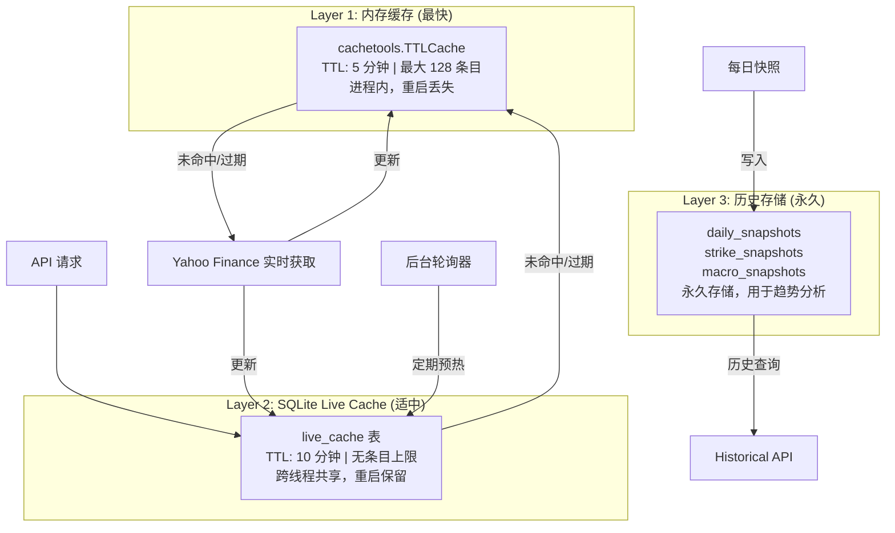
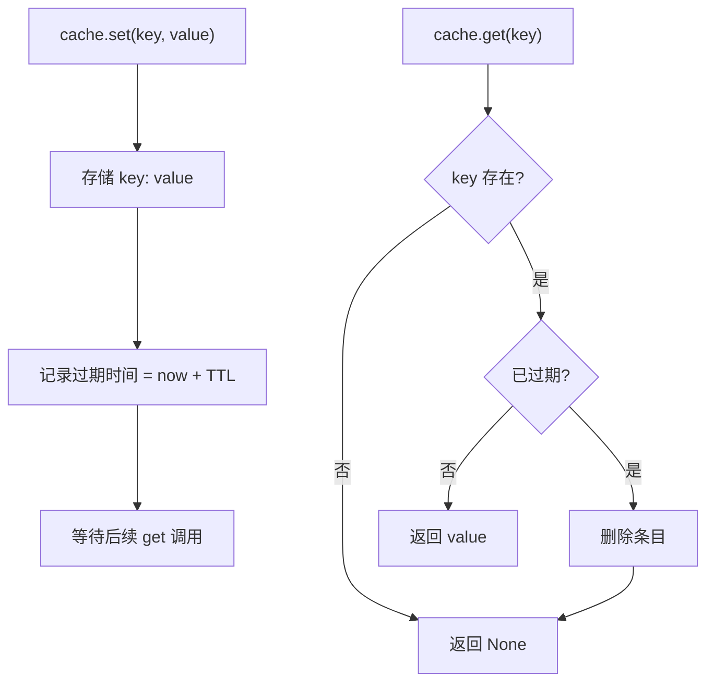
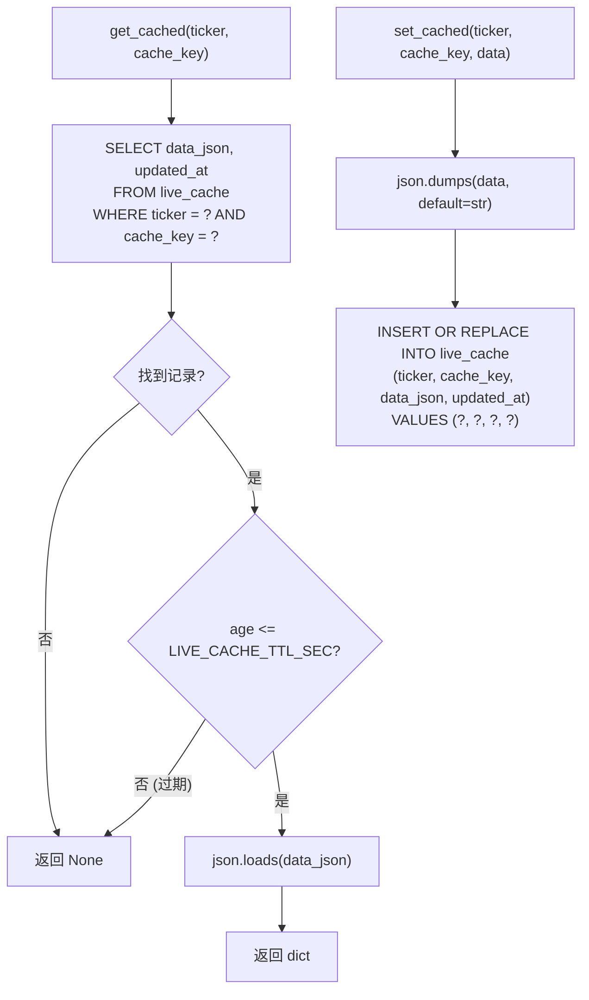
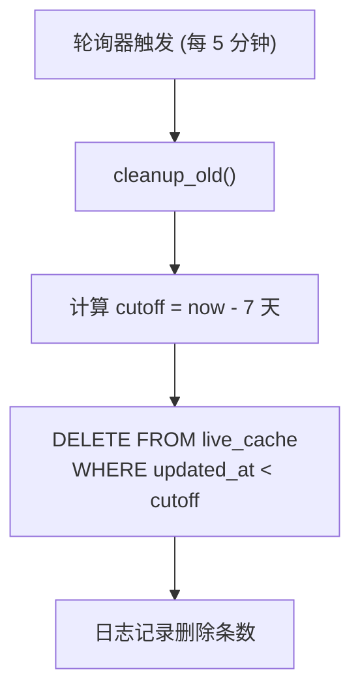
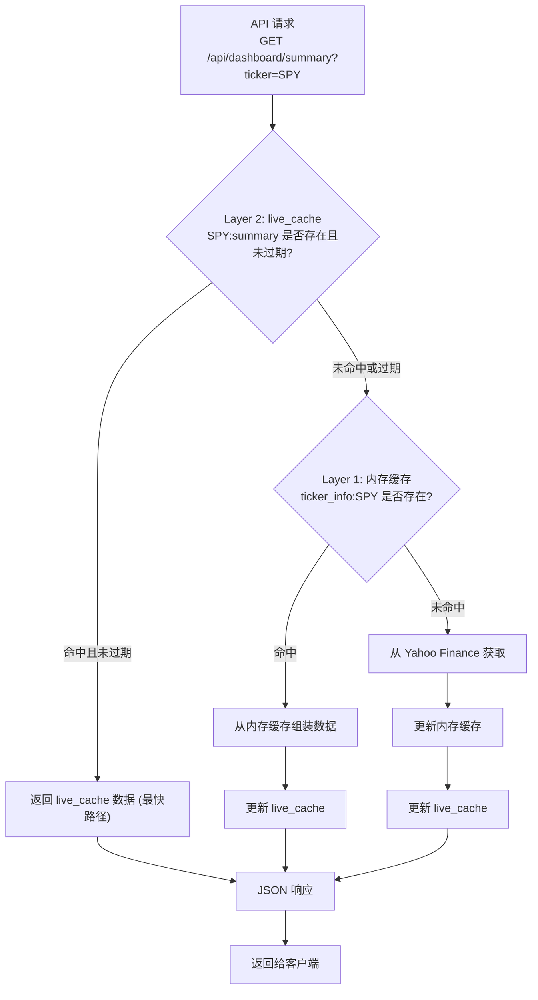
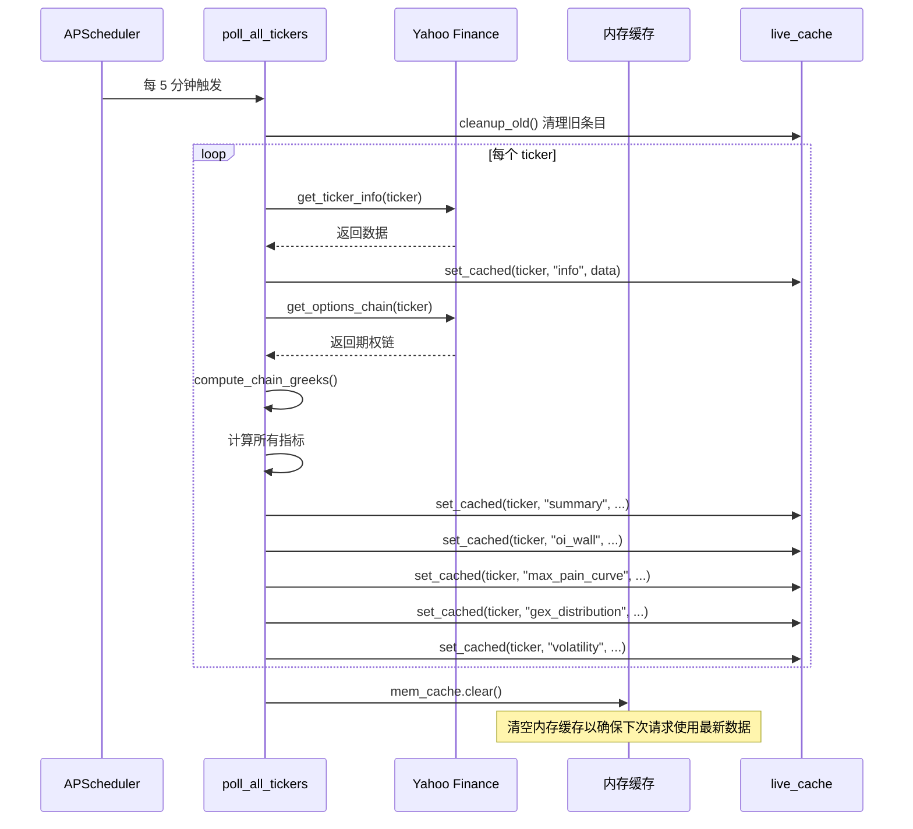
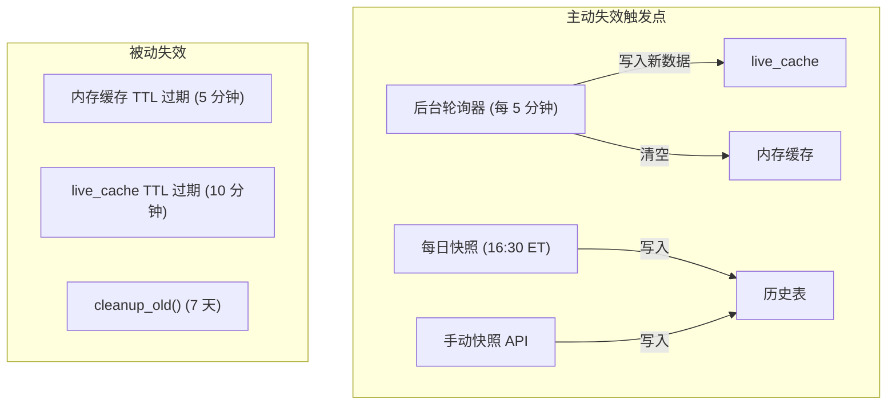
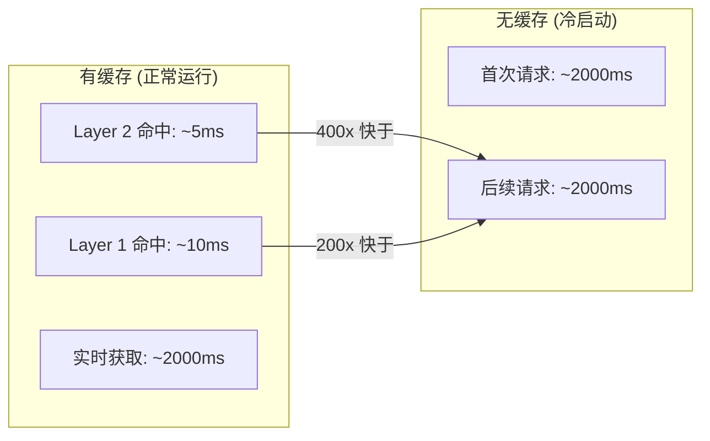

# 缓存策略

OptionDash 采用三层缓存架构，在数据新鲜度、访问速度和持久性之间取得平衡。从 Yahoo Finance 获取数据的延迟较高（含网络 + 速率限制），缓存是保证 API 响应速度的关键。本页将完整讲解每层缓存的实现细节。

---

## 三层缓存架构



| 层级 | 技术 | TTL | 最大容量 | 特点 |
|------|------|-----|---------|------|
| Layer 1 | `cachetools.TTLCache` | 5 分钟 (300s) | 128 条目 | 最快访问，进程重启后丢失 |
| Layer 2 | SQLite `live_cache` 表 | 10 分钟 (600s) | 无限制 | 跨线程共享，重启后保留 |
| Layer 3 | SQLite 历史表 | 永久 | 无限制 | 每日快照，支持历史趋势查询 |

---

## Layer 1: 内存缓存 (In-Memory TTL Cache)

内存缓存是速度最快的缓存层，位于进程内存中，用于避免重复的 yfinance 调用。

### 完整源码

```python
# 文件: backend/utils/cache.py (完整)
"""
TTL cache wrapper using cachetools.
"""

from cachetools import TTLCache
from config import Config


class CacheManager:
    """Simple TTL cache manager for market data."""

    def __init__(self, maxsize: int = None, ttl: int = None):
        self._cache = TTLCache(
            maxsize=maxsize or Config.CACHE_MAX_SIZE,  # 默认 128
            ttl=ttl or Config.CACHE_TTL,                # 默认 300 秒
        )

    def get(self, key: str):
        """Get a value from cache. Returns None if not found or expired."""
        return self._cache.get(key)

    def set(self, key: str, value):
        """Set a value in cache."""
        self._cache[key] = value

    def delete(self, key: str):
        """Delete a value from cache."""
        self._cache.pop(key, None)

    def clear(self):
        """Clear all cached values."""
        self._cache.clear()

    def has(self, key: str) -> bool:
        """Check if a key exists and is not expired."""
        return key in self._cache


# Module-level shared cache instance
cache = CacheManager()
```

### 工作原理

`cachetools.TTLCache` 内部使用一个字典存储键值对，每个条目附带一个过期时间戳。当调用 `get()` 时，如果当前时间超过过期时间，该条目会被自动删除，返回 `None`。



### 特性

| 属性 | 值 | 说明 |
|------|-----|------|
| 技术 | `cachetools.TTLCache` | 基于时间的自动过期缓存 |
| TTL | 300 秒 (5 分钟) | 可通过 `CACHE_TTL` 环境变量配置 |
| 最大条目 | 128 | 可通过 `CACHE_MAX_SIZE` 环境变量配置 |
| 线程安全 | 否 (单线程访问) | 每个请求线程独立访问 |
| 持久性 | 无 | 进程重启后丢失 |
| 淘汰策略 | LRU | 达到最大容量时淘汰最近最少使用的条目 |

### 缓存键格式

| 键格式 | 数据 | 使用者 |
|--------|------|--------|
| `ticker_info:{ticker}` | 标的信息 (价格、涨跌) | `market_data.get_ticker_info()` |
| `expirations:{ticker}` | 到期日列表 | `market_data.get_expirations()` |
| `chain:{ticker}:{expiration}` | 完整期权链 | `market_data.get_options_chain()` |
| `hist_price:{ticker}:{period}` | 历史价格 | `market_data.get_historical_prices()` |
| `macro:{symbol}` | 宏观指标当前值 | `macro_data.get_macro_indicator()` |
| `macro_hist:{symbol}:{period}` | 宏观指标历史数据 | `macro_data.get_macro_history()` |

### 使用模式

每个 `market_data` 函数都遵循相同的缓存模式：

```python
# 标准的 "缓存 -> 获取 -> 缓存" 模式
def get_ticker_info(ticker: str) -> dict:
    cache_key = f"ticker_info:{ticker}"
    cached = cache.get(cache_key)    # 1. 先查缓存
    if cached:
        return cached                # 2. 命中则直接返回

    rate_limiter.wait()              # 3. 限流等待
    t = _ticker_obj(ticker)
    info = t.fast_info               # 4. 调用 yfinance

    try:
        result = {...}               # 5. 构建结果
        cache.set(cache_key, result) # 6. 写入缓存
        return result
    except Exception as e:
        if cached:
            return cached            # 7. 失败时返回旧缓存
        raise
```

---

## Layer 2: SQLite Live Cache

Live Cache 是中间缓存层，存储在 SQLite 数据库中，供 API 端点直接读取，避免每次都调用服务层计算。

### 完整源码

```python
# 文件: backend/services/live_cache.py (完整)
"""
Live cache backed by SQLite -- pre-fetched data to accelerate API responses.
"""

import json
import logging
from datetime import datetime, timedelta, timezone

from config import Config
from database.connection import db

logger = logging.getLogger(__name__)


def get_cached(ticker: str, cache_key: str) -> dict | None:
    """Retrieve a cached payload. Returns None if not found or stale."""
    row = db.execute_one(
        "SELECT data_json, updated_at FROM live_cache WHERE ticker = ? AND cache_key = ?",
        (ticker.upper(), cache_key),
    )
    if not row:
        return None

    # Check staleness
    updated_at = datetime.fromisoformat(row["updated_at"])
    age = (datetime.now(timezone.utc) - updated_at).total_seconds()
    if age > Config.LIVE_CACHE_TTL_SEC:
        return None

    try:
        return json.loads(row["data_json"])
    except json.JSONDecodeError:
        logger.warning(f"Corrupt cache entry for {ticker}/{cache_key}")
        return None


def set_cached(ticker: str, cache_key: str, data: dict) -> None:
    """Store a payload in the live cache."""
    try:
        data_json = json.dumps(data, default=str)
        db.execute(
            "INSERT OR REPLACE INTO live_cache (ticker, cache_key, data_json, updated_at) "
            "VALUES (?, ?, ?, ?)",
            (ticker.upper(), cache_key, data_json, datetime.now(timezone.utc).isoformat()),
        )
    except Exception:
        logger.exception(f"Failed to write cache for {ticker}/{cache_key}")


def is_fresh(ticker: str, cache_key: str) -> bool:
    """Check if a cache entry exists and is within TTL."""
    row = db.execute_one(
        "SELECT updated_at FROM live_cache WHERE ticker = ? AND cache_key = ?",
        (ticker.upper(), cache_key),
    )
    if not row:
        return False
    updated_at = datetime.fromisoformat(row["updated_at"])
    age = (datetime.now(timezone.utc) - updated_at).total_seconds()
    return age <= Config.LIVE_CACHE_TTL_SEC


def cleanup_old() -> int:
    """Delete cache entries older than the retention period."""
    cutoff = (datetime.now(timezone.utc) - timedelta(days=Config.LIVE_CACHE_RETENTION_DAYS)).isoformat()
    with db.get_cursor() as cursor:
        cursor.execute("DELETE FROM live_cache WHERE updated_at < ?", (cutoff,))
        deleted = cursor.rowcount
    if deleted:
        logger.info(f"Cleaned up {deleted} stale live_cache entries")
    return deleted
```

### 工作原理

Live Cache 使用 SQLite 的 `live_cache` 表存储 JSON 序列化的 API 响应数据。通过 `INSERT OR REPLACE` 实现 upsert（存在则更新，不存在则插入）。



### 特性

| 属性 | 值 | 说明 |
|------|-----|------|
| 技术 | SQLite `live_cache` 表 | JSON 序列化存储 |
| TTL | 600 秒 (10 分钟) | 可通过 `LIVE_CACHE_TTL_SEC` 环境变量配置 |
| 条目上限 | 无限制 | 通过定期清理控制总量 |
| 保留期限 | 7 天 | 超过 7 天的条目被自动删除 |
| 线程安全 | 是 | SQLite WAL 模式支持并发读取 |

### 缓存键格式

| 缓存键 | 数据 | 说明 |
|--------|------|------|
| `summary` | 仪表盘摘要 | 包含 spot_price, max_pain, pcr, gex 等 |
| `info` | 标的信息 | 价格、涨跌幅度 |
| `expirations` | 到期日列表 | 可用的期权到期日 |
| `oi_wall` | OI Wall 数据 | 各行权价的 call/put 持仓量 |
| `max_pain_curve` | Max Pain 曲线 | 各行权价的总损失 |
| `gex_distribution` | GEX 分布 | 各行权价的 gamma 敞口 |
| `volatility` | 波动率指标 | ATM IV, HV30, VRP, Skew |
| `current` | 宏观指标 (ticker=MACRO) | VIX, TNX, DXY 等 |

### 清理机制

```python
# 文件: backend/services/live_cache.py (第 66-74 行)
def cleanup_old() -> int:
    """Delete cache entries older than the retention period. Returns count deleted."""
    cutoff = (datetime.now(timezone.utc) - timedelta(
        days=Config.LIVE_CACHE_RETENTION_DAYS  # 默认 7 天
    )).isoformat()
    with db.get_cursor() as cursor:
        cursor.execute("DELETE FROM live_cache WHERE updated_at < ?", (cutoff,))
        deleted = cursor.rowcount
    if deleted:
        logger.info(f"Cleaned up {deleted} stale live_cache entries")
    return deleted
```



- 每次轮询开始时执行清理
- 删除超过 `LIVE_CACHE_RETENTION_DAYS`（默认 7 天）的条目
- 通过 `idx_live_cache_updated` 索引加速清理查询

---

## Layer 3: 历史存储 (Historical Storage)

历史存储是最底层的持久化层，用于保存每日快照数据，支持历史趋势分析。

### 存储表

| 表 | 粒度 | 用途 |
|----|------|------|
| `daily_snapshots` | 每标的每天 1 行 | 聚合指标趋势 (max_pain, pcr, gex, iv) |
| `strike_snapshots` | 每行权价每天 1 行 | 行权价级别的 OI、成交量、IV、Greeks |
| `macro_snapshots` | 每天 1 行 | 宏观经济指标趋势 |

### 写入时机

- **每日快照任务**: 美国东部时间 16:30（市场收盘后）自动触发
- **手动写入**: `POST /api/historical/snapshot` 端点支持手动写入

---

## 缓存命中流程

下图展示了 API 请求的完整缓存查找流程：



### 缓存策略决策矩阵

| 场景 | Layer 1 (内存) | Layer 2 (Live Cache) | Layer 3 (历史) | 行为 |
|------|---------------|---------------------|---------------|------|
| 高频 API 请求 | 命中 | 命中 | - | 直接返回 Layer 2 数据 |
| 轮询后首次请求 | 可能命中 | 命中 | - | 返回 Layer 2 数据 |
| 缓存过期 | 可能命中 | 过期 | - | 从 Layer 1 或实时获取，更新 Layer 2 |
| 全部未命中 | 未命中 | 未命中 | - | 实时获取，更新所有层 |
| 历史趋势查询 | - | - | 查询 | 直接查询历史表 |

---

## 后台轮询与缓存预热

后台轮询器是缓存策略的重要组成部分，通过定期预热确保 API 命中率：



**轮询器的作用**：

1. **定期预热** -- 每 5 分钟从 Yahoo Finance 拉取最新数据，写入 live_cache
2. **清理过期数据** -- 删除超过 7 天的旧缓存条目
3. **清空内存缓存** -- 轮询完成后清空 Layer 1，确保下次 API 请求使用最新数据
4. **错误隔离** -- 单个 ticker 的轮询失败不影响其他 ticker

---

## 缓存失效与更新

### 主动失效



### 数据一致性

由于系统使用多层缓存，可能出现短暂的数据不一致：

1. **轮询器刚写入 live_cache** -- 此时内存缓存可能还是旧数据
   - 解决：轮询器在写入 live_cache 后会调用 `mem_cache.clear()` 清空内存缓存
2. **API 请求在轮询中间到达** -- 可能读到部分更新的数据
   - 影响：轻微，因为轮询周期很短（5 分钟），且每个 ticker 的轮询是原子性的
3. **手动快照与轮询冲突** -- 两者可能同时写入
   - 解决：SQLite WAL 模式保证写入的原子性，`INSERT OR REPLACE` 避免重复

---

## 配置参数

所有缓存相关参数均可通过环境变量配置：

| 参数 | 环境变量 | 默认值 | 说明 |
|------|---------|--------|------|
| 内存缓存 TTL | `CACHE_TTL` | 300 (5 分钟) | Layer 1 过期时间 |
| 内存缓存容量 | `CACHE_MAX_SIZE` | 128 | Layer 1 最大条目数 |
| Live Cache TTL | `LIVE_CACHE_TTL_SEC` | 600 (10 分钟) | Layer 2 过期判断阈值 |
| Live Cache 保留期 | `LIVE_CACHE_RETENTION_DAYS` | 7 (天) | 超过此天数的条目被清理 |
| 轮询间隔 | `POLL_INTERVAL_SEC` | 300 (5 分钟) | 后台轮询器触发间隔 |

### 调优建议

| 场景 | 建议调整 |
|------|---------|
| 数据新鲜度优先 | 减小 `LIVE_CACHE_TTL_SEC` 到 300，增大 `POLL_INTERVAL_SEC` 到 180 |
| 响应速度优先 | 增大 `CACHE_MAX_SIZE` 到 256，增大 `LIVE_CACHE_TTL_SEC` 到 1200 |
| 减少 yfinance 请求 | 增大 `CACHE_TTL` 到 600，增大 `POLL_INTERVAL_SEC` 到 600 |
| 存储空间有限 | 减小 `LIVE_CACHE_RETENTION_DAYS` 到 3 |

---

## 缓存与 API 端点的协作

每个 API 端点都遵循相同的缓存读取模式。下面以具体端点为例展示缓存如何被使用。

### Dashboard Summary 端点

```python
# 文件: backend/api/dashboard.py (第 25-78 行)
@dashboard_bp.route("/api/dashboard/summary", methods=["GET"])
def dashboard_summary():
    ticker = request.args.get("ticker", "SPY").upper()

    # 步骤 1: 尝试从 Layer 2 (live_cache) 读取
    cached = get_cached(ticker, "summary")
    if cached:
        if not expiration or cached.get("expiration_used") == expiration:
            return jsonify(cached)  # 快速路径: 直接返回缓存数据

    # 步骤 2: 缓存未命中，调用服务层
    # 服务层内部会先查 Layer 1 (内存缓存)，再查 yfinance
    info = get_ticker_info(ticker)
    chain = get_options_chain(ticker, expiration)
    # ... 计算指标 ...
    return jsonify(result)
```

### OI Wall 端点

```python
# 文件: backend/api/strikes.py (第 38-75 行)
@strikes_bp.route("/api/strikes/oi-wall", methods=["GET"])
def oi_wall():
    ticker = request.args.get("ticker", "SPY").upper()
    expiration = request.args.get("expiration")

    # 缓存读取: 只有当缓存的过期日与请求匹配时才使用
    cached = get_cached(ticker, "oi_wall")
    if cached and (not expiration or cached.get("expiration") == expiration):
        return jsonify(cached)

    # ... 回退到直接获取 ...
```

### 宏观指标端点

```python
# 文件: backend/api/macro.py (第 23-37 行)
@macro_bp.route("/api/macro/current", methods=["GET"])
def macro_current():
    # 使用特殊的 ticker "MACRO" 存储宏观数据
    cached = get_cached("MACRO", "current")
    if cached:
        return jsonify(cached)

    data = get_macro_current()
    return jsonify(data)
```

---

## 缓存性能对比

下表展示了有缓存和无缓存时的 API 响应时间对比（典型值）：



| 请求场景 | 响应时间 | 数据来源 |
|---------|---------|---------|
| Layer 2 命中 (live_cache) | ~5ms | SQLite 查询 + JSON 反序列化 |
| Layer 1 命中 (内存缓存) | ~10ms | 内存字典查找 |
| Layer 2 过期但 Layer 1 命中 | ~15ms | 内存缓存 + 写入 live_cache |
| 全部未命中 (实时获取) | ~2000ms | yfinance 网络请求 + 计算 |
| 历史趋势查询 | ~50ms | SQLite 历史表查询 |

---

## 常见问题

### Q: 为什么需要三层缓存而不是两层？

Layer 1 (内存缓存) 在服务层函数内部使用，避免重复的 yfinance 调用。Layer 2 (live_cache) 在 API 路由层使用，避免重复的指标计算。两者作用域不同，缺一不可。

### Q: 轮询器为什么要在完成后清空内存缓存？

轮询器从 yfinance 获取了最新数据并写入 live_cache，但此时内存缓存中可能还是旧数据。如果不清空，下次 API 请求可能从内存缓存读到旧数据。清空内存缓存确保下次请求会从 yfinance 重新获取最新数据。

### Q: live_cache 的 TTL 为什么比内存缓存长？

live_cache 的 TTL (10 分钟) 比内存缓存 (5 分钟) 长，是因为 live_cache 是 API 层的主要数据来源，适当延长 TTL 可以提高缓存命中率。而内存缓存 TTL 较短是为了确保数据不会太陈旧。

### Q: 如何手动清除缓存？

- **内存缓存**: 调用 `mem_cache.clear()` (Python 控制台或 API 端点)
- **live_cache**: 删除 SQLite 数据库文件，或执行 `DELETE FROM live_cache`
- **历史数据**: 执行 `DELETE FROM daily_snapshots` (谨慎操作)
