# 数据管道

OptionDash 的数据管道负责从 Yahoo Finance 获取原始市场数据，经过清洗、Greeks 计算、指标聚合等处理，最终以结构化 JSON 响应返回给前端或存储到缓存/历史表中。本页将完整讲解数据管道的每个环节。

---

## 端到端数据流

数据从 Yahoo Finance 流入系统，经过多层处理后输出到三个目的地：API 响应、实时缓存、历史快照。

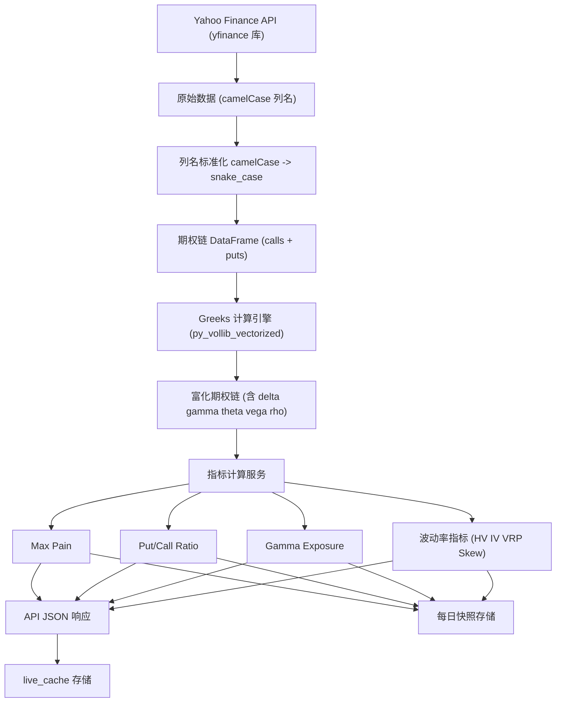

---

## 数据获取层: market_data.py

`market_data.py` 是数据管道的入口，封装了所有 yfinance 调用。每个函数都遵循 **缓存 -> 限流 -> 获取 -> 缓存** 的标准模式。

### 完整源码

```python
# 文件: backend/services/market_data.py (完整)
"""
Yahoo Finance data fetching with TTL caching and rate limiting.
"""

import logging
from datetime import datetime, timezone
import pandas as pd
import yfinance as yf

from config import Config
from utils.cache import cache
from utils.rate_limiter import rate_limiter

logger = logging.getLogger(__name__)

# Map yfinance camelCase columns to snake_case
_COLUMN_MAP = {
    "contractsymbol": "contract_symbol",
    "lasttradedate": "last_trade_date",
    "strike": "strike",
    "lastprice": "last_price",
    "bid": "bid",
    "ask": "ask",
    "change": "change",
    "percentchange": "percent_change",
    "volume": "volume",
    "openinterest": "open_interest",
    "impliedvolatility": "implied_volatility",
    "inthemoney": "in_the_money",
    "contractsize": "contract_size",
    "currency": "currency",
}


def _normalize_columns(df: pd.DataFrame) -> None:
    """Rename DataFrame columns from yfinance camelCase to snake_case."""
    lowered = [c.lower().replace(" ", "_") for c in df.columns]
    mapped = [_COLUMN_MAP.get(c, c) for c in lowered]
    df.columns = mapped


def _ticker_obj(ticker: str) -> yf.Ticker:
    return yf.Ticker(ticker)


def get_ticker_info(ticker: str) -> dict:
    """Get current price, daily change for a ticker."""
    cache_key = f"ticker_info:{ticker}"
    cached = cache.get(cache_key)
    if cached:
        return cached

    rate_limiter.wait()
    t = _ticker_obj(ticker)
    info = t.fast_info

    try:
        price = float(info.last_price)
        prev_close = float(info.previous_close) if info.previous_close else price
        daily_change = price - prev_close
        daily_change_pct = (daily_change / prev_close * 100) if prev_close else 0

        result = {
            "ticker": ticker,
            "spot_price": price,
            "daily_change": round(daily_change, 2),
            "daily_change_pct": round(daily_change_pct, 2),
            "updated_at": datetime.now(timezone.utc).isoformat(),
        }
        cache.set(cache_key, result)
        return result
    except Exception as e:
        logger.warning(f"Failed to get ticker info for {ticker}: {e}")
        if cached:
            return cached  # 返回旧缓存
        raise


def get_expirations(ticker: str) -> list[str]:
    """Get available option expiration dates."""
    cache_key = f"expirations:{ticker}"
    cached = cache.get(cache_key)
    if cached:
        return cached

    rate_limiter.wait()
    t = _ticker_obj(ticker)
    try:
        expirations = list(t.options)
        cache.set(cache_key, expirations)
        return expirations
    except Exception as e:
        if cached:
            return cached
        raise


def _nearest_expiration(ticker: str) -> str | None:
    """Pick the nearest expiration with >= 3 days to expiry."""
    exps = get_expirations(ticker)
    if not exps:
        return None
    today = datetime.now(timezone.utc).date()
    for exp in exps:
        exp_date = datetime.strptime(exp, "%Y-%m-%d").date()
        if (exp_date - today).days >= 3:
            return exp
    return exps[0]  # fallback to first


def get_options_chain(ticker: str, expiration: str | None = None) -> dict:
    """Fetch the full options chain for a ticker."""
    if expiration is None:
        expiration = _nearest_expiration(ticker)
    if expiration is None:
        raise ValueError(f"No valid expiration found for {ticker}")

    cache_key = f"chain:{ticker}:{expiration}"
    cached = cache.get(cache_key)
    if cached:
        return cached

    rate_limiter.wait()
    t = _ticker_obj(ticker)

    try:
        chain = t.option_chain(expiration)
        spot = float(t.fast_info.last_price)
    except Exception as e:
        if cached:
            return cached
        raise

    calls = chain.calls.copy()
    puts = chain.puts.copy()
    _normalize_columns(calls)
    _normalize_columns(puts)

    result = {
        "ticker": ticker,
        "expiration": expiration,
        "spot_price": spot,
        "calls": calls,
        "puts": puts,
    }
    cache.set(cache_key, result)
    return result


def get_historical_prices(ticker: str, period: str = "90d") -> pd.DataFrame:
    """Get historical OHLCV data."""
    cache_key = f"hist_price:{ticker}:{period}"
    cached = cache.get(cache_key)
    if cached is not None:
        return cached

    rate_limiter.wait()
    t = _ticker_obj(ticker)
    try:
        df = t.history(period=period)
        cache.set(cache_key, df)
        return df
    except Exception as e:
        if cached is not None:
            return cached
        raise
```

### 列名标准化映射

yfinance 返回的 DataFrame 列名为 camelCase 风格，系统统一转换为 snake_case：

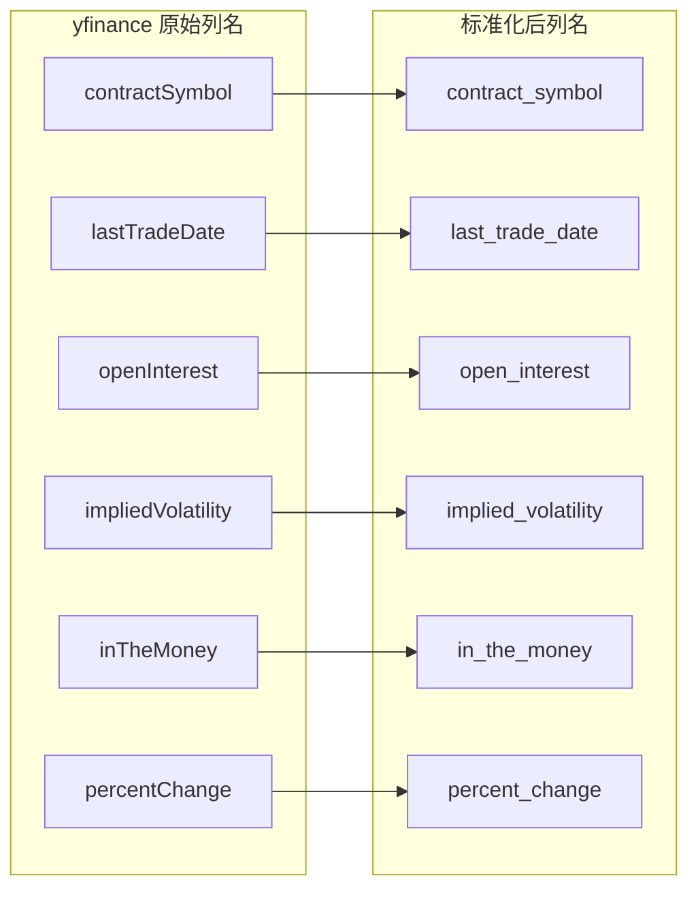

### 每个函数的缓存键

| 函数 | 缓存键格式 | 数据内容 | 使用者 |
|------|-----------|---------|--------|
| `get_ticker_info` | `ticker_info:{ticker}` | 价格、涨跌幅 | Dashboard, Comparison |
| `get_expirations` | `expirations:{ticker}` | 到期日列表 | Dashboard, Strikes |
| `get_options_chain` | `chain:{ticker}:{expiration}` | 完整期权链 | 所有需要期权数据的模块 |
| `get_historical_prices` | `hist_price:{ticker}:{period}` | 历史 OHLCV | HV 计算 |

---

## 速率限制机制

所有对 Yahoo Finance 的请求都经过 Token Bucket 速率限制器，防止触发 Yahoo 的请求频率限制。

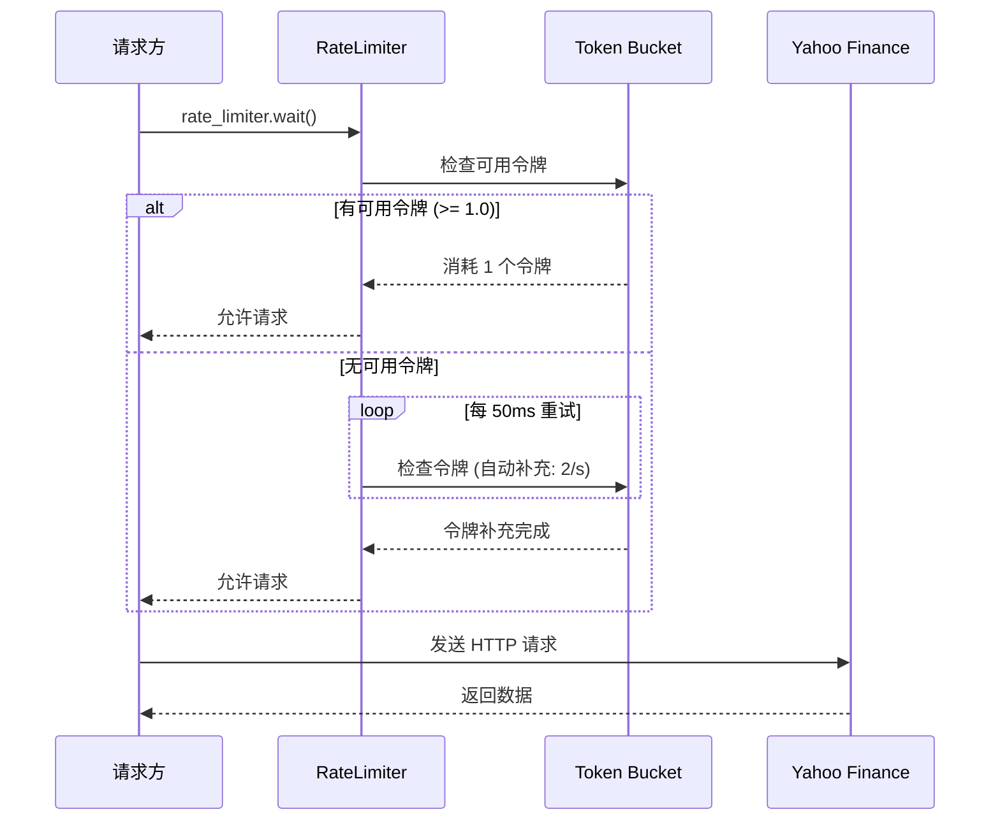

### Token Bucket 算法详解

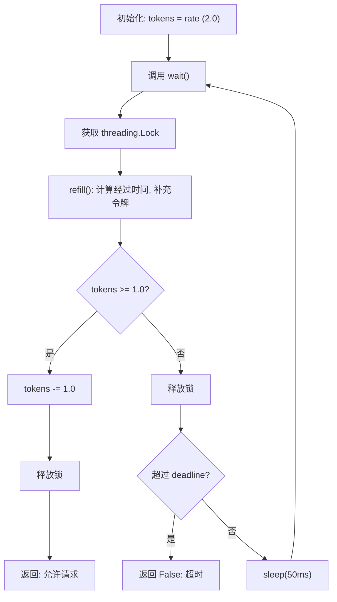

```python
# 文件: backend/utils/rate_limiter.py (完整)
"""
Token bucket rate limiter for API calls.
"""

import threading
import time
from config import Config


class RateLimiter:
    """Token bucket rate limiter."""

    def __init__(self, rate: float = None):
        self._rate = rate or Config.RATE_LIMIT_RPS  # 默认 2.0 req/s
        self._tokens = self._rate
        self._max_tokens = self._rate
        self._last_refill = time.monotonic()
        self._lock = threading.Lock()

    def _refill(self):
        """Refill tokens based on elapsed time."""
        now = time.monotonic()
        elapsed = now - self._last_refill
        self._tokens = min(self._max_tokens, self._tokens + elapsed * self._rate)
        self._last_refill = now

    def acquire(self, timeout: float = 10.0) -> bool:
        """Acquire a token, blocking until one is available or timeout."""
        deadline = time.monotonic() + timeout
        while True:
            with self._lock:
                self._refill()
                if self._tokens >= 1.0:
                    self._tokens -= 1.0
                    return True
            if time.monotonic() >= deadline:
                return False
            time.sleep(0.05)

    def wait(self):
        """Acquire a token, blocking indefinitely."""
        self.acquire(timeout=float("inf"))


# 模块级共享实例
rate_limiter = RateLimiter()
```

**关键参数**：

| 参数 | 默认值 | 环境变量 | 说明 |
|------|--------|---------|------|
| `rate` | 2.0 | `RATE_LIMIT_RPS` | 每秒最大请求数 |
| `timeout` | 10.0 秒 | (acquire 方法参数) | 获取令牌的最大等待时间 |
| 重试间隔 | 50ms | (硬编码) | 令牌不足时的轮询间隔 |

---

## Greeks 计算引擎

Greeks 计算引擎位于 `services/greeks_engine.py`，使用 `py_vollib_vectorized` 库批量计算 Black-Scholes Greeks。

### 计算流程

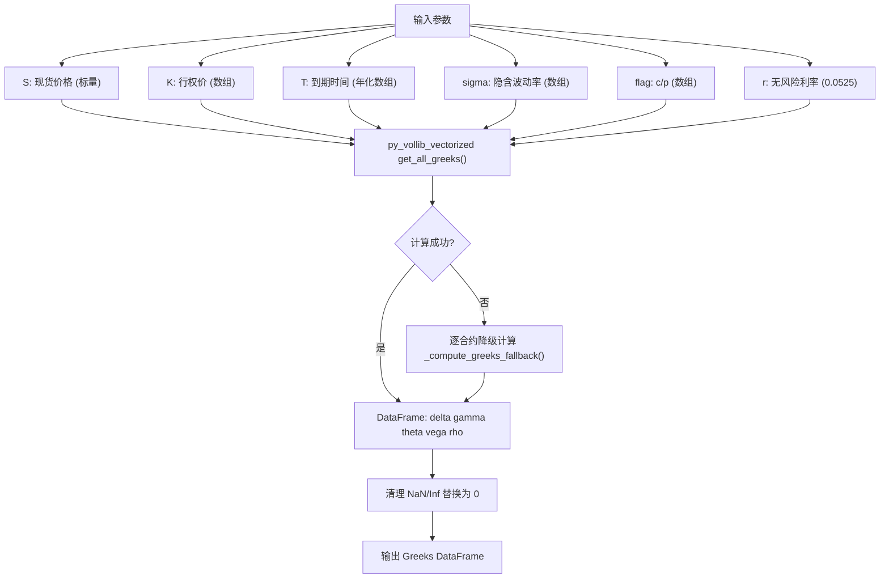

### 五个 Greeks 指标

| Greek | 符号 | 含义 | 应用 |
|-------|------|------|------|
| Delta | delta | 期权价格对标的价格变化的敏感度 | 衡量方向性风险 |
| Gamma | gamma | Delta 对标的价格变化的敏感度 | GEX 计算的核心输入 |
| Theta | theta | 期权价格随时间衰减的速率 | 衡量时间价值损耗 |
| Vega | vega | 期权价格对波动率变化的敏感度 | 波动率交易参考 |
| Rho | rho | 期权价格对利率变化的敏感度 | 利率环境影响评估 |

### 容错机制

```python
# 文件: backend/services/greeks_engine.py (第 16-61 行)
def compute_greeks(S, K, T, sigma, flag, r=None):
    if r is None:
        r = Config.RISK_FREE_RATE

    S_arr = np.full_like(K, S, dtype=float)
    T = np.maximum(T, 1e-6 / 365)  # clamp minimum T to ~1 second

    try:
        greeks_df = get_all_greeks(flag, S_arr, K, T, r, sigma,
                                    model="black_scholes", return_as="dataframe")
    except Exception as e:
        logger.warning(f"Batch Greeks failed: {e}, falling back")
        return _compute_greeks_fallback(S, K, T, sigma, flag, r)

    result = pd.DataFrame()
    result["delta"] = greeks_df.get("delta", 0.0)
    result["gamma"] = greeks_df.get("gamma", 0.0)
    result["theta"] = greeks_df.get("theta", 0.0)
    result["vega"] = greeks_df.get("vega", 0.0)
    result["rho"] = greeks_df.get("rho", 0.0)

    result = result.fillna(0.0).replace([np.inf, -np.inf], 0.0)
    return result
```

**容错设计**：

1. **批量计算优先** -- 使用 `py_vollib_vectorized` 向量化计算，性能最优
2. **逐合约降级** -- 若批量计算抛出异常，自动切换为逐合约计算循环
3. **NaN/Inf 清理** -- 计算结果中的 NaN 和 Inf 值统一替换为 0.0
4. **最小时间保护** -- T 值 clamp 到 `1e-6 / 365`（约 1 秒），避免除零错误

---

## 指标计算详解

### Max Pain 计算

Max Pain 是期权持有者总损失最小的行权价，等价于期权卖方利润最大的行权价。

```python
# 文件: backend/services/max_pain.py (第 10-62 行)
def calculate_max_pain(calls, puts):
    all_strikes = sorted(set(calls["strike"].tolist()) | set(puts["strike"].tolist()))

    total_losses = []
    for K in all_strikes:
        # Call 持有者损失 = max(0, K - strike) * OI * 100
        call_loss = np.sum(np.maximum(K - call_strikes, 0) * call_oi * 100)
        # Put 持有者损失 = max(0, strike - K) * OI * 100
        put_loss = np.sum(np.maximum(put_strikes - K, 0) * put_oi * 100)
        total_losses.append(call_loss + put_loss)

    min_idx = int(np.argmin(total_losses))
    return {"max_pain_strike": all_strikes[min_idx], "strikes": all_strikes, "total_loss": total_losses}
```

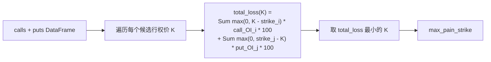

### Put/Call Ratio 计算

```python
# 文件: backend/services/pcr.py (第 9-42 行)
def calculate_pcr(calls, puts):
    pcr_volume = safe_divide(total_put_vol, total_call_vol)
    pcr_oi = safe_divide(total_put_oi, total_call_oi)

    # 综合信号: OI 权重 60%, Volume 权重 40%
    composite = pcr_oi * 0.6 + pcr_vol * 0.4
    signal = "bearish" if composite > 1.2 else "bullish" if composite < 0.7 else "neutral"

    return {"pcr_volume": pcr_volume, "pcr_oi": pcr_oi, "signal": signal, ...}
```

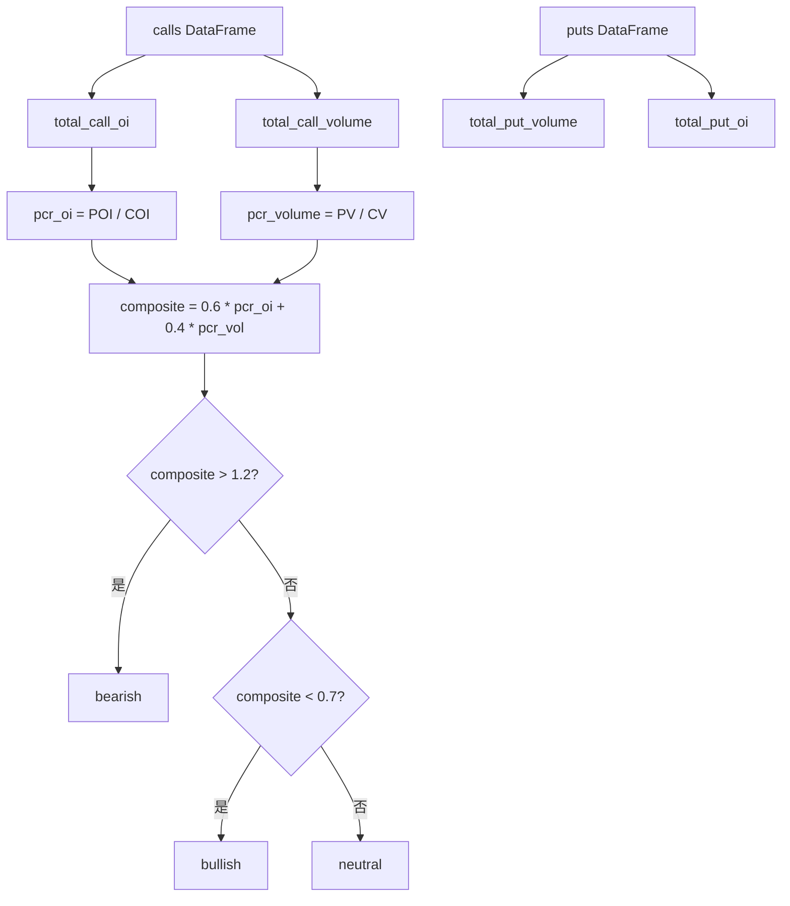

### Gamma Exposure 计算

```python
# 文件: backend/services/gex.py (第 11-56 行)
def calculate_gex(calls, puts, spot_price):
    # 交易商 GEX = -Sum(call_OI * call_gamma) + Sum(put_OI * put_gamma)
    dealer_gex_per_share = -np.sum(call_oi * call_gamma) + np.sum(put_oi * put_gamma)
    gex_dollar = float(dealer_gex_per_share * 100 * spot_price)

    regime = "positive_gamma" if gex_dollar > 0 else "negative_gamma"
    return {"value": gex_dollar, "formatted": format_large_number(gex_dollar), "regime": regime}
```

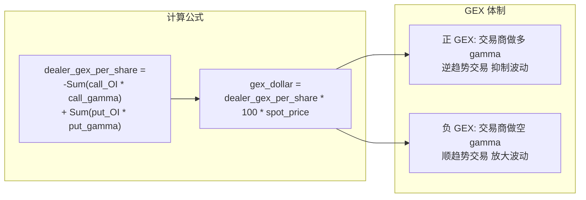

### 波动率指标计算

```python
# 文件: backend/services/volatility.py

# 历史波动率 (HV)
def calculate_hv(prices, window=30):
    log_returns = np.diff(np.log(prices[-window - 1:]))
    return float(np.std(log_returns) * np.sqrt(252))

# 平值隐含波动率 (ATM IV)
def calculate_atm_iv(calls, puts, spot):
    idx_c = (calls["strike"] - spot).abs().idxmin()
    idx_p = (puts["strike"] - spot).abs().idxmin()
    return (calls.loc[idx_c, "implied_volatility"] + puts.loc[idx_p, "implied_volatility"]) / 2

# 波动率风险溢价 (VRP)
def calculate_vrp(atm_iv, hv30):
    return atm_iv - hv30  # 正值 = 期权相对历史被高估

# 25-Delta 偏度
def calculate_skew_25d(calls, puts, spot):
    iv_25d_call = _interpolate_iv_at_delta(calls, ..., 0.25)
    iv_25d_put = _interpolate_iv_at_delta(puts, ..., -0.25)
    return iv_25d_put - iv_25d_call
```

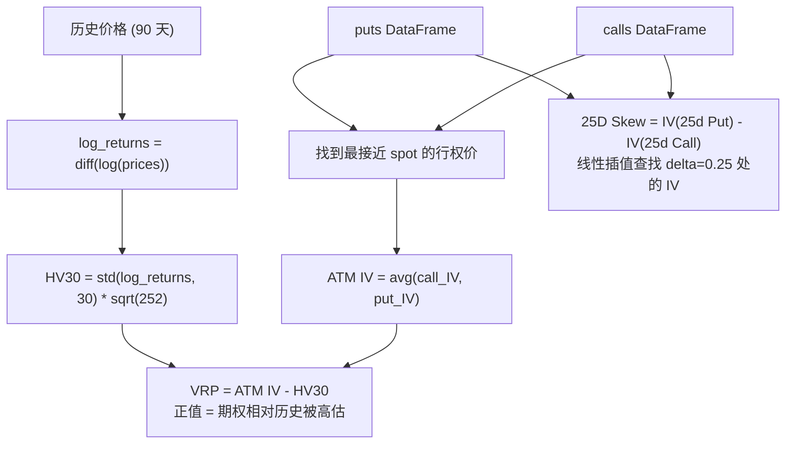

---

## 后台轮询器: poller.py

后台轮询器位于 `scheduler/poller.py`，由 APScheduler 每 5 分钟触发一次，负责预热 live_cache，确保 API 请求能命中缓存。

### 完整源码

```python
# 文件: backend/scheduler/poller.py (第 30-172 行)
def poll_all_tickers():
    """Fetch latest data for all configured tickers and store in live_cache."""
    logger.info(f"Starting background poll for {len(Config.SUPPORTED_TICKERS)} tickers")
    cleanup_old()  # 清理超过 7 天的旧缓存

    for ticker in Config.SUPPORTED_TICKERS:
        try:
            _poll_ticker(ticker)
        except Exception:
            logger.error(f"Poll failed for {ticker}:\n{traceback.format_exc()}")

    try:
        _poll_macro()
    except Exception:
        logger.error(f"Macro poll failed:\n{traceback.format_exc()}")


def _poll_ticker(ticker: str):
    """Poll a single ticker and cache all derived data."""
    # 1. Ticker info (spot price, daily change)
    info = get_ticker_info(ticker)
    set_cached(ticker, "info", info)

    # 2. Expirations
    exps = get_expirations(ticker)
    set_cached(ticker, "expirations", {"ticker": ticker, "expirations": exps})

    # 3. Option chain (nearest expiration)
    chain = get_options_chain(ticker)
    chain = compute_chain_greeks(chain)
    calls, puts, spot = chain["calls"], chain["puts"], chain["spot_price"]

    # 4. Compute core metrics
    max_pain_result = calculate_max_pain(calls, puts)
    pcr_result = calculate_pcr(calls, puts)
    gex_result = calculate_gex(calls, puts, spot)
    atm_iv = calculate_atm_iv(calls, puts, spot)

    summary = {
        "ticker": ticker, "spot_price": spot,
        "max_pain": max_pain_result["max_pain_strike"],
        "pcr": {"volume": pcr_result["pcr_volume"], "oi": pcr_result["pcr_oi"]},
        "gex": {"value": gex_result["value"], "regime": gex_result["regime"]},
        "atm_iv": round(atm_iv, 4),
        "updated_at": datetime.now(timezone.utc).isoformat(),
    }
    set_cached(ticker, "summary", summary)

    # 5. Strike-level data
    oi_wall = {...}  # OI Wall 数据
    set_cached(ticker, "oi_wall", oi_wall)
    set_cached(ticker, "max_pain_curve", mp_curve)
    set_cached(ticker, "gex_distribution", gex_dist)

    # 6. Historical prices (for HV computation)
    prices_df = get_historical_prices(ticker, period="90d")
    hv30 = calculate_hv(prices_df["Close"], window=30)
    vrp = calculate_vrp(atm_iv, hv30)
    skew = calculate_skew_25d(calls, puts, spot)
    set_cached(ticker, "volatility", vol_data)

    # 7. Clear in-memory cache so fresh data is picked up
    mem_cache.clear()
```

### 轮询流程图

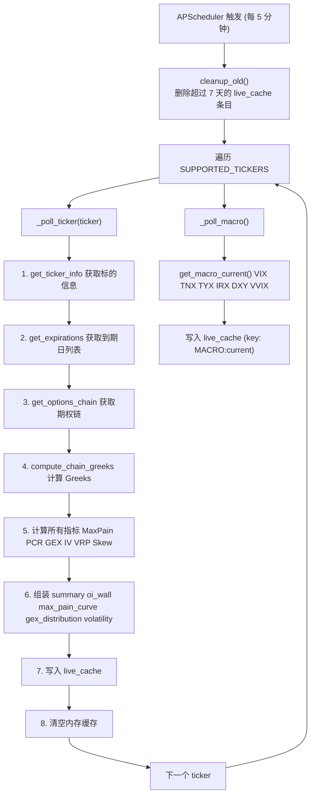

### 轮询器的作用

1. **预热缓存** -- 定期从 Yahoo Finance 拉取数据并存入 live_cache，确保 API 请求时能命中缓存
2. **清理过期数据** -- 每次轮询开始时清理超过 7 天的旧缓存条目
3. **错误隔离** -- 单个 ticker 的轮询失败不影响其他 ticker
4. **清空内存缓存** -- 轮询完成后清空内存缓存，确保下次 API 请求使用最新数据

---

## 每日快照: jobs.py

每日快照任务在美国东部时间 16:30（市场收盘后）触发，将当日数据永久保存到数据库。

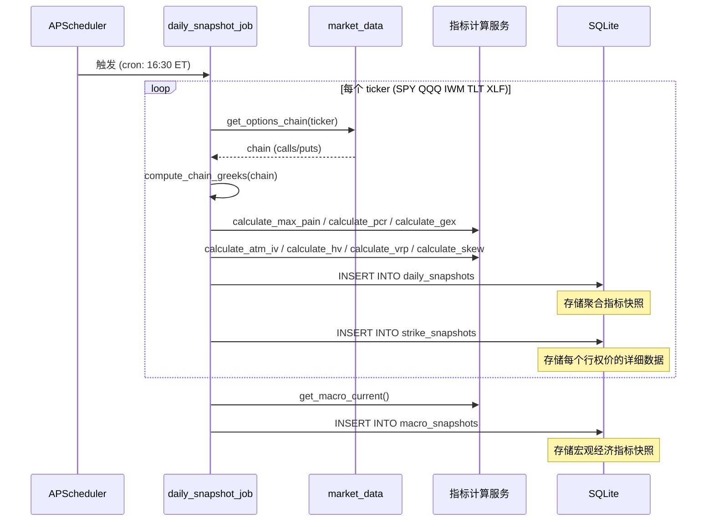

```python
# 文件: backend/scheduler/jobs.py (第 24-104 行)
def daily_snapshot_job():
    """Runs daily after market close."""
    date_str = datetime.now(timezone.utc).strftime("%Y-%m-%d")

    for ticker in Config.SUPPORTED_TICKERS:
        try:
            chain = get_options_chain(ticker)
            chain = compute_chain_greeks(chain)
            calls, puts, spot = chain["calls"], chain["puts"], chain["spot_price"]

            # 计算所有指标
            max_pain_result = calculate_max_pain(calls, puts)
            pcr_result = calculate_pcr(calls, puts)
            gex_result = calculate_gex(calls, puts, spot)
            atm_iv = calculate_atm_iv(calls, puts, spot)
            prices_df = get_historical_prices(ticker, period="90d")
            hv30 = calculate_hv(prices_df["Close"], window=30)
            vrp = calculate_vrp(atm_iv, hv30)
            skew = calculate_skew_25d(calls, puts, spot)

            # 存储到 daily_snapshots
            db.execute(
                """INSERT OR REPLACE INTO daily_snapshots
                (date, ticker, spot_price, max_pain, pcr_volume, pcr_oi, gex,
                 atm_iv, hv30, vrp, skew_25d, ...)
                VALUES (?, ?, ?, ?, ?, ?, ?, ?, ?, ?, ?, ...)""",
                (date_str, ticker, spot, max_pain_result["max_pain_strike"], ...),
            )

            # 存储到 strike_snapshots
            strike_rows = []
            for side_key, df in (("calls", calls), ("puts", puts)):
                for _, row in df.iterrows():
                    strike_rows.append((date_str, ticker, chain["expiration"], ...))
            db.execute_many("INSERT OR REPLACE INTO strike_snapshots ...", strike_rows)

        except Exception as e:
            logger.error(f"Snapshot failed for {ticker}: {e}")
```

**快照存储内容**：

| 表 | 粒度 | 存储内容 |
|----|------|---------|
| `daily_snapshots` | 每标的每天 1 行 | spot_price, max_pain, pcr_volume, pcr_oi, gex, atm_iv, hv30, vrp, skew_25d |
| `strike_snapshots` | 每行权价每天 1 行 | call_oi, put_oi, call_volume, put_volume, call_iv, put_iv, call_gamma, put_gamma |
| `macro_snapshots` | 每天 1 行 | vix, tnx, tyx, irx, dxy, vvix, spread_10y3m |

---

## 宏观指标数据流

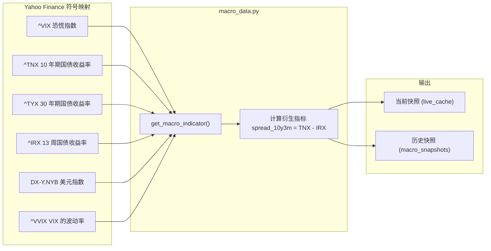

```python
# 文件: backend/services/macro_data.py (第 44-66 行)
def get_macro_current() -> dict:
    """Fetch all macro indicators and compute derived values."""
    indicators = {}
    for name, symbol in Config.MACRO_SYMBOLS.items():
        try:
            result = get_macro_indicator(symbol)
            indicators[name.lower()] = result["value"]
        except Exception as e:
            indicators[name.lower()] = None

    # 计算衍生指标: 10Y-3M 利差
    tnx_val = indicators.get("tnx")
    irx_val = indicators.get("irx")
    indicators["spread_10y3m"] = round(tnx_val - irx_val, 2) if (tnx_val and irx_val) else None

    return {"indicators": indicators, "updated_at": datetime.now(timezone.utc).isoformat()}
```
