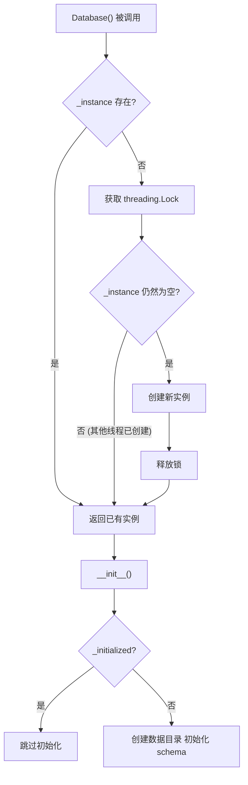
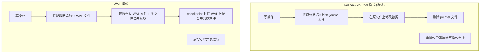
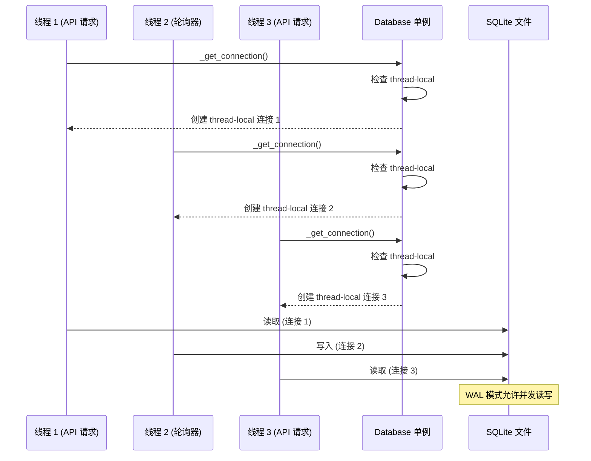
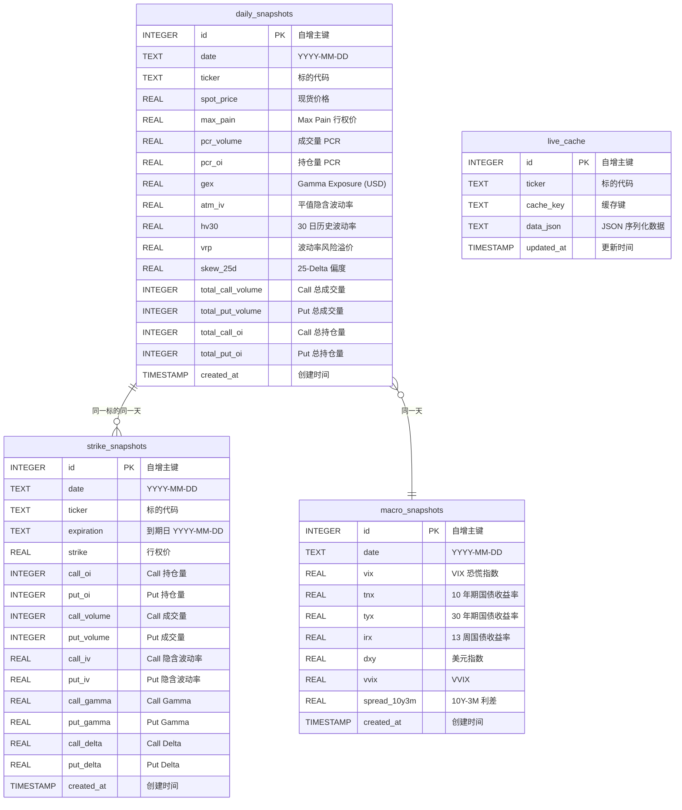
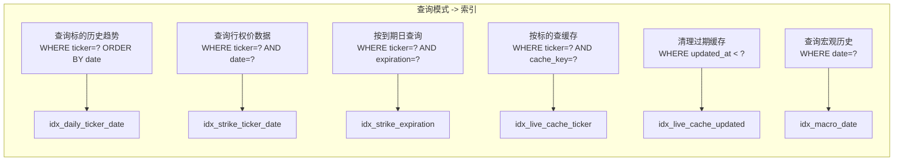

# 数据库设计

OptionDash 使用 SQLite 作为数据存储引擎，采用 WAL (Write-Ahead Logging) 模式以支持并发读取。数据库存储三类数据：每日聚合快照、行权价级别快照、实时缓存和宏观经济指标快照。本页将完整讲解数据库的连接管理、表结构设计和索引策略。

---

## SQLite 配置与连接管理

数据库连接通过 `database/connection.py` 中的 `Database` 单例类管理。该类采用双检锁单例模式确保全局唯一实例，并为每个线程提供独立的 SQLite 连接。

### 完整源码

```python
# 文件: backend/database/connection.py (完整)
"""
SQLite connection manager with thread-safe access and WAL mode.
"""

import os
import sqlite3
import threading
from contextlib import contextmanager

from config import Config


class Database:
    """Thread-safe SQLite database manager."""

    _instance = None
    _lock = threading.Lock()

    def __new__(cls):
        if cls._instance is None:
            with cls._lock:
                if cls._instance is None:
                    cls._instance = super().__new__(cls)
                    cls._instance._initialized = False
        return cls._instance

    def __init__(self):
        if self._initialized:
            return
        self._initialized = True
        self._local = threading.local()
        self._ensure_data_dir()
        self._init_schema()

    def _ensure_data_dir(self):
        """Create the data directory if it doesn't exist."""
        data_dir = os.path.dirname(Config.DATABASE_PATH)
        if data_dir:
            os.makedirs(data_dir, exist_ok=True)

    def _get_connection(self) -> sqlite3.Connection:
        """Get a thread-local database connection."""
        if not hasattr(self._local, "connection") or self._local.connection is None:
            conn = sqlite3.connect(Config.DATABASE_PATH)
            conn.row_factory = sqlite3.Row
            conn.execute("PRAGMA journal_mode=WAL")
            conn.execute("PRAGMA foreign_keys=ON")
            conn.execute("PRAGMA busy_timeout=5000")
            self._local.connection = conn
        return self._local.connection

    def _init_schema(self):
        """Initialize database schema from schema.sql."""
        schema_path = os.path.join(
            os.path.dirname(os.path.abspath(__file__)), "schema.sql"
        )
        with open(schema_path, "r") as f:
            schema_sql = f.read()

        conn = self._get_connection()
        conn.executescript(schema_sql)
        conn.commit()

    @contextmanager
    def get_cursor(self):
        """Context manager for database cursor with auto-commit/rollback."""
        conn = self._get_connection()
        cursor = conn.cursor()
        try:
            yield cursor
            conn.commit()
        except Exception:
            conn.rollback()
            raise

    def execute(self, query: str, params: tuple = ()) -> list:
        """Execute a query and return all results as list of dicts."""
        with self.get_cursor() as cursor:
            cursor.execute(query, params)
            if cursor.description:
                columns = [col[0] for col in cursor.description]
                return [dict(zip(columns, row)) for row in cursor.fetchall()]
            return []

    def execute_one(self, query: str, params: tuple = ()) -> dict | None:
        """Execute a query and return the first result as a dict."""
        results = self.execute(query, params)
        return results[0] if results else None

    def execute_insert(self, query: str, params: tuple = ()) -> int:
        """Execute an insert and return the last row id."""
        with self.get_cursor() as cursor:
            cursor.execute(query, params)
            return cursor.lastrowid

    def execute_many(self, query: str, params_list: list[tuple]) -> int:
        """Execute a batch insert and return the number of rows affected."""
        with self.get_cursor() as cursor:
            cursor.executemany(query, params_list)
            return cursor.rowcount


# Module-level convenience instance
db = Database()
```

### 单例模式详解



**为什么使用双检锁？**

- 第一次检查（无锁）：避免每次都获取锁，提高性能
- 第二次检查（有锁）：防止多个线程同时通过第一次检查后重复创建实例

### PRAGMA 配置

```python
# 文件: backend/database/connection.py (第 44-48 行)
conn.execute("PRAGMA journal_mode=WAL")    # 写前日志模式
conn.execute("PRAGMA foreign_keys=ON")     # 启用外键约束
conn.execute("PRAGMA busy_timeout=5000")   # 5 秒忙等待超时
```

| PRAGMA | 值 | 作用 |
|--------|-----|------|
| `journal_mode` | `WAL` | 写前日志模式，支持并发读写 |
| `foreign_keys` | `ON` | 启用外键约束（虽然本项目未使用外键） |
| `busy_timeout` | `5000` | 当数据库被锁定时，等待最多 5 秒后重试 |

---

## WAL 模式详解

WAL (Write-Ahead Logging) 是 SQLite 的一种日志模式，相比默认的 rollback journal 模式有显著优势。

### WAL 模式工作原理



### WAL 模式优势

- **并发读写**: 读操作不阻塞写操作，写操作不阻塞读操作
- **更好的性能**: 批量写入时性能优于默认的 rollback journal 模式
- **崩溃恢复**: WAL 文件提供更好的崩溃恢复能力

### 线程安全机制



### 线程本地连接

```python
# 文件: backend/database/connection.py (第 41-50 行)
def _get_connection(self) -> sqlite3.Connection:
    """Get a thread-local database connection."""
    if not hasattr(self._local, "connection") or self._local.connection is None:
        conn = sqlite3.connect(Config.DATABASE_PATH)
        conn.row_factory = sqlite3.Row        # 结果以字典形式返回
        conn.execute("PRAGMA journal_mode=WAL")
        conn.execute("PRAGMA foreign_keys=ON")
        conn.execute("PRAGMA busy_timeout=5000")
        self._local.connection = conn
    return self._local.connection
```

- **`threading.local()`** -- 每个线程拥有独立的连接对象，避免跨线程共享连接
- **`row_factory = sqlite3.Row`** -- 查询结果以 `Row` 对象返回，支持 `row["column_name"]` 访问
- **`busy_timeout=5000`** -- 当数据库被其他线程锁定时，等待最多 5 秒后重试，避免 `SQLITE_BUSY` 错误

### 上下文管理器

```python
# 文件: backend/database/connection.py (第 64-74 行)
@contextmanager
def get_cursor(self):
    """Context manager for database cursor with auto-commit/rollback."""
    conn = self._get_connection()
    cursor = conn.cursor()
    try:
        yield cursor
        conn.commit()       # 成功时自动提交
    except Exception:
        conn.rollback()     # 失败时自动回滚
        raise
```

---

## 表结构设计

### ER 图



### daily_snapshots -- 每日聚合快照

每个标的每天存储一行，记录当日的所有聚合指标。这是历史趋势分析的主要数据来源。

```sql
-- 文件: backend/database/schema.sql (第 5-24 行)
CREATE TABLE IF NOT EXISTS daily_snapshots (
    id INTEGER PRIMARY KEY AUTOINCREMENT,
    date TEXT NOT NULL,                   -- YYYY-MM-DD
    ticker TEXT NOT NULL,
    spot_price REAL,
    max_pain REAL,
    pcr_volume REAL,                      -- Volume-based Put/Call Ratio
    pcr_oi REAL,                          -- OI-based Put/Call Ratio
    gex REAL,                             -- Gamma Exposure in USD
    atm_iv REAL,                          -- At-the-money implied volatility
    hv30 REAL,                            -- 30-day historical volatility
    vrp REAL,                             -- Volatility risk premium (IV - HV)
    skew_25d REAL,                        -- 25-Delta risk reversal
    total_call_volume INTEGER,
    total_put_volume INTEGER,
    total_call_oi INTEGER,
    total_put_oi INTEGER,
    created_at TIMESTAMP DEFAULT CURRENT_TIMESTAMP,
    UNIQUE(date, ticker)
);
```

**字段详解**：

| 字段 | 类型 | 说明 | 来源 |
|------|------|------|------|
| `date` | TEXT | 快照日期，格式 `YYYY-MM-DD` | `datetime.now(timezone.utc).strftime("%Y-%m-%d")` |
| `ticker` | TEXT | 标的代码，如 `SPY`、`QQQ` | `Config.SUPPORTED_TICKERS` |
| `spot_price` | REAL | 当日现货收盘价 | `get_ticker_info()["spot_price"]` |
| `max_pain` | REAL | Max Pain 行权价 | `calculate_max_pain()["max_pain_strike"]` |
| `pcr_volume` | REAL | 基于成交量的 Put/Call Ratio | `calculate_pcr()["pcr_volume"]` |
| `pcr_oi` | REAL | 基于持仓量的 Put/Call Ratio | `calculate_pcr()["pcr_oi"]` |
| `gex` | REAL | Gamma Exposure，单位为美元 | `calculate_gex()["value"]` |
| `atm_iv` | REAL | 平值隐含波动率 | `calculate_atm_iv()` |
| `hv30` | REAL | 30 日历史波动率 | `calculate_hv(prices, 30)` |
| `vrp` | REAL | 波动率风险溢价 (atm_iv - hv30) | `calculate_vrp(atm_iv, hv30)` |
| `skew_25d` | REAL | 25-Delta 风险逆转 (IV_put_25d - IV_call_25d) | `calculate_skew_25d()` |
| `total_call_volume` | INTEGER | 当日 Call 总成交量 | `calculate_pcr()["total_call_volume"]` |
| `total_put_volume` | INTEGER | 当日 Put 总成交量 | `calculate_pcr()["total_put_volume"]` |
| `total_call_oi` | INTEGER | 当日 Call 总持仓量 | `calculate_pcr()["total_call_oi"]` |
| `total_put_oi` | INTEGER | 当日 Put 总持仓量 | `calculate_pcr()["total_put_oi"]` |

**唯一约束**: `(date, ticker)` 确保每个标的每天最多一行数据，使用 `INSERT OR REPLACE` 实现 upsert。

### strike_snapshots -- 行权价级别快照

每个行权价每天存储一行，用于重建 OI Wall 和 GEX 分布图。

```sql
-- 文件: backend/database/schema.sql (第 27-45 行)
CREATE TABLE IF NOT EXISTS strike_snapshots (
    id INTEGER PRIMARY KEY AUTOINCREMENT,
    date TEXT NOT NULL,
    ticker TEXT NOT NULL,
    expiration TEXT NOT NULL,              -- Expiration date YYYY-MM-DD
    strike REAL NOT NULL,
    call_oi INTEGER DEFAULT 0,
    put_oi INTEGER DEFAULT 0,
    call_volume INTEGER DEFAULT 0,
    put_volume INTEGER DEFAULT 0,
    call_iv REAL,
    put_iv REAL,
    call_gamma REAL,
    put_gamma REAL,
    call_delta REAL,
    put_delta REAL,
    created_at TIMESTAMP DEFAULT CURRENT_TIMESTAMP,
    UNIQUE(date, ticker, expiration, strike)
);
```

**字段详解**：

| 字段 | 类型 | 说明 |
|------|------|------|
| `date` | TEXT | 快照日期 |
| `ticker` | TEXT | 标的代码 |
| `expiration` | TEXT | 期权到期日 |
| `strike` | REAL | 行权价 |
| `call_oi` | INTEGER | Call 持仓量 (Open Interest) |
| `put_oi` | INTEGER | Put 持仓量 |
| `call_volume` | INTEGER | Call 成交量 |
| `put_volume` | INTEGER | Put 成交量 |
| `call_iv` | REAL | Call 隐含波动率 |
| `put_iv` | REAL | Put 隐含波动率 |
| `call_gamma` | REAL | Call Gamma (由 greeks_engine 计算) |
| `put_gamma` | REAL | Put Gamma |
| `call_delta` | REAL | Call Delta |
| `put_delta` | REAL | Put Delta |

**唯一约束**: `(date, ticker, expiration, strike)` 确保同一到期日的每个行权价每天最多一行。

### live_cache -- 实时缓存

存储预计算的 API 响应数据，由后台轮询器填充，API 端点直接读取。

```sql
-- 文件: backend/database/schema.sql (第 53-60 行)
CREATE TABLE IF NOT EXISTS live_cache (
    id INTEGER PRIMARY KEY AUTOINCREMENT,
    ticker TEXT NOT NULL,
    cache_key TEXT NOT NULL,              -- e.g. 'summary', 'expirations'
    data_json TEXT NOT NULL,              -- JSON-serialized response payload
    updated_at TIMESTAMP DEFAULT CURRENT_TIMESTAMP,
    UNIQUE(ticker, cache_key)
);
```

**字段详解**：

| 字段 | 类型 | 说明 |
|------|------|------|
| `ticker` | TEXT | 标的代码（宏观指标使用 `MACRO`） |
| `cache_key` | TEXT | 缓存键，如 `summary`、`oi_wall`、`volatility` |
| `data_json` | TEXT | JSON 序列化的响应数据 |
| `updated_at` | TIMESTAMP | 最后更新时间，用于过期判断 |

**唯一约束**: `(ticker, cache_key)` 确保同一标的的同一类型缓存只有一条记录（使用 INSERT OR REPLACE 更新）。

### macro_snapshots -- 宏观经济指标快照

每天存储一行宏观经济指标快照。

```sql
-- 文件: backend/database/schema.sql (第 66-78 行)
CREATE TABLE IF NOT EXISTS macro_snapshots (
    id INTEGER PRIMARY KEY AUTOINCREMENT,
    date TEXT NOT NULL,          -- YYYY-MM-DD
    vix REAL,
    tnx REAL,
    tyx REAL,
    irx REAL,
    dxy REAL,
    vvix REAL,
    spread_10y3m REAL,
    created_at TIMESTAMP DEFAULT CURRENT_TIMESTAMP,
    UNIQUE(date)
);
```

**字段详解**：

| 字段 | 类型 | 说明 | Yahoo Finance 符号 |
|------|------|------|-------------------|
| `date` | TEXT | 快照日期 | - |
| `vix` | REAL | VIX 恐慌指数 | `^VIX` |
| `tnx` | REAL | 10 年期美国国债收益率 | `^TNX` |
| `tyx` | REAL | 30 年期美国国债收益率 | `^TYX` |
| `irx` | REAL | 13 周美国国债收益率 | `^IRX` |
| `dxy` | REAL | 美元指数 | `DX-Y.NYB` |
| `vvix` | REAL | VIX 的波动率 | `^VVIX` |
| `spread_10y3m` | REAL | 10 年期与 3 个月国债利差 (tnx - irx) | 计算得出 |

---

## 索引设计

```sql
-- 文件: backend/database/schema.sql (第 48-80 行)
-- daily_snapshots 索引
CREATE INDEX IF NOT EXISTS idx_daily_ticker_date
    ON daily_snapshots(ticker, date);

-- strike_snapshots 索引
CREATE INDEX IF NOT EXISTS idx_strike_ticker_date
    ON strike_snapshots(ticker, date);
CREATE INDEX IF NOT EXISTS idx_strike_expiration
    ON strike_snapshots(ticker, expiration);

-- live_cache 索引
CREATE INDEX IF NOT EXISTS idx_live_cache_ticker
    ON live_cache(ticker);
CREATE INDEX IF NOT EXISTS idx_live_cache_updated
    ON live_cache(updated_at);

-- macro_snapshots 索引
CREATE INDEX IF NOT EXISTS idx_macro_date
    ON macro_snapshots(date);
```

### 索引用途说明



| 索引 | 表 | 列 | 用途 |
|------|-----|-----|------|
| `idx_daily_ticker_date` | `daily_snapshots` | `(ticker, date)` | 历史趋势查询：按标的和日期范围查询 |
| `idx_strike_ticker_date` | `strike_snapshots` | `(ticker, date)` | 行权价快照查询：按标的和日期查询 |
| `idx_strike_expiration` | `strike_snapshots` | `(ticker, expiration)` | 按到期日查询行权价数据 |
| `idx_live_cache_ticker` | `live_cache` | `(ticker)` | 缓存查询：按标的查找缓存 |
| `idx_live_cache_updated` | `live_cache` | `(updated_at)` | 缓存清理：删除过期条目 |
| `idx_macro_date` | `macro_snapshots` | `(date)` | 宏观指标查询：按日期查询 |

---

## 查询示例

### 历史趋势查询

```python
# 文件: backend/api/historical.py (第 40-51 行)
# 查询 SPY 过去 90 天的 Max Pain vs Price
rows = db.execute(
    "SELECT date, spot_price, max_pain FROM daily_snapshots "
    "WHERE ticker = ? AND date >= date('now', ? || ' days') "
    "ORDER BY date ASC",
    (ticker, f"-{days}"),
)
```

### 缓存查询

```python
# 文件: backend/services/live_cache.py (第 20-23 行)
# 查询 SPY 的 summary 缓存
row = db.execute_one(
    "SELECT data_json, updated_at FROM live_cache WHERE ticker = ? AND cache_key = ?",
    (ticker.upper(), cache_key),
)
```

### 缓存清理

```python
# 文件: backend/services/live_cache.py (第 67-70 行)
# 删除超过 7 天的缓存条目
cutoff = (datetime.now(timezone.utc) - timedelta(days=7)).isoformat()
cursor.execute("DELETE FROM live_cache WHERE updated_at < ?", (cutoff,))
```

### 快照写入

```python
# 文件: backend/scheduler/jobs.py (第 53-70 行)
# 写入每日聚合快照
db.execute(
    """INSERT OR REPLACE INTO daily_snapshots
    (date, ticker, spot_price, max_pain, pcr_volume, pcr_oi, gex,
     atm_iv, hv30, vrp, skew_25d,
     total_call_volume, total_put_volume, total_call_oi, total_put_oi)
    VALUES (?, ?, ?, ?, ?, ?, ?, ?, ?, ?, ?, ?, ?, ?, ?)""",
    (date_str, ticker, spot, max_pain_result["max_pain_strike"], ...),
)
```

### 批量写入

```python
# 文件: backend/scheduler/jobs.py (第 91-99 行)
# 批量写入行权价级别快照
db.execute_many(
    """INSERT OR REPLACE INTO strike_snapshots
    (date, ticker, expiration, strike,
     call_oi, put_oi, call_volume, put_volume,
     call_iv, put_iv, call_gamma, put_gamma, call_delta, put_delta)
    VALUES (?, ?, ?, ?, ?, ?, ?, ?, ?, ?, ?, ?, ?, ?)""",
    strike_rows,
)
```

---

## 设计决策总结

| 设计选择 | 决策 | 理由 |
|---------|------|------|
| 数据库引擎 | SQLite | 零配置、嵌入式、适合单机部署 |
| 日志模式 | WAL | 支持并发读写，性能更好 |
| 连接管理 | 单例 + thread-local | 全局唯一实例，每个线程独立连接 |
| 缓存存储 | JSON 文本字段 | 灵活存储任意结构的 API 响应 |
| 唯一约束 | `(date, ticker)` 等 | 使用 `INSERT OR REPLACE` 实现 upsert |
| 索引策略 | 复合索引为主 | 覆盖最常见的查询模式 |
| 忙等待超时 | 5000ms | 避免 `SQLITE_BUSY` 错误 |
