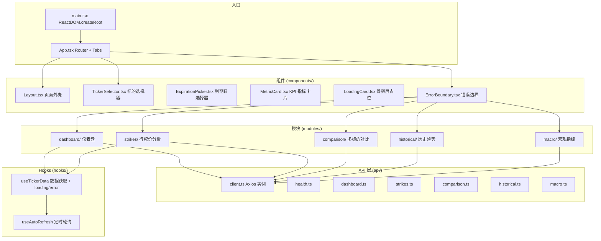
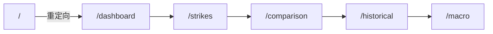
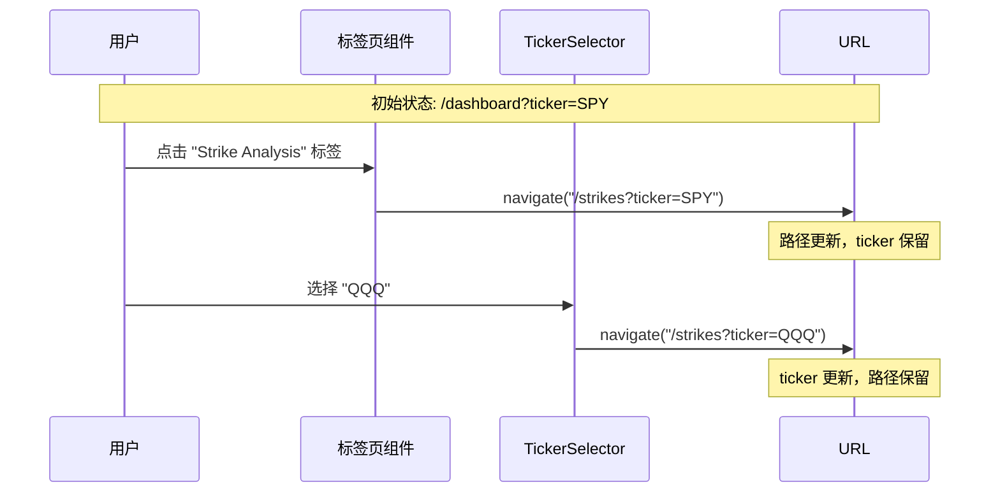
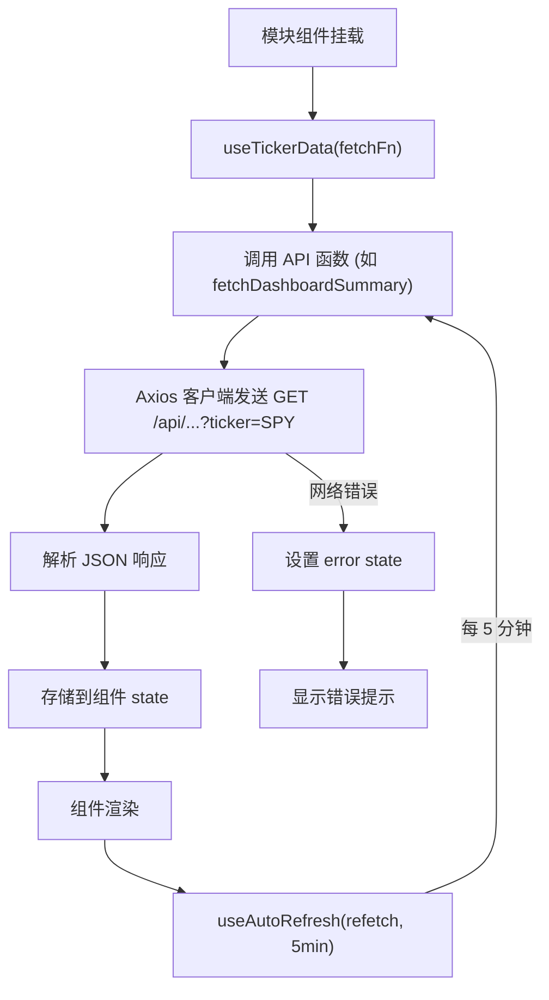
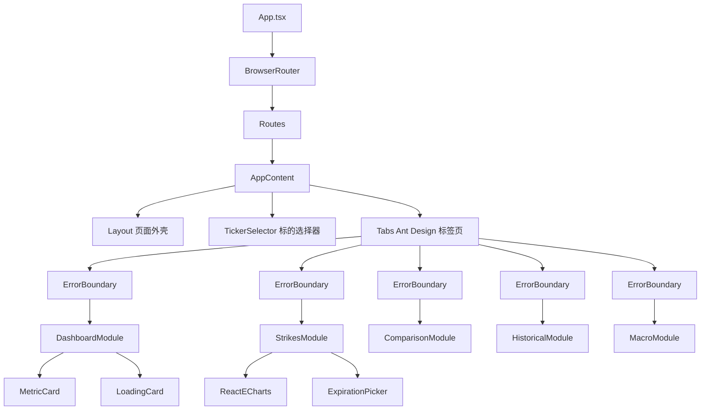
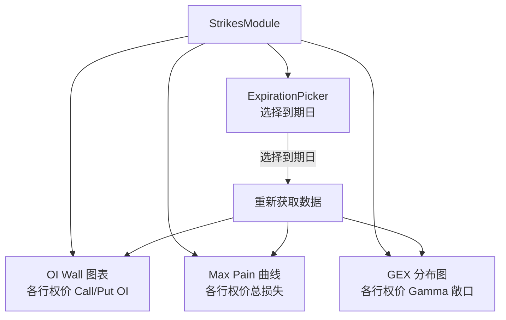
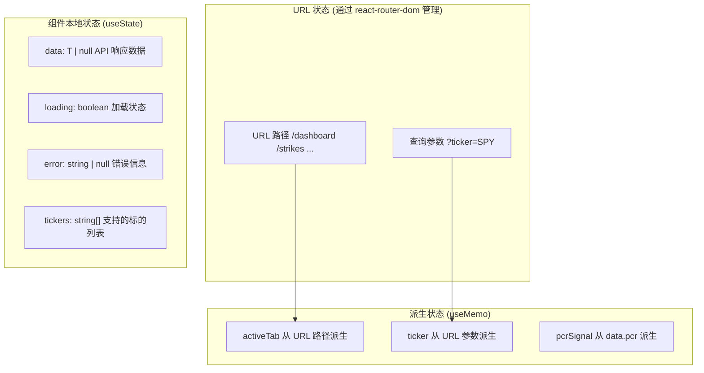
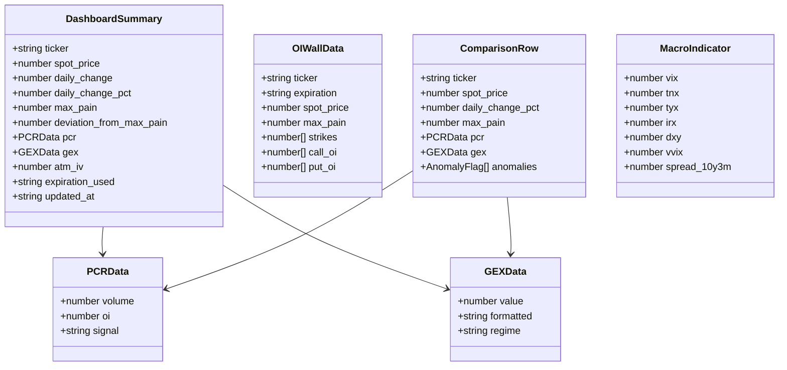

# 前端架构

OptionDash 前端是一个基于 React 的单页应用 (SPA)，使用 TypeScript 编写，Vite 作为构建工具，Ant Design 提供 UI 组件，ECharts 渲染数据图表，Tailwind CSS 处理样式。本页将深入讲解前端的每个组成部分。

---

## 应用结构总览



---

## 路由系统

前端使用 `react-router-dom` 的 `BrowserRouter` 实现客户端路由。路由与标签页 (Tabs) 联动，URL 路径决定当前激活的标签页。



**路由设计要点**：

- URL 路径决定当前激活的标签页：`/dashboard`、`/strikes`、`/comparison`、`/historical`、`/macro`
- URL 查询参数 `?ticker=SPY` 保存当前选择的标的
- 切换标签页时更新路径，保留 `ticker` 参数
- 切换标的时更新 `ticker` 参数，保留当前路径
- 根路径 `/` 自动重定向到 `/dashboard`

### 路由配置代码

```tsx
// 文件: frontend/src/App.tsx (第 167-180 行)
const App: React.FC = () => {
  return (
    <BrowserRouter>
      <Routes>
        <Route path="/" element={<Navigate to="/dashboard" replace />} />
        <Route path="/dashboard" element={<AppContent />} />
        <Route path="/strikes" element={<AppContent />} />
        <Route path="/comparison" element={<AppContent />} />
        <Route path="/historical" element={<AppContent />} />
        <Route path="/macro" element={<AppContent />} />
      </Routes>
    </BrowserRouter>
  );
};
```

所有路由都渲染同一个 `AppContent` 组件，通过 URL 路径来决定显示哪个标签页。这种设计避免了每个路由单独维护一套状态。

### 路径与标签页的双向映射

```tsx
// 文件: frontend/src/App.tsx (第 24-38 行)
const ROUTE_TABS: Record<string, string> = {
  '/dashboard': 'dashboard',
  '/strikes': 'strikes',
  '/comparison': 'comparison',
  '/historical': 'historical',
  '/macro': 'macro',
};

const TAB_ROUTES: Record<string, string> = {
  dashboard: '/dashboard',
  strikes: '/strikes',
  comparison: '/comparison',
  historical: '/historical',
  macro: '/macro',
};
```

### 标签页切换与 Ticker 保持



```tsx
// 文件: frontend/src/App.tsx (第 72-88 行)
// 切换 Ticker 时保留当前路径
const handleTickerChange = useCallback(
  (newTicker: Ticker) => {
    const params = new URLSearchParams(searchParams);
    params.set('ticker', newTicker);
    navigate(`${location.pathname}?${params.toString()}`, { replace: true });
  },
  [navigate, location.pathname, searchParams],
);

// 切换标签页时保留 ticker 参数
const handleTabChange = useCallback(
  (key: string) => {
    const params = new URLSearchParams(searchParams);
    navigate(`${TAB_ROUTES[key]}?${params.toString()}`, { replace: true });
  },
  [navigate, searchParams],
);
```

---

## 数据获取模式

每个业务模块遵循统一的数据获取模式，通过自定义 Hooks 实现：



### 自定义 Hook: useTickerData

通用数据获取 Hook，封装了 loading、error、refetch 状态管理：

```typescript
// 文件: frontend/src/hooks/useTickerData.ts (第 31-63 行)
export function useTickerData<T>(
  fetchFn: () => Promise<T>
): {
  data: T | null;
  loading: boolean;
  error: string | null;
  refetch: () => void;
} {
  const [data, setData] = useState<T | null>(null);
  const [loading, setLoading] = useState(true);
  const [error, setError] = useState<string | null>(null);

  const refetch = useCallback(async () => {
    setLoading(true);
    setError(null);
    try {
      const result = await fetchFn();
      setData(result);
    } catch (err: unknown) {
      const message = err instanceof Error ? err.message : 'Failed to fetch data';
      setError(message);
    } finally {
      setLoading(false);
    }
  }, [fetchFn]);

  useEffect(() => {
    refetch();
  }, [refetch]);

  return { data, loading, error, refetch };
}
```

**关键设计**：

1. **泛型参数 `<T>`** -- 支持任意 API 响应类型，编译时类型检查
2. **`useCallback` 包装 `refetch`** -- 确保 `fetchFn` 变化时自动重新请求
3. **`useEffect` 自动触发** -- 组件挂载时自动发起首次请求
4. **统一的 loading/error 状态** -- 每个模块可以直接使用这些状态渲染 UI

### 自定义 Hook: useAutoRefresh

定时轮询 Hook，基于 `setInterval` 实现：

```typescript
// 文件: frontend/src/hooks/useTickerData.ts (第 8-26 行)
export function useAutoRefresh(
  callback: () => void,
  interval: number = AUTO_REFRESH_INTERVAL,  // 默认 5 分钟
  enabled = true
) {
  const savedCallback = useRef(callback);

  useEffect(() => {
    savedCallback.current = callback;
  }, [callback]);

  useEffect(() => {
    if (!enabled) return;
    const tick = () => savedCallback.current();
    const id = setInterval(tick, interval);
    return () => clearInterval(id);
  }, [interval, enabled]);
}
```

**关键设计**：

1. **`useRef` 保存回调引用** -- 避免 `setInterval` 闭包捕获旧的回调函数
2. **组件卸载时自动清理** -- `clearInterval` 防止内存泄漏
3. **`enabled` 参数** -- 可以动态控制是否启用自动刷新

### Axios 客户端

统一的 HTTP 客户端配置：

```typescript
// 文件: frontend/src/api/client.ts (第 1-27 行)
import axios from 'axios';
import { API_BASE_URL } from '../utils/constants';

const apiClient = axios.create({
  baseURL: API_BASE_URL,  // '/api' -- 通过 Vite 代理转发到后端
  timeout: 30000,          // 30 秒超时
  headers: {
    'Content-Type': 'application/json',
  },
});

// 响应拦截器：统一处理错误
apiClient.interceptors.response.use(
  (response) => response,
  (error) => {
    const message =
      error.response?.data?.message ||
      error.response?.data?.error ||
      error.message ||
      'An unexpected error occurred';
    console.error(`[API Error] ${error.config?.url}: ${message}`);
    return Promise.reject(error);
  }
);

export default apiClient;
```

### API 模块示例

每个业务模块都有对应的 API 文件，封装了 Axios 调用：

```typescript
// 文件: frontend/src/api/dashboard.ts (第 1-21 行)
import apiClient from './client';
import type { DashboardSummary, ExpirationsResponse } from '../types';

export async function fetchDashboardSummary(
  ticker: string,
  expiration?: string
): Promise<DashboardSummary> {
  const params: Record<string, string> = { ticker };
  if (expiration) params.expiration = expiration;
  const { data } = await apiClient.get('/dashboard/summary', { params });
  return data;
}

export async function fetchExpirations(
  ticker: string
): Promise<ExpirationsResponse> {
  const { data } = await apiClient.get('/dashboard/expirations', {
    params: { ticker },
  });
  return data;
}
```

---

## 组件层次



### 核心组件说明

| 组件 | 文件 | 职责 |
|------|------|------|
| `Layout` | `components/Layout.tsx` | 页面外壳，提供 Header + Content + Footer 布局 |
| `TickerSelector` | `components/TickerSelector.tsx` | 标的选择下拉框，显示支持的标的列表 |
| `ExpirationPicker` | `components/ExpirationPicker.tsx` | 到期日选择器，用于行权价分析模块 |
| `MetricCard` | `components/MetricCard.tsx` | 可复用的 KPI 指标卡片，显示数值、趋势、标签 |
| `LoadingCard` | `components/LoadingCard.tsx` | 骨架屏占位组件，数据加载时显示 |
| `ErrorBoundary` | `components/ErrorBoundary.tsx` | React 错误边界，捕获子组件渲染错误 |

### MetricCard 组件详解

`MetricCard` 是最常用的展示组件，用于 Dashboard 和 Macro 模块：

```tsx
// 文件: frontend/src/components/MetricCard.tsx (第 1-82 行)
interface MetricCardProps {
  title: string;           // 指标名称
  value: string | number;  // 指标值
  prefix?: string;         // 前缀（如 "$"）
  suffix?: string;         // 后缀（如 "%"）
  precision?: number;      // 小数位数
  description?: string;    // 描述文字
  trend?: 'up' | 'down' | 'neutral';  // 趋势方向
  trendValue?: string;     // 趋势值（如 "+1.23%"）
  tag?: { label: string; color: string };  // 标签（如 "Bearish"）
  tooltip?: string;        // 悬浮提示
  loading?: boolean;       // 加载状态
}
```

使用示例（Dashboard 模块中的 Spot Price 卡片）：

```tsx
// 文件: frontend/src/modules/dashboard/index.tsx (第 82-93 行)
<MetricCard
  title="Spot Price"
  value={data.spot_price}
  precision={2}
  prefix="$"
  trend={spotTrend}
  trendValue={`${data.daily_change_pct >= 0 ? '+' : ''}${data.daily_change_pct.toFixed(2)}%`}
  description={deviationUp
    ? `${data.deviation_from_max_pain.toFixed(2)} above Max Pain`
    : `${Math.abs(data.deviation_from_max_pain).toFixed(2)} below Max Pain`}
  tooltip="Current underlying price"
/>
```

### ErrorBoundary 组件

React 错误边界，捕获子组件渲染过程中的 JavaScript 错误：

```tsx
// 文件: frontend/src/components/ErrorBoundary.tsx (第 14-51 行)
class ErrorBoundary extends Component<Props, State> {
  static getDerivedStateFromError(error: Error): State {
    return { hasError: true, error };
  }

  componentDidCatch(error: Error, errorInfo: ErrorInfo) {
    console.error('ErrorBoundary caught:', error, errorInfo);
  }

  render() {
    if (this.state.hasError) {
      return (
        <Alert
          type="error"
          message={this.props.fallbackTitle || 'Something went wrong'}
          description={this.state.error?.message || 'An unexpected error occurred.'}
          action={
            <Button size="small" onClick={() => this.setState({ hasError: false, error: null })}>
              Retry
            </Button>
          }
        />
      );
    }
    return this.props.children;
  }
}
```

---

## 模块详解

### DashboardModule

Dashboard 是默认展示的模块，显示四大核心指标卡片：

```tsx
// 文件: frontend/src/modules/dashboard/index.tsx (第 14-139 行)
const DashboardModule: React.FC<Props> = ({ ticker = 'SPY' }) => {
  // 1. 获取数据
  const fetchFn = useCallback(() => fetchDashboardSummary(ticker), [ticker]);
  const { data, loading, error, refetch } = useTickerData<DashboardSummary>(fetchFn);

  // 2. 获取到期日列表
  const fetchExpsFn = useCallback(() => fetchExpirations(ticker), [ticker]);
  const { data: expData } = useTickerData(fetchExpsFn);

  // 3. 自动刷新
  useAutoRefresh(refetch);

  // 4. PCR 信号派生
  const pcrSignal = useMemo(() => {
    if (!data?.pcr) return null;
    const { volume, oi } = data.pcr;
    if (volume > PCR_BEARISH_THRESHOLD || oi > PCR_BEARISH_THRESHOLD)
      return { label: 'Bearish', color: 'red' };
    if (volume < PCR_BULLISH_THRESHOLD || oi < PCR_BULLISH_THRESHOLD)
      return { label: 'Bullish', color: 'green' };
    return { label: 'Neutral', color: 'blue' };
  }, [data]);

  // 5. 渲染四个 MetricCard
  return (
    <div className="grid grid-cols-1 md:grid-cols-2 lg:grid-cols-4 gap-4">
      <MetricCard title="Spot Price" ... />
      <MetricCard title="Max Pain" ... />
      <MetricCard title="Put/Call Ratio" ... />
      <MetricCard title="Gamma Exposure" ... />
    </div>
  );
};
```

### StrikesModule

行权价分析模块包含三个 ECharts 图表：



```tsx
// 文件: frontend/src/modules/strikes/index.tsx (第 19-47 行)
const StrikesModule: React.FC<Props> = ({ ticker = 'SPY' }) => {
  const [expiration, setExpiration] = React.useState<string>();

  // 获取到期日列表
  const expFetchFn = useCallback(() => fetchExpirations(ticker), [ticker]);
  const { data: expData } = useTickerData(expFetchFn);

  // 自动选择第一个到期日
  React.useEffect(() => {
    if (expData?.expirations?.length && !expiration) {
      setExpiration(expData.expirations[0]);
    }
  }, [expData, expiration]);

  // 并行获取三个图表数据
  const { data: oiData } = useTickerData<OIWallData>(
    useCallback(() => fetchOIWall(ticker, expiration), [ticker, expiration])
  );
  const { data: mpData } = useTickerData<MaxPainCurveData>(
    useCallback(() => fetchMaxPainCurve(ticker, expiration), [ticker, expiration])
  );
  const { data: gexData } = useTickerData<GEXDistributionData>(
    useCallback(() => fetchGEXDistribution(ticker, expiration), [ticker, expiration])
  );
  // ... 使用 useMemo 构建 ECharts option ...
};
```

### ComparisonModule

多标的对比模块使用 Ant Design Table 展示，集成异常检测：

```tsx
// 文件: frontend/src/modules/comparison/index.tsx (第 9-198 行)
const ComparisonModule: React.FC = () => {
  const [tickers, setTickers] = useState<Ticker[]>(FALLBACK_TICKERS);

  // 获取支持的标的列表
  useEffect(() => {
    fetchTickers()
      .then((res) => setTickers(res.tickers))
      .catch(() => setTickers(FALLBACK_TICKERS));
  }, []);

  // 获取对比数据
  const fetchFn = useCallback(() => fetchComparison(tickers), [tickers]);
  const { data, loading, error } = useTickerData(fetchFn);

  // 表格列定义（包含异常标签渲染）
  const columns = useMemo(() => [
    { title: 'Ticker', dataIndex: 'ticker', ... },
    { title: 'Spot Price', render: (row) => `${row.spot_price} (${daily_change_pct}%)` },
    { title: 'Max Pain', render: (row) => `$${row.max_pain}` },
    { title: 'PCR (Vol/OI)', render: (row) => <Tag>{pcr.signal}</Tag> },
    { title: 'Gamma Exposure', render: (row) => row.gex.formatted },
    { title: 'Anomalies', render: (row) => row.anomalies.map(a => <Tag>{a.type}</Tag>) },
  ], []);

  return <Table columns={columns} dataSource={data?.data || []} />;
};
```

### MacroModule

宏观指标模块不依赖特定 Ticker，展示 VIX、国债收益率、DXY 等指标：

```tsx
// 文件: frontend/src/modules/macro/index.tsx (第 10-16 行)
// VIX 区间判断函数
function getVixRegime(vix: number): { label: string; color: string } {
  if (vix >= 30) return { label: 'Extreme Fear', color: '#7f1d1d' };
  if (vix >= 25) return { label: 'Fear', color: 'red' };
  if (vix >= 20) return { label: 'Caution', color: 'orange' };
  if (vix >= 15) return { label: 'Normal', color: 'gold' };
  return { label: 'Complacency', color: 'green' };
}
```

Macro 模块渲染 6 个 MetricCard 和 2 个 ECharts 图表：

```tsx
// 文件: frontend/src/modules/macro/index.tsx (第 181-294 行)
return (
  <div>
    {/* 6 个指标卡片 */}
    <div className="grid grid-cols-1 md:grid-cols-2 lg:grid-cols-3 gap-4 mb-6">
      <MetricCard title="VIX" ... />
      <MetricCard title="10Y Yield" ... />
      <MetricCard title="30Y Yield" ... />
      <MetricCard title="DXY" ... />
      <MetricCard title="VVIX" ... />
      <MetricCard title="10Y-3M Spread" ... />
    </div>

    {/* 2 个趋势图表 */}
    <div className="grid grid-cols-1 lg:grid-cols-2 gap-4">
      <ReactECharts option={yieldsOption} />  {/* 国债收益率趋势 */}
      <ReactECharts option={vixDxyOption} />  {/* VIX + DXY 双轴图 */}
    </div>
  </div>
);
```

---

## 状态管理

OptionDash 前端采用轻量级状态管理策略，无需引入 Redux 或 Zustand 等全局状态库：



**状态管理原则**：

- **URL 状态**: 当前标签页和选择的标的通过 URL 管理，支持浏览器前进/后退和书签
- **组件本地状态**: 每个模块独立管理自己的 data、loading、error 状态
- **无全局状态**: 各模块之间无共享状态，通过 URL 参数协调（如 `ticker`）
- **自定义 Hooks**: `useTickerData` 和 `useAutoRefresh` 封装通用的数据获取逻辑

---

## TypeScript 类型系统

所有 API 响应类型在 `types/index.ts` 中定义，确保前后端数据结构一致：



```typescript
// 文件: frontend/src/types/index.ts (第 24-36 行)
export interface DashboardSummary {
  ticker: string;
  spot_price: number;
  daily_change: number;
  daily_change_pct: number;
  max_pain: number;
  deviation_from_max_pain: number;
  pcr: PCRData;
  gex: GEXData;
  atm_iv: number;
  expiration_used: string;
  updated_at: string;
}
```

---

## 常量配置

前端常量集中在 `utils/constants.ts` 中管理：

```typescript
// 文件: frontend/src/utils/constants.ts (第 1-60 行)
// 默认标的列表（后端不可用时的降级方案）
export const FALLBACK_TICKERS: Ticker[] = ['SPY', 'QQQ', 'IWM', 'TLT', 'XLF'];

// 自动刷新间隔: 5 分钟
export const AUTO_REFRESH_INTERVAL = 5 * 60 * 1000;

// API 基础 URL（通过 Vite 代理转发到后端）
export const API_BASE_URL = '/api';

// 图表颜色
export const COLORS = {
  green: '#22c55e',  red: '#ef4444',
  blue: '#3b82f6',   orange: '#f97316',
  purple: '#a855f7', gray: '#6b7280',
} as const;

// PCR 信号阈值
export const PCR_BEARISH_THRESHOLD = 1.2;
export const PCR_BULLISH_THRESHOLD = 0.7;

// VIX 区间阈值
export const VIX_LEVELS = {
  LOW: 15, MODERATE: 20, ELEVATED: 25, HIGH: 30,
} as const;
```

---

## 格式化工具

前端提供统一的数字格式化函数：

```typescript
// 文件: frontend/src/utils/format.ts (第 1-75 行)
export function formatCurrency(value: number, decimals = 2): string {
  const sign = value < 0 ? '-' : '';
  return `${sign}$${formatNumber(Math.abs(value), decimals)}`;
}

export function formatLargeNumber(value: number): string {
  const absVal = Math.abs(value);
  const sign = value < 0 ? '-' : '';
  if (absVal >= 1e9) return `${sign}$${(absVal / 1e9).toFixed(2)}B`;
  if (absVal >= 1e6) return `${sign}$${(absVal / 1e6).toFixed(2)}M`;
  if (absVal >= 1e3) return `${sign}$${(absVal / 1e3).toFixed(2)}K`;
  return `${sign}$${absVal.toFixed(2)}`;
}

export function formatPercentRaw(value: number, decimals = 2): string {
  const sign = value > 0 ? '+' : '';
  return `${sign}${value.toFixed(decimals)}%`;
}
```
