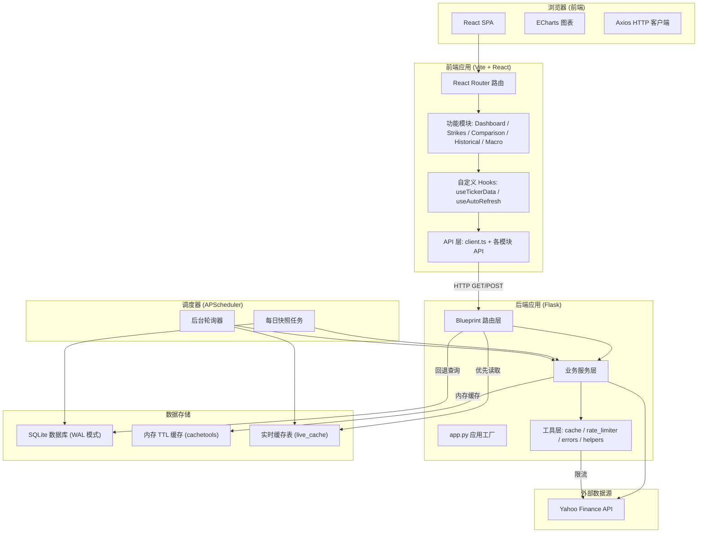
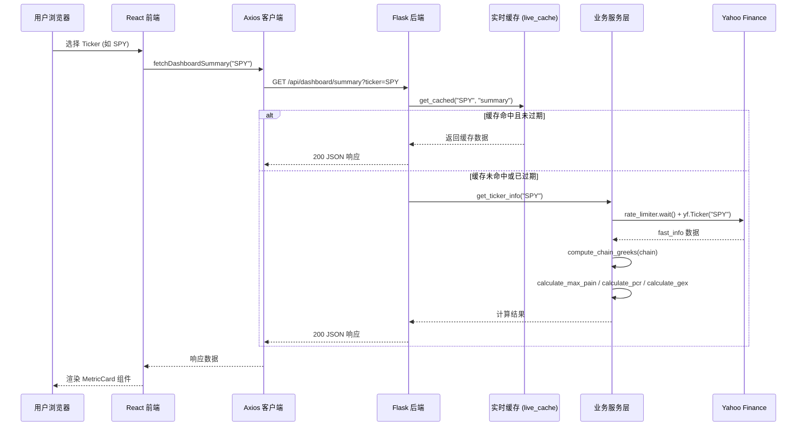
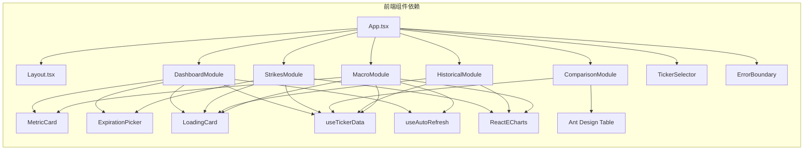
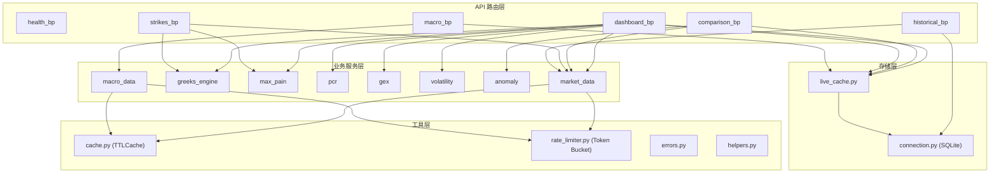
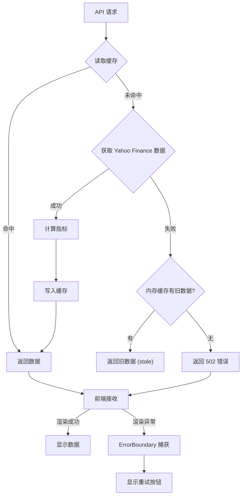
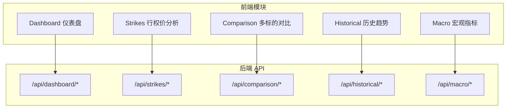

# 系统架构总览

本页全面介绍 OptionDash 的整体系统架构，包括前端、后端、数据库、调度器和外部 API 之间的协作关系。阅读本页后，你将理解系统从用户点击到数据展示的完整链路。

---

## 技术栈一览

| 层级 | 技术 | 选型理由 |
|------|------|----------|
| 前端框架 | React 18 + TypeScript | 类型安全、组件化开发、生态成熟 |
| UI 组件库 | Ant Design 5 | 企业级组件、表格/表单/图表支持完善 |
| 图表库 | ECharts (echarts-for-react) | 金融图表渲染性能优秀、支持双轴/标注线 |
| HTTP 客户端 | Axios | 拦截器机制、自动 JSON 解析、超时控制 |
| 后端框架 | Flask (Python) | 轻量灵活、Blueprint 模块化、快速开发 |
| 数据源 | yfinance (Yahoo Finance) | 免费、覆盖美股期权链、历史数据 |
| 数据库 | SQLite (WAL 模式) | 零配置、嵌入式、适合单机部署、WAL 保证并发读写 |
| 定时任务 | APScheduler | 支持 cron 和 interval 触发器、后台线程执行 |
| 希腊字母计算 | py_vollib_vectorized | 向量化 Black-Scholes 计算、批量处理高性能 |
| 数值计算 | NumPy + Pandas + SciPy | 期权链数据处理、统计计算、插值 |

---

## 全系统架构图

下图展示了系统中所有组件之间的交互关系。数据从 Yahoo Finance 流入后端服务层，经过缓存和计算后以 JSON 响应返回给前端。



---

## 请求生命周期

从用户在浏览器点击到数据展示的完整流程。这个序列图展示了缓存命中的快速路径和缓存未命中时的回退路径。



---

## 组件依赖关系图

前端组件之间的依赖关系。每个功能模块都包裹在 `ErrorBoundary` 中以实现错误隔离。



---

## 后端服务依赖图

后端各层之间的调用关系。API 路由层调用业务服务层，业务服务层依赖工具层和外部 API。



---

## 应用入口详解

### 后端入口: `backend/app.py`

后端使用 **应用工厂模式 (Application Factory Pattern)**，通过 `create_app()` 函数创建 Flask 实例。这种模式使得应用可以被多次创建（测试时尤其有用），并且避免了循环导入。

```python
# 文件: backend/app.py (第 23-51 行)
def create_app() -> Flask:
    """Application factory."""
    app = Flask(__name__)
    app.config.from_object(Config)          # 从 Config 类加载配置

    # CORS: 允许前端开发服务器跨域访问
    CORS(app, origins=Config.CORS_ORIGINS)

    # 注册 6 个 Blueprint（模块化路由）
    app.register_blueprint(health_bp)       # /api/health, /api/tickers
    app.register_blueprint(dashboard_bp)    # /api/dashboard/*
    app.register_blueprint(comparison_bp)   # /api/comparison/*
    app.register_blueprint(strikes_bp)      # /api/strikes/*
    app.register_blueprint(historical_bp)   # /api/historical/*
    app.register_blueprint(macro_bp)        # /api/macro/*

    # 配置日志级别
    logging.basicConfig(
        level=logging.DEBUG if Config.DEBUG else logging.INFO,
        format="%(asctime)s [%(levelname)s] %(name)s: %(message)s",
    )

    # 启动后台调度器（每日快照 + 轮询器）
    try:
        start_scheduler()
    except Exception:
        logging.getLogger(__name__).warning("Scheduler start failed")

    return app
```

**关键设计点**：

1. **`app.config.from_object(Config)`** -- 将 `Config` 类的属性自动映射为 Flask 配置项，方便通过环境变量覆盖
2. **`CORS(app, origins=Config.CORS_ORIGINS)`** -- 跨域资源共享，允许前端 `localhost:5173` 访问后端 `localhost:5001`
3. **Blueprint 注册顺序** -- 每个 Blueprint 定义了独立的路由前缀，互不干扰
4. **调度器启动** -- 在应用创建时就启动后台任务，而非等第一个请求到来

当直接运行 `python app.py` 时：

```python
# 文件: backend/app.py (第 54-59 行)
if __name__ == "__main__":
    app = create_app()
    try:
        app.run(host=Config.HOST, port=Config.PORT, debug=Config.DEBUG)
    finally:
        stop_scheduler()  # 确保退出时停止调度器
```

### 前端入口: `frontend/src/App.tsx`

前端使用 `React Router` 实现 SPA 路由，核心设计是 **单页面多标签** 模式 -- 所有页面共享同一个 `AppContent` 组件，通过 URL 路径切换标签页。

```tsx
// 文件: frontend/src/App.tsx (第 24-38 行)
// 路由路径到标签页的映射
const ROUTE_TABS: Record<string, string> = {
  '/dashboard': 'dashboard',
  '/strikes': 'strikes',
  '/comparison': 'comparison',
  '/historical': 'historical',
  '/macro': 'macro',
};

// 标签页到路由路径的映射（反向）
const TAB_ROUTES: Record<string, string> = {
  dashboard: '/dashboard',
  strikes: '/strikes',
  comparison: '/comparison',
  historical: '/historical',
  macro: '/macro',
};
```

**路由配置**（`App` 组件）：

```tsx
// 文件: frontend/src/App.tsx (第 167-180 行)
const App: React.FC = () => {
  return (
    <BrowserRouter>
      <Routes>
        <Route path="/" element={<Navigate to="/dashboard" replace />} />
        <Route path="/dashboard" element={<AppContent />} />
        <Route path="/strikes" element={<AppContent />} />
        <Route path="/comparison" element={<AppContent />} />
        <Route path="/historical" element={<AppContent />} />
        <Route path="/macro" element={<AppContent />} />
      </Routes>
    </BrowserRouter>
  );
};
```

**标签页与模块渲染**（每个模块都包裹在 `ErrorBoundary` 中）：

```tsx
// 文件: frontend/src/App.tsx (第 90-136 行)
const tabItems = [
  {
    key: 'dashboard',
    label: <span><DashboardOutlined /> Dashboard</span>,
    children: (
      <ErrorBoundary fallbackTitle="Dashboard module error">
        <DashboardModule ticker={ticker} />
      </ErrorBoundary>
    ),
  },
  {
    key: 'strikes',
    label: <span><BarChartOutlined /> Strike Analysis</span>,
    children: (
      <ErrorBoundary fallbackTitle="Strike analysis module error">
        <StrikesModule ticker={ticker} />
      </ErrorBoundary>
    ),
  },
  // ... comparison, historical, macro 同理
];
```

### 调度器启动: `backend/scheduler/jobs.py`

调度器注册了三种后台任务：

```python
# 文件: backend/scheduler/jobs.py (第 128-164 行)
def start_scheduler():
    """Start the background scheduler with daily snapshot + live poller."""
    # 1. 每日快照: 在美股收盘时运行（东部时间 16:30）
    scheduler.add_job(
        daily_snapshot_job,
        trigger="cron",
        hour=Config.SNAPSHOT_HOUR,       # 16
        minute=Config.SNAPSHOT_MINUTE,   # 30
        timezone="US/Eastern",
        id="daily_snapshot",
        replace_existing=True,
    )

    # 2. 后台轮询器: 每隔 N 秒刷新实时缓存
    from scheduler.poller import poll_all_tickers
    scheduler.add_job(
        poll_all_tickers,
        trigger="interval",
        seconds=Config.POLL_INTERVAL_SEC,  # 300 秒 = 5 分钟
        id="live_poller",
        replace_existing=True,
    )

    # 3. 立即执行一次轮询（非阻塞），确保启动后数据可用
    scheduler.add_job(
        poll_all_tickers,
        trigger="date",          # 立即执行一次
        id="live_poller_initial",
        replace_existing=True,
    )

    scheduler.start()
```

---

## 配置系统

所有配置项通过 `backend/config.py` 集中管理，支持环境变量覆盖：

```python
# 文件: backend/config.py (第 10-68 行)
class Config:
    # 数据库路径
    DATABASE_PATH = os.environ.get("OPTIONDASH_DB", "data/optiondash.db")

    # 支持的标的列表（可通过逗号分隔的环境变量配置）
    SUPPORTED_TICKERS = ["SPY", "QQQ", "IWM", "TLT", "XLF"]

    # 内存缓存配置
    CACHE_TTL = 300          # TTL: 5 分钟
    CACHE_MAX_SIZE = 128     # 最大条目数

    # Yahoo Finance 请求限速
    RATE_LIMIT_RPS = 2.0     # 2 请求/秒

    # Black-Scholes 无风险利率
    RISK_FREE_RATE = 0.0525  # 5.25%

    # 后台轮询间隔
    POLL_INTERVAL_SEC = 300  # 5 分钟

    # 实时缓存 TTL
    LIVE_CACHE_TTL_SEC = 600 # 10 分钟

    # 每日快照时间 (东部时间)
    SNAPSHOT_HOUR = 16
    SNAPSHOT_MINUTE = 30

    # 宏观指标符号映射
    MACRO_SYMBOLS = {
        "VIX": "^VIX", "TNX": "^TNX", "TYX": "^TYX",
        "IRX": "^IRX", "DXY": "DX-Y.NYB", "VVIX": "^VVIX",
    }
```

---

## 目录结构总览

```
optiondash/
├── backend/
│   ├── app.py              # 应用工厂入口
│   ├── config.py           # 配置中心
│   ├── api/                # Blueprint 路由层
│   │   ├── health.py       #   健康检查 + Ticker 列表
│   │   ├── dashboard.py    #   仪表盘摘要
│   │   ├── comparison.py   #   多 Ticker 对比
│   │   ├── strikes.py      #   行权价分析
│   │   ├── historical.py   #   历史趋势
│   │   └── macro.py        #   宏观指标
│   ├── services/           # 业务逻辑层
│   │   ├── market_data.py  #   Yahoo Finance 数据获取
│   │   ├── greeks_engine.py#   希腊字母计算引擎
│   │   ├── max_pain.py     #   Max Pain 计算
│   │   ├── pcr.py          #   Put/Call Ratio
│   │   ├── gex.py          #   Gamma Exposure
│   │   ├── volatility.py   #   波动率指标
│   │   ├── anomaly.py      #   异常检测
│   │   ├── macro_data.py   #   宏观数据获取
│   │   └── live_cache.py   #   实时缓存管理
│   ├── database/
│   │   ├── connection.py   #   SQLite 连接管理器
│   │   └── schema.sql      #   数据库表结构
│   ├── scheduler/
│   │   ├── jobs.py         #   定时任务定义
│   │   └── poller.py       #   后台轮询器
│   └── utils/
│       ├── cache.py        #   内存 TTL 缓存
│       ├── rate_limiter.py #   令牌桶限流器
│       ├── errors.py       #   统一错误响应
│       └── helpers.py      #   通用工具函数
└── frontend/
    └── src/
        ├── App.tsx          # 路由 + 标签页
        ├── api/             # API 调用层
        ├── components/      # 共享组件
        ├── hooks/           # 自定义 Hooks
        ├── modules/         # 功能模块
        ├── types/           # TypeScript 类型
        └── utils/           # 常量 + 格式化
```

---

## 数据流向概览

数据从 Yahoo Finance 流入系统，经过多层缓存和计算后，最终以 JSON 响应返回给前端或存储到历史表中。

```mermaid
flowchart LR
    subgraph DataSources["数据源"]
        YF["Yahoo Finance"]
    end

    subgraph Ingestion["数据采集"]
        Poller["后台轮询器 (每 5 分钟)"]
        Scheduler["每日快照 (16:30 ET)"]
    end

    subgraph Storage["存储"]
        MemCache["内存缓存 TTL: 5 分钟"]
        LiveCache["SQLite live_cache TTL: 10 分钟"]
        DailySnap["SQLite daily_snapshots 永久保存"]
    end

    subgraph Computation["计算"]
        Greeks["Black-Scholes 希腊字母"]
        MaxPain["Max Pain"]
        PCR["Put/Call Ratio"]
        GEX["Gamma Exposure"]
        Vol["波动率指标 IV/HV/VRP/Skew"]
    end

    subgraph API_Resp["API 响应"]
        Summary["Dashboard Summary"]
        OIWall["OI Wall"]
        Compare["Comparison"]
        History["Historical Trends"]
        Macro["Macro Indicators"]
    end

    YF -->|"rate_limiter 限流"| Poller
    YF -->|"rate_limiter 限流"| Scheduler

    Poller --> Computation
    Scheduler --> Computation

    Computation --> MemCache
    Computation --> LiveCache
    Computation --> DailySnap

    MemCache -->|"/api/* 先查"| API_Resp
    LiveCache -->|"/api/* 其次查"| API_Resp
    DailySnap -->|"/api/historical/*"| API_Resp
```



---

## 错误处理策略

系统采用 **分层错误处理**，每一层都有自己的容错机制：



1. **数据获取层** -- yfinance 调用失败时，尝试返回内存缓存中的旧数据（stale data）
2. **缓存层** -- JSON 解析失败时记录警告并返回 `None`，触发回退到直接获取
3. **API 层** -- 统一使用 `utils/errors.py` 中的格式化函数返回标准错误响应
4. **前端层** -- 每个模块包裹在 `ErrorBoundary` 中，单个模块出错不影响其他模块

```python
# 文件: backend/utils/errors.py (第 13-25 行)
def error_response(error_code: str, message: str, status: int = 500,
                   details: dict | None = None):
    """Return a consistent error JSON response with proper logging."""
    payload = {
        "error": error_code,
        "message": message,
        "timestamp": datetime.now(timezone.utc).isoformat(),
    }
    if details:
        payload["details"] = details
    logger.error(f"[{error_code}] {message}")
    return jsonify(payload), status
```

---

## 核心模块总览

前端五个功能模块与后端 API 端点的对应关系：



| 前端模块 | 后端 API | 核心功能 |
|---------|---------|---------|
| Dashboard | `/api/dashboard/summary` | Spot Price、Max Pain、PCR、GEX 四大指标卡片 |
| Strikes | `/api/strikes/*` | OI Wall 柱状图、Max Pain 曲线、GEX 分布图 |
| Comparison | `/api/comparison/overview` | 多标的横向对比表格，含异常检测 |
| Historical | `/api/historical/*` | Max Pain vs Price、PCR/GEX 趋势、波动率、Skew |
| Macro | `/api/macro/*` | VIX、国债收益率、DXY、VVIX 等宏观指标 |
