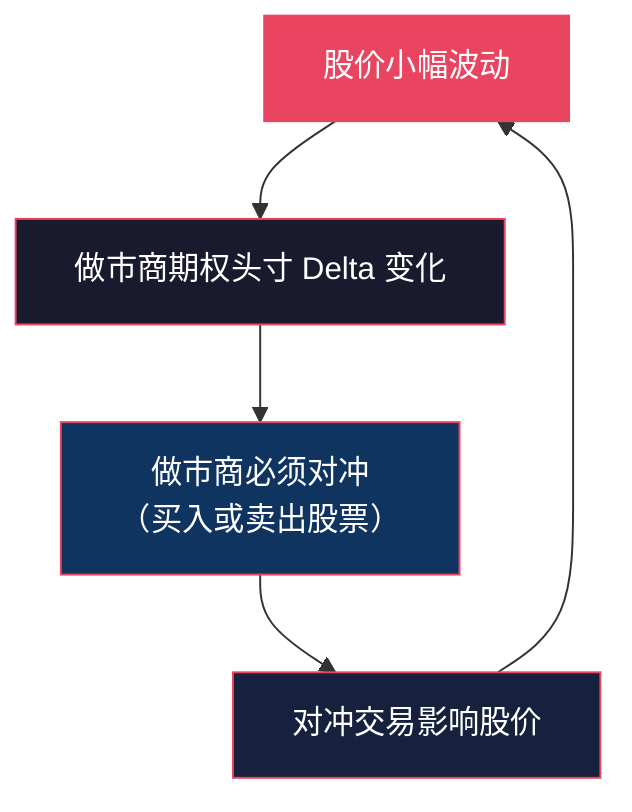
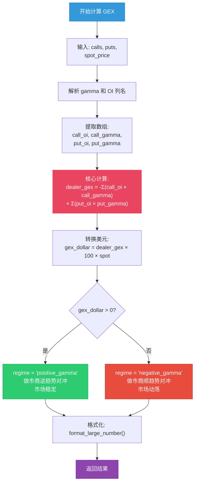
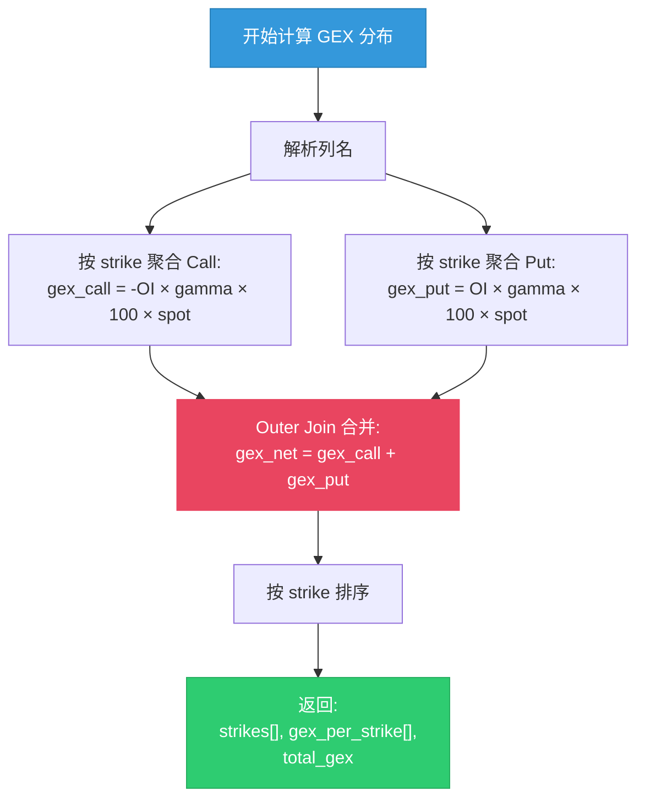
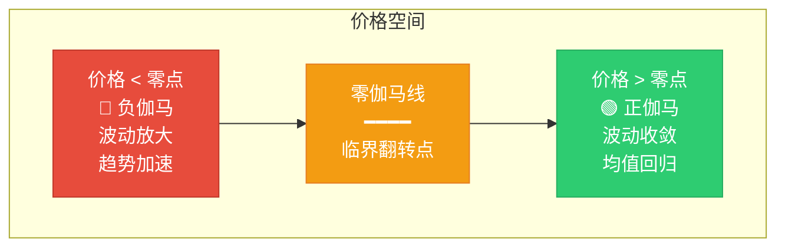
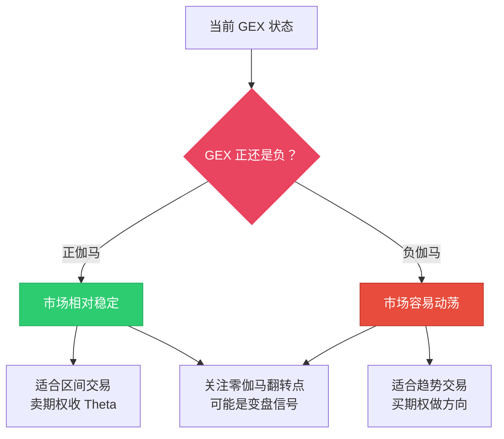

# 伽马敞口 Gamma Exposure (GEX)

:::tip 适合谁读？
本文面向零基础读者。建议先阅读 [希腊字母 Greeks](./greeks.md) 了解 Gamma 的基本概念。GEX 是理解市场微观结构最重要的指标之一。本文包含 OptionDash 后端 `gex.py` 的完整代码逐行解析。
:::

## 什么是 GEX？

**Gamma Exposure (GEX)** 衡量的是：当股价变动时，做市商（dealers）需要进行多大规模的对冲交易。

打个比方：

> 想象你是一个保险公司的精算师。你卖出了大量的房屋地震保险。如果地震风险突然上升（股价大幅波动），你必须立刻采取行动 -- 要么买入再保险，要么卖出已有的保单。**GEX 就是衡量这种"被迫采取行动"的规模有多大。**

当这个规模很大时，做市商的对冲交易本身就会**影响股价**，形成自我强化的反馈循环。



---

## 做市商的角色

要理解 GEX，首先要理解做市商在期权市场中的角色：

| 角色 | 说明 |
|------|------|
| **做市商是谁？** | 大型金融机构（如 Citadel、Susquehanna），为期权市场提供流动性 |
| **他们的工作** | 无论你想买还是卖期权，做市商都会接单。他们是期权的"批发商" |
| **关键特征** | 他们**通常持有净空头期权头寸**（卖出的期权比买入的多） |

正因为做市商通常是期权的**净卖方**，他们面临着巨大的方向性风险。为了管理这个风险，他们必须**持续对冲** -- 买卖标的股票来保持风险中性。

---

## 计算方法

GEX 的计算从做市商的视角出发。核心公式如下：

### 每股 GEX

```
做市商 GEX（每股） = -Σ(Call OI × Call Gamma) + Σ(Put OI × Put Gamma)
```

:::info 为什么 Call 是负号？
做市商通常**卖出** Call（持有空头 Call）。空头 Call 的 Gamma 为负值。负号乘以负值得到正数 -- 所以卖出 Call 为做市商贡献**正 Gamma**。
:::

### 美元 GEX

```
美元 GEX = 做市商 GEX（每股） × 100 × 现货价格
```

乘以 100 是因为每张期权合约代表 100 股。乘以现货价格是将"每股"换算为"美元"。

---

## 完整源码逐行解析

以下是 OptionDash 后端 `backend/services/gex.py` 的完整代码。

### 模块头部

```python
# 文件: backend/services/gex.py, 第 1-8 行

"""
Gamma Exposure (GEX) calculation.
"""

import numpy as np
import pandas as pd

from utils.helpers import format_large_number
```

导入 NumPy 和 Pandas 用于数据计算，`format_large_number` 用于将大数字格式化为带 B/M/K 后缀的字符串（如 "$2.3B"）。

### 格式化辅助函数

```python
# 文件: backend/utils/helpers.py, 第 14-35 行

def format_large_number(value: float) -> str:
    """
    Format a large number with B/M/K suffix.
    Examples:
        1_500_000_000 -> "$1.50B"
        -1_010_000_000 -> "-$1.01B"
        250_000_000 -> "$250.00M"
    """
    abs_val = abs(value)
    sign = "-" if value < 0 else ""

    if abs_val >= 1e9:
        return f"{sign}${abs_val / 1e9:.2f}B"
    elif abs_val >= 1e6:
        return f"{sign}${abs_val / 1e6:.2f}M"
    elif abs_val >= 1e3:
        return f"{sign}${abs_val / 1e3:.2f}K"
    else:
        return f"{sign}${abs_val:.2f}"
```

### 主计算函数：calculate_gex

```python
# 文件: backend/services/gex.py, 第 11-56 行

def calculate_gex(
    calls: pd.DataFrame,
    puts: pd.DataFrame,
    spot_price: float,
) -> dict:
    """
    Calculate total Gamma Exposure from the dealer perspective.

    Dealer GEX = -Sum(call_OI * call_gamma) + Sum(put_OI * put_gamma)  [per-share]
    GEX in dollars = dealer_gex * 100 * spot_price

    Positive GEX → dealers are long gamma → they trade against the trend
    (damping volatility).
    Negative GEX → dealers are short gamma → they trade with the trend
    (amplifying volatility).
    """
```

**第 11-27 行**：函数签名和文档字符串。接收 Call、Put 的 DataFrame 和当前股价。

### 解析列名

```python
    # 第 28-31 行：解析列名
    gamma_col_c = _resolve_column(calls, ("gamma",))         # Call 的 gamma 列
    gamma_col_p = _resolve_column(puts, ("gamma",))          # Put 的 gamma 列
    oi_col_c = _resolve_column(calls, ("open_interest", "openinterest", "oi"))
    oi_col_p = _resolve_column(puts, ("open_interest", "openinterest", "oi"))
```

与 PCR 和 Max Pain 中类似的列名解析逻辑，兼容不同数据源。

### 提取数组

```python
    # 第 33-38 行：提取 NumPy 数组
    call_oi = calls[oi_col_c].fillna(0).values       # Call OI 数组
    call_gamma = calls[gamma_col_c].fillna(0).values  # Call Gamma 数组
    put_oi = puts[oi_col_p].fillna(0).values          # Put OI 数组
    put_gamma = puts[gamma_col_p].fillna(0).values    # Put Gamma 数组
```

`fillna(0)` 处理缺失的 OI 或 Gamma 数据。

### 核心计算

```python
    # 第 41 行：计算每股 GEX（做市商视角）
    dealer_gex_per_share = -np.sum(call_oi * call_gamma) + np.sum(put_oi * put_gamma)

    # 第 44 行：转换为美元 GEX
    gex_dollar = float(dealer_gex_per_share * 100 * spot_price)
```

**第 41 行** 是核心公式：
- `-np.sum(call_oi * call_gamma)`：做市商卖出 Call，负号表示做市商持有负 Gamma 的 Call（空头），但 Call 本身 Gamma 为正，所以负负得正，贡献正 GEX
- `+np.sum(put_oi * put_gamma)`：Put 的 Gamma 通常为正（对做市商来说是空头 Put），直接贡献正 GEX

**第 44 行**：乘以 100（合约规格）和现货价格，转换为美元。

### 判定 Regime 并返回

```python
    # 第 46-50 行：判定正/负伽马环境
    regime = "positive_gamma" if gex_dollar > 0 else "negative_gamma"

    return {
        "value": round(gex_dollar, 2),
        "formatted": format_large_number(gex_dollar),
        "regime": regime,
    }
```

`format_large_number` 将数字格式化为人类可读的形式，例如 `$2.30B`、`-$150.00M`。

### GEX 计算流程图



---

## GEX 分布计算：calculate_gex_distribution

除了总 GEX，OptionDash 还计算每个行权价的 GEX 分布，用于绘制 GEX 分布图。

```python
# 文件: backend/services/gex.py, 第 59-102 行

def calculate_gex_distribution(
    calls: pd.DataFrame,
    puts: pd.DataFrame,
    spot_price: float,
) -> dict:
    """
    Calculate GEX per strike level for distribution charting.
    """
```

### 按行权价聚合 Call GEX

```python
    # 第 76-80 行：按 strike 聚合 Call
    call_agg = calls.groupby("strike").agg(
        total_oi=(oi_col_c, "sum"),           # 同一 strike 的 OI 求和
        total_gamma=(gamma_col_c, "sum"),     # 同一 strike 的 Gamma 求和
    ).reset_index()
    call_agg["gex"] = -call_agg["total_oi"] * call_agg["total_gamma"] * 100 * spot_price
```

**第 76-80 行**：使用 `groupby("strike")` 将同一行权价的多个合约（可能有不同到期日）聚合。然后对每个行权价计算 GEX。注意 Call GEX 带负号。

### 按行权价聚合 Put GEX

```python
    # 第 82-86 行：按 strike 聚合 Put
    put_agg = puts.groupby("strike").agg(
        total_oi=(oi_col_p, "sum"),
        total_gamma=(gamma_col_p, "sum"),
    ).reset_index()
    put_agg["gex"] = put_agg["total_oi"] * put_agg["total_gamma"] * 100 * spot_price
```

Put GEX 为正（没有负号）。

### 合并 Call 和 Put 的 GEX

```python
    # 第 88-93 行：合并
    call_gex_s = call_agg[["strike", "gex"]].rename(columns={"gex": "gex_call"})
    put_gex_s = put_agg[["strike", "gex"]].rename(columns={"gex": "gex_put"})
    combined = pd.merge(call_gex_s, put_gex_s, on="strike", how="outer").fillna(0)
    combined["gex_net"] = combined["gex_call"] + combined["gex_put"]
    combined = combined.sort_values("strike")
```

**第 91 行**：使用 `outer` join 合并，确保即使某个行权价只有 Call 或只有 Put 也不会丢失。`fillna(0)` 填充缺失的 GEX 值。

**第 92 行**：净 GEX = Call GEX + Put GEX。

### 返回结果

```python
    # 第 94-102 行：格式化返回
    strikes = [round(s, 2) for s in combined["strike"].tolist()]
    gex_net = [round(g, 2) for g in combined["gex_net"].tolist()]

    return {
        "strikes": strikes,
        "gex_per_strike": gex_net,
        "total_gex": round(sum(gex_net), 2),
    }
```

### GEX 分布计算流程



---

## 计算示例

假设当前 SPY 价格为 $530：

| 行权价 | 类型 | OI | Gamma | GEX 贡献 |
|--------|------|------|-------|---------|
| $530 | Call | 10,000 | 0.05 | -10,000 x 0.05 = **-500** |
| $530 | Put | 8,000 | 0.04 | +8,000 x 0.04 = **+320** |
| $540 | Call | 15,000 | 0.03 | -15,000 x 0.03 = **-450** |
| $520 | Put | 12,000 | 0.03 | +12,000 x 0.03 = **+360** |

```
GEX（每股）= -500 + 320 - 450 + 360 = -270
美元 GEX = -270 × 100 × $530 = -$14,310,000
```

结果为**负值**，说明处于**负伽马环境**。

### 每个行权价的 GEX 分布

| 行权价 | Call GEX | Put GEX | 净 GEX |
|--------|----------|---------|--------|
| $520 | $0 | +$19,080,000 | **+$19,080,000** |
| $530 | -$26,500,000 | +$16,960,000 | **-$9,540,000** |
| $540 | -$23,760,000 | $0 | **-$23,760,000** |
| **合计** | | | **-$14,220,000** |

$540 行权价的 Call GEX 最大（-$23.76M），说明这个价位是主要的"吸力点"。

---

## 正 GEX vs 负 GEX

GEX 的正负决定了做市商的对冲方向，进而影响整个市场的行为模式。

### 正伽马 (Positive GEX) -- "稳定器"

做市商持有正 Gamma，意味着他们的对冲行为**逆趋势**：


| 特征 | 说明 |
|------|------|
| **做市商行为** | 下跌时买入，上涨时卖出 |
| **市场效果** | 抑制波动，促进均值回归 |
| **走势特点** | 区间震荡，涨跌幅度有限 |
| **波动率** | 实现波动率较低 |
| **适合策略** | 均值回归策略、卖期权 |

### 负伽马 (Negative GEX) -- "放大器"

做市商持有负 Gamma，意味着他们的对冲行为**顺趋势**：


| 特征 | 说明 |
|------|------|
| **做市商行为** | 下跌时卖出，上涨时买入 |
| **市场效果** | 放大波动，推动趋势 |
| **走势特点** | 趋势性行情，容易出现急涨急跌 |
| **波动率** | 实现波动率较高 |
| **适合策略** | 趋势跟踪、买期权 |

### 对比总结

| 维度 | 正伽马 | 负伽马 |
|------|--------|--------|
| **做市商角色** | 流动性提供者（稳定市场） | 流动性消耗者（放大波动） |
| **对冲方向** | 逆趋势操作 | 顺趋势操作 |
| **市场行为** | 均值回归 | 趋势加速 |
| **波动率** | 低 | 高 |
| **类比** | 橡皮筋（拉得越远弹力越大） | 雪球（越滚越快） |

---

## GEX 零点 (Zero Gamma Level)

**GEX 零点**是股价在某个特定水平时，总 GEX 恰好为零的点。它是市场动态的**分水岭**：



### 零点的重要性

| 含义 | 说明 |
|------|------|
| **技术层面** | 标志着市场从"稳定区"进入"不稳定区"（或反之） |
| **交易层面** | 当股价在零点附近时，市场行为可能发生质变 |
| **心理层面** | 做市商在零点附近调整对冲策略，可能引发连锁反应 |

:::tip 实战技巧
当股价从正伽马区穿越零点进入负伽马区时，波动率往往会突然放大。这通常是市场即将出现大幅波动的预警信号。
:::

---

## GEX 与股价走势的关系

下图展示了 GEX 如何影响市场的整体行为：



---

## 在 OptionDash 中查看 GEX

### API 端点

```python
# 文件: backend/api/strikes.py, 第 105-131 行
@strikes_bp.route("/api/strikes/gex-distribution", methods=["GET"])
def gex_distribution():
    ticker = request.args.get("ticker", "SPY").upper()
    expiration = request.args.get("expiration")
    # ... 验证和缓存逻辑 ...

    chain = _live_chain_fallback(ticker, expiration)
    chain = compute_chain_greeks(chain)               # 先计算 Greeks
    dist = calculate_gex_distribution(chain["calls"], chain["puts"], chain["spot_price"])

    return jsonify({
        "ticker": ticker,
        "expiration": chain["expiration"],
        "spot_price": chain["spot_price"],
        "strikes": dist["strikes"],
        "gex_per_strike": dist["gex_per_strike"],
        "total_gex": dist["total_gex"],
    })
```

前端数据结构：

```typescript
// 文件: frontend/src/types/index.ts, 第 62-69 行
export interface GEXDistributionData {
  ticker: string;
  expiration: string;
  spot_price: number;
  strikes: number[];          // 所有行权价
  gex_per_strike: number[];   // 每个行权价的净 GEX
  total_gex: number;          // 总 GEX
}
```

### 仪表盘 (Dashboard)

| 展示内容 | 说明 |
|---------|------|
| **GEX 总值** | 以美元为单位，带 B/M/K 后缀（如 $2.3B） |
| **状态标签** | "正伽马" 或 "负伽马" |
| **自动刷新** | 每 5 分钟更新一次 |

### 行权价分析 (Strike Analysis)

GEX 分布图展示每个行权价上的净 GEX：

- **绿色柱状**：该行权价贡献正伽马
- **红色柱状**：该行权价贡献负伽马
- **零伽马线**：正负伽马的分界

---

## 实际应用指南

### 场景一：高正 GEX 环境

**特征**：GEX 显著为正，市场波动率低

**策略思路**：
- 适合卖期权（Iron Condor、Credit Spread）
- 设置窄区间，利用均值回归特性
- 注意：如果零伽马翻转点距离较近，保持警惕

### 场景二：负 GEX 环境

**特征**：GEX 为负，市场波动率高

**策略思路**：
- 趋势可能加速，避免逆势抄底/摸顶
- 适合买期权做方向性交易
- 注意风险管理，设置止损

### 场景三：GEX 零点翻转

**特征**：股价接近零伽马翻转点

**策略思路**：
- 这是最关键的信号 -- 市场可能从"稳定"切换到"不稳定"（或反之）
- 提前调整仓位，做好两手准备
- 观察成交量是否配合

:::warning 风险提示
GEX 是一个动态指标，会随着股价变动和期权持仓变化而实时更新。不要将 GEX 作为唯一的交易依据，应结合其他指标（如 PCR、Max Pain、波动率）综合判断。
:::

---

## 进阶概念

### 术语对照表

| 英文术语 | 中文翻译 | 说明 |
|---------|---------|------|
| Gamma Exposure | 伽马敞口 | 做市商因 Gamma 产生的风险敞口 |
| Positive Gamma | 正伽马 | 做市商持有正 Gamma，逆趋势对冲 |
| Negative Gamma | 负伽马 | 做市商持有负 Gamma，顺趋势对冲 |
| Zero Gamma Level | 零伽马翻转点 | GEX 从正转负的价格水平 |
| Dealer Hedging | 做市商对冲 | 做市商为管理风险而进行的股票交易 |
| Dollar GEX | 美元 GEX | 以美元计价的伽马敞口总量 |

:::note 下一步
- [波动率 Volatility](./volatility.md) -- 了解波动率如何影响期权定价和 GEX
- [25-Delta 偏斜](./skew.md) -- 了解期权市场的恐慌/贪婪不对称性
:::
