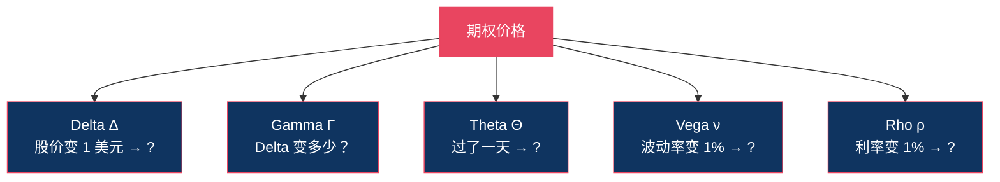
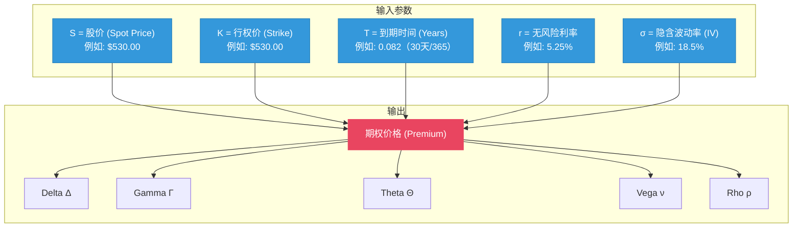
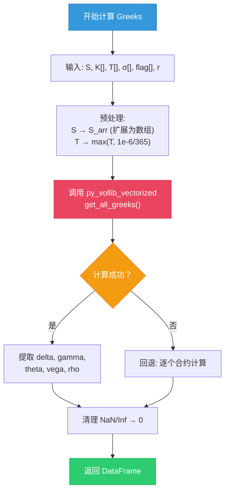
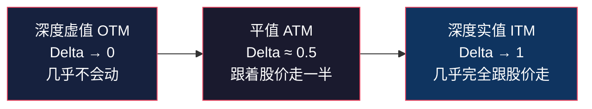
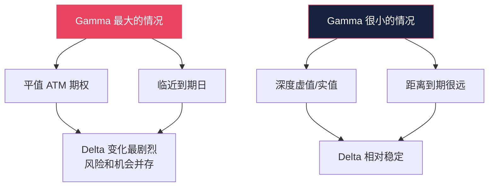
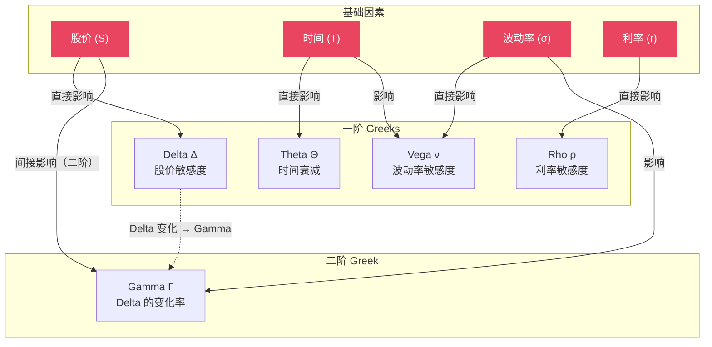
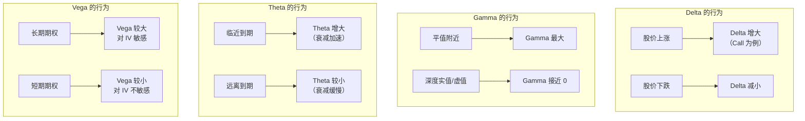

# 希腊字母 Greeks

:::tip 适合谁读？
本文面向零基础读者。如果你已经了解[期权基础](./options-basics.md)，就能读懂本文。我们会用生活中的例子解释每一个希腊字母，并展示 OptionDash 后端如何通过 Black-Scholes 模型计算它们。
:::

## 什么是 Greeks？

想象你正在驾驶一辆车。车速表告诉你当前速度，油表告诉你还剩多少油，温度表告诉你发动机是否过热。**Greeks 就是期权世界的仪表盘** -- 它们告诉你期权价格正在受哪些因素影响，以及影响有多大。

更准确地说，**Greeks 是期权价格对各种因素的敏感度**（数学上称为"偏导数"）。它们回答的核心问题是：

> 如果某个因素变化了一点点，期权价格会变化多少？



### Greeks 总览

| 希腊字母 | 衡量什么？ | 通俗理解 |
|----------|-----------|---------|
| **Delta (Δ)** | 股价变动的影响 | "股价涨 1 块钱，我赚/亏多少？" |
| **Gamma (Γ)** | Delta 的变化速度 | "Delta 本身变化有多快？" |
| **Theta (Θ)** | 时间流逝的影响 | "每过一天，我亏多少？" |
| **Vega (ν)** | 波动率变动的影响 | "市场恐慌/平静了，我赚/亏多少？" |
| **Rho (ρ)** | 利率变动的影响 | "央行加息了，我赚/亏多少？" |

---

## Black-Scholes 模型：Greeks 的数学基础

OptionDash 使用 **Black-Scholes 模型** 计算 Greeks。这个模型是期权定价的基石。

### 模型输入与输出



### OptionDash 中的无风险利率

```python
# 文件: backend/config.py, 第 37 行
RISK_FREE_RATE = float(os.environ.get("RISK_FREE_RATE", 0.0525))
```

默认使用 5.25% 的无风险利率，可通过环境变量 `RISK_FREE_RATE` 调整。

---

## OptionDash Greeks 计算引擎详解

OptionDash 使用 `py_vollib_vectorized` 库进行高效的向量化 Greeks 计算。以下是 `backend/services/greeks_engine.py` 的完整解析。

### 核心计算函数

```python
# 文件: backend/services/greeks_engine.py, 第 16-61 行

def compute_greeks(
    S: float,
    K: np.ndarray,
    T: np.ndarray,
    sigma: np.ndarray,
    flag: np.ndarray,
    r: float | None = None,
) -> pd.DataFrame:
    """
    Compute Greeks for an array of option contracts.

    Args:
        S: Spot price (scalar).          # 当前股价（标量）
        K: Strike prices (array).         # 行权价数组
        T: Annualized time to expiration (array).  # 年化到期时间数组
        sigma: Implied volatility (array). # 隐含波动率数组
        flag: 'c' for call, 'p' for put (array).  # 期权类型标记数组
        r: Risk-free rate (annualized).    # 无风险利率

    Returns:
        DataFrame with columns: delta, gamma, theta, vega, rho.
    """
```

**第 16-37 行**：函数签名。注意 `S` 是标量（一个数值），而 `K`、`T`、`sigma`、`flag` 都是数组。这种设计允许一次性计算整条期权链。

### 输入预处理

```python
    # 第 38-39 行：设置无风险利率
    if r is None:
        r = Config.RISK_FREE_RATE  # 默认 0.0525

    # 第 42 行：将标量 S 扩展为与 K 等长的数组
    S_arr = np.full_like(K, S, dtype=float)

    # 第 43 行：防止 T 过小导致数值问题（最小约 1 秒）
    T = np.maximum(T, 1e-6 / 365)
```

**第 42 行** 的 `np.full_like(K, S, dtype=float)` 是关键：`py_vollib_vectorized` 需要 `S` 和 `K` 都是数组，所以把标量股价复制成与行权价等长的数组。

**第 43 行** 的 `np.maximum(T, 1e-6 / 365)` 是一个防护措施：如果到期时间几乎为零（比如到期日当天），直接设为约 1 秒，避免除以零的数学错误。

### 批量计算

```python
    # 第 45-49 行：调用 py_vollib_vectorized 批量计算
    try:
        greeks_df = get_all_greeks(
            flag, S_arr, K, T, r, sigma,
            model="black_scholes",
            return_as="dataframe"
        )
    except Exception as e:
        logger.warning(f"Batch Greeks computation failed: {e}")
        return _compute_greeks_fallback(S, K, T, sigma, flag, r)
```

**第 46 行** 的 `get_all_greeks` 是 `py_vollib_vectorized` 库的核心函数。它接受五个数组输入，一次性计算所有合约的全部 Greeks，返回一个 DataFrame。使用 `model="black_scholes"` 指定定价模型。

**第 49 行** 是错误回退机制：如果批量计算失败（比如某个合约的数据异常），就逐个计算。

### 结果处理

```python
    # 第 52-61 行：构建结果 DataFrame
    result = pd.DataFrame()
    result["delta"] = greeks_df.get("delta", 0.0)
    result["gamma"] = greeks_df.get("gamma", 0.0)
    result["theta"] = greeks_df.get("theta", 0.0)
    result["vega"] = greeks_df.get("vega", 0.0)
    result["rho"] = greeks_df.get("rho", 0.0)

    # 替换 NaN/Inf 为 0，避免前端显示错误
    result = result.fillna(0.0).replace([np.inf, -np.inf], 0.0)
    return result
```

**第 60 行** 非常重要：`fillna(0.0).replace([np.inf, -np.inf], 0.0)` 确保返回的数值都是有限的。深度虚值期权在接近到期时，Greeks 可能产生极端值或 NaN。

### 回退计算函数

```python
# 文件: backend/services/greeks_engine.py, 第 64-94 行

def _compute_greeks_fallback(
    S: float, K: np.ndarray, T: np.ndarray,
    sigma: np.ndarray, flag: np.ndarray, r: float
) -> pd.DataFrame:
    """Per-contract fallback when batch computation fails."""
    results = {"delta": [], "gamma": [], "theta": [], "vega": [], "rho": []}

    for i in range(len(K)):          # 逐个合约计算
        try:
            greeks = get_all_greeks(
                np.array([flag[i]]),
                np.array([S]),
                np.array([K[i]]),
                np.array([T[i]]),
                r,
                np.array([sigma[i]]),
                model="black_scholes",
                return_as="dict",
            )
            results["delta"].append(float(greeks.get("delta", [0])[0]) if "delta" in greeks else 0.0)
            # ... 类似地处理 gamma, theta, vega, rho ...
        except Exception:
            # 计算失败时填入 0
            for key in results:
                results[key].append(0.0)

    return pd.DataFrame(results)
```

回退函数逐个合约计算 Greeks。虽然效率较低，但保证了在批量计算失败时仍能返回结果。单个合约计算失败时，该合约的 Greeks 被设为 0。

### Greeks 计算流程



---

## Delta (Δ) -- "方向敏感度"

### 定义

**Delta 衡量的是：股价每变动 $1，期权价格变动多少。**

打个比方：

> 你买了一张彩票，中奖概率是 60%。如果奖金池增加 $100，你的彩票大约值钱多了 $60。此时 Delta ≈ 0.6。

### 数值范围

| 期权类型 | Delta 范围 | 平值 (ATM) 大约值 |
|---------|-----------|-----------------|
| **看涨期权 (Call)** | 0 到 +1 | ≈ +0.50 |
| **看跌期权 (Put)** | -1 到 0 | ≈ -0.50 |

### 关键特性



### 举例说明

假设你持有 SPY 行权价 $530 的 Call，Delta = 0.60：

| 股价变动 | 期权价格变动 | 说明 |
|---------|------------|------|
| SPY 涨 $1（$530 → $531） | 期权涨 $0.60 | Delta 在起作用 |
| SPY 涨 $5（$530 → $535） | 期权涨约 $3.00 | 0.60 x 5 = 3.00 |
| SPY 跌 $1（$530 → $529） | 期权跌 $0.60 | Delta 有正有负 |

:::info Delta 的另一个含义
Delta 可以粗略理解为期权**到期时变为实值 (ITM) 的概率**。Delta = 0.60 意味着大约有 60% 的概率到期时股价会高于行权价。这只是一个近似，但在实践中很有用。
:::

### Delta 对交易者的意义

| 交易策略 | Delta 选择 | 原因 |
|---------|-----------|------|
| 看涨投机 | 选高 Delta（0.7+） | 跟涨更紧密 |
| 低成本博弈 | 选低 Delta（0.2-） | 便宜，但需要大涨才能赚 |
| 对冲持仓 | Delta 中性（≈0） | 不看方向，只做波动 |

---

## Gamma (Γ) -- "加速度"

### 定义

**Gamma 衡量的是：股价每变动 $1，Delta 变化多少。**

如果 Delta 是"速度"，那 Gamma 就是"加速度"：

> 想象一辆车从静止开始加速。Delta 告诉你当前速度，Gamma 告诉你速度在加快还是减慢。

### 关键特性



### 举例说明

假设当前情况：

- 股价 $530，你持有 $530 Call（平值）
- Delta = 0.50，Gamma = 0.05

| 股价变动 | 新 Delta | Delta 变化 | 说明 |
|---------|---------|-----------|------|
| 涨 $1（$531） | 0.55 | +0.05 | Delta 从 0.50 变为 0.55 |
| 再涨 $1（$532） | 0.60 | +0.05 | Delta 继续增大 |
| 跌 $2（$530） | 0.50 | -0.10 | 回到原点 |

:::warning Gamma 风险
临近到期的平值期权 Gamma 特别大，这意味着 Delta 可能在短时间内剧烈变化。对于期权卖方来说，这是最大的风险来源 -- 想象方向盘突然变得极度灵敏。
:::

### Gamma 对市场的影响

Gamma 和做市商的对冲行为密切相关，这直接影响了市场的波动特性。详见 [伽马敞口 GEX](./gex.md)。

---

## Theta (Θ) -- "时间的敌人"

### 定义

**Theta 衡量的是：每过一天，期权价格减少多少。**

对于期权**买方**来说，Theta 是你的敌人 -- 时间在不断侵蚀你的期权价值。

打个比方：

> 你买了一个冰淇淋。每过一分钟，它都在融化一点。Theta 就是"融化速度"。而且随着冰淇淋越来越小，融化的速度反而越来越快（临近到期加速衰减）。

### 关键特性

| 特性 | 说明 |
|------|------|
| **总是负数**（对买方而言） | 时间只朝一个方向走，期权价值只会随时间减少 |
| **临近到期加速** | 最后 30 天衰减最快，像冰淇淋快化完时融得最快 |
| **平值最大** | ATM 期权的时间价值最多，衰减也最快 |
| **周末效应** | 周五收盘到周一开盘之间也会计算 Theta |

### 时间衰减曲线


### 举例说明

假设你买入一份 SPY Call，Theta = -0.15：

| 时间流逝 | 期权价格变化 | 说明 |
|---------|------------|------|
| 过了 1 天 | 减少 $0.15 | 即使股价没动，期权也贬值了 |
| 过了 7 天 | 减少约 $1.05 | 0.15 x 7 = 1.05（实际会加速） |
| 过了 30 天 | 减少约 $4.50+ | 加速衰减，实际损失更大 |

:::tip 买方 vs 卖方
- **买方**：Theta 是敌人。你需要股价快速朝有利方向变动，才能跑赢时间衰减。
- **卖方**：Theta 是朋友。时间站在你这边，每天都在帮你赚钱。这就是为什么卖期权被称为"卖保险"。
:::

---

## Vega (ν) -- "恐慌指标"

### 定义

**Vega 衡量的是：隐含波动率 (IV) 每变动 1%，期权价格变动多少。**

打个比方：

> 想象你买了一份地震保险。如果地质学家突然宣布"近期可能有大地震"（波动率上升），你的保险就变得更值钱了 -- 因为大家都想买保险。

### 关键特性

| 特性 | 说明 |
|------|------|
| **对买方总是有利** | 波动率上升 → 期权变贵 |
| **长期期权更敏感** | 距离到期越久，Vega 越大 |
| **平值最大** | ATM 期权的 Vega 最高 |
| **事件驱动** | 财报、美联储会议前 IV 飙升，Vega 影响最大 |

### 举例说明

假设你买入一份 Call，Vega = 0.20：

| IV 变动 | 期权价格变化 | 场景 |
|--------|------------|------|
| IV 从 20% 涨到 21%（+1%） | 涨 $0.20 | 市场恐慌加剧 |
| IV 从 20% 涨到 25%（+5%） | 涨 $1.00 | 重大事件前恐慌升温 |
| IV 从 20% 跌到 15%（-5%） | 跌 $1.00 | 事件过后，IV 坍塌 |

:::warning IV Crush（隐含波动率坍塌）
财报公布后，不确定性消除，IV 通常会急剧下降。即使股价朝你预测的方向变动，Vega 带来的损失也可能抵消掉方向性收益。这就是所谓的 **IV Crush**，是期权买方最常见的陷阱之一。
:::

---

## Rho (ρ) -- "利率的微小影响"

### 定义

**Rho 衡量的是：利率每变动 1%，期权价格变动多少。**

Rho 是五个 Greeks 中最不常被讨论的，因为短期期权对利率变化不敏感。但对于长期期权（如 LEAPS，到期日超过 1 年），Rho 的影响会变得显著。

| 期权类型 | Rho 值 | 利率上升的影响 |
|---------|--------|--------------|
| **Call** | 正数 | 利率上升 → Call 变贵 |
| **Put** | 负数 | 利率上升 → Put 变便宜 |

:::info 为什么利率会影响期权？
利率上升意味着持有股票的"机会成本"增加（钱存银行利息更多了），这使得 Call 更有吸引力（可以用期权替代直接持股），Put 则相反。但在短期交易中，这个影响通常可以忽略。
:::

---

## Greeks 之间的关系

五个 Greeks 并不是孤立存在的，它们之间有着密切的联系：



### 关键关系总结

| 关系 | 说明 |
|------|------|
| **Delta 与 Gamma** | Gamma 是 Delta 的"加速度"。Gamma 越大，Delta 变化越快 |
| **Theta 与 Gamma** | Gamma 大的期权通常 Theta 也大（平值、短期）。"免费午餐"不存在 -- 高 Gamma 意味着高时间衰减 |
| **Theta 与 Vega** | 短期期权 Theta 大但 Vega 小；长期期权 Vega 大但 Theta 小 |
| **Vega 与事件** | 重大事件前 IV 上升，Vega 的影响被放大；事件后 IV Crush，Vega 反向作用 |

:::info Gamma-Theta 平衡
对期权卖方来说，Gamma 和 Theta 是一对矛盾：Gamma 让你面临方向性风险，Theta 让你从时间衰减中获利。好的期权策略需要在这两者之间找到平衡。
:::

### Greeks 与价格/时间/波动率的关系图



---

## Greeks 速查表

下表汇总了不同情境下各 Greeks 的典型表现：

| 情境 | Delta | Gamma | Theta | Vega |
|------|-------|-------|-------|------|
| **平值 Call（ATM）** | ≈ +0.50 | 高 | 负值大（衰减快） | 高 |
| **实值 Call（ITM）** | → +1.00 | 低 | 负值小 | 较低 |
| **虚值 Call（OTM）** | → 0 | 低 | 负值小 | 较低 |
| **临近到期** | 变化剧烈 | 极高 | 极高 | 低 |
| **长期期权（LEAPS）** | 变化平缓 | 低 | 低 | 极高 |

---

## 在 OptionDash 中查看 Greeks

OptionDash 使用 **Black-Scholes 模型**（通过 `py_vollib_vectorized` 库）计算 Greeks：

- **计算公式**：标准 Black-Scholes 偏导数
- **无风险利率**：默认 5.25%（可在配置文件中调整）
- **数据来源**：隐含波动率 (IV) 来自 Yahoo Finance 期权链

Greeks 在 OptionDash 中的应用：

| 功能模块 | 用到的 Greeks | 用途 |
|---------|-------------|------|
| **GEX 计算** | Gamma | 计算做市商的伽马敞口 |
| **行权价分析** | Delta, Gamma | 每个 strike 的风险指标 |
| **波动率分析** | Vega, Theta | 波动率研究和时间衰减分析 |
| **25-Delta 偏斜** | Delta, IV | 计算 Skew 时需要 Delta 来定位特定 IV |

### Greeks 在数据库中的存储

```sql
-- 文件: backend/database/schema.sql, 第 37-42 行
-- strike_snapshots 表中的 Greeks 列
call_gamma REAL,
put_gamma REAL,
call_delta REAL,
put_delta REAL,
```

历史快照会存储每个行权价的 Call 和 Put 的 Delta 和 Gamma，用于追踪时间序列分析。

---

:::note 下一步
了解了 Greeks 之后，建议继续阅读：
- [伽马敞口 GEX](./gex.md) -- 了解 Gamma 如何影响整个市场的稳定性
- [波动率 Volatility](./volatility.md) -- 深入理解 Vega 和隐含波动率
- [25-Delta 偏斜](./skew.md) -- 了解 Delta 在偏斜计算中的应用
:::
