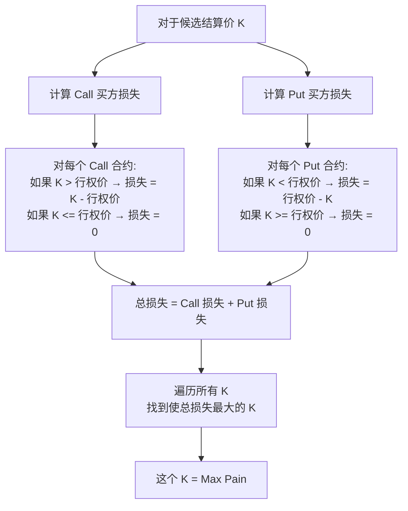
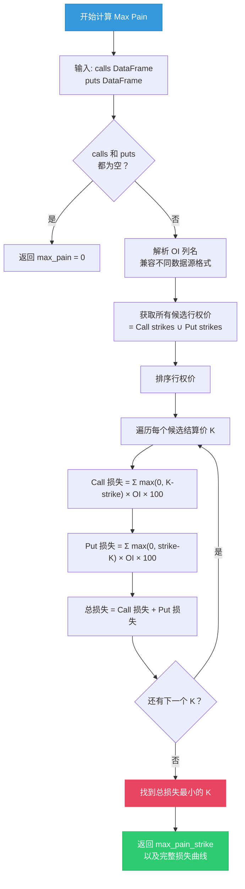
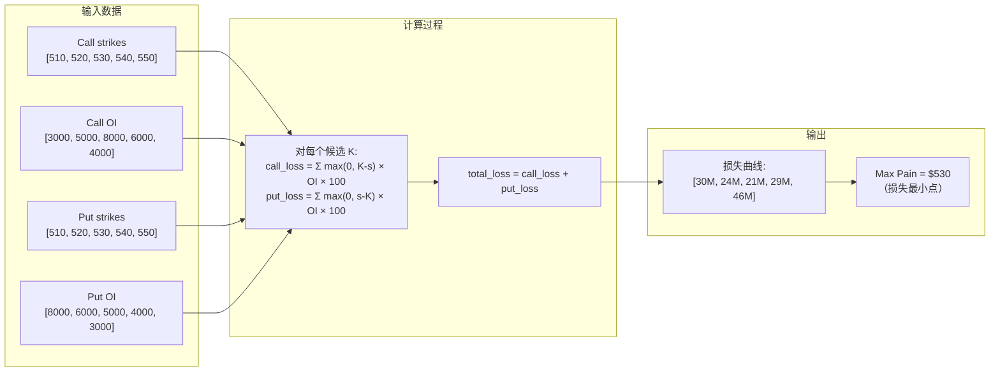
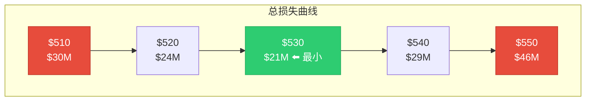
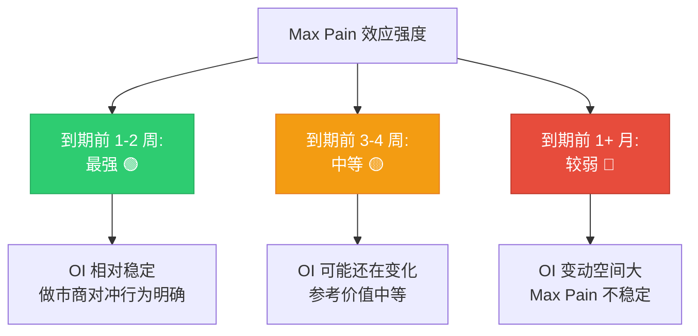

# 最大痛苦点 Max Pain

:::tip 适合谁读？
本文适合想了解"到期日价格为什么会往某个位置靠"这个现象的读者。读完后你将理解 Max Pain 的计算逻辑和在实际交易中的应用。本文包含 OptionDash 后端 `max_pain.py` 的完整代码逐行解析。
:::

## 什么是 Max Pain？

**最大痛苦点 (Max Pain)** 是指在期权到期时，**期权买方总体亏损最大**（同时期权卖方获利最大）的那个价格。

换一个说法：Max Pain 是到期时让所有期权合约**总内在价值最小**的股价。

> 打个比方：想象一个大型赌场，里面有成千上万的赌客（期权买方）和庄家（期权卖方）。Max Pain 就是那个让赌客们总体亏得最多、庄家总体赚得最多的结果。
>
> 市场有一种倾向：**到期日临近时，股价会向 Max Pain 靠拢**。这就像庄家有"无形的手"在引导结果。

### 为什么叫"最大痛苦"？

因为在这个价格点上：

- 大量 Call 持有者发现股价低于行权价，Call 变得分文不值
- 大量 Put 持有者发现股价高于行权价，Put 变得分文不值
- **两者同时亏钱** -- 这就是"最大痛苦"

## 计算方法

Max Pain 的计算并不复杂，只是需要遍历所有行权价。

对于每个候选结算价格 K，计算所有期权买方的**总损失**：

```
总损失(K) = Σ max(0, K - 行权价_i) × Call OI_i × 100
          + Σ max(0, 行权价_j - K) × Put OI_j × 100
```

**使总损失最大的那个 K，就是 Max Pain。**

:::info 等价理解
注意：买方的总损失 = 卖方的总利润。因此 Max Pain 也可以理解为"卖方利润最大化的点"。在代码实现中，我们找的是总损失的**最小值** -- 这是从卖方角度看的"最大利润"。
:::

### 公式拆解



## Max Pain 计算算法流程图



## 完整源码逐行解析

以下是 OptionDash 后端 `backend/services/max_pain.py` 的完整代码及逐行解释：

### 函数签名与文档字符串

```python
# 文件: backend/services/max_pain.py, 第 1-70 行

"""
Max Pain calculation — the strike price where total option holder loss is minimized
(equivalent to where option writers would profit the most).
"""

import numpy as np
import pandas as pd
```

模块导入：使用 `numpy` 进行高效的数组数学运算，`pandas` 处理期权链 DataFrame。

### 主计算函数

```python
def calculate_max_pain(calls: pd.DataFrame, puts: pd.DataFrame) -> dict:
    """
    Compute Max Pain from calls and puts DataFrames.

    For each candidate settlement price K:
        total_loss(K) = Sum max(0, K - strike_i) * call_OI_i
                      + Sum max(0, strike_j - K) * put_OI_j

    Returns the strike K that minimizes total_loss.
    """
```

**第 10-27 行**：函数接收两个 DataFrame（calls 和 puts），返回一个字典。文档字符串清晰地描述了数学公式。

### 空数据检查

```python
    if calls.empty and puts.empty:
        return {"max_pain_strike": 0.0, "strikes": [], "total_loss": []}
```

**第 28-29 行**：如果两个 DataFrame 都为空，直接返回默认值。这是一个防御性编程的好习惯。

### 解析 OI 列名

```python
    oi_col_c = _resolve_oi_column(calls)   # 找到 calls 中 OI 的列名
    oi_col_p = _resolve_oi_column(puts)    # 找到 puts 中 OI 的列名
```

**第 31-32 行**：调用辅助函数找到正确的列名。这是因为 `yfinance` 不同版本返回的列名可能不同（`open_interest`、`oi`、`openinterest`）。

```python
def _resolve_oi_column(df: pd.DataFrame) -> str:
    """Resolve OI column name from the yfinance output."""
    for col in ("open_interest", "oi", "openinterest"):
        if col in df.columns:
            return col
    return df.columns[0]  # fallback
```

**第 65-70 行**：辅助函数，依次尝试三个常见的列名。

### 获取所有候选行权价

```python
    # Get all unique candidate strikes
    all_strikes = sorted(
        set(calls["strike"].tolist()) | set(puts["strike"].tolist())
    )
```

**第 34-37 行**：使用集合的并集（`|`）合并 Call 和 Put 的所有行权价，然后排序。这确保了每个可能的行权价都被考虑为候选结算价。

### 提取数组

```python
    if not all_strikes:
        return {"max_pain_strike": 0.0, "strikes": [], "total_loss": []}

    call_strikes = calls["strike"].values           # Call 行权价数组
    call_oi = calls[oi_col_c].fillna(0).values       # Call OI 数组（NaN 填 0）
    put_strikes = puts["strike"].values               # Put 行权价数组
    put_oi = puts[oi_col_p].fillna(0).values          # Put OI 数组（NaN 填 0）
```

**第 39-45 行**：将 DataFrame 列提取为 NumPy 数组，便于高效计算。`fillna(0)` 处理缺失的 OI 数据。

### 核心计算循环

```python
    total_losses = []
    for K in all_strikes:
        # Call holders lose if K > strike
        call_loss = np.sum(np.maximum(K - call_strikes, 0) * call_oi * 100)
        # Put holders lose if K < strike
        put_loss = np.sum(np.maximum(put_strikes - K, 0) * put_oi * 100)
        total_losses.append(call_loss + put_loss)
```

**第 47-53 行**：这是 Max Pain 计算的核心。逐行解释：

- `np.maximum(K - call_strikes, 0)`：对每个 Call 行权价，计算 `K - strike`，取 max(0, ...) 表示只有当 K 大于行权价时 Call 才有内在价值（买方行权亏钱）
- `* call_oi * 100`：乘以 OI（合约数量）和 100（每张合约 100 股）
- `np.sum(...)`：对所有 Call 合约求和，得到 Call 买方的总损失
- Put 的计算类似，只是方向相反

### 找到 Max Pain

```python
    min_idx = int(np.argmin(total_losses))     # 找到总损失最小的索引
    max_pain = all_strikes[min_idx]             # 对应的行权价

    return {
        "max_pain_strike": round(max_pain, 2),
        "strikes": [round(s, 2) for s in all_strikes],
        "total_loss": [round(l, 2) for l in total_losses],
    }
```

**第 55-62 行**：`np.argmin` 找到总损失最小的索引，该索引对应的行权价就是 Max Pain。返回值包含三个字段：
- `max_pain_strike`：Max Pain 行权价
- `strikes`：所有候选行权价列表（用于绘制 X 轴）
- `total_loss`：每个候选行权价对应的总损失（用于绘制 Y 轴）

## 总损失曲线的构建过程



## 直观理解：一个完整例子

假设 SPY 当前价格 $530，以下是最新的期权 OI 数据：

| 行权价 | Call OI | Put OI |
|--------|---------|--------|
| $510 | 3,000 | 8,000 |
| $520 | 5,000 | 6,000 |
| $530 | 8,000 | 5,000 |
| $540 | 6,000 | 4,000 |
| $550 | 4,000 | 3,000 |

### 第一步：假设结算价 K = $530

**Call 买方损失**（K 大于行权价时才亏）：

| 行权价 | K - Strike | Call OI | 损失金额 |
|--------|------------|---------|----------|
| $510 | $20 | 3,000 | $20 x 3,000 x 100 = **$6,000,000** |
| $520 | $10 | 5,000 | $10 x 5,000 x 100 = **$5,000,000** |
| $530 | $0 | 8,000 | **$0** |
| $540 | $0 | 6,000 | **$0** |
| $550 | $0 | 4,000 | **$0** |
| | | | **Call 总损失 = $11,000,000** |

**Put 买方损失**（K 小于行权价时才亏）：

| 行权价 | Strike - K | Put OI | 损失金额 |
|--------|------------|--------|----------|
| $510 | $0 | 8,000 | **$0** |
| $520 | $0 | 6,000 | **$0** |
| $530 | $0 | 5,000 | **$0** |
| $540 | $10 | 4,000 | $10 x 4,000 x 100 = **$4,000,000** |
| $550 | $20 | 3,000 | $20 x 3,000 x 100 = **$6,000,000** |
| | | | **Put 总损失 = $10,000,000** |

**K = $530 时总损失 = $11,000,000 + $10,000,000 = $21,000,000**

### 第二步：对每个候选 K 重复计算

| 结算价 K | Call 损失 | Put 损失 | **总损失** |
|----------|----------|----------|-----------|
| $510 | $2,000,000 | $28,000,000 | $30,000,000 |
| $520 | $6,000,000 | $18,000,000 | $24,000,000 |
| **$530** | **$11,000,000** | **$10,000,000** | **$21,000,000** |
| $540 | $23,000,000 | $6,000,000 | $29,000,000 |
| $550 | $43,000,000 | $3,000,000 | $46,000,000 |

### 第三步：找到最大损失点



在这个例子中，**Max Pain = $530**（总损失最小的点）。

:::caution 等等，不是"最大"痛苦吗？
你可能注意到了：我们找的是总损失**最小**的点。这是因为从**卖方**角度看，他们希望买方亏得最多（卖方赚最多）。但从**买方**角度看，$530 是让买方总体亏损最小的点 -- 即买方在这个价格点"最不痛苦"。

实际上两种说法都有人用。关键是理解：**Max Pain 是到期时使期权总内在价值最小的股价**，也就是让卖方利润最大、买方利润最小的点。
:::

### 用代码验证这个例子

```python
import pandas as pd
import numpy as np

# 构造示例数据
calls = pd.DataFrame({
    "strike": [510, 520, 530, 540, 550],
    "open_interest": [3000, 5000, 8000, 6000, 4000]
})
puts = pd.DataFrame({
    "strike": [510, 520, 530, 540, 550],
    "open_interest": [8000, 6000, 5000, 4000, 3000]
})

result = calculate_max_pain(calls, puts)
print(f"Max Pain: ${result['max_pain_strike']}")
# 输出: Max Pain: $530.0
print(f"总损失: {result['total_loss']}")
# 输出: 总损失: [30000000.0, 24000000.0, 21000000.0, 29000000.0, 46000000.0]
```

## API 端点

OptionDash 通过以下 API 暴露 Max Pain 计算结果：

```python
# 文件: backend/api/strikes.py, 第 78-102 行
@strikes_bp.route("/api/strikes/max-pain-curve", methods=["GET"])
def max_pain_curve():
    ticker = request.args.get("ticker", "SPY").upper()
    expiration = request.args.get("expiration")
    # ... 验证和缓存逻辑 ...

    chain = _live_chain_fallback(ticker, expiration)
    max_pain_result = calculate_max_pain(chain["calls"], chain["puts"])

    return jsonify({
        "ticker": ticker,
        "expiration": chain["expiration"],
        "strikes": max_pain_result["strikes"],       # X 轴: 所有候选行权价
        "total_loss": max_pain_result["total_loss"], # Y 轴: 总损失曲线
        "max_pain_strike": max_pain_result["max_pain_strike"],  # Max Pain 价格
    })
```

前端数据结构：

```typescript
// 文件: frontend/src/types/index.ts, 第 54-60 行
export interface MaxPainCurveData {
  ticker: string;
  expiration: string;
  strikes: number[];         // 所有候选行权价
  total_loss: number[];      // 每个行权价对应的总损失
  max_pain_strike: number;   // Max Pain 行权价
}
```

## Max Pain 的实际表现

### 为什么股价会趋向 Max Pain？

这种现象的原因有多种理论解释：

| 理论 | 解释 |
|------|------|
| **做市商对冲** | 做市商作为期权卖方，会通过买卖股票来对冲风险，这些交易推动股价向 Max Pain 靠拢 |
| **Gamma 效应** | 临近到期时 Gamma 增大，做市商的对冲交易更频繁，影响力更强 |
| **自证预言** | 越来越多交易者关注 Max Pain 并据此交易，从而强化了这个效应 |
| **期权到期** | 大量期权到期作废，减少了推动股价偏离的力量 |

### 何时最有效？



:::tip 实战经验
Max Pain 在**到期前最后一周**（特别是最后 2-3 个交易日）的参考价值最大。在到期日很久远的时候，OI 可能还会有很大变化，此时的 Max Pain 参考意义有限。
:::

## Max Pain 的局限性

:::warning 使用 Max Pain 时请注意

1. **不是保证，只是倾向**：Max Pain 描述的是一种统计倾向，不是每次都会应验
2. **大事件优先**：如果有重大新闻（财报、美联储决议等），股价可能完全忽略 Max Pain
3. **OI 动态变化**：Max Pain 会随着 OI 的变化而移动，不是固定的
4. **不同到期日不同**：每个到期日有自己的 Max Pain
5. **不考虑其他力量**：基本面、技术面、宏观因素都可能比 Max Pain 更强
:::

## 在 OptionDash 中查看 Max Pain

### Dashboard 面板

Dashboard 会展示当前标的的核心 Max Pain 信息：

| 数据项 | 说明 |
|--------|------|
| **Max Pain 价格** | 当前计算得到的 Max Pain 行权价 |
| **偏差值** | Max Pain 与当前股价的差值和百分比 |
| **方向** | 当前股价在 Max Pain 上方还是下方 |

### 行权价分析 (Strike Analysis)

在这里你可以看到完整的 **Max Pain 曲线图**：

- X 轴：候选结算价格
- Y 轴：总损失金额
- 曲线最低点就是 Max Pain
- 可以切换不同到期日查看各自的 Max Pain

### 历史对比 (Historical)

在历史数据模块中，你可以看到：

- Max Pain 随时间的变化趋势
- 到期日实际收盘价与当时 Max Pain 的对比
- 统计 Max Pain 的准确率

## 下一步

- [看跌看涨比 Put/Call Ratio](./pcr.md) -- 另一个重要的市场情绪指标
- [Greeks 指标](./greeks.md) -- 理解期权价格的敏感性因子
- [伽马暴露 GEX](./gex.md) -- 了解做市商对冲行为如何与 Max Pain 相互作用
