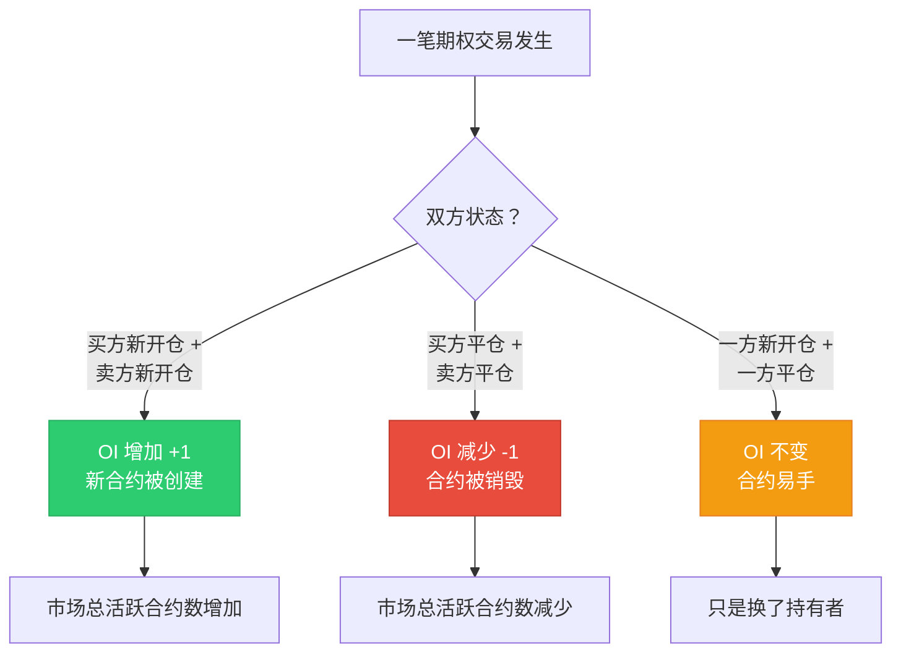
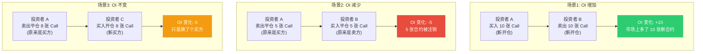
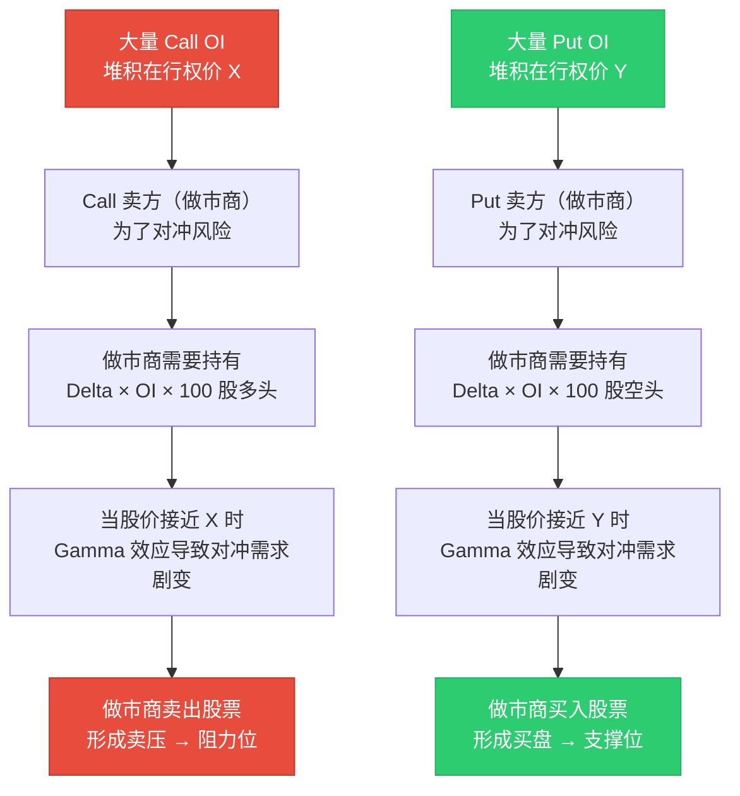
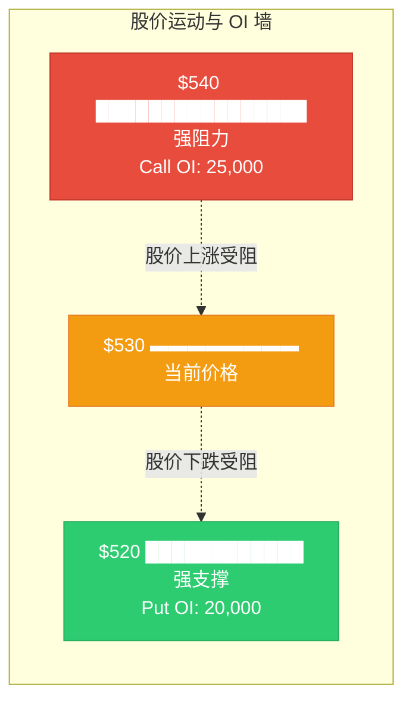
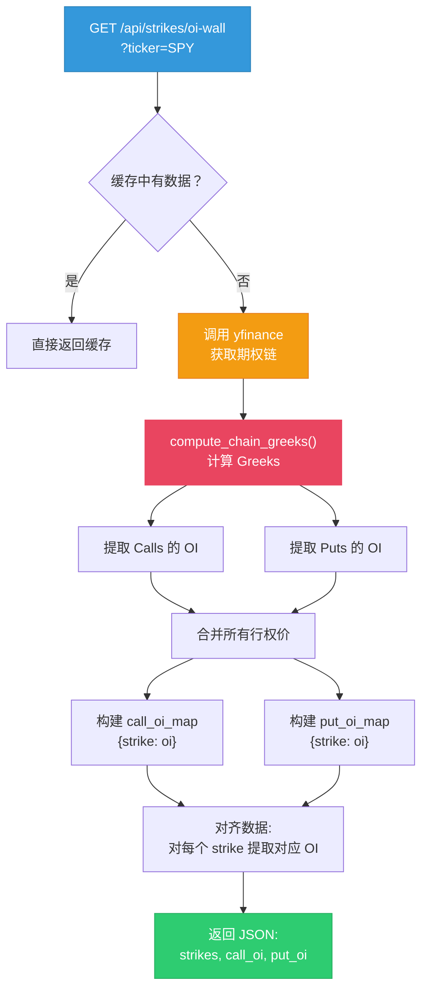
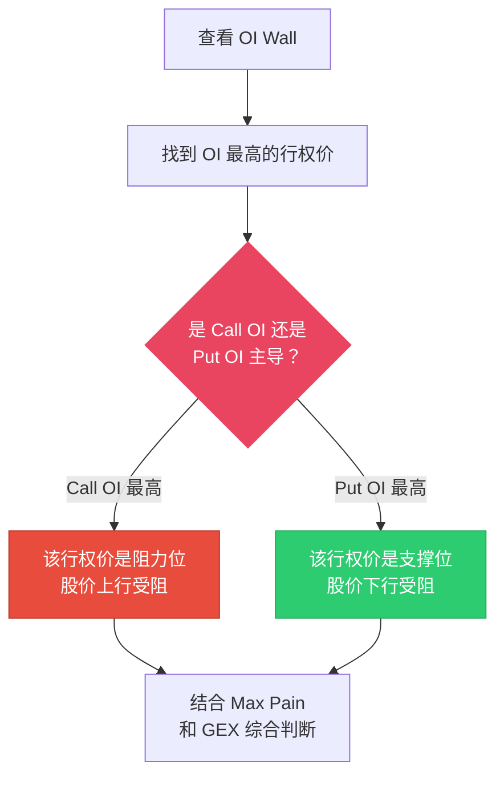
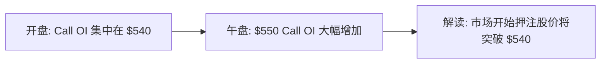
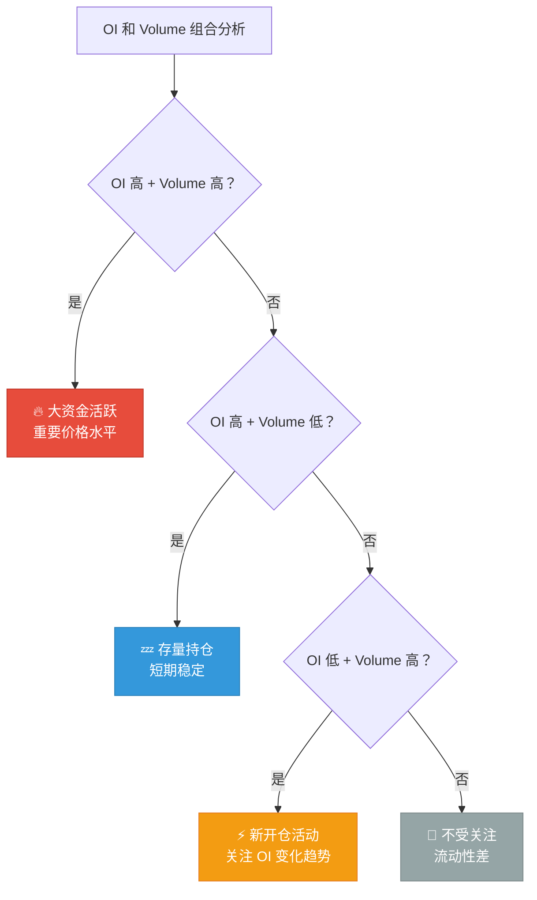

# 持仓量与成交量 OI & Volume

:::tip 适合谁读？
本文适合想理解期权市场"热度"和"关键价位"的读者。读完后你将能够通过 OI 数据找到股价的支撑位和阻力位，并理解 OptionDash 的 OI Wall 是如何构建的。
:::

## 持仓量 (Open Interest, OI)

### 什么是持仓量？

**持仓量 (Open Interest)** 是指市场上**尚未平仓的期权合约总数**。它衡量的是当前有多少"活跃"的合约存在。

用一个生活化的比喻：

> 想象一个舞池。**成交量**是今晚跳了多少支舞（每支舞结束就归零），而**持仓量**是此刻舞池里有多少对正在跳舞的人。

### OI 如何变化？

OI 并不是只增不减的。它的变化取决于交易双方的状态：



| 场景 | 买方 | 卖方 | OI 变化 |
|------|------|------|---------|
| A 想买，B 想卖（都新开仓） | 新开仓 | 新开仓 | **+1** |
| A 想平仓，C 想接盘（C 新开仓） | 平仓（A）→ 新开仓（C） | 不变 | **不变** |
| A 想平仓，B 也想平仓 | 平仓 | 平仓 | **-1** |

:::info 关键区别
**成交量**每笔交易都会增加（不管开仓还是平仓），而 **OI** 只有双方都开新仓时才增加。
:::

### OI 与成交量的区别

| 对比 | 持仓量 (OI) | 成交量 (Volume) |
|------|-------------|-----------------|
| **定义** | 未平仓合约总数 | 当日交易的合约数量 |
| **重置** | 不重置，持续累计 | 每个交易日重置为零 |
| **衡量** | 市场参与的"存量" | 市场交易的"流量" |
| **增加条件** | 双方都开新仓 | 任何一笔交易 |
| **减少条件** | 双方都平仓 | 不会减少（只增不减） |

:::tip 一个简单的类比
- **成交量**像一家餐厅今天的**客流量** -- 进进出出多少人
- **OI** 像餐厅目前**还在用餐的人数** -- 代表当前的活跃程度
:::

## OI 变化的四种场景详解

理解 OI 的变化需要深入看四种典型交易场景：



## OI 与价格的关系

这是 OI 最有价值的应用：**大量 OI 堆积的行权价往往会成为股价的支撑位或阻力位**。

### 为什么 OI 会形成支撑/阻力？

这与**期权卖方的对冲行为**（Delta Hedging）有关。做市商卖出期权后，必须买入/卖出标的股票来对冲风险：



### 直观理解

想象以下场景：

| 行权价 | Call OI | Put OI | 价格角色 |
|--------|---------|--------|----------|
| $540 | **25,000** | 3,000 | 强阻力（大量 Call 卖方对冲卖出） |
| $530 | 12,000 | 8,000 | 中等支撑/阻力 |
| $520 | 4,000 | **20,000** | 强支撑（大量 Put 卖方对冲买入） |
| $510 | 2,000 | 5,000 | 次要支撑 |



:::note
OI 堆积形成的支撑/阻力并非绝对。如果出现重大新闻或事件，股价完全可以突破这些水平。但在正常的市场环境中，这些水平确实具有统计上的显著性。
:::

## OptionDash OI Wall 的实现原理

OptionDash 的 OI Wall 功能在 `backend/api/strikes.py` 中实现。它从期权链中提取每个行权价的 Call 和 Put OI，构建成可视化的"墙"。

### 完整代码解析

以下是 OI Wall API 端点的完整实现（`backend/api/strikes.py`, 第 38-75 行）：

```python
@strikes_bp.route("/api/strikes/oi-wall", methods=["GET"])
def oi_wall():
    # 第一步：获取请求参数
    ticker = request.args.get("ticker", "SPY").upper()
    expiration = request.args.get("expiration")
    err = _validate(ticker)                     # 检查标的是否受支持
    if err:
        return err

    # 第二步：尝试从缓存中获取（避免频繁请求 yfinance）
    cached = get_cached(ticker, "oi_wall")
    if cached and (not expiration or cached.get("expiration") == expiration):
        return jsonify(cached)                  # 缓存命中，直接返回

    try:
        # 第三步：获取期权链并计算 Greeks
        chain = _live_chain_fallback(ticker, expiration)
        max_pain_result = calculate_max_pain(chain["calls"], chain["puts"])
        chain = compute_chain_greeks(chain)

        # 第四步：提取 OI 数据
        oi_col_c = _col(chain["calls"], ("open_interest",))   # Call OI 列名
        oi_col_p = _col(chain["puts"], ("open_interest",))    # Put OI 列名

        # 合并所有行权价（Call 和 Put 的并集）
        all_strikes = sorted(
            set(chain["calls"]["strike"].tolist()) | set(chain["puts"]["strike"].tolist())
        )

        # 构建 行权价 → OI 的映射字典
        call_oi_map = dict(zip(chain["calls"]["strike"], chain["calls"][oi_col_c].fillna(0)))
        put_oi_map = dict(zip(chain["puts"]["strike"], chain["puts"][oi_col_p].fillna(0)))

        # 第五步：返回 JSON 响应
        return jsonify({
            "ticker": ticker,
            "expiration": chain["expiration"],
            "spot_price": chain["spot_price"],
            "max_pain": max_pain_result["max_pain_strike"],
            "strikes": [round(s, 2) for s in all_strikes],
            "call_oi": [int(call_oi_map.get(s, 0)) for s in all_strikes],
            "put_oi": [int(put_oi_map.get(s, 0)) for s in all_strikes],
        })
    except Exception as e:
        logger.exception(f"OI wall fetch failed for {ticker}")
        return data_source_error(ticker, "oi_wall", e)
```

### 数据处理流程图



### OI 列名解析

在代码中可以看到一个通用的列名解析函数（`backend/api/strikes.py`, 第 134-138 行）：

```python
def _col(df, candidates):
    """从 DataFrame 中找到第一个匹配的列名"""
    for c in candidates:
        if c in df.columns:
            return c
    raise KeyError(f"None of {candidates} in {df.columns.tolist()}")
```

这个函数的存在是因为 `yfinance` 返回的列名可能因版本不同而有所差异。OptionDash 通过候选列表来兼容不同的列名格式。

## 从期权链中提取 OI 数据

在 `strikes.py` 中提取 OI 的核心逻辑是：

```python
# 1. 合并 Call 和 Put 的所有行权价
all_strikes = sorted(
    set(chain["calls"]["strike"].tolist()) | set(chain["puts"]["strike"].tolist())
)
# 例如: [500.0, 505.0, 510.0, ..., 560.0, 565.0]

# 2. 构建 字典映射: 行权价 → OI
call_oi_map = dict(zip(chain["calls"]["strike"], chain["calls"]["open_interest"].fillna(0)))
# 例如: {500.0: 5000, 505.0: 3200, 510.0: 8000, ...}

put_oi_map = dict(zip(chain["puts"]["strike"], chain["puts"]["open_interest"].fillna(0)))
# 例如: {500.0: 12000, 505.0: 6500, 510.0: 9000, ...}

# 3. 对齐输出（某些行权价可能只有 Call 或只有 Put）
call_oi_list = [int(call_oi_map.get(s, 0)) for s in all_strikes]
put_oi_list = [int(put_oi_map.get(s, 0)) for s in all_strikes]
```

这个处理确保了即使某些行权价只有一侧期权（只有 Call 没有 Put，或反之），也能正确填入 0。

## 数据库中的 OI 存储

OptionDash 使用 SQLite 持久化 OI 历史数据，便于趋势分析。表结构如下：

```sql
-- 文件: backend/database/schema.sql, 第 27-45 行
CREATE TABLE IF NOT EXISTS strike_snapshots (
    id INTEGER PRIMARY KEY AUTOINCREMENT,
    date TEXT NOT NULL,
    ticker TEXT NOT NULL,
    expiration TEXT NOT NULL,
    strike REAL NOT NULL,
    call_oi INTEGER DEFAULT 0,
    put_oi INTEGER DEFAULT 0,
    call_volume INTEGER DEFAULT 0,
    put_volume INTEGER DEFAULT 0,
    call_iv REAL,
    put_iv REAL,
    call_gamma REAL,
    put_gamma REAL,
    call_delta REAL,
    put_delta REAL,
    created_at TIMESTAMP DEFAULT CURRENT_TIMESTAMP,
    UNIQUE(date, ticker, expiration, strike)
);
```

这张表的设计使得可以：
- 追踪某个行权价的 OI 随时间的变化
- 比较不同日期的 OI 分布
- 重建任意历史时刻的 OI Wall

## 前端展示的数据结构

前端使用 TypeScript 接口来定义 OI Wall 的数据格式：

```typescript
// 文件: frontend/src/types/index.ts, 第 44-52 行
export interface OIWallData {
  ticker: string;          // 标的代码
  expiration: string;      // 到期日
  spot_price: number;      // 当前股价
  max_pain: number;        // Max Pain 价格
  strikes: number[];       // 所有行权价数组
  call_oi: number[];       // 每个行权价的 Call OI
  put_oi: number[];        // 每个行权价的 Put OI
}
```

前端接收到这个数据后，会用并排柱状图展示：绿色柱代表 Call OI，红色柱代表 Put OI，每根柱子对应一个行权价。

## 如何在 OptionDash 中查看 OI

### OI Wall 图表

在 OptionDash 的**行权价分析 (Strike Analysis)** 模块中，OI Wall 图表是最直观的展示方式：

| 元素 | 含义 |
|------|------|
| **绿色柱状条** | Call 的持仓量 |
| **红色柱状条** | Put 的持仓量 |
| **柱条高度** | OI 数量 -- 越高代表该行权价的 OI 越大 |
| **行权价位置** | X 轴为行权价，与当前股价对比可以看出支撑/阻力的相对位置 |
| **虚线标记** | 当前股价和 Max Pain 价格 |

:::tip 阅读技巧
在 OI Wall 图表中，找到那些**特别高的绿色柱条**和**特别高的红色柱条**所在行权价 -- 这些就是关键的价格水平。
:::

### Dashboard 模块

Dashboard 面板会展示当前标的的总体 OI 数据：

- 总 Call OI 和总 Put OI
- PCR (OI) 比率
- 与前一交易日的 OI 变化

## 实际应用

### 1. 识别关键价格水平

通过 OI Wall 找到大量 OI 堆积的行权价，这些位置往往是：
- 做市商集中对冲的区域
- 大型机构持有期权头寸的行权价
- 股价短期内大概率会受到支撑或阻力的位置



### 2. 追踪日内 OI 变化

OI 在一天之内也会发生变化，这些变化能揭示**日内情绪的转变**：



### 3. 跨到期日比较

比较不同到期日的 OI 分布，可以看到：

| 分析维度 | 含义 |
|----------|------|
| **近月 OI 集中** | 短期内的支撑/阻力更明确 |
| **远月 OI 集中** | 中长期的市场预期 |
| **OI 峰值迁移** | 市场预期的价格区间在变化 |

### 4. 结合成交量分析

| OI | 成交量 | 解读 |
|----|--------|------|
| 高 | 高 | 强烈关注，可能是大资金布局 |
| 高 | 低 | 存量仓位，短期内不会有大变动 |
| 低 | 高 | 可能是新开仓活动，关注 OI 是否上升 |
| 低 | 低 | 该行权价不受市场关注 |



## 需要注意的事项

:::warning 使用 OI 的注意事项
1. **OI 不区分方向**：高 Call OI 不代表市场看涨 -- Call 的卖方是看跌/中性的
2. **关注 OI 变化**：不仅要看绝对值，还要看变化趋势
3. **流动性影响**：OI 低的行权价买卖价差大，交易成本高
4. **到期日效应**：临近到期时，OI 会因平仓而急剧下降
5. **周末/假期**：OI 在非交易时间不会变化，但事件可能在周末发生
:::

## 下一步

- [最大痛苦点 Max Pain](./max-pain.md) -- 了解 OI 如何决定到期日的"引力中心"
- [看跌看涨比 Put/Call Ratio](./pcr.md) -- 用 OI 和成交量衡量整体市场情绪
- [伽马暴露 GEX](./gex.md) -- 了解做市商如何根据 OI 进行对冲
