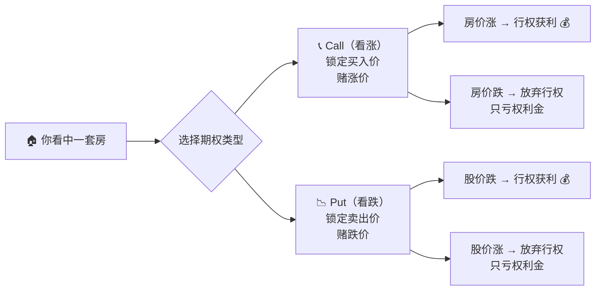
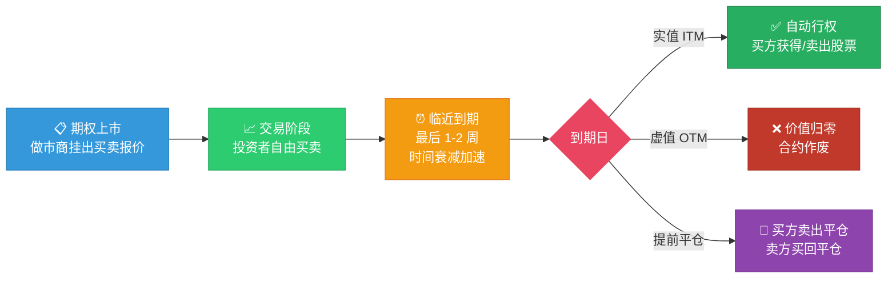
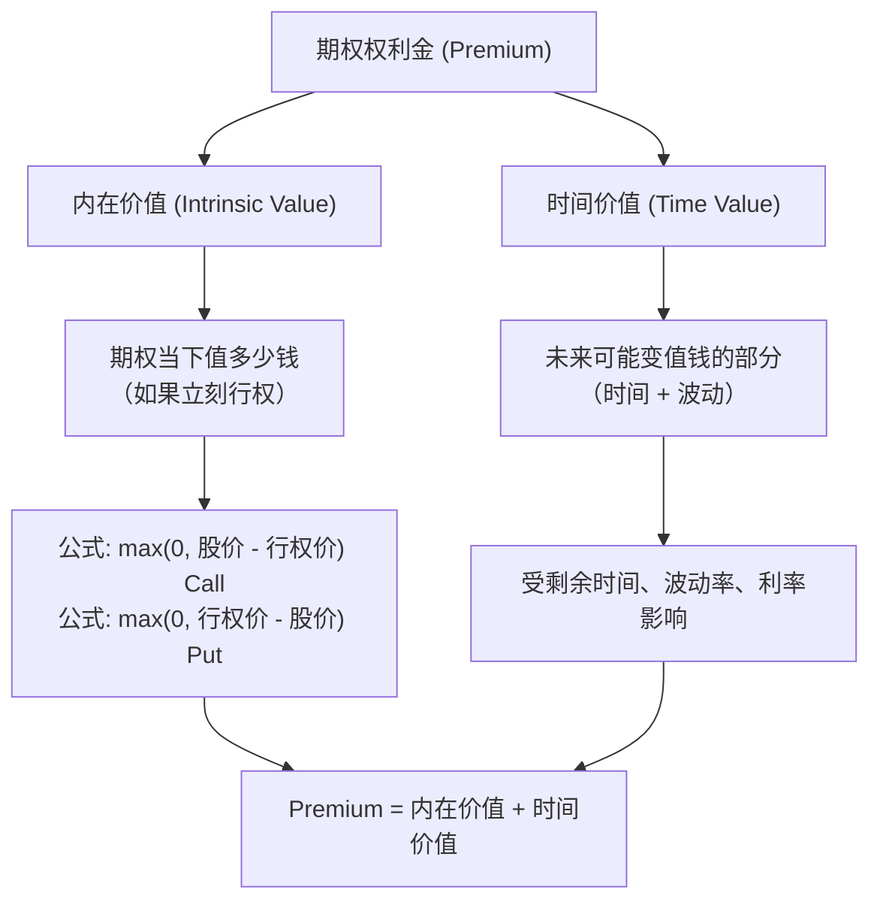
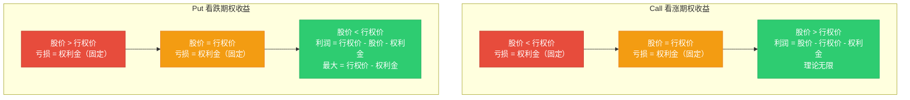
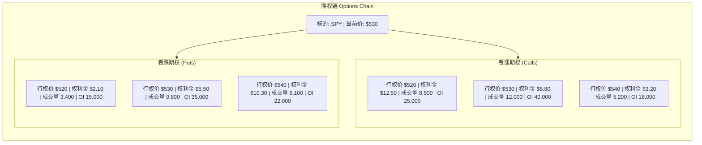
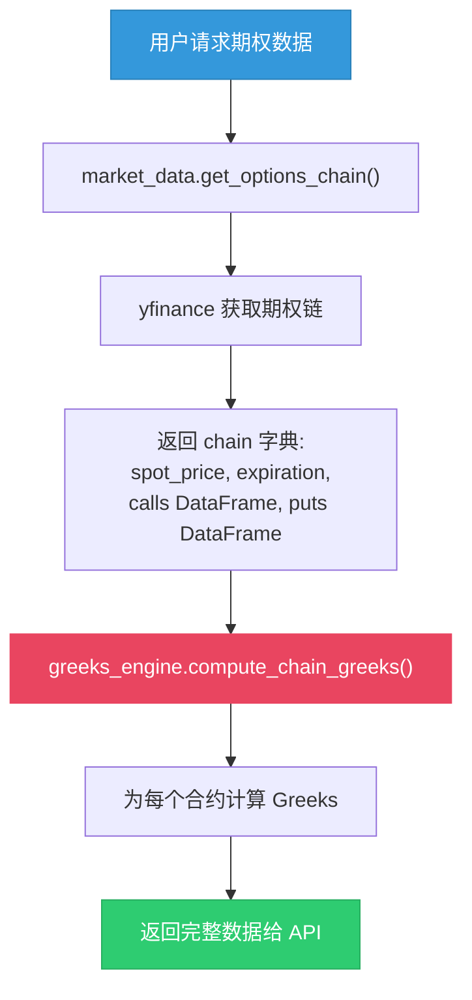
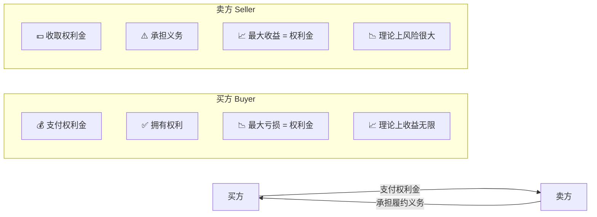
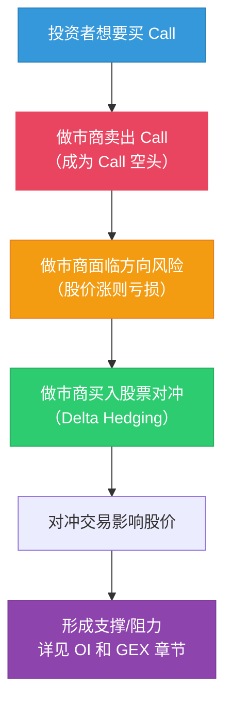
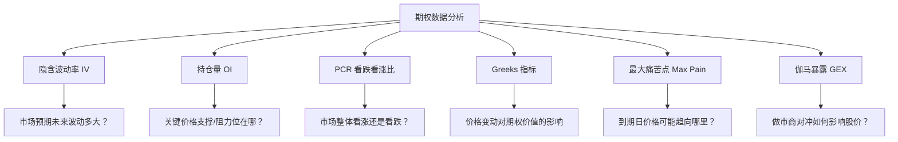

# 期权基础 Options Basics

:::tip 适合谁读？
本文面向零基础读者。如果你了解什么是股票，就能读懂本文。我们会用生活中的例子来解释每个概念，并结合 OptionDash 后端的真实代码来说明期权数据是如何被处理的。
:::

## 什么是期权？

**期权 (Option)** 是一份合约，赋予持有者在**未来某个日期**以**特定价格**买入或卖出某项资产的**权利**（注意：是权利，不是义务）。

打个比方：

> 你看中了一套房子，目前标价 100 万元。你担心房价会涨，但又不想现在就买。于是你和房东签了一份协议：**3 个月内，你可以用 100 万买下这套房子**。为了获得这个权利，你先付给房东 2 万元"诚意金"。
>
> - 如果 3 个月后房价涨到 120 万，你仍然可以用 100 万买入 -- 赚了！
> - 如果房价跌到 80 万，你可以选择不买 -- 最多只损失那 2 万元诚意金。

这就是期权的核心逻辑：**用一笔小费用（权利金），锁定一个未来交易价格**。

### 两种基本期权类型

| 类型 | 英文 | 含义 | 类比 |
|------|------|------|------|
| **看涨期权** | Call Option | 有权在到期日前以行权价**买入**标的资产 | 看好后市，赌上涨 |
| **看跌期权** | Put Option | 有权在到期日前以行权价**卖出**标的资产 | 看空后市，赌下跌 |



## 期权的生命周期

期权合约从诞生到消亡，经历一个完整的生命周期。理解这个周期有助于把握交易时机。



### 美式期权 vs 欧式期权

| 类型 | 行权时间 | 常见品种 |
|------|---------|---------|
| **美式期权** | 到期日前任何时间都可以行权 | 美股个股期权、ETF 期权（SPY、QQQ 等） |
| **欧式期权** | 只能在到期日当天行权 | VIX 期权、部分指数期权 |

OptionDash 跟踪的 SPY、QQQ、IWM、TLT、XLF 都是**美式 ETF 期权**。

## 期权的核心要素

每个期权合约都包含以下四个关键要素：

| 要素 | 英文 | 说明 | 例子 |
|------|------|------|------|
| **标的资产** | Underlying | 期权所绑定的股票或 ETF | SPY、QQQ、AAPL |
| **行权价** | Strike Price | 约定的买入/卖出价格 | $500 |
| **到期日** | Expiration | 合约失效的日期 | 2025-06-20 |
| **权利金** | Premium | 购买期权的费用 | $5.20（每份） |

:::info 合约规格
在美国市场，**1 张期权合约 = 100 股**。所以权利金 $5.20 意味着每张合约实际成本为 $520。在 OptionDash 的计算中，经常需要乘以 100 来转换。例如在 `max_pain.py` 的计算中可以看到 `* 100`：

```python
# 文件: backend/services/max_pain.py, 第 50-52 行
call_loss = np.sum(np.maximum(K - call_strikes, 0) * call_oi * 100)
put_loss = np.sum(np.maximum(put_strikes - K, 0) * put_oi * 100)
```
:::

## 期权的价值构成

期权的权利金（Premium）由两部分组成：



### 内在价值 (Intrinsic Value)

内在价值衡量的是：**如果现在就行权，这个期权能赚多少钱？**

以看涨期权为例，假设你持有一份行权价 $500 的 Call，当前股价 $520：

```
内在价值 = 股价 - 行权价 = $520 - $500 = $20
```

这意味着如果立刻行权，你可以用 $500 买入价值 $520 的股票，净赚 $20。

### Call vs Put 的收益结构

理解 Call 和 Put 的收益结构是期权分析的基础：



### 三种状态 (ITM / ATM / OTM)

期权根据内在价值的有无分为三种状态：

```mermaid
graph TD
    subgraph Call 看涨期权
        direction LR
        CTM["深度实值 Deep ITM<br/>股价 &gt;&gt; 行权价<br/>Delta → 1.0"] --> ITM_C["实值 ITM<br/>股价 &gt; 行权价<br/>有内在价值"]
        ITM_C --> ATM_C["平值 ATM<br/>股价 ≈ 行权价<br/>内在价值 ≈ 0"]
        ATM_C --> OTM_C["虚值 OTM<br/>股价 &lt; 行权价<br/>无内在价值"]
    end
    subgraph Put 看跌期权
        direction LR
        DTM["深度实值 Deep ITM<br/>股价 &lt;&lt; 行权价<br/>Delta → -1.0"] --> ITM_P["实值 ITM<br/>股价 &lt; 行权价<br/>有内在价值"]
        ITM_P --> ATM_P["平值 ATM<br/>股价 ≈ 行权价<br/>内在价值 ≈ 0"]
        ATM_P --> OTM_P["虚值 OTM<br/>股价 &gt; 行权价<br/>无内在价值"]
    end

    style CTM fill:#27ae60,stroke:#1e8449,color:#fff
    style ITM_C fill:#2ecc71,stroke:#27ae60,color:#fff
    style ATM_C fill:#f39c12,stroke:#e67e22,color:#fff
    style OTM_C fill:#e74c3c,stroke:#c0392b,color:#fff
    style DTM fill:#27ae60,stroke:#1e8449,color:#fff
    style ITM_P fill:#2ecc71,stroke:#27ae60,color:#fff
    style ATM_P fill:#f39c12,stroke:#e67e22,color:#fff
    style OTM_P fill:#e74c3c,stroke:#c0392b,color:#fff
```



| 状态 | 英文 | Call 期权 | Put 期权 | 含义 |
|------|------|-----------|----------|------|
| **实值** | In-the-Money (ITM) | `股价 > 行权价` | `股价 < 行权价` | 有内在价值，行权有利可图 |
| **平值** | At-the-Money (ATM) | 股价 ≈ 行权价 | 股价 ≈ 行权价 | 内在价值约等于零 |
| **虚值** | Out-of-the-Money (OTM) | `股价 < 行权价` | `股价 > 行权价` | 内在价值为零 |

:::tip 举例
SPY 当前价格 $530：

- 行权价 $520 的 Call → **实值**（可以低于市价买入）
- 行权价 $530 的 Call → **平值**
- 行权价 $540 的 Call → **虚值**（行权不如直接买）
:::

### 时间价值 (Time Value)

```
时间价值 = 权利金 - 内在价值
```

时间价值代表市场对"期权在到期前变得更有价值"的预期。它受以下因素影响：

- **剩余时间**：距离到期越久，时间价值越高（更多"翻盘"机会）
- **波动率**：标的资产波动越大，时间价值越高（更可能出现大幅变动）

:::info 时间衰减
期权的时间价值会随着到期日临近而加速减少，这个现象叫做 **时间衰减 (Time Decay)**，用希腊字母 **Theta (θ)** 衡量。就像冰淇淋在太阳下会越融越快一样。详见 [Greeks 指标](./greeks.md) 中的 Theta 部分。
:::

## 期权链 (Options Chain)

**期权链**是一个表格，列出某个标的所有可用期权合约。它是期权交易者最重要的参考工具。



在实际的期权链中，每一行通常包含以下数据：

| 列名 | 含义 |
|------|------|
| **Bid** | 买方愿意出的最高价（你卖出时能拿到的价格） |
| **Ask** | 卖方愿意接受的最低价（你买入时需要付的价格） |
| **Volume** | 当日成交量 |
| **Open Interest (OI)** | 未平仓合约总数 |
| **Implied Volatility (IV)** | 隐含波动率（市场对未来波动的预期） |
| **Greeks** | Delta, Gamma, Theta, Vega 等风险指标 |

## OptionDash 如何处理期权链数据

OptionDash 后端通过 `yfinance` 获取期权链数据，然后用 `greeks_engine.py` 计算所有合约的 Greeks。以下是核心处理流程：

### 获取期权链



### 期权链数据结构

在 OptionDash 的代码中，期权链以 Python 字典形式表示：

```python
# 期权链数据结构（来自 backend/services/greeks_engine.py, 第 97-143 行）
chain = {
    "spot_price": 530.50,          # 当前标的价格
    "expiration": "2025-06-20",     # 到期日字符串
    "calls": pd.DataFrame([         # Call 期权 DataFrame
        # 列: strike, bid, ask, volume, implied_volatility, open_interest
        # 计算后新增: delta, gamma, theta, vega, rho
    ]),
    "puts": pd.DataFrame([          # Put 期权 DataFrame
        # 同上
    ]),
}
```

### 计算 Greeks 的核心代码

以下是 `compute_chain_greeks` 函数的完整逻辑（`backend/services/greeks_engine.py`, 第 97-143 行）：

```python
def compute_chain_greeks(chain: dict, r: float | None = None) -> dict:
    """
    为整条期权链计算 Greeks。
    遍历 calls 和 puts 两个 DataFrame，
    为每个合约添加 delta, gamma, theta, vega, rho 列。
    """
    from datetime import datetime, timezone

    if r is None:
        r = Config.RISK_FREE_RATE  # 默认 5.25%

    S = chain["spot_price"]                          # 当前股价
    exp_str = chain["expiration"]                     # 到期日字符串 "2025-06-20"
    exp_date = datetime.strptime(exp_str, "%Y-%m-%d").replace(tzinfo=timezone.utc)
    now = datetime.now(timezone.utc)
    T_years = max((exp_date - now).days / 365.0, 1e-6)  # 年化到期时间

    for side in ("calls", "puts"):                   # 遍历 Call 和 Put
        df = chain[side]
        if df.empty:
            continue

        strikes = df["strike"].values                 # 所有行权价
        T_arr = np.full(len(strikes), T_years)        # 到期时间数组
        iv_col = "implied_volatility" if "implied_volatility" in df.columns else None

        if iv_col is None:
            sigma_arr = np.full(len(strikes), 0.2)    # 无 IV 数据时默认 20%
        else:
            sigma_arr = df[iv_col].fillna(0.2).values # 隐含波动率数组

        flag = "c" if side == "calls" else "p"        # 期权类型标记
        flag_arr = np.full(len(strikes), flag)

        greeks = compute_greeks(S, strikes, T_arr, sigma_arr, flag_arr, r)

        for col in ("delta", "gamma", "theta", "vega", "rho"):
            df[col] = greeks[col].values              # 将 Greeks 写入 DataFrame

    return chain
```

这段代码的关键步骤：

1. **解析到期时间**：将到期日字符串转换为年化时间 `T_years`
2. **准备输入数组**：将标量 `S` 扩展为与 strike 等长的数组
3. **处理缺失 IV**：如果数据中没有 IV 列，默认使用 20%
4. **批量计算**：调用 `compute_greeks` 一次性计算所有合约的 Greeks
5. **写回结果**：将计算结果的五列添加到 calls/puts DataFrame 中

## 期权的买方与卖方

期权交易中，买方和卖方的权利义务完全不同：



| 对比 | 买方 (Buyer/Holder) | 卖方 (Seller/Writer) |
|------|---------------------|----------------------|
| **角色** | 购买权利 | 出售权利（承担义务） |
| **费用** | 支付权利金 | 收取权利金 |
| **最大亏损** | 权利金金额（有限） | 可能很大（理论无限） |
| **最大收益** | 理论上无限 | 权利金金额（有限） |
| **胜率** | 较低（需要方向对+幅度够） | 较高（时间站在卖方一边） |

:::warning 风险提示
卖方虽然胜率较高，但面临的风险远大于买方。裸卖看涨期权（Naked Call）的风险是理论上无限的，因为股价可以无限上涨。
:::

## 做市商 (Market Maker) 的角色

在期权市场中，**做市商**（如 Citadel、Susquehanna）扮演着至关重要的角色。理解他们的行为是理解 GEX、OI 墙等概念的基础。



:::info 关键概念
做市商通常**持有净空头期权头寸**（卖出的期权比买入的多），因此他们需要不断通过买卖标的股票来对冲风险。这种对冲行为直接影响了股价的走势，是理解 OptionDash 中多个指标（OI 墙、GEX、Max Pain）的核心逻辑。
:::

## SPY 期权实例分析

让我们用 SPY（标普 500 ETF）的真实场景来综合理解以上概念。

假设当前 SPY 价格为 $530.00，以下是一个简化的期权链：

### Call 期权（看涨）

| 行权价 | 状态 | 权利金 | 内在价值 | 时间价值 | Delta | OI |
|--------|------|--------|----------|----------|-------|------|
| $510 | 深度实值 | $22.50 | $20.00 | $2.50 | 0.92 | 8,000 |
| $520 | 实值 | $14.00 | $10.00 | $4.00 | 0.78 | 15,000 |
| **$530** | **平值** | **$7.50** | **$0.00** | **$7.50** | **0.52** | **40,000** |
| $540 | 虚值 | $3.20 | $0.00 | $3.20 | 0.30 | 18,000 |
| $550 | 深度虚值 | $1.10 | $0.00 | $1.10 | 0.12 | 10,000 |

### Put 期权（看跌）

| 行权价 | 状态 | 权利金 | 内在价值 | 时间价值 | Delta | OI |
|--------|------|--------|----------|----------|-------|------|
| $510 | 深度虚值 | $1.50 | $0.00 | $1.50 | -0.10 | 12,000 |
| $520 | 虚值 | $3.00 | $0.00 | $3.00 | -0.24 | 20,000 |
| **$530** | **平值** | **$6.80** | **$0.00** | **$6.80** | **-0.48** | **35,000** |
| $540 | 实值 | $12.50 | $10.00 | $2.50 | -0.72 | 22,000 |
| $550 | 深度实值 | $20.00 | $20.00 | $0.00 | -0.90 | 8,000 |

### 观察要点

1. **平值期权（$530）**：时间价值最大，成交量和 OI 通常也最高
2. **深度实值期权**：几乎全部由内在价值组成，时间价值很小
3. **深度虚值期权**：纯时间价值，Delta 接近 0，很少会被行权
4. **Call 的 Delta 为正，Put 的 Delta 为负**：这是期权方向性的直接体现

:::tip 数据来源
以上数据结构与 OptionDash 从 yfinance 获取后、经 `greeks_engine.py` 处理的结果一致。在实际运行中，每 5 分钟会通过 `poller.py` 重新拉取最新数据并更新缓存。
:::

## 为什么期权分析很重要？

期权数据不仅仅是用来交易期权的，它还能**揭示市场的预期和情绪**：



### 具体应用

1. **OI 持仓量**：大量 Call 堆积在某个行权价 → 可能形成**阻力位**；大量 Put 堆积 → 可能形成**支撑位**

2. **隐含波动率 IV**：IV 高 → 市场预期大幅波动（比如财报前）；IV 低 → 市场预期平稳

3. **PCR 比率**：Put 交易量远超 Call → 市场情绪偏悲观；反之偏乐观

4. **Max Pain**：到期日临近时，股价倾向于向最大痛苦点靠拢

5. **Greeks**：衡量期权价格对股价、时间、波动率等因素变化的敏感程度

6. **GEX**：做市商的对冲行为会放大或抑制市场波动

## OptionDash 支持的标的

OptionDash 当前支持以下标的的期权分析（可在配置中修改）：

```python
# 文件: backend/config.py, 第 19-25 行
SUPPORTED_TICKERS = [
    t.strip().upper()
    for t in os.environ.get(
        "SUPPORTED_TICKERS", "SPY,QQQ,IWM,TLT,XLF"
    ).split(",")
    if t.strip()
]
```

| 标的 | 说明 | 期权特点 |
|------|------|---------|
| **SPY** | 标普 500 ETF | 流动性最好，OI 最大，最具代表性 |
| **QQQ** | 纳斯达克 100 ETF | 科技股为主，波动率通常更高 |
| **IWM** | 罗素 2000 ETF | 小盘股，波动率最高 |
| **TLT** | 20年+ 美国国债 ETF | 利率敏感型，与股票负相关 |
| **XLF** | 金融板块 ETF | 银行/保险股，对利率敏感 |

:::note
OptionDash 平台正是围绕这些标的的期权数据构建的。接下来的章节会逐一深入讲解每个概念。建议按照顺序阅读。
:::

## 下一步

- [持仓量与成交量 OI & Volume](./open-interest.md) -- 了解 OI 如何揭示关键价格水平
- [最大痛苦点 Max Pain](./max-pain.md) -- 理解到期日价格的引力场
- [看跌看涨比 Put/Call Ratio](./pcr.md) -- 衡量市场情绪的温度计
