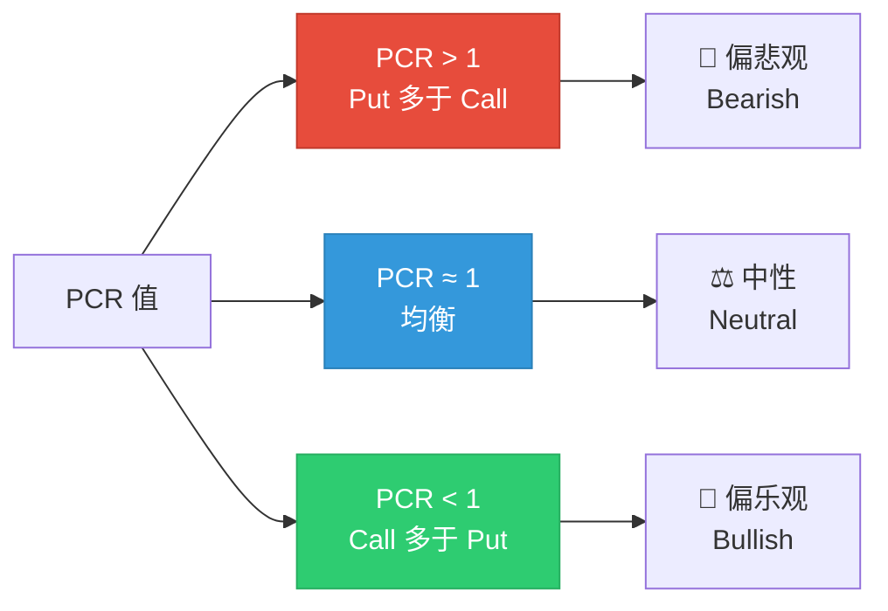
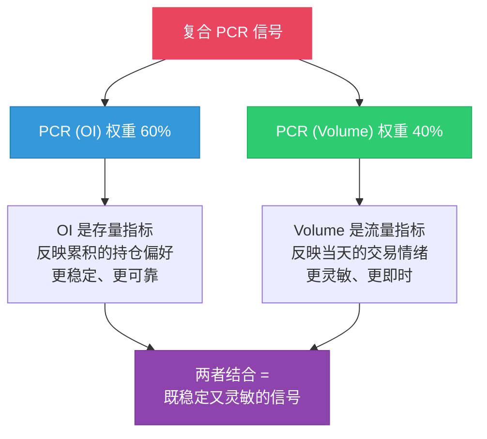
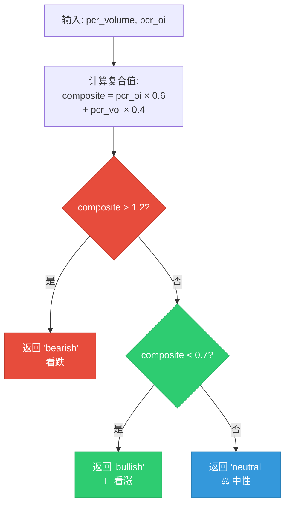
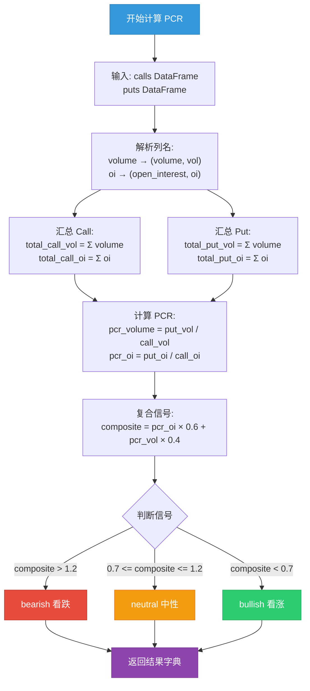
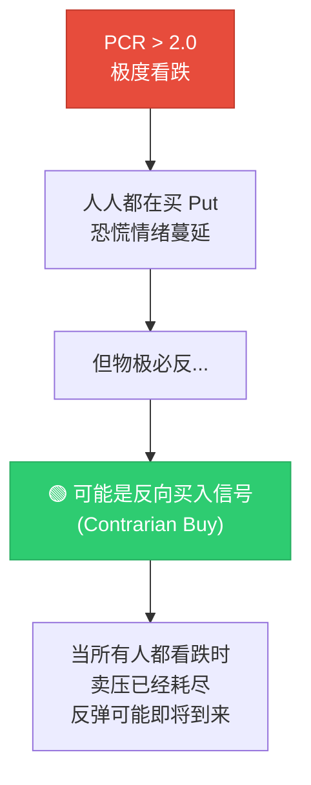
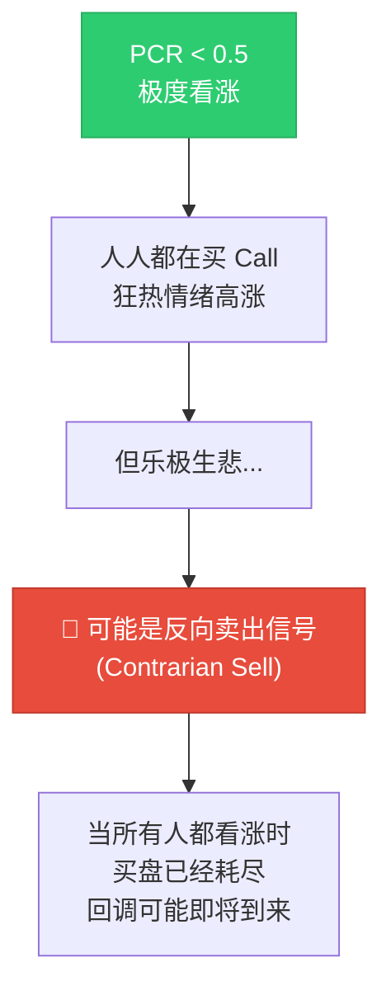
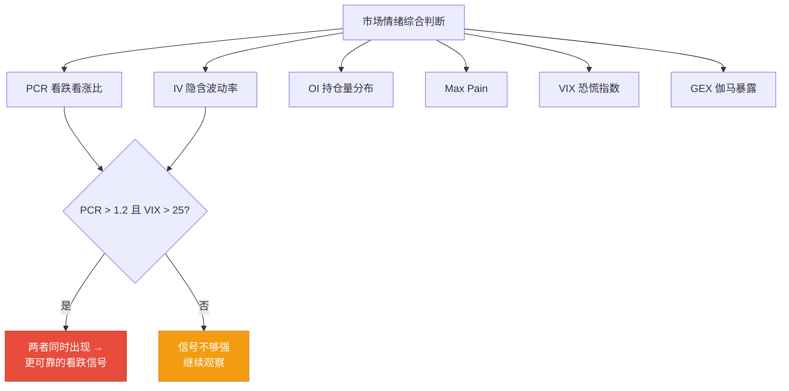

# 看跌看涨比 Put/Call Ratio

:::tip 适合谁读？
本文适合想快速判断"市场是偏乐观还是偏悲观"的读者。PCR 是最简洁的市场情绪指标之一，读完后你就能在 OptionDash 中正确解读它。本文包含 OptionDash 后端 `pcr.py` 的完整代码逐行解析。
:::

## 什么是 PCR？

**看跌看涨比 (Put/Call Ratio, PCR)** 衡量的是市场上看跌期权（Put）和看涨期权（Call）的相对活跃程度。它是最古老、最直观的市场情绪指标之一。

打个比方：

> 想象你在一个投票站，观察人们出来时的表情。如果大多数人面带笑容（买 Call），说明大家看好后市；如果大多数人愁眉苦脸（买 Put），说明大家看空后市。PCR 就是"看空的人数 / 看多的人数"。

### PCR 的两种变体

| 变体 | 计算方式 | 侧重 |
|------|----------|------|
| **PCR (Volume)** | Put 成交量 / Call 成交量 | 反映当日的交易情绪（"流量"） |
| **PCR (OI)** | Put 持仓量 / Call 持仓量 | 反映市场的累积持仓偏好（"存量"） |

```
PCR (Volume) = 总 Put 成交量 / 总 Call 成交量
PCR (OI)     = 总 Put 持仓量 / 总 Call 持仓量
```

## 如何解读 PCR？

### 基本解读



| PCR 范围 | 情绪信号 | 含义 |
|----------|----------|------|
| `> 1.2` | 看跌 Bearish | Put 明显多于 Call，市场偏悲观 |
| 0.7 -- 1.2 | 中性 Neutral | 买卖相对均衡 |
| `< 0.7` | 看涨 Bullish | Call 明显多于 Put，市场偏乐观 |

### PCR 仪表盘

想象一个从 0 到 2+ 的仪表盘：

```
    极度看涨        看涨       中性       看跌      极度看跌
   (过度乐观)                                      (过度悲观)
       |            |          |          |           |
  0.3  0.5        0.7        1.0        1.2         2.0   2.5
  |--绿--|---绿----|---蓝------|----红----|---红------|
```

| 区间 | 颜色 | 含义 |
|------|------|------|
| `< 0.5` | 深红 | 极度看涨 -- 可能过度乐观，注意回调风险 |
| 0.5 -- 0.7 | 浅绿 | 看涨 |
| 0.7 -- 1.2 | 蓝色 | 中性 |
| 1.2 -- 2.0 | 浅红 | 看跌 |
| `> 2.0` | 深红 | 极度看跌 -- 可能过度悲观，关注反弹机会 |

:::note
注意仪表盘两端都是红色。这是因为**极端值往往意味着反转** -- 过度看涨和过度看跌都不是"好"信号。
:::

## 完整源码逐行解析

以下是 OptionDash 后端 `backend/services/pcr.py` 的完整代码及逐行解释。

### 模块头部

```python
# 文件: backend/services/pcr.py, 第 1-7 行

"""
Put/Call Ratio calculations.
"""

import pandas as pd
from utils.helpers import safe_divide
```

导入 `pandas` 用于数据处理，以及自定义的 `safe_divide` 函数来防止除零错误。

### safe_divide 辅助函数

```python
# 文件: backend/utils/helpers.py, 第 38-41 行
def safe_divide(numerator: float, denominator: float, default: float = 0.0) -> float:
    """Safe division that returns default on zero denominator."""
    if denominator == 0:
        return default
    return numerator / denominator
```

当 Call 的成交量或 OI 为零时（流动性极差的标的），直接返回默认值 0 而不是抛出 `ZeroDivisionError`。

### 主计算函数

```python
# 文件: backend/services/pcr.py, 第 9-42 行

def calculate_pcr(calls: pd.DataFrame, puts: pd.DataFrame) -> dict:
    """
    Calculate volume-based and OI-based Put/Call ratios.

    PCR > 1.2 → bearish (more puts being traded/held)
    PCR < 0.7 → bullish (more calls being traded/held)

    Returns:
        Dict with pcr_volume, pcr_oi, and interpretation signal.
    """
```

**第 9-18 行**：函数签名和文档字符串。接收 Call 和 Put 的 DataFrame，返回包含 PCR 值和信号的字典。

### 列名解析

```python
    # 第 19-22 行：解析列名
    vol_col_c = _resolve_column(calls, ("volume", "vol"))              # Call 成交量列
    vol_col_p = _resolve_column(puts, ("volume", "vol"))               # Put 成交量列
    oi_col_c = _resolve_column(calls, ("open_interest", "openinterest", "oi"))  # Call OI 列
    oi_col_p = _resolve_column(puts, ("open_interest", "openinterest", "oi"))   # Put OI 列
```

使用元组候选列表来兼容不同的数据源格式。`_resolve_column` 函数会依次尝试每个候选名。

### 汇总求和

```python
    # 第 24-27 行：汇总
    total_call_vol = float(calls[vol_col_c].fillna(0).sum())    # 总 Call 成交量
    total_put_vol = float(puts[vol_col_p].fillna(0).sum())      # 总 Put 成交量
    total_call_oi = float(calls[oi_col_c].fillna(0).sum())      # 总 Call OI
    total_put_oi = float(puts[oi_col_p].fillna(0).sum())        # 总 Put OI
```

`fillna(0)` 处理缺失值，`sum()` 对所有行权价的成交量/OI 求和，`float()` 确保返回 Python 原生类型。

### 计算 PCR

```python
    # 第 29-30 行：计算 PCR
    pcr_volume = safe_divide(total_put_vol, total_call_vol, default=0.0)
    pcr_oi = safe_divide(total_put_oi, total_call_oi, default=0.0)
```

使用安全除法计算两个 PCR 变体。分母为零时返回 0。

### 生成信号

```python
    # 第 32 行：生成复合信号
    signal = _interpret_pcr(pcr_volume, pcr_oi)
```

调用信号解释函数，将数字转换为人类可读的信号。

### 返回结果

```python
    # 第 34-42 行：返回结果
    return {
        "pcr_volume": round(pcr_volume, 4),          # 保留 4 位小数
        "pcr_oi": round(pcr_oi, 4),
        "signal": signal,                             # "bullish" / "neutral" / "bearish"
        "total_call_volume": int(total_call_vol),     # 原始数据，用于前端展示
        "total_put_volume": int(total_put_vol),
        "total_call_oi": int(total_call_oi),
        "total_put_oi": int(total_put_oi),
    }
```

返回值不仅包含 PCR 数值和信号，还包含原始的成交量和 OI 总量，便于前端展示详细信息。

## 信号解释函数详解

OptionDash 使用**复合信号**来判定市场情绪，而不是单独依赖某一个 PCR 变体。

### 复合 PCR 的计算

```python
# 文件: backend/services/pcr.py, 第 45-53 行

def _interpret_pcr(pcr_vol: float, pcr_oi: float) -> str:
    """Interpret PCR values into bullish/bearish/neutral signal."""
    # Weight OI more heavily for signal
    composite = pcr_oi * 0.6 + pcr_vol * 0.4      # 60% OI + 40% Volume
    if composite > 1.2:
        return "bearish"                            # 看跌
    elif composite < 0.7:
        return "bullish"                            # 看涨
    return "neutral"                                # 中性
```

**第 48 行**：核心公式 `composite = pcr_oi * 0.6 + pcr_vol * 0.4`

### 为什么用 60/40 的权重？



| 指标 | 权重 | 优势 | 劣势 |
|------|------|------|------|
| PCR (OI) | 60% | 更稳定，不易被单日异常交易干扰 | 变化较慢，可能滞后 |
| PCR (Volume) | 40% | 灵敏，能快速捕捉情绪变化 | 容易受单日异常交易影响 |

通过 60/40 的加权，复合信号既保持了一定的**稳定性**，又不失**灵敏度**。

### 复合 PCR 信号判定流程



### 列名解析辅助函数

```python
# 文件: backend/services/pcr.py, 第 56-61 行

def _resolve_column(df: pd.DataFrame, candidates: tuple[str, ...]) -> str:
    """Find the first matching column from candidates."""
    for col in candidates:
        if col in df.columns:
            return col
    raise KeyError(f"None of {candidates} found in columns: {df.columns.tolist()}")
```

与 `max_pain.py` 中的类似函数不同的是，如果所有候选名都找不到，这里会**抛出异常**而不是回退到第一列。这是因为成交量/OI 是必需数据。

## 计算流程图



## 一个完整例子

假设 SPY 的期权数据如下：

| 指标 | 数值 |
|------|------|
| 总 Call 成交量 | 500,000 |
| 总 Put 成交量 | 600,000 |
| 总 Call OI | 3,200,000 |
| 总 Put OI | 4,000,000 |

计算过程：

```
PCR (Volume) = 600,000 / 500,000 = 1.20
PCR (OI)     = 4,000,000 / 3,200,000 = 1.25

复合 PCR = 1.25 × 0.6 + 1.20 × 0.4
         = 0.75 + 0.48
         = 1.23
```

**结论**：复合 PCR = 1.23 > 1.2 → **看跌信号 (Bearish)**

市场当前偏悲观，Put 的活跃度高于 Call。

### 代码验证

```python
import pandas as pd

calls = pd.DataFrame({
    "volume": [500000],
    "open_interest": [3200000]
})
puts = pd.DataFrame({
    "volume": [600000],
    "open_interest": [4000000]
})

result = calculate_pcr(calls, puts)
print(f"PCR Volume: {result['pcr_volume']}")   # 1.2
print(f"PCR OI: {result['pcr_oi']}")           # 1.25
print(f"Signal: {result['signal']}")            # bearish
```

## 极端值的含义

PCR 的极端值往往是最有价值的信息：

### 极度看跌 (PCR > 2.0)



> 股神巴菲特说过："别人恐惧时我贪婪。" PCR 极高时，正是市场极度恐惧的时刻。

### 极度看涨 (PCR < 0.5)



:::warning 反向指标
在极端值区域，PCR 是一个**反向指标 (Contrarian Indicator)**。也就是说：

- PCR 极高 → 可能是**买入**时机（而非卖出）
- PCR 极低 → 可能是**卖出**时机（而非买入）

但这不意味着可以盲目反向操作。极端值可能会维持一段时间，而且需要结合其他分析工具确认。
:::

### OptionDash 中的异常标记

在 OptionDash 的**对比分析 (Comparison)** 模块中，当某个标的的 PCR 出现极端值时，系统会自动标记为**异常 (Anomaly)**，提醒你注意。

前端异常类型定义：

```typescript
// 文件: frontend/src/types/index.ts, 第 72-77 行
export interface AnomalyFlag {
  field: string;       // 异常字段名（如 "pcr_volume"）
  value: number;       // 当前值
  change_pct: number;  // 变化百分比
  type: 'spike' | 'drop' | 'extreme' | 'flip';  // 异常类型
}
```

## PCR 的局限性

:::warning 使用 PCR 时需要注意

1. **反向指标的两面性**：极端值预示反转，但反转的时机难以确定。PCR 可能在"极端"区域停留很久。

2. **上下文很重要**：

   | 市场环境 | PCR 的意义 |
   |----------|-----------|
   | 趋势行情（大涨/大跌） | PCR 可能长期偏高或偏低，极端值不一定是反转信号 |
   | 震荡行情 | PCR 的参考价值更大 |
   | 重大事件前 | PCR 会因避险需求而自然偏高 |

3. **不同标的基线不同**：

   | 标的类型 | 典型 PCR 基线 | 原因 |
   |----------|--------------|------|
   | SPY（大盘 ETF） | 偏高（1.0-1.5） | 机构常用 Put 做对冲 |
   | QQQ（科技 ETF） | 适中（0.8-1.2） | 科技股看涨情绪较强 |
   | 单只个股 | 差异大 | 取决于个股情况 |

4. **不区分大单和小单**：一笔 10 张的 Put 和一笔 10,000 张的 Put 在 PCR 计算中被等同对待。实际上大单更有参考价值。

5. **时间范围**：PCR 是一个快照，不同时间点的 PCR 可能差异很大。建议结合趋势来看。
:::

## 实际应用建议

### 综合分析

不要单独使用 PCR，而是结合其他指标：



### 多时间框架

| 时间框架 | 分析方法 |
|----------|----------|
| **日内** | 观察 PCR (Volume) 的实时变化 |
| **每日** | 对比今天的 PCR 与昨天 |
| **每周** | 观察 PCR 趋势是否在转向 |
| **跨标的** | 比较不同标的的 PCR，看资金在哪里 |

## 在 OptionDash 中查看 PCR

### Dashboard 模块

| 数据项 | 说明 |
|--------|------|
| **PCR (Volume)** | 当日成交量比率 |
| **PCR (OI)** | 当前持仓量比率 |
| **复合信号** | 60/40 加权后的综合 PCR |
| **信号标签** | 看涨/中性/看跌 |

### 对比分析 (Comparison) 模块

在这里你可以：

- 同时查看多个标的的 PCR
- 比较不同标的的情绪差异
- 发现 PCR 极端值的异常标记

### 历史数据 (Historical) 模块

- 查看 PCR 随时间的变化趋势
- 分析 PCR 与实际股价走势的关系
- 验证 PCR 信号的历史准确率

## 下一步

- [Greeks 指标](./greeks.md) -- 理解期权价格对各种因素的敏感度
- [GEX 伽马暴露](./gex.md) -- 了解做市商对冲如何影响股价
- [波动率](./volatility.md) -- 深入理解 IV 和波动率交易
