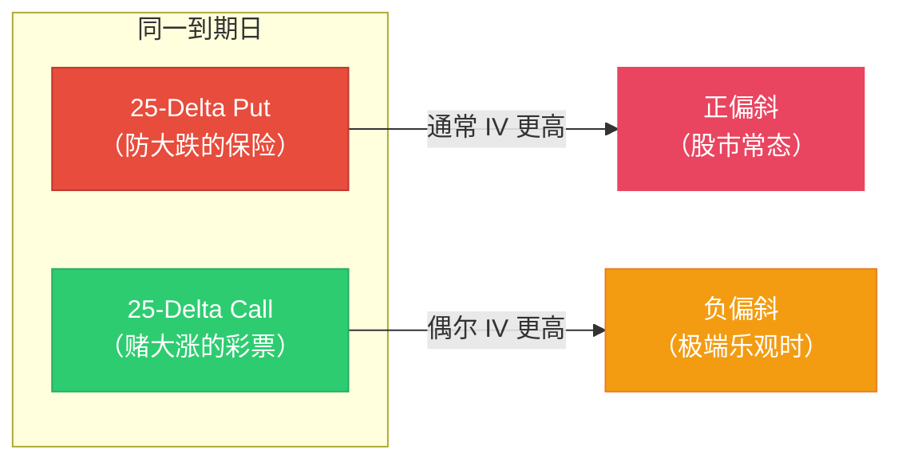
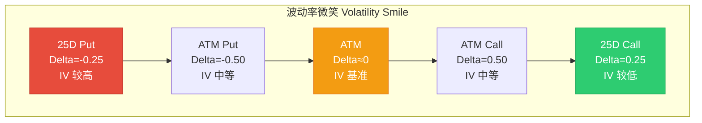
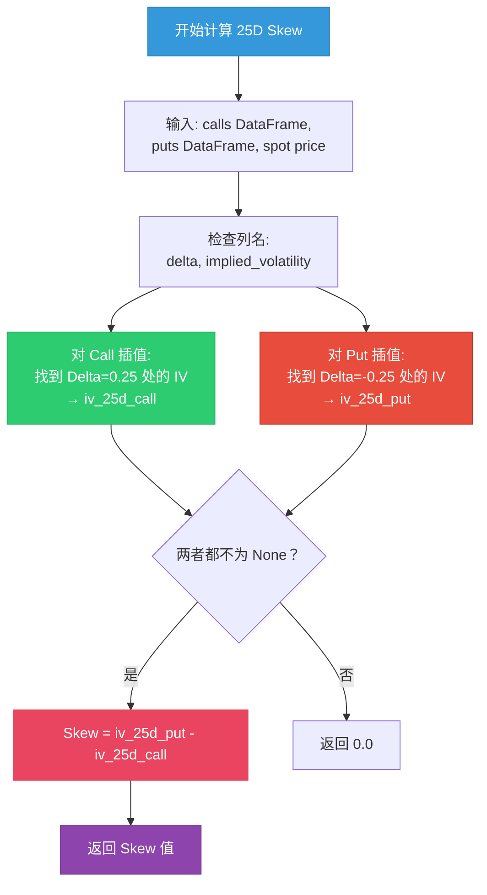
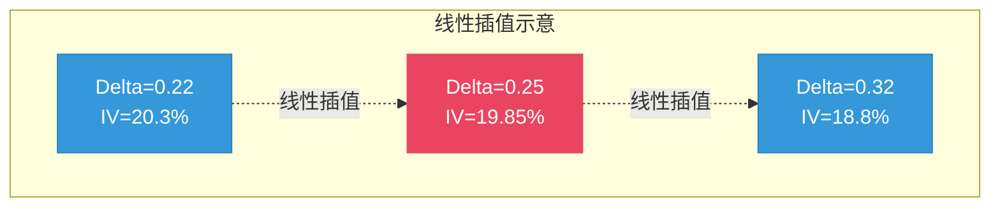
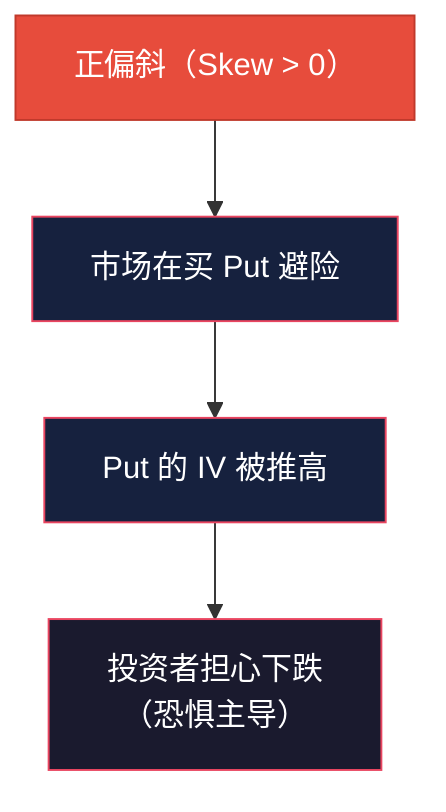
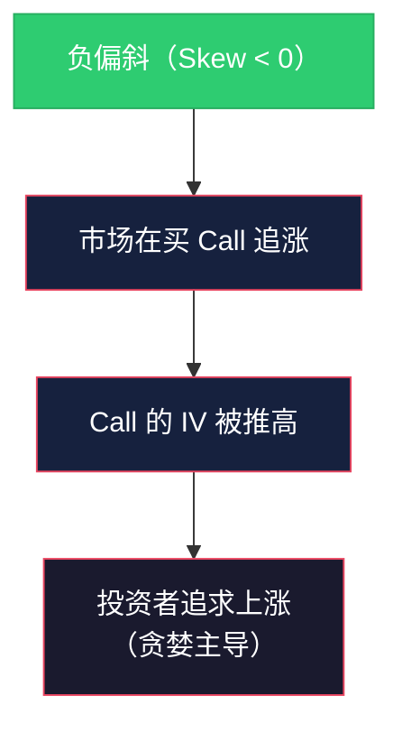
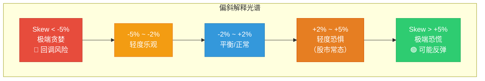
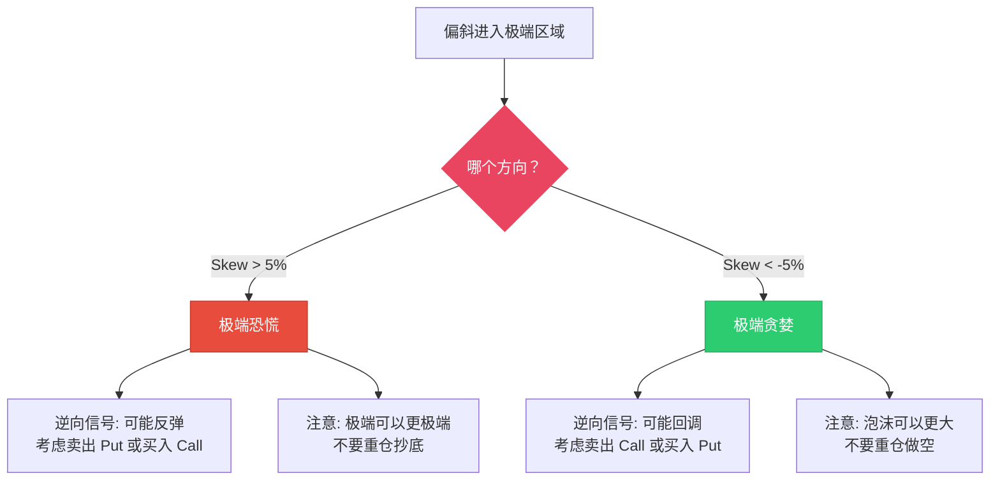
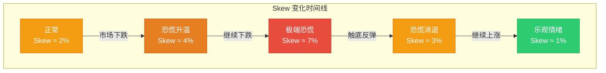

# 25-Delta 偏斜 25-Delta Skew

:::tip 适合谁读？
本文面向零基础读者。建议先阅读 [波动率 Volatility](./volatility.md) 了解隐含波动率 (IV) 的概念，以及 [Greeks](./greeks.md) 了解 Delta 的概念。Skew 是理解市场恐慌与贪婪不对称性的重要工具。本文包含 OptionDash 后端 `volatility.py` 中 Skew 计算部分的完整代码逐行解析。
:::

## 什么是偏斜 (Skew)？

在理想的期权市场中，相同到期日、相同 Delta 的 Call 和 Put 应该有**相同的隐含波动率**。但现实并非如此 -- **下行保护通常比上行投机更贵**。

**25-Delta 偏斜**衡量的就是这种不对称性：25-Delta Put 的 IV 和 25-Delta Call 的 IV 之间的差值。

打个比方：

> 想象你去买保险。一份保"房子被烧毁"的保险和一份保"房子被闪电击中两次"的保险，价格肯定不同。在股市中，"大跌"（被烧毁）比"暴涨"（被闪电击中两次）更常见，所以防大跌的"保险"（Put）通常更贵。**Skew 就是衡量这种"保险价格不对称"的指标。**



---

## 计算方法

### 公式

```
25-Delta Skew = IV(25-Delta Put) - IV(25-Delta Call)
```

### 为什么是 25-Delta？

| 选择 25-Delta 的原因 | 说明 |
|---------------------|------|
| **足够虚值** | 不会太接近平值（平值 IV 差异不明显） |
| **流动性好** | 25-Delta 是场外期权市场的标准报价点 |
| **行业惯例** | 交易员和分析师普遍使用 25-Delta 作为参考 |

### 什么是 25-Delta 期权？

回忆一下 [Greeks](./greeks.md) 中 Delta 的概念：

- **25-Delta Call**：Delta ≈ +0.25 的看涨期权，大约有 25% 的概率到期时变为实值
- **25-Delta Put**：Delta ≈ -0.25 的看跌期权，大约有 25% 的概率到期时变为实值

这两个期权都是**适度虚值 (moderately OTM)** -- 不是极端的赌注，但也不是平庸的选择。

### 25-Delta 期权在波动率微笑中的位置



在典型的股票期权市场中，IV 随 Delta 的变化呈现出"微笑"或"偏斜"形态。Put 端（左侧）的 IV 通常高于 Call 端（右侧），这就是正偏斜。

---

## 完整源码逐行解析

以下是 OptionDash 后端 `backend/services/volatility.py` 中 Skew 计算部分的完整代码。

### 主计算函数

```python
# 文件: backend/services/volatility.py, 第 43-61 行

def calculate_skew_25d(calls: pd.DataFrame, puts: pd.DataFrame, spot: float) -> float:
    """
    Calculate 25-Delta risk reversal.
    25D Skew = IV(25Δ Put) - IV(25Δ Call)
    Uses linear interpolation to find IV at delta ≈ 0.25.
    """
    # 第一步：确认数据中有 delta 和 IV 列
    delta_col_c = "delta" if "delta" in calls.columns else None
    delta_col_p = "delta" if "delta" in puts.columns else None
    iv_col_c = "implied_volatility" if "implied_volatility" in calls.columns else None
    iv_col_p = "implied_volatility" if "implied_volatility" in puts.columns else None

    # 第二步：通过插值找到 25-Delta 处的 IV
    iv_25d_call = _interpolate_iv_at_delta(calls, delta_col_c, iv_col_c, 0.25)
    iv_25d_put = _interpolate_iv_at_delta(puts, delta_col_p, iv_col_p, -0.25)

    # 第三步：计算 Skew
    if iv_25d_call is None or iv_25d_put is None:
        return 0.0                                      # 数据不足时返回 0

    return round(iv_25d_put - iv_25d_call, 4)           # 保留 4 位小数
```

**逐行解析**：

- **第 50-53 行**：检查 Call 和 Put DataFrame 中是否有 `delta` 和 `implied_volatility` 列
- **第 55-56 行**：对 Call 在 Delta=0.25 处插值，对 Put 在 Delta=-0.25 处插值。注意 Put 的 Delta 是负数
- **第 58-59 行**：如果任一插值失败（数据不足），返回 0
- **第 61 行**：Skew = IV(Put) - IV(Call)。正 Skew 表示 Put 的 IV 更高（市场偏恐惧）

### Skew 计算流程图



### 插值辅助函数

```python
# 文件: backend/services/volatility.py, 第 64-94 行

def _interpolate_iv_at_delta(
    df: pd.DataFrame, delta_col: str | None, iv_col: str | None, target_delta: float
) -> float | None:
    """Interpolate IV at a given delta value."""
    # 第一步：数据验证
    if df.empty or delta_col is None or iv_col is None:
        return None

    # 第二步：清洗数据，按 Delta 排序
    df = df.dropna(subset=[delta_col, iv_col]).sort_values(delta_col)
    if df.empty or len(df) < 2:
        return None                                     # 至少需要 2 个点才能插值

    deltas = df[delta_col].values                       # 所有 Delta 值
    ivs = df[iv_col].values                             # 所有 IV 值

    # 第三步：筛选目标方向（Call 正 Delta，Put 负 Delta）
    if target_delta > 0:
        mask = deltas > 0                               # Call: 只看正 Delta
    else:
        mask = deltas < 0                               # Put: 只看负 Delta

    deltas_f = deltas[mask]
    ivs_f = ivs[mask]
    if len(deltas_f) < 2:
        return None                                     # 筛选后不足 2 个点

    # 第四步：使用 scipy 线性插值
    try:
        f = interpolate.interp1d(
            deltas_f, ivs_f,
            kind="linear",              # 线性插值
            bounds_error=False,         # 不报超出范围的错
            fill_value="extrapolate"    # 超出范围则外推
        )
        return float(f(target_delta))   # 返回目标 Delta 处的 IV
    except Exception:
        return None
```

### 插值过程详解

假设 SPY 期权链中 Call 的数据如下：

| 行权价 | Delta | IV |
|--------|-------|------|
| $550 | 0.12 | 24.5% |
| $545 | 0.18 | 22.1% |
| $540 | 0.22 | 20.3% |
| $535 | 0.32 | 18.8% |
| $530 | 0.48 | 17.2% |
| $525 | 0.65 | 16.1% |

我们需要找到 **Delta = 0.25** 处的 IV。但期权链中没有恰好 Delta=0.25 的合约。最接近的两个是：
- Delta = 0.22（$540 行权价），IV = 20.3%
- Delta = 0.32（$535 行权价），IV = 18.8%

线性插值计算：

```
IV(0.25) = IV(0.22) + (0.25 - 0.22) / (0.32 - 0.22) × (IV(0.32) - IV(0.22))
         = 20.3% + 0.03 / 0.10 × (18.8% - 20.3%)
         = 20.3% + 0.3 × (-1.5%)
         = 20.3% - 0.45%
         = 19.85%
```



### 为什么用线性插值？

| 原因 | 说明 |
|------|------|
| **简单可靠** | 线性插值是最基本的插值方法，不需要额外假设 |
| **平滑性** | 在 25-Delta 附近，IV 曲线通常比较平滑，线性近似足够好 |
| **行业标准** | 场外期权市场也普遍使用线性插值 |
| **边界处理** | `fill_value="extrapolate"` 允许在数据范围边缘进行外推 |

:::info scipy.interpolate.interp1d
`interp1d` 是 SciPy 库中的一维插值函数。它接收一组已知的 `(x, y)` 数据点，返回一个函数 `f(x)`，可以用任意 `x` 值调用来获得对应的 `y` 值。`kind="linear"` 指定使用线性插值（而不是样条插值等更复杂的方法）。
:::

---

## 正偏斜 vs 负偏斜

### 正偏斜 (Positive Skew) -- "恐惧主导"

**当 25-Delta Put 的 IV 高于 25-Delta Call 的 IV 时，偏斜为正。**

这意味着市场愿意为"防大跌"支付更高的价格。



| 偏斜程度 | 含义 | 市场情绪 |
|---------|------|---------|
| Skew ≈ 0% | Put 和 Call 的 IV 接近 | 平静，多空平衡 |
| Skew ≈ 2-3% | 轻微正偏斜 | 这是股市的**常态** |
| Skew ≈ 5% | 明显正偏斜 | 市场明显偏恐惧 |
| `Skew > 5%` | **极端正偏斜** | 极度恐慌，大量买入 Put |

:::info 为什么正偏斜是股市常态？
1. **机构投资者的避险需求**：基金、养老金等机构需要买入 Put 来对冲持仓风险
2. **崩盘恐惧**：股市暴跌（如 2008 年金融危机、2020 年疫情）的记忆犹新，投资者愿意为"灾难保险"多付钱
3. **杠杆交易者的需求**：使用杠杆的投资者需要 Put 来保护自己不被爆仓
:::

### 负偏斜 (Negative Skew) -- "贪婪主导"

**当 25-Delta Call 的 IV 高于 25-Delta Put 的 IV 时，偏斜为负。**

这意味着市场愿意为"赌大涨"支付更高的价格。



负偏斜在股市中**不太常见**，但一旦出现，通常意味着：

| 含义 | 说明 |
|------|------|
| **极端乐观** | 市场疯狂追涨，投机者大量买入 Call |
| **FOMO 效应** | "害怕错过"（Fear Of Missing Out）情绪蔓延 |
| **潜在风险** | 极度乐观往往预示着回调的可能 |

---

## 偏斜解释光谱



---

## 极端值与信号

OptionDash 在历史图表中用**阴影区域**标注极端偏斜值：

### 极端区域定义

| 区域 | Skew 范围 | 标识 | 含义 |
|------|----------|------|------|
| **极端看跌** | `Skew > 5%` | 红色阴影 | 极度恐慌，大量买入 Put |
| **正常区** | -5% 到 +5% | 无阴影 | 正常波动范围 |
| **极端看涨** | `Skew < -5%` | 绿色阴影 | 极度贪婪，大量买入 Call |

### 极端值的逆向信号

:::tip 逆向思维
极端偏斜往往是**反向信号**：
- **Skew > 5%（极端恐慌）**：市场可能已经超卖，反而可能反弹。"当别人恐惧时贪婪。"
- **Skew < -5%（极端贪婪）**：市场可能已经过热，回调风险增加。"当别人贪婪时恐惧。"
:::



---

## 偏斜的变化模式

Skew 不是静态的，它会随着市场条件变化。观察 Skew 的**变化趋势**比绝对值更有意义：

### 典型变化模式

| 模式 | 描述 | 可能的含义 |
|------|------|----------|
| **Skew 从高位回落** | 从极端恐慌区逐渐回归正常 | 恐慌情绪消退，市场可能企稳 |
| **Skew 从低位上升** | 从负值或零附近开始上升 | 避险需求增加，市场开始不安 |
| **Skew 急剧扩大** | 在短时间内从正常区跳到极端区 | 恐慌性抛售开始，注意风险 |
| **Skew 急剧收窄** | 在短时间内从极端区回落 | 恐慌结束，可能是抄底时机 |



---

## 跨标的比较

Skew 还可以用于**比较不同标的之间的市场情绪**：

| 标的 | 典型 Skew | 说明 |
|------|----------|------|
| **SPY（标普 500 ETF）** | 通常为正（2-4%） | 大盘蓝筹，机构避险需求强 |
| **QQQ（纳斯达克 100 ETF）** | 通常更高（3-5%） | 科技股波动大，避险需求更强 |
| **IWM（罗素 2000 ETF）** | 通常最高（4-6%） | 小盘股波动最大 |
| **TLT（国债 ETF）** | 可能为负 | 与股票负相关，恐慌时可能有追涨 |
| **个股（如 AAPL）** | 因标的而异 | 取决于个股的波动特性和投资者情绪 |

:::tip 跨标的应用
如果 SPY 的 Skew 为 2% 而 QQQ 的 Skew 高达 6%，说明科技股市场的恐慌程度远高于整体市场。这可能是相对价值交易的机会。
:::

---

## 在 OptionDash 中查看 Skew

### 历史图表 (Historical Module)

OptionDash 的历史模块包含一张 **25-Delta Skew 图表**：

| 展示内容 | 说明 |
|---------|------|
| **Skew 曲线** | 随时间变化的 25-Delta Skew 值 |
| **极端看跌区域** | `红色阴影（Skew > 5%）` |
| **极端看涨区域** | `绿色阴影（Skew < -5%）` |
| **零线** | 参考线，区分正负偏斜 |

### 如何阅读

1. **观察当前值**：Skew 是正还是负？数值多大？
2. **观察趋势**：Skew 在扩大还是收窄？
3. **注意极端区域**：是否进入了红色或绿色阴影区域？
4. **结合股价分析**：Skew 的变化与股价走势是否一致？

### 数据库存储

```sql
-- 文件: backend/database/schema.sql, 第 17 行
CREATE TABLE IF NOT EXISTS daily_snapshots (
    ...
    skew_25d REAL,                -- 25-Delta 偏斜
    ...
);
```

每日快照存储 25-Delta Skew 值，用于历史趋势分析。

---

## 实际应用指南

### 场景一：Skew 进入极端恐慌区（> 5%）

| 步骤 | 操作 |
|------|------|
| 1. 确认恐慌原因 | 是系统性风险还是个别事件？ |
| 2. 评估逆向机会 | 极端恐慌可能预示反弹机会 |
| 3. 谨慎行动 | 不要重仓抄底，极端可以更极端 |
| 4. 等待信号 | 观察 Skew 开始回落再入场 |

### 场景二：Skew 急剧收窄

| 步骤 | 操作 |
|------|------|
| 1. 判断原因 | 是恐慌消退还是 Call 投机升温？ |
| 2. 评估持续性 | 基本面是否支持情绪转变？ |
| 3. 跟踪后续 | 如果 Skew 继续收窄甚至变负，可能进入贪婪阶段 |

### 场景三：Skew 在正常范围内

| 步骤 | 操作 |
|------|------|
| 1. 作为基线 | 记录当前 Skew 作为"正常"参考 |
| 2. 监控变化 | 关注 Skew 是否开始偏离正常范围 |
| 3. 结合其他指标 | 与 GEX、PCR 等指标综合分析 |

:::warning 风险提示
Skew 是一个辅助指标，不应单独使用。极端偏斜虽然经常是反向信号，但**极端可以变得更极端**。在使用 Skew 做交易决策时，务必结合其他分析工具，并严格控制风险。
:::

---

## 术语对照表

| 英文术语 | 中文翻译 | 说明 |
|---------|---------|------|
| 25-Delta Skew | 25-Delta 偏斜 | 25-Delta Put IV 与 Call IV 的差值 |
| Risk Reversal | 风险逆转 | Skew 的另一个名称（场外期权市场术语） |
| Positive Skew | 正偏斜 | `Put IV > Call IV，市场偏恐惧` |
| Negative Skew | 负偏斜 | `Call IV > Put IV，市场偏贪婪` |
| Interpolation | 插值 | 在已知数据点之间估算未知值 |
| Crash Fear | 崩盘恐惧 | 投资者对大跌的恐惧，推高 Put IV |
| FOMO | 害怕错过 | Fear Of Missing Out，追涨心理 |
| Volatility Smile | 波动率微笑 | IV 随 Delta 变化的 U 形曲线 |

:::note 下一步
- [希腊字母 Greeks](./greeks.md) -- 回顾 Delta 的基本概念
- [波动率 Volatility](./volatility.md) -- 深入理解 IV 和 VRP
- [伽马敞口 GEX](./gex.md) -- 了解做市商行为如何影响市场
:::
