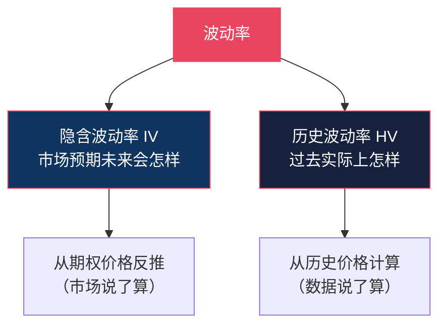
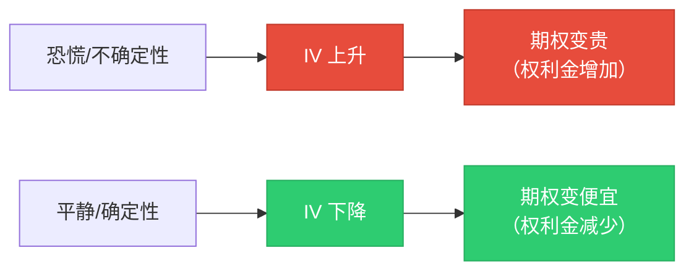
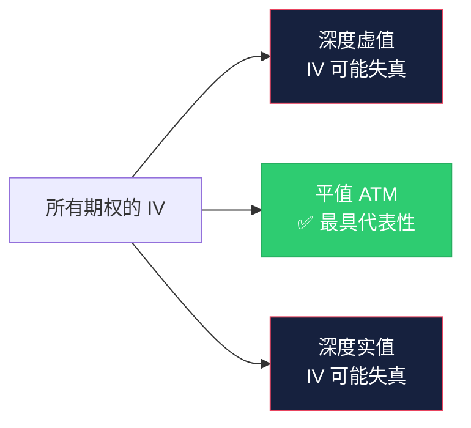
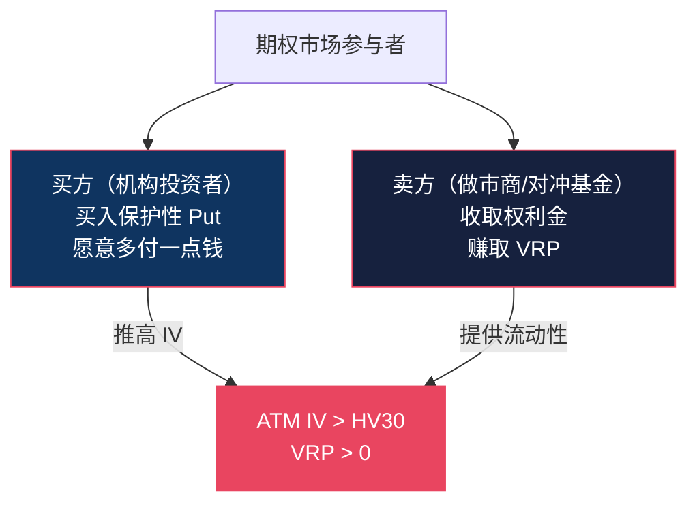
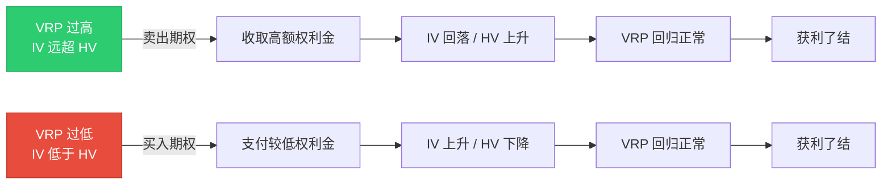
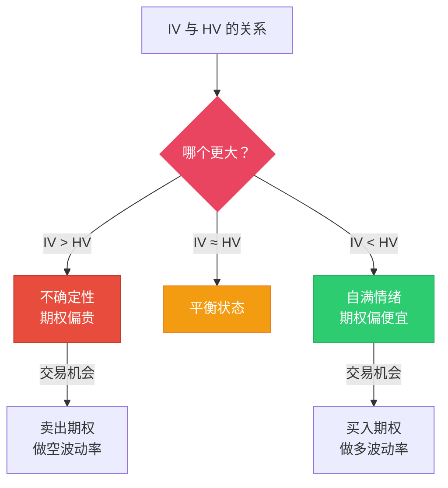
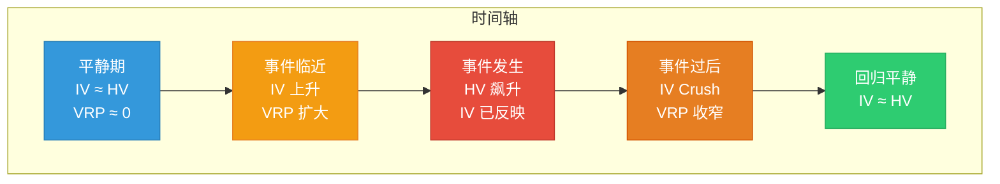
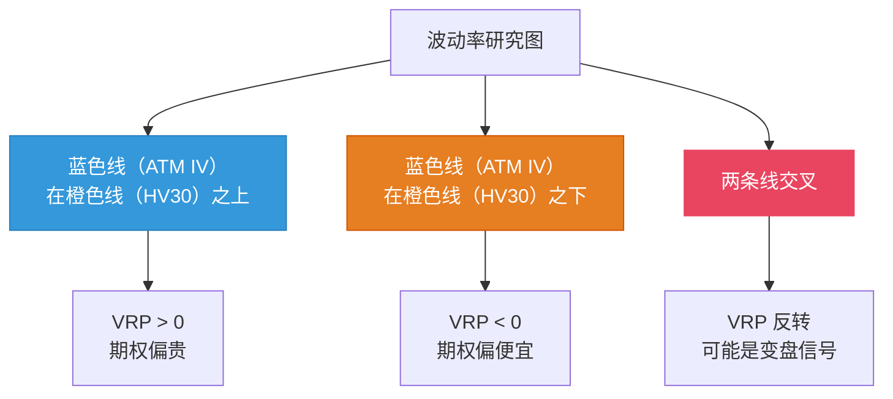
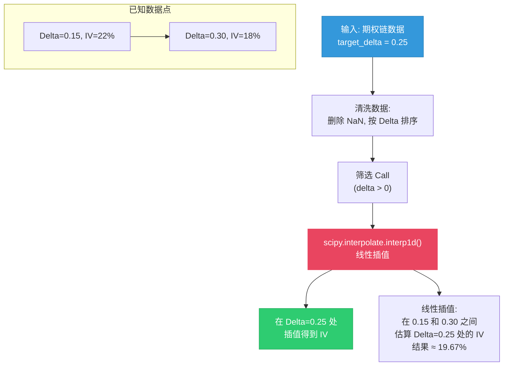

# 波动率 Volatility

:::tip 适合谁读？
本文面向零基础读者。如果你了解 [期权基础](./options-basics.md) 和 [希腊字母 Greeks](./greeks.md)，就能理解本文。波动率是期权定价中最核心的变量之一。本文包含 OptionDash 后端 `volatility.py` 的完整代码逐行解析。
:::

## 什么是波动率？

**波动率**衡量的是资产价格变动的剧烈程度。

打个比方：

> 想象两条路。一条是平坦的高速公路，车速稳定在 100 km/h（低波动率）。另一条是山路，时快时慢，经常急转弯（高波动率）。虽然两条路的平均速度可能差不多，但山路的"不确定性"要大得多。

在期权市场中，波动率直接决定了期权的价格（权利金）。波动率越高，期权越贵 -- 因为大涨大跌的可能性更大，期权变为实值的机会也更大。



---

## 隐含波动率 (Implied Volatility, IV)

### 定义

**隐含波动率是市场对未来波动程度的预期**，它从期权的当前价格中"反推"出来。

打个比方：

> 你去菜市场买西瓜。一个西瓜标价 50 元，另一个标价 100 元。价格差异反映了卖家对这两个西瓜"甜度"（价值）的不同预期。类似地，**期权的价格差异反映了市场对"波动程度"的不同预期** -- 这个预期就是隐含波动率。

### IV 的特点

| 特点 | 说明 |
|------|------|
| **前瞻性** | 反映市场对未来的预期，不是对过去的总结 |
| **动态变化** | 随市场情绪实时变化 |
| **期权特有** | 每个期权合约都有自己的 IV |
| **供需驱动** | 恐慌时买期权的人多，IV 上升；平静时 IV 下降 |

### IV 与期权价格的关系



### IV 的典型场景

| 场景 | IV 水平 | 原因 |
|------|---------|------|
| 财报发布前 | 飙升 | 不确定性极高，市场愿意为"保险"付更多钱 |
| 财报发布后 | 急剧下降 | 不确定性消除，"保险"不再值钱（IV Crush） |
| 市场恐慌期（如暴跌） | 极高 | 大量买入 Put 避险，推高 IV |
| 市场平稳期 | 较低 | 没有大事件，期权需求平淡 |

:::warning IV Crush（隐含波动率坍塌）
这是期权交易者最需要注意的陷阱之一。在重大事件（如财报、美联储会议）之前，IV 会大幅上升。事件过后，不确定性消除，IV 会急剧下降。即使股价朝你预测的方向变动，IV 下降带来的损失也可能让你亏钱。
:::

---

## 历史波动率 (Historical Volatility, HV)

### 定义

**历史波动率是资产价格在过去一段时间内实际波动的幅度。** 它是基于真实数据计算出来的，不是预测。

打个比方：

> IV 是天气预报说明天有 80% 概率下雨（预测）。HV 是过去 30 天里有 18 天真的下了雨（事实）。两者经常不一致，但长期来看会趋向收敛。

### OptionDash 的 HV30 计算代码

```python
# 文件: backend/services/volatility.py, 第 10-21 行

def calculate_hv(prices: pd.Series | np.ndarray, window: int = 30) -> float:
    """
    Calculate historical volatility (HV) over a window.
    HV = std(log_returns, window) * sqrt(252)
    """
    if isinstance(prices, pd.Series):
        prices = prices.values                          # 转为 NumPy 数组
    if len(prices) < window + 1:
        return 0.0                                      # 数据不足时返回 0
    log_returns = np.diff(np.log(prices[-window - 1:])) # 计算对数收益率
    return float(np.std(log_returns) * np.sqrt(252))    # 标准差 × 年化因子
```

**逐行解析**：

- **第 15-16 行**：如果输入是 Pandas Series，先转为 NumPy 数组
- **第 17-18 行**：如果价格数据不足 `window + 1` 个点（至少需要 31 天数据计算 30 天收益率），返回 0
- **第 19 行**：`prices[-window - 1:]` 取最近 31 个价格；`np.log(...)` 取自然对数；`np.diff(...)` 计算相邻对数的差值，即对数收益率
- **第 20 行**：`np.std(...)` 计算标准差；`np.sqrt(252)` 是年化因子（一年约 252 个交易日）

### 计算公式详解

```
HV30 = StdDev(ln(今日收盘价 / 昨日收盘价), 30天) × √252
```

其中：
- `ln(今日收盘价 / 昨日收盘价)` 是**对数收益率**（log return）
- `StdDev(..., 30天)` 是过去 30 个交易日对数收益率的**标准差**
- `× √252` 是年化因子（一年约 252 个交易日）

### 举例说明

假设 SPY 过去 5 天的收盘价为：

| 日期 | 收盘价 | 对数收益率 |
|------|--------|-----------|
| 周一 | $530.00 | -- |
| 周二 | $532.50 | ln(532.50/530.00) = 0.0047 |
| 周三 | $528.00 | ln(528.00/532.50) = -0.0085 |
| 周四 | $535.00 | ln(535.00/528.00) = 0.0132 |
| 周五 | $533.00 | ln(533.00/535.00) = -0.0037 |

然后计算这 4 个对数收益率的标准差，再乘以 √252，就得到年化的历史波动率。

---

## ATM IV（平值隐含波动率）

### OptionDash 的 ATM IV 计算代码

```python
# 文件: backend/services/volatility.py, 第 24-35 行

def calculate_atm_iv(calls: pd.DataFrame, puts: pd.DataFrame, spot: float) -> float:
    """Get ATM IV by averaging the IV of call and put nearest to spot."""
    iv_col_c = "implied_volatility" if "implied_volatility" in calls.columns else None
    iv_col_p = "implied_volatility" if "implied_volatility" in puts.columns else None

    ivs = []
    for df, iv_col in ((calls, iv_col_c), (puts, iv_col_p)):
        if iv_col and not df.empty:
            idx = (df["strike"] - spot).abs().idxmin()  # 找到最接近 spot 的行权价
            ivs.append(float(df.loc[idx, iv_col]))       # 取该行权价的 IV

    return sum(ivs) / len(ivs) if ivs else 0.0          # Call 和 Put IV 的平均值
```

**逐行解析**：

- **第 29-30 行**：确认数据中有 `implied_volatility` 列
- **第 33 行**：`(df["strike"] - spot).abs().idxmin()` 是关键 -- 对每个行权价减去当前股价，取绝对值，然后找到最小值的索引。这就是最接近当前股价的行权价（即 ATM）。
- **第 34 行**：取该行权价对应的 IV 值
- **第 36 行**：对 Call ATM IV 和 Put ATM IV 取平均

### 为什么用 ATM IV？

| 原因 | 说明 |
|------|------|
| **最具代表性** | ATM 期权流动性最好，价格最准确 |
| **避免极端值** | 深度虚值/实值期权的 IV 可能失真 |
| **行业标准** | VIX 指数也是基于近平值期权计算的 |



---

## 波动率风险溢价 (VRP)

### 定义与代码

```python
# 文件: backend/services/volatility.py, 第 38-40 行

def calculate_vrp(atm_iv: float, hv30: float) -> float:
    """VRP = ATM IV - HV30. Positive = options overvalued relative to history."""
    return atm_iv - hv30
```

**VRP = ATM IV - HV30**。就这么简单。

### 为什么 VRP 通常为正？

期权的买方（主要是机构投资者）愿意为"保险"多付一点钱，就像你买医疗保险时，保费通常高于实际预期的医疗支出。这个多付的部分就是 VRP。



### VRP 的含义与交易信号

| VRP 范围 | 含义 | 交易信号 |
|---------|------|---------|
| `显著为正（如 > 5%）` | 期权"贵"，IV 远高于实际波动 | 卖期权（做空波动率） |
| 接近零 | IV 与实际波动接近 | 中性，观望 |
| 为负 | 期权"便宜"，IV 低于实际波动 | 买期权（做多波动率） |

### VRP 的均值回归特性

VRP 具有强烈的**均值回归**特性：



:::info 均值回归
历史数据显示，VRP 长期保持正值（平均约 3-5%），但在极端市场条件下会出现剧烈波动。当 VRP 偏离均值过远时，往往会回归到正常水平。这个回归过程就是交易机会。
:::

---

## IV 与 HV 的关系

隐含波动率和历史波动率之间的关系揭示了市场的"预期 vs 现实"：



| 状态 | 含义 | 市场情绪 |
|------|------|---------|
| `IV > HV` | 市场预期未来波动会大于近期历史 | 不确定性上升，恐慌或期待重大事件 |
| `IV ≈ HV` | 市场预期与近期历史一致 | 平静，没有特别的预期 |
| `IV < HV` | 市场预期未来波动会小于近期历史 | 自满（complacency），市场认为近期波动会消退 |

:::tip 事件前后的典型模式
1. **事件前**：IV 上升（市场提前定价不确定性），VRP 扩大
2. **事件发生**：实际波动可能很大，但 IV 已经提前反映了
3. **事件后**：IV 快速下降（IV Crush），VRP 收窄
:::

---

## IV vs HV 关系的时序图



---

## 波动率在 OptionDash 中的展示

### 波动率研究图表 (Volatility Study)

OptionDash 的历史模块包含一张 **波动率研究图**，同时展示三条曲线：

| 曲线 | 颜色 | 含义 |
|------|------|------|
| **ATM IV** | 蓝色 | 市场对未来波动的预期 |
| **HV30** | 橙色 | 过去 30 天的实际波动 |
| **VRP** | 紫色 | IV 与 HV 的差值（阴影区域） |

### 如何阅读波动率研究图



---

## scipy.interpolate 在 OptionDash 中的使用

OptionDash 使用 `scipy.interpolate` 进行 IV 的插值计算。这在 [25-Delta 偏斜](./skew.md) 的计算中尤为重要。以下是关键代码：

```python
# 文件: backend/services/volatility.py, 第 64-94 行

def _interpolate_iv_at_delta(
    df: pd.DataFrame, delta_col: str | None, iv_col: str | None, target_delta: float
) -> float | None:
    """Interpolate IV at a given delta value."""
    if df.empty or delta_col is None or iv_col is None:
        return None

    # 第一步：清洗数据，按 Delta 排序
    df = df.dropna(subset=[delta_col, iv_col]).sort_values(delta_col)
    if df.empty or len(df) < 2:
        return None                                         # 至少需要 2 个数据点

    deltas = df[delta_col].values                           # Delta 数组
    ivs = df[iv_col].values                                 # IV 数组

    # 第二步：筛选目标方向的 Delta
    if target_delta > 0:
        mask = deltas > 0                                   # Call: 只看正 Delta
    else:
        mask = deltas < 0                                   # Put: 只看负 Delta

    deltas_f = deltas[mask]
    ivs_f = ivs[mask]
    if len(deltas_f) < 2:
        return None

    # 第三步：线性插值
    try:
        f = interpolate.interp1d(
            deltas_f, ivs_f,
            kind="linear",              # 线性插值
            bounds_error=False,         # 超出范围不报错
            fill_value="extrapolate"    # 超出范围则外推
        )
        return float(f(target_delta))   # 返回目标 Delta 处的 IV
    except Exception:
        return None
```

### 插值过程图解



:::info 为什么需要插值？
期权链中的 Delta 值是离散的（取决于行权价间距），不一定恰好有 Delta = 0.25 的合约。通过线性插值，我们可以在已知数据点之间估算出任意 Delta 处的 IV 值。
:::

---

## 实际应用指南

### 策略一：VRP 均值回归

**适合场景**：VRP 偏离历史均值较远

| VRP 状态 | 操作 | 预期 |
|---------|------|------|
| VRP 远高于均值 | 卖出宽跨式（Short Straddle）或 Iron Condor | IV 回落时获利 |
| VRP 远低于均值 | 买入宽跨式（Long Straddle） | IV 上升时获利 |

### 策略二：事件交易

**适合场景**：财报、美联储会议等重大事件前

1. **事件前**：IV 上升，卖出期权收取高额权利金
2. **事件后**：IV Crush，买回期权平仓获利
3. **注意**：如果实际波动远超预期，可能亏损

### 策略三：波动率择时

**适合场景**：长期投资者

| 市场状态 | 建议 |
|---------|------|
| IV 处于历史高位（恐慌期） | 卖出保护性 Put（相当于低价买入股票） |
| IV 处于历史低位（平静期） | 买入保护性 Put（便宜的"保险"） |

:::warning 风险提示
波动率交易看似简单，但实际操作中有许多陷阱：
- IV 可能比你预期的走得更极端（"市场非理性的时间可以比你保持偿付能力的时间更长"）
- 卖期权的尾部风险巨大（一次黑天鹅可能抹去多年收益）
- VRP 的均值回归可能需要很长时间
:::

---

## 数据库中的波动率存储

```sql
-- 文件: backend/database/schema.sql, 第 7-17 行
CREATE TABLE IF NOT EXISTS daily_snapshots (
    ...
    atm_iv REAL,                  -- 平值隐含波动率
    hv30 REAL,                    -- 30天历史波动率
    vrp REAL,                     -- 波动率风险溢价 (IV - HV)
    skew_25d REAL,                -- 25-Delta 偏斜
    ...
);
```

每日快照存储 ATM IV、HV30、VRP 和 25D Skew，用于历史趋势分析。

---

## 术语对照表

| 英文术语 | 中文翻译 | 说明 |
|---------|---------|------|
| Implied Volatility (IV) | 隐含波动率 | 市场对未来波动的预期 |
| Historical Volatility (HV) | 历史波动率 | 过去一段时间的实际波动幅度 |
| HV30 | 30天历史波动率 | 过去 30 个交易日的年化波动率 |
| ATM IV | 平值隐含波动率 | 平值期权的隐含波动率 |
| VRP | 波动率风险溢价 | ATM IV 与 HV30 的差值 |
| IV Crush | 隐含波动率坍塌 | 事件后 IV 急剧下降 |
| Mean Reversion | 均值回归 | 偏离均值的值倾向于回归平均 |
| Log Return | 对数收益率 | ln(今日价/昨日价) |

:::note 下一步
- [25-Delta 偏斜](./skew.md) -- 了解不同 Delta 期权之间 IV 的差异
- [伽马敞口 GEX](./gex.md) -- 了解波动率如何通过做市商影响市场
- [Greeks 指标](./greeks.md) -- 了解 Vega 如何让期权对波动率敏感
:::
