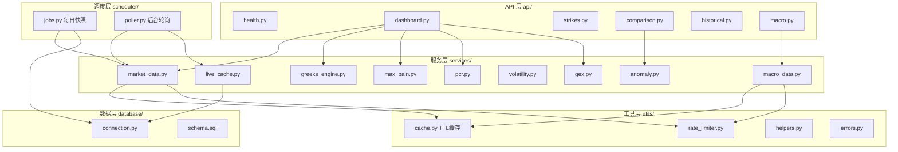
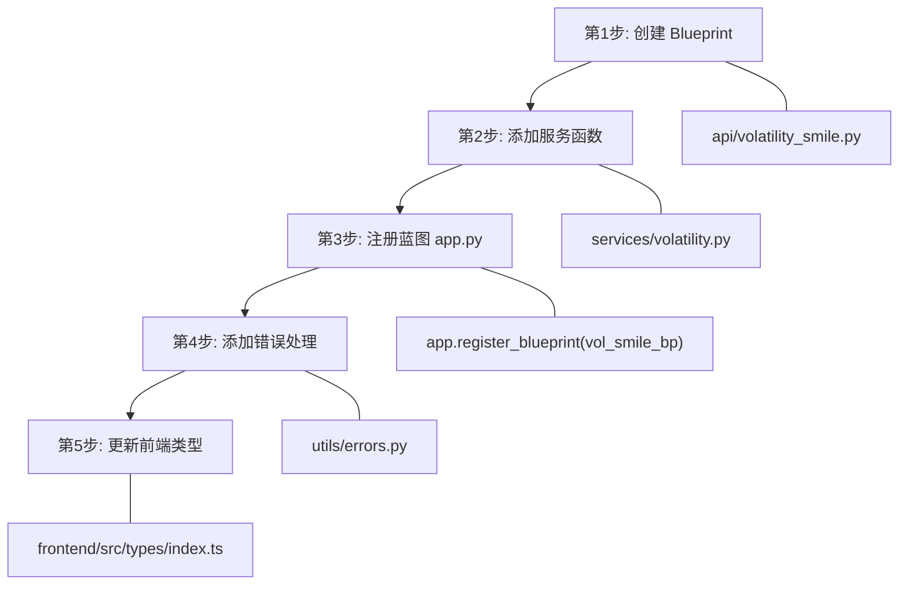
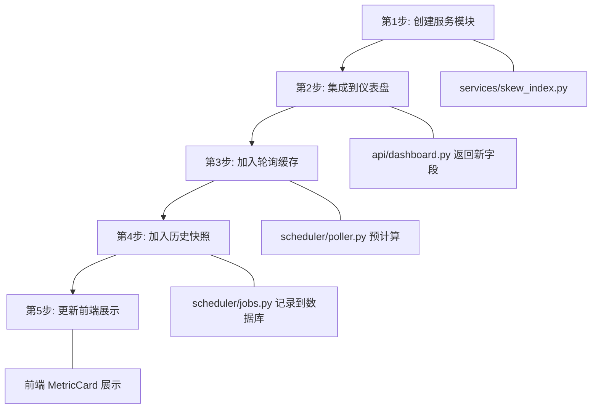

# 后端开发

本指南面向需要修改或扩展 OptionDash 后端的开发者。

## 项目结构

```
backend/
├── app.py              # Flask 应用入口（工厂函数 create_app）
├── config.py           # 配置管理（所有环境变量集中定义）
├── requirements.txt    # Python 依赖清单
├── api/                # REST API 蓝图层
│   ├── health.py       #   健康检查
│   ├── dashboard.py    #   仪表盘概览
│   ├── strikes.py      #   行权价分析
│   ├── comparison.py   #   多标的对比
│   ├── historical.py   #   历史数据
│   └── macro.py        #   宏观指标
├── services/           # 业务逻辑层（核心计算）
│   ├── market_data.py  #   yfinance 数据获取与解析
│   ├── greeks_engine.py#   Black-Scholes Greeks 计算引擎
│   ├── max_pain.py     #   Max Pain 计算
│   ├── pcr.py          #   Put/Call Ratio
│   ├── gex.py          #   Gamma Exposure
│   ├── volatility.py   #   隐含波动率与历史波动率
│   ├── anomaly.py      #   异常检测
│   ├── macro_data.py   #   宏观经济指标获取
│   └── live_cache.py   #   实时缓存管理
├── scheduler/          # 后台任务调度
│   ├── jobs.py         #   定时任务定义（快照等）
│   └── poller.py       #   轮询器（保持缓存新鲜）
├── database/           # 数据库层
│   ├── connection.py   #   连接管理与 Schema 初始化
│   └── schema.sql      #   DDL 建表语句
└── utils/              # 工具函数
    ├── cache.py        #   TTL 缓存封装
    ├── rate_limiter.py #   请求速率限制器
    ├── helpers.py      #   通用工具
    └── errors.py       #   统一错误处理
```

## 后端分层架构



**各层职责：**

| 层 | 目录 | 职责 | 依赖规则 |
|----|------|------|----------|
| API 层 | `api/` | 路由注册、参数校验、响应格式化 | 依赖服务层和工具层，不直接访问数据库 |
| 服务层 | `services/` | 核心业务逻辑和指标计算 | 不依赖 Flask 请求上下文，便于单元测试 |
| 工具层 | `utils/` | 缓存、限流、错误处理等通用功能 | 无业务逻辑，可被任意层使用 |
| 调度层 | `scheduler/` | 后台定时任务 | 调用服务层函数，写入数据库 |
| 数据层 | `database/` | SQLite 连接管理和 Schema | 只负责数据存取，不包含业务逻辑 |

## 添加新的 API 端点

以添加一个新的 `/api/volatility-smile` 端点为例：

### 流程图



### 第一步：创建蓝图

在 `api/` 目录下新建文件：

```python
# api/volatility_smile.py
import logging
from flask import Blueprint, jsonify, request
from config import Config
from services.market_data import get_options_chain
from services.greeks_engine import compute_chain_greeks
from services.volatility import compute_volatility_smile
from utils.errors import ticker_not_supported, data_source_error

logger = logging.getLogger(__name__)

vol_smile_bp = Blueprint("vol_smile", __name__)


@vol_smile_bp.route("/api/volatility-smile", methods=["GET"])
def get_volatility_smile():
    ticker = request.args.get("ticker", "SPY").upper()

    # 参数校验
    if ticker not in Config.SUPPORTED_TICKERS:
        return ticker_not_supported(ticker)

    try:
        chain = get_options_chain(ticker)
        chain = compute_chain_greeks(chain)
        data = compute_volatility_smile(chain["calls"], chain["puts"], chain["spot_price"])
        return jsonify({"ticker": ticker, "data": data})
    except Exception as e:
        logger.exception(f"Volatility smile failed for {ticker}")
        return data_source_error(ticker, "volatility_smile", e)
```

### 第二步：添加服务函数

在 `services/` 目录下新增或更新对应的业务逻辑模块：

```python
# services/volatility.py (新增函数)
def compute_volatility_smile(calls, puts, spot_price) -> dict:
    """
    计算波动率微笑曲线。

    返回各行权价对应的 IV，用于绘制波动率微笑图。
    """
    # 业务逻辑实现
    strikes = calls["strike"].tolist()
    call_iv = calls["implied_volatility"].tolist()
    put_iv = puts["implied_volatility"].tolist()

    return {
        "strikes": strikes,
        "call_iv": call_iv,
        "put_iv": put_iv,
        "spot_price": spot_price,
    }
```

### 第三步：注册蓝图

在 `app.py` 的 `create_app()` 中注册：

```python
# backend/app.py
from api.volatility_smile import vol_smile_bp

def create_app() -> Flask:
    # ... 其他代码 ...
    app.register_blueprint(vol_smile_bp)
    # ...
```

### 第四步：添加错误处理

使用 `utils/errors.py` 中的统一错误函数：

- `ticker_not_supported(ticker)` — 400 错误
- `data_source_error(ticker, source, exception)` — 502 错误
- `no_data_available(ticker, endpoint)` — 404 错误

### 第五步：更新前端类型

在 `frontend/src/types/index.ts` 中添加对应的 TypeScript 类型定义，并在 `frontend/src/api/` 中添加调用函数。

## 添加新的指标

以添加"波动率偏度指数"指标为例：

### 流程图



### 第一步：创建服务模块

```python
# services/skew_index.py
import numpy as np
import pandas as pd


def compute_skew_index(options_chain: pd.DataFrame) -> float:
    """
    计算波动率偏度指数。

    使用 OTM put 与 ATM call 的隐含波动率差异来衡量市场恐慌程度。
    """
    # 业务逻辑实现
    # ...
    return skew_value
```

### 第二步：集成到仪表盘

在 `api/dashboard.py` 中调用新指标，并将其加入仪表盘概览的响应数据中：

```python
# api/dashboard.py — 在 dashboard_summary() 中添加
skew_index = compute_skew_index(chain)

return jsonify({
    # ... 现有字段 ...
    "skew_index": round(skew_index, 4),  # 新增字段
})
```

### 第三步：加入轮询缓存

在 `scheduler/poller.py` 的 `_poll_ticker()` 中加入新指标的预计算逻辑：

```python
# scheduler/poller.py — 在 _poll_ticker() 中添加
skew_index = compute_skew_index(chain)
summary["skew_index"] = round(skew_index, 4)
```

### 第四步：加入历史快照

如果指标需要历史追踪，在 `scheduler/jobs.py` 的 `daily_snapshot_job()` 中记录指标值到数据库，并在 `database/schema.sql` 中添加对应列。

### 第五步：更新前端展示

在前端 `types/index.ts` 中添加类型，在 `modules/dashboard/index.tsx` 中添加 `MetricCard` 展示。

## 数据库操作模式

**源码位置：** `backend/database/connection.py`

```python
# backend/database/connection.py (第 76-100 行)
def execute(self, query: str, params: tuple = ()) -> list:
    """Execute a query and return all results as list of dicts."""
    with self.get_cursor() as cursor:
        cursor.execute(query, params)
        if cursor.description:
            columns = [col[0] for col in cursor.description]
            return [dict(zip(columns, row)) for row in cursor.fetchall()]
        return []

def execute_one(self, query: str, params: tuple = ()) -> dict | None:
    """Execute a query and return the first result as a dict."""
    results = self.execute(query, params)
    return results[0] if results else None

def execute_many(self, query: str, params_list: list[tuple]) -> int:
    """Execute a batch insert and return the number of rows affected."""
    with self.get_cursor() as cursor:
        cursor.executemany(query, params_list)
        return cursor.rowcount
```

**使用方式：**

```python
from database.connection import db

# 查询多行
rows = db.execute("SELECT * FROM daily_snapshots WHERE ticker = ?", ("SPY",))

# 查询单行
row = db.execute_one("SELECT * FROM daily_snapshots WHERE ticker = ? ORDER BY date DESC LIMIT 1", ("SPY",))

# 批量插入
db.execute_many("INSERT INTO daily_snapshots (...) VALUES (...)", params_list)
```

## 测试策略

### 单元测试

服务层函数不依赖 Flask 请求上下文，可以直接测试：

```python
# tests/test_max_pain.py
import pandas as pd
from services.max_pain import calculate_max_pain

def test_max_pain_basic():
    calls = pd.DataFrame({
        "strike": [100, 105, 110],
        "open_interest": [1000, 2000, 1500],
        "implied_volatility": [0.2, 0.18, 0.22],
    })
    puts = pd.DataFrame({
        "strike": [100, 105, 110],
        "open_interest": [1200, 1800, 1600],
        "implied_volatility": [0.25, 0.20, 0.19],
    })

    result = calculate_max_pain(calls, puts)
    assert "max_pain_strike" in result
    assert "total_loss" in result
    assert len(result["strikes"]) == 3
```

### API 集成测试

使用 Flask 测试客户端测试 API 端点：

```python
# tests/test_api.py
from app import create_app

def test_health_endpoint():
    app = create_app()
    with app.test_client() as client:
        response = client.get("/api/health")
        assert response.status_code == 200
        data = response.get_json()
        assert data["status"] == "ok"

def test_unsupported_ticker():
    app = create_app()
    with app.test_client() as client:
        response = client.get("/api/dashboard/summary?ticker=INVALID")
        assert response.status_code == 400
        data = response.get_json()
        assert data["error"] == "unsupported_ticker"
```

## 代码规范

- 函数和变量使用 `snake_case`，类使用 `PascalCase`
- 所有公开函数必须有 docstring
- 服务层不直接依赖 Flask 的请求上下文，方便单元测试
- API 层负责参数校验和响应格式化，不包含业务逻辑
- 使用 `ruff check` 和 `ruff format` 保持代码风格一致
