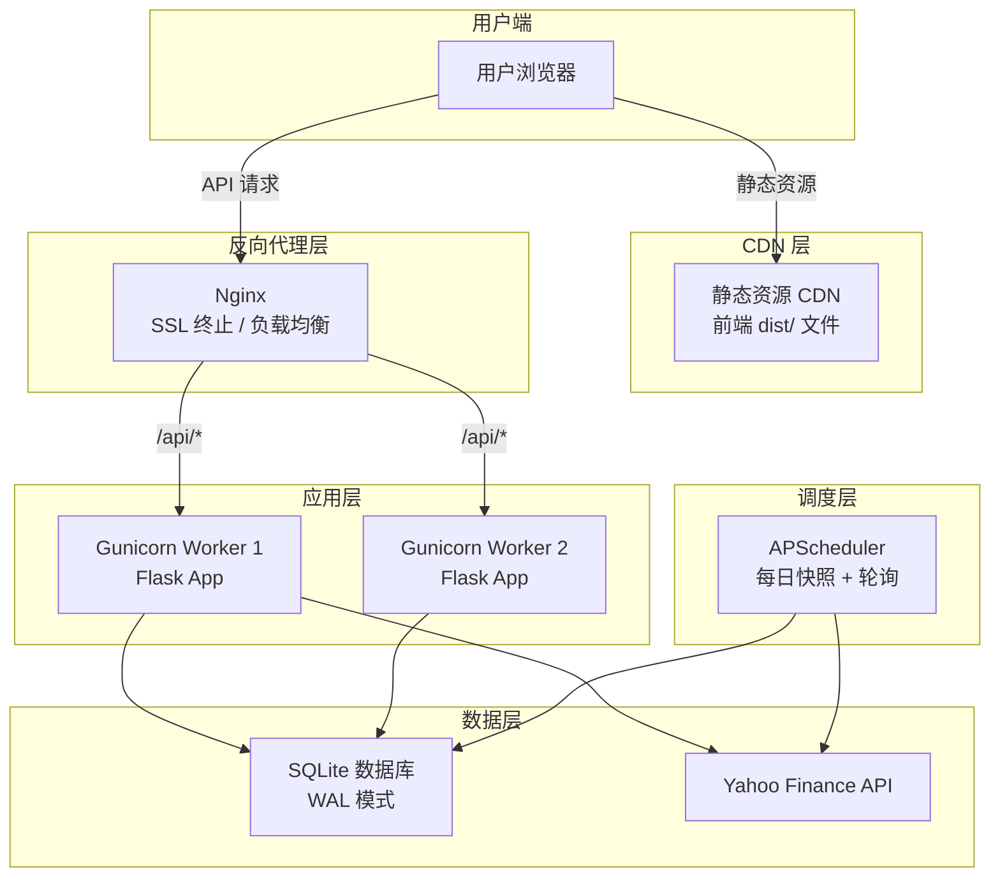
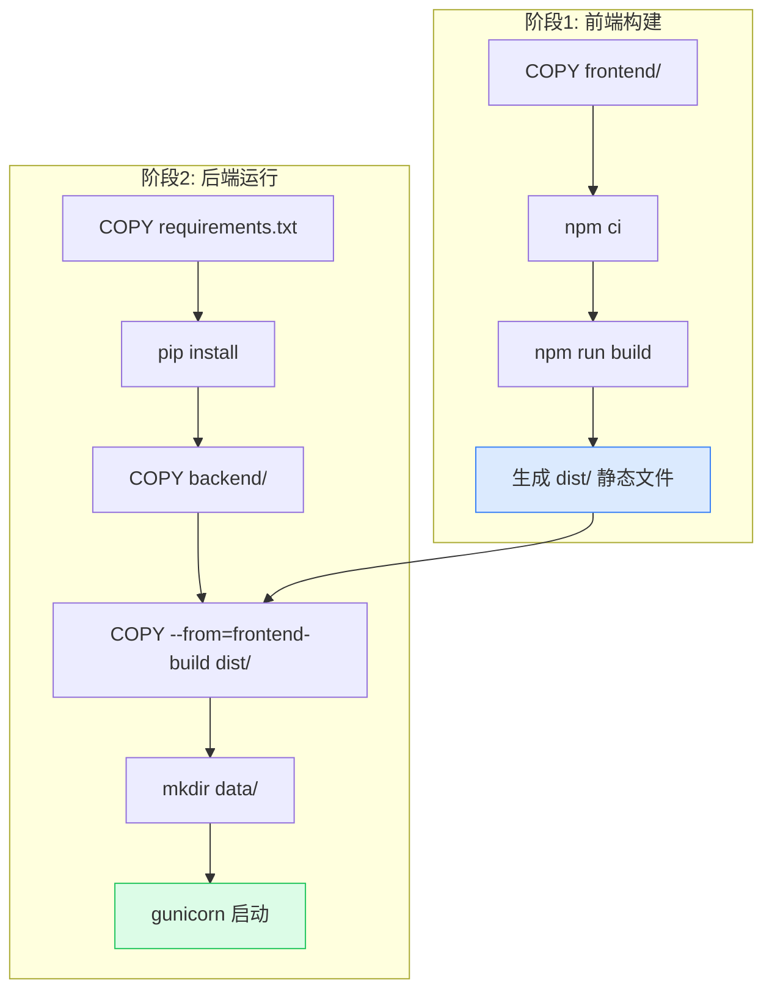

# 部署指南

本指南涵盖 OptionDash 从开发环境到生产环境的多种部署方案。

## 生产部署架构



## 开发环境部署

最简单的本地启动方式：

```bash
# 终端 1 — 后端
cd backend && python app.py
# 监听 http://localhost:5001

# 终端 2 — 前端
cd frontend && npm run dev
# 监听 http://localhost:5173
```

## 方案一：Nginx 反向代理 + Gunicorn

适合中小规模部署，使用 Nginx 同时提供前端静态资源和后端 API 代理。

### 构建前端

```bash
cd frontend
npm run build
# 产物输出到 frontend/dist/
```

### 完整 Nginx 配置

```nginx
# /etc/nginx/sites-available/optiondash

# 上游后端服务
upstream optiondash_backend {
    server 127.0.0.1:5001;
    # 如需多 worker 可添加更多 server
    # server 127.0.0.1:5002;
}

server {
    listen 80;
    server_name optiondash.example.com;

    # HTTP -> HTTPS 重定向
    return 301 https://$server_name$request_uri;
}

server {
    listen 443 ssl http2;
    server_name optiondash.example.com;

    # SSL 证书配置
    ssl_certificate /etc/letsencrypt/live/optiondash.example.com/fullchain.pem;
    ssl_certificate_key /etc/letsencrypt/live/optiondash.example.com/privkey.pem;
    ssl_protocols TLSv1.2 TLSv1.3;
    ssl_ciphers HIGH:!aNULL:!MD5;

    # Gzip 压缩
    gzip on;
    gzip_types application/json text/css application/javascript;
    gzip_min_length 1000;

    # 前端静态资源
    location / {
        root /opt/optiondash/frontend/dist;
        try_files $uri $uri/ /index.html;

        # 静态资源缓存
        expires 1h;
        add_header Cache-Control "public, immutable";

        # 资源文件（JS/CSS/图片）长期缓存
        location ~* \.(js|css|png|jpg|jpeg|gif|ico|svg|woff2?)$ {
            expires 30d;
            add_header Cache-Control "public, immutable";
        }
    }

    # API 反向代理
    location /api/ {
        proxy_pass http://optiondash_backend;
        proxy_set_header Host $host;
        proxy_set_header X-Real-IP $remote_addr;
        proxy_set_header X-Forwarded-For $proxy_add_x_forwarded_for;
        proxy_set_header X-Forwarded-Proto $scheme;

        # 超时设置（yfinance 响应可能较慢）
        proxy_connect_timeout 30s;
        proxy_read_timeout 120s;
        proxy_send_timeout 30s;

        # 禁用缓冲（如需要 SSE）
        proxy_buffering off;
    }

    # 健康检查（可选，供监控使用）
    location /api/health {
        proxy_pass http://optiondash_backend;
        access_log off;
    }
}
```

### 启动后端（Gunicorn）

```bash
pip install gunicorn

# 基本启动
gunicorn -w 2 -b 127.0.0.1:5001 "app:create_app()"

# 生产推荐配置
gunicorn \
  -w 2 \
  -b 127.0.0.1:5001 \
  --timeout 120 \
  --access-logfile /var/log/optiondash/access.log \
  --error-logfile /var/log/optiondash/error.log \
  --log-level info \
  "app:create_app()"
```

## 方案二：Docker 部署

### Docker 构建流程



适用于容器化部署，支持一键启动。

### 多阶段 Dockerfile

```dockerfile
# === 前端构建阶段 ===
FROM node:20-slim AS frontend-build
WORKDIR /app/frontend
COPY frontend/package*.json ./
RUN npm ci
COPY frontend/ ./
RUN npm run build

# === 后端运行阶段 ===
FROM python:3.12-slim
WORKDIR /app

# 安装 Python 依赖
COPY backend/requirements.txt ./
RUN pip install --no-cache-dir -r requirements.txt gunicorn

# 复制后端代码
COPY backend/ ./backend/

# 复制前端构建产物
COPY --from=frontend-build /app/frontend/dist ./static

# 创建数据目录
RUN mkdir -p /app/backend/data

# 环境变量
ENV FLASK_HOST=0.0.0.0
ENV FLASK_PORT=5001
ENV CORS_ORIGINS="*"
ENV OPTIONDASH_DB=/app/backend/data/optiondash.db

EXPOSE 5001

WORKDIR /app/backend
CMD ["gunicorn", "-w", "2", "-b", "0.0.0.0:5001", "--timeout", "120", "app:create_app()"]
```

### docker-compose.yml

```yaml
version: '3.8'

services:
  optiondash:
    build:
      context: .
      dockerfile: Dockerfile
    container_name: optiondash
    ports:
      - "5001:5001"
    volumes:
      - optiondash-data:/app/backend/data
    environment:
      - FLASK_DEBUG=false
      - CORS_ORIGINS=https://optiondash.example.com
      - OPTIONDASH_DB=/app/backend/data/optiondash.db
      - SUPPORTED_TICKERS=SPY,QQQ,IWM,TLT,XLF
      - RATE_LIMIT_RPS=1.5
      - POLL_INTERVAL_SEC=300
      - CACHE_TTL=300
      - LIVE_CACHE_TTL_SEC=600
    restart: unless-stopped
    healthcheck:
      test: ["CMD", "curl", "-f", "http://localhost:5001/api/health"]
      interval: 30s
      timeout: 10s
      retries: 3
      start_period: 10s

volumes:
  optiondash-data:
    driver: local
```

### 构建与运行

```bash
# 构建镜像
docker build -t optiondash .

# 使用 docker-compose 启动
docker-compose up -d

# 查看日志
docker-compose logs -f optiondash

# 停止服务
docker-compose down
```

## 方案三：分离部署

将前端和后端分别部署到不同平台：

| 层 | 推荐平台 | 说明 |
|---|---------|------|
| 前端 | Vercel / Netlify / Cloudflare Pages | 静态站点，全球 CDN 加速 |
| 后端 | Railway / Fly.io / VPS | Python 运行时，支持定时任务 |

**前端部署注意：**

- 构建命令：`npm run build`
- 输出目录：`dist`
- 环境变量：设置 `VITE_API_BASE_URL` 指向后端 API 地址

**后端部署注意：**

- 确保平台支持长运行进程（非 Serverless 函数）
- 设置 `FLASK_DEBUG=false` 关闭调试模式
- 如需定时任务，确认平台不会在空闲时休眠容器

## 环境变量配置

### 生产环境必须设置的变量

```bash
# 关闭调试模式
export FLASK_DEBUG=false

# 设置 CORS 允许的域名
export CORS_ORIGINS="https://optiondash.example.com"

# 持久化数据库路径
export OPTIONDASH_DB="/data/optiondash.db"
```

### 可选的生产优化变量

```bash
# 降低 yfinance 请求频率以避免限流
export RATE_LIMIT_RPS=1.0
export POLL_INTERVAL_SEC=600

# 调整缓存策略
export CACHE_TTL=600
export LIVE_CACHE_TTL_SEC=1200
```

## 数据库管理

### 备份

```bash
# 手动备份
cp backend/data/optiondash.db backup/optiondash_$(date +%Y%m%d).db

# 定时备份（添加到 crontab）
# 每天凌晨 2 点自动备份
0 2 * * * cp /data/optiondash.db /backup/optiondash_$(date +\%Y\%m\%d).db
```

### 恢复

```bash
# 停止后端服务
systemctl stop optiondash

# 替换数据库文件
cp backup/optiondash_20240101.db backend/data/optiondash.db

# 重启服务
systemctl start optiondash
```

## 监控

### 健康检查

```bash
curl http://localhost:5001/api/health
# 返回: { "status": "ok", "service": "optiondash-api", "timestamp": "..." }
```

建议在部署平台上配置健康检查端点 `/api/health`，检查间隔 30 秒。

### 日志格式

后端日志格式（定义在 `backend/app.py` 第 40-43 行）：

```
2026-06-07 10:30:00 [INFO] api.dashboard: Fetched SPY dashboard in 0.45s
2026-06-07 10:30:05 [WARNING] services.market_data: yfinance rate limited, retrying
2026-06-07 10:30:10 [ERROR] services.greeks_engine: NaN encountered in delta calc
```

生产环境建议将日志输出到文件并配合日志采集工具（如 Loki、ELK）。

### 资源占用

| 资源 | 预估值 |
|------|--------|
| 内存 | ~200MB（含缓存） |
| CPU | 空闲时接近 0%，计算时峰值 ~1 核 |
| 磁盘 | 数据库文件 ~50MB（7 天数据） |
| 网络 | 仅出站请求到 Yahoo Finance，带宽极低 |

## 性能优化

- **Gzip 压缩**：Nginx 配置 `gzip on;` 压缩 JSON 和静态资源
- **CDN 加速**：将前端静态资源托管到 CDN，减轻服务器负担
- **缓存预热**：利用 `scheduler/poller.py` 在开盘前预热缓存，避免首次请求延迟
- **数据库连接池**：SQLite 使用 WAL 模式（`backend/database/connection.py` 第 46 行）优化并发读写
- **Gunicorn workers**：建议设置为 `CPU核心数 * 2 + 1`，但 OptionDash 为 I/O 密集型，2 个 worker 通常足够
- **静态资源缓存**：前端构建产物（JS/CSS）带有 hash 后缀，可设置长期缓存（30 天）
