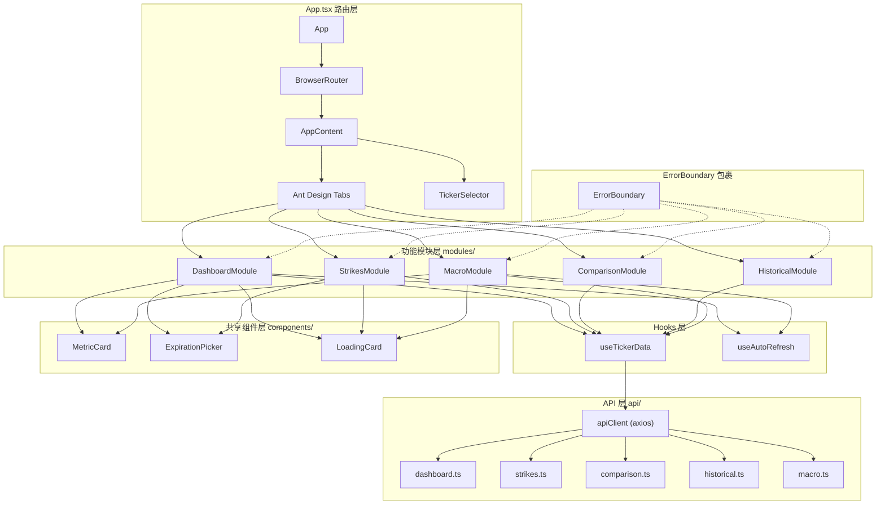
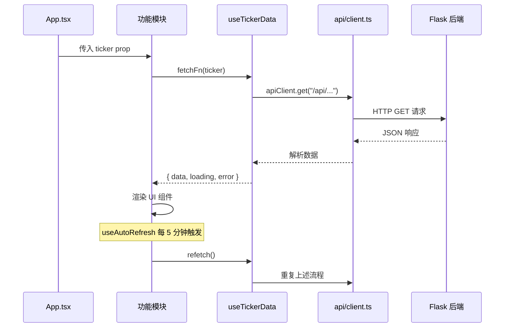
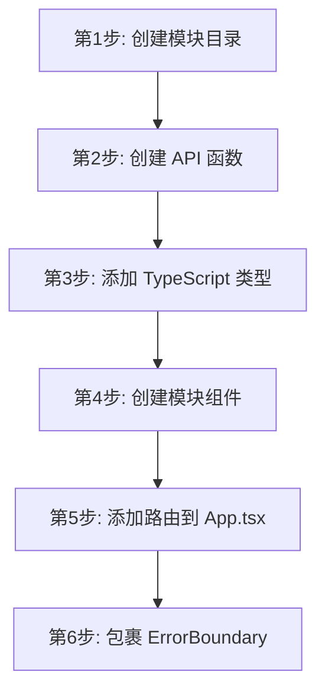

# 前端开发

本指南面向需要修改或扩展 OptionDash 前端的开发者。

## 项目结构

```
frontend/src/
├── main.tsx            # React 应用入口
├── App.tsx             # 主应用组件（路由 + 标签导航）
├── index.css           # 全局样式
├── api/                # API 调用层
│   ├── client.ts       #   Axios 实例与拦截器
│   ├── dashboard.ts    #   仪表盘接口
│   ├── strikes.ts      #   行权价接口
│   ├── comparison.ts   #   对比接口
│   ├── historical.ts   #   历史数据接口
│   ├── macro.ts        #   宏观指标接口
│   └── health.ts       #   健康检查接口
├── components/         # 可复用 UI 组件
│   ├── Layout.tsx      #   页面布局
│   ├── MetricCard.tsx  #   指标卡片
│   ├── TickerSelector.tsx  # 标的选择器
│   ├── ExpirationPicker.tsx # 到期日选择器
│   ├── LoadingCard.tsx #   加载态骨架屏
│   └── ErrorBoundary.tsx  # 错误边界
├── modules/            # 功能模块（按业务划分）
│   ├── dashboard/      #   仪表盘模块
│   ├── strikes/        #   行权价分析模块
│   ├── comparison/     #   多标的对比模块
│   ├── historical/     #   历史数据模块
│   └── macro/          #   宏观指标模块
├── hooks/              # 自定义 React Hooks
│   ├── useTickerData.ts    # 标的数据获取
│   └── useAutoRefresh.ts   # 自动刷新
├── types/              # TypeScript 类型定义
│   └── index.ts        #   所有后端响应类型
└── utils/              # 工具函数
    ├── format.ts       #   数值格式化
    └── constants.ts    #   常量定义
```

## 前端组件组合模式



## 数据流架构



## 添加新的功能模块

以添加"波动率曲面（Volatility Surface）"模块为例：

### 流程图



### 第一步：创建模块目录

```
frontend/src/modules/vol-surface/
└── index.tsx           # 模块主组件
```

### 第二步：创建 API 函数

```typescript
// api/volSurface.ts
import apiClient from './client';

export interface VolSurfacePoint {
  strike: number;
  expiry: string;
  iv: number;
}

export async function fetchVolSurface(ticker: string): Promise<VolSurfacePoint[]> {
  const { data } = await apiClient.get('/vol-surface', { params: { ticker } });
  return data.data;
}
```

### 第三步：添加 TypeScript 类型

在 `types/index.ts` 中补充后端响应的类型定义，保持与后端 API 的字段完全对应。

### 第四步：创建模块组件

```tsx
// modules/vol-surface/index.tsx
import React, { useCallback } from 'react';
import ReactECharts from 'echarts-for-react';
import { useTickerData } from '../../hooks/useTickerData';
import { fetchVolSurface } from '../../api/volSurface';
import LoadingCard from '../../components/LoadingCard';

interface Props {
  ticker?: string;
}

const VolSurfaceModule: React.FC<Props> = ({ ticker = 'SPY' }) => {
  const fetchFn = useCallback(() => fetchVolSurface(ticker), [ticker]);
  const { data, loading, error } = useTickerData(fetchFn);

  if (error) {
    return <div className="text-red-500 p-4">Error: {error}</div>;
  }

  if (loading) {
    return <LoadingCard title="Loading Volatility Surface..." height={400} />;
  }

  const option = {
    // ECharts 配置...
  };

  return <ReactECharts option={option} style={{ height: 400 }} />;
};

export default VolSurfaceModule;
```

### 第五步：添加路由

在 `App.tsx` 中引入新模块并添加到标签列表：

```tsx
// App.tsx
import VolSurface from './modules/vol-surface';

const tabItems = [
  // ... 现有标签 ...
  {
    key: 'vol-surface',
    label: <span><LineChartOutlined /> Vol Surface</span>,
    children: (
      <ErrorBoundary fallbackTitle="Volatility surface module error">
        <VolSurface ticker={ticker} />
      </ErrorBoundary>
    ),
  },
];
```

### 第六步：更新路由映射

在 `App.tsx` 的 `ROUTE_TABS` 和 `TAB_ROUTES` 中添加映射：

```tsx
// App.tsx (第 24-38 行)
const ROUTE_TABS: Record<string, string> = {
  '/dashboard': 'dashboard',
  '/strikes': 'strikes',
  '/comparison': 'comparison',
  '/historical': 'historical',
  '/macro': 'macro',
  '/vol-surface': 'vol-surface',  // 新增
};

const TAB_ROUTES: Record<string, string> = {
  dashboard: '/dashboard',
  strikes: '/strikes',
  comparison: '/comparison',
  historical: '/historical',
  macro: 'macro',
  'vol-surface': '/vol-surface',  // 新增
};
```

## 添加新的图表

项目使用 [ECharts](https://echarts.apache.org/) 作为图表库，配合 `echarts-for-react` 组件。

### ECharts 配置模式

```tsx
import ReactECharts from 'echarts-for-react';
import { COLORS } from '../../utils/constants';

// 典型的 ECharts 配置结构
const option = {
  // 1. 提示框
  tooltip: {
    trigger: 'axis',
    formatter: (params: any) => {
      // 自定义提示内容
    },
  },

  // 2. 图例
  legend: {
    data: ['Series 1', 'Series 2'],
    top: 0,
  },

  // 3. 网格布局
  grid: {
    top: 40, right: 20, bottom: 50, left: 60,
  },

  // 4. X 轴
  xAxis: {
    type: 'category',
    data: dates,
    axisLabel: {
      formatter: (v: string) => `$${Number(v).toFixed(0)}`,
      rotate: 45,
    },
  },

  // 5. Y 轴（支持双轴）
  yAxis: [
    { type: 'value', name: 'Left Axis' },
    { type: 'value', name: 'Right Axis' },
  ],

  // 6. 系列数据
  series: [
    {
      name: 'Series 1',
      type: 'line',        // line / bar / scatter
      data: data1,
      smooth: true,         // 平滑曲线
      yAxisIndex: 0,        // 绑定左轴
      lineStyle: { color: COLORS.blue, width: 2 },
      itemStyle: { color: COLORS.blue },
    },
    {
      name: 'Series 2',
      type: 'bar',
      data: data2,
      yAxisIndex: 1,        // 绑定右轴
      itemStyle: {
        color: (params: any) =>
          params.value >= 0 ? COLORS.green : COLORS.red,
      },
    },
  ],

  // 7. 标记线
  markLine: {
    silent: true,
    symbol: 'none',
    data: [
      {
        yAxis: 0,
        lineStyle: { color: COLORS.gray, type: 'dashed' },
        label: { formatter: 'Zero Line' },
      },
    ],
  },
};

// 渲染组件
<ReactECharts option={option} style={{ height: 400 }} />
```

### 常量定义

**源码位置：** `frontend/src/utils/constants.ts`

```typescript
// frontend/src/utils/constants.ts (第 16-26 行)
export const COLORS = {
  green: '#22c55e',
  red: '#ef4444',
  blue: '#3b82f6',
  orange: '#f97316',
  purple: '#a855f7',
  gray: '#6b7280',
  greenLight: 'rgba(34, 197, 94, 0.2)',
  redLight: 'rgba(239, 68, 68, 0.2)',
  blueLight: 'rgba(59, 130, 246, 0.2)',
} as const;
```

## 自定义 Hooks

### useTickerData

**源码位置：** `frontend/src/hooks/useTickerData.ts` 第 30-63 行

通用数据获取 Hook，封装了 loading/error/data 状态管理：

```typescript
export function useTickerData<T>(fetchFn: () => Promise<T>) {
  const [data, setData] = useState<T | null>(null);
  const [loading, setLoading] = useState(true);
  const [error, setError] = useState<string | null>(null);

  const refetch = useCallback(async () => {
    setLoading(true);
    setError(null);
    try {
      const result = await fetchFn();
      setData(result);
    } catch (err: unknown) {
      setError(err instanceof Error ? err.message : 'Failed to fetch data');
    } finally {
      setLoading(false);
    }
  }, [fetchFn]);

  useEffect(() => { refetch(); }, [refetch]);

  return { data, loading, error, refetch };
}
```

### useAutoRefresh

**源码位置：** `frontend/src/hooks/useTickerData.ts` 第 8-26 行

自动刷新 Hook，每 5 分钟触发一次数据重新获取：

```typescript
export function useAutoRefresh(
  callback: () => void,
  interval: number = AUTO_REFRESH_INTERVAL,  // 5 * 60 * 1000
  enabled = true
) {
  const savedCallback = useRef(callback);

  useEffect(() => {
    savedCallback.current = callback;
  }, [callback]);

  useEffect(() => {
    if (!enabled) return;
    const tick = () => savedCallback.current();
    const id = setInterval(tick, interval);
    return () => clearInterval(id);
  }, [interval, enabled]);
}
```

## 样式指南

### CSS 优先级

1. **Tailwind CSS 工具类** — 用于间距、排版、布局等快速样式
2. **Ant Design 组件** — 用于表单、选择器、表格等标准 UI
3. **全局样式 `index.css`** — 用于全局主题变量、动画等

### 常用 Tailwind 类名

| 用途 | 类名示例 |
|------|----------|
| 网格布局 | `grid grid-cols-1 md:grid-cols-2 lg:grid-cols-4 gap-4` |
| 卡片样式 | `bg-white rounded-lg p-4 shadow-sm` |
| 错误提示 | `text-red-500 p-4 bg-red-50 rounded` |
| 加载状态 | `text-gray-400 text-center py-8` |
| 标签颜色 | `text-green-600` / `text-red-500` / `text-blue-600` |

## 代码规范

- 组件使用函数式组件 + Hooks，不使用 class 组件（ErrorBoundary 除外）
- Props 接口以 `interface` 声明，放在组件定义之前
- 使用 `React.memo` 优化频繁渲染的列表项组件
- 避免在渲染函数中创建新对象或数组（会导致不必要的 re-render）
- 使用 `useCallback` 包裹传递给子组件的回调函数
- 使用 `useMemo` 缓存计算密集的派生数据
- 提交前运行 `npx tsc --noEmit` 确保类型检查通过
