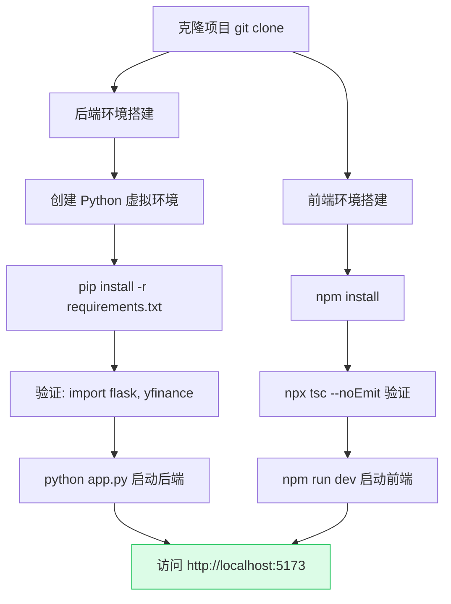
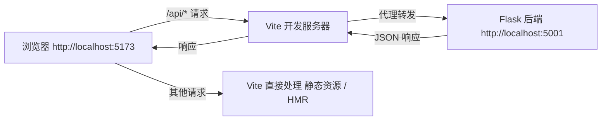

# 开发环境搭建

本指南帮助你从零搭建 OptionDash 的本地开发环境。OptionDash 是一个前后端分离的全栈应用，后端使用 Python Flask，前端使用 React + TypeScript + Vite。

## 开发环境搭建流程



## 前置要求

| 工具 | 最低版本 | 推荐版本 | 说明 |
|------|---------|---------|------|
| Python | 3.12+ | 3.12 | 后端运行时 |
| Node.js | 20+ | 20 LTS | 前端构建工具链 |
| npm | 10+ | 随 Node.js 安装 | 前端包管理器 |
| Git | 2.0+ | 最新稳定版 | 版本控制 |

## 克隆项目

```bash
git clone <repo-url>
cd optiondash
```

## 后端开发环境

### 创建虚拟环境并安装依赖

```bash
cd backend

# 创建虚拟环境
python -m venv venv

# 激活虚拟环境
source venv/bin/activate        # macOS / Linux
# venv\Scripts\activate         # Windows (PowerShell)

# 安装依赖
pip install -r requirements.txt
```

验证安装：

```bash
python -c "import flask; import yfinance; print('OK')"
```

### 后端依赖清单

**源码位置：** `backend/requirements.txt`

```text
flask>=3.1,<4
flask-cors>=5,<6
yfinance>=0.2,<1
py_vollib_vectorized>=0.1,<1
numpy>=1,<3
pandas>=2,<3
scipy>=1,<2
apscheduler>=3,<4
cachetools>=5,<6
```

| 包名 | 版本约束 | 用途 |
|------|---------|------|
| `flask` | `>=3.1,<4` | Web 框架，提供路由、请求/响应处理 |
| `flask-cors` | `>=5,<6` | 跨域资源共享支持，允许前端跨域请求 |
| `yfinance` | `>=0.2,<1` | Yahoo Finance 期权与行情数据获取 |
| `py_vollib_vectorized` | `>=0.1,<1` | 向量化的 Black-Scholes Greeks 计算引擎 |
| `numpy` | `>=1,<3` | 数值计算基础库，用于矩阵运算 |
| `pandas` | `>=2,<3` | 结构化数据处理，期权链以 DataFrame 形式存储 |
| `scipy` | `>=1,<2` | 科学计算，用于插值和优化算法 |
| `apscheduler` | `>=3,<4` | 后台任务调度，管理每日快照和轮询任务 |
| `cachetools` | `>=5,<6` | TTL 缓存实现，避免频繁调用 yfinance |

## 前端开发环境

### 安装依赖

```bash
cd frontend

# 安装依赖
npm install
```

验证安装：

```bash
npx tsc --noEmit   # 类型检查应无报错
```

### 前端依赖清单

**源码位置：** `frontend/package.json`

#### 生产依赖

| 包名 | 版本 | 用途 |
|------|------|------|
| `react` | `^19.2.5` | UI 框架 |
| `react-dom` | `^19.2.5` | React DOM 渲染 |
| `react-router-dom` | `^7.14.2` | 客户端路由 |
| `antd` | `^6.3.6` | Ant Design UI 组件库（Select、Table、Tag、Alert 等） |
| `axios` | `^1.15.2` | HTTP 客户端，用于 API 调用 |
| `echarts` | `^6.0.0` | Apache ECharts 图表库 |
| `echarts-for-react` | `^3.0.6` | ECharts 的 React 封装组件 |
| `dayjs` | `^1.11.20` | 日期处理库 |

#### 开发依赖

| 包名 | 版本 | 用途 |
|------|------|------|
| `vite` | `^8.0.10` | 前端构建工具，开发服务器 |
| `@vitejs/plugin-react` | `^6.0.1` | Vite 的 React 插件 |
| `typescript` | `~6.0.2` | TypeScript 编译器 |
| `tailwindcss` | `^4.2.4` | 原子化 CSS 框架 |
| `@tailwindcss/postcss` | `^4.2.4` | Tailwind CSS 的 PostCSS 插件 |
| `postcss` | `^8.5.11` | CSS 后处理器 |
| `autoprefixer` | `^10.5.0` | CSS 浏览器前缀自动补全 |
| `eslint` | `^10.2.1` | JavaScript/TypeScript 代码规范检查 |
| `eslint-plugin-react-hooks` | `^7.1.1` | React Hooks 规范检查 |
| `eslint-plugin-react-refresh` | `^0.5.2` | React 热更新规范检查 |
| `@types/react` | `^19.2.14` | React 类型定义 |
| `@types/react-dom` | `^19.2.3` | React DOM 类型定义 |
| `@types/node` | `^24.12.2` | Node.js 类型定义 |

## Vite 开发服务器配置

**源码位置：** `frontend/vite.config.ts`

```typescript
// frontend/vite.config.ts (第 1-16 行)
import { defineConfig } from 'vite'
import react from '@vitejs/plugin-react'

export default defineConfig({
  plugins: [react()],
  server: {
    port: 5173,
    proxy: {
      '/api': {
        target: 'http://localhost:5001',
        changeOrigin: true,
      },
    },
  },
})
```

**代理配置说明：**



| 配置项 | 值 | 说明 |
|--------|-----|------|
| `server.port` | `5173` | 前端开发服务器端口 |
| `proxy['/api']` | `http://localhost:5001` | 将 `/api` 开头的请求代理到后端 |
| `changeOrigin` | `true` | 修改请求头中的 `Origin` 为目标地址 |

这意味着在开发环境中，前端代码中的 `fetch('/api/dashboard/summary')` 实际上会被 Vite 代理到 `http://localhost:5001/api/dashboard/summary`，无需配置 CORS。

## 启动开发服务

需要同时运行后端和前端，在两个终端中分别执行：

```bash
# Terminal 1 — 后端 (默认 http://localhost:5001)
cd backend && python app.py

# Terminal 2 — 前端 (默认 http://localhost:5173)
cd frontend && npm run dev
```

启动后访问 `http://localhost:5173` 即可看到前端界面。

## 环境变量

所有环境变量均可通过系统环境变量设置。以下是完整列表：

**源码位置：** `backend/config.py`

| 变量名 | 默认值 | 说明 |
|--------|--------|------|
| `OPTIONDASH_DB` | `backend/data/optiondash.db` | SQLite 数据库文件路径 |
| `SUPPORTED_TICKERS` | `SPY,QQQ,IWM,TLT,XLF` | 支持的标的列表（逗号分隔） |
| `CACHE_TTL` | `300` | 内存缓存 TTL（秒） |
| `CACHE_MAX_SIZE` | `128` | 内存缓存最大条目数 |
| `RATE_LIMIT_RPS` | `2.0` | yfinance 请求速率限制（次/秒） |
| `RISK_FREE_RATE` | `0.0525` | 无风险利率（年化，用于 Black-Scholes） |
| `FLASK_DEBUG` | `false` | 是否启用 Flask 调试模式 |
| `FLASK_HOST` | `0.0.0.0` | Flask 监听地址 |
| `FLASK_PORT` | `5001` | Flask 监听端口 |
| `CORS_ORIGINS` | `http://localhost:5173` | CORS 允许的来源（逗号分隔） |
| `SNAPSHOT_HOUR` | `16` | 每日快照小时（美东时间） |
| `SNAPSHOT_MINUTE` | `30` | 每日快照分钟 |
| `POLL_INTERVAL_SEC` | `300` | 后台轮询间隔（秒） |
| `LIVE_CACHE_TTL_SEC` | `600` | 实时缓存有效期（秒） |
| `LIVE_CACHE_RETENTION_DAYS` | `7` | 实时缓存保留天数 |

## IDE 配置

### VS Code 推荐扩展

| 扩展 | 用途 |
|------|------|
| Python (ms-python) | Python 语言支持 |
| Pylance | Python 类型检查与智能提示 |
| ESLint | JavaScript / TypeScript 代码规范 |
| Prettier | 代码格式化 |
| Tailwind CSS IntelliSense | Tailwind 类名提示 |
| ES7+ React Snippets | React 代码片段 |

### Python 代码规范

项目推荐使用 `ruff` 进行 lint 和格式化：

```bash
pip install ruff
ruff check backend/
ruff format backend/
```

### TypeScript 严格模式

前端 `tsconfig.json` 已启用 `strict: true`，确保所有类型检查通过后再提交代码：

```bash
cd frontend && npx tsc --noEmit
```

## 常见问题

### 端口 5001 已被占用

```bash
# 查找占用端口的进程
lsof -i :5001          # macOS / Linux
netstat -ano | findstr :5001  # Windows

# 终止进程或更改端口
export FLASK_PORT=5002
```

### yfinance 请求频率限制

Yahoo Finance 对请求频率有隐式限制。如果遇到 `Too Many Requests` 错误：

- 增大 `RATE_LIMIT_RPS` 的值（降低并发）或 `POLL_INTERVAL_SEC`（增大轮询间隔）
- 开发时尽量复用缓存数据，避免频繁重启后端

### SQLite 数据库锁定

SQLite 在并发写入时可能出现 `database is locked` 错误：

- 确保没有多个后端进程同时运行
- 如果数据库文件损坏，可删除 `backend/data/optiondash.db` 重新生成
- 项目使用 WAL 模式（`backend/database/connection.py` 第 46 行）优化并发读写
