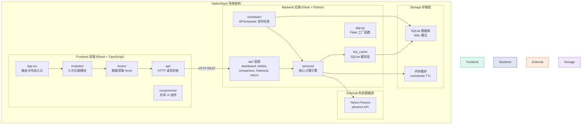
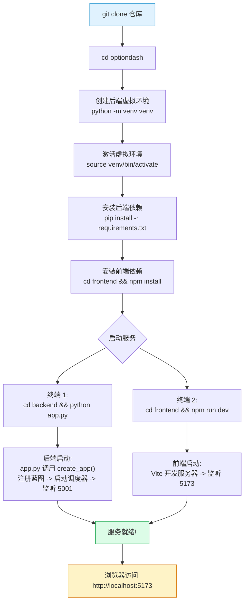
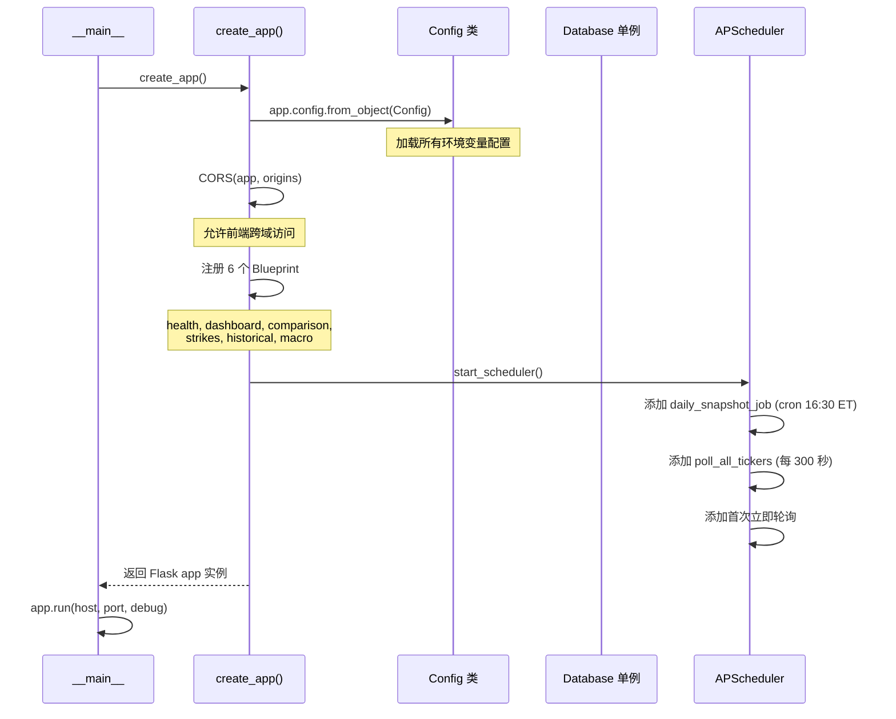
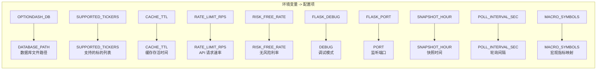
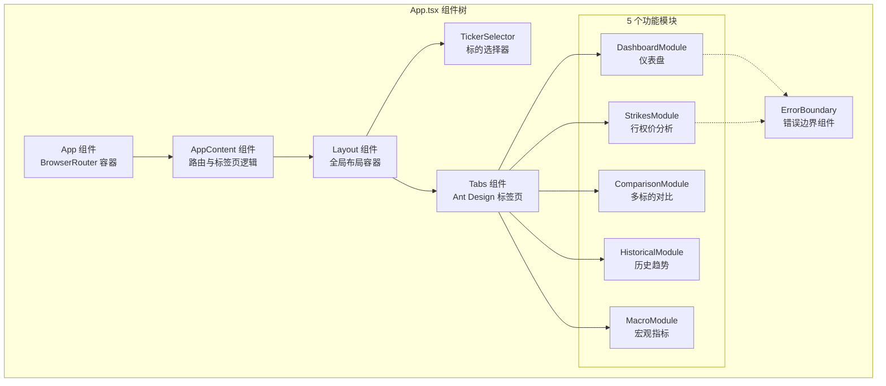
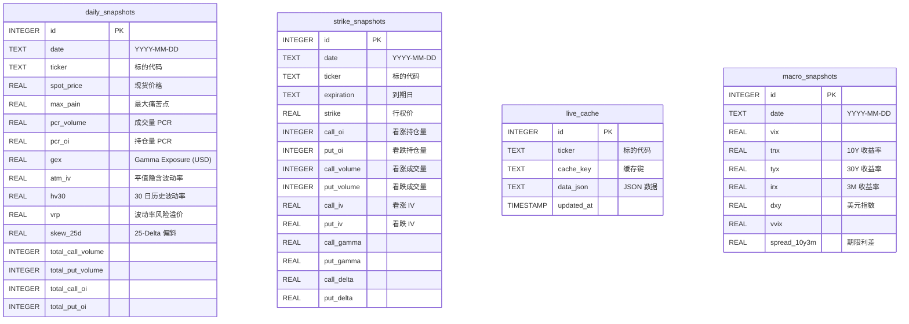
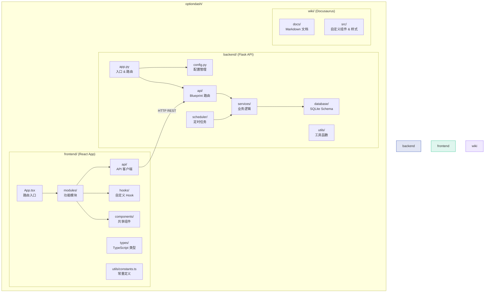

# 快速开始

欢迎使用 OptionDash！本文档将帮助你在几分钟内完成安装和启动，开始分析期权市场数据。本文档不仅涵盖安装步骤，还会深入讲解每个关键文件的源码实现，帮助你理解系统的运作原理。

## 简介

**OptionDash** 是一个开源的期权链分析与市场情绪监控平台。它通过实时获取和分析期权市场数据，帮助交易者做出更明智的投资决策。

### OptionDash 能做什么？

- **持仓量 (OI) 分析**：识别市场主要持仓分布，发现支撑/阻力位
- **成交量 (Volume) 分析**：追踪大额期权交易，捕捉聪明钱动向
- **隐含波动率 (IV) 监控**：实时追踪 IV 变化，评估期权定价合理性
- **Greeks 指标分析**：通过 Delta、Gamma、Theta、Vega 理解期权风险敞口
- **GEX 分析**：Gamma Exposure 揭示市场做市商对冲行为
- **最大痛苦点 (Max Pain)**：预测期权到期时价格可能趋向的位置
- **看跌/看涨比 (PCR)**：衡量市场整体情绪的看跌或看涨倾向
- **宏观经济指标**：追踪 VIX、美债收益率、美元指数等宏观数据

### 技术栈

| 层级 | 技术 | 版本 | 说明 |
|------|------|------|------|
| 前端框架 | React | 19.2.5 | UI 组件库 |
| 前端语言 | TypeScript | 6.0.2 | 类型安全的 JavaScript |
| 前端构建 | Vite | 8.0.10 | 快速开发服务器和构建工具 |
| 前端 UI 库 | Ant Design | 6.3.6 | 企业级 UI 组件库 |
| 图表库 | ECharts | 6.0.0 | 数据可视化图表库 |
| CSS 框架 | Tailwind CSS | 4.2.4 | 原子化 CSS 框架 |
| 后端框架 | Flask | 3.1 | 轻量级 Python Web 框架 |
| 数据库 | SQLite | 内置 | 嵌入式数据库（WAL 模式） |
| 数据源 | Yahoo Finance | yfinance 0.2 | 通过 yfinance 库获取期权数据 |
| 调度器 | APScheduler | 3.x | 后台定时任务调度 |

---

## 系统要求

在开始之前，请确保你的系统满足以下要求：

| 依赖 | 最低版本 | 推荐版本 |
|------|---------|---------|
| Python | 3.12+ | 3.12 |
| Node.js | 20+ | 20 LTS |
| npm | 10+ | 10+ |

### 操作系统

OptionDash 支持以下操作系统：

- **macOS** — 原生支持
- **Linux** — 原生支持（Ubuntu 22.04+、Debian 12+、Fedora 38+ 等）
- **Windows** — 推荐使用 WSL2（Windows Subsystem for Linux）

:::tip
如果你使用 Windows，强烈建议先安装 WSL2 和 Ubuntu 发行版，可以避免大多数兼容性问题。
:::

---

## 项目架构总览

在开始安装之前，先了解整个项目的架构和数据流向，这将帮助你理解后续每个步骤的意义。



---

## 安装步骤

### 克隆仓库

首先，将项目代码克隆到本地：

```bash
git clone https://github.com/your-username/optiondash.git
cd optiondash
```

### 后端安装

后端使用 Python 构建，推荐使用虚拟环境来隔离依赖。

**第一步：创建并激活虚拟环境**

```bash
cd backend
python -m venv venv
```

激活虚拟环境：

```bash
# macOS / Linux
source venv/bin/activate

# Windows (PowerShell)
venv\Scripts\Activate.ps1

# Windows (CMD)
venv\Scripts\activate
```

激活成功后，终端提示符前会显示 `(venv)` 标识。

**第二步：安装 Python 依赖**

```bash
pip install -r requirements.txt
```

`requirements.txt` 文件（位于 `backend/requirements.txt`）定义了所有必需的 Python 包：

```python
# backend/requirements.txt
flask>=3.1,<4              # Web 框架
flask-cors>=5,<6           # 跨域资源共享
yfinance>=0.2,<1           # Yahoo Finance 数据获取
py_vollib_vectorized>=0.1,<1  # 期权 Greeks 向量化计算
numpy>=1,<3                # 数值计算
pandas>=2,<3               # 数据处理
scipy>=1,<2                # 科学计算（用于插值）
apscheduler>=3,<4          # 后台任务调度
cachetools>=5,<6           # 内存 TTL 缓存
```

每个依赖的作用：

| 包名 | 用途 | 在项目中的使用场景 |
|------|------|-------------------|
| `flask` | Web 框架 | 提供 REST API 服务 |
| `flask-cors` | CORS 中间件 | 允许前端跨域请求后端 API |
| `yfinance` | 金融数据 | 获取期权链、股票价格、宏观指标 |
| `py_vollib_vectorized` | Greeks 计算 | 批量计算 Delta、Gamma、Theta、Vega |
| `numpy` | 数值计算 | Max Pain 求和、GEX 聚合等 |
| `pandas` | 数据处理 | 期权链 DataFrame 操作 |
| `scipy` | 插值函数 | 25-Delta Skew 的 IV 插值 |
| `apscheduler` | 任务调度 | 每日快照采集、定期轮询 |
| `cachetools` | TTL 缓存 | yfinance 数据的内存缓存 |

:::info
如果 `pip install` 速度较慢，可以使用国内镜像源：

```bash
pip install -r requirements.txt -i https://pypi.tuna.tsinghua.edu.cn/simple
```
:::

### 前端安装

前端使用 React + TypeScript 构建，需要安装 npm 依赖。

```bash
cd frontend
npm install
```

`package.json` 文件（位于 `frontend/package.json`）定义了前端依赖：

```json
// frontend/package.json (关键依赖)
{
  "dependencies": {
    "react": "^19.2.5",           // React 框架
    "react-dom": "^19.2.5",       // React DOM 渲染
    "react-router-dom": "^7.14.2", // 客户端路由
    "antd": "^6.3.6",             // Ant Design UI 组件库
    "echarts": "^6.0.0",          // 图表引擎
    "echarts-for-react": "^3.0.6", // ECharts 的 React 封装
    "axios": "^1.15.2",           // HTTP 请求库
    "dayjs": "^1.11.20"           // 日期处理库
  },
  "devDependencies": {
    "vite": "^8.0.10",            // 开发服务器和构建工具
    "typescript": "~6.0.2",       // TypeScript 编译器
    "tailwindcss": "^4.2.4",      // 原子化 CSS 框架
    "eslint": "^10.2.1"           // 代码检查工具
  }
}
```

:::note
首次运行 `npm install` 时，npm 会下载所有依赖包，这可能需要几分钟时间，请耐心等待。
:::

---

## 启动服务

OptionDash 需要同时运行后端 API 服务和前端开发服务器。建议使用两个终端窗口分别启动。

### 启动后端

打开终端窗口，进入后端目录：

```bash
cd backend
python app.py
```

你将看到类似以下的输出：

```
 * Serving Flask app 'app'
 * Debug mode: on
 * Running on http://0.0.0.0:5001
```

后端 API 服务现在运行在 `http://localhost:5001`。

### 启动前端

打开另一个终端窗口，进入前端目录：

```bash
cd frontend
npm run dev
```

你将看到类似以下的输出：

```
  VITE v5.x.x  ready in xxx ms

  ➜  Local:   http://localhost:5173/
  ➜  Network: use --host to expose
```

前端开发服务器现在运行在 `http://localhost:5173`。

---

## 开发环境启动流程

下图展示了从克隆仓库到服务就绪的完整流程：



---

## 深入源码：后端入口 `app.py`

后端的入口文件是 `backend/app.py`。它使用 Flask 的 **应用工厂模式 (Application Factory Pattern)** 来创建应用实例。

### 完整源码

```python
# backend/app.py
import logging

from flask import Flask
from flask_cors import CORS

from config import Config
from api.health import health_bp
from api.dashboard import dashboard_bp
from api.comparison import comparison_bp
from api.strikes import strikes_bp
from api.historical import historical_bp
from api.macro import macro_bp
from database.connection import db  # noqa: F401 — 触发 schema 初始化
from scheduler.jobs import start_scheduler, stop_scheduler


def create_app() -> Flask:
    """应用工厂函数 (Application Factory)。"""
    app = Flask(__name__)
    app.config.from_object(Config)       # 第一步: 加载配置

    # CORS
    CORS(app, origins=Config.CORS_ORIGINS)  # 第二步: 配置跨域

    # 注册蓝图 (Blueprints)
    app.register_blueprint(health_bp)      # 第三步: 注册路由
    app.register_blueprint(dashboard_bp)
    app.register_blueprint(comparison_bp)
    app.register_blueprint(strikes_bp)
    app.register_blueprint(historical_bp)
    app.register_blueprint(macro_bp)

    # 日志配置
    logging.basicConfig(
        level=logging.DEBUG if Config.DEBUG else logging.INFO,
        format="%(asctime)s [%(levelname)s] %(name)s: %(message)s",
    )

    # 启动后台调度器
    try:
        start_scheduler()                  # 第四步: 启动定时任务
    except Exception:
        logging.getLogger(__name__).warning(
            "Scheduler start failed (may already be running)"
        )

    return app


if __name__ == "__main__":
    app = create_app()
    try:
        app.run(host=Config.HOST, port=Config.PORT, debug=Config.DEBUG)
    finally:
        stop_scheduler()                   # 退出时停止调度器
```

### 启动流程解析



### 关键设计决策

**1. 为什么使用应用工厂模式？**

```python
# 你可以根据不同的配置创建不同的应用实例
app = create_app()                    # 开发环境
app.config['TESTING'] = True          # 测试环境
```

应用工厂模式使得创建测试实例、不同环境配置变得容易。

**2. `from database.connection import db` 的副作用**

```python
from database.connection import db  # noqa: F401
```

这行代码虽然没有在 `app.py` 中直接使用 `db`，但导入它会触发 `Database` 类的 `__init__` 方法，从而自动执行：

- 创建 `data/` 目录（如果不存在）
- 读取 `schema.sql` 并执行 DDL 语句
- 初始化 SQLite 数据库表结构

**3. Blueprint 注册顺序**

```python
app.register_blueprint(health_bp)      # /api/health
app.register_blueprint(dashboard_bp)   # /api/dashboard/summary, /api/dashboard/expirations
app.register_blueprint(comparison_bp)  # /api/comparison/overview
app.register_blueprint(strikes_bp)     # /api/strikes/oi-wall, /api/strikes/max-pain-curve, ...
app.register_blueprint(historical_bp)  # /api/historical/...
app.register_blueprint(macro_bp)       # /api/macro/current, /api/macro/history
```

每个 Blueprint 对应一个功能模块，注册后会将该模块的所有路由挂载到 Flask 应用上。

---

## 深入源码：配置文件 `config.py`

配置文件位于 `backend/config.py`，定义了所有可配置的环境变量和默认值。

### 完整源码

```python
# backend/config.py
import os

BASE_DIR = os.path.dirname(os.path.abspath(__file__))

class Config:
    """基础配置类。"""

    # 数据库路径
    DATABASE_PATH = os.environ.get(
        "OPTIONDASH_DB", os.path.join(BASE_DIR, "data", "optiondash.db")
    )

    # 支持的标的列表（逗号分隔）
    SUPPORTED_TICKERS = [
        t.strip().upper()
        for t in os.environ.get(
            "SUPPORTED_TICKERS", "SPY,QQQ,IWM,TLT,XLF"
        ).split(",")
        if t.strip()
    ]

    # 缓存 TTL（秒）
    CACHE_TTL = int(os.environ.get("CACHE_TTL", 300))

    # 缓存最大条目数
    CACHE_MAX_SIZE = int(os.environ.get("CACHE_MAX_SIZE", 128))

    # yfinance 请求速率限制（每秒请求数）
    RATE_LIMIT_RPS = float(os.environ.get("RATE_LIMIT_RPS", 2.0))

    # Black-Scholes 无风险利率（年化）
    RISK_FREE_RATE = float(os.environ.get("RISK_FREE_RATE", 0.0525))

    # Flask 配置
    DEBUG = os.environ.get("FLASK_DEBUG", "false").lower() == "true"
    HOST = os.environ.get("FLASK_HOST", "0.0.0.0")
    PORT = int(os.environ.get("FLASK_PORT", 5001))

    # CORS 允许的来源
    CORS_ORIGINS = os.environ.get(
        "CORS_ORIGINS", "http://localhost:5173"
    ).split(",")

    # 调度器配置
    SNAPSHOT_HOUR = int(os.environ.get("SNAPSHOT_HOUR", 16))
    SNAPSHOT_MINUTE = int(os.environ.get("SNAPSHOT_MINUTE", 30))

    # 后台轮询间隔（秒）
    POLL_INTERVAL_SEC = int(os.environ.get("POLL_INTERVAL_SEC", 300))

    # 实时缓存 TTL（秒）
    LIVE_CACHE_TTL_SEC = int(os.environ.get("LIVE_CACHE_TTL_SEC", 600))

    # 实时缓存保留天数
    LIVE_CACHE_RETENTION_DAYS = int(
        os.environ.get("LIVE_CACHE_RETENTION_DAYS", 7)
    )

    # 宏观指标符号映射
    MACRO_SYMBOLS = {
        "VIX": "^VIX",
        "TNX": "^TNX",
        "TYX": "^TYX",
        "IRX": "^IRX",
        "DXY": "DX-Y.NYB",
        "VVIX": "^VVIX",
    }
```

### 环境变量详解

以下是所有可通过环境变量覆盖的配置项：



| 环境变量 | 默认值 | 说明 |
|----------|--------|------|
| `OPTIONDASH_DB` | `backend/data/optiondash.db` | SQLite 数据库文件路径 |
| `SUPPORTED_TICKERS` | `SPY,QQQ,IWM,TLT,XLF` | 支持分析的标的，逗号分隔 |
| `CACHE_TTL` | `300`（5 分钟） | 内存缓存的过期时间（秒） |
| `CACHE_MAX_SIZE` | `128` | 内存缓存最大条目数 |
| `RATE_LIMIT_RPS` | `2.0` | 对 yfinance API 的请求速率限制 |
| `RISK_FREE_RATE` | `0.0525`（5.25%） | Black-Scholes 模型使用的无风险利率 |
| `FLASK_DEBUG` | `false` | 是否开启 Flask 调试模式 |
| `FLASK_HOST` | `0.0.0.0` | Flask 监听地址 |
| `FLASK_PORT` | `5001` | Flask 监听端口 |
| `CORS_ORIGINS` | `http://localhost:5173` | 允许跨域的前端地址 |
| `SNAPSHOT_HOUR` | `16` | 每日快照采集的小时（美东时间） |
| `SNAPSHOT_MINUTE` | `30` | 每日快照采集的分钟 |
| `POLL_INTERVAL_SEC` | `300` | 后台轮询间隔（秒） |
| `LIVE_CACHE_TTL_SEC` | `600` | SQLite 实时缓存的过期时间（秒） |
| `LIVE_CACHE_RETENTION_DAYS` | `7` | 实时缓存数据保留天数 |

### 自定义配置示例

```bash
# 修改标的列表，只追踪科技和金融
export SUPPORTED_TICKERS="QQQ,XLF"

# 修改无风险利率为 4.5%
export RISK_FREE_RATE=0.045

# 开启调试模式
export FLASK_DEBUG=true

# 修改端口
export FLASK_PORT=8080

# 然后启动
python app.py
```

---

## 深入源码：前端入口 `App.tsx`

前端的入口文件是 `frontend/src/App.tsx`。它定义了路由结构和全局布局。

### 路由与标签页映射

```typescript
// frontend/src/App.tsx (第 24-38 行)
const ROUTE_TABS: Record<string, string> = {
  '/dashboard': 'dashboard',
  '/strikes': 'strikes',
  '/comparison': 'comparison',
  '/historical': 'historical',
  '/macro': 'macro',
};

const TAB_ROUTES: Record<string, string> = {
  dashboard: '/dashboard',
  strikes: '/strikes',
  comparison: '/comparison',
  historical: '/historical',
  macro: '/macro',
};
```

这两个映射对象实现了 **URL 路径与标签页的双向对应**。当用户切换标签页时，URL 会同步更新；当 URL 变化时，标签页也会同步切换。

### 核心组件结构



### 标的选择器逻辑

```typescript
// frontend/src/App.tsx (第 49-53 行)
const tickerParam = searchParams.get('ticker');
const ticker: Ticker = tickerParam && tickers.includes(tickerParam.toUpperCase())
  ? tickerParam.toUpperCase()
  : (tickers[0] || DEFAULT_TICKER);
```

这段代码实现了三层回退机制：

1. 优先使用 URL 中的 `?ticker=SPY` 参数
2. 如果参数无效，使用后端返回的标的列表中的第一个
3. 如果后端不可用，使用常量 `DEFAULT_TICKER`（即 `'SPY'`）

### 错误边界保护

每个功能模块都被 `ErrorBoundary` 组件包裹：

```typescript
// frontend/src/App.tsx (第 95-98 行)
<ErrorBoundary fallbackTitle="Dashboard module error">
  <DashboardModule ticker={ticker} />
</ErrorBoundary>
```

这意味着如果某个模块崩溃，不会影响其他模块的正常运行。

---

## 数据库 Schema

系统使用 SQLite 数据库存储历史数据。Schema 定义在 `backend/database/schema.sql` 中。

### 表结构



### 数据库连接管理

数据库连接使用 **单例模式 + 线程本地存储**：

```python
# backend/database/connection.py (第 13-31 行)
class Database:
    """线程安全的 SQLite 数据库管理器。"""

    _instance = None
    _lock = threading.Lock()

    def __new__(cls):
        if cls._instance is None:
            with cls._lock:
                if cls._instance is None:
                    cls._instance = super().__new__(cls)
                    cls._instance._initialized = False
        return cls._instance

    def __init__(self):
        if self._initialized:
            return
        self._initialized = True
        self._local = threading.local()   # 线程本地存储
        self._ensure_data_dir()
        self._init_schema()
```

关键设计：

- **单例模式**：确保全局只有一个 `Database` 实例
- **线程本地存储**：每个线程拥有独立的数据库连接，避免多线程冲突
- **WAL 模式**：启用 `PRAGMA journal_mode=WAL`，允许读写并发

---

## 验证安装

服务启动后，可以通过以下方式验证安装是否成功。

### 方法一：浏览器访问

在浏览器中打开 `http://localhost:5173`，你应该能看到 OptionDash 的主界面。

### 方法二：API 健康检查

使用 `curl` 命令检查后端 API 是否正常响应：

```bash
curl http://localhost:5001/api/health
```

预期返回：

```json
{"status": "ok"}
```

### 方法三：获取数据测试

尝试获取 SPY 的期权数据摘要：

```bash
curl "http://localhost:5001/api/dashboard/summary?ticker=SPY"
```

如果返回包含期权数据的 JSON 响应，说明整个系统已成功连接并能正常获取数据。

:::tip
首次请求可能需要几秒时间，因为后端需要从 Yahoo Finance 拉取数据并初始化缓存。后续请求会更快。
:::

---

## 故障排查

### 常见错误与解决方案

#### 1. 后端启动失败：ModuleNotFoundError

**错误信息：**

```
ModuleNotFoundError: No module named 'flask'
```

**原因：** 未激活虚拟环境或未安装依赖。

**解决方案：**

```bash
cd backend
source venv/bin/activate
pip install -r requirements.txt
```

#### 2. 前端启动失败：npm install 报错

**错误信息：**

```
npm ERR! code ERESOLVE
npm ERR! ERESOLVE could not resolve
```

**原因：** npm 版本过低或依赖冲突。

**解决方案：**

```bash
# 升级 npm
npm install -g npm@latest

# 清除缓存重新安装
rm -rf node_modules package-lock.json
npm install
```

#### 3. 后端启动后数据库错误

**错误信息：**

```
sqlite3.OperationalError: unable to open database file
```

**原因：** `data/` 目录不存在或权限不足。

**解决方案：**

```bash
mkdir -p backend/data
chmod 755 backend/data
```

#### 4. 前端请求后端 CORS 错误

**错误信息（浏览器控制台）：**

```
Access to XMLHttpRequest at 'http://localhost:5001/api/...'
from origin 'http://localhost:5173' has been blocked by CORS policy
```

**原因：** CORS 配置不匹配。

**解决方案：** 检查后端的 `CORS_ORIGINS` 环境变量是否包含前端地址：

```bash
export CORS_ORIGINS="http://localhost:5173"
```

#### 5. yfinance 数据获取失败

**错误信息：**

```
yfinance.exceptions.YFDataException: Failed to get options chain
```

**原因：** 网络问题或 Yahoo Finance API 限流。

**解决方案：**

- 检查网络连接
- 降低请求速率：`export RATE_LIMIT_RPS=1.0`
- 等待几分钟后重试

#### 6. 调度器启动失败

**错误信息：**

```
Scheduler start failed (may already be running)
```

**原因：** 热重载时调度器重复启动。

**解决方案：** 这通常是无害的警告。如果需要消除，可以设置 `FLASK_DEBUG=false`。

---

## 项目结构概览

下面是 OptionDash 的整体项目结构：



### 目录说明

| 目录 | 说明 |
|------|------|
| `backend/` | Flask 后端服务，提供 REST API、数据获取、缓存与调度 |
| `backend/services/` | 核心业务逻辑：期权数据处理、指标计算 |
| `backend/scheduler/` | 定时轮询任务，自动刷新缓存数据 |
| `backend/database/` | SQLite 数据库 Schema 与连接管理 |
| `backend/utils/` | 工具函数：安全类型转换、大数字格式化、缓存、限流 |
| `frontend/` | React 前端应用，包含所有可视化模块 |
| `frontend/src/modules/` | 五大功能模块：Dashboard、Strikes、Comparison、Historical、Macro |
| `frontend/src/api/` | 前端 API 客户端，封装对后端的 HTTP 请求 |
| `frontend/src/hooks/` | 自定义 React Hook：数据获取、自动刷新 |
| `frontend/src/components/` | 共享 UI 组件：MetricCard、Layout、ErrorBoundary 等 |
| `wiki/` | Docusaurus 文档站点，即你正在阅读的内容 |

---

## 核心功能一览

OptionDash 提供五大核心功能模块，每个模块专注于不同维度的期权分析：

| 模块 | 路由 | 说明 |
|------|------|------|
| **Dashboard** | `/dashboard` | 核心指标概览 — OI、Volume、IV、Max Pain、PCR 等关键数据的集中展示 |
| **Strike Analysis** | `/strikes` | 行权价分析图表 — 按行权价维度展示持仓量、成交量、Greeks 分布 |
| **Comparison** | `/comparison` | 多标的对比 — 并排对比多个标的的期权指标，寻找相对价值机会 |
| **Historical** | `/historical` | 历史趋势 — 追踪关键指标的历史变化趋势，识别模式与拐点 |
| **Macro** | `/macro` | 宏观经济指标 — VIX、美债收益率、美元指数、联邦基金利率等宏观数据面板 |

:::info
所有模块均支持多标的切换。在界面上方的标的选择器中输入或选择标的即可切换。
:::

---

## 支持的标的

OptionDash 目前支持以下标的的期权分析：

| 标的代码 | 名称 | 说明 |
|---------|------|------|
| **SPY** | SPDR S&P 500 ETF | 跟踪标普 500 指数，美股市场最具代表性的 ETF |
| **QQQ** | Invesco QQQ Trust | 跟踪纳斯达克 100 指数，科技股集中度高 |
| **IWM** | iShares Russell 2000 ETF | 跟踪罗素 2000 小盘股指数，反映中小企业表现 |
| **TLT** | iShares 20+ Year Treasury Bond ETF | 跟踪美国长期国债，反映利率预期与避险情绪 |
| **XLF** | Financial Select Sector SPDR Fund | 跟踪金融板块，反映银行业和金融机构表现 |

:::tip
SPY 和 QQQ 的期权市场流动性最高，数据分析最为可靠。建议初学者从这两个标的开始学习。
:::

---

## 下一步

恭喜你已完成 OptionDash 的安装！接下来可以：

<div style={{display: 'grid', gridTemplateColumns: 'repeat(auto-fit, minmax(250px, 1fr))', gap: '1rem', marginTop: '1rem'}}>

<div className="metric-card metric-card--blue">
  <div className="metric-card__label">学习使用</div>
  <div style={{marginTop: '0.5rem'}}>

**[用户指南](/guide/dashboard)** — 了解每个功能模块的详细操作方法和源码实现

  </div>
</div>

<div className="metric-card metric-card--green">
  <div className="metric-card__label">理解指标</div>
  <div style={{marginTop: '0.5rem'}}>

**[核心概念](/concepts/options-basics)** — 深入理解 OI、Greeks、GEX 等专业指标的含义

  </div>
</div>

<div className="metric-card metric-card--purple">
  <div className="metric-card__label">了解原理</div>
  <div style={{marginTop: '0.5rem'}}>

**[系统架构](/architecture/overview)** — 理解 OptionDash 的技术架构与数据流向

  </div>
</div>

</div>
