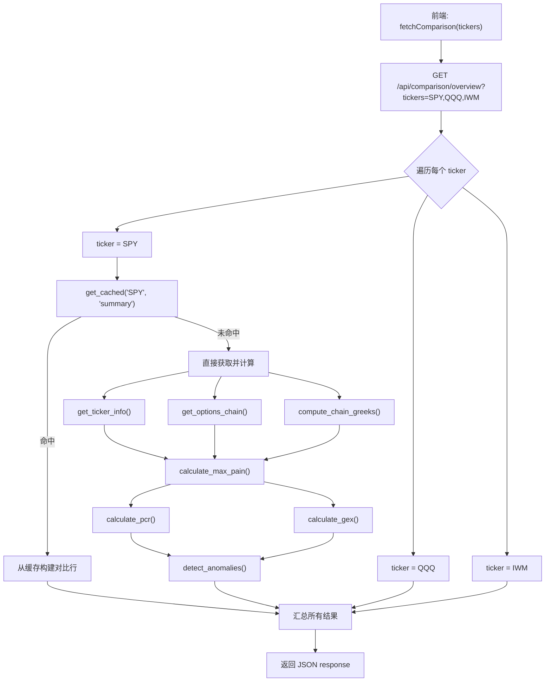
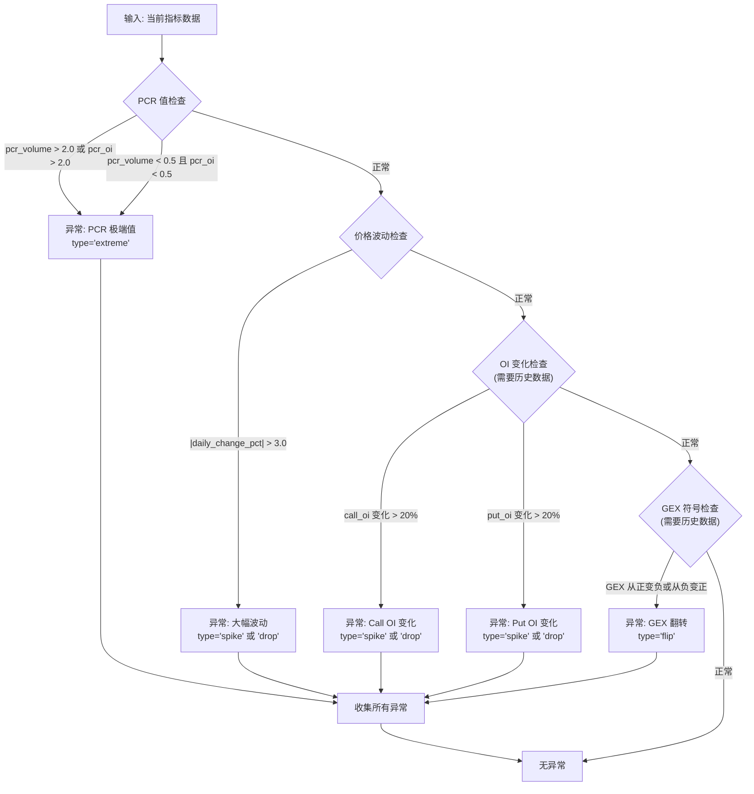
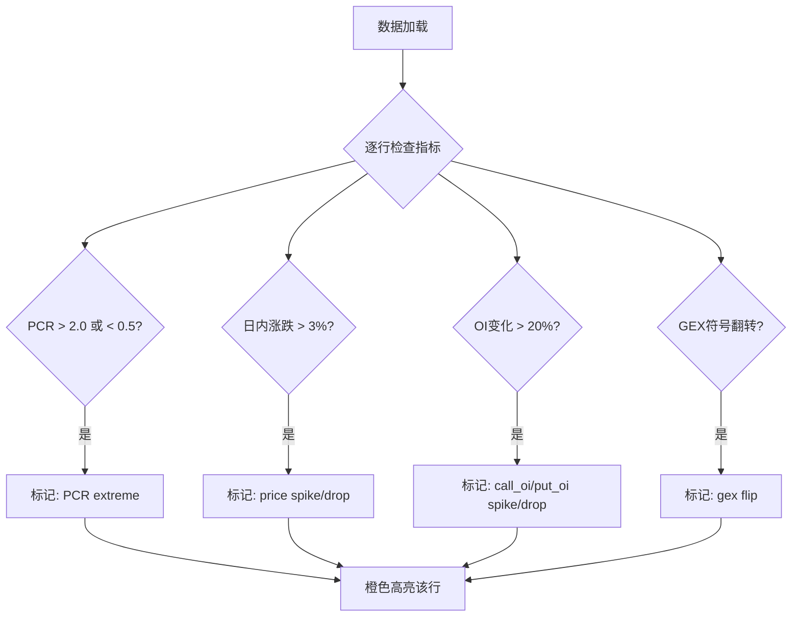

# 多标的对比 Comparison

多标对比页面让你同时查看多个标的的核心期权指标，并自动检测异常情况。本文档将深入讲解对比表格的后端数据聚合逻辑、异常检测算法以及前端表格渲染代码。

## 概述

该页面以表格形式并排展示以下标的的数据：

- **SPY** — 标普 500 ETF
- **QQQ** — 纳斯达克 100 ETF
- **IWM** — 罗素 2000 ETF
- **TLT** — 20年期美国国债 ETF
- **XLF** — 金融板块 ETF

页面包含 **异常检测** 功能，当某项指标出现异常时，该行会以橙色高亮显示并附带异常标签。

### 如何访问

```
/comparison
```

API 接口：

```bash
curl "http://localhost:5001/api/comparison/overview?tickers=SPY,QQQ,IWM"
```

---

## 数据流全景

对比页面需要为每个标的分别计算指标，然后聚合成一个表格响应。



---

## 后端 API 处理器

### 对比概览 API: `/api/comparison/overview`

```python
# backend/api/comparison.py (第 26-98 行)
@comparison_bp.route("/api/comparison/overview", methods=["GET"])
def comparison_overview():
    tickers_str = request.args.get("tickers", "SPY,QQQ,IWM")
    tickers = [t.strip().upper() for t in tickers_str.split(",") if t.strip()]
    expiration = request.args.get("expiration")

    # 过滤：只保留受支持的标的
    tickers = [t for t in tickers if t in Config.SUPPORTED_TICKERS]
    if not tickers:
        return error_response("no_valid_tickers",
            f"No valid tickers. Supported: {', '.join(Config.SUPPORTED_TICKERS)}",
            status=400)

    results = []
    for ticker in tickers:
        try:
            # 优先使用缓存
            cached = get_cached(ticker, "summary")
            if cached:
                row = _build_comparison_row_from_cache(ticker, cached)
                if row:
                    results.append(row)
                    continue

            # 缓存未命中，直接获取
            info = get_ticker_info(ticker)
            chain = get_options_chain(ticker, expiration)
            chain = compute_chain_greeks(chain)
            calls = chain["calls"]
            puts = chain["puts"]
            spot = chain["spot_price"]

            # 计算核心指标
            max_pain_result = calculate_max_pain(calls, puts)
            pcr_result = calculate_pcr(calls, puts)
            gex_result = calculate_gex(calls, puts, spot)
            deviation = round(spot - max_pain_result["max_pain_strike"], 2)

            # 获取历史均值用于异常检测
            hist_avg = get_historical_average(ticker, db)

            # 运行异常检测
            anomalies = detect_anomalies(
                ticker=ticker,
                pcr={"pcr_volume": pcr_result["pcr_volume"], "pcr_oi": pcr_result["pcr_oi"]},
                gex={"value": gex_result["value"]},
                daily_change_pct=info["daily_change_pct"],
                calls_oi=pcr_result["total_call_oi"],
                puts_oi=pcr_result["total_put_oi"],
                calls_vol=pcr_result["total_call_volume"],
                puts_vol=pcr_result["total_put_volume"],
                historical_avg=hist_avg,
            )

            results.append({
                "ticker": ticker,
                "spot_price": spot,
                "daily_change_pct": info["daily_change_pct"],
                "max_pain": max_pain_result["max_pain_strike"],
                "deviation_from_max_pain": deviation,
                "pcr": {"volume": pcr_result["pcr_volume"], "oi": pcr_result["pcr_oi"],
                        "signal": pcr_result["signal"]},
                "gex": {"value": gex_result["value"], "formatted": gex_result["formatted"],
                        "regime": gex_result["regime"]},
                "total_call_oi": pcr_result["total_call_oi"],
                "total_put_oi": pcr_result["total_put_oi"],
                "total_call_volume": pcr_result["total_call_volume"],
                "total_put_volume": pcr_result["total_put_volume"],
                "anomalies": anomalies,
            })
        except Exception as e:
            logger.warning(f"Comparison fetch failed for {ticker}: {e}")
            results.append({"ticker": ticker, "error": str(e), "anomalies": []})

    return jsonify({
        "data": results,
        "expiration_used": expiration or "nearest",
        "updated_at": datetime.now(timezone.utc).isoformat(),
    })
```

### 缓存构建辅助函数

当缓存命中时，使用辅助函数从缓存数据构建对比行：

```python
# backend/api/comparison.py (第 101-132 行)
def _build_comparison_row_from_cache(ticker: str, cached: dict) -> dict | None:
    """从缓存摘要构建对比行。"""
    try:
        hist_avg = get_historical_average(ticker, db)
        anomalies = detect_anomalies(
            ticker=ticker,
            pcr=cached.get("pcr", {}),
            gex=cached.get("gex", {}),
            daily_change_pct=cached.get("daily_change_pct", 0),
            calls_oi=0,    # 缓存中没有这些细分数据
            puts_oi=0,
            calls_vol=0,
            puts_vol=0,
            historical_avg=hist_avg,
        )
        return {
            "ticker": ticker,
            "spot_price": cached["spot_price"],
            "daily_change_pct": cached.get("daily_change_pct", 0),
            "max_pain": cached["max_pain"],
            "deviation_from_max_pain": cached.get("deviation_from_max_pain", 0),
            "pcr": cached.get("pcr", {}),
            "gex": cached.get("gex", {}),
            "total_call_oi": 0,
            "total_put_oi": 0,
            "total_call_volume": 0,
            "total_put_volume": 0,
            "anomalies": anomalies,
        }
    except Exception:
        return None
```

---

## 异常检测算法

异常检测是对比页面的核心功能。算法实现在 `backend/services/anomaly.py` 中。

### 四类异常检测

```python
# backend/services/anomaly.py (第 9-92 行)
def detect_anomalies(
    ticker: str,
    pcr: dict,
    gex: dict,
    daily_change_pct: float,
    calls_oi: int,
    puts_oi: int,
    calls_vol: int,
    puts_vol: int,
    historical_avg: dict | None = None,
) -> list[dict]:
    """标记异常数据点。"""
    anomalies = []

    # ===== 检测 1: PCR 极端值 =====
    if pcr["pcr_volume"] > 2.0 or pcr["pcr_oi"] > 2.0:
        anomalies.append({
            "field": "pcr",
            "value": pcr["pcr_oi"],
            "change_pct": 0,
            "type": "extreme",
        })
    elif pcr["pcr_volume"] < 0.5 and pcr["pcr_oi"] < 0.5:
        anomalies.append({
            "field": "pcr",
            "value": pcr["pcr_oi"],
            "change_pct": 0,
            "type": "extreme",
        })

    # ===== 检测 2: 大幅价格波动 =====
    if abs(daily_change_pct) > 3.0:
        anomalies.append({
            "field": "price",
            "value": daily_change_pct,
            "change_pct": daily_change_pct,
            "type": "spike" if daily_change_pct > 0 else "drop",
        })

    # ===== 检测 3: OI 较历史均值大幅变化 =====
    if historical_avg and historical_avg.get("total_call_oi"):
        prev_call_oi = float(historical_avg["total_call_oi"])
        if prev_call_oi > 0:
            change = (calls_oi - prev_call_oi) / prev_call_oi * 100
            if abs(change) > 20:
                anomalies.append({
                    "field": "call_oi",
                    "value": calls_oi,
                    "change_pct": round(change, 1),
                    "type": "spike" if change > 0 else "drop",
                })

    if historical_avg and historical_avg.get("total_put_oi"):
        prev_put_oi = float(historical_avg["total_put_oi"])
        if prev_put_oi > 0:
            change = (puts_oi - prev_put_oi) / prev_put_oi * 100
            if abs(change) > 20:
                anomalies.append({
                    "field": "put_oi",
                    "value": puts_oi,
                    "change_pct": round(change, 1),
                    "type": "spike" if change > 0 else "drop",
                })

    # ===== 检测 4: GEX 符号翻转 =====
    if historical_avg and historical_avg.get("gex") is not None:
        prev_gex = float(historical_avg["gex"])
        if (prev_gex > 0 and gex["value"] < 0) or (prev_gex < 0 and gex["value"] > 0):
            anomalies.append({
                "field": "gex",
                "value": gex["value"],
                "change_pct": 0,
                "type": "flip",
            })

    return anomalies
```

### 异常检测流程图



### 历史均值获取

异常检测需要历史数据作为基准。系统从 `daily_snapshots` 表获取最近 5 天的均值：

```python
# backend/services/anomaly.py (第 95-115 行)
def get_historical_average(ticker: str, db) -> dict | None:
    """获取标的最近 5 天的关键指标均值。"""
    row = db.execute_one(
        """
        SELECT AVG(total_call_oi) as total_call_oi,
               AVG(total_put_oi) as total_put_oi,
               AVG(gex) as gex
        FROM daily_snapshots
        WHERE ticker = ?
        ORDER BY date DESC
        LIMIT 5
        """,
        (ticker,),
    )
    if row and row["total_call_oi"] is not None:
        return {
            "total_call_oi": row["total_call_oi"],
            "total_put_oi": row["total_put_oi"],
            "gex": row["gex"],
        }
    return None
```

---

## 前端表格渲染

### 数据获取

```typescript
// frontend/src/modules/comparison/index.tsx (第 9-22 行)
const ComparisonModule: React.FC = () => {
  const [tickers, setTickers] = useState<Ticker[]>(FALLBACK_TICKERS);

  // 从后端获取支持的标的列表
  useEffect(() => {
    fetchTickers()
      .then((res) => setTickers(res.tickers))
      .catch(() => setTickers(FALLBACK_TICKERS));
  }, []);

  // 获取对比数据
  const fetchFn = useCallback(
    () => fetchComparison(tickers),
    [tickers],
  );
  const { data, loading, error } = useTickerData(fetchFn);
```

### 表格列定义

表格使用 Ant Design 的 `Table` 组件，列配置通过 `useMemo` 缓存：

```typescript
// frontend/src/modules/comparison/index.tsx (第 24-168 行)
const columns = useMemo(
  () => [
    // 列 1: 标的代码
    {
      title: 'Ticker',
      dataIndex: 'ticker',
      key: 'ticker',
      fixed: 'left' as const,  // 固定在左侧
      width: 80,
      render: (v: string) => <strong className="text-blue-600">{v}</strong>,
    },
    // 列 2: 现货价格（含涨跌幅颜色）
    {
      title: 'Spot Price',
      dataIndex: 'spot_price',
      key: 'spot_price',
      width: 100,
      render: (_: number, row: ComparisonRow) => {
        if (row.error) return <span className="text-red-400">Error</span>;
        const pct = row.daily_change_pct;
        const color = pct >= 0 ? COLORS.green : COLORS.red;
        return (
          <span>
            <span style={{ color }}>${row.spot_price?.toFixed(2)}</span>
            <span className="text-xs ml-1" style={{ color }}>
              ({pct >= 0 ? '+' : ''}{pct?.toFixed(2)}%)
            </span>
          </span>
        );
      },
    },
    // 列 3: Max Pain（含偏差 Tooltip）
    {
      title: 'Max Pain',
      dataIndex: 'max_pain',
      key: 'max_pain',
      width: 100,
      render: (_: number, row: ComparisonRow) => {
        if (row.error) return '-';
        const dev = row.deviation_from_max_pain;
        const color = dev >= 0 ? COLORS.green : COLORS.red;
        return (
          <Tooltip title={`Deviation: ${dev >= 0 ? '+' : ''}${dev?.toFixed(2)}`}>
            <span style={{ color }}>${row.max_pain?.toFixed(2)}</span>
          </Tooltip>
        );
      },
    },
    // 列 4: PCR（含情绪标签）
    {
      title: 'PCR (Vol/OI)',
      key: 'pcr',
      width: 130,
      render: (_: unknown, row: ComparisonRow) => {
        if (row.error) return '-';
        const signal = row.pcr?.signal;
        const signalColor =
          signal === 'bearish' ? 'red'
          : signal === 'bullish' ? 'green'
          : 'blue';
        return (
          <span>
            <Tag color={signalColor} className="text-xs">{signal}</Tag>
            <span className="text-xs text-gray-400">
              {row.pcr?.volume?.toFixed(2)} / {row.pcr?.oi?.toFixed(2)}
            </span>
          </span>
        );
      },
    },
    // 列 5: GEX（含正负标签）
    {
      title: 'Gamma Exposure',
      dataIndex: 'gex',
      key: 'gex',
      width: 160,
      render: (_: unknown, row: ComparisonRow) => {
        if (row.error) return '-';
        const regime = row.gex?.regime;
        const color = regime === 'negative_gamma' ? COLORS.red : COLORS.green;
        const label = regime === 'negative_gamma' ? 'Negative' : 'Positive';
        return (
          <span>
            <span style={{ color, fontWeight: 600 }}>{row.gex?.formatted}</span>
            <Tag color={color} className="text-xs ml-1">{label}</Tag>
          </span>
        );
      },
    },
    // 列 6: 异常检测标签
    {
      title: 'Anomalies',
      key: 'anomalies',
      width: 200,
      render: (_: unknown, row: ComparisonRow) => {
        if (row.error) return <Tag color="red">Fetch Error</Tag>;
        if (!row.anomalies?.length)
          return <span className="text-gray-300 text-xs">—</span>;
        return (
          <div className="flex flex-wrap gap-1">
            {row.anomalies.map((a, i) => (
              <Tooltip key={i} title={`${a.field}: ${a.type} ${a.change_pct ? `(${a.change_pct}%)` : ''}`}>
                <Tag
                  color={
                    a.type === 'spike' ? 'red'
                    : a.type === 'drop' ? 'orange'
                    : a.type === 'flip' ? 'purple'
                    : 'volcano'
                  }
                  className="text-xs"
                >
                  {a.field} {a.type}
                </Tag>
              </Tooltip>
            ))}
          </div>
        );
      },
    },
  ],
  [],
);
```

### 异常行高亮

表格通过 `onRow` 属性为有异常的行添加橙色背景：

```typescript
// frontend/src/modules/comparison/index.tsx (第 188-192 行)
<Table
  // ...
  onRow={(record: ComparisonRow) => ({
    className: record.anomalies?.length
      ? 'bg-orange-50 hover:bg-orange-100'  // 有异常: 橙色背景
      : '',                                   // 无异常: 默认背景
  })}
/>
```

### 异常标签颜色映射

| 异常类型 | 颜色 | Tag 组件 color |
|----------|------|----------------|
| spike (飙升) | 红色 | `'red'` |
| drop (暴跌) | 橙色 | `'orange'` |
| flip (翻转) | 紫色 | `'purple'` |
| extreme (极端值) | 火山色 | `'volcano'` |

---

## 对比表格说明

表格包含以下列，从左到右依次为：

### 标的信息

| 列 | 说明 |
|----|------|
| Ticker | 标的代码（蓝色显示，固定在左侧） |
| 现货价格 | 当前价格及日内涨跌幅百分比（绿色上涨 / 红色下跌） |

### 核心指标

| 列 | 说明 |
|----|------|
| Max Pain | 最大痛苦点行权价，括号内显示与现货价格的偏差（美元） |
| PCR | 看跌看涨比，附带情绪信号标签（看跌 / 看涨 / 中性） |
| GEX | 伽马敞口金额，附带市场状态标签（正伽马 / 负伽马） |

### 持仓数据

| 列 | 说明 |
|----|------|
| Call OI | 看涨期权总持仓量 |
| Put OI | 看跌期权总持仓量 |

### 异常检测

异常检测是该页面的核心功能之一。系统会自动扫描各项指标，当检测到异常时，在该行显示 **橙色异常标签**。

系统检测以下四类异常：

| 异常类型 | 触发条件 | 标签 |
|----------|----------|------|
| PCR 极端值 | `PCR > 2.0 或 PCR < 0.5` | `PCR extreme` |
| 大幅价格波动 | `日内涨跌幅 > 3%` | `price spike/drop` |
| 持仓量异常 | `OI 较 5 日均值变化 > 20%` | `call_oi/put_oi spike/drop` |
| GEX 符号翻转 | GEX 从正变负或从负变正 | `gex flip` |



---

## 使用技巧

### 发现极端值

点击任意列的表头可以 **排序**。通过排序可以快速找到：

- PCR 最高/最低的标的
- GEX 最大/最小的标的
- 涨跌幅最大的标的

### 关注异常行

被橙色高亮的行是系统检测到异常的标的。优先关注这些标的，因为它们可能正在经历特殊的市场状况。

### 行业情绪比较

通过对比 SPY（大盘）、QQQ（科技）、IWM（小盘）、XLF（金融）的 PCR 信号，可以判断不同板块的情绪分化：

- 如果 QQQ 显示 "看跌" 而 XLF 显示 "看涨" → 科技板块承压，资金可能轮动到金融板块
- 如果所有标的 PCR 同时偏高 → 系统性风险上升

### GEX 联动观察

观察各标的的 GEX 状态是否一致：

- 全部为正伽马 → 市场整体稳定
- 全部为负伽马 → 市场可能进入动荡期
- 出现分化 → 不同板块面临不同的波动风险

:::tip 日常使用建议
建议在每个交易日开盘前和收盘前各查看一次对比页面，快速掌握当日市场全景。
:::
