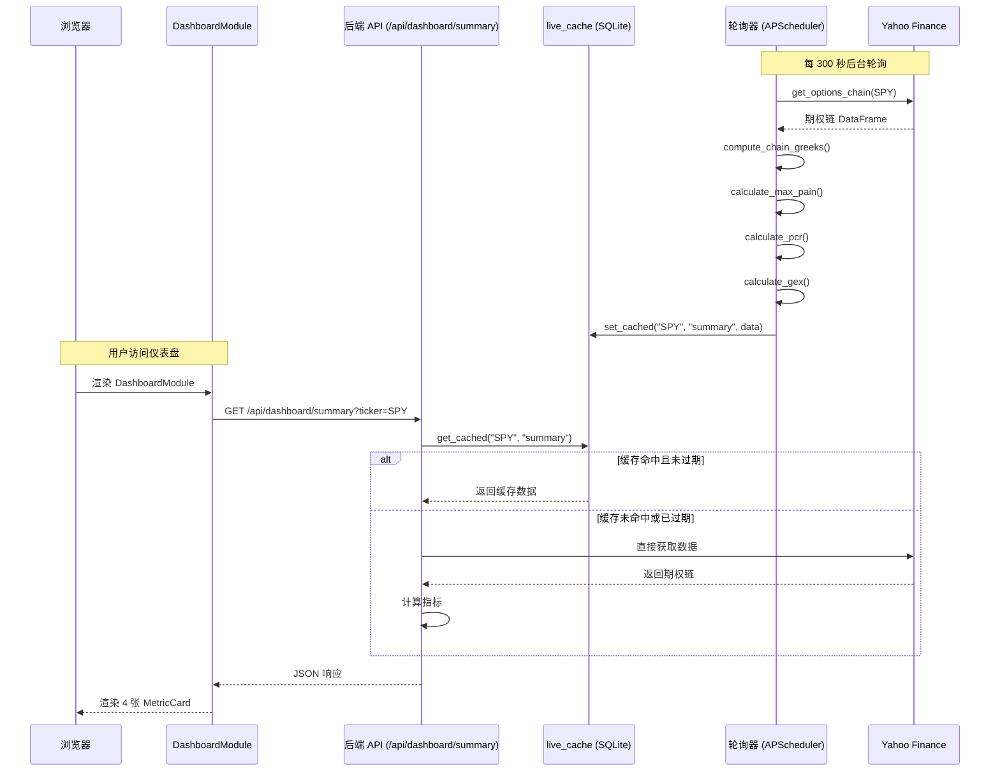
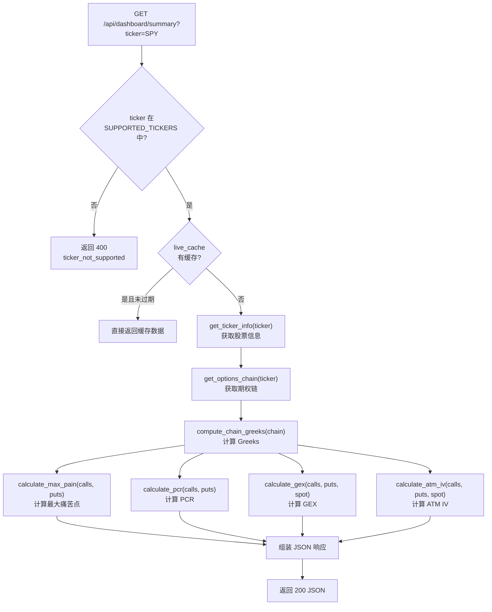
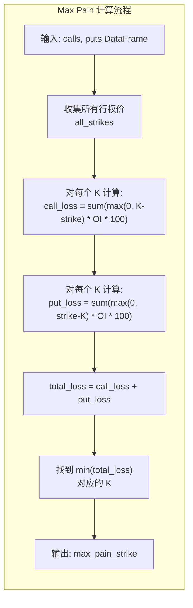
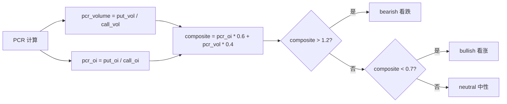
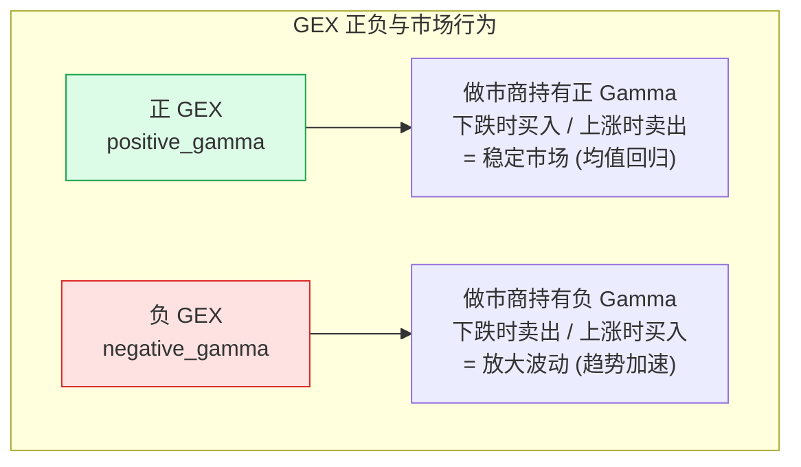
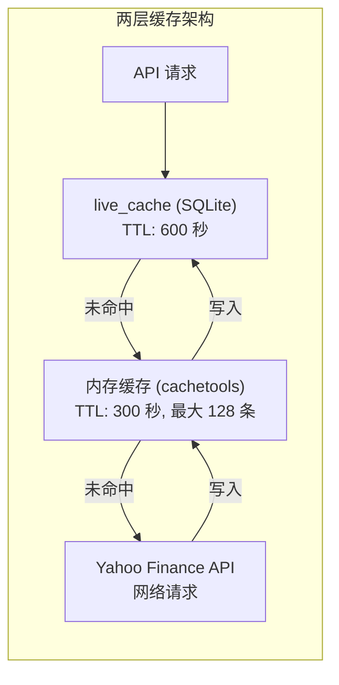
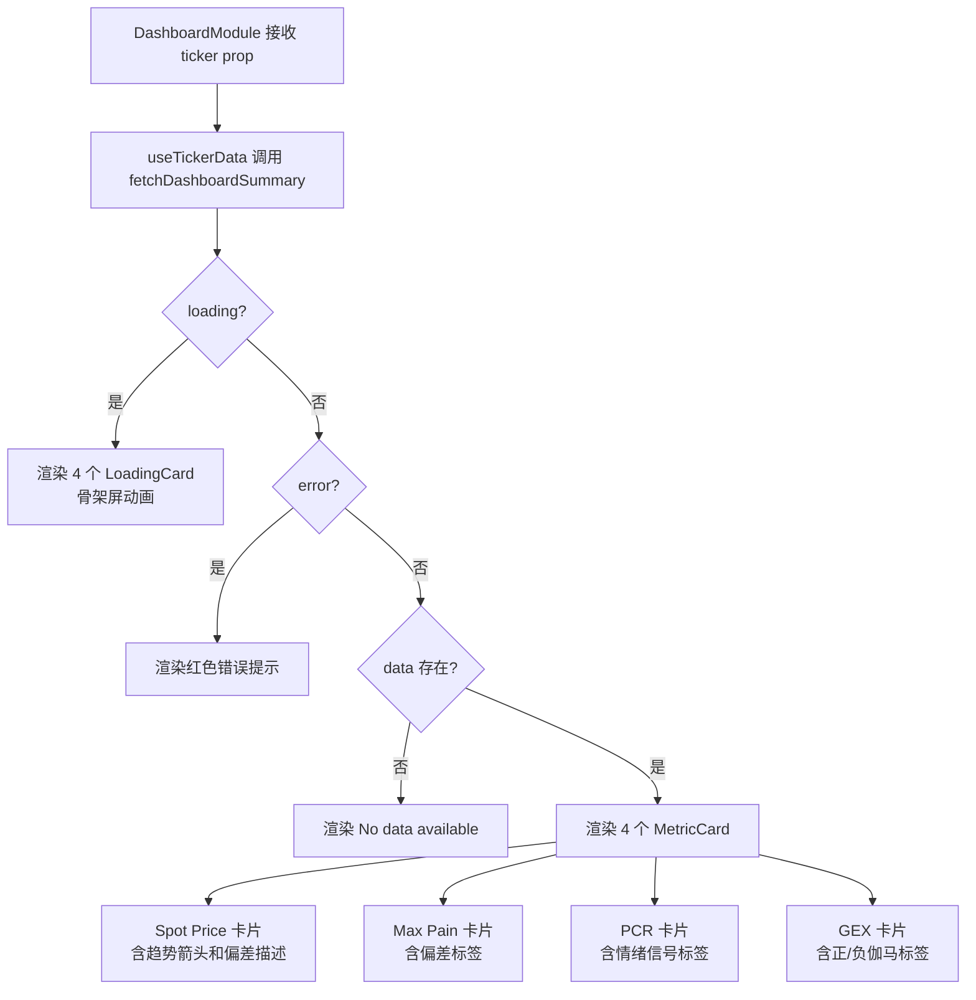
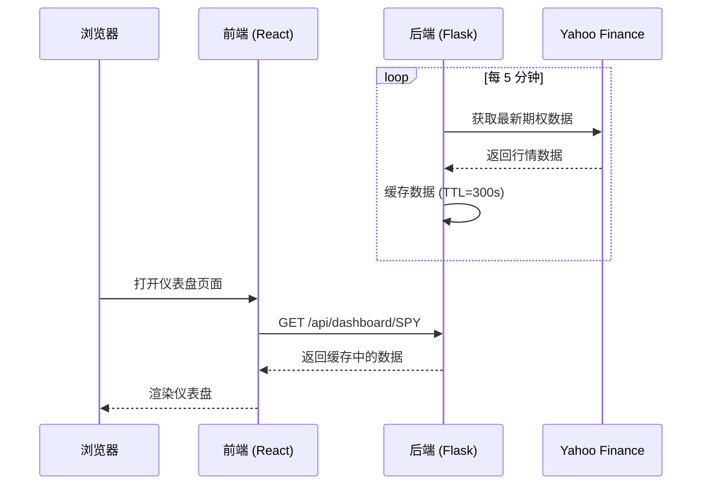

# 仪表盘 Dashboard

仪表盘是 OptionDash 的核心页面，让你一目了然地查看任意标的（ticker）的四大关键期权指标。本文档将深入讲解仪表盘的前端组件、后端 API 处理器以及每个指标的计算源码。

## 概述

仪表盘展示以下四项核心数据：

- **现货价格 (Spot Price)** — 标的当前市场价格
- **最大痛苦点 (Max Pain)** — 期权卖方总义务最小的行权价
- **看跌看涨比 (Put/Call Ratio)** — 衡量市场多空情绪的指标
- **伽马敞口 (Gamma Exposure)** — 做市商对冲行为对市场的稳定/放大效应

### 如何访问

在浏览器中打开仪表盘页面，使用页面顶部的 **标的选择器** 输入 ticker 代码（如 `SPY`、`QQQ`），然后选择一个到期日：

```
/dashboard?ticker=SPY
```

也可以通过 API 直接获取数据：

```bash
curl "http://localhost:5001/api/dashboard/summary?ticker=SPY"
```

页面加载后会自动获取最近到期日的数据。你可以通过 **到期日选择器** 切换到不同的到期周/月。

---

## 数据流全景

在深入代码之前，先了解仪表盘数据从 Yahoo Finance 到浏览器屏幕的完整流程。



---

## 后端 API 处理器

### 路由注册

仪表盘的 API 路由定义在 `backend/api/dashboard.py` 中，通过 Flask Blueprint 注册：

```python
# backend/api/dashboard.py (第 22 行)
dashboard_bp = Blueprint("dashboard", __name__)
```

这个 Blueprint 在 `backend/app.py` 第 14 行被导入，在第 32 行被注册：

```python
# backend/app.py (第 14 行, 第 32 行)
from api.dashboard import dashboard_bp
# ...
app.register_blueprint(dashboard_bp)
```

### 核心 API: `/api/dashboard/summary`

这是仪表盘最核心的 API 端点，负责返回一个标的的全部指标数据。

```python
# backend/api/dashboard.py (第 25-78 行)
@dashboard_bp.route("/api/dashboard/summary", methods=["GET"])
def dashboard_summary():
    """获取标的的核心指标概览。"""
    ticker = request.args.get("ticker", "SPY").upper()
    expiration = request.args.get("expiration")

    # 第一步: 验证标的是否受支持
    if ticker not in Config.SUPPORTED_TICKERS:
        return ticker_not_supported(ticker)

    # 第二步: 尝试从实时缓存获取
    cached = get_cached(ticker, "summary")
    if cached:
        if not expiration or cached.get("expiration_used") == expiration:
            return jsonify(cached)

    # 第三步: 缓存未命中，直接从 Yahoo Finance 获取
    try:
        info = get_ticker_info(ticker)          # 获取股票价格信息
        chain = get_options_chain(ticker, expiration)  # 获取期权链
        chain = compute_chain_greeks(chain)     # 计算 Greeks

        calls = chain["calls"]
        puts = chain["puts"]

        # 第四步: 计算四大核心指标
        max_pain_result = calculate_max_pain(calls, puts)
        pcr_result = calculate_pcr(calls, puts)
        gex_result = calculate_gex(calls, puts, chain["spot_price"])
        atm_iv = calculate_atm_iv(calls, puts, chain["spot_price"])
        deviation = round(chain["spot_price"] - max_pain_result["max_pain_strike"], 2)

        # 第五步: 组装响应
        return jsonify({
            "ticker": ticker,
            "spot_price": chain["spot_price"],
            "daily_change": info["daily_change"],
            "daily_change_pct": info["daily_change_pct"],
            "max_pain": max_pain_result["max_pain_strike"],
            "deviation_from_max_pain": deviation,
            "pcr": {
                "volume": pcr_result["pcr_volume"],
                "oi": pcr_result["pcr_oi"],
                "signal": pcr_result["signal"],
            },
            "gex": {
                "value": gex_result["value"],
                "formatted": gex_result["formatted"],
                "regime": gex_result["regime"],
            },
            "atm_iv": round(atm_iv, 4),
            "expiration_used": chain["expiration"],
            "updated_at": datetime.now(timezone.utc).isoformat(),
        })
    except Exception as e:
        logger.exception(f"Dashboard summary failed for {ticker}")
        return data_source_error(ticker, "dashboard_summary", e)
```

### API 处理流程



### 到期日 API: `/api/dashboard/expirations`

```python
# backend/api/dashboard.py (第 81-100 行)
@dashboard_bp.route("/api/dashboard/expirations", methods=["GET"])
def dashboard_expirations():
    """获取标的可用的到期日列表。"""
    ticker = request.args.get("ticker", "SPY").upper()

    if ticker not in Config.SUPPORTED_TICKERS:
        return ticker_not_supported(ticker)

    # 尝试缓存
    cached = get_cached(ticker, "expirations")
    if cached:
        return jsonify(cached)

    try:
        exps = get_expirations(ticker)
        return jsonify({"ticker": ticker, "expirations": exps})
    except Exception as e:
        logger.exception(f"Expirations fetch failed for {ticker}")
        return data_source_error(ticker, "expirations", e)
```

---

## 指标计算详解

### 1. 最大痛苦点 (Max Pain)

最大痛苦点是期权卖方亏损最小的行权价。计算逻辑在 `backend/services/max_pain.py` 中。

**核心算法：**

对于每个候选结算价 `K`，计算所有期权持有者的总亏损：

```
total_loss(K) = Sum(max(0, K - strike_i) * call_OI_i * 100)
              + Sum(max(0, strike_j - K) * put_OI_j * 100)
```

使 `total_loss` 最小的 `K` 就是 Max Pain。

```python
# backend/services/max_pain.py (第 10-62 行)
def calculate_max_pain(calls: pd.DataFrame, puts: pd.DataFrame) -> dict:
    """计算最大痛苦点。"""

    if calls.empty and puts.empty:
        return {"max_pain_strike": 0.0, "strikes": [], "total_loss": []}

    oi_col_c = _resolve_oi_column(calls)
    oi_col_p = _resolve_oi_column(puts)

    # 获取所有候选行权价
    all_strikes = sorted(
        set(calls["strike"].tolist()) | set(puts["strike"].tolist())
    )

    call_strikes = calls["strike"].values
    call_oi = calls[oi_col_c].fillna(0).values
    put_strikes = puts["strike"].values
    put_oi = puts[oi_col_p].fillna(0).values

    # 对每个候选结算价 K 计算总亏损
    total_losses = []
    for K in all_strikes:
        # Call 持有者亏损: 当 K > strike 时，max(0, K - strike) * OI * 100
        call_loss = np.sum(np.maximum(K - call_strikes, 0) * call_oi * 100)
        # Put 持有者亏损: 当 K < strike 时，max(0, strike - K) * OI * 100
        put_loss = np.sum(np.maximum(put_strikes - K, 0) * put_oi * 100)
        total_losses.append(call_loss + put_loss)

    # 找到总亏损最小的行权价
    min_idx = int(np.argmin(total_losses))
    max_pain = all_strikes[min_idx]

    return {
        "max_pain_strike": round(max_pain, 2),
        "strikes": [round(s, 2) for s in all_strikes],
        "total_loss": [round(l, 2) for l in total_losses],
    }
```



### 2. 看跌看涨比 (PCR)

PCR 衡量市场多空情绪。计算逻辑在 `backend/services/pcr.py` 中。

```python
# backend/services/pcr.py (第 9-42 行)
def calculate_pcr(calls: pd.DataFrame, puts: pd.DataFrame) -> dict:
    """计算基于成交量和持仓量的 Put/Call Ratio。"""

    # 解析列名
    vol_col_c = _resolve_column(calls, ("volume", "vol"))
    vol_col_p = _resolve_column(puts, ("volume", "vol"))
    oi_col_c = _resolve_column(calls, ("open_interest", "openinterest", "oi"))
    oi_col_p = _resolve_column(puts, ("open_interest", "openinterest", "oi"))

    # 计算总量
    total_call_vol = float(calls[vol_col_c].fillna(0).sum())
    total_put_vol = float(puts[vol_col_p].fillna(0).sum())
    total_call_oi = float(calls[oi_col_c].fillna(0).sum())
    total_put_oi = float(puts[oi_col_p].fillna(0).sum())

    # 安全除法，避免除以零
    pcr_volume = safe_divide(total_put_vol, total_call_vol, default=0.0)
    pcr_oi = safe_divide(total_put_oi, total_call_oi, default=0.0)

    # 生成情绪信号
    signal = _interpret_pcr(pcr_volume, pcr_oi)

    return {
        "pcr_volume": round(pcr_volume, 4),
        "pcr_oi": round(pcr_oi, 4),
        "signal": signal,
        "total_call_volume": int(total_call_vol),
        "total_put_volume": int(total_put_vol),
        "total_call_oi": int(total_call_oi),
        "total_put_oi": int(total_put_oi),
    }
```

**情绪信号判定逻辑：**

```python
# backend/services/pcr.py (第 45-53 行)
def _interpret_pcr(pcr_vol: float, pcr_oi: float) -> str:
    """将 PCR 值解读为情绪信号。"""
    # 使用 OI 和 Volume 的加权组合
    composite = pcr_oi * 0.6 + pcr_vol * 0.4
    if composite > 1.2:
        return "bearish"
    elif composite < 0.7:
        return "bullish"
    return "neutral"
```



注意判定使用的是 **加权组合**（60% OI + 40% Volume），而不是单一指标。这是因为持仓量反映的是长期持仓立场，而成交量反映的是短期交易活动。

### 3. 伽马敞口 (GEX)

GEX 反映做市商对冲行为对市场的影响。计算逻辑在 `backend/services/gex.py` 中。

```python
# backend/services/gex.py (第 11-56 行)
def calculate_gex(
    calls: pd.DataFrame,
    puts: pd.DataFrame,
    spot_price: float,
) -> dict:
    """从做市商角度计算 Gamma Exposure。"""

    # 解析列名
    gamma_col_c = _resolve_column(calls, ("gamma",))
    gamma_col_p = _resolve_column(puts, ("gamma",))
    oi_col_c = _resolve_column(calls, ("open_interest", "openinterest", "oi"))
    oi_col_p = _resolve_column(puts, ("open_interest", "openinterest", "oi"))

    call_oi = calls[oi_col_c].fillna(0).values
    call_gamma = calls[gamma_col_c].fillna(0).values
    put_oi = puts[oi_col_p].fillna(0).values
    put_gamma = puts[gamma_col_c].fillna(0).values

    # 做市商 GEX (每份合约)
    # Call GEX 为负（做市商卖出 Call，负 gamma）
    # Put GEX 为正（做市商卖出 Put，正 gamma）
    dealer_gex_per_share = (
        -np.sum(call_oi * call_gamma)    # Call 部分
        + np.sum(put_oi * put_gamma)     # Put 部分
    )

    # 转换为美元 GEX
    gex_dollar = float(dealer_gex_per_share * 100 * spot_price)

    regime = "positive_gamma" if gex_dollar > 0 else "negative_gamma"

    return {
        "value": round(gex_dollar, 2),
        "formatted": format_large_number(gex_dollar),
        "regime": regime,
    }
```

**GEX 的正负含义：**



### 4. ATM 隐含波动率

ATM IV 是平值期权的隐含波动率，计算逻辑在 `backend/services/volatility.py` 中。

```python
# backend/services/volatility.py (第 24-35 行)
def calculate_atm_iv(calls: pd.DataFrame, puts: pd.DataFrame, spot: float) -> float:
    """获取 ATM IV：取最接近现货价的 Call 和 Put 的 IV 平均值。"""
    iv_col_c = "implied_volatility" if "implied_volatility" in calls.columns else None
    iv_col_p = "implied_volatility" if "implied_volatility" in puts.columns else None

    ivs = []
    for df, iv_col in ((calls, iv_col_c), (puts, iv_col_p)):
        if iv_col and not df.empty:
            # 找到 strike 最接近 spot 的行
            idx = (df["strike"] - spot).abs().idxmin()
            ivs.append(float(df.loc[idx, iv_col]))

    return sum(ivs) / len(ivs) if ivs else 0.0
```

算法很简单：找到 Call 和 Put 中各自最接近现货价的行权价，取其 IV 的平均值。

---

## 缓存机制

仪表盘使用两层缓存来加速数据响应。

### 实时缓存 (live_cache)

实时缓存存储在 SQLite 的 `live_cache` 表中，由后台轮询器定期更新。

```python
# backend/services/live_cache.py (第 18-37 行)
def get_cached(ticker: str, cache_key: str) -> dict | None:
    """从实时缓存获取数据。如果未找到或已过期则返回 None。"""
    row = db.execute_one(
        "SELECT data_json, updated_at FROM live_cache "
        "WHERE ticker = ? AND cache_key = ?",
        (ticker.upper(), cache_key),
    )
    if not row:
        return None

    # 检查是否过期
    updated_at = datetime.fromisoformat(row["updated_at"])
    age = (datetime.now(timezone.utc) - updated_at).total_seconds()
    if age > Config.LIVE_CACHE_TTL_SEC:  # 默认 600 秒
        return None

    try:
        return json.loads(row["data_json"])
    except json.JSONDecodeError:
        logger.warning(f"Corrupt cache entry for {ticker}/{cache_key}")
        return None
```

### 内存缓存

yfinance 的数据还会经过一层内存 TTL 缓存（使用 `cachetools.TTLCache`），避免重复的网络请求。



---

## 前端组件

### DashboardModule 组件

前端仪表盘的入口组件是 `frontend/src/modules/dashboard/index.tsx`。

```typescript
// frontend/src/modules/dashboard/index.tsx (第 14-19 行)
const DashboardModule: React.FC<Props> = ({ ticker = 'SPY' }) => {
  const fetchFn = useCallback(
    () => fetchDashboardSummary(ticker),
    [ticker],
  );
  const { data, loading, error, refetch } = useTickerData<DashboardSummary>(fetchFn);
```

`useTickerData` 是自定义 Hook，封装了数据获取、加载状态和错误处理的逻辑：

```typescript
// frontend/src/hooks/useTickerData.ts (第 31-63 行)
export function useTickerData<T>(
  fetchFn: () => Promise<T>
): {
  data: T | null;
  loading: boolean;
  error: string | null;
  refetch: () => void;
} {
  const [data, setData] = useState<T | null>(null);
  const [loading, setLoading] = useState(true);
  const [error, setError] = useState<string | null>(null);

  const refetch = useCallback(async () => {
    setLoading(true);
    setError(null);
    try {
      const result = await fetchFn();
      setData(result);
    } catch (err: unknown) {
      const message =
        err instanceof Error ? err.message : 'Failed to fetch data';
      setError(message);
    } finally {
      setLoading(false);
    }
  }, [fetchFn]);

  useEffect(() => {
    refetch();  // 组件挂载时自动获取数据
  }, [refetch]);

  return { data, loading, error, refetch };
}
```

### PCR 信号判定（前端）

前端也会根据 PCR 值生成情绪标签：

```typescript
// frontend/src/modules/dashboard/index.tsx (第 29-39 行)
const pcrSignal = useMemo(() => {
  if (!data?.pcr) return null;
  const { volume, oi } = data.pcr;
  if (volume > PCR_BEARISH_THRESHOLD || oi > PCR_BEARISH_THRESHOLD) {
    return { label: 'Bearish', color: 'red' };
  }
  if (volume < PCR_BULLISH_THRESHOLD || oi < PCR_BULLISH_THRESHOLD) {
    return { label: 'Bullish', color: 'green' };
  }
  return { label: 'Neutral', color: 'blue' };
}, [data]);
```

阈值定义在 `frontend/src/utils/constants.ts` 中：

```typescript
// frontend/src/utils/constants.ts (第 29-30 行)
export const PCR_BEARISH_THRESHOLD = 1.2;
export const PCR_BULLISH_THRESHOLD = 0.7;
```

### MetricCard 渲染

四张指标卡片使用同一个 `MetricCard` 组件，通过不同的 props 渲染不同的内容：

```typescript
// frontend/src/modules/dashboard/index.tsx (第 82-93 行) — 现货价格卡片
<MetricCard
  title="Spot Price"
  value={data.spot_price}
  precision={2}
  prefix="$"
  trend={spotTrend}           // 'up' 或 'down'
  trendValue={`${data.daily_change_pct >= 0 ? '+' : ''}${data.daily_change_pct.toFixed(2)}%`}
  description={deviationUp
    ? `${data.deviation_from_max_pain.toFixed(2)} above Max Pain`
    : `${Math.abs(data.deviation_from_max_pain).toFixed(2)} below Max Pain`}
  tooltip="Current underlying price"
/>
```

```typescript
// frontend/src/modules/dashboard/index.tsx (第 108-119 行) — PCR 卡片
<MetricCard
  title="Put/Call Ratio"
  value={data.pcr.oi.toFixed(2)}
  suffix={<span className="text-sm text-gray-400">OI</span>}
  tag={pcrSignal || undefined}
  description={`Vol PCR: ${data.pcr.volume.toFixed(2)}`}
  tooltip={`${data.pcr.signal}. PCR > 1.2 bearish, < 0.7 bullish.`}
/>
```

```typescript
// frontend/src/modules/dashboard/index.tsx (第 121-129 行) — GEX 卡片
<MetricCard
  title="Gamma Exposure"
  value={data.gex.formatted}
  tag={{ label: gexRegime, color: gexColor }}
  description={gexRegime === 'Negative Gamma'
    ? 'Dealers short gamma — volatility amplification'
    : 'Dealers long gamma — volatility dampening'}
  tooltip="Dealer Gamma Exposure."
/>
```

### 组件渲染流程



### 自动刷新

仪表盘使用 `useAutoRefresh` Hook 实现每 5 分钟自动刷新：

```typescript
// frontend/src/modules/dashboard/index.tsx (第 27 行)
useAutoRefresh(refetch);
```

```typescript
// frontend/src/hooks/useTickerData.ts (第 8-26 行)
export function useAutoRefresh(
  callback: () => void,
  interval: number = AUTO_REFRESH_INTERVAL,  // 5 * 60 * 1000 = 5 分钟
  enabled = true
) {
  const savedCallback = useRef(callback);

  useEffect(() => {
    savedCallback.current = callback;
  }, [callback]);

  useEffect(() => {
    if (!enabled) return;
    const tick = () => savedCallback.current();
    const id = setInterval(tick, interval);
    return () => clearInterval(id);  // 组件卸载时清除定时器
  }, [interval, enabled]);
}
```

---

## 界面说明

仪表盘由四张数据卡片组成，每张卡片展示一个核心指标。下面是每张卡片的详细说明。

### 现货价格 (Spot Price)

这是标的的当前市场价格，数据来自 Yahoo Finance（延迟约 15 分钟）。

卡片中显示以下信息：

| 信息 | 说明 |
|------|------|
| 当前价格 | 标的的最新价格 |
| 日内涨跌 | 带有颜色标识的涨跌幅（绿色上涨，红色下跌） |
| 与 Max Pain 偏差 | 当前价格距最大痛苦点的距离（美元） |

**如何解读：**

- 当现货价格 **高于** 最大痛苦点时，暗示价格可能受到向下的引力
- 当现货价格 **低于** 最大痛苦点时，暗示价格可能受到向上的引力
- 偏差越大，理论上回归动力越强（尤其是在临近到期时）

### 最大痛苦点 (Max Pain)

最大痛苦点是指期权卖方（writers/sellers）在该行权价结算时承受最小总亏损的价格。它反映的是期权市场参与者的集体持仓分布。

卡片中显示：

| 信息 | 说明 |
|------|------|
| Max Pain 行权价 | 使期权卖方总义务最小的 strike |
| 位置标签 | "高于现货" 或 "低于现货" |

**如何解读：**

- 临近到期日时，标的价格倾向于向最大痛苦点靠拢
- 这是因为做市商和期权卖方会通过对冲操作来影响价格
- 偏差越大，"引力" 理论上越强

### 看跌看涨比 (Put/Call Ratio)

Put/Call Ratio (PCR) 是衡量市场多空情绪的重要指标。OptionDash 默认展示基于 **持仓量 (Open Interest)** 的 PCR。

卡片中显示：

| 信息 | 说明 |
|------|------|
| PCR 数值 | 看跌期权 OI / 看涨期权 OI |
| 情绪信号 | 根据阈值自动判定 |

**情绪信号判定规则：**

| PCR 范围 | 信号 | 含义 |
|----------|------|------|
| `> 1.2` | 看跌 (Bearish) | 看跌持仓远超看涨，市场偏悲观 |
| 0.7 - 1.2 | 中性 (Neutral) | 多空相对平衡 |
| `< 0.7` | 看涨 (Bullish) | 看涨持仓远超看跌，市场偏乐观 |

:::tip 逆向思维
极端 PCR 有时是反向信号。例如，当 PCR 极高（极度悲观）时，市场可能已经超卖，反而可能反弹。
:::

### 伽马敞口 (Gamma Exposure)

Gamma Exposure (GEX) 反映做市商在对冲期权头寸时对市场产生的影响。它以美元为单位展示，带有 B（十亿）、M（百万）、K（千）的后缀。

卡片中显示：

| 信息 | 说明 |
|------|------|
| GEX 数值 | 格式化后的伽马敞口金额 |
| 市场状态 | 正伽马 或 负伽马 |

**两种伽马状态：**

| 状态 | 含义 | 市场行为 |
|------|------|----------|
| **正伽马 (Positive Gamma)** | 做市商持有的净伽马为正 | 做市商在下跌时买入、上涨时卖出，起到 **稳定市场** 的作用 |
| **负伽马 (Negative Gamma)** | 做市商持有的净伽马为负 | 做市商在下跌时卖出、上涨时买入，起到 **放大波动** 的作用 |

**如何解读：**

- **正伽马** — 市场倾向于均值回归，波动率被压制，走势较为平稳
- **负伽马** — 市场倾向于趋势放大，容易出现急涨急跌

---

## 数据刷新

OptionDash 通过后台轮询机制保持数据更新：



- **自动刷新**：交易时段内每 5 分钟自动更新一次
- **手动刷新**：切换标的或到期日会立即触发数据请求
- **数据来源**：Yahoo Finance，延迟约 15 分钟

---

## 使用技巧

以下是几个实用技巧，帮助你更好地利用仪表盘：

1. **跨到期日比较 Max Pain**：切换不同的到期日，观察最大痛苦点的变化趋势。近期到期的 Max Pain 通常更有参考价值。

2. **追踪 PCR 信号变化**：在交易时段内多次查看 PCR，观察信号是否从 "中性" 变为 "看跌" 或 "看涨"，这能反映日内情绪变化。

3. **利用 GEX 状态判断市场稳定性**：
   - 正伽马环境下，适合均值回归策略
   - 负伽马环境下，需警惕趋势加速风险

4. **综合四个指标**：不要单独依赖某一个指标。例如，当 PCR 显示看跌但 GEX 为正伽马时，下跌空间可能有限。
