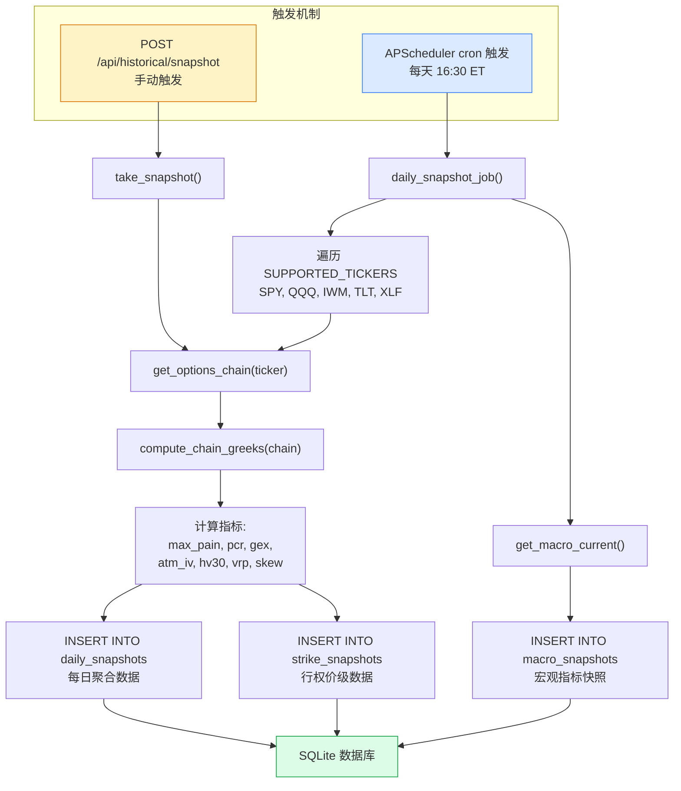
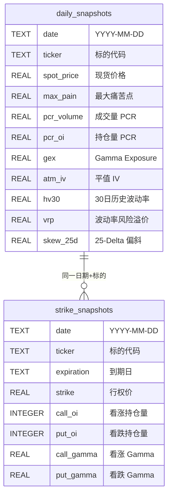
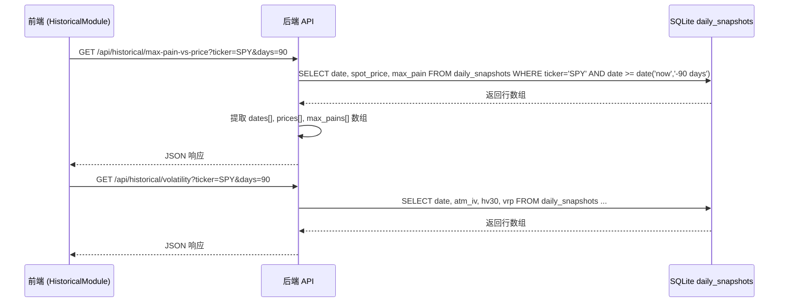
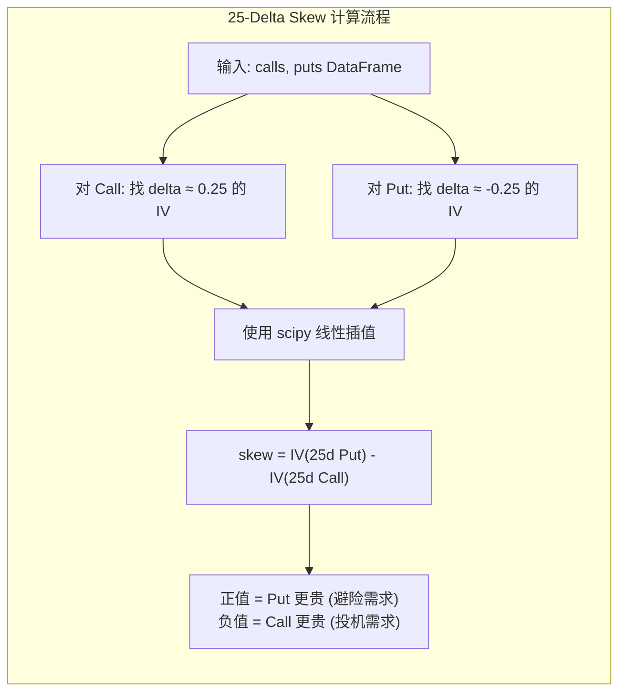

# 历史趋势 Historical

历史趋势页面通过时间序列图表，帮助你追踪期权指标的长期变化趋势。默认展示最近 90 天的数据。本文档将深入讲解每日快照的采集机制、历史数据查询 API 以及前端图表配置。

## 概述

页面包含以下四张图表：

- **最大痛苦 vs 价格 (Max Pain vs Price)** — 对比现货价格与最大痛苦点的走势
- **PCR 与 GEX 趋势 (PCR & GEX Trends)** — 追踪情绪指标和伽马敞口的变化
- **波动率研究 (Volatility Study)** — 对比隐含波动率、历史波动率和波动率风险溢价
- **25-Delta 偏斜 (25-Delta Skew)** — 追踪期权市场的恐慌/贪婪情绪

数据来自每个交易日收盘时（美东时间 16:30）的快照，存储在本地数据库中。

:::info 数据积累
历史趋势功能需要持续的数据积累。系统运行时间越长，图表中包含的数据越多，分析结果越有意义。建议至少积累 30 天数据后再进行趋势分析。
:::

---

## 每日快照生命周期

理解历史数据的来源是使用历史趋势功能的前提。下图展示了每日快照从触发到存储的完整流程。



---

## 后端：快照采集代码

### 调度器配置

快照由 APScheduler 的 cron 触发器调度，配置在 `backend/scheduler/jobs.py` 中。

```python
# backend/scheduler/jobs.py (第 128-164 行)
def start_scheduler():
    """启动后台调度器：每日快照 + 实时轮询。"""

    # 每日快照：美东时间 16:30（收盘后）
    scheduler.add_job(
        daily_snapshot_job,
        trigger="cron",
        hour=Config.SNAPSHOT_HOUR,      # 默认 16
        minute=Config.SNAPSHOT_MINUTE,  # 默认 30
        timezone="US/Eastern",
        id="daily_snapshot",
        replace_existing=True,
    )

    # 实时轮询：每 300 秒
    from scheduler.poller import poll_all_tickers
    scheduler.add_job(
        poll_all_tickers,
        trigger="interval",
        seconds=Config.POLL_INTERVAL_SEC,  # 默认 300
        id="live_poller",
        replace_existing=True,
    )

    # 启动时立即执行一次轮询
    scheduler.add_job(
        poll_all_tickers,
        trigger="date",
        id="live_poller_initial",
        replace_existing=True,
    )

    scheduler.start()
```

### 每日快照任务

```python
# backend/scheduler/jobs.py (第 24-104 行)
def daily_snapshot_job():
    """每天收盘后运行：为每个标的采集快照。"""
    from datetime import datetime, timezone
    date_str = datetime.now(timezone.utc).strftime("%Y-%m-%d")
    logger.info(f"Starting daily snapshot job for {date_str}")

    for ticker in Config.SUPPORTED_TICKERS:
        try:
            # 第一步: 获取期权链并计算 Greeks
            chain = get_options_chain(ticker)
            chain = compute_chain_greeks(chain)
            calls = chain["calls"]
            puts = chain["puts"]
            spot = chain["spot_price"]

            # 第二步: 计算核心指标
            max_pain_result = calculate_max_pain(calls, puts)
            pcr_result = calculate_pcr(calls, puts)
            gex_result = calculate_gex(calls, puts, spot)

            # 第三步: 计算波动率指标
            atm_iv = calculate_atm_iv(calls, puts, spot)
            prices_df = get_historical_prices(ticker, period="90d")
            hv30 = calculate_hv(prices_df["Close"], window=30)
            vrp = calculate_vrp(atm_iv, hv30)
            skew = calculate_skew_25d(calls, puts, spot)

            # 第四步: 写入 daily_snapshots 表
            db.execute(
                """
                INSERT OR REPLACE INTO daily_snapshots
                (date, ticker, spot_price, max_pain, pcr_volume, pcr_oi, gex,
                 atm_iv, hv30, vrp, skew_25d,
                 total_call_volume, total_put_volume, total_call_oi, total_put_oi)
                VALUES (?, ?, ?, ?, ?, ?, ?, ?, ?, ?, ?, ?, ?, ?, ?)
                """,
                (
                    date_str, ticker, spot,
                    max_pain_result["max_pain_strike"],
                    pcr_result["pcr_volume"], pcr_result["pcr_oi"],
                    gex_result["value"],
                    atm_iv, hv30, vrp, skew,
                    pcr_result["total_call_volume"], pcr_result["total_put_volume"],
                    pcr_result["total_call_oi"], pcr_result["total_put_oi"],
                ),
            )

            # 第五步: 写入 strike_snapshots 表（行权价级数据）
            strike_rows = []
            for side_key, df in (("calls", calls), ("puts", puts)):
                for _, row in df.iterrows():
                    strike_rows.append((
                        date_str, ticker, chain["expiration"],
                        safe_float(row["strike"]),
                        safe_int(row.get("open_interest")) if side_key == "calls" else 0,
                        safe_int(row.get("open_interest")) if side_key == "puts" else 0,
                        safe_int(row.get("volume")) if side_key == "calls" else 0,
                        safe_int(row.get("volume")) if side_key == "puts" else 0,
                        safe_float(row.get("implied_volatility")) if side_key == "calls" else 0.0,
                        safe_float(row.get("implied_volatility")) if side_key == "puts" else 0.0,
                        safe_float(row.get("gamma")) if side_key == "calls" else 0.0,
                        safe_float(row.get("gamma")) if side_key == "puts" else 0.0,
                        safe_float(row.get("delta")) if side_key == "calls" else 0.0,
                        safe_float(row.get("delta")) if side_key == "puts" else 0.0,
                    ))

            db.execute_many(
                """
                INSERT OR REPLACE INTO strike_snapshots
                (date, ticker, expiration, strike,
                 call_oi, put_oi, call_volume, put_volume,
                 call_iv, put_iv, call_gamma, put_gamma, call_delta, put_delta)
                VALUES (?, ?, ?, ?, ?, ?, ?, ?, ?, ?, ?, ?, ?, ?)
                """,
                strike_rows,
            )

            logger.info(f"Snapshot saved for {ticker}: {len(strike_rows)} strikes")
        except Exception as e:
            logger.error(f"Snapshot failed for {ticker}: {e}")

    # 宏观指标快照
    try:
        from services.macro_data import get_macro_current
        macro_data = get_macro_current()
        ind = macro_data["indicators"]
        db.execute(
            """INSERT OR REPLACE INTO macro_snapshots
            (date, vix, tnx, tyx, irx, dxy, vvix, spread_10y3m)
            VALUES (?, ?, ?, ?, ?, ?, ?, ?)""",
            (
                date_str,
                ind.get("vix"), ind.get("tnx"), ind.get("tyx"),
                ind.get("irx"), ind.get("dxy"), ind.get("vvix"),
                ind.get("spread_10y3m"),
            ),
        )
    except Exception as e:
        logger.error(f"Macro snapshot failed: {e}")
```

### 快照存储的数据结构

每次快照写入三张表：



---

## 后端：历史数据查询 API

### Max Pain vs Price API

```python
# backend/api/historical.py (第 32-51 行)
@historical_bp.route("/api/historical/max-pain-vs-price", methods=["GET"])
def max_pain_vs_price():
    ticker = request.args.get("ticker", "SPY").upper()
    days = int(request.args.get("days", 90))
    err = _validate(ticker)
    if err:
        return err

    rows = db.execute(
        "SELECT date, spot_price, max_pain FROM daily_snapshots "
        "WHERE ticker = ? AND date >= date('now', ? || ' days') "
        "ORDER BY date ASC",
        (ticker, f"-{days}"),
    )
    return jsonify({
        "ticker": ticker,
        "dates": [r["date"] for r in rows],
        "prices": [r["spot_price"] for r in rows],
        "max_pains": [r["max_pain"] for r in rows],
    })
```

### PCR & GEX History API

```python
# backend/api/historical.py (第 54-74 行)
@historical_bp.route("/api/historical/pcr-gex", methods=["GET"])
def pcr_gex_history():
    ticker = request.args.get("ticker", "SPY").upper()
    days = int(request.args.get("days", 90))
    err = _validate(ticker)
    if err:
        return err

    rows = db.execute(
        "SELECT date, pcr_volume, pcr_oi, gex FROM daily_snapshots "
        "WHERE ticker = ? AND date >= date('now', ? || ' days') "
        "ORDER BY date ASC",
        (ticker, f"-{days}"),
    )
    return jsonify({
        "ticker": ticker,
        "dates": [r["date"] for r in rows],
        "pcr_volume": [r["pcr_volume"] for r in rows],
        "pcr_oi": [r["pcr_oi"] for r in rows],
        "gex": [r["gex"] for r in rows],
    })
```

### Volatility History API

```python
# backend/api/historical.py (第 77-97 行)
@historical_bp.route("/api/historical/volatility", methods=["GET"])
def volatility_history():
    ticker = request.args.get("ticker", "SPY").upper()
    days = int(request.args.get("days", 90))
    err = _validate(ticker)
    if err:
        return err

    rows = db.execute(
        "SELECT date, atm_iv, hv30, vrp FROM daily_snapshots "
        "WHERE ticker = ? AND date >= date('now', ? || ' days') "
        "ORDER BY date ASC",
        (ticker, f"-{days}"),
    )
    return jsonify({
        "ticker": ticker,
        "dates": [r["date"] for r in rows],
        "atm_iv": [r["atm_iv"] for r in rows],
        "hv30": [r["hv30"] for r in rows],
        "vrp": [r["vrp"] for r in rows],
    })
```

### Skew History API

```python
# backend/api/historical.py (第 100-118 行)
@historical_bp.route("/api/historical/skew", methods=["GET"])
def skew_history():
    ticker = request.args.get("ticker", "SPY").upper()
    days = int(request.args.get("days", 90))
    err = _validate(ticker)
    if err:
        return err

    rows = db.execute(
        "SELECT date, skew_25d FROM daily_snapshots "
        "WHERE ticker = ? AND date >= date('now', ? || ' days') "
        "ORDER BY date ASC",
        (ticker, f"-{days}"),
    )
    return jsonify({
        "ticker": ticker,
        "dates": [r["date"] for r in rows],
        "skew_25d": [r["skew_25d"] for r in rows],
    })
```

### 历史数据查询流程



---

## 波动率指标计算详解

历史趋势页面展示了四个波动率相关指标，它们的计算逻辑在 `backend/services/volatility.py` 中。

### 历史波动率 (HV30)

```python
# backend/services/volatility.py (第 10-21 行)
def calculate_hv(prices: pd.Series | np.ndarray, window: int = 30) -> float:
    """
    计算历史波动率 (HV)。
    HV = std(log_returns, window) * sqrt(252)
    """
    if isinstance(prices, pd.Series):
        prices = prices.values
    if len(prices) < window + 1:
        return 0.0
    log_returns = np.diff(np.log(prices[-window - 1:]))
    return float(np.std(log_returns) * np.sqrt(252))
```

公式解读：
- `np.log(prices)` — 取对数价格
- `np.diff(...)` — 计算相邻对数价格的差值（即对数收益率）
- `np.std(...)` — 计算标准差
- `np.sqrt(252)` — 年化因子（一年约 252 个交易日）

### 波动率风险溢价 (VRP)

```python
# backend/services/volatility.py (第 38-40 行)
def calculate_vrp(atm_iv: float, hv30: float) -> float:
    """VRP = ATM IV - HV30。正值 = 期权相对历史偏贵。"""
    return atm_iv - hv30
```

### 25-Delta 偏斜 (Skew)

```python
# backend/services/volatility.py (第 43-61 行)
def calculate_skew_25d(calls: pd.DataFrame, puts: pd.DataFrame, spot: float) -> float:
    """
    25-Delta Risk Reversal = IV(25d Put) - IV(25d Call)
    使用线性插值找到 delta ≈ 0.25 处的 IV。
    """
    delta_col_c = "delta" if "delta" in calls.columns else None
    delta_col_p = "delta" if "delta" in puts.columns else None
    iv_col_c = "implied_volatility" if "implied_volatility" in calls.columns else None
    iv_col_p = "implied_volatility" if "implied_volatility" in puts.columns else None

    # 对 Call: 找 delta ≈ 0.25 处的 IV
    iv_25d_call = _interpolate_iv_at_delta(calls, delta_col_c, iv_col_c, 0.25)
    # 对 Put: 找 delta ≈ -0.25 处的 IV
    iv_25d_put = _interpolate_iv_at_delta(puts, delta_col_p, iv_col_p, -0.25)

    if iv_25d_call is None or iv_25d_put is None:
        return 0.0

    return round(iv_25d_put - iv_25d_call, 4)
```

插值函数使用 `scipy.interpolate.interp1d`：

```python
# backend/services/volatility.py (第 64-94 行)
def _interpolate_iv_at_delta(
    df: pd.DataFrame, delta_col: str | None, iv_col: str | None, target_delta: float
) -> float | None:
    """在给定 delta 值处插值 IV。"""
    if df.empty or delta_col is None or iv_col is None:
        return None

    df = df.dropna(subset=[delta_col, iv_col]).sort_values(delta_col)
    if df.empty or len(df) < 2:
        return None

    deltas = df[delta_col].values
    ivs = df[iv_col].values

    # 过滤: Call delta > 0, Put delta < 0
    if target_delta > 0:
        mask = deltas > 0
    else:
        mask = deltas < 0

    deltas_f = deltas[mask]
    ivs_f = ivs[mask]
    if len(deltas_f) < 2:
        return None

    try:
        f = interpolate.interp1d(deltas_f, ivs_f, kind="linear",
                                  bounds_error=False, fill_value="extrapolate")
        return float(f(target_delta))
    except Exception:
        return None
```



---

## 前端图表配置

前端的 HistoricalModule 组件并行获取四组数据，渲染四张图表。

### 数据获取

```typescript
// frontend/src/modules/historical/index.tsx (第 23-48 行)
const HistoricalModule: React.FC<Props> = ({ ticker = 'SPY' }) => {
  const days = 90;

  // 并行获取四组数据
  const mpFetchFn = useCallback(() => fetchMaxPainVsPrice(ticker, days), [ticker]);
  const { data: mpData, loading: mpLoading } = useTickerData<MaxPainVsPriceData>(mpFetchFn);

  const pcrFetchFn = useCallback(() => fetchPCRGEX(ticker, days), [ticker]);
  const { data: pcrData, loading: pcrLoading } = useTickerData<PCRGEXData>(pcrFetchFn);

  const volFetchFn = useCallback(() => fetchVolatility(ticker, days), [ticker]);
  const { data: volData, loading: volLoading } = useTickerData<VolatilityData>(volFetchFn);

  const skewFetchFn = useCallback(() => fetchSkew(ticker, days), [ticker]);
  const { data: skewData, loading: skewLoading } = useTickerData<SkewData>(skewFetchFn);
```

### Max Pain vs Price 图表

双折线图，实线为现货价格，虚线为 Max Pain。

```typescript
// frontend/src/modules/historical/index.tsx (第 50-83 行)
const mpvsPriceOption = useMemo(() => {
  if (!mpData) return {};
  return {
    tooltip: { trigger: 'axis' },
    legend: { data: ['Spot Price', 'Max Pain'], top: 0 },
    grid: { top: 40, right: 20, bottom: 40, left: 60 },
    xAxis: { type: 'category', data: mpData.dates },
    yAxis: { type: 'value', name: 'Price ($)' },
    series: [
      {
        name: 'Spot Price',
        type: 'line',
        data: mpData.prices,
        smooth: true,
        lineStyle: { color: COLORS.blue, width: 2 },   // 蓝色实线
        itemStyle: { color: COLORS.blue },
      },
      {
        name: 'Max Pain',
        type: 'line',
        data: mpData.max_pains,
        smooth: true,
        lineStyle: { color: COLORS.orange, width: 2, type: 'dashed' },  // 橙色虚线
        itemStyle: { color: COLORS.orange },
      },
    ],
  };
}, [mpData]);
```

### PCR & GEX 趋势图表

双 Y 轴图表，左侧 Y 轴显示 PCR，右侧 Y 轴显示 GEX。GEX 使用柱状图并根据正负值动态着色。

```typescript
// frontend/src/modules/historical/index.tsx (第 85-142 行)
const pcrGexOption = useMemo(() => {
  if (!pcrData) return {};
  return {
    tooltip: { trigger: 'axis' },
    legend: { data: ['PCR Volume', 'PCR OI', 'GEX'], top: 0 },
    grid: { top: 40, right: 80, bottom: 40, left: 60 },
    xAxis: { type: 'category', data: pcrData.dates },
    yAxis: [
      { type: 'value', name: 'PCR', min: 0 },           // 左 Y 轴
      {                                                // 右 Y 轴
        type: 'value',
        name: 'GEX ($)',
        axisLabel: {
          formatter: (v: number) => {
            if (Math.abs(v) >= 1e9) return `$${(v / 1e9).toFixed(1)}B`;
            if (Math.abs(v) >= 1e6) return `$${(v / 1e6).toFixed(0)}M`;
            return `$${v}`;
          },
        },
      },
    ],
    series: [
      {
        name: 'PCR Volume',
        type: 'line',
        data: pcrData.pcr_volume,
        yAxisIndex: 0,            // 使用左 Y 轴
        smooth: true,
        lineStyle: { color: COLORS.purple },
      },
      {
        name: 'PCR OI',
        type: 'line',
        data: pcrData.pcr_oi,
        yAxisIndex: 0,
        smooth: true,
        lineStyle: { color: COLORS.gray, type: 'dashed' },
      },
      {
        name: 'GEX',
        type: 'bar',
        data: pcrData.gex,
        yAxisIndex: 1,            // 使用右 Y 轴
        itemStyle: {
          color: (params: any) =>
            params.value >= 0 ? COLORS.green : COLORS.red,  // 动态着色
        },
      },
    ],
  };
}, [pcrData]);
```

### 波动率研究图表

三折线图，VRP 使用渐变面积填充。

```typescript
// frontend/src/modules/historical/index.tsx (第 144-195 行)
const volOption = useMemo(() => {
  if (!volData) return {};
  return {
    // ... 省略 tooltip/legend/grid/xAxis
    yAxis: {
      type: 'value',
      name: 'Volatility',
      axisLabel: { formatter: (v: number) => `${(v * 100).toFixed(0)}%` },  // 显示为百分比
    },
    series: [
      {
        name: 'ATM IV',
        type: 'line',
        data: volData.atm_iv,
        smooth: true,
        lineStyle: { color: COLORS.blue, width: 2 },
      },
      {
        name: 'HV30',
        type: 'line',
        data: volData.hv30,
        smooth: true,
        lineStyle: { color: COLORS.gray, width: 1.5, type: 'dashed' },
      },
      {
        name: 'VRP',
        type: 'line',
        data: volData.vrp,
        smooth: true,
        areaStyle: {                   // 渐变面积填充
          color: {
            type: 'linear',
            x: 0, y: 0, x2: 0, y2: 1,
            colorStops: [
              { offset: 0, color: 'rgba(239, 68, 68, 0.3)' },    // 红色（VRP 正值）
              { offset: 0.5, color: 'rgba(107, 114, 128, 0.1)' }, // 灰色（零附近）
              { offset: 1, color: 'rgba(34, 197, 94, 0.3)' },    // 绿色（VRP 负值）
            ],
          },
        },
        lineStyle: { color: COLORS.orange, width: 1 },
        itemStyle: { color: COLORS.orange },
      },
    ],
  };
}, [volData]);
```

### 25-Delta Skew 图表

单折线图，使用 `markArea` 标注极端区域。

```typescript
// frontend/src/modules/historical/index.tsx (第 197-245 行)
const skewOption = useMemo(() => {
  if (!skewData) return {};
  return {
    // ... 省略 tooltip/legend/grid/xAxis
    yAxis: {
      type: 'value',
      name: 'Skew',
      axisLabel: { formatter: (v: number) => `${(v * 100).toFixed(1)}%` },
    },
    series: [
      {
        name: '25Δ Skew',
        type: 'line',
        data: skewData.skew_25d,
        smooth: true,
        areaStyle: { color: 'rgba(168, 85, 247, 0.15)' },
        lineStyle: { color: COLORS.purple, width: 2 },
        itemStyle: { color: COLORS.purple },
        markArea: {                  // 标注极端区域
          silent: true,
          data: [
            [  // 上方极端区域 (skew > 5%)
              { yAxis: 0.05, itemStyle: { color: 'rgba(239, 68, 68, 0.1)' } },
              { itemStyle: { color: 'rgba(239, 68, 68, 0.1)' } },
            ],
            [  // 下方极端区域 (skew < -5%)
              { itemStyle: { color: 'rgba(239, 68, 68, 0.1)' } },
              { yAxis: -0.05, itemStyle: { color: 'rgba(239, 68, 68, 0.1)' } },
            ],
          ],
        },
      },
    ],
  };
}, [skewData]);
```

---

## 最大痛苦 vs 价格 (Max Pain vs Price)

这是一张 **双折线图**，将现货价格和最大痛苦点画在同一张图上，帮助你观察两者之间的关系。

| 线条 | 颜色 | 说明 |
|------|------|------|
| 现货价格 | 蓝色实线 | 标的每日收盘价 |
| 最大痛苦点 | 橙色虚线 | 每日计算的 Max Pain 行权价 |

### 如何阅读

- **价格紧贴 Max Pain** — 说明期权卖方（做市商）通过持续对冲有效控制了价格走势，市场处于期权主导状态
- **价格偏离 Max Pain** — 说明市场存在方向性动能（基本面、消息面驱动），期权对冲力量不足以将价格拉回
- **临近到期时两者趋同** — 这就是所谓的 "Pin Risk"（钉住风险），价格被锁定在 Max Pain 附近

---

## PCR 与 GEX 趋势 (PCR & GEX Trends)

这是一张 **双 Y 轴图表**，左侧 Y 轴显示 PCR，右侧 Y 轴显示 GEX。

| 线条/柱状 | 说明 |
|-----------|------|
| PCR (成交量) — 实线 | 基于当日成交量计算的 Put/Call Ratio |
| PCR (持仓量) — 虚线 | 基于 Open Interest 计算的 Put/Call Ratio |
| GEX 正值 — 绿色柱 | 正伽马敞口（稳定市场） |
| GEX 负值 — 红色柱 | 负伽马敞口（放大波动） |

### 如何阅读

几种典型的组合模式：

| PCR 趋势 | GEX 趋势 | 含义 |
|----------|----------|------|
| 上升 | 下降（或转负） | 看跌情绪增加 + 市场稳定性下降 → **风险上升** |
| 下降 | 上升（或转正） | 看跌情绪消退 + 市场趋于稳定 → **风险下降** |
| 上升 | 上升 | 看跌情绪增加但做市商仍在稳定市场 → **观望** |
| 下降 | 下降 | 情绪好转但市场稳定性减弱 → **谨慎乐观** |

---

## 波动率研究 (Volatility Study)

这是一张 **三折线图**，从不同角度分析波动率水平。

| 线条 | 颜色 | 说明 |
|------|------|------|
| ATM IV (平值隐含波动率) | 蓝色 | 期权市场定价的未来预期波动率 |
| HV30 (30 日历史波动率) | 灰色虚线 | 过去 30 个交易日的实际波动率 |
| VRP (波动率风险溢价) | 橙色（带渐变填充） | ATM IV 减去 HV30 的差值 |

### 核心概念

**波动率风险溢价 (VRP)** 是期权交易中最重要的概念之一：

```
VRP = ATM IV - HV30
```

- **VRP > 0**（通常情况）— 期权隐含波动率高于实际波动率，意味着期权定价偏贵。卖方（做空波动率）有统计优势。
- **VRP < 0**（少见）— 期权隐含波动率低于实际波动率，意味着期权定价偏便宜。买方（做多波动率）有统计优势。

### 如何阅读

- **VRP 持续高位（橙色区域宽）** — 期权 "保险费" 偏高，适合波动率卖方策略（如卖出跨式、铁鹰策略）
- **VRP 收窄或转负** — 期权定价相对便宜，适合波动率买方策略（如买入跨式、买入宽跨式）
- **IV 突然飙升但 HV 未跟随** — 市场恐慌但尚未出现实际大幅波动，可能是卖出波动率的机会
- **HV 超过 IV** — 市场实际波动超出预期，期权卖方正在亏损

---

## 25-Delta 偏斜 (25-Delta Skew)

这是一张 **单折线图**，展示 25-Delta Risk Reversal 的走势，反映期权市场中看跌和看涨期权的相对定价。

**计算公式：**

```
25-Delta Skew = IV(25δ Put) - IV(25δ Call)
```

| 区域 | 颜色 | 说明 |
|------|------|------|
| 正常区间 | 默认 | Skew 在 -5% 到 +5% 之间 |
| `极端高位 (> 5%)` | 浅红色阴影 | 极度看跌保护需求 |
| `极端低位 (< -5%)` | 浅红色阴影 | 极度看涨投机需求 |

### 如何阅读

| Skew 值 | 含义 | 市场解读 |
|---------|------|----------|
| `正值（Put IV > Call IV）` | 看跌期权定价更贵 | 市场在为下行风险购买 "保险"，存在避险需求 |
| `负值（Call IV > Put IV）` | 看涨期权定价更贵 | 市场投机看涨情绪浓厚 |
| `> 5%（极端高）` | Put 溢价异常 | 市场极度恐慌，可能已接近底部（逆向信号） |
| `< -5%（极端低）` | Call 溢价异常 | 市场极度贪婪，可能已接近顶部（逆向信号） |

:::warning 极端值信号
当 Skew 进入极端区域（> 5% 或 < -5%）时，往往预示着潜在的趋势反转。这是因为极端情绪通常不可持续。
:::

---

## 数据说明

### 数据来源

- 历史数据来自系统每个交易日收盘时（美东时间 16:30）自动采集的快照
- 快照由后台调度器自动执行，无需手动操作

### 数据积累建议

| 天数 | 分析价值 |
|------|----------|
| `< 7 天` | 数据太少，趋势不明显 |
| 7 - 30 天 | 可以观察短期趋势 |
| 30 - 90 天 | 可以进行较有意义的趋势分析 |
| `> 90 天` | 可以进行完整的中期趋势分析 |

:::tip 最佳实践
系统持续运行的时间越长，历史数据越丰富。建议部署后保持系统常驻运行，避免频繁重启导致数据断档。
:::
