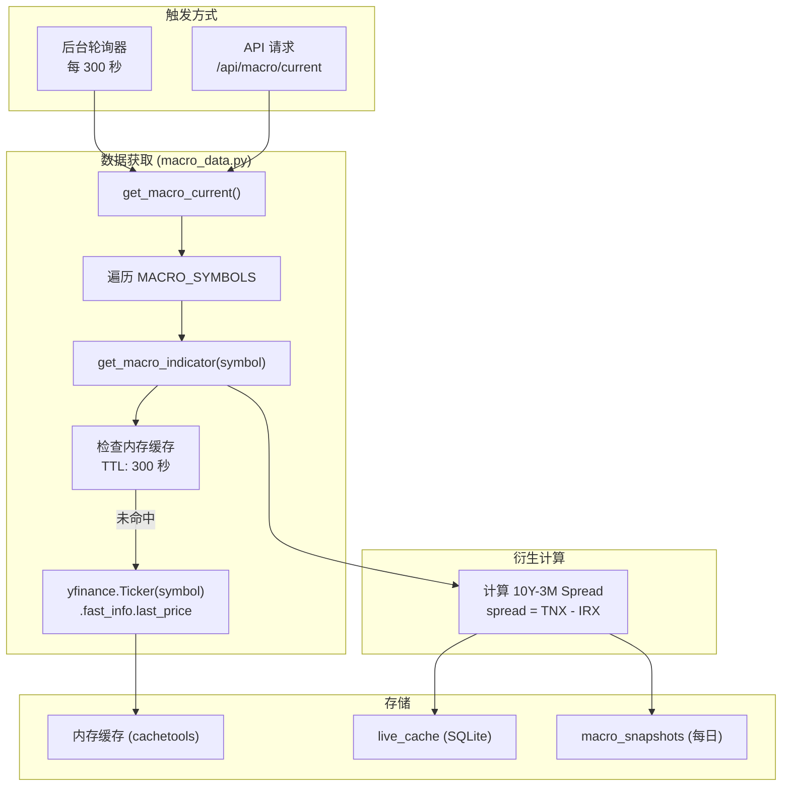
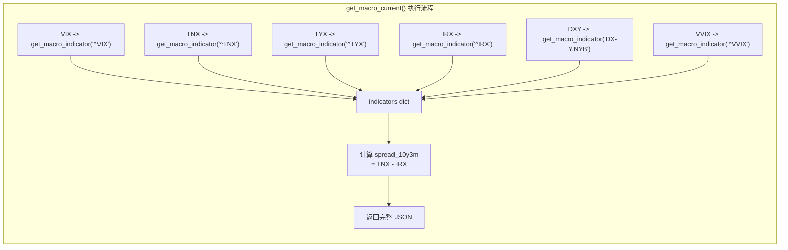
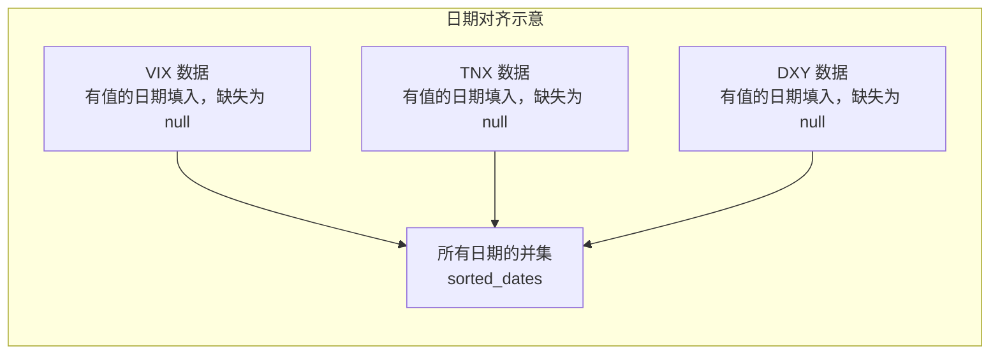
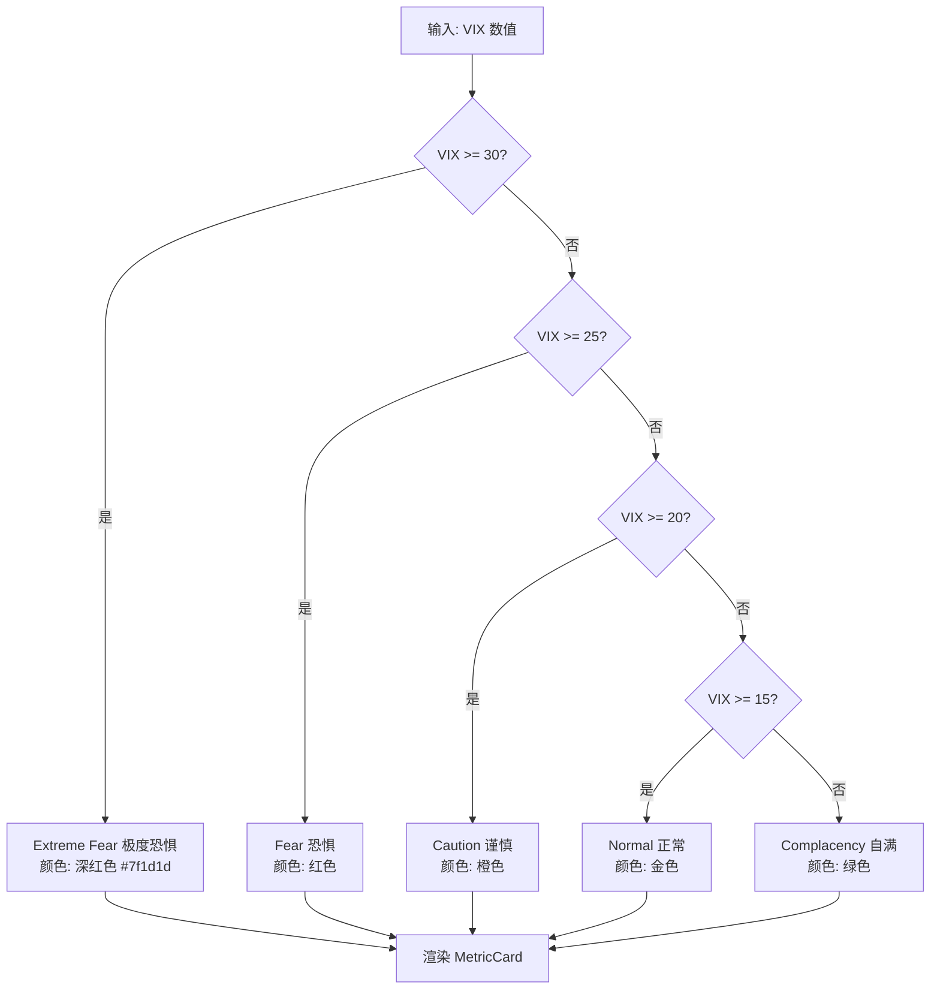
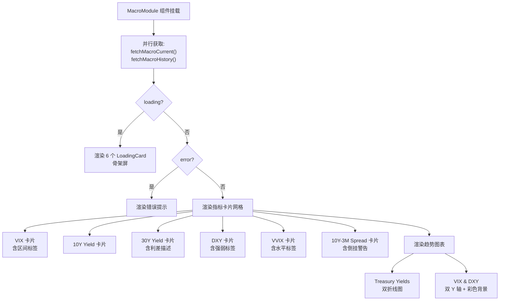
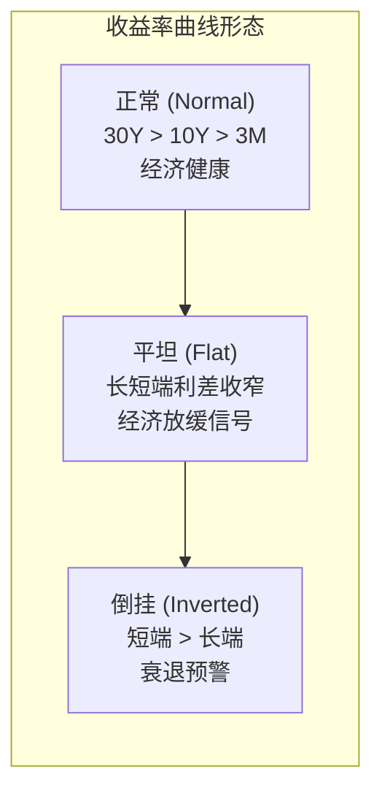

# 宏观指标 Macro Dashboard

宏观指标页面展示影响期权市场的实时宏观经济数据，帮助你从宏观层面理解市场环境。本文档将深入讲解宏观数据的获取机制、指标计算逻辑、VIX 区间分类以及前端图表配置。

## 概述

页面展示以下六项宏观指标：

- **VIX** — CBOE 波动率指数（"恐慌指数"）
- **10Y Yield (TNX)** — 10 年期美国国债收益率
- **30Y Yield (TYX)** — 30 年期美国国债收益率
- **DXY** — 美元指数
- **VVIX** — VIX 的波动率（"波动率的波动率"）
- **10Y-3M Spread** — 10 年期与 3 个月国债收益率之差

这些是 **全局指标**，不需要选择标的。数据每 5 分钟自动刷新。

### 如何访问

```
/macro
```

API 接口：

```bash
curl http://localhost:5001/api/macro/current
```

历史数据：

```bash
curl "http://localhost:5001/api/macro/history?indicators=VIX,TNX,DXY&days=90"
```

---

## 宏观数据处理管线

宏观数据从 Yahoo Finance 获取，经过缓存、计算衍生指标后返回前端。



---

## 后端：宏观数据获取服务

### 宏观指标符号映射

在 `backend/config.py` 中定义了宏观指标的 yfinance 符号映射：

```python
# backend/config.py (第 61-68 行)
MACRO_SYMBOLS = {
    "VIX": "^VIX",         # CBOE 波动率指数
    "TNX": "^TNX",         # 10 年期国债收益率
    "TYX": "^TYX",         # 30 年期国债收益率
    "IRX": "^IRX",         # 13 周国债收益率 (3 个月)
    "DXY": "DX-Y.NYB",     # 美元指数
    "VVIX": "^VVIX",       # VIX 的波动率
}
```

注意 yfinance 中的符号格式：大多数指数以 `^` 前缀，而 DXY 使用的是 `DX-Y.NYB`（纽约期货交易所代码）。

### 单个指标获取

```python
# backend/services/macro_data.py (第 18-41 行)
def get_macro_indicator(symbol: str) -> dict:
    """获取单个宏观指标的当前值。"""
    cache_key = f"macro:{symbol}"

    # 第一步: 检查内存缓存
    cached = cache.get(cache_key)
    if cached:
        return cached

    # 第二步: 速率限制等待
    rate_limiter.wait()

    # 第三步: 从 yfinance 获取
    t = yf.Ticker(symbol)
    try:
        price = float(t.fast_info.last_price)
        result = {
            "symbol": symbol,
            "value": round(price, 2),
            "updated_at": datetime.now(timezone.utc).isoformat(),
        }
        cache.set(cache_key, result)
        return result
    except Exception as e:
        logger.warning(f"Failed to fetch macro indicator {symbol}: {e}")
        if cached:
            return cached  # 返回过期缓存
        raise
```

关键设计点：

1. **双层缓存**：先检查内存缓存（`cachetools.TTLCache`），命中则直接返回
2. **速率限制**：通过 `rate_limiter.wait()` 控制对 yfinance 的请求频率
3. **优雅降级**：如果网络请求失败但有过期缓存，返回过期缓存而不是报错

### 全量指标获取

```python
# backend/services/macro_data.py (第 44-66 行)
def get_macro_current() -> dict:
    """获取所有宏观指标的当前值并计算衍生指标。"""
    indicators = {}

    # 遍历所有配置的宏观指标
    for name, symbol in Config.MACRO_SYMBOLS.items():
        try:
            result = get_macro_indicator(symbol)
            indicators[name.lower()] = result["value"]
        except Exception as e:
            logger.error(f"Macro indicator {name} ({symbol}) failed: {e}")
            indicators[name.lower()] = None  # 失败时设为 None

    # 计算衍生指标: 10Y-3M 期限利差
    tnx_val = indicators.get("tnx")
    irx_val = indicators.get("irx")
    indicators["spread_10y3m"] = (
        round(tnx_val - irx_val, 2)
        if (tnx_val is not None and irx_val is not None)
        else None
    )

    return {
        "indicators": indicators,
        "updated_at": datetime.now(timezone.utc).isoformat(),
    }
```



### 历史数据获取

```python
# backend/services/macro_data.py (第 69-87 行)
def get_macro_history(symbol: str, period: str = "90d") -> pd.DataFrame:
    """获取宏观指标的历史 OHLCV 数据。"""
    cache_key = f"macro_hist:{symbol}:{period}"

    # 检查缓存
    cached = cache.get(cache_key)
    if cached is not None:
        return cached

    rate_limiter.wait()
    t = yf.Ticker(symbol)

    try:
        df = t.history(period=period)
        cache.set(cache_key, df)
        return df
    except Exception as e:
        logger.warning(f"Failed to get macro history for {symbol}: {e}")
        if cached is not None:
            return cached
        raise
```

---

## 后端：API 处理器

### 当前值 API: `/api/macro/current`

```python
# backend/api/macro.py (第 23-37 行)
@macro_bp.route("/api/macro/current", methods=["GET"])
def macro_current():
    """获取所有宏观指标的当前快照。"""
    # 优先使用 live_cache
    cached = get_cached(MACRO_CACHE_TICKER, "current")
    if cached:
        return jsonify(cached)

    try:
        data = get_macro_current()
        return jsonify(data)
    except Exception as e:
        logger.exception("Macro current fetch failed")
        return data_source_error(MACRO_CACHE_TICKER, "macro_current", e)
```

注意宏指标使用特殊的缓存 ticker `"MACRO"`（不是具体的股票代码）。

### 历史数据 API: `/api/macro/history`

这个 API 支持同时请求多个指标的历史数据，并将它们按日期对齐。

```python
# backend/api/macro.py (第 40-100 行)
@macro_bp.route("/api/macro/history", methods=["GET"])
def macro_history():
    """获取请求的宏观指标历史时间序列。"""
    indicators_str = request.args.get("indicators", "VIX").upper()
    days = int(request.args.get("days", 90))

    requested = [name.strip() for name in indicators_str.split(",") if name.strip()]
    valid_indicators = []
    for name in requested:
        if name == "SPREAD":
            valid_indicators.append(name)
        elif name in Config.MACRO_SYMBOLS:
            valid_indicators.append(name)

    if not valid_indicators:
        return error_response(
            "invalid_indicators",
            f"No valid indicators. Valid: {list(Config.MACRO_SYMBOLS.keys())}, SPREAD",
            status=400,
        )

    try:
        series = {}
        all_dates = set()

        for name in valid_indicators:
            if name == "SPREAD":
                # SPREAD 需要分别获取 TNX 和 IRX 然后相减
                tnx_df = get_macro_history(Config.MACRO_SYMBOLS["TNX"], f"{days}d")
                irx_df = get_macro_history(Config.MACRO_SYMBOLS["IRX"], f"{days}d")
                common = tnx_df.index.intersection(irx_df.index)
                values = {}
                for dt in common:
                    values[dt.strftime("%Y-%m-%d")] = round(
                        float(tnx_df.loc[dt, "Close"]) - float(irx_df.loc[dt, "Close"]), 2
                    )
                series["spread"] = values
                all_dates.update(values.keys())
            else:
                symbol = Config.MACRO_SYMBOLS[name]
                df = get_macro_history(symbol, f"{days}d")
                values = {}
                for dt in df.index:
                    values[dt.strftime("%Y-%m-%d")] = round(float(df.loc[dt, "Close"]), 2)
                series[name.lower()] = values
                all_dates.update(values.keys())

        # 按日期对齐所有指标
        sorted_dates = sorted(all_dates)
        response = {
            "indicators": [name.lower() if name != "SPREAD" else "spread"
                           for name in valid_indicators],
            "dates": sorted_dates,
        }

        for key, date_map in series.items():
            response[key] = [date_map.get(d) for d in sorted_dates]

        response["updated_at"] = datetime.now(timezone.utc).isoformat()
        return jsonify(response)

    except Exception as e:
        logger.exception("Macro history fetch failed")
        return data_source_error(MACRO_CACHE_TICKER, "macro_history", e)
```

### 历史数据对齐逻辑

当请求多个指标时，不同指标的交易日可能不完全一致（例如某些市场假日）。API 使用 **外连接对齐** 策略：



在前端，ECharts 会自动处理 `null` 值（断开折线）。

---

## VIX 区间分类

VIX 是最重要的宏观指标之一。OptionDash 将 VIX 划分为五个区间，每个区间对应不同的市场情绪。

### 分类逻辑（前端）

```typescript
// frontend/src/modules/macro/index.tsx (第 10-16 行)
function getVixRegime(vix: number): { label: string; color: string } {
  if (vix >= VIX_LEVELS.HIGH)      return { label: 'Extreme Fear', color: '#7f1d1d' };
  if (vix >= VIX_LEVELS.ELEVATED)  return { label: 'Fear', color: 'red' };
  if (vix >= VIX_LEVELS.MODERATE)  return { label: 'Caution', color: 'orange' };
  if (vix >= VIX_LEVELS.LOW)       return { label: 'Normal', color: 'gold' };
  return { label: 'Complacency', color: 'green' };
}
```

### 阈值定义

```typescript
// frontend/src/utils/constants.ts (第 33-38 行)
export const VIX_LEVELS = {
  LOW: 15,        // 15 以下: 自满
  MODERATE: 20,   // 15-20: 正常
  ELEVATED: 25,   // 20-25: 谨慎
  HIGH: 30,       // 25-30: 恐惧; 30+: 极度恐惧
} as const;
```

### VIX 区间分类流程图



### VIX 区间详解

| VIX 范围 | 状态 | 含义 | 市场情绪 |
|----------|------|------|----------|
| `< 15` | 自满 (Complacency) | 波动率极低，市场风平浪静 | 乐观但可能过于放松 |
| 15 - 20 | 正常 (Normal) | 典型的市场波动水平 | 正常 |
| 20 - 25 | 谨慎 (Caution) | 不确定性上升 | 开始紧张 |
| 25 - 30 | 恐惧 (Fear) | 显著的市场压力 | 恐慌 |
| `> 30` | 极度恐惧 (Extreme Fear) | 危机级别的恐慌 | 极度恐慌 |

---

## 前端组件

### 数据获取

MacroModule 不需要选择标的，直接获取全局宏观数据。

```typescript
// frontend/src/modules/macro/index.tsx (第 18-27 行)
const MacroModule: React.FC = () => {
  // 获取当前值
  const fetchCurrentFn = useCallback(() => fetchMacroCurrent(), []);
  const { data, loading, error, refetch } = useTickerData<MacroCurrentResponse>(fetchCurrentFn);

  // 获取历史数据（VIX, TNX, TYX, DXY 四个指标，90 天）
  const fetchHistFn = useCallback(
    () => fetchMacroHistory(['VIX', 'TNX', 'TYX', 'DXY'], 90),
    [],
  );
  const { data: histData, loading: histLoading } = useTickerData<MacroHistoryResponse>(fetchHistFn);

  useAutoRefresh(refetch);  // 每 5 分钟自动刷新
```

### 衍生指标计算（前端）

除了后端返回的原始数据，前端还计算了一些衍生指标：

```typescript
// frontend/src/modules/macro/index.tsx (第 30-45 行)
const ind = data?.indicators;

// VIX 区间分类
const vixRegime = ind?.vix != null ? getVixRegime(ind.vix) : null;

// 30Y-10Y 利差
const yieldSpread = ind?.tnx != null && ind?.tyx != null
  ? (ind.tyx - ind.tnx).toFixed(2)
  : null;

// 期限利差信号
const spreadSignal = ind?.spread_10y3m != null
  ? ind.spread_10y3m >= 0
    ? { label: 'Normal', color: 'green' }
    : { label: 'Inverted', color: 'red' }
  : null;
```

### VIX & DXY 双 Y 轴图表

这是最复杂的图表，使用双 Y 轴并带有 VIX 区间的彩色背景带。

```typescript
// frontend/src/modules/macro/index.tsx (第 94-171 行)
const vixDxyOption = useMemo(() => {
  if (!histData) return {};
  const dates = histData.dates as string[] || [];
  const vixSeries = (histData as any).vix || [];
  const dxySeries = (histData as any).dxy || [];
  return {
    tooltip: { trigger: 'axis', /* ... */ },
    legend: { data: ['VIX', 'DXY'], top: 0 },
    grid: { top: 40, right: 80, bottom: 40, left: 60 },
    xAxis: { type: 'category', data: dates },
    yAxis: [
      { type: 'value', name: 'VIX', min: 0 },       // 左 Y 轴
      { type: 'value', name: 'DXY' },                // 右 Y 轴
    ],
    series: [
      {
        name: 'VIX',
        type: 'line',
        data: vixSeries,
        yAxisIndex: 0,
        smooth: true,
        lineStyle: { color: MACRO_COLORS.vix, width: 2 },
        itemStyle: { color: MACRO_COLORS.vix },
        // VIX 区间彩色背景带
        markArea: {
          silent: true,
          data: [
            [  // 自满区间 (0 - 15): 浅绿
              { yAxis: 0, itemStyle: { color: 'rgba(34, 197, 94, 0.06)' } },
              { yAxis: VIX_LEVELS.LOW, itemStyle: { color: 'rgba(34, 197, 94, 0.06)' } },
            ],
            [  // 正常区间 (15 - 20): 浅黄
              { yAxis: VIX_LEVELS.LOW, itemStyle: { color: 'rgba(250, 204, 21, 0.06)' } },
              { yAxis: VIX_LEVELS.MODERATE, itemStyle: { color: 'rgba(250, 204, 21, 0.06)' } },
            ],
            [  // 谨慎区间 (20 - 25): 浅橙
              { yAxis: VIX_LEVELS.MODERATE, itemStyle: { color: 'rgba(249, 115, 22, 0.08)' } },
              { yAxis: VIX_LEVELS.ELEVATED, itemStyle: { color: 'rgba(249, 115, 22, 0.08)' } },
            ],
            [  // 恐惧区间 (25 - 30): 浅红
              { yAxis: VIX_LEVELS.ELEVATED, itemStyle: { color: 'rgba(239, 68, 68, 0.10)' } },
              { yAxis: VIX_LEVELS.HIGH, itemStyle: { color: 'rgba(239, 68, 68, 0.10)' } },
            ],
            [  // 极度恐惧区间 (30+): 深红
              { yAxis: VIX_LEVELS.HIGH, itemStyle: { color: 'rgba(127, 29, 29, 0.12)' } },
              { itemStyle: { color: 'rgba(127, 29, 29, 0.12)' } },
            ],
          ],
        },
      },
      {
        name: 'DXY',
        type: 'line',
        data: dxySeries,
        yAxisIndex: 1,
        smooth: true,
        lineStyle: { color: MACRO_COLORS.dxy, width: 2 },
        itemStyle: { color: MACRO_COLORS.dxy },
      },
    ],
  };
}, [histData]);
```

### MetricCard 渲染

六张指标卡片使用统一的 `MetricCard` 组件：

```typescript
// frontend/src/modules/macro/index.tsx (第 197-261 行)
{/* VIX 卡片 */}
<MetricCard
  title="VIX"
  value={ind.vix?.toFixed(2) ?? '--'}
  tag={vixRegime || undefined}           // 区间标签
  description="CBOE Volatility Index — the 'fear gauge'"
  tooltip="VIX measures expected S&P 500 volatility."
/>

{/* 10Y-3M Spread 卡片 */}
<MetricCard
  title="10Y-3M Spread"
  value={ind.spread_10y3m?.toFixed(2) ?? '--'}
  suffix={<span className="text-sm text-gray-400">%</span>}
  tag={spreadSignal || undefined}        // Normal 或 Inverted
  description={ind.spread_10y3m != null
    ? ind.spread_10y3m < 0
      ? 'Yield curve inverted — recession warning'
      : 'Yield curve normal'
    : undefined}
  tooltip="10Y-3M yield spread. Inversion has historically preceded recessions."
/>
```

### 组件渲染流程



---

## 恐慌指数 (VIX)

VIX（CBOE Volatility Index）是衡量标普 500 指数 **预期波动率** 的指标，通常被称为 "恐慌指数"。它反映的是期权市场对未来 30 天波动的预期。

### 如何解读

- **VIX 低位（< 15）**：市场自满，期权定价便宜。但 "低波" 不等于 "安全"——历史表明极低的 VIX 之后往往会出现波动率飙升
- **VIX 快速上升**：通常伴随市场下跌，代表恐慌情绪蔓延
- **VIX 高位（> 30）**：市场极度恐慌。从逆向角度看，这可能是市场的恐慌性底部
- **VIX 从高位回落**：恐慌情绪消退，市场可能正在企稳

:::tip VIX 与期权策略
VIX 越高，期权越贵（隐含波动率越高）。在高 VIX 环境下卖出期权可以获得更高的权利金，但风险也更大。
:::

---

## 国债收益率 (Treasury Yields)

国债收益率是金融市场的基准利率，对股票估值和资金流向有重大影响。

### 10 年期国债收益率 (TNX)

10 年期国债收益率是最广泛引用的长期利率基准。

- **收益率上升** → 债券价格下跌 → 资金从股市流向债市 → 对成长股（科技股）形成压力
- **收益率下降** → 债券价格上涨 → 资金偏好风险资产 → 利好股市

### 30 年期国债收益率 (TYX)

30 年期收益率反映超长期利率预期，对房地产和长期投资有更大影响。

### 收益率曲线



---

## 美元指数 (DXY)

美元指数（DXY）衡量美元相对于一篮子主要货币的强弱。

### 强弱分界

以 **100** 作为强弱分界线：

| DXY 水平 | 状态 | 对市场的影响 |
|----------|------|------------|
| `> 100` | 强势美元 | 美国出口承压，跨国企业利润受挤压，新兴市场资金外流 |
| `< 100` | 弱势美元 | 有利于大宗商品和新兴市场，美国出口竞争力增强 |

### 如何解读

- **美元走强**：通常利空黄金、大宗商品和新兴市场股票；利空跨国公司（如 AAPL、MSFT 等海外收入占比高的公司）
- **美元走弱**：通常利好黄金、大宗商品和新兴市场
- **DXY 急剧变化**：无论方向，急剧变动都会引发市场波动

---

## VVIX（VIX 的波动率）

VVIX 衡量的是 VIX 期权的隐含波动率，也就是 **波动率的波动率**。它反映市场对未来 VIX 变动幅度的预期。

### 波动率区间

| VVIX 水平 | 状态 | 含义 |
|-----------|------|------|
| `> 120` | 高波动 | VIX 本身预期大幅波动，市场不确定性极高 |
| 90 - 120 | 正常 | 典型的 VIX 波动水平 |
| `< 90` | 低波动 | VIX 预期保持稳定，市场心态平稳 |

### 前端标签逻辑

```typescript
// frontend/src/modules/macro/index.tsx (第 239-245 行)
<MetricCard
  title="VVIX"
  value={ind.vvix?.toFixed(2) ?? '--'}
  tag={ind.vvix != null
    ? {
        label: ind.vvix >= 120 ? 'High' : ind.vvix >= 90 ? 'Normal' : 'Low',
        color: ind.vvix >= 120 ? 'red' : ind.vvix >= 90 ? 'blue' : 'green',
      }
    : undefined}
  description="Volatility of VIX"
  tooltip="VVIX measures the volatility of VIX itself."
/>
```

---

## 期限利差 (10Y-3M Spread)

期限利差是 10 年期国债收益率减去 3 个月国债收益率的差值，是最重要的经济衰退预警指标之一。

```
10Y-3M Spread = 10Y Yield (TNX) - 3M Yield (IRX)
```

### 后端计算

```python
# backend/services/macro_data.py (第 59-61 行)
tnx_val = indicators.get("tnx")
irx_val = indicators.get("irx")
indicators["spread_10y3m"] = (
    round(tnx_val - irx_val, 2)
    if (tnx_val is not None and irx_val is not None)
    else None
)
```

### 状态判定

| Spread 水平 | 状态 | 含义 |
|-------------|------|------|
| `> 0` | 正常（正斜率） | 收益率曲线正常，经济运行健康 |
| 接近 0 | 趋平 | 经济增长放缓信号 |
| `< 0` | 倒挂（负斜率） | 衰退预警信号 |

### 历史意义

:::warning 衰退信号
收益率曲线倒挂（10Y-3M Spread < 0）是历史上最可靠的经济衰退先行指标之一。在过去数十年的每次美国经济衰退之前，都出现了收益率曲线倒挂。通常在倒挂出现后的 6-18 个月内会发生衰退。
:::

---

## 趋势图表

宏观指标页面还包含趋势图表，帮助你观察各指标的历史走势。

### 国债收益率趋势

双折线图，展示 10 年期和 30 年期收益率的走势：

| 线条 | 颜色 | 说明 |
|------|------|------|
| 10Y Yield | 蓝色 | 10 年期国债收益率 |
| 30Y Yield | 紫色 | 30 年期国债收益率 |

两条线之间的距离即为期限利差的变化。

### VIX 与 DXY 趋势

双 Y 轴图表，VIX 在左侧 Y 轴，DXY 在右侧 Y 轴。图表背景带有 VIX 区间的彩色带状标注，方便直观判断当前的波动率状态。

---

## 宏观指标与期权交易

了解宏观指标的最终目的是指导期权交易决策。以下是各指标与期权策略的关联：

| 宏观信号 | 市场含义 | 期权策略参考 |
|----------|----------|------------|
| VIX 低位 + GEX 正 | 平静市场 | 可考虑卖出波动率策略（铁鹰、跨式卖出） |
| VIX 飙升 + GEX 负 | 恐慌 + 不稳定 | 谨慎开新仓，考虑买入保护性 Put |
| 收益率上升 + DXY 走强 | 利率压力 + 强美元 | 关注 IWM/QQQ 空头机会，TLT 可能承压 |
| 期限利差倒挂 | 衰退预期 | 增加下行保护，减少激进多头 |
| VVIX 飙升 | 不确定性极高 | 降低仓位，避免卖空波动率 |

:::tip 综合判断
永远不要仅凭单一宏观指标做交易决策。将宏观指标与标的级别的期权数据（PCR、GEX、Max Pain）结合起来分析，才能获得更全面的市场视角。
:::
