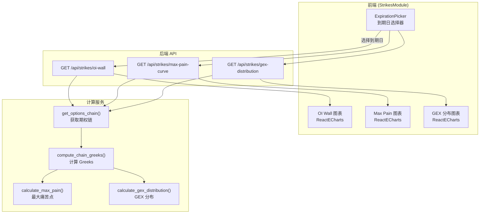
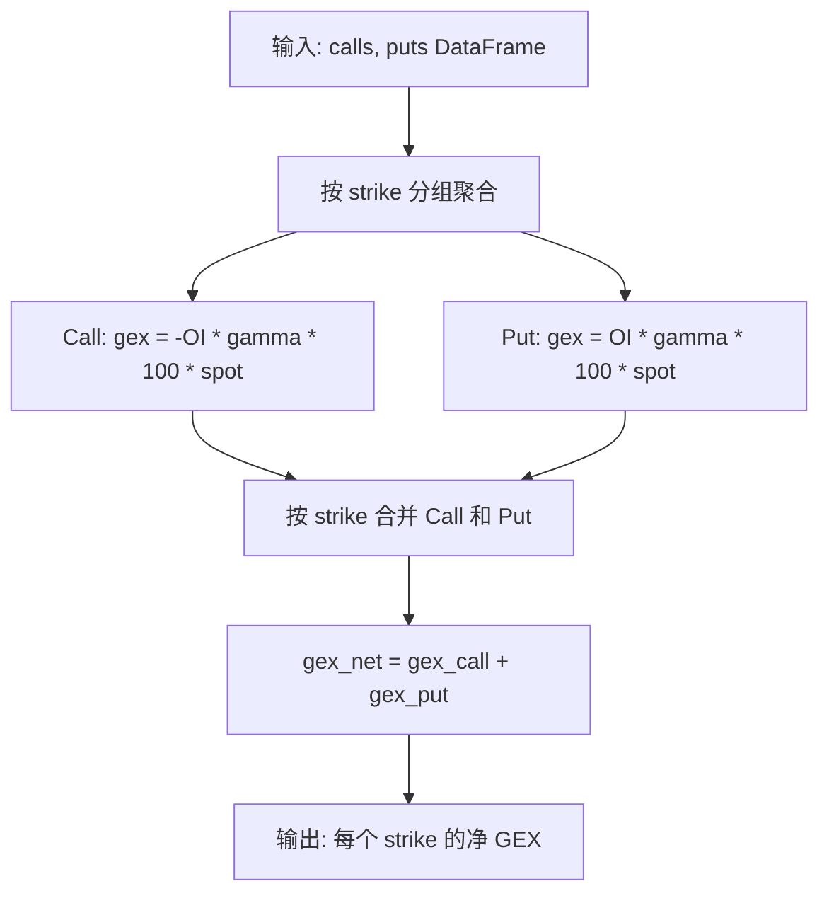
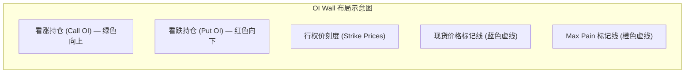
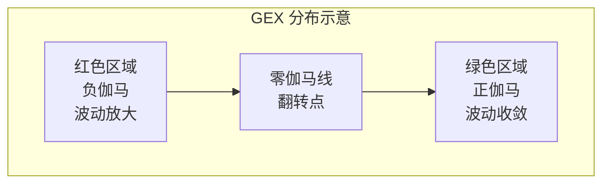

# 行权价分析 Strike Analysis

行权价分析页面提供三张交互式图表，帮助你从不同维度分析各 strike 价格上的期权分布情况。本文档将深入讲解每张图表的后端数据处理逻辑和前端 ECharts 配置代码。

## 概述

页面包含以下三张图表：

- **持仓量之墙 (OI Wall)** — 展示各行权价上的看涨/看跌持仓量分布
- **最大痛苦曲线 (Max Pain Curve)** — 展示期权卖方在不同结算价下的总亏损
- **伽马分布 (GEX Distribution)** — 展示各行权价上的伽马敞口分布

你可以在页面顶部的 **到期日选择器** 中切换不同的到期日，所有图表会同步更新。

:::info 交互功能
所有图表都支持鼠标悬停查看具体数值、滚轮缩放和拖拽平移。
:::

---

## 数据流全景

行权价分析页面需要并行获取三个 API 的数据，并在前端渲染三张独立的图表。



---

## 后端 API 处理器

所有 Strike 分析的 API 路由定义在 `backend/api/strikes.py` 中。

### 共用辅助函数

```python
# backend/api/strikes.py (第 28-35 行)
def _live_chain_fallback(ticker: str, expiration: str | None):
    """获取期权链数据：优先使用缓存，否则直接从 yfinance 获取。"""
    if expiration is None:
        chain = get_options_chain(ticker, expiration)
        return compute_chain_greeks(chain)
    chain = get_options_chain(ticker, expiration)
    return compute_chain_greeks(chain)
```

### OI Wall API: `/api/strikes/oi-wall`

这个 API 返回每个行权价上的 Call OI 和 Put OI 数据，用于渲染双向柱状图。

```python
# backend/api/strikes.py (第 38-75 行)
@strikes_bp.route("/api/strikes/oi-wall", methods=["GET"])
def oi_wall():
    ticker = request.args.get("ticker", "SPY").upper()
    expiration = request.args.get("expiration")
    err = _validate(ticker)
    if err:
        return err

    # 尝试实时缓存
    cached = get_cached(ticker, "oi_wall")
    if cached and (not expiration or cached.get("expiration") == expiration):
        return jsonify(cached)

    try:
        chain = _live_chain_fallback(ticker, expiration)
        max_pain_result = calculate_max_pain(chain["calls"], chain["puts"])
        chain = compute_chain_greeks(chain)

        # 解析 OI 列名
        oi_col_c = _col(chain["calls"], ("open_interest",))
        oi_col_p = _col(chain["puts"], ("open_interest",))

        # 收集所有行权价
        all_strikes = sorted(
            set(chain["calls"]["strike"].tolist()) | set(chain["puts"]["strike"].tolist())
        )

        # 构建 strike -> OI 的映射
        call_oi_map = dict(zip(chain["calls"]["strike"], chain["calls"][oi_col_c].fillna(0)))
        put_oi_map = dict(zip(chain["puts"]["strike"], chain["puts"][oi_col_p].fillna(0)))

        return jsonify({
            "ticker": ticker,
            "expiration": chain["expiration"],
            "spot_price": chain["spot_price"],
            "max_pain": max_pain_result["max_pain_strike"],
            "strikes": [round(s, 2) for s in all_strikes],
            "call_oi": [int(call_oi_map.get(s, 0)) for s in all_strikes],
            "put_oi": [int(put_oi_map.get(s, 0)) for s in all_strikes],
        })
    except Exception as e:
        logger.exception(f"OI wall fetch failed for {ticker}")
        return data_source_error(ticker, "oi_wall", e)
```

### Max Pain Curve API: `/api/strikes/max-pain-curve`

```python
# backend/api/strikes.py (第 78-102 行)
@strikes_bp.route("/api/strikes/max-pain-curve", methods=["GET"])
def max_pain_curve():
    ticker = request.args.get("ticker", "SPY").upper()
    expiration = request.args.get("expiration")
    err = _validate(ticker)
    if err:
        return err

    cached = get_cached(ticker, "max_pain_curve")
    if cached and (not expiration or cached.get("expiration") == expiration):
        return jsonify(cached)

    try:
        chain = _live_chain_fallback(ticker, expiration)
        max_pain_result = calculate_max_pain(chain["calls"], chain["puts"])
        return jsonify({
            "ticker": ticker,
            "expiration": chain["expiration"],
            "strikes": max_pain_result["strikes"],
            "total_loss": max_pain_result["total_loss"],
            "max_pain_strike": max_pain_result["max_pain_strike"],
        })
    except Exception as e:
        logger.exception(f"Max pain curve failed for {ticker}")
        return data_source_error(ticker, "max_pain_curve", e)
```

### GEX Distribution API: `/api/strikes/gex-distribution`

```python
# backend/api/strikes.py (第 105-131 行)
@strikes_bp.route("/api/strikes/gex-distribution", methods=["GET"])
def gex_distribution():
    ticker = request.args.get("ticker", "SPY").upper()
    expiration = request.args.get("expiration")
    err = _validate(ticker)
    if err:
        return err

    cached = get_cached(ticker, "gex_distribution")
    if cached and (not expiration or cached.get("expiration") == expiration):
        return jsonify(cached)

    try:
        chain = _live_chain_fallback(ticker, expiration)
        chain = compute_chain_greeks(chain)
        dist = calculate_gex_distribution(chain["calls"], chain["puts"], chain["spot_price"])
        return jsonify({
            "ticker": ticker,
            "expiration": chain["expiration"],
            "spot_price": chain["spot_price"],
            "strikes": dist["strikes"],
            "gex_per_strike": dist["gex_per_strike"],
            "total_gex": dist["total_gex"],
        })
    except Exception as e:
        logger.exception(f"GEX distribution failed for {ticker}")
        return data_source_error(ticker, "gex_distribution", e)
```

---

## GEX 分布计算详解

GEX 分布的计算比总 GEX 更复杂，因为它需要按行权价聚合。

```python
# backend/services/gex.py (第 59-102 行)
def calculate_gex_distribution(
    calls: pd.DataFrame,
    puts: pd.DataFrame,
    spot_price: float,
) -> dict:
    """按行权价计算 GEX 分布，用于图表渲染。"""

    gamma_col_c = _resolve_column(calls, ("gamma",))
    gamma_col_p = _resolve_column(puts, ("gamma",))
    oi_col_c = _resolve_column(calls, ("open_interest", "openinterest", "oi"))
    oi_col_p = _resolve_column(puts, ("open_interest", "openinterest", "oi"))

    # 按行权价聚合 Call 的 OI 和 gamma
    call_agg = calls.groupby("strike").agg(
        total_oi=(oi_col_c, "sum"),
        total_gamma=(gamma_col_c, "sum"),
    ).reset_index()
    # Call GEX 为负（做市商卖出 Call）
    call_agg["gex"] = -call_agg["total_oi"] * call_agg["total_gamma"] * 100 * spot_price

    # 按行权价聚合 Put 的 OI 和 gamma
    put_agg = puts.groupby("strike").agg(
        total_oi=(oi_col_p, "sum"),
        total_gamma=(gamma_col_p, "sum"),
    ).reset_index()
    # Put GEX 为正（做市商卖出 Put）
    put_agg["gex"] = put_agg["total_oi"] * put_agg["total_gamma"] * 100 * spot_price

    # 合并 Call 和 Put 的 GEX
    call_gex_s = call_agg[["strike", "gex"]].rename(columns={"gex": "gex_call"})
    put_gex_s = put_agg[["strike", "gex"]].rename(columns={"gex": "gex_put"})
    combined = pd.merge(call_gex_s, put_gex_s, on="strike", how="outer").fillna(0)
    combined["gex_net"] = combined["gex_call"] + combined["gex_put"]
    combined = combined.sort_values("strike")

    strikes = [round(s, 2) for s in combined["strike"].tolist()]
    gex_net = [round(g, 2) for g in combined["gex_net"].tolist()]

    return {
        "strikes": strikes,
        "gex_per_strike": gex_net,
        "total_gex": round(sum(gex_net), 2),
    }
```



注意乘数 `100 * spot_price`：每份期权合约代表 100 股，乘以现货价格将 per-share gamma 转换为美元金额。

---

## 前端图表配置

前端的 StrikesModule 组件使用 ECharts 渲染三张图表。所有图表配置都在 `useMemo` 中计算，确保只在数据变化时重新计算。

### 前端数据获取

```typescript
// frontend/src/modules/strikes/index.tsx (第 19-47 行)
const StrikesModule: React.FC<Props> = ({ ticker = 'SPY' }) => {
  const [expiration, setExpiration] = React.useState<string>();

  // 获取到期日列表
  const expFetchFn = useCallback(() => fetchExpirations(ticker), [ticker]);
  const { data: expData } = useTickerData(expFetchFn);

  // 默认选择第一个到期日
  React.useEffect(() => {
    if (expData?.expirations?.length && !expiration) {
      setExpiration(expData.expirations[0]);
    }
  }, [expData, expiration]);

  // 并行获取三个图表的数据
  const oiFetchFn = useCallback(
    () => fetchOIWall(ticker, expiration), [ticker, expiration],
  );
  const { data: oiData, loading: oiLoading } = useTickerData<OIWallData>(oiFetchFn);

  const mpFetchFn = useCallback(
    () => fetchMaxPainCurve(ticker, expiration), [ticker, expiration],
  );
  const { data: mpData, loading: mpLoading } = useTickerData<MaxPainCurveData>(mpFetchFn);

  const gexFetchFn = useCallback(
    () => fetchGEXDistribution(ticker, expiration), [ticker, expiration],
  );
  const { data: gexData, loading: gexLoading } = useTickerData<GEXDistributionData>(gexFetchFn);
```

### OI Wall 图表配置

OI Wall 使用 **堆叠柱状图**，Call OI 向上（正值），Put OI 向下（负值取反）。

```typescript
// frontend/src/modules/strikes/index.tsx (第 49-122 行)
const oiWallOption = React.useMemo(() => {
  if (!oiData) return {};
  const callData = oiData.call_oi;
  const putData = oiData.put_oi.map((v: number) => -v);  // Put 取反，向下显示

  return {
    tooltip: {
      trigger: 'axis',
      axisPointer: { type: 'shadow' },
      formatter: (params: any) => {
        const strike = params[0]?.axisValue;
        let html = `<strong>Strike: $${strike}</strong><br/>`;
        params.forEach((p: any) => {
          const val = Math.abs(p.value).toLocaleString();
          html += `${p.marker} ${p.seriesName}: ${val}<br/>`;
        });
        return html;
      },
    },
    legend: { data: ['Call OI', 'Put OI'], top: 0 },
    grid: { top: 40, right: 20, bottom: 50, left: 60 },
    xAxis: {
      type: 'category',
      data: oiData.strikes,
      name: 'Strike',
      axisLabel: {
        formatter: (v: string) => `$${Number(v).toFixed(0)}`,
        rotate: 45,  // 标签旋转 45 度避免重叠
      },
    },
    yAxis: {
      type: 'value',
      name: 'Open Interest',
      axisLabel: {
        formatter: (v: number) => Math.abs(v).toLocaleString(),  // 显示绝对值
      },
    },
    series: [
      {
        name: 'Call OI',
        type: 'bar',
        data: callData,
        itemStyle: { color: COLORS.green },
        stack: 'oi',  // 堆叠模式
      },
      {
        name: 'Put OI',
        type: 'bar',
        data: putData,  // 负值，向下显示
        itemStyle: { color: COLORS.red },
        stack: 'oi',
      },
    ],
  };
}, [oiData]);
```

**关键配置说明：**

| 配置项 | 值 | 作用 |
|--------|-----|------|
| `stack: 'oi'` | 堆叠模式 | Call 和 Put 共享同一组柱状 |
| `putData = put_oi.map(v => -v)` | 取反 | Put OI 向下显示 |
| `axisLabel.rotate: 45` | 旋转 45 度 | 避免行权价标签重叠 |
| `axisLabel.formatter: Math.abs(v)` | 绝对值 | Y 轴显示正数 |

### Max Pain Curve 图表配置

Max Pain Curve 使用 **平滑面积折线图**，并在谷底标记最大痛苦点。

```typescript
// frontend/src/modules/strikes/index.tsx (第 124-175 行)
const maxPainOption = React.useMemo(() => {
  if (!mpData) return {};
  const minIdx = mpData.total_loss.indexOf(Math.min(...mpData.total_loss));

  return {
    tooltip: { trigger: 'axis' },
    grid: { top: 20, right: 20, bottom: 50, left: 80 },
    xAxis: {
      type: 'category',
      data: mpData.strikes,
      name: 'Strike',
      axisLabel: {
        formatter: (v: string) => `$${Number(v).toFixed(0)}`,
        rotate: 45,
      },
    },
    yAxis: {
      type: 'value',
      name: 'Total Loss ($)',
      axisLabel: {
        formatter: (v: number) => {
          if (Math.abs(v) >= 1e9) return `$${(v / 1e9).toFixed(1)}B`;
          if (Math.abs(v) >= 1e6) return `$${(v / 1e6).toFixed(0)}M`;
          return `$${v}`;
        },
      },
    },
    series: [
      {
        type: 'line',
        data: mpData.total_loss,
        smooth: true,                    // 平滑曲线
        areaStyle: { color: COLORS.blueLight },  // 面积填充
        lineStyle: { color: COLORS.blue },
        itemStyle: { color: COLORS.blue },
        // 在谷底（最小值点）添加标记
        markPoints: minIdx >= 0
          ? {
              data: [{
                coord: [minIdx, mpData.total_loss[minIdx]],
                value: `Max Pain: $${mpData.max_pain_strike}`,
                itemStyle: { color: COLORS.orange },
              }],
            }
          : undefined,
      },
    ],
  };
}, [mpData]);
```

**关键设计：**

- `smooth: true` — 曲线平滑处理，视觉效果更好
- `areaStyle` — 面积填充，突出曲线形状
- `markPoints` — 在最小值点（谷底）添加橙色标记，标注 Max Pain 价格

### GEX Distribution 图表配置

GEX 分布使用 **彩色柱状图**，正 GEX 为绿色，负 GEX 为红色。

```typescript
// frontend/src/modules/strikes/index.tsx (第 177-238 行)
const gexDistOption = React.useMemo(() => {
  if (!gexData) return {};
  // 根据正负值设置颜色
  const barData = gexData.gex_per_strike.map((val: number, i: number) => ({
    value: val,
    itemStyle: { color: val >= 0 ? COLORS.green : COLORS.red },
  }));

  return {
    tooltip: {
      trigger: 'axis',
      axisPointer: { type: 'shadow' },
      formatter: (params: any) => {
        const value = params[0]?.value;
        return `<strong>Strike: $${params[0]?.axisValue}</strong><br/>
                GEX: ${value >= 0 ? '+' : ''}$${Math.abs(value).toLocaleString()}`;
      },
    },
    grid: { top: 20, right: 20, bottom: 50, left: 80 },
    xAxis: {
      type: 'category',
      data: gexData.strikes,
      name: 'Strike',
      axisLabel: {
        formatter: (v: string) => `$${Number(v).toFixed(0)}`,
        rotate: 45,
      },
    },
    yAxis: {
      type: 'value',
      name: 'Gamma Exposure ($)',
      axisLabel: {
        formatter: (v: number) => {
          if (Math.abs(v) >= 1e9) return `$${(v / 1e9).toFixed(1)}B`;
          if (Math.abs(v) >= 1e6) return `$${(v / 1e6).toFixed(0)}M`;
          return `$${v}`;
        },
      },
    },
    series: [{ type: 'bar', data: barData }],
    // 参考线
    markLine: {
      silent: true,
      symbol: 'none',
      data: [
        {
          yAxis: 0,  // 零伽马线
          lineStyle: { color: COLORS.gray, type: 'dashed' },
          label: { formatter: 'Zero Gamma', color: COLORS.gray },
        },
        {
          xAxis: gexData.spot_price,  // 现货价格线
          lineStyle: { color: COLORS.blue, type: 'dashed' },
          label: { formatter: `Spot $${gexData.spot_price}`, position: 'end', color: COLORS.blue },
        },
      ],
    },
  };
}, [gexData]);
```

**关键设计：**

- 每个柱状的颜色根据值的正负动态设置（绿色/红色）
- 两条参考线：零伽马水平线（灰色虚线）和现货价格垂直线（蓝色虚线）

---

## 持仓量之墙 (OI Wall)

OI Wall 是一张 **双向柱状图**，展示每个行权价上的看涨和看跌期权持仓量（Open Interest）。

### 图表布局



图表的结构如下：

| 元素 | 说明 |
|------|------|
| 绿色柱状 (向上) | 每个 strike 上的 **看涨期权 (Call)** 持仓量 |
| 红色柱状 (向下) | 每个 strike 上的 **看跌期权 (Put)** 持仓量 |
| 蓝色虚线 | 当前现货价格位置 |
| 橙色虚线 | 最大痛苦点位置 |

### 如何阅读

- **高耸的绿色柱状** — 该行权价有大量 Call OI 集中，可能形成 **阻力位**（因为 Call 卖方不希望价格涨过该点）
- **高耸的红色柱状** — 该行权价有大量 Put OI 集中，可能形成 **支撑位**（因为 Put 卖方不希望价格跌破该点）
- **OI 密集区域** — 反映市场参与者在这些价位上集中下注，价格在这些区域可能受到更多博弈

:::tip 实战应用
找出距离现货价格最近的高 OI 行权价，这些价位就是短期内最可能的支撑和阻力。
:::

---

## 最大痛苦曲线 (Max Pain Curve)

Max Pain Curve 是一张 **平滑的面积/折线图**，展示如果期权在某个结算价到期，所有期权卖方的总亏损金额。

### 曲线形状

典型的 Max Pain 曲线呈 **U 形或谷形**：

```text
亏损金额
    |
    |  \                     /
    |   \                   /
    |    \                 /
    |     \               /
    |      \    谷底     /
    |       \  (Max Pain)/
    |        \_________/
    +-------------------------> 结算价格
```

| 元素 | 说明 |
|------|------|
| 曲线 | 每个结算价格对应的期权卖方总亏损 |
| 谷底标记 | 最小亏损点，即 Max Pain 行权价 |

### 如何阅读

- **谷底位置** = 最大痛苦点，即期权卖方亏损最小的结算价
- **曲线越陡峭** — 偏离 Max Pain 时亏损急剧增加，说明 "引力" 越强，价格回归 Max Pain 的动力越大
- **曲线越平坦** — 期权卖方在不同结算价下亏损差异不大，价格可能缺乏明确方向

:::info 到期效应
Max Pain 的参考价值在临近到期日时最高。距离到期还有数周时，曲线可能较为平坦；临近到期最后几天，谷底效应最为明显。
:::

---

## 伽马分布 (GEX Distribution)

GEX Distribution 是一张 **彩色柱状图**，展示每个行权价上的净伽马敞口。

### 图表布局

| 元素 | 说明 |
|------|------|
| 绿色柱状 | 该行权价的 **正伽马** 敞口 |
| 红色柱状 | 该行权价的 **负伽马** 敞口 |
| 灰色虚线 | 零伽马分界线 |
| 蓝色虚线 | 当前现货价格位置 |

### 如何阅读

- **绿色区域（正伽马）** — 价格在这些区域时，做市商的对冲行为倾向于将价格拉回，起到 **稳定** 作用
- **红色区域（负伽马）** — 价格在这些区域时，做市商的对冲行为倾向于放大价格波动，起到 **不稳定** 作用
- **零伽马翻转点** — 正伽马和负伽马的交界处，市场动态在此处发生质变



**关键观察：**

- 当现货价格处于 **正伽马区域** 时，市场倾向于区间震荡
- 当现货价格处于 **负伽马区域** 时，市场容易出现趋势性行情
- 观察零伽马翻转点的位置，它标示着市场从 "稳定" 转为 "不稳定" 的临界价位

---

## 使用场景

以下是行权价分析的几个典型应用场景：

### 场景一：寻找支撑和阻力

1. 打开 **OI Wall** 图表
2. 找到现货价格附近的高 Call OI 行权价 → 潜在阻力位
3. 找到现货价格附近的高 Put OI 行权价 → 潜在支撑位

### 场景二：确定到期目标价

1. 打开 **Max Pain Curve** 图表
2. 读取谷底位置的行权价
3. 该价位就是期权到期时价格最可能趋向的目标

### 场景三：评估市场稳定性

1. 打开 **GEX Distribution** 图表
2. 确认当前现货价格处于正伽马还是负伽马区域
3. 结合零伽马翻转点的位置，判断市场是趋向稳定还是趋向动荡

### 场景四：跨到期日比较

使用到期日选择器，对比不同到期日的 OI Wall 和 GEX 分布，观察市场参与者在不同时间维度上的持仓分布变化。
