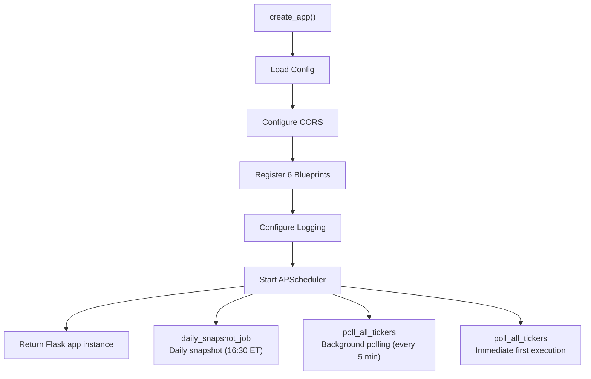
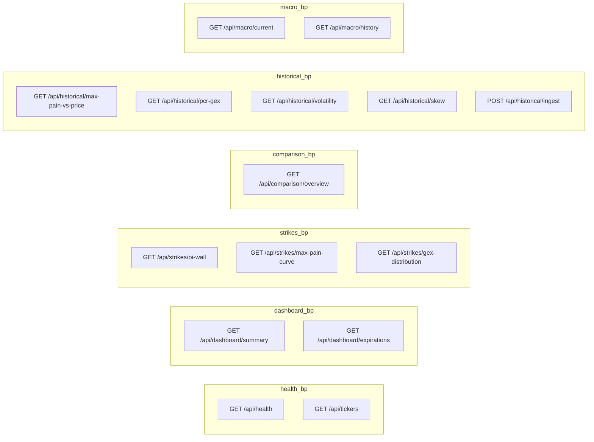
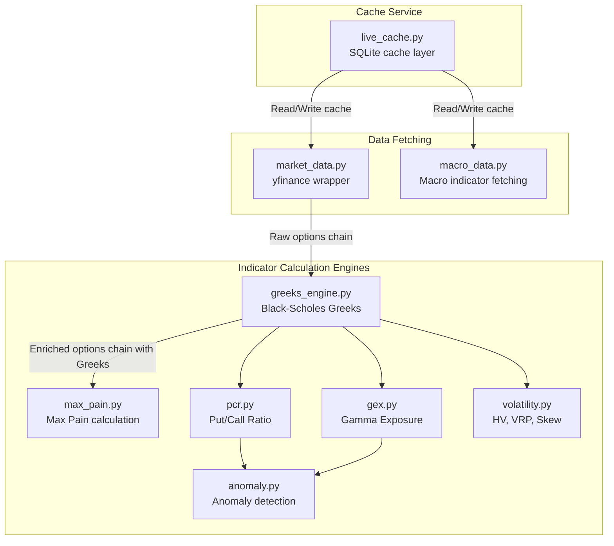
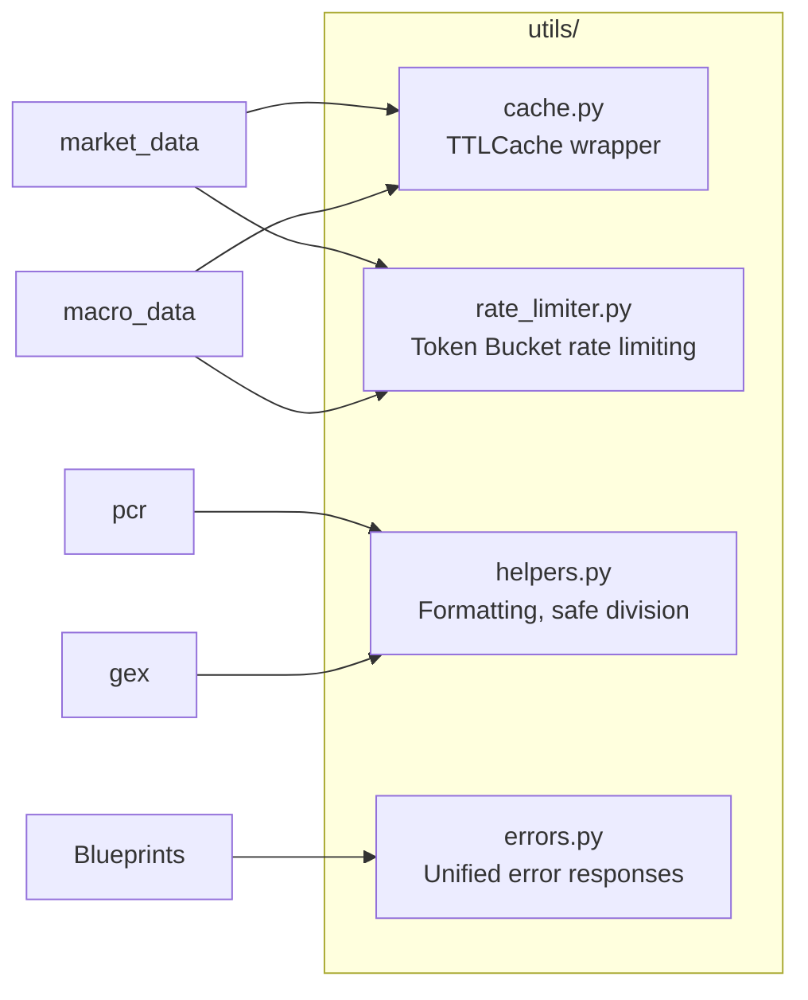
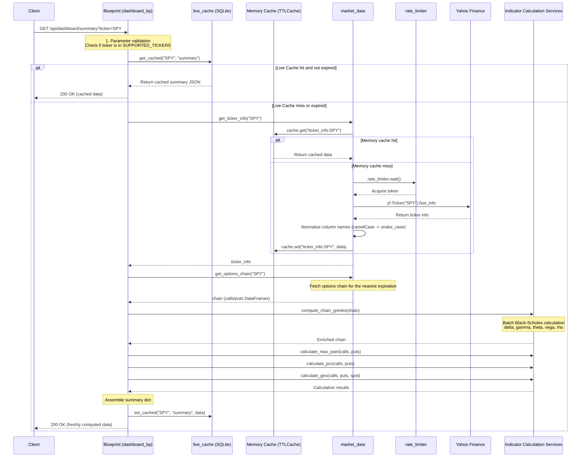

# Backend Architecture

The OptionDash backend uses the Flask application factory pattern, organizes routes through Blueprints, encapsulates business logic in the service layer, and provides infrastructure such as caching and rate limiting in the utility layer.

---

## Application Factory Pattern

The Flask application is created through the `create_app()` factory function located in `backend/app.py`. The factory function performs the following initialization steps:



**Startup Flow**:

1. Load configuration from the `Config` class (database path, cache TTL, supported tickers, etc.)
2. Configure CORS to allow cross-origin access from the frontend
3. Register 6 Blueprints in order
4. Configure log format and level
5. Start APScheduler and register scheduled tasks
6. Return the Flask application instance

---

## Blueprint Structure

The system has a total of 6 Blueprints, each responsible for a group of related API endpoints:



| Blueprint | Route Prefix | Endpoint Count | Responsibility |
|-----------|-------------|----------------|----------------|
| `health_bp` | `/api` | 2 | Health check, supported ticker list |
| `dashboard_bp` | `/api/dashboard` | 2 | Dashboard summary, expiration list |
| `strikes_bp` | `/api/strikes` | 3 | OI Wall, Max Pain curve, GEX distribution |
| `comparison_bp` | `/api/comparison` | 1 | Multi-ticker cross comparison |
| `historical_bp` | `/api/historical` | 4 GET + 1 POST | Historical trend data, data ingestion |
| `macro_bp` | `/api/macro` | 2 | Macroeconomic indicators (current and historical) |

---

## Service Layer

The service layer is the core business logic layer of the system. Each service module focuses on calculating a specific type of options analysis indicator:



### Service Module Details

| Module | File | Responsibility | Dependencies |
|--------|------|----------------|--------------|
| `market_data` | `services/market_data.py` | yfinance wrapper: fetch ticker info, expirations, options chain, historical prices | `utils/cache`, `utils/rate_limiter` |
| `greeks_engine` | `services/greeks_engine.py` | Batch calculation of Black-Scholes Greeks (delta, gamma, theta, vega, rho) | `py_vollib_vectorized`, `numpy` |
| `max_pain` | `services/max_pain.py` | Calculate Max Pain strike (the strike where option holders have minimum total loss) | `numpy`, `pandas` |
| `pcr` | `services/pcr.py` | Calculate Put/Call Ratio (volume ratio + OI ratio + composite signal) | `utils/helpers` |
| `gex` | `services/gex.py` | Calculate Gamma Exposure (dealer-perspective gamma exposure) | `numpy`, `pandas` |
| `volatility` | `services/volatility.py` | Calculate Historical Volatility (HV), ATM Implied Volatility (ATM IV), Volatility Risk Premium (VRP), 25-Delta Skew | `scipy`, `numpy` |
| `anomaly` | `services/anomaly.py` | Anomaly detection: PCR extremes, large price moves, OI spikes, GEX sign flips | `numpy` |
| `macro_data` | `services/macro_data.py` | Fetch macroeconomic indicators: VIX, TNX, TYX, IRX, DXY, VVIX | `yfinance`, `utils/cache`, `utils/rate_limiter` |
| `live_cache` | `services/live_cache.py` | SQLite cache layer: read, write, expiration check, cleanup old entries | `database.connection` |

---

## Utility Layer

The utility layer provides infrastructure for cross-cutting concerns:



| Module | File | Responsibility |
|--------|------|----------------|
| `CacheManager` | `utils/cache.py` | In-memory cache based on `cachetools.TTLCache`, TTL 5 minutes, max 128 entries |
| `RateLimiter` | `utils/rate_limiter.py` | Token Bucket algorithm rate limiting, default 2 requests/second, thread-safe |
| `helpers` | `utils/helpers.py` | Utility functions: `safe_divide`, `safe_float`, `safe_int`, `format_large_number`, etc. |
| `errors` | `utils/errors.py` | Unified error response format with error, message, and details fields |

---

## Request Handling Flow

Using `GET /api/dashboard/summary?ticker=SPY` as an example, here is the complete request handling flow:



---

## Error Handling

The backend uses a unified error response format:

```json
{
  "error": "Bad Request",
  "message": "Ticker 'INVALID' is not supported",
  "details": {
    "supported_tickers": ["SPY", "QQQ", "IWM", "TLT", "XLF"]
  }
}
```

Error handling strategy:

- **Parameter validation errors**: Return 400 Bad Request
- **Data source unavailable**: Attempt to return stale cached data; return 503 if no cache is available
- **Internal errors**: Return 500 Internal Server Error with detailed logging
- **Greeks calculation failure**: Automatically fall back to per-contract calculation (batch -> per-contract fallback)
