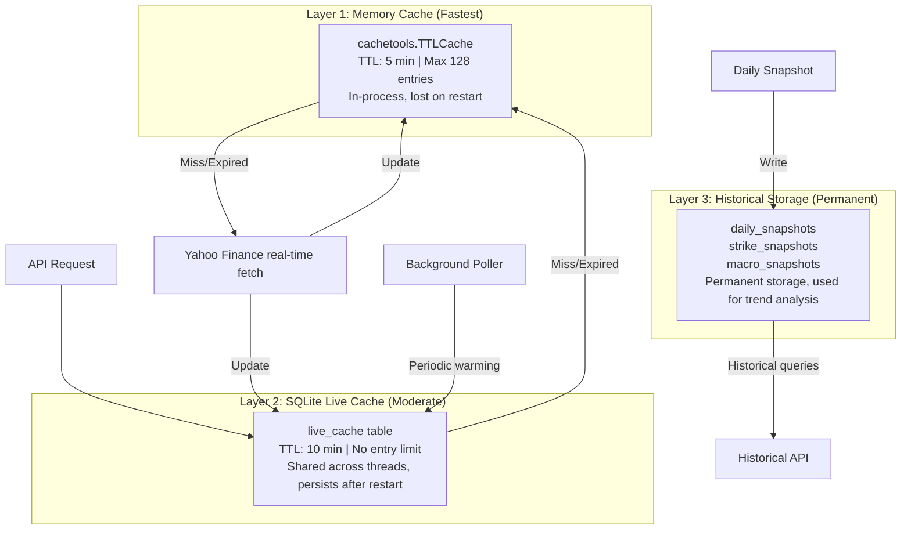
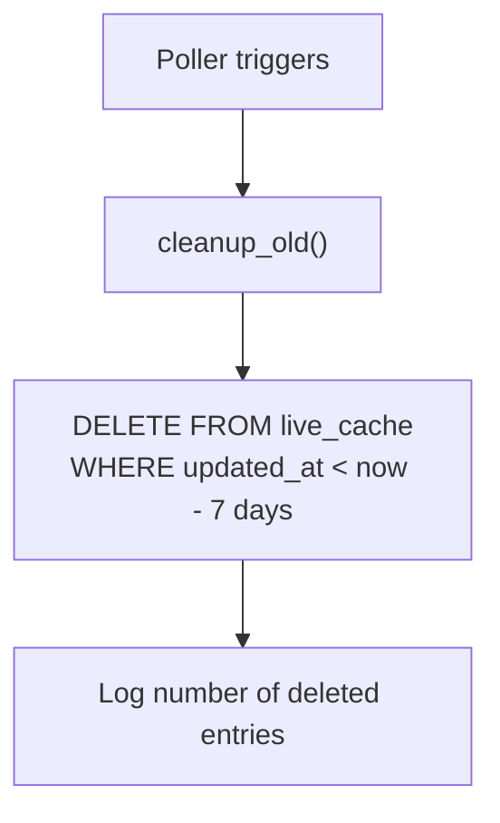
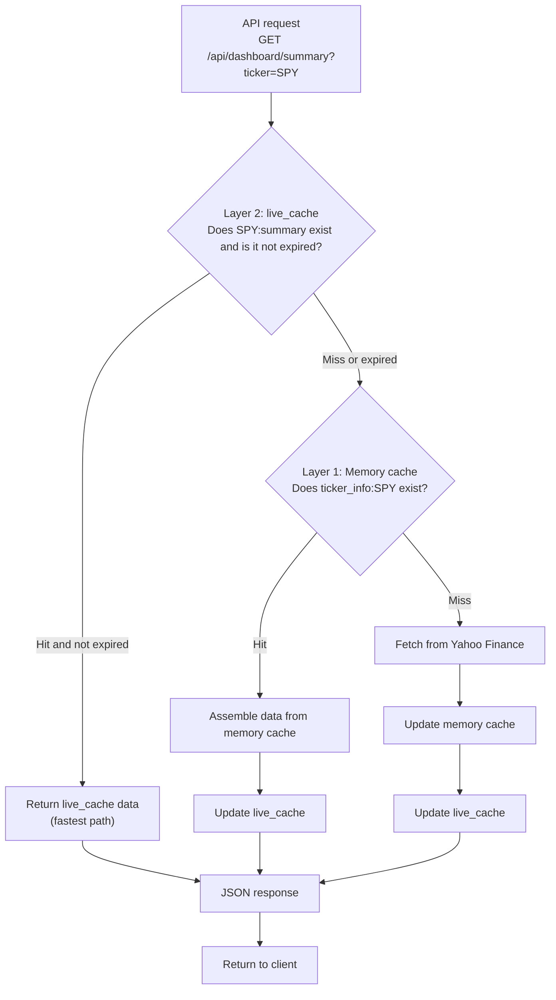
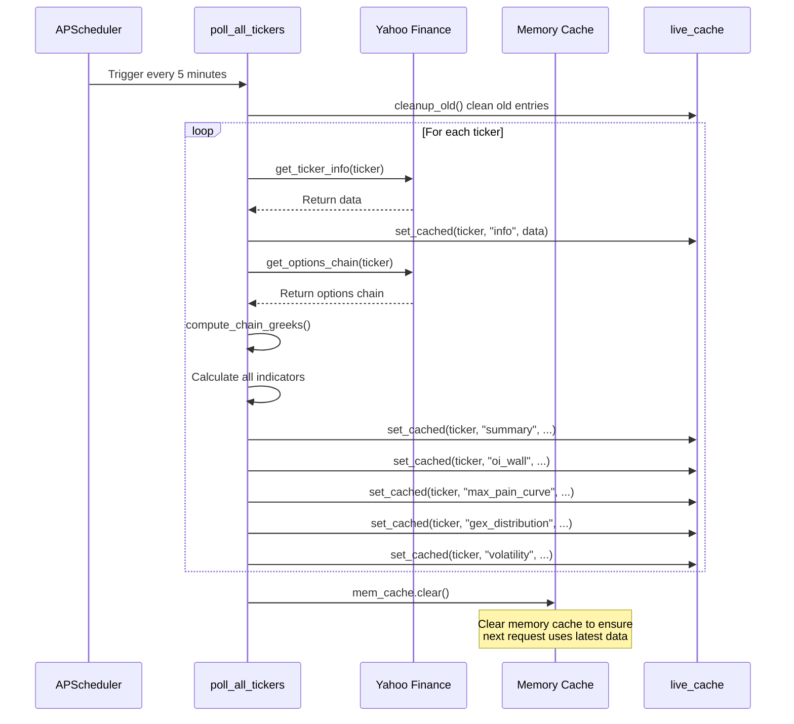

# Caching Strategy

OptionDash uses a three-layer cache architecture that balances data freshness, access speed, and persistence. Fetching data from Yahoo Finance has high latency (including network and rate limiting), so caching is critical for ensuring fast API responses.

---

## Three-Layer Cache Architecture



---

## Layer 1: In-Memory TTL Cache

The memory cache is the fastest cache layer, residing in process memory, used to avoid redundant yfinance calls.

### Implementation

```python
# utils/cache.py
from cachetools import TTLCache

class CacheManager:
    def __init__(self, maxsize=128, ttl=300):
        self._cache = TTLCache(maxsize=maxsize, ttl=ttl)
```

### Properties

| Attribute | Value | Description |
|-----------|-------|-------------|
| Technology | `cachetools.TTLCache` | Time-based automatic expiration cache |
| TTL | 300 seconds (5 minutes) | Configurable via `CACHE_TTL` environment variable |
| Max entries | 128 | Configurable via `CACHE_MAX_SIZE` environment variable |
| Thread-safe | No (single-thread access) | Each request thread accesses independently |
| Persistence | None | Lost on process restart |

### Cache Key Format

| Key Format | Data | Used By |
|------------|------|---------|
| `ticker_info:{ticker}` | Ticker info (price, change) | `market_data.get_ticker_info()` |
| `expirations:{ticker}` | Expiration date list | `market_data.get_expirations()` |
| `chain:{ticker}:{expiration}` | Complete options chain | `market_data.get_options_chain()` |
| `hist_price:{ticker}:{period}` | Historical prices | `market_data.get_historical_prices()` |
| `macro:{symbol}` | Current macro indicator value | `macro_data.get_macro_indicator()` |
| `macro_hist:{symbol}:{period}` | Macro indicator historical data | `macro_data.get_macro_history()` |

---

## Layer 2: SQLite Live Cache

Live Cache is the intermediate cache layer stored in the SQLite database. API endpoints read directly from it to avoid calling the service layer for every request.

### Implementation

```python
# services/live_cache.py
def get_cached(ticker: str, cache_key: str) -> dict | None:
    """Read from live_cache table, return None if expired."""
    row = db.execute_one(
        "SELECT data_json, updated_at FROM live_cache WHERE ticker = ? AND cache_key = ?",
        (ticker.upper(), cache_key),
    )
    if not row:
        return None
    age = (datetime.now(timezone.utc) - updated_at).total_seconds()
    if age > Config.LIVE_CACHE_TTL_SEC:
        return None
    return json.loads(row["data_json"])
```

### Properties

| Attribute | Value | Description |
|-----------|-------|-------------|
| Technology | SQLite `live_cache` table | JSON serialized storage |
| TTL | 600 seconds (10 minutes) | Configurable via `LIVE_CACHE_TTL_SEC` environment variable |
| Entry limit | Unlimited | Controlled through periodic cleanup |
| Retention period | 7 days | Entries older than 7 days are automatically deleted |
| Thread-safe | Yes | SQLite WAL mode supports concurrent reads |

### Cache Key Format

| Key Format | Data | Description |
|------------|------|-------------|
| `{ticker}:summary` | Dashboard summary | Includes spot_price, max_pain, pcr, gex, etc. |
| `{ticker}:info` | Ticker info | Price, change percentage |
| `{ticker}:expirations` | Expiration date list | Available option expiration dates |
| `{ticker}:oi_wall` | OI Wall data | Call/put open interest at each strike |
| `{ticker}:max_pain_curve` | Max Pain curve | Total loss at each strike |
| `{ticker}:gex_distribution` | GEX distribution | Gamma exposure at each strike |
| `{ticker}:volatility` | Volatility indicators | ATM IV, HV30, VRP, Skew |
| `MACRO:current` | Macro indicators | VIX, TNX, DXY, etc. |

### Cleanup Mechanism



- Cleanup is executed at the start of each polling cycle
- Deletes entries older than `LIVE_CACHE_RETENTION_DAYS` (default 7 days)
- The `idx_live_cache_updated` index speeds up cleanup queries

---

## Layer 3: Historical Storage

Historical storage is the lowest persistence layer, used to store daily snapshot data and support historical trend analysis.

### Storage Tables

| Table | Granularity | Purpose |
|-------|------------|---------|
| `daily_snapshots` | 1 row per ticker per day | Aggregated indicator trends (max_pain, pcr, gex, iv) |
| `strike_snapshots` | 1 row per strike per day | Strike-level OI, volume, IV, Greeks |
| `macro_snapshots` | 1 row per day | Macroeconomic indicator trends |

### Write Timing

- **Daily snapshot task**: Automatically triggered at 16:30 Eastern Time (after market close)
- **Manual write**: The `POST /api/historical/ingest` endpoint supports manual data ingestion

---

## Cache Hit Flow



### Cache Strategy Decision Matrix

| Scenario | Layer 1 (Memory) | Layer 2 (Live Cache) | Layer 3 (History) | Behavior |
|----------|-----------------|---------------------|-------------------|----------|
| High-frequency API request | Hit | Hit | - | Return Layer 2 data directly |
| First request after polling | May hit | Hit | - | Return Layer 2 data |
| Cache expired | May hit | Expired | - | Fetch from Layer 1 or real-time, update Layer 2 |
| All misses | Miss | Miss | - | Real-time fetch, update all layers |
| Historical trend query | - | - | Query | Query historical tables directly |

---

## Background Polling and Cache Warming

The background poller is an important part of the caching strategy, ensuring high API hit rates through periodic warming:



---

## Configuration Parameters

All cache-related parameters can be configured via environment variables:

| Parameter | Environment Variable | Default Value | Description |
|-----------|---------------------|---------------|-------------|
| Memory cache TTL | `CACHE_TTL` | 300 (5 minutes) | Layer 1 expiration time |
| Memory cache capacity | `CACHE_MAX_SIZE` | 128 | Layer 1 maximum number of entries |
| Live Cache TTL | `LIVE_CACHE_TTL_SEC` | 600 (10 minutes) | Layer 2 expiration threshold |
| Live Cache retention | `LIVE_CACHE_RETENTION_DAYS` | 7 (days) | Entries older than this are cleaned up |
| Polling interval | `POLL_INTERVAL_SEC` | 300 (5 minutes) | Background poller trigger interval |
