# Data Pipeline

The OptionDash data pipeline is responsible for fetching raw market data from Yahoo Finance, processing it through cleaning, Greeks calculation, and indicator aggregation, and ultimately returning structured JSON responses to the frontend or storing data in cache/historical tables.

---

## Full Data Fetching Flow

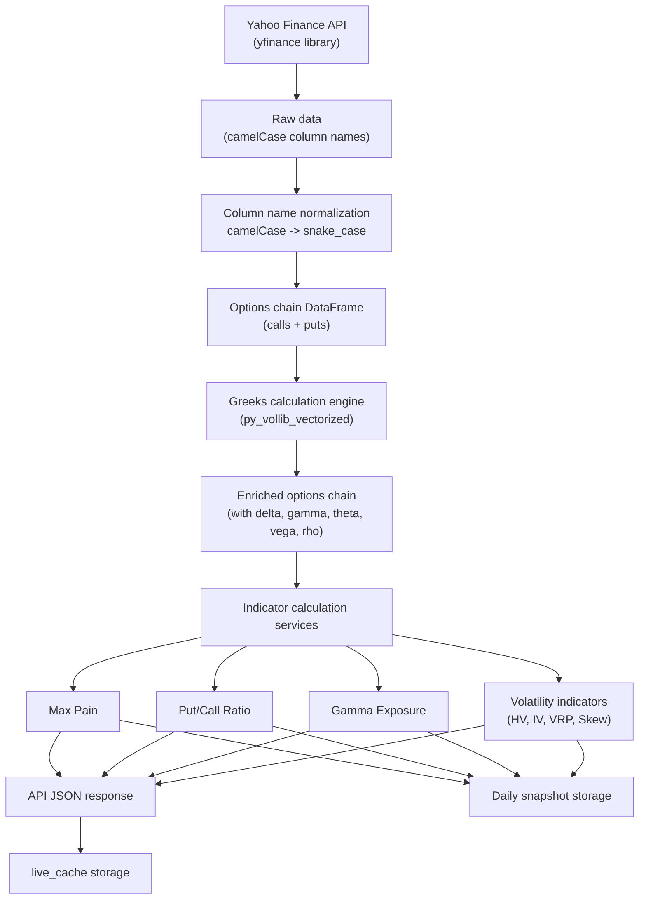

---

## Yahoo Finance Integration

OptionDash accesses Yahoo Finance data through the `yfinance` library. The integration layer is encapsulated in `services/market_data.py` and provides the following core functions:

| Function | Return Value | Description |
|----------|-------------|-------------|
| `get_ticker_info(ticker)` | `dict` | Current price, intraday change, 52-week range |
| `get_expirations(ticker)` | `list[str]` | List of available option expiration dates |
| `get_options_chain(ticker, expiration)` | `dict` | Complete options chain (calls/puts DataFrame + spot_price) |
| `get_historical_prices(ticker, period)` | `DataFrame` | Historical OHLCV data |

### Column Name Normalization

DataFrames returned by yfinance use camelCase column names. The system uniformly converts them to snake_case:

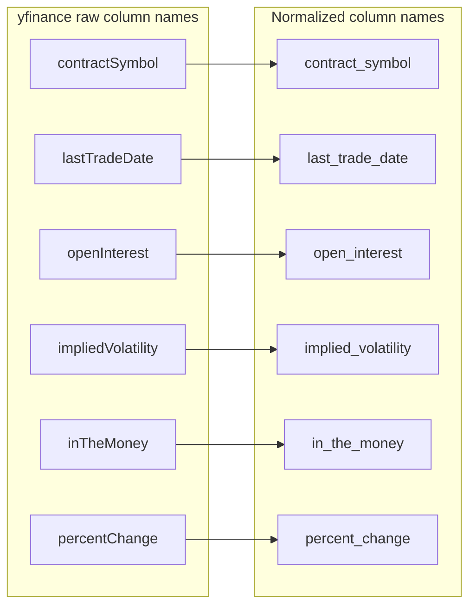

### Rate Limiting

All requests to Yahoo Finance pass through a Token Bucket rate limiter:

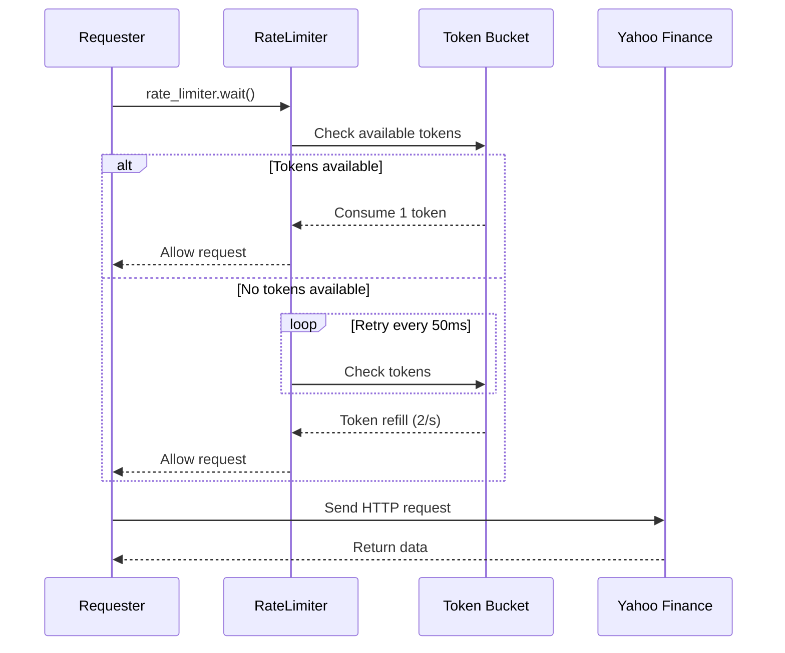

- **Algorithm**: Token Bucket
- **Rate**: 2 requests/second (configurable via `RATE_LIMIT_RPS` environment variable)
- **Timeout**: 10 seconds
- **Thread-safe**: Uses `threading.Lock` to protect token state

---

## Greeks Calculation Engine

The Greeks calculation engine is located in `services/greeks_engine.py` and uses the `py_vollib_vectorized` library for batch Black-Scholes Greeks calculation.

### Calculation Flow

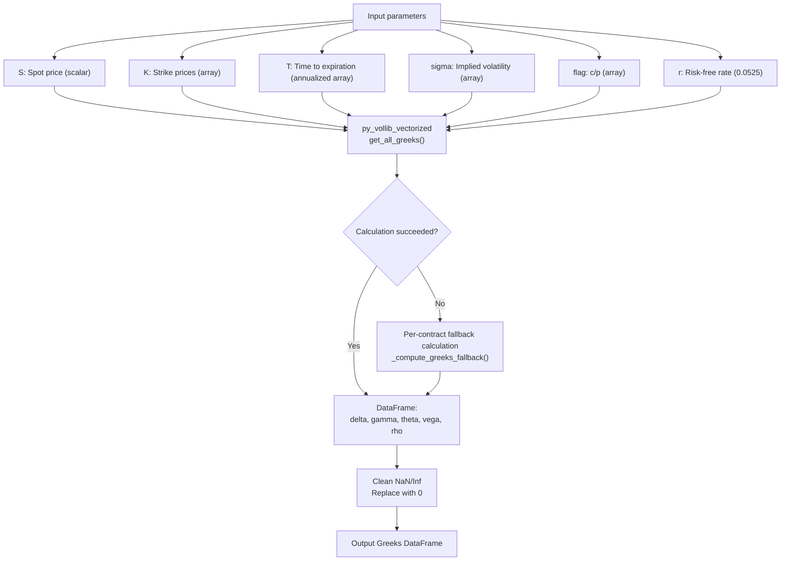

### The Five Greeks

| Greek | Symbol | Meaning | Application |
|-------|--------|---------|-------------|
| Delta | Sensitivity of option price to changes in the underlying price | Measures directional risk |
| Gamma | Sensitivity of Delta to changes in the underlying price | Core input for GEX calculation |
| Theta | Rate of time decay of option price | Measures time value erosion |
| Vega | Sensitivity of option price to changes in volatility | Reference for volatility trading |
| Rho | Sensitivity of option price to changes in interest rates | Interest rate environment impact assessment |

### Fault Tolerance Mechanisms

- **Batch calculation priority**: Uses `py_vollib_vectorized` vectorized calculation for optimal performance
- **Per-contract fallback**: If batch calculation throws an exception, automatically switches to a per-contract calculation loop
- **NaN/Inf cleanup**: NaN and Inf values in calculation results are uniformly replaced with 0.0
- **Minimum time protection**: T value is clamped to `1e-6 / 365` (approximately 1 second) to avoid division by zero errors

---

## Indicator Calculation

### Max Pain

Max Pain is the strike price where option holders have the minimum total loss, equivalent to the strike where option sellers have the maximum profit.

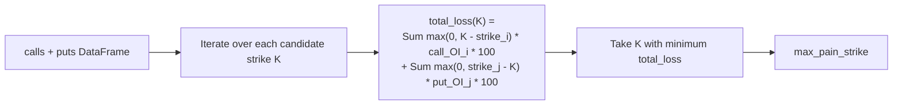

### Put/Call Ratio (PCR)

PCR measures market bearish/bullish sentiment:

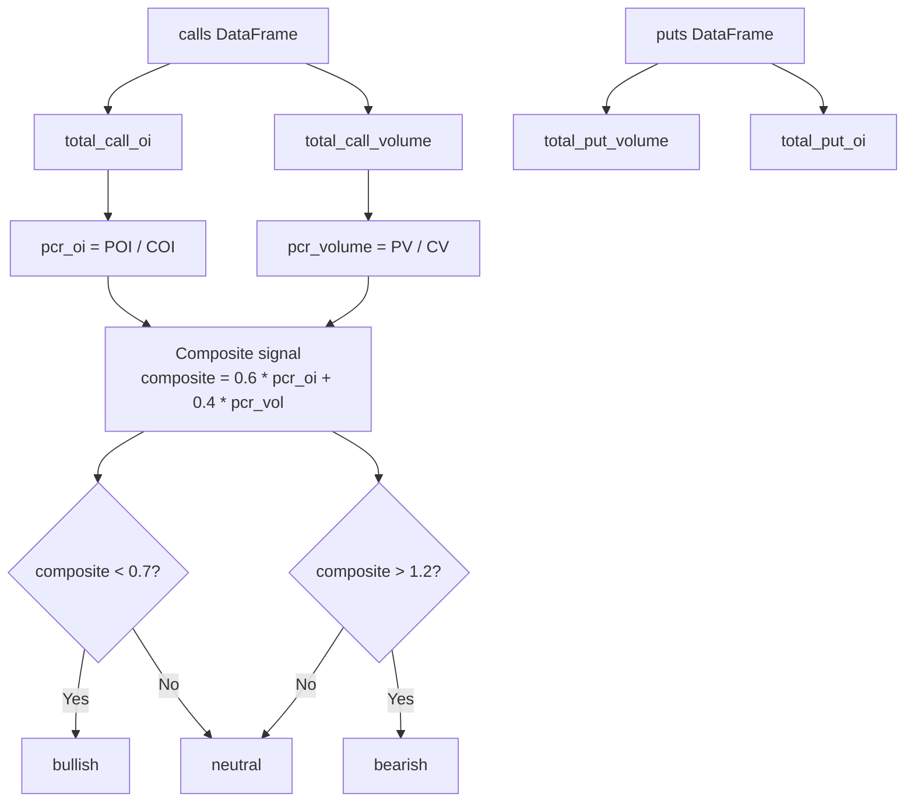

### Gamma Exposure (GEX)

GEX measures gamma exposure from the dealer's perspective:

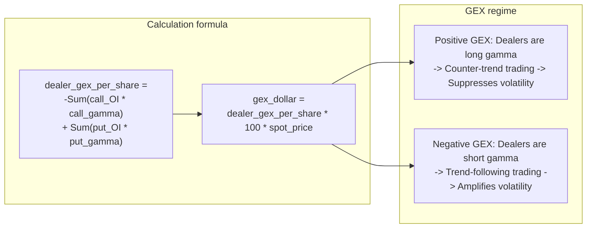

### Volatility Indicators

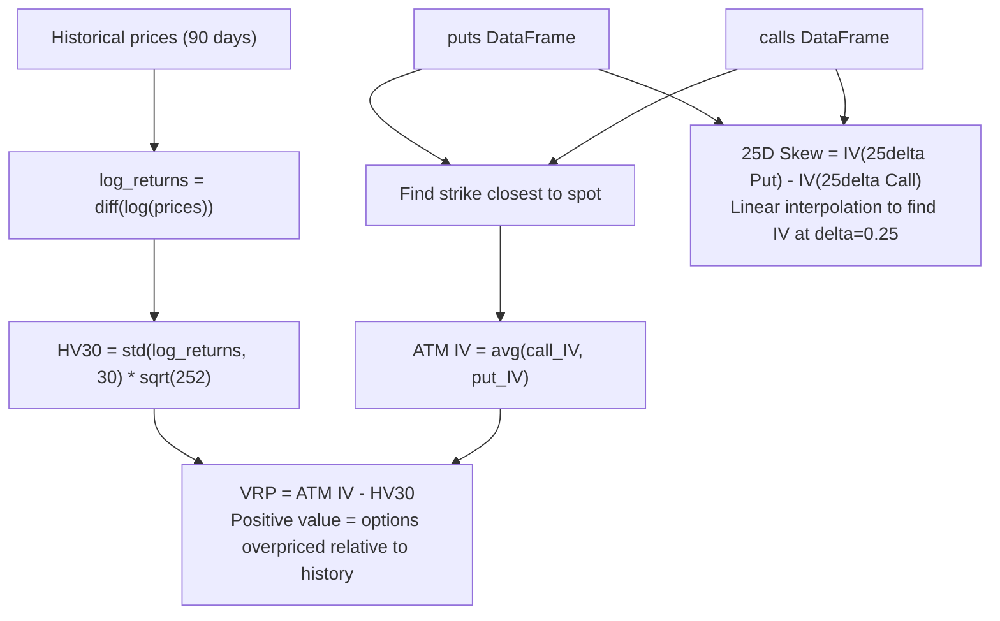

---

## Background Poller

The background poller is located in `scheduler/poller.py`, triggered by APScheduler on a schedule, and is responsible for cache warming:

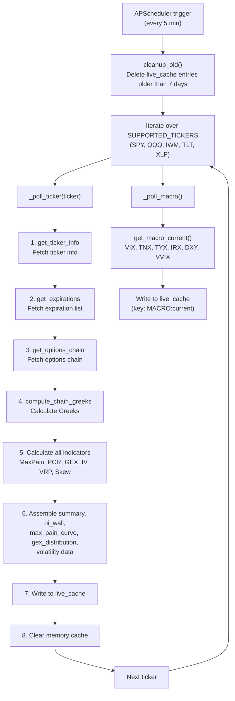

**Poller's Role**:

- **Cache warming**: Periodically fetches data from Yahoo Finance and stores it in live_cache, ensuring API requests can hit the cache
- **Cleanup expired data**: Cleans up cache entries older than 7 days at the start of each poll cycle
- **Error isolation**: Failure in polling a single ticker does not affect other tickers

---

## Daily Snapshot

The daily snapshot task is in the `daily_snapshot_job()` function in `scheduler/jobs.py`, triggered at 16:30 Eastern Time (after market close):

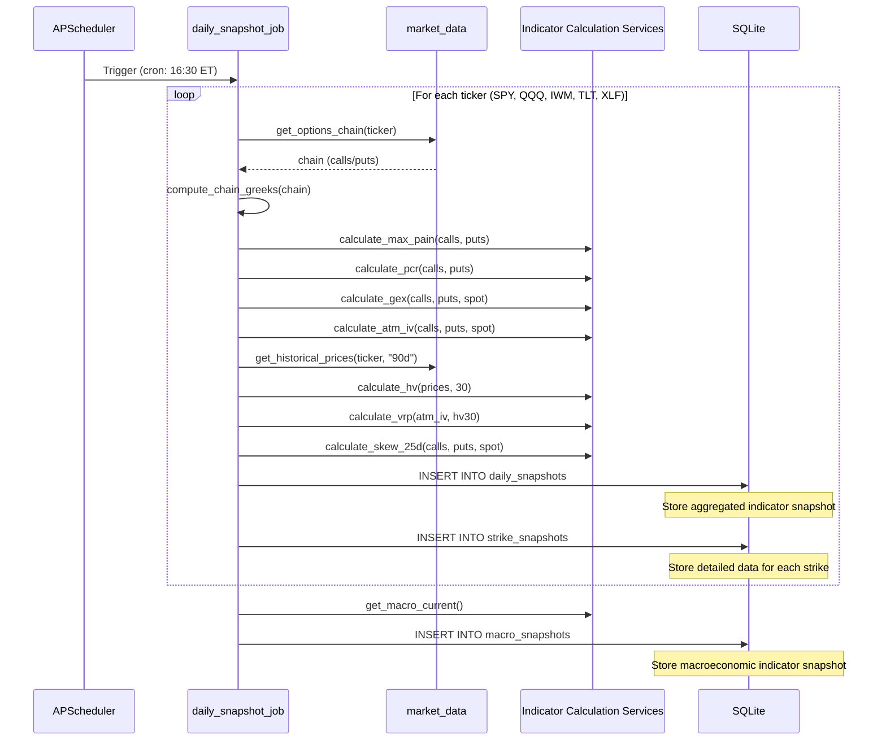

**Snapshot Storage Contents**:

| Table | Granularity | Storage Content |
|-------|------------|-----------------|
| `daily_snapshots` | 1 row per ticker per day | spot_price, max_pain, pcr_volume, pcr_oi, gex, atm_iv, hv30, vrp, skew_25d, volume/OI summary |
| `strike_snapshots` | 1 row per strike per day | call_oi, put_oi, call_volume, put_volume, call_iv, put_iv, call_gamma, put_gamma, call_delta, put_delta |
| `macro_snapshots` | 1 row per day | vix, tnx, tyx, irx, dxy, vvix, spread_10y3m |

---

## Macro Indicator Data Flow

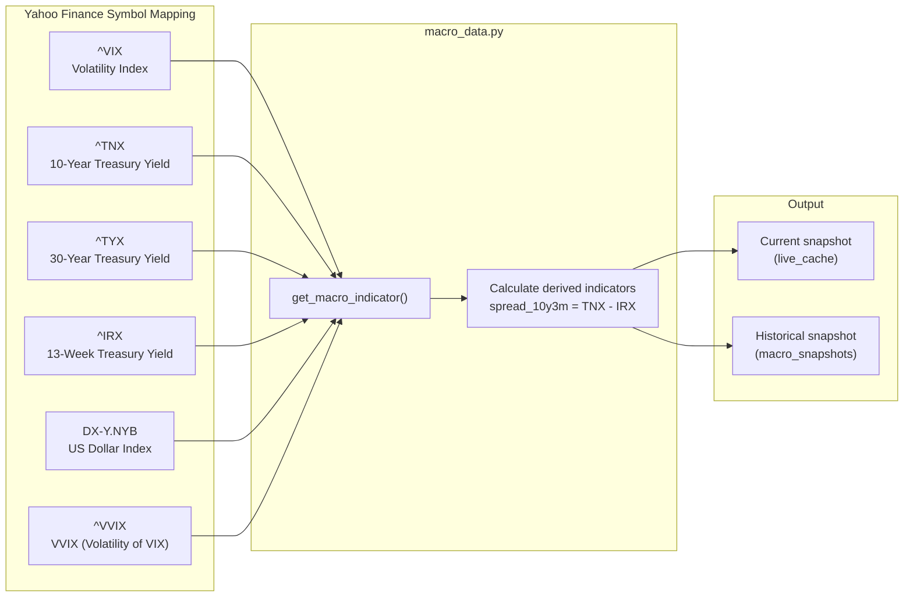
