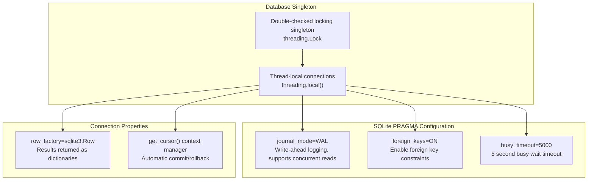
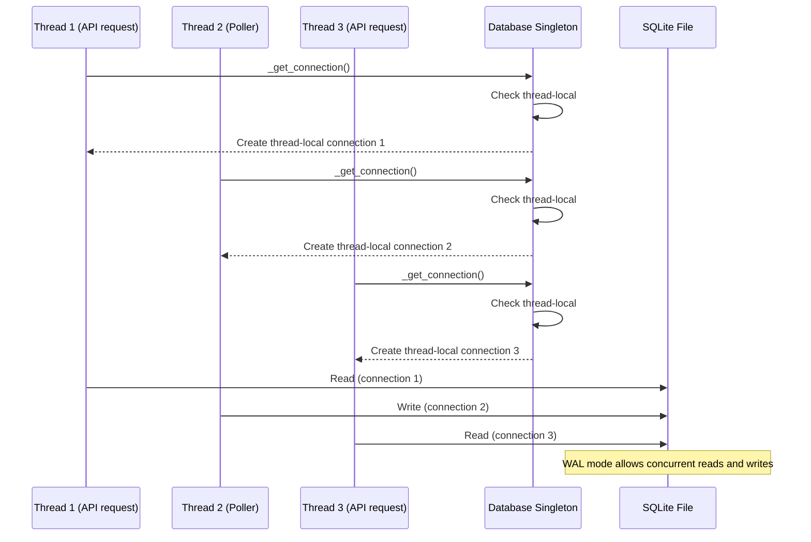
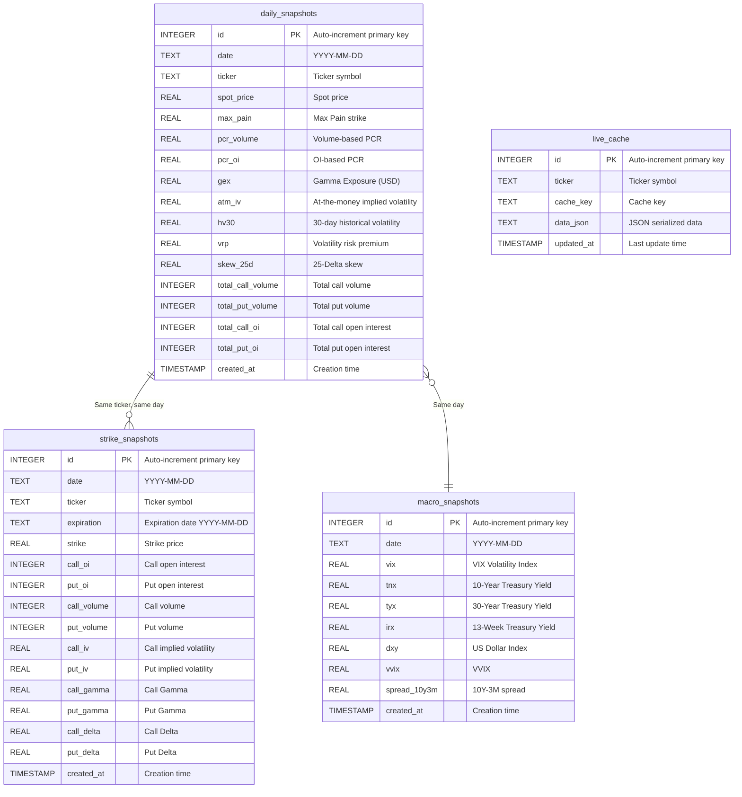
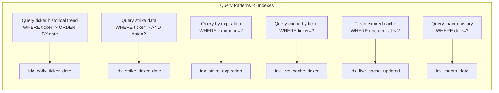
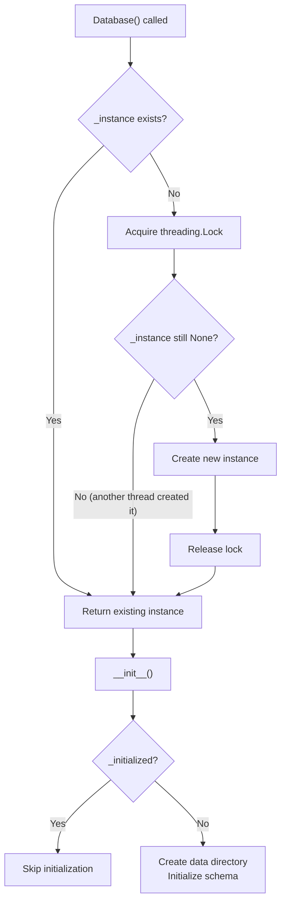

# Database Design

OptionDash uses SQLite as its data storage engine, employing WAL (Write-Ahead Logging) mode to support concurrent reads. The database stores three types of data: daily aggregated snapshots, strike-level snapshots, live cache, and macroeconomic indicator snapshots.

---

## SQLite Configuration

Database connections are managed through the `Database` singleton class in `database/connection.py`, with the following configuration:



### WAL Mode Advantages

- **Concurrent reads and writes**: Read operations do not block write operations, and write operations do not block read operations
- **Better performance**: Batch writes perform better than the default rollback journal mode
- **Crash recovery**: WAL files provide better crash recovery capabilities

### Thread Safety Mechanism



- **Singleton pattern**: Uses double-checked locking to ensure a globally unique instance
- **Thread-local connections**: Each thread has its own independent SQLite connection via `threading.local()`
- **Context manager**: `get_cursor()` automatically handles commit and rollback

---

## Table Structure

### ER Diagram



### daily_snapshots (Daily Aggregated Snapshot)

Stores one row per ticker per day, recording all aggregated indicators for that day. This is the primary data source for historical trend analysis.

```sql
CREATE TABLE IF NOT EXISTS daily_snapshots (
    id INTEGER PRIMARY KEY AUTOINCREMENT,
    date TEXT NOT NULL,                   -- YYYY-MM-DD
    ticker TEXT NOT NULL,
    spot_price REAL,
    max_pain REAL,
    pcr_volume REAL,                      -- Volume-based Put/Call Ratio
    pcr_oi REAL,                          -- OI-based Put/Call Ratio
    gex REAL,                             -- Gamma Exposure in USD
    atm_iv REAL,                          -- At-the-money implied volatility
    hv30 REAL,                            -- 30-day historical volatility
    vrp REAL,                             -- Volatility risk premium (IV - HV)
    skew_25d REAL,                        -- 25-Delta risk reversal
    total_call_volume INTEGER,
    total_put_volume INTEGER,
    total_call_oi INTEGER,
    total_put_oi INTEGER,
    created_at TIMESTAMP DEFAULT CURRENT_TIMESTAMP,
    UNIQUE(date, ticker)
);
```

| Field | Type | Description |
|-------|------|-------------|
| `date` | TEXT | Snapshot date, format `YYYY-MM-DD` |
| `ticker` | TEXT | Ticker symbol, e.g., `SPY`, `QQQ` |
| `spot_price` | REAL | Daily spot closing price |
| `max_pain` | REAL | Max Pain strike price |
| `pcr_volume` | REAL | Volume-based Put/Call Ratio |
| `pcr_oi` | REAL | OI-based Put/Call Ratio |
| `gex` | REAL | Gamma Exposure in USD |
| `atm_iv` | REAL | At-the-money implied volatility |
| `hv30` | REAL | 30-day historical volatility |
| `vrp` | REAL | Volatility risk premium (atm_iv - hv30) |
| `skew_25d` | REAL | 25-Delta risk reversal (IV_put_25d - IV_call_25d) |
| `total_call_volume` | INTEGER | Total call volume for the day |
| `total_put_volume` | INTEGER | Total put volume for the day |
| `total_call_oi` | INTEGER | Total call open interest for the day |
| `total_put_oi` | INTEGER | Total put open interest for the day |

**Unique constraint**: `(date, ticker)` ensures at most one row per ticker per day.

### strike_snapshots (Strike-Level Snapshot)

Stores one row per strike per day, used to reconstruct OI Wall and GEX distribution charts.

```sql
CREATE TABLE IF NOT EXISTS strike_snapshots (
    id INTEGER PRIMARY KEY AUTOINCREMENT,
    date TEXT NOT NULL,
    ticker TEXT NOT NULL,
    expiration TEXT NOT NULL,              -- Expiration date YYYY-MM-DD
    strike REAL NOT NULL,
    call_oi INTEGER DEFAULT 0,
    put_oi INTEGER DEFAULT 0,
    call_volume INTEGER DEFAULT 0,
    put_volume INTEGER DEFAULT 0,
    call_iv REAL,
    put_iv REAL,
    call_gamma REAL,
    put_gamma REAL,
    call_delta REAL,
    put_delta REAL,
    created_at TIMESTAMP DEFAULT CURRENT_TIMESTAMP,
    UNIQUE(date, ticker, expiration, strike)
);
```

| Field | Type | Description |
|-------|------|-------------|
| `date` | TEXT | Snapshot date |
| `ticker` | TEXT | Ticker symbol |
| `expiration` | TEXT | Option expiration date |
| `strike` | REAL | Strike price |
| `call_oi` | INTEGER | Call open interest |
| `put_oi` | INTEGER | Put open interest |
| `call_volume` | INTEGER | Call volume |
| `put_volume` | INTEGER | Put volume |
| `call_iv` | REAL | Call implied volatility |
| `put_iv` | REAL | Put implied volatility |
| `call_gamma` | REAL | Call Gamma |
| `put_gamma` | REAL | Put Gamma |
| `call_delta` | REAL | Call Delta |
| `put_delta` | REAL | Put Delta |

**Unique constraint**: `(date, ticker, expiration, strike)` ensures at most one row per strike per expiration per day.

### live_cache (Live Cache)

Stores pre-computed API response data, populated by the background poller, and read directly by API endpoints.

```sql
CREATE TABLE IF NOT EXISTS live_cache (
    id INTEGER PRIMARY KEY AUTOINCREMENT,
    ticker TEXT NOT NULL,
    cache_key TEXT NOT NULL,              -- e.g. 'summary', 'chain:2026-05-01', 'expirations'
    data_json TEXT NOT NULL,              -- JSON-serialized response payload
    updated_at TIMESTAMP DEFAULT CURRENT_TIMESTAMP,
    UNIQUE(ticker, cache_key)
);
```

| Field | Type | Description |
|-------|------|-------------|
| `ticker` | TEXT | Ticker symbol (macro indicators use `MACRO`) |
| `cache_key` | TEXT | Cache key, e.g., `summary`, `oi_wall`, `volatility` |
| `data_json` | TEXT | JSON serialized response data |
| `updated_at` | TIMESTAMP | Last update time, used for expiration checks |

**Unique constraint**: `(ticker, cache_key)` ensures only one record per cache type per ticker (updated using INSERT OR REPLACE).

### macro_snapshots (Macroeconomic Indicator Snapshot)

Stores one row of macroeconomic indicator data per day.

```sql
CREATE TABLE IF NOT EXISTS macro_snapshots (
    id INTEGER PRIMARY KEY AUTOINCREMENT,
    date TEXT NOT NULL,          -- YYYY-MM-DD
    vix REAL,
    tnx REAL,
    tyx REAL,
    irx REAL,
    dxy REAL,
    vvix REAL,
    spread_10y3m REAL,
    created_at TIMESTAMP DEFAULT CURRENT_TIMESTAMP,
    UNIQUE(date)
);
```

| Field | Type | Description |
|-------|------|-------------|
| `date` | TEXT | Snapshot date |
| `vix` | REAL | VIX Volatility Index (^VIX) |
| `tnx` | REAL | 10-Year US Treasury Yield (^TNX) |
| `tyx` | REAL | 30-Year US Treasury Yield (^TYX) |
| `irx` | REAL | 13-Week US Treasury Yield (^IRX) |
| `dxy` | REAL | US Dollar Index (DX-Y.NYB) |
| `vvix` | REAL | VVIX - Volatility of VIX (^VVIX) |
| `spread_10y3m` | REAL | 10-Year to 3-Month Treasury spread (tnx - irx) |

---

## Indexes

```sql
-- daily_snapshots indexes
CREATE INDEX IF NOT EXISTS idx_daily_ticker_date
    ON daily_snapshots(ticker, date);

-- strike_snapshots indexes
CREATE INDEX IF NOT EXISTS idx_strike_ticker_date
    ON strike_snapshots(ticker, date);
CREATE INDEX IF NOT EXISTS idx_strike_expiration
    ON strike_snapshots(expiration);

-- live_cache indexes
CREATE INDEX IF NOT EXISTS idx_live_cache_ticker
    ON live_cache(ticker);
CREATE INDEX IF NOT EXISTS idx_live_cache_updated
    ON live_cache(updated_at);

-- macro_snapshots indexes
CREATE INDEX IF NOT EXISTS idx_macro_date
    ON macro_snapshots(date);
```

### Index Usage Description



---

## Thread Safety

### Database Singleton Pattern



### Thread-Local Connections

```python
class Database:
    _instance = None
    _lock = threading.Lock()

    def __init__(self):
        self._local = threading.local()  # Independent connection per thread

    def _get_connection(self) -> sqlite3.Connection:
        if not hasattr(self._local, "connection") or self._local.connection is None:
            conn = sqlite3.connect(Config.DATABASE_PATH)
            conn.row_factory = sqlite3.Row
            conn.execute("PRAGMA journal_mode=WAL")
            conn.execute("PRAGMA foreign_keys=ON")
            conn.execute("PRAGMA busy_timeout=5000")
            self._local.connection = conn
        return self._local.connection
```

### Context Manager

```python
@contextmanager
def get_cursor(self):
    """Cursor context manager with automatic commit/rollback."""
    conn = self._get_connection()
    cursor = conn.cursor()
    try:
        yield cursor
        conn.commit()
    except Exception:
        conn.rollback()
        raise
```

**Design Key Points**:

- **Singleton + double-checked locking**: Globally unique Database instance with lazy initialization
- **Thread-local connections**: `threading.local()` ensures each thread uses its own independent SQLite connection
- **WAL mode**: Supports multi-threaded concurrent reads and writes
- **busy_timeout**: 5-second busy wait to avoid `SQLITE_BUSY` errors
- **Context manager**: Automatically commits successful transactions and rolls back failed ones
