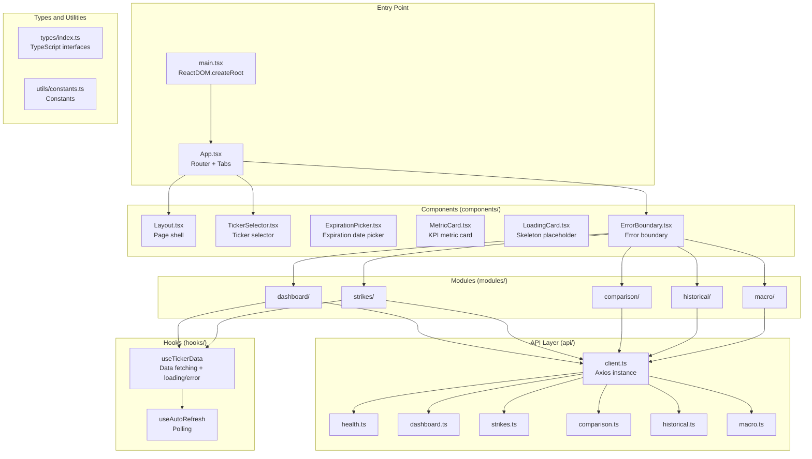
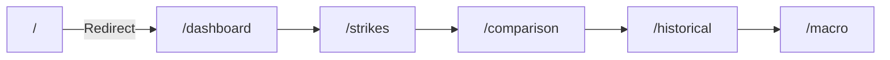
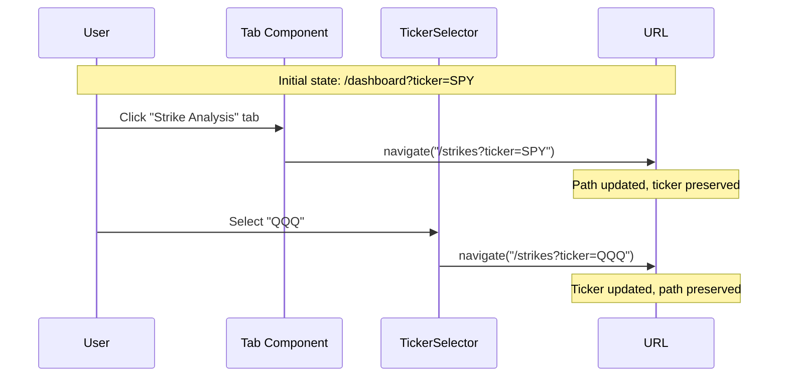
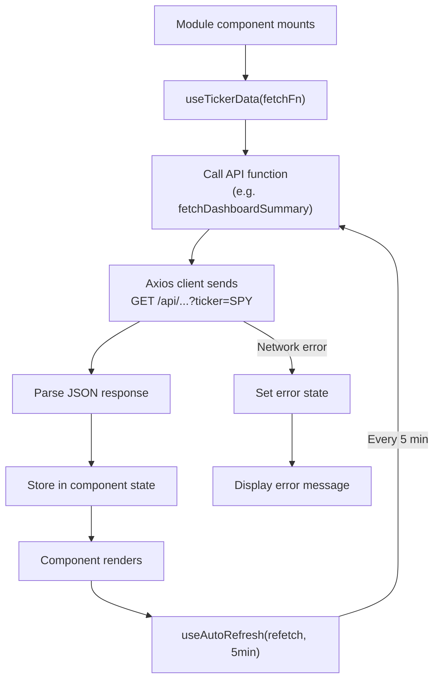
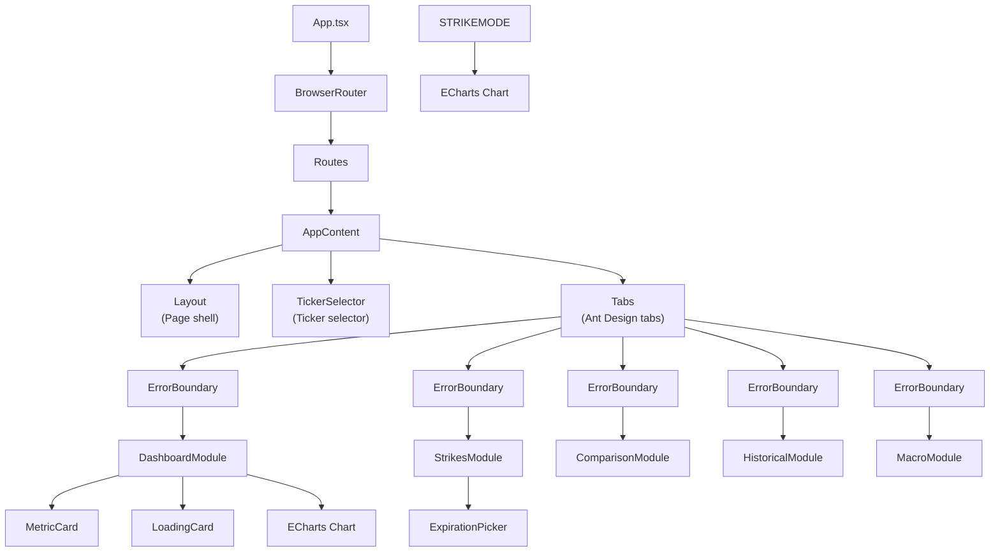
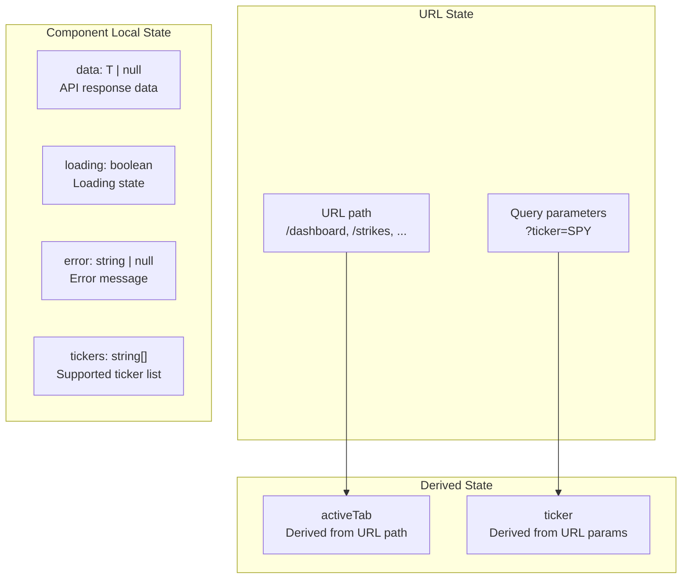
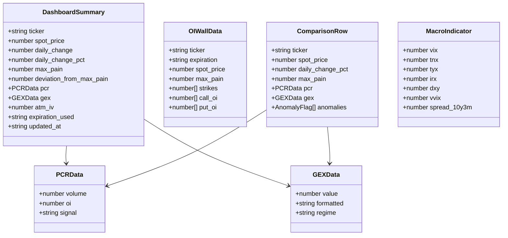

# Frontend Architecture

The OptionDash frontend is a single-page application (SPA) built on React 19, written in TypeScript, using Vite 8 as the build tool, Ant Design for UI components, ECharts for data chart rendering, and Tailwind CSS for styling.

---

## Application Structure



---

## Routing System

The frontend uses `react-router-dom`'s `BrowserRouter` for client-side routing. Routes are linked with tabs:



**Routing Design Key Points**:

- The URL path determines the currently active tab: `/dashboard`, `/strikes`, `/comparison`, `/historical`, `/macro`
- The URL query parameter `?ticker=SPY` saves the currently selected ticker
- Switching tabs updates the path while preserving the `ticker` parameter
- Switching tickers updates the `ticker` parameter while preserving the current path
- The root path `/` automatically redirects to `/dashboard`



---

## Data Fetching Pattern

Each business module follows a unified data fetching pattern implemented through custom hooks:



### Custom Hooks

#### useTickerData

A generic data fetching hook that encapsulates loading, error, and refetch state management:

```typescript
function useTickerData<T>(
  fetchFn: () => Promise<T>
): {
  data: T | null;
  loading: boolean;
  error: string | null;
  refetch: () => void;
}
```

- Automatically initiates a request when the component mounts
- Automatically re-fetches when `fetchFn` changes (via `useCallback` dependency)
- Provides a `refetch` method for manual refresh

#### useAutoRefresh

A polling hook based on `setInterval`:

```typescript
function useAutoRefresh(
  callback: () => void,
  interval: number,  // Default 5 minutes
  enabled?: boolean
): void
```

- Uses `useRef` to store the latest callback function reference
- Automatically clears the timer when the component unmounts
- Can be controlled via the `enabled` parameter

### Axios Client

Unified HTTP client configuration located in `api/client.ts`:

- Base URL: `API_BASE_URL` (in development, `/api` is forwarded via Vite proxy)
- Timeout: 30 seconds
- Response interceptor: Unified error handling, extracts error messages and logs them

---

## Component Hierarchy



### Core Component Descriptions

| Component | File | Responsibility |
|-----------|------|----------------|
| `Layout` | `components/Layout.tsx` | Page shell, provides a unified page layout container |
| `TickerSelector` | `components/TickerSelector.tsx` | Ticker selection dropdown, displays the list of supported tickers |
| `ExpirationPicker` | `components/ExpirationPicker.tsx` | Expiration date picker, used in the strike analysis module |
| `MetricCard` | `components/MetricCard.tsx` | Reusable KPI metric card, displays values, change rates, and color coding |
| `LoadingCard` | `components/LoadingCard.tsx` | Skeleton placeholder component, displayed while data is loading |
| `ErrorBoundary` | `components/ErrorBoundary.tsx` | React error boundary, catches child component render errors and displays a fallback UI |

---

## State Management

The OptionDash frontend uses a lightweight state management strategy without needing to introduce global state libraries like Redux or Zustand:



**State Management Principles**:

- **URL State**: The current tab and selected ticker are managed via URL, supporting browser back/forward navigation and bookmarks
- **Component Local State**: Each module independently manages its own data, loading, and error states
- **No Global State**: Modules have no shared state; they coordinate through URL parameters (e.g., `ticker`)
- **Custom Hooks**: `useTickerData` and `useAutoRefresh` encapsulate common data fetching logic

---

## TypeScript Type System

All API response types are defined in `types/index.ts` to ensure consistency between frontend and backend data structures:


