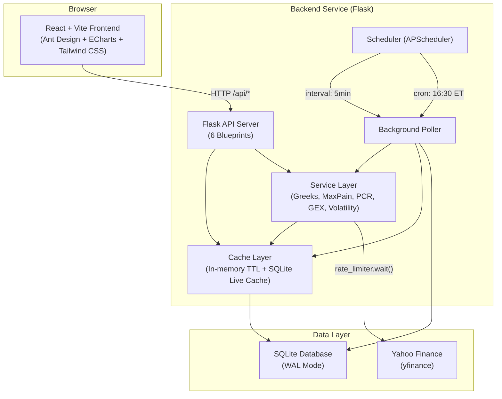
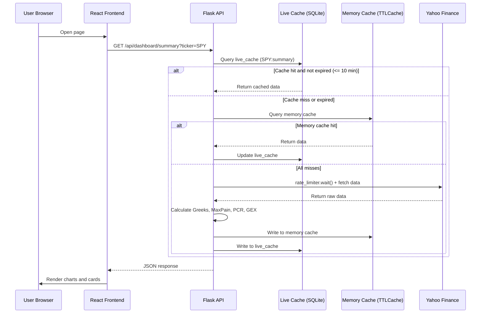
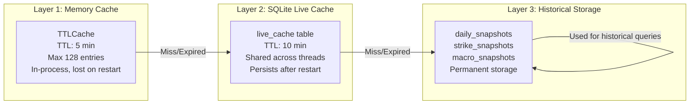
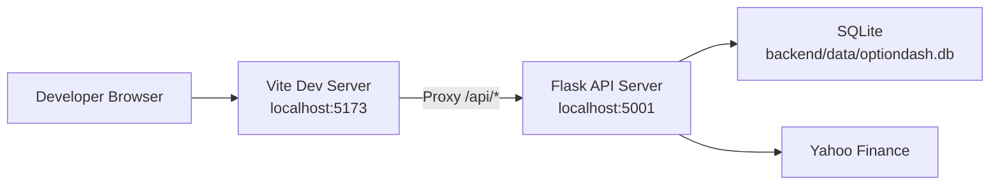
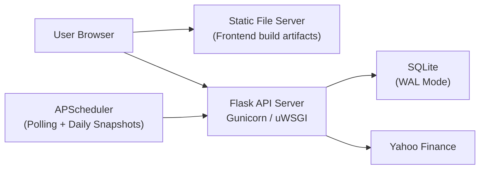
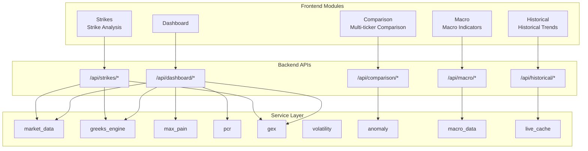

# Architecture Overview

OptionDash is an options chain analysis and market sentiment monitoring platform that uses a separated frontend-backend architecture. The frontend is a single-page application built with React + Vite, the backend provides RESTful APIs using Flask, the data source is Yahoo Finance, and historical snapshots and live cache are persistently stored in SQLite.

---

## System Architecture Diagram

---

## Technology Stack

| Layer | Technology | Purpose |
|-------|-----------|---------|
| Frontend Framework | React 19, TypeScript, Vite 8 | UI framework and build tool |
| UI Component Library | Ant Design 6 | Forms, tables, tabs, and other UI components |
| Chart Visualization | ECharts 6 | Options data chart rendering |
| Styling | Tailwind CSS 4 | Utility-first atomic CSS |
| Backend Framework | Python 3.12+, Flask 3.1 | API server |
| Background Scheduling | APScheduler 3 | Scheduled tasks (polling + daily snapshots) |
| Database | SQLite (WAL Mode) | Data persistence |
| Options Math | py_vollib_vectorized | Batch Black-Scholes Greeks calculation |
| Data Source | yfinance (Yahoo Finance) | Market quotes and options chain data |
| HTTP Client | Axios | Frontend API requests |
| Rate Control | Custom Token Bucket | Rate-limiting yfinance requests (2 req/s) |

---

## Data Flow Overview

---

## Cache Layers

The system uses a three-layer cache architecture, ordered from fastest to slowest:

| Layer | Technology | TTL | Max Capacity | Characteristics |
|-------|-----------|-----|-------------|-----------------|
| Layer 1 | `cachetools.TTLCache` | 5 min (300s) | 128 entries | Fastest access, lost on process restart |
| Layer 2 | SQLite `live_cache` table | 10 min (600s) | Unlimited | Shared across threads, persists after restart |
| Layer 3 | SQLite historical tables | Permanent | Unlimited | Daily snapshots, supports historical trend queries |

---

## Deployment Architecture

### Development Environment

- **Frontend**: Vite dev server runs at `localhost:5173` with Hot Module Replacement (HMR)
- **Backend**: Flask dev server runs at `localhost:5001` with debug mode enabled
- **Proxy**: Vite is configured with proxy rules to forward `/api/*` requests to the Flask backend
- **Database**: SQLite file stored at `backend/data/optiondash.db`

### Production Environment

- **Frontend**: Vite builds static files, hosted by Nginx or another web server
- **Backend**: Flask application deployed via Gunicorn or another WSGI server
- **Scheduler**: APScheduler starts with the Flask process, executing background polling and daily snapshot tasks

---

## Core Modules Overview

