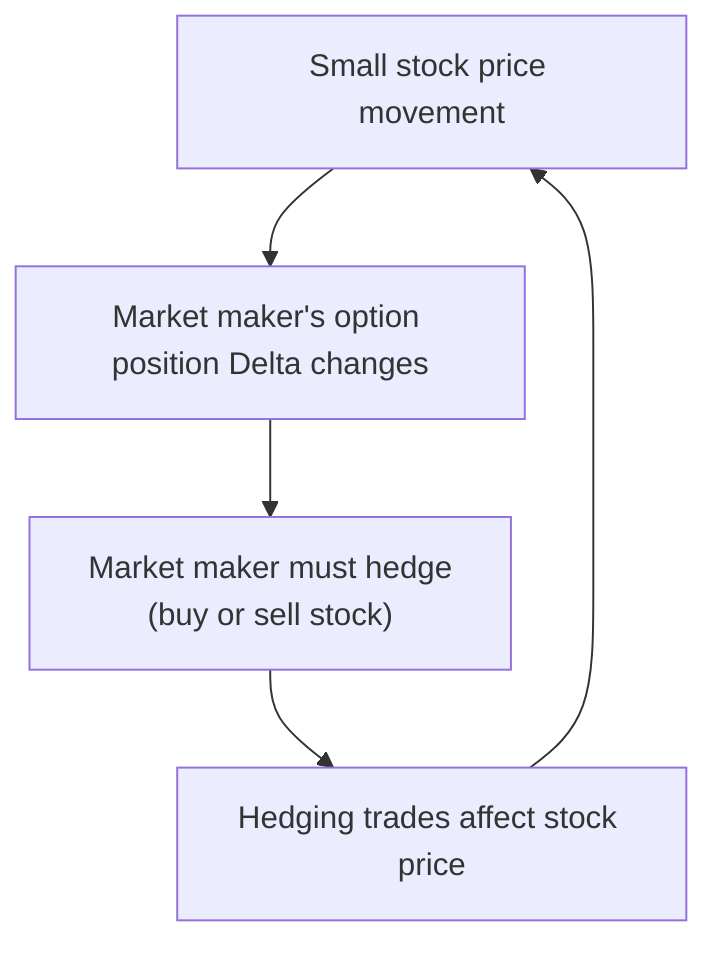
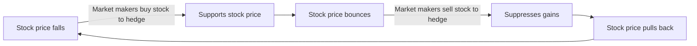
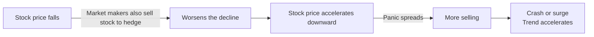
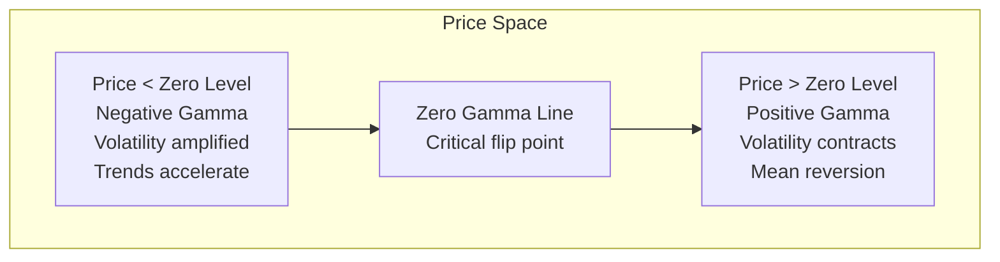
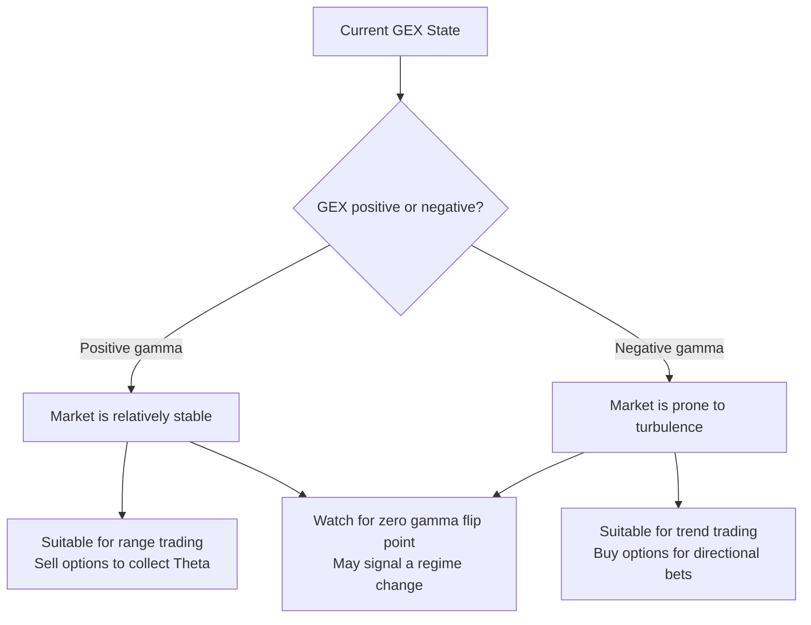

# Gamma Exposure (GEX)

:::tip Who is this for?
This article is for complete beginners. It is recommended to first read [Greeks](./greeks.md) to understand the basic concepts of Gamma. GEX is one of the most important indicators for understanding market microstructure.
:::

## What is GEX?

**Gamma Exposure (GEX)** measures: when the stock price changes, how large of a hedging trade market makers (dealers) need to execute.

Think of it this way:

> Imagine you are an actuary at an insurance company. You have sold a large number of earthquake insurance policies for homes. If earthquake risk suddenly rises (stock price fluctuates significantly), you must take immediate action -- either buy reinsurance or sell existing policies. **GEX measures the scale of this "forced action."**

When this scale is large, market makers' hedging trades themselves will **affect the stock price**, creating a self-reinforcing feedback loop.



---

## The Role of Market Makers

To understand GEX, you must first understand the role of market makers in the options market:

| Role | Description |
|------|-------------|
| **Who are market makers?** | Large financial institutions (such as Citadel, Susquehanna) that provide liquidity to the options market |
| **What they do** | Whether you want to buy or sell options, market makers will take the other side. They are the "wholesalers" of options |
| **Key characteristic** | They **typically hold net short option positions** (they sell more options than they buy) |

Because market makers are typically **net sellers** of options, they face enormous directional risk. To manage this risk, they must **continuously hedge** -- buying and selling the underlying stock to maintain a risk-neutral position.

---

## Calculation Method

GEX is calculated from the market maker's perspective. The core formula is as follows:

### Per-Share GEX

```
Market Maker GEX (per share) = -Sum(Call OI x Call Gamma) + Sum(Put OI x Put Gamma)
```

:::info Why is Call Negative?
Market makers typically **sell** Calls (holding short Calls). Short Calls have negative Gamma. A negative sign times a negative value yields a positive number -- so selling Calls contributes **positive Gamma** to the market maker.
:::

### Dollar GEX

```
Dollar GEX = Market Maker GEX (per share) x 100 x Spot Price
```

Multiplying by 100 is because each option contract represents 100 shares. Multiplying by the spot price converts "per share" to "dollars."

### Calculation Example

Suppose the current SPY price is $530:

| Strike | Type | OI | Gamma | GEX Contribution |
|--------|------|------|-------|-----------------|
| $530 | Call | 10,000 | 0.05 | -10,000 x 0.05 = **-500** |
| $530 | Put | 8,000 | 0.04 | +8,000 x 0.04 = **+320** |
| $540 | Call | 15,000 | 0.03 | -15,000 x 0.03 = **-450** |
| $520 | Put | 12,000 | 0.03 | +12,000 x 0.03 = **+360** |

```
GEX (per share) = -500 + 320 - 450 + 360 = -270
Dollar GEX = -270 x 100 x $530 = -$14,310,000
```

The result is **negative**, indicating a **negative gamma environment.**

---

## Positive GEX vs Negative GEX

The sign of GEX determines the direction of market maker hedging, which in turn affects the behavior of the entire market.

### Positive Gamma -- "Stabilizer"



| Characteristic | Description |
|---------------|-------------|
| **Market maker behavior** | Buys when price falls, sells when price rises |
| **Market effect** | Suppresses volatility, promotes mean reversion |
| **Price behavior** | Range-bound, limited gains and losses |
| **Volatility** | Lower realized volatility |
| **Suitable strategies** | Mean reversion strategies, selling options |

### Negative Gamma -- "Amplifier"



| Characteristic | Description |
|---------------|-------------|
| **Market maker behavior** | Sells when price falls, buys when price rises |
| **Market effect** | Amplifies volatility, drives trends |
| **Price behavior** | Trending moves, prone to sharp swings |
| **Volatility** | Higher realized volatility |
| **Suitable strategies** | Trend following, buying options |

### Comparison Summary

| Dimension | Positive Gamma | Negative Gamma |
|-----------|---------------|----------------|
| **Market maker role** | Liquidity provider (stabilizes market) | Liquidity consumer (amplifies volatility) |
| **Hedging direction** | Counter-trend | With the trend |
| **Market behavior** | Mean reversion | Trend acceleration |
| **Volatility** | Low | High |
| **Analogy** | Rubber band (the further you pull, the stronger the snapback) | Snowball (rolls faster and faster) |

---

## GEX Zero Level (Zero Gamma Level)

The **GEX Zero Level** is the point where total GEX is exactly zero at a specific stock price. It is the **watershed** of market dynamics:



### Importance of the Zero Level

| Aspect | Description |
|--------|-------------|
| **Technical** | Marks the transition from "stable zone" to "unstable zone" (or vice versa) |
| **Trading** | When the stock price is near the zero level, market behavior may undergo a qualitative change |
| **Psychological** | Market makers adjust hedging strategies near the zero level, potentially triggering chain reactions |

:::tip Practical Tip
When the stock price crosses from the positive gamma zone through the zero level into the negative gamma zone, volatility tends to suddenly spike. This is often a warning signal that a major market move is imminent.
:::

---

## GEX and Stock Price Movement

The following diagram shows how GEX affects overall market behavior:



---

## Viewing GEX in OptionDash

OptionDash displays GEX data in multiple locations:

### Dashboard

| Display Content | Description |
|----------------|-------------|
| **Total GEX** | In dollars, with B/M/K suffix (e.g., $2.3B) |
| **Status Label** | "Positive Gamma" or "Negative Gamma" |
| **Auto Refresh** | Updates every 5 minutes |

### Strike Analysis

The GEX distribution chart shows net GEX at each strike:

- **Green bars**: That strike contributes positive gamma
- **Red bars**: That strike contributes negative gamma
- **Zero gamma line**: The dividing line between positive and negative gamma

### Historical Data

- GEX trend over time
- Observe historical patterns of GEX flipping from positive to negative (or vice versa)
- Comparative analysis with stock price movements

---

## Practical Application Guide

### Scenario 1: High Positive GEX Environment

**Characteristics**: GEX is significantly positive, market volatility is low

**Strategy ideas:**
- Suitable for selling options (Iron Condor, Credit Spread)
- Set narrow ranges, take advantage of mean reversion properties
- Caution: if the zero gamma flip point is nearby, stay alert

### Scenario 2: Negative GEX Environment

**Characteristics**: GEX is negative, market volatility is high

**Strategy ideas:**
- Trends may accelerate; avoid buying dips or selling tops against the trend
- Suitable for buying options for directional trades
- Pay attention to risk management, set stop losses

### Scenario 3: GEX Zero Level Flip

**Characteristics**: Stock price approaches the zero gamma flip point

**Strategy ideas:**
- This is the most critical signal -- the market may switch from "stable" to "unstable" (or vice versa)
- Adjust positions in advance, prepare for both scenarios
- Observe whether volume confirms the move

:::warning Risk Warning
GEX is a dynamic indicator that updates in real time as stock prices and option positions change. Do not use GEX as your sole trading basis; combine it with other indicators (such as PCR, Max Pain, volatility) for comprehensive judgment.
:::

---

## Advanced Concepts

### Terminology Reference

| English Term | Description |
|-------------|-------------|
| Gamma Exposure | Market maker risk exposure from Gamma |
| Positive Gamma | Market makers hold positive Gamma, hedge counter-trend |
| Negative Gamma | Market makers hold negative Gamma, hedge with the trend |
| Zero Gamma Level | The price level where GEX flips from positive to negative |
| Dealer Hedging | Stock trades executed by market makers to manage risk |
| Dollar GEX | Total gamma exposure denominated in dollars |

:::note Next Steps
- [Volatility](./volatility.md) -- Learn how volatility affects option pricing and GEX
- [25-Delta Skew](./skew.md) -- Understand the fear/greed asymmetry in the options market
:::
