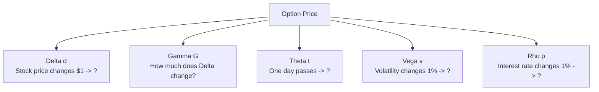
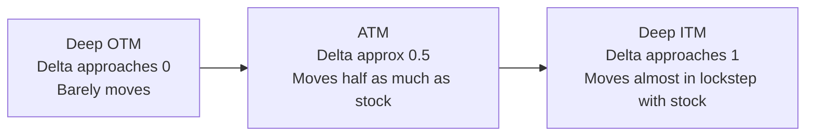
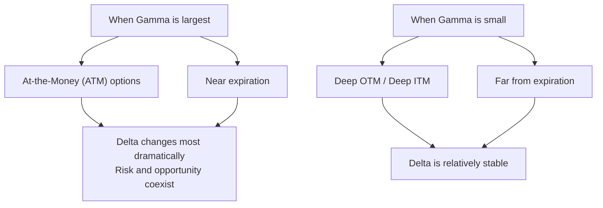
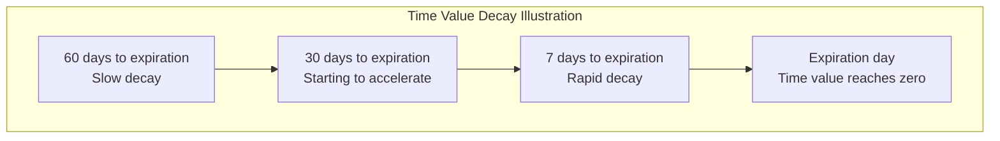
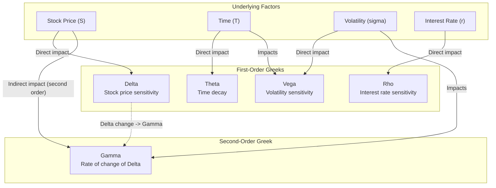

# Greeks

:::tip Who is this for?
This article is for complete beginners. If you already understand [Options Basics](./options-basics.md), you can read this article. We will explain each Greek letter using everyday examples.
:::

## What are Greeks?

Imagine you are driving a car. The speedometer tells you your current speed, the fuel gauge tells you how much gas is left, and the temperature gauge tells you if the engine is overheating. **Greeks are the dashboard of the options world** -- they tell you what factors are affecting option prices and by how much.

More precisely, **Greeks are the sensitivities of option prices to various factors** (mathematically called "partial derivatives"). The core question they answer is:

> If a certain factor changes a little, how much will the option price change?

### Greeks Overview

| Greek Letter | What Does it Measure? | Plain English |
|-------------|----------------------|---------------|
| **Delta** | Impact of stock price changes | "If the stock goes up $1, how much do I gain/lose?" |
| **Gamma** | Rate of change of Delta | "How fast does Delta itself change?" |
| **Theta** | Impact of time passing | "Each day that passes, how much do I lose?" |
| **Vega** | Impact of volatility changes | "If the market panics/calm, how much do I gain/lose?" |
| **Rho** | Impact of interest rate changes | "If the central bank raises rates, how much do I gain/lose?" |

---

## Delta -- "Direction Sensitivity"

### Definition

**Delta measures: for every $1 change in the stock price, how much does the option price change.**

Think of it this way:

> You buy a lottery ticket with a 60% chance of winning. If the prize pool increases by $100, your ticket is worth about $60 more. In this case, Delta is approximately 0.6.

### Value Range

| Option Type | Delta Range | Approximate ATM Value |
|------------|-------------|----------------------|
| **Call Option** | 0 to +1 | Approximately +0.50 |
| **Put Option** | -1 to 0 | Approximately -0.50 |

### Key Characteristics

### Examples

Suppose you hold a SPY Call with a strike price of $530, and Delta = 0.60:

| Stock Price Change | Option Price Change | Explanation |
|-------------------|--------------------|--------------------|
| `SPY rises $1 ($530 -> $531)` | Option rises $0.60 | Delta at work |
| `SPY rises $5 ($530 -> $535)` | Option rises about $3.00 | 0.60 x 5 = 3.00 |
| `SPY falls $1 ($530 -> $529)` | Option falls $0.60 | Delta works both ways |

:::info Another Meaning of Delta
Delta can be loosely understood as the option's **probability of expiring in-the-money (ITM).** Delta = 0.60 means there is roughly a 60% chance the stock price will be above the strike at expiration. This is just an approximation, but it is useful in practice.
:::

### Delta's Significance for Traders

| Trading Strategy | Delta Choice | Reason |
|-----------------|-------------|--------|
| Bullish speculation | High Delta (0.7+) | Tracks upward moves more closely |
| Low-cost bet | Low Delta (0.2-) | Cheap, but needs a big move to profit |
| Portfolio hedging | Delta neutral (approx 0) | Direction-neutral, only trading volatility |

---

## Gamma -- "Acceleration"

### Definition

**Gamma measures: for every $1 change in the stock price, how much does Delta change.**

If Delta is "speed," then Gamma is "acceleration:"

> Imagine a car starting from a standstill. Delta tells you the current speed, Gamma tells you whether the speed is increasing or decreasing.

### Key Characteristics

### Examples

Suppose the current situation is:

- Stock price is $530, you hold a $530 Call (at-the-money)
- Delta = 0.50, Gamma = 0.05

| Stock Price Change | New Delta | Delta Change | Explanation |
|-------------------|-----------|--------------|-------------|
| Up $1 ($531) | 0.55 | +0.05 | Delta changes from 0.50 to 0.55 |
| Up another $1 ($532) | 0.60 | +0.05 | Delta continues to increase |
| Down $2 ($530) | 0.50 | -0.10 | Back to the starting point |

:::warning Gamma Risk
ATM options near expiration have especially large Gamma, meaning Delta can change dramatically in a short time. For option sellers, this is the biggest source of risk -- imagine the steering wheel suddenly becoming extremely sensitive.
:::

### Gamma's Impact on the Market

Gamma is closely related to market maker hedging behavior, which directly affects the market's volatility characteristics. See [Gamma Exposure (GEX)](./gex.md) for details.

---

## Theta -- "The Enemy of Time"

### Definition

**Theta measures: for each day that passes, how much does the option price decrease.**

For option **buyers**, Theta is your enemy -- time constantly erodes your option's value.

Think of it this way:

> You buy an ice cream cone. Every minute, it melts a little. Theta is the "melting speed." And as the ice cream gets smaller, it actually melts faster (accelerating decay near expiration).

### Key Characteristics

| Characteristic | Description |
|---------------|-------------|
| **Always negative** (for buyers) | Time only moves in one direction; option value only decreases with time |
| **Accelerates near expiration** | Decay is fastest in the last 30 days, like an ice cream melting faster near the end |
| **Largest for ATM options** | ATM options have the most time value, so they also decay the fastest |
| **Weekend effect** | Theta is also calculated between Friday's close and Monday's open |

### Time Decay Curve

### Examples

Suppose you buy a SPY Call with Theta = -0.15:

| Time Passed | Option Price Change | Explanation |
|-------------|--------------------|--------------------|
| 1 day | Decreases by $0.15 | Even if the stock doesn't move, the option loses value |
| 7 days | Decreases by about $1.05 | 0.15 x 7 = 1.05 (in reality it accelerates) |
| 30 days | Decreases by about $4.50+ | Accelerating decay, actual loss is greater |

:::tip Buyer vs Seller
- **Buyer**: Theta is the enemy. You need the stock to move quickly in your favor to outpace time decay.
- **Seller**: Theta is your friend. Time is on your side, earning you money every day. This is why selling options is called "selling insurance."
:::

---

## Vega -- "The Panic Gauge"

### Definition

**Vega measures: for every 1% change in implied volatility (IV), how much does the option price change.**

Think of it this way:

> Imagine you buy earthquake insurance. If geologists suddenly announce "a major earthquake is likely soon" (volatility rises), your insurance becomes more valuable -- because everyone wants to buy insurance.

### Key Characteristics

| Characteristic | Description |
|---------------|-------------|
| **Always favorable for buyers** | `Volatility rises -> options become more expensive` |
| **Longer-term options are more sensitive** | The farther from expiration, the larger Vega |
| **Largest for ATM options** | ATM options have the highest Vega |
| **Event-driven** | Before earnings, Fed meetings, etc., IV spikes and Vega has the biggest impact |

### Examples

Suppose you buy a Call with Vega = 0.20:

| IV Change | Option Price Change | Scenario |
|-----------|--------------------|--------------------|
| IV rises from 20% to 21% (+1%) | Rises $0.20 | Market panic intensifies |
| IV rises from 20% to 25% (+5%) | Rises $1.00 | Panic heating up before major event |
| IV falls from 20% to 15% (-5%) | Falls $1.00 | After the event, IV collapses |

:::warning IV Crush
After earnings are announced, uncertainty is removed and IV typically drops sharply. Even if the stock moves in the direction you predicted, the loss from Vega may offset your directional gains. This is known as **IV Crush** and is one of the most common traps for option buyers.
:::

---

## Rho -- "The Small Interest Rate Impact"

### Definition

**Rho measures: for every 1% change in interest rates, how much does the option price change.**

Rho is the least discussed of the five Greeks because short-term options are not sensitive to interest rate changes. However, for long-term options (such as LEAPS with expirations over 1 year), Rho's impact becomes significant.

| Option Type | Rho Value | Impact of Rising Interest Rates |
|------------|-----------|-------------------------------|
| **Call** | Positive | `Rising rates -> Calls become more expensive` |
| **Put** | Negative | `Rising rates -> Puts become cheaper` |

:::info Why Do Interest Rates Affect Options?
Rising interest rates mean the "opportunity cost" of holding stocks increases (you earn more interest by keeping money in the bank). This makes Calls more attractive (options can replace direct stock ownership), while the opposite is true for Puts. But in short-term trading, this impact is usually negligible.
:::

---

## Relationships Among Greeks

The five Greeks do not exist in isolation; they are closely interconnected:

### Key Relationship Summary

| Relationship | Description |
|-------------|-------------|
| **Delta and Gamma** | Gamma is the "acceleration" of Delta. The larger Gamma is, the faster Delta changes |
| **Theta and Gamma** | Options with large Gamma typically also have large Theta (ATM, short-term). "Free lunch" does not exist -- high Gamma means high time decay |
| **Theta and Vega** | Short-term options have large Theta but small Vega; long-term options have large Vega but small Theta |
| **Vega and Events** | Before major events, IV rises and Vega's impact is amplified; after events, IV Crush causes Vega to work in reverse |

:::info Gamma-Theta Balance
For option sellers, Gamma and Theta are a pair of contradictions: Gamma exposes you to directional risk, while Theta lets you profit from time decay. A good option strategy needs to find a balance between the two.
:::

---

## Greeks Quick Reference

The following table summarizes the typical behavior of each Greek in different scenarios:

| Scenario | Delta | Gamma | Theta | Vega |
|----------|-------|-------|-------|------|
| **ATM Call** | approx +0.50 | High | Large negative (fast decay) | High |
| **ITM Call** | Approaches +1.00 | Low | Small negative | Lower |
| **OTM Call** | Approaches 0 | Low | Small negative | Lower |
| **Near expiration** | Changes dramatically | Extremely high | Extremely high | Low |
| **Long-term (LEAPS)** | Changes gradually | Low | Low | Extremely high |

---

## Viewing Greeks in OptionDash

OptionDash uses the **Black-Scholes model** (via the `py_vollib_vectorized` library) to calculate Greeks:

- **Calculation formula**: Standard Black-Scholes partial derivatives
- **Risk-free rate**: Default 5.25% (adjustable in config file)
- **Data source**: Implied Volatility (IV) from Yahoo Finance options chain

Applications of Greeks in OptionDash:

| Feature Module | Greeks Used | Purpose |
|---------------|-------------|---------|
| **GEX Calculation** | Gamma | Calculate market maker gamma exposure |
| **Strike Analysis** | Delta, Gamma | Risk indicators for each strike |
| **Volatility Analysis** | Vega, Theta | Volatility research and time decay analysis |

:::note Next Steps
After understanding Greeks, it is recommended to continue reading:
- [Gamma Exposure (GEX)](./gex.md) -- Learn how Gamma affects the stability of the entire market
- [Volatility](./volatility.md) -- Deep dive into Vega and implied volatility
:::
