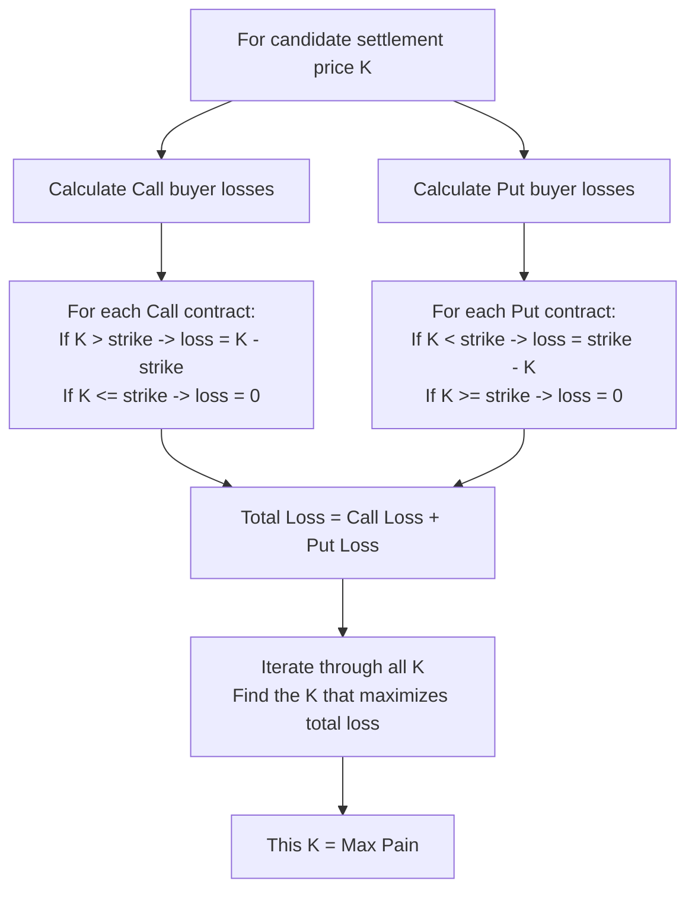
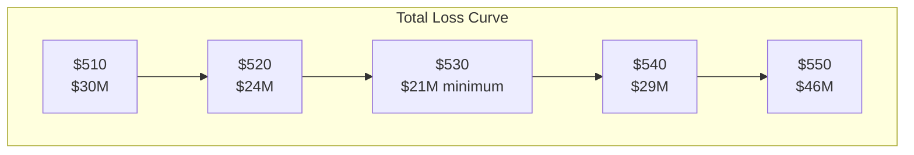
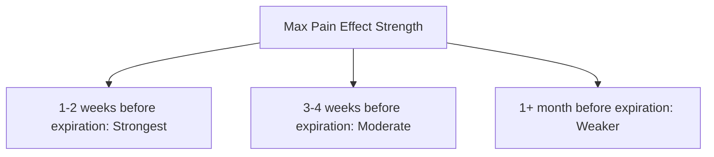

# Max Pain

:::tip Who is this for?
This article is for readers who want to understand the phenomenon of "why prices tend to converge toward a certain level at expiration." After reading, you will understand the calculation logic of Max Pain and its practical applications in trading.
:::

## What is Max Pain?

**Max Pain** is the price at which, upon option expiration, **option buyers suffer the maximum total loss** (while option sellers gain the maximum total profit).

In other words: Max Pain is the stock price that **minimizes the total intrinsic value of all option contracts** at expiration.

> Think of it this way: Imagine a large casino with thousands of gamblers (option buyers) and the house (option sellers). Max Pain is the outcome where the gamblers lose the most overall and the house profits the most.
>
> The market has a tendency: **as expiration approaches, stock prices tend to gravitate toward Max Pain.** It is as if the house has an "invisible hand" guiding the outcome.

### Why is it Called "Max Pain"?

Because at this price point:

- Many Call holders find the stock price below the strike, and their Calls become worthless
- Many Put holders find the stock price above the strike, and their Puts become worthless
- **Both lose money simultaneously** -- this is "maximum pain"

## Calculation Method

The calculation of Max Pain is not complicated; it just requires iterating through all strike prices.

For each candidate settlement price K, calculate the **total loss** of all option buyers:

```
Total Loss(K) = Sum of max(0, K - strike_i) x Call OI_i x 100
              + Sum of max(0, strike_j - K) x Put OI_j x 100
```

**The K that maximizes total loss is the Max Pain.**

:::info Equivalent Understanding
Note: Total loss of buyers = Total profit of sellers. Therefore, Max Pain can also be understood as "the point that maximizes seller profits."
:::

### Formula Breakdown



### Python Implementation

Here is the Max Pain calculation algorithm used by the OptionDash backend (simplified version):

```python
import numpy as np

def calculate_max_pain(calls, puts):
    """
    calls: DataFrame with 'strike' and 'open_interest' columns
    puts:  DataFrame with 'strike' and 'open_interest' columns
    """
    # All candidate strike prices
    all_strikes = sorted(
        set(calls["strike"].tolist()) | set(puts["strike"].tolist())
    )

    call_strikes = calls["strike"].values
    call_oi = calls["open_interest"].fillna(0).values
    put_strikes = puts["strike"].values
    put_oi = puts["open_interest"].fillna(0).values

    total_losses = []
    for K in all_strikes:
        # Call buyers lose when K > strike
        call_loss = np.sum(np.maximum(K - call_strikes, 0) * call_oi * 100)
        # Put buyers lose when K < strike
        put_loss = np.sum(np.maximum(put_strikes - K, 0) * put_oi * 100)
        total_losses.append(call_loss + put_loss)

    min_idx = int(np.argmin(total_losses))
    return all_strikes[min_idx]
```

## Intuitive Understanding: A Complete Example

Suppose SPY is currently priced at $530, and here is the latest option OI data:

| Strike | Call OI | Put OI |
|--------|---------|--------|
| $510 | 3,000 | 8,000 |
| $520 | 5,000 | 6,000 |
| $530 | 8,000 | 5,000 |
| $540 | 6,000 | 4,000 |
| $550 | 4,000 | 3,000 |

### Step 1: Assume Settlement Price K = $530

**Call Buyer Losses** (only lose when K is greater than strike):

| Strike | K - Strike | Call OI | Loss Amount |
|--------|------------|---------|-------------|
| $510 | $20 | 3,000 | $20 x 3,000 x 100 = **$6,000,000** |
| $520 | $10 | 5,000 | $10 x 5,000 x 100 = **$5,000,000** |
| $530 | $0 | 8,000 | **$0** |
| $540 | $0 | 6,000 | **$0** |
| $550 | $0 | 4,000 | **$0** |
| | | | **Total Call Loss = $11,000,000** |

**Put Buyer Losses** (only lose when K is less than strike):

| Strike | Strike - K | Put OI | Loss Amount |
|--------|------------|--------|-------------|
| $510 | $0 | 8,000 | **$0** |
| $520 | $0 | 6,000 | **$0** |
| $530 | $0 | 5,000 | **$0** |
| $540 | $10 | 4,000 | $10 x 4,000 x 100 = **$4,000,000** |
| $550 | $20 | 3,000 | $20 x 3,000 x 100 = **$6,000,000** |
| | | | **Total Put Loss = $10,000,000** |

**Total Loss at K = $530 = $21,000,000**

### Step 2: Repeat for Each Candidate K

| Settlement K | Call Loss | Put Loss | **Total Loss** |
|-------------|-----------|----------|----------------|
| $510 | $2,000,000 | $28,000,000 | $30,000,000 |
| $520 | $6,000,000 | $18,000,000 | $24,000,000 |
| **$530** | **$11,000,000** | **$10,000,000** | **$21,000,000** |
| $540 | $23,000,000 | $6,000,000 | $29,000,000 |
| $550 | $43,000,000 | $3,000,000 | $46,000,000 |

### Step 3: Find the Maximum Loss Point



In this example, **Max Pain = $530** (the point of minimum total loss).

:::caution Wait, isn't it "maximum" pain?
You may have noticed: we are looking for the point of **minimum** total loss. This is because from the **seller's** perspective, they want buyers to lose the most (sellers earn the most). But from the **buyer's** perspective, $530 is the point where buyers have the minimum total loss -- meaning buyers are "least in pain" at this price.

In practice, both interpretations are used. The key is to understand: **Max Pain is the stock price that minimizes total option intrinsic value at expiration**, which is the point that maximizes seller profit and minimizes buyer profit.
:::

## How Max Pain Behaves in Practice

### Why Do Stock Prices Tend Toward Max Pain?

There are several theoretical explanations for this phenomenon:

| Theory | Explanation |
|--------|-------------|
| **Market Maker Hedging** | Market makers, as option sellers, hedge their risk by buying and selling stock. These trades push the stock price toward Max Pain |
| **Gamma Effect** | As expiration nears, Gamma increases, making market maker hedging more frequent and influential |
| **Self-Fulfilling Prophecy** | More and more traders pay attention to Max Pain and trade accordingly, reinforcing the effect |
| **Option Expiration** | Large volumes of options expire worthless, reducing forces that push the price away |

### When is it Most Effective?



:::tip Practical Experience
Max Pain has the most reference value in the **last week before expiration** (especially the last 2-3 trading days). When expiration is far away, OI may still change significantly, making the current Max Pain of limited reference value.
:::

## Limitations of Max Pain

:::warning Cautions When Using Max Pain

1. **Not a guarantee, just a tendency**: Max Pain describes a statistical tendency; it does not happen every time
2. **Major events take priority**: If there is significant news (earnings, Fed decisions, etc.), the stock price may completely ignore Max Pain
3. **OI changes dynamically**: Max Pain moves as OI changes; it is not fixed
4. **Different for each expiration**: Each expiration date has its own Max Pain
5. **Does not consider other forces**: Fundamentals, technicals, and macro factors may all be stronger than Max Pain
:::

## Viewing Max Pain in OptionDash

### Dashboard Panel

The Dashboard displays the core Max Pain information for the current underlying:

| Data Item | Description |
|-----------|-------------|
| **Max Pain Price** | The currently calculated Max Pain strike price |
| **Deviation** | The difference and percentage between Max Pain and the current stock price |
| **Direction** | Whether the current stock price is above or below Max Pain |

### Strike Analysis

Here you can see the complete **Max Pain curve chart:**

- X-axis: Candidate settlement prices
- Y-axis: Total loss amount
- The lowest point on the curve is Max Pain
- You can switch between different expirations to view their respective Max Pain

### Historical Data

In the historical data module, you can see:

- Max Pain trend over time
- Comparison of actual closing prices at expiration with Max Pain at that time
- Historical accuracy statistics for Max Pain

## Next Steps

- [Put/Call Ratio](./pcr.md) -- Another important market sentiment indicator
- [Greeks](./greeks.md) -- Understand the sensitivity factors of option pricing
