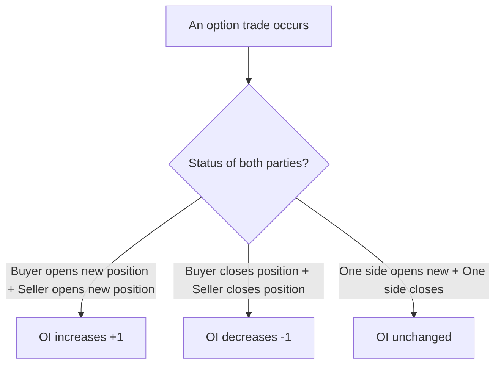
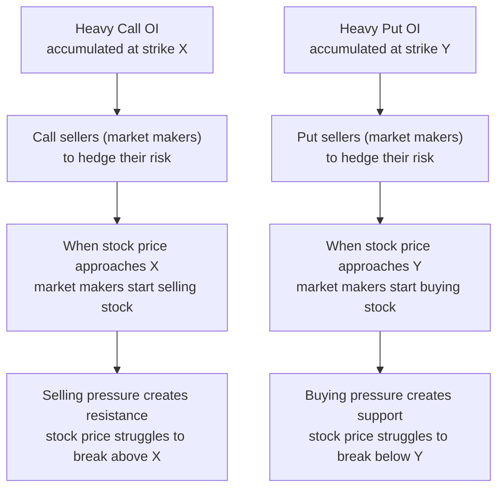
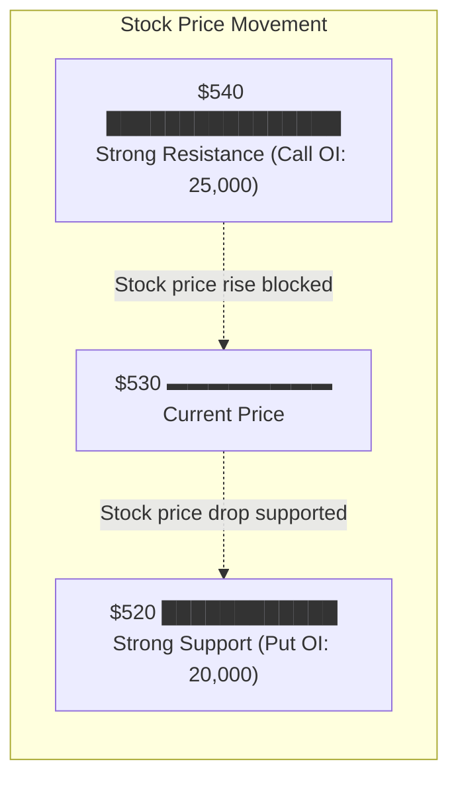
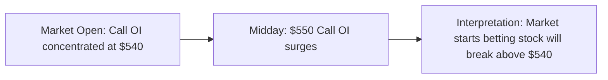

# OI & Volume

:::tip Who is this for?
This article is for readers who want to understand the "heat" and "key price levels" of the options market. After reading, you will be able to find support and resistance levels for a stock through OI data.
:::

## Open Interest (OI)

### What is Open Interest?

**Open Interest (OI)** refers to the **total number of outstanding option contracts** in the market that have not yet been closed. It measures how many "active" contracts currently exist.

Here is a relatable analogy:

> Imagine a dance floor. **Volume** is how many dances took place tonight (resets to zero after each dance), while **Open Interest** is how many couples are currently dancing on the floor.

### How Does OI Change?

OI does not only increase. Its changes depend on the status of both parties in the trade:

| Scenario | Buyer | Seller | OI Change |
|----------|-------|--------|-----------|
| A wants to buy, B wants to sell (both new positions) | Opens new | Opens new | **+1** |
| A wants to close, C wants to take over (C opens new) | `Closes (A) -> Opens new (C)` | Unchanged | **Unchanged** |
| A wants to close, B also wants to close | Closes | Closes | **-1** |

:::info Key Difference
**Volume** increases with every trade (whether opening or closing), while **OI** only increases when both parties open new positions.
:::

### OI vs Volume

| Comparison | Open Interest (OI) | Volume |
|------------|-------------------|--------|
| **Definition** | Total outstanding contracts | Number of contracts traded that day |
| **Reset** | Does not reset, continuously accumulates | Resets to zero each trading day |
| **Measures** | The "stock" of market participation | The "flow" of market trading |
| **Increases when** | Both parties open new positions | Any single trade |
| **Decreases when** | Both parties close positions | Never decreases (only increases) |

:::tip A Simple Analogy
- **Volume** is like a restaurant's **foot traffic** today -- how many people come and go
- **OI** is like the number of **people currently dining** in the restaurant -- representing current activity levels
:::

## OI and Price Relationship

This is the most valuable application of OI: **strike prices with heavy OI accumulation tend to become support or resistance levels for the stock price.**

### Why Does OI Form Support/Resistance?

This is related to **option sellers' hedging behavior** (Delta Hedging):

### Intuitive Understanding

Imagine the following scenario:

| Strike | Call OI | Put OI | Price Role |
|--------|---------|--------|------------|
| $540 | **25,000** | 3,000 | Strong resistance (heavy Call seller hedging = selling) |
| $530 | 12,000 | 8,000 | Moderate support/resistance |
| $520 | 4,000 | **20,000** | Strong support (heavy Put seller hedging = buying) |
| $510 | 2,000 | 5,000 | Minor support |

:::note
Support/resistance formed by OI accumulation is not absolute. If major news or events occur, the stock price can certainly break through these levels. However, in normal market conditions, these levels do have statistical significance.
:::

## How to View OI in OptionDash

### OI Wall Chart

In OptionDash's **Strike Analysis** module, the OI Wall chart is the most intuitive display:

| Element | Meaning |
|---------|---------|
| **Green bars** | Call open interest |
| **Red bars** | Put open interest |
| **Bar height** | OI quantity -- taller means more OI at that strike |
| **Strike position** | X-axis shows strike prices; comparing with current stock price reveals relative positions of support/resistance |

:::tip Reading Tips
In the OI Wall chart, find the strikes with **especially tall green bars** and **especially tall red bars** -- these are the key price levels.
:::

### Dashboard Module

The Dashboard panel displays overall OI data for the current underlying:

- Total Call OI and Total Put OI
- PCR (OI) ratio
- OI changes compared to the previous trading day

## Practical Applications

### 1. Identifying Key Price Levels

Use the OI Wall to find strikes with heavy OI accumulation. These positions are often:

- Areas where market makers concentrate their hedging
- Strike prices where large institutions hold option positions
- Levels where the stock price is likely to find support or resistance in the short term

### 2. Tracking Intraday OI Changes

OI also changes throughout the day, and these changes can reveal **intraday sentiment shifts:**

### 3. Cross-Expiration Comparison

Comparing OI distributions across different expirations reveals:

| Analysis Dimension | Meaning |
|-------------------|---------|
| **Near-term OI concentration** | Short-term support/resistance is more defined |
| **Long-term OI concentration** | Medium to long-term market expectations |
| **OI peak migration** | The market's expected price range is shifting |

### 4. Combined with Volume Analysis

| OI | Volume | Interpretation |
|----|--------|----------------|
| High | High | Strong attention, possibly large capital positioning |
| High | Low | Existing positions, unlikely to change significantly in the short term |
| Low | High | Possibly new position-building activity, watch whether OI increases |
| Low | Low | This strike is not attracting market attention |

## Things to Watch Out For

:::warning Cautions When Using OI
1. **OI does not indicate direction**: High Call OI does not mean the market is bullish -- Call sellers are bearish/neutral
2. **Watch OI changes**: Look not only at absolute values but also at change trends
3. **Liquidity impact**: Strikes with low OI have wide bid-ask spreads and high trading costs
4. **Expiration effect**: As expiration approaches, OI drops sharply due to position closing
:::

## Next Steps

- [Max Pain](./max-pain.md) -- Learn how OI determines the "center of gravity" at expiration
- [Put/Call Ratio](./pcr.md) -- Use OI and volume to measure overall market sentiment
