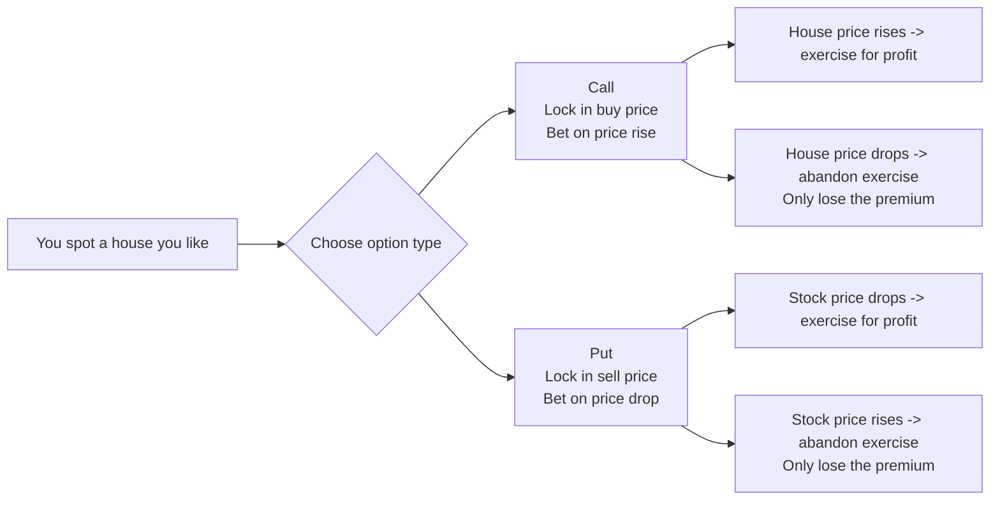
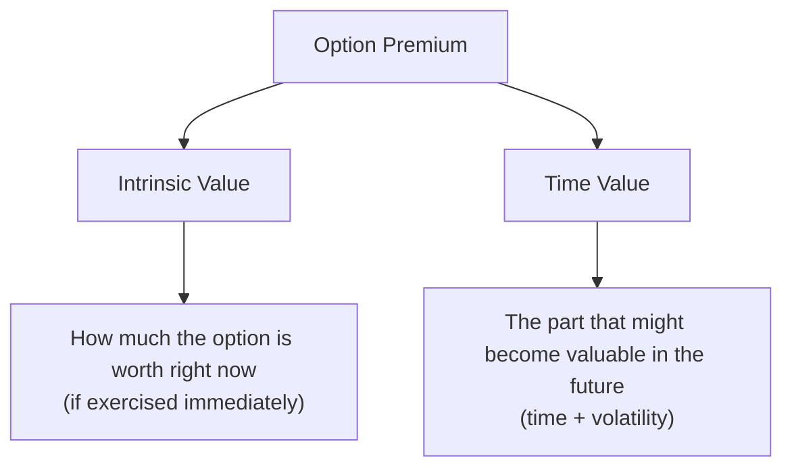
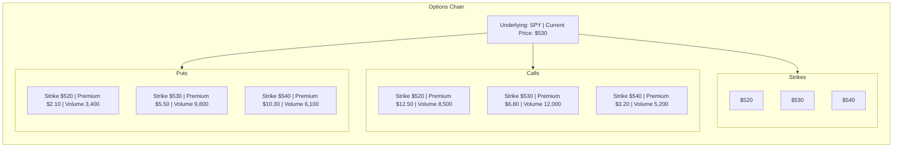
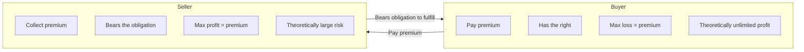
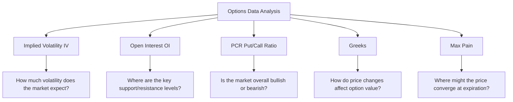

# Options Basics

:::tip Who is this for?
This article is for complete beginners. If you understand what a stock is, you can read this article. We will explain every concept using everyday examples.
:::

## What is an Option?

An **Option** is a contract that gives the holder the **right** (note: it is a right, not an obligation) to buy or sell an asset at a **specific price** on **a future date**.

Here is an analogy:

> You spot a house you like, currently listed at 1 million dollars. You are worried the price will go up, but you do not want to buy it right now. So you sign an agreement with the owner: **within 3 months, you can buy this house for 1 million dollars.** To secure this right, you pay the owner 20,000 dollars as a "good faith deposit."
>
> - If 3 months later the house price rises to 1.2 million, you can still buy it for 1 million -- you win!
> - If the house price drops to 800,000, you can choose not to buy -- you only lose that 20,000 dollar deposit.

This is the core logic of options: **use a small fee (premium) to lock in a future transaction price.**

### Two Basic Option Types

| Type | English | Meaning | Analogy |
|------|---------|---------|---------|
| **Call Option** | Call Option | The right to **buy** the underlying asset at the strike price before expiration | Bullish outlook, betting on a rise |
| **Put Option** | Put Option | The right to **sell** the underlying asset at the strike price before expiration | Bearish outlook, betting on a decline |



## Core Elements of an Option

Every option contract contains the following four key elements:

| Element | English | Description | Example |
|---------|---------|-------------|---------|
| **Underlying Asset** | Underlying | The stock or ETF the option is tied to | SPY, QQQ, AAPL |
| **Strike Price** | Strike Price | The agreed-upon buy/sell price | $500 |
| **Expiration Date** | Expiration | The date the contract expires | 2025-06-20 |
| **Premium** | Premium | The cost of purchasing the option | $5.20 (per contract) |

:::info Contract Specifications
In the US market, **1 option contract = 100 shares**. So a premium of $5.20 means the actual cost per contract is $520.
:::

## Value Composition of an Option

An option's premium is composed of two parts:



### Intrinsic Value

Intrinsic value measures: **if you exercised right now, how much money would this option make?**

Take a Call option as an example. Suppose you hold a Call with a strike price of $500, and the current stock price is $520:

```
Intrinsic Value = Stock Price - Strike Price = $520 - $500 = $20
```

This means if you exercised immediately, you could buy a stock worth $520 for $500, netting a $20 profit.

### Three States

| State | English | Call Option | Put Option | Meaning |
|-------|---------|-------------|------------|---------|
| **In-the-Money** | In-the-Money (ITM) | `Stock Price > Strike Price` | `Stock Price < Strike Price` | Has intrinsic value, profitable to exercise |
| **At-the-Money** | At-the-Money (ATM) | Stock Price ≈ Strike Price | Stock Price ≈ Strike Price | Intrinsic value is approximately zero |
| **Out-of-the-Money** | Out-of-the-Money (OTM) | `Stock Price < Strike Price` | `Stock Price > Strike Price` | Intrinsic value is zero |

:::tip Example
SPY current price is $530:

- Call with strike price $520 -> **In-the-Money** (can buy below market price)
- Call with strike price $530 -> **At-the-Money**
- Call with strike price $540 -> **Out-of-the-Money** (exercising is worse than buying directly)
:::

### Time Value

```
Time Value = Premium - Intrinsic Value
```

Time value represents the market's expectation that "the option will become more valuable before expiration." It is influenced by the following factors:

- **Time remaining**: The more time until expiration, the higher the time value (more chances for a turnaround)
- **Volatility**: The more volatile the underlying asset, the higher the time value (more likely to see large moves)

:::info Time Decay
An option's time value accelerates as the expiration date approaches. This phenomenon is called **Time Decay**, measured by the Greek letter **Theta (θ)**. It is like an ice cream melting faster and faster under the sun.
:::

## Options Chain

The **Options Chain** is a table listing all available option contracts for a given underlying. It is the most important reference tool for option traders.



In a real options chain, each row typically contains the following data:

| Column Name | Meaning |
|-------------|---------|
| **Bid** | The highest price a buyer is willing to pay (the price you get when selling) |
| **Ask** | The lowest price a seller is willing to accept (the price you pay when buying) |
| **Volume** | Daily trading volume |
| **Open Interest (OI)** | Total number of outstanding contracts |
| **Implied Volatility (IV)** | Implied volatility (the market's expectation of future volatility) |
| **Greeks** | Delta, Gamma, Theta, Vega and other risk indicators |

## Buyers and Sellers of Options

In options trading, the rights and obligations of buyers and sellers are completely different:



| Comparison | Buyer/Holder | Seller/Writer |
|------------|-------------|---------------|
| **Role** | Purchases the right | Sells the right (bears the obligation) |
| **Cost** | Pays the premium | Collects the premium |
| **Maximum Loss** | Premium amount (limited) | Can be very large (theoretically unlimited) |
| **Maximum Profit** | Theoretically unlimited | Premium amount (limited) |
| **Win Rate** | Lower (needs correct direction + sufficient magnitude) | Higher (time works in the seller's favor) |

:::warning Risk Warning
Although sellers have a higher win rate, they face far greater risk than buyers. Naked Call selling carries theoretically unlimited risk because stock prices can rise indefinitely.
:::

## Why is Options Analysis Important?

Options data is not just for trading options -- it can also **reveal market expectations and sentiment:**



### Specific Applications

1. **OI (Open Interest)**: A large concentration of Calls at a certain strike price -> may form a **resistance level**; a large concentration of Puts -> may form a **support level**

2. **Implied Volatility (IV)**: High IV -> the market expects large moves (e.g., before earnings); Low IV -> the market expects calm

3. **PCR Ratio**: Put volume far exceeds Call volume -> market sentiment is bearish; the opposite is bullish

4. **Max Pain**: As expiration approaches, stock prices tend to gravitate toward the max pain point

5. **Greeks**: Measure the sensitivity of option prices to changes in stock price, time, volatility, and other factors

:::note
The OptionDash platform is built around these indicators. The following chapters will explain each concept in depth. It is recommended to read them in order.
:::

## Next Steps

- [OI & Volume](./open-interest.md) -- Learn how OI reveals key price levels
- [Max Pain](./max-pain.md) -- Understand the gravitational pull on expiration day prices
- [Put/Call Ratio](./pcr.md) -- The thermometer for measuring market sentiment
