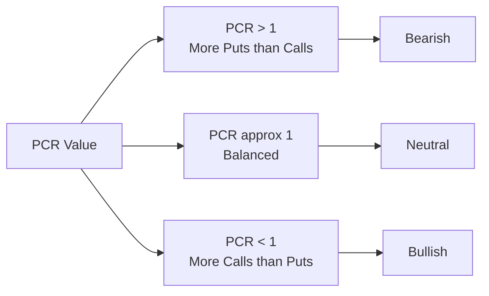
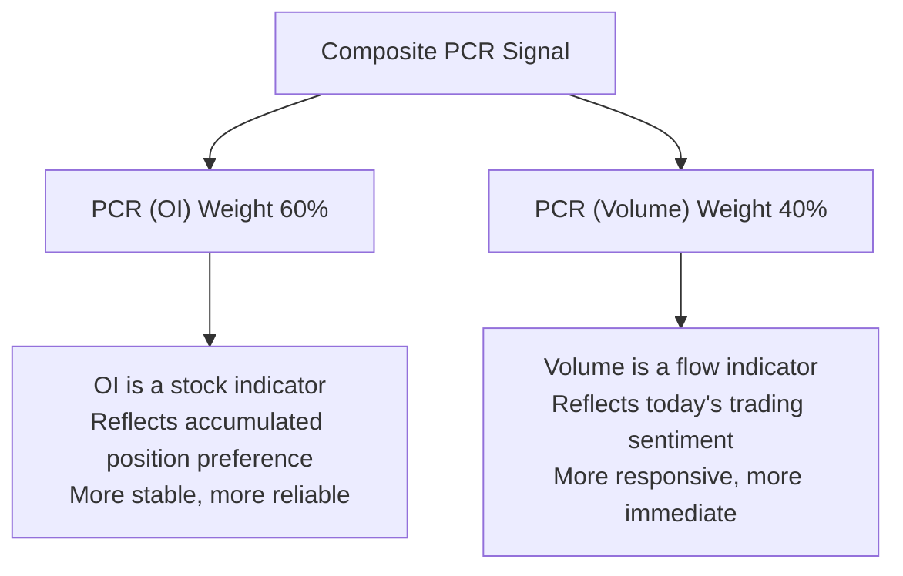
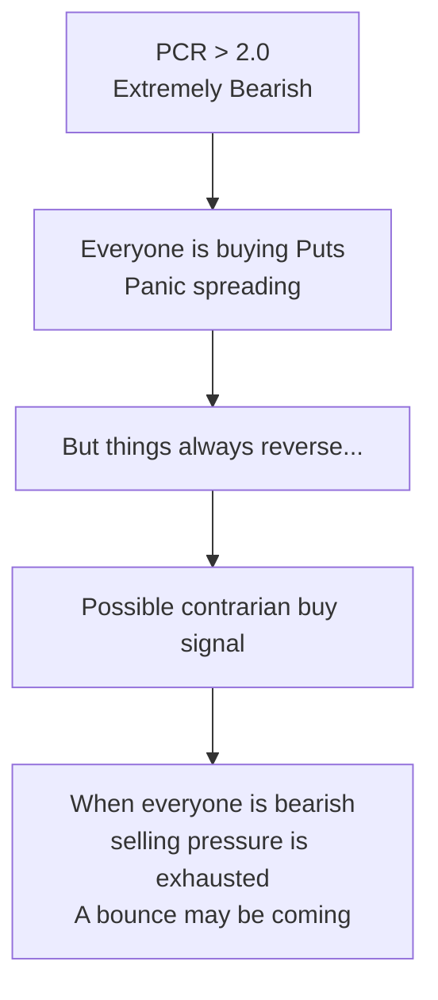
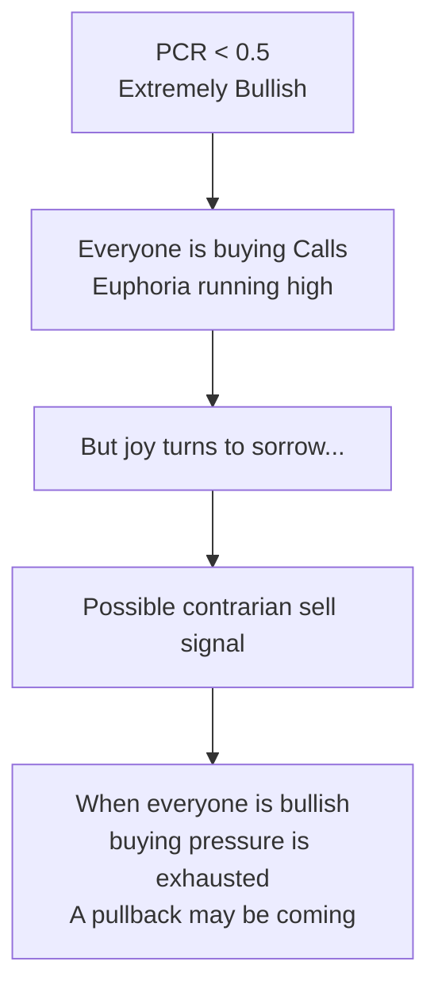
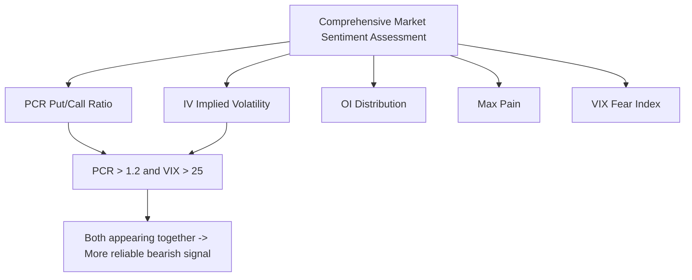

# Put/Call Ratio

:::tip Who is this for?
This article is for readers who want to quickly determine whether "the market is leaning optimistic or pessimistic." PCR is one of the most concise market sentiment indicators. After reading, you will be able to interpret it correctly in OptionDash.
:::

## What is PCR?

The **Put/Call Ratio (PCR)** measures the relative activity of put options versus call options in the market. It is one of the oldest and most intuitive market sentiment indicators.

Think of it this way:

> Imagine you are at a polling station, observing people's expressions as they come out. If most people are smiling (buying Calls), it means everyone is optimistic about the future. If most people look worried (buying Puts), it means everyone is pessimistic. PCR is "number of bears / number of bulls."

### Two Variants of PCR

| Variant | Calculation | Focus |
|---------|-------------|-------|
| **PCR (Volume)** | Put Volume / Call Volume | Reflects the day's trading sentiment ("flow") |
| **PCR (OI)** | Put Open Interest / Call Open Interest | Reflects the market's accumulated position preference ("stock") |

```
PCR (Volume) = Total Put Volume / Total Call Volume
PCR (OI)     = Total Put OI / Total Call OI
```

## How to Interpret PCR?

### Basic Interpretation



| PCR Range | Sentiment Signal | Meaning |
|-----------|-----------------|---------|
| `**> 1.2**` | Bearish | Puts significantly outnumber Calls; market is pessimistic |
| **0.7 -- 1.2** | Neutral | Relatively balanced buying and selling |
| `**< 0.7**` | Bullish | Calls significantly outnumber Puts; market is optimistic |

### PCR Dashboard

Imagine a gauge from 0 to 2+:

```
    Extremely Bullish    Bullish    Neutral    Bearish    Extremely Bearish
    (Overly Optimistic)                                    (Overly Pessimistic)
       |            |          |          |           |
  0.3  0.5        0.7        1.0        1.2         2.0   2.5
  |--Red--|---Green----|---Blue------|----Red----|---Red------|
                                      Current Position
       Extreme Zone           Normal Range            Extreme Zone
```

| Range | Color | Meaning |
|-------|-------|---------|
| `**< 0.5**` | Deep Red | Extremely bullish -- possibly overly optimistic, watch for pullback risk |
| **0.5 -- 0.7** | Light Green | Bullish |
| **0.7 -- 1.2** | Blue | Neutral |
| **1.2 -- 2.0** | Light Red | Bearish |
| `**> 2.0**` | Deep Red | Extremely bearish -- possibly overly pessimistic, watch for bounce opportunities |

:::note
Notice that both ends of the gauge are red. This is because **extreme values often signal reversals** -- both extreme bullishness and extreme bearishness are not "good" signals.
:::

## OptionDash's Composite Signal

OptionDash does not use PCR Volume or PCR OI alone. Instead, it combines both into a **Composite Signal:**

```
Composite PCR = PCR_OI x 0.6 + PCR_Volume x 0.4
```

### Why a 60/40 Weighting?



| Indicator | Weight | Advantage | Disadvantage |
|-----------|--------|-----------|-------------|
| PCR (OI) | 60% | More stable, less affected by single-day abnormal trades | Changes slowly, may lag |
| PCR (Volume) | 40% | Responsive, can quickly capture sentiment changes | Easily affected by single-day abnormal trades |

Through 60/40 weighting, the composite signal maintains both **stability** and **sensitivity**.

### Python Implementation

Here is the signal determination logic from the OptionDash backend:

```python
def interpret_pcr(pcr_vol: float, pcr_oi: float) -> str:
    """Convert PCR values into sentiment signals"""
    composite = pcr_oi * 0.6 + pcr_vol * 0.4

    if composite > 1.2:
        return "bearish"
    elif composite < 0.7:
        return "bullish"
    return "neutral"
```

### A Complete Example

Suppose SPY's option data is as follows:

| Indicator | Value |
|-----------|-------|
| Total Call Volume | 500,000 |
| Total Put Volume | 600,000 |
| Total Call OI | 3,200,000 |
| Total Put OI | 4,000,000 |

Calculation:

```
PCR (Volume) = 600,000 / 500,000 = 1.20
PCR (OI)     = 4,000,000 / 3,200,000 = 1.25

Composite PCR = 1.25 x 0.6 + 1.20 x 0.4
              = 0.75 + 0.48
              = 1.23
```

**Conclusion**: Composite PCR = 1.23 > 1.2 -> **Bearish Signal**

The market is currently leaning pessimistic, with Put activity higher than Call activity.

## What Extreme Values Mean

Extreme PCR values are often the most valuable information:

### Extremely Bearish (PCR > 2.0)



> Warren Buffett once said: "Be greedy when others are fearful." When PCR is extremely high, it is precisely the moment of maximum market fear.

### Extremely Bullish (PCR < 0.5)



:::warning Contrarian Indicator
In extreme value zones, PCR is a **Contrarian Indicator.** That is:

- Very high PCR -> may be a **buying** opportunity (not selling)
- Very low PCR -> may be a **selling** opportunity (not buying)

But this does not mean you should blindly trade against the trend. Extreme values can persist for a while, and confirmation from other analysis tools is needed.
:::

### Anomaly Markers in OptionDash

In OptionDash's **Comparison** module, when a particular underlying's PCR reaches an extreme value, the system automatically marks it as an **Anomaly** to alert you.

## Limitations of PCR

:::warning Cautions When Using PCR

1. **Two sides of a contrarian indicator**: Extreme values signal reversals, but the timing of reversals is hard to determine. PCR can stay in the "extreme" zone for a long time.

2. **Context matters:**

   | Market Environment | Significance of PCR |
   |-------------------|---------------------|
   | Trending market (big rise/fall) | PCR may stay high or low for extended periods; extreme values may not signal reversals |
   | Range-bound market | PCR has more reference value |
   | Before major events | PCR naturally tends higher due to hedging demand |

3. **Different underlyings have different baselines:**

   | Underlying Type | Typical PCR Baseline | Reason |
   |----------------|---------------------|--------|
   | SPY (broad market ETF) | Tends high (1.0-1.5) | Institutions commonly use Puts for hedging |
   | QQQ (tech ETF) | Moderate (0.8-1.2) | Tech stocks have stronger bullish sentiment |
   | Individual stocks | Varies widely | Depends on individual stock conditions |

4. **Does not distinguish large and small orders**: A 10-contract Put and a 10,000-contract Put are treated equally in PCR calculation. In reality, large orders have more reference value.

5. **Time frame**: PCR is a snapshot; PCR at different times can vary greatly. It is recommended to look at it in the context of trends.

## Practical Application Tips

### Comprehensive Analysis

Do not use PCR alone; combine it with other indicators:



### Multiple Time Frames

| Time Frame | Analysis Method |
|-----------|----------------|
| **Intraday** | Observe real-time changes in PCR (Volume) |
| **Daily** | Compare today's PCR with yesterday's |
| **Weekly** | Observe whether the PCR trend is shifting |
| **Cross-underlying** | Compare PCR across different underlyings to see where capital is flowing |

## Viewing PCR in OptionDash

### Dashboard Module

| Data Item | Description |
|-----------|-------------|
| **PCR (Volume)** | Daily volume ratio |
| **PCR (OI)** | Current OI ratio |
| **Composite Signal** | 60/40 weighted composite PCR |
| **Signal Label** | Bullish / Neutral / Bearish |

### Comparison Module

Here you can:

- View PCR for multiple underlyings simultaneously
- Compare sentiment differences across underlyings
- Discover anomaly markers for extreme PCR values

### Historical Data Module

- View PCR trends over time
- Analyze the relationship between PCR and actual stock price movements
- Verify the historical accuracy of PCR signals

## Next Steps

- [Greeks](./greeks.md) -- Understand option price sensitivity to various factors
- [Gamma Exposure (GEX)](./gex.md) -- Learn how market maker hedging affects stock prices
- [Volatility](./volatility.md) -- Deep dive into IV and volatility trading
