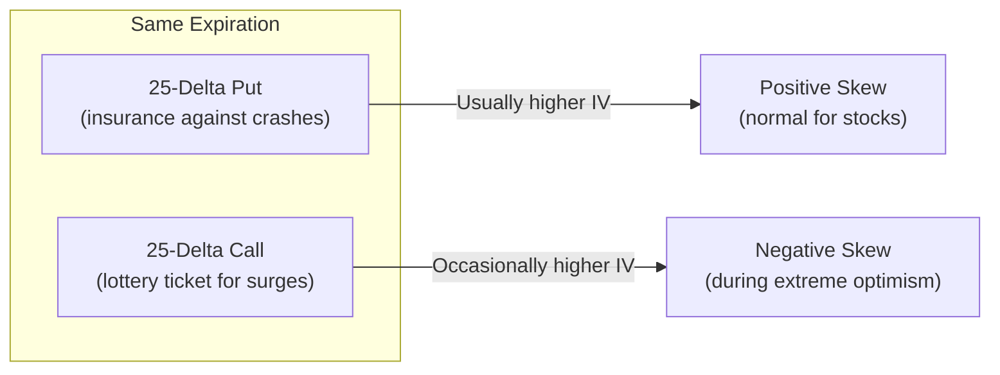
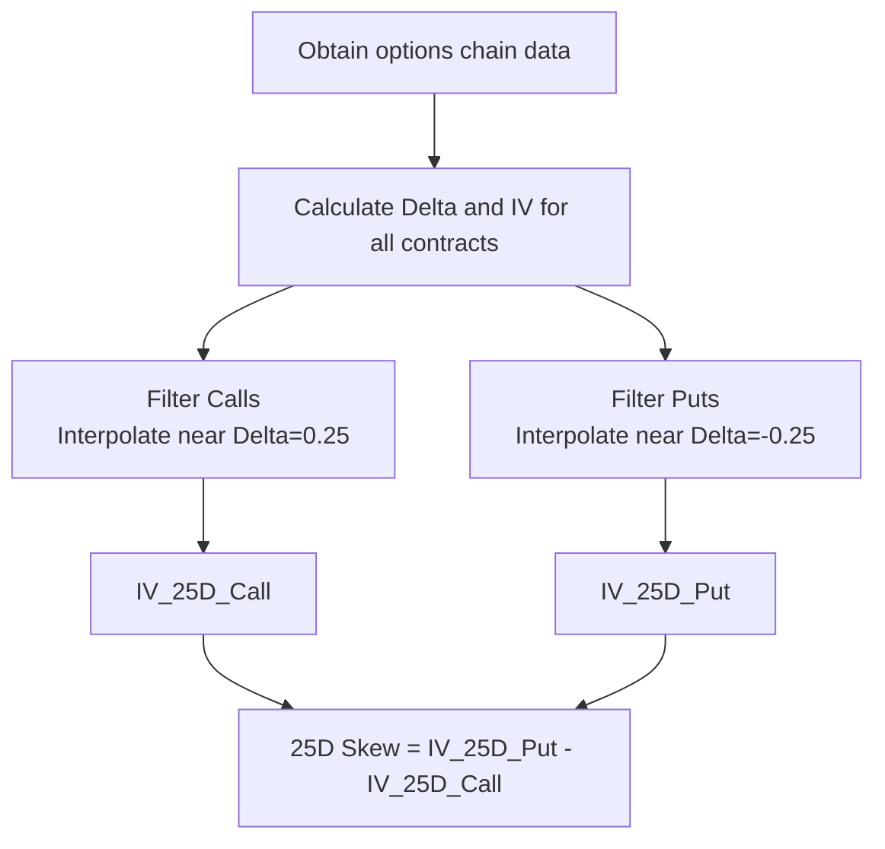
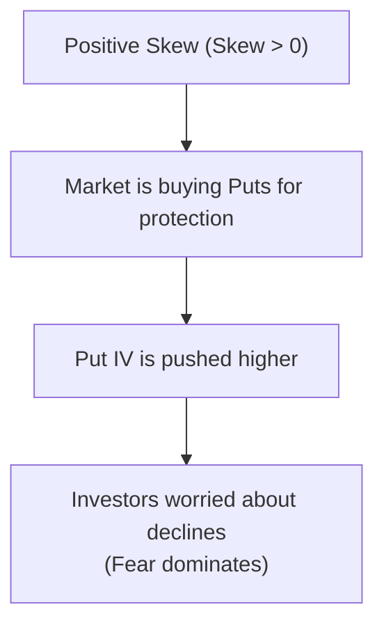
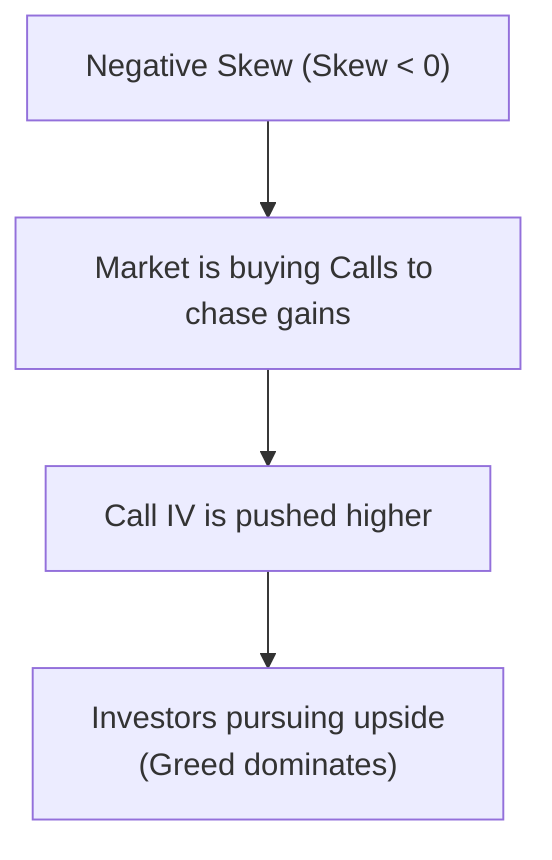
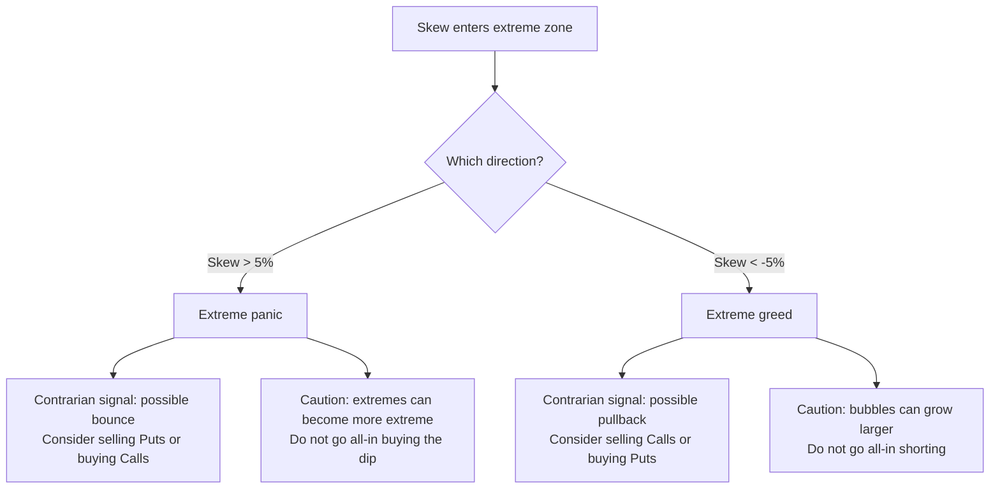
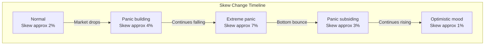

# 25-Delta Skew

:::tip Who is this for?
This article is for complete beginners. It is recommended to first read [Volatility](./volatility.md) to understand the concept of implied volatility (IV). Skew is an important tool for understanding the fear and greed asymmetry in the options market.
:::

## What is Skew?

In an ideal options market, Calls and Puts with the same expiration and same Delta should have **the same implied volatility.** But reality is different -- **downside protection is typically more expensive than upside speculation.**

**25-Delta Skew** measures this asymmetry: the difference between the IV of 25-Delta Puts and the IV of 25-Delta Calls.

Think of it this way:

> Imagine you are shopping for insurance. A policy protecting against "your house burning down" and a policy protecting against "your house being struck by lightning twice" would definitely be priced differently. In the stock market, a "crash" (burning down) is more common than a "surge" (struck by lightning twice), so protection against crashes (Puts) is usually more expensive. **Skew is the indicator that measures this "insurance price asymmetry."**



---

## Calculation Method

### Formula

```
25-Delta Skew = IV(25-Delta Put) - IV(25-Delta Call)
```

### Why 25-Delta?

| Reason for Choosing 25-Delta | Explanation |
|------------------------------|-------------|
| **Sufficiently out-of-the-money** | Not too close to ATM (ATM IV differences are not pronounced) |
| **Good liquidity** | 25-Delta is the standard quoting point in the OTC options market |
| **Industry convention** | Traders and analysts universally use 25-Delta as a reference |

### What is a 25-Delta Option?

Recall the concept of Delta from [Greeks](./greeks.md):

- **25-Delta Call**: A call option with Delta approximately +0.25, with roughly a 25% chance of expiring in-the-money
- **25-Delta Put**: A put option with Delta approximately -0.25, with roughly a 25% chance of expiring in-the-money

Both options are **moderately out-of-the-money** -- not extreme bets, but not mediocre choices either.

### OptionDash Calculation Details

OptionDash uses **linear interpolation** to precisely find the IV at Delta = 0.25 and Delta = -0.25:

1. Obtain the Delta and IV of all Calls in the options chain
2. Use `scipy.interpolate.interp1d` to interpolate at Delta = 0.25 to get IV
3. Use the same method to interpolate at Delta = -0.25 for Puts to get IV
4. Subtract the two to get 25-Delta Skew



---

## Positive Skew vs Negative Skew

### Positive Skew -- "Fear Dominates"

**When the IV of 25-Delta Puts is higher than the IV of 25-Delta Calls, skew is positive.**

This means the market is willing to pay a higher price for "protection against crashes."



| Skew Level | Meaning | Market Sentiment |
|-----------|---------|-----------------|
| Skew ≈ 0% | Put and Call IV are close | Calm, balanced bulls and bears |
| Skew ≈ 2-3% | Mild positive skew | This is **normal** for the stock market |
| Skew ≈ 5% | Significant positive skew | Market is clearly fearful |
| `Skew > 5%` | **Extreme positive skew** | Extreme panic, heavy Put buying |

:::info Why is Positive Skew Normal for Stocks?
1. **Institutional hedging demand**: Funds, pension funds, and other institutions need to buy Puts to hedge their portfolio risk
2. **Crash fear**: Memories of market crashes (like the 2008 financial crisis, 2020 pandemic) are fresh; investors are willing to pay extra for "disaster insurance"
3. **Leveraged traders' needs**: Investors using leverage need Puts to protect themselves from margin calls
:::

### Negative Skew -- "Greed Dominates"

**When the IV of 25-Delta Calls is higher than the IV of 25-Delta Puts, skew is negative.**

This means the market is willing to pay a higher price for "betting on a surge."



Negative skew is **uncommon** in the stock market, but when it appears, it usually means:

| Meaning | Explanation |
|---------|-------------|
| **Extreme optimism** | Market is frantically chasing gains; speculators buying Calls in volume |
| **FOMO effect** | "Fear Of Missing Out" sentiment is spreading |
| **Potential risk** | Extreme optimism often foreshadows a possible pullback |

---

## Extreme Values and Signals

OptionDash marks extreme skew values with **shaded regions** in the historical chart:

### Extreme Zone Definitions

| Zone | Skew Range | Marker | Meaning |
|------|-----------|--------|---------|
| **Extreme bearish** | `Skew > 5%` | Red shading | Extreme panic, heavy Put buying |
| **Normal zone** | -5% to +5% | No shading | Normal fluctuation range |
| **Extreme bullish** | `Skew < -5%` | Green shading | Extreme greed, heavy Call buying |

### Contrarian Signals from Extreme Values

:::tip Contrarian Thinking
Extreme skew is often a **contrarian signal:**
- **Skew > 5% (extreme panic)**: The market may already be oversold and could bounce. "Be greedy when others are fearful."
- **Skew < -5% (extreme greed)**: The market may be overheated; pullback risk increases. "Be fearful when others are greedy."
:::



---

## Skew Change Patterns

Skew is not static; it changes with market conditions. Observing the **trend of skew changes** is more meaningful than the absolute value:

### Typical Change Patterns

| Pattern | Description | Possible Meaning |
|---------|-------------|-----------------|
| **Skew falls from high levels** | Gradually returning to normal from extreme panic zone | Panic is subsiding; market may stabilize |
| **Skew rises from low levels** | Starting to rise from negative or near-zero levels | Hedging demand increasing; market growing uneasy |
| **Skew expands sharply** | Jumping from normal zone to extreme zone in a short time | Panic selling beginning; watch for risk |
| **Skew narrows sharply** | Falling from extreme zone in a short time | Panic ending; may be time to buy the dip |



---

## Cross-Underlying Comparison

Skew can also be used to **compare market sentiment across different underlyings:**

| Underlying | Typical Skew | Explanation |
|-----------|-------------|-------------|
| **SPY (S&P 500 ETF)** | Usually positive (2-4%) | Blue-chip large caps; strong institutional hedging demand |
| **QQQ (Nasdaq 100 ETF)** | Usually higher (3-5%) | Tech stocks are more volatile; stronger hedging demand |
| **Individual stocks (e.g., AAPL)** | Varies by stock | Depends on the stock's volatility characteristics and investor sentiment |

:::tip Cross-Underlying Application
If SPY's Skew is 2% while QQQ's Skew is as high as 6%, it means the tech stock market's panic level is far higher than the overall market. This could be a relative value trading opportunity.
:::

---

## Viewing Skew in OptionDash

### Historical Chart (Historical Module)

OptionDash's historical module includes a **25-Delta Skew chart:**

| Display Content | Description |
|----------------|-------------|
| **Skew curve** | 25-Delta Skew values over time |
| **Extreme bearish zone** | `Red shading (Skew > 5%)` |
| **Extreme bullish zone** | `Green shading (Skew < -5%)` |
| **Zero line** | Reference line distinguishing positive and negative skew |

### How to Read It

1. **Observe the current value**: Is Skew positive or negative? How large is it?
2. **Observe the trend**: Is Skew expanding or narrowing?
3. **Watch for extreme zones**: Has it entered the red or green shaded areas?
4. **Combine with stock price analysis**: Are Skew changes consistent with stock price movements?

---

## Practical Application Guide

### Scenario 1: Skew Enters Extreme Panic Zone (> 5%)

| Step | Action |
|------|--------|
| 1. Confirm the cause of panic | Is it systemic risk or an isolated event? |
| 2. Assess contrarian opportunity | Extreme panic may signal a bounce opportunity |
| 3. Act cautiously | Do not go all-in buying the dip; extremes can become more extreme |
| 4. Wait for a signal | Wait for Skew to start falling before entering |

### Scenario 2: Skew Narrows Sharply

| Step | Action |
|------|--------|
| 1. Determine the cause | Is it panic subsiding or Call speculation heating up? |
| 2. Assess sustainability | Does the fundamental outlook support the sentiment shift? |
| 3. Follow up | If Skew continues narrowing or turns negative, may be entering a greed phase |

### Scenario 3: Skew Within Normal Range

| Step | Action |
|------|--------|
| 1. Use as baseline | Record current Skew as a "normal" reference |
| 2. Monitor changes | Watch whether Skew begins deviating from the normal range |
| 3. Combine with other indicators | Analyze comprehensively alongside GEX, PCR, and other indicators |

:::warning Risk Warning
Skew is a supplementary indicator and should not be used in isolation. While extreme skew is often a contrarian signal, **extreme values can become even more extreme.** When using Skew for trading decisions, always combine it with other analysis tools and strictly control risk.
:::

---

## Terminology Reference

| English Term | Description |
|-------------|-------------|
| 25-Delta Skew | The difference between 25-Delta Put IV and Call IV |
| Risk Reversal | Another name for Skew (OTC options market terminology) |
| Positive Skew | `Put IV > Call IV; market leans fearful` |
| Negative Skew | `Call IV > Put IV; market leans greedy` |
| Interpolation | Estimating unknown values between known data points |
| Crash Fear | Investor fear of crashes, pushing Put IV higher |
| FOMO | Fear Of Missing Out; the psychology of chasing gains |

:::note Next Steps
- [Greeks](./greeks.md) -- Review the basic concepts of Delta
- [Volatility](./volatility.md) -- Deep dive into IV and VRP
- [Gamma Exposure (GEX)](./gex.md) -- Learn how market maker behavior affects the market
:::
