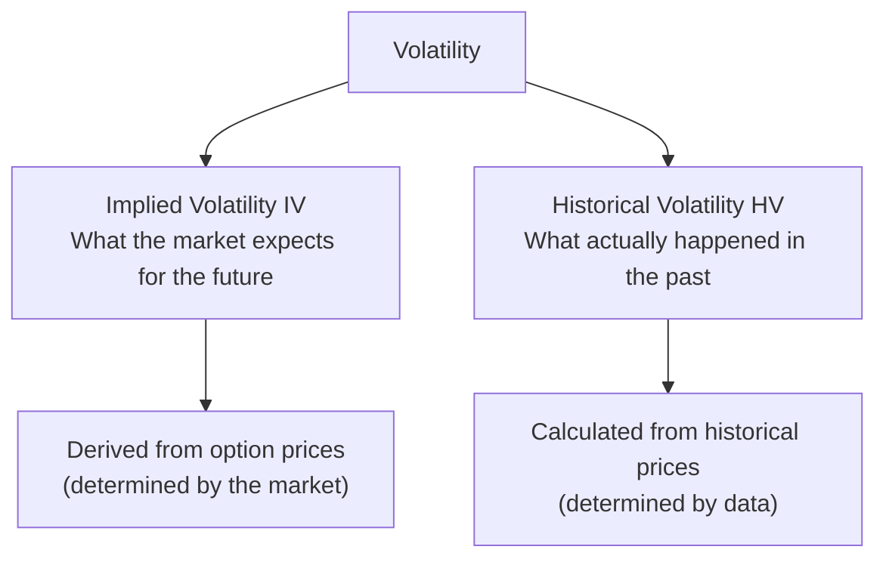
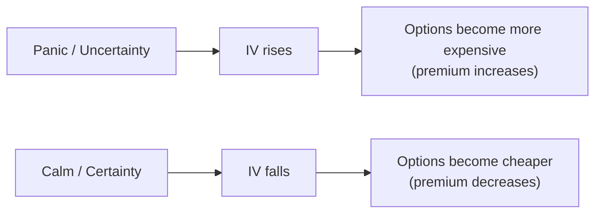
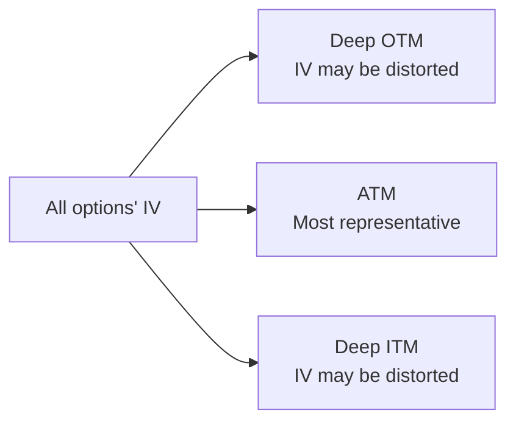
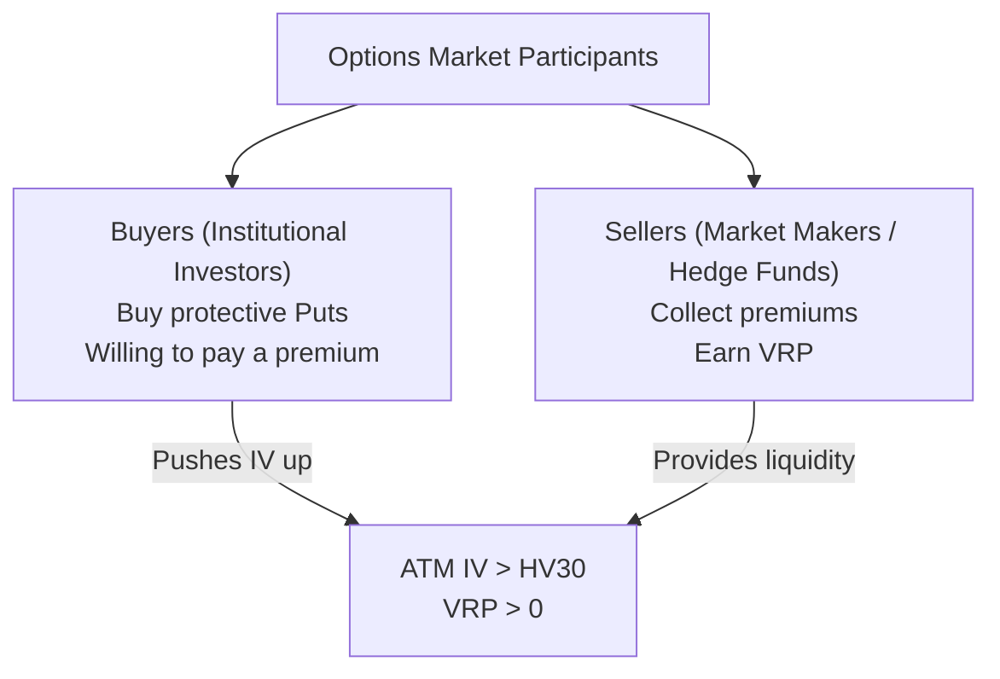
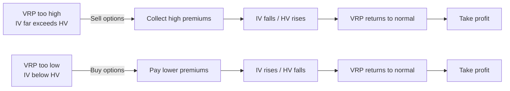
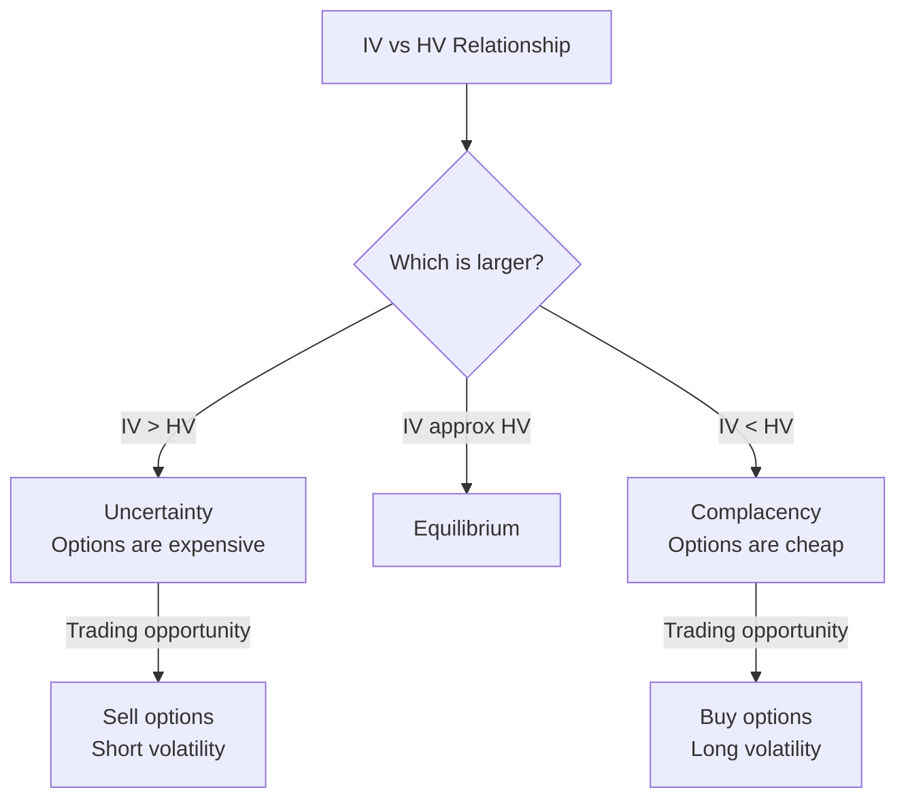
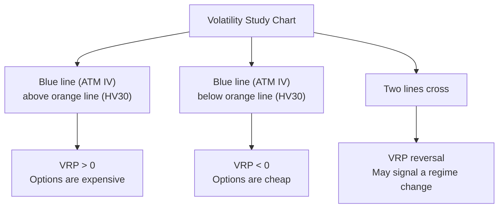

# Volatility

:::tip Who is this for?
This article is for complete beginners. If you understand [Options Basics](./options-basics.md) and [Greeks](./greeks.md), you can understand this article. Volatility is one of the most central variables in option pricing.
:::

## What is Volatility?

**Volatility** measures how dramatically an asset's price moves.

Think of it this way:

> Imagine two roads. One is a flat highway with a steady speed of 100 km/h (low volatility). The other is a mountain road with constant speed changes and sharp turns (high volatility). Although the average speed on both roads might be similar, the mountain road has far more "uncertainty."

In the options market, volatility directly determines option prices (premiums). The higher the volatility, the more expensive the option -- because the probability of large price swings increases, giving the option a better chance of ending in-the-money.



---

## Implied Volatility (IV)

### Definition

**Implied volatility is the market's expectation of future volatility**, derived "in reverse" from the current option price.

Think of it this way:

> You go to a farmer's market to buy watermelons. One watermelon is priced at 50 dollars, another at 100 dollars. The price difference reflects the seller's different expectations of the "sweetness" (value) of these two watermelons. Similarly, **the price differences in options reflect the market's different expectations of "volatility"** -- this expectation is implied volatility.

### Characteristics of IV

| Characteristic | Description |
|---------------|-------------|
| **Forward-looking** | Reflects the market's expectations for the future, not a summary of the past |
| **Dynamically changing** | Changes in real time with market sentiment |
| **Option-specific** | Each option contract has its own IV |
| **Driven by supply and demand** | When panic sets in and more people buy options, IV rises; when calm returns, IV falls |

### IV and Option Price Relationship



### Typical IV Scenarios

| Scenario | IV Level | Reason |
|----------|----------|--------|
| Before earnings release | Spikes | Extreme uncertainty; market willing to pay more for "insurance" |
| After earnings release | Drops sharply | Uncertainty removed; "insurance" no longer valuable (IV Crush) |
| Market panic (e.g., crash) | Extremely high | Heavy Put buying for protection, pushing IV up |
| Calm market period | Relatively low | No major events, flat option demand |

:::warning IV Crush
This is one of the most important traps for option traders to watch out for. Before major events (such as earnings, Fed meetings), IV rises significantly. After the event, uncertainty is removed and IV drops sharply. Even if the stock moves in the direction you predicted, the loss from the IV decline may still result in a net loss.
:::

---

## Historical Volatility (HV)

### Definition

**Historical volatility is the actual magnitude of an asset's price fluctuation over a past period.** It is calculated from real data, not a prediction.

Think of it this way:

> IV is a weather forecast saying there is an 80% chance of rain tomorrow (a prediction). HV is the fact that it actually rained 18 of the past 30 days (a fact). The two often differ, but over time they tend to converge.

### Calculation Method

OptionDash uses **30-day Historical Volatility (HV30)**, calculated as:

```
HV30 = StdDev(ln(today's close / yesterday's close), 30 days) x sqrt(252)
```

Where:
- `ln(today's close / yesterday's close)` is the **log return**
- `StdDev(..., 30 days)` is the **standard deviation** of log returns over the past 30 trading days
- `x sqrt(252)` is the annualization factor (approximately 252 trading days per year)

### Example

Suppose SPY's closing prices over the past 5 days were:

| Date | Close | Log Return |
|------|-------|------------|
| Monday | $530.00 | -- |
| Tuesday | $532.50 | ln(532.50/530.00) = 0.0047 |
| Wednesday | $528.00 | ln(528.00/532.50) = -0.0085 |
| Thursday | $535.00 | ln(535.00/528.00) = 0.0132 |
| Friday | $533.00 | ln(533.00/535.00) = -0.0037 |

Then calculate the standard deviation of these 4 log returns and multiply by sqrt(252) to get the annualized historical volatility.

---

## ATM IV (At-the-Money Implied Volatility)

### Definition

**ATM IV is the implied volatility of at-the-money options**, i.e., the IV of options whose strike price is closest to the current stock price.

OptionDash calculates it by averaging the ATM Call and ATM Put IV:

```
ATM IV = (ATM Call IV + ATM Put IV) / 2
```

### Why Use ATM IV?

| Reason | Explanation |
|--------|-------------|
| **Most representative** | ATM options have the best liquidity and most accurate pricing |
| **Avoids extreme values** | Deep OTM/ITM option IVs may be distorted |
| **Industry standard** | The VIX index is also calculated based on near-the-money options |



---

## Volatility Risk Premium (VRP)

### Definition

**Volatility Risk Premium (VRP)** is the difference between implied volatility and historical volatility:

```
VRP = ATM IV - HV30
```

### Why is VRP Usually Positive?

Option buyers (mainly institutional investors) are willing to pay a little extra for "insurance," just like when you buy health insurance, the premium is typically higher than the expected actual medical expenses. This extra amount is the VRP.



### VRP Meaning and Trading Signals

| VRP Range | Meaning | Trading Signal |
|-----------|---------|---------------|
| `**Significantly positive (e.g., > 5%)**` | Options are "expensive"; IV far exceeds actual volatility | Sell options (short volatility) |
| **Near zero** | IV is close to actual volatility | Neutral, wait and see |
| **Negative** | Options are "cheap"; IV is below actual volatility | Buy options (long volatility) |

### VRP's Mean Reversion Property

VRP has a strong **mean reversion** property:



:::info Mean Reversion
Historical data shows that VRP stays positive over the long term (averaging about 3-5%), but can fluctuate wildly under extreme market conditions. When VRP deviates too far from its mean, it tends to revert to normal levels. This reversion process is the trading opportunity.
:::

---

## Relationship Between IV and HV

The relationship between implied volatility and historical volatility reveals the market's "expectations vs reality":

| State | Meaning | Market Sentiment |
|-------|---------|-----------------|
| `**IV > HV**` | Market expects future volatility to exceed recent history | Rising uncertainty; panic or anticipation of major events |
| **IV ≈ HV** | Market expectations align with recent history | Calm, no particular expectations |
| `**IV < HV**` | Market expects future volatility to be less than recent history | Complacency; market believes recent volatility will subside |



:::tip Typical Patterns Around Events
1. **Before event**: IV rises (market prices in uncertainty ahead of time), VRP expands
2. **Event occurs**: Actual volatility may be large, but IV already reflected it in advance
3. **After event**: IV drops quickly (IV Crush), VRP narrows
:::

---

## Volatility Display in OptionDash

### Volatility Study Chart

OptionDash's historical module includes a **Volatility Study chart** that simultaneously displays three curves:

| Curve | Color | Meaning |
|-------|-------|---------|
| **ATM IV** | Blue | Market's expectation of future volatility |
| **HV30** | Orange | Actual volatility over the past 30 days |
| **VRP** | Purple | The difference between IV and HV (shaded area) |

### How to Read the Volatility Study Chart



---

## Practical Application Guide

### Strategy 1: VRP Mean Reversion

**Suitable when**: VRP has deviated significantly from its historical mean

| VRP State | Action | Expectation |
|-----------|--------|-------------|
| VRP far above mean | Sell Short Straddle or Iron Condor | Profit when IV falls |
| VRP far below mean | Buy Long Straddle | Profit when IV rises |

### Strategy 2: Event Trading

**Suitable when**: Before major events like earnings, Fed meetings, etc.

1. **Before event**: IV rises; sell options to collect high premiums
2. **After event**: IV Crush; buy back options to close for profit
3. **Caution**: If actual volatility far exceeds expectations, losses may occur

### Strategy 3: Volatility Timing

**Suitable when**: Long-term investors

| Market State | Suggestion |
|-------------|------------|
| IV at historical highs (panic period) | Sell protective Puts (equivalent to buying stocks at a discount) |
| IV at historical lows (calm period) | Buy protective Puts (cheap "insurance") |

:::warning Risk Warning
Volatility trading may seem simple, but there are many pitfalls in practice:
- IV can go more extreme than you expect ("the market can stay irrational longer than you can stay solvent")
- Tail risk from selling options is enormous (one black swan can wipe out years of profits)
- VRP mean reversion can take a very long time
:::

---

## Terminology Reference

| English Term | Description |
|-------------|-------------|
| Implied Volatility (IV) | The market's expectation of future volatility |
| Historical Volatility (HV) | Actual volatility over a past period |
| HV30 | 30-day historical volatility, annualized |
| ATM IV | At-the-money implied volatility |
| VRP | Volatility Risk Premium; the difference between ATM IV and HV30 |
| IV Crush | A sharp drop in IV after an event |
| Mean Reversion | The tendency of values that deviate from the mean to revert to the average |
| Log Return | ln(today's price / yesterday's price) |

:::note Next Steps
- [25-Delta Skew](./skew.md) -- Understand the differences in IV across different Delta options
- [Gamma Exposure (GEX)](./gex.md) -- Learn how volatility affects the market through market makers
:::
