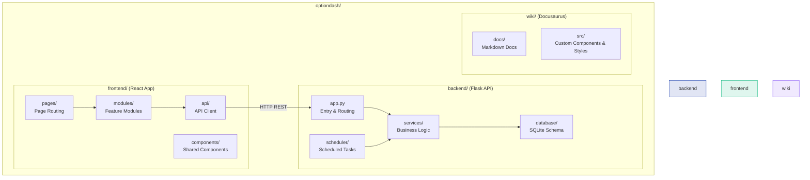

# Getting Started

Welcome to OptionDash! This guide will help you complete the installation and startup within a few minutes to start analyzing options market data.

## Introduction

**OptionDash** is an open-source options chain analysis and market sentiment monitoring platform. It helps traders make more informed investment decisions by fetching and analyzing options market data in real time.

### What Can OptionDash Do?

- **Open Interest (OI) Analysis**: Identify major market OI distribution and discover support/resistance levels
- **Volume Analysis**: Track large options trades and capture smart money movements
- **Implied Volatility (IV) Monitoring**: Track IV changes in real time and assess options pricing fairness
- **Greeks Analysis**: Understand options risk exposure through Delta, Gamma, Theta, and Vega
- **GEX Analysis**: Gamma Exposure reveals market maker hedging behavior
- **Max Pain**: Predict the price level options may gravitate toward at expiration
- **Put/Call Ratio (PCR)**: Measure the market's overall bearish or bullish sentiment
- **Macroeconomic Indicators**: Track macro data such as VIX, U.S. Treasury yields, and the U.S. Dollar Index

### Tech Stack

| Layer | Technology |
|-------|------------|
| Frontend | React 19 + TypeScript + Vite |
| Backend | Python Flask + SQLite |
| Data Source | Yahoo Finance API |
| Scheduler | APScheduler |
| Cache | In-memory cache + SQLite persistence |

### Open Source License

OptionDash is released under the **MIT License**, completely free to use, with fully open-source code.

---

## System Requirements

Before you begin, make sure your system meets the following requirements:

| Dependency | Minimum Version | Recommended Version |
|-----------|-----------------|---------------------|
| Python | 3.12+ | 3.12 |
| Node.js | 20+ | 20 LTS |
| npm | 10+ | 10+ |

### Operating System

OptionDash supports the following operating systems:

- **macOS** -- Native support
- **Linux** -- Native support (Ubuntu 22.04+, Debian 12+, Fedora 38+, etc.)
- **Windows** -- WSL2 (Windows Subsystem for Linux) is recommended

:::tip
If you are using Windows, it is strongly recommended to install WSL2 and an Ubuntu distribution first, as this avoids most compatibility issues.
:::

---

## Installation Steps

### Clone the Repository

First, clone the project code to your local machine:

```bash
git clone https://github.com/your-username/optiondash.git
cd optiondash
```

### Backend Installation

The backend is built with Python. It is recommended to use a virtual environment to isolate dependencies.

**Step 1: Create and Activate a Virtual Environment**

```bash
cd backend
python -m venv venv
```

Activate the virtual environment:

```bash
# macOS / Linux
source venv/bin/activate

# Windows (PowerShell)
venv\Scripts\Activate.ps1

# Windows (CMD)
venv\Scripts\activate
```

After successful activation, you will see a `(venv)` indicator at the beginning of your terminal prompt.

**Step 2: Install Python Dependencies**

```bash
pip install -r requirements.txt
```

This will install all required Python packages, including Flask, yfinance, APScheduler, and more.

:::info
If `pip install` is slow, you can use a mirror source:

```bash
pip install -r requirements.txt -i https://pypi.tuna.tsinghua.edu.cn/simple
```
:::

### Frontend Installation

The frontend is built with React + TypeScript and requires npm dependencies.

```bash
cd frontend
npm install
```

:::note
When running `npm install` for the first time, npm will download all dependency packages. This may take a few minutes, so please be patient.
:::

---

## Starting the Services

OptionDash requires both the backend API service and the frontend development server to run simultaneously. It is recommended to use two terminal windows to start them separately.

### Start the Backend

Open a terminal window and navigate to the backend directory:

```bash
cd backend
python app.py
```

You should see output similar to:

```
 * Serving Flask app 'app'
 * Debug mode: on
 * Running on http://0.0.0.0:5001
```

The backend API service is now running at `http://localhost:5001`.

### Start the Frontend

Open another terminal window and navigate to the frontend directory:

```bash
cd frontend
npm run dev
```

You should see output similar to:

```
  VITE v5.x.x  ready in xxx ms

  ➜  Local:   http://localhost:5173/
  ➜  Network: use --host to expose
```

The frontend development server is now running at `http://localhost:5173`.

---

## Verifying the Installation

After starting the services, you can verify the installation was successful using the following methods.

### Method 1: Browser Access

Open `http://localhost:5173` in your browser. You should see the OptionDash main interface.

### Method 2: API Health Check

Use the `curl` command to check whether the backend API is responding normally:

```bash
curl http://localhost:5001/api/health
```

Expected response:

```json
{"status": "ok"}
```

### Method 3: Data Retrieval Test

Try fetching a summary of options data for SPY:

```bash
curl "http://localhost:5001/api/dashboard/summary?ticker=SPY"
```

If a JSON response containing options data is returned, the entire system is connected and functioning correctly.

:::tip
The first request may take a few seconds, as the backend needs to fetch data from Yahoo Finance and initialize the cache. Subsequent requests will be faster.
:::

---

## Project Structure Overview

Below is the overall project structure of OptionDash:



### Directory Description

| Directory | Description |
|-----------|-------------|
| `backend/` | Flask backend service, providing REST API, data fetching, caching, and scheduling |
| `backend/services/` | Core business logic: options data processing, indicator calculations |
| `backend/scheduler/` | Polling tasks that automatically refresh cached data |
| `backend/database/` | SQLite database schema and operations |
| `frontend/` | React frontend application containing all visualization modules |
| `frontend/src/modules/` | Five feature modules: Dashboard, Strikes, Comparison, Historical, Macro |
| `frontend/src/api/` | Frontend API client, wrapping HTTP requests to the backend |
| `wiki/` | Docusaurus documentation site -- the content you are currently reading |

---

## Core Features at a Glance

OptionDash provides five core feature modules, each focusing on a different dimension of options analysis:

| Module | Route | Description |
|--------|-------|-------------|
| **Dashboard** | `/dashboard` | Key metrics overview -- centralized display of OI, Volume, IV, Max Pain, PCR, and other critical data |
| **Strike Analysis** | `/strikes` | Strike price analysis charts -- display OI, Volume, and Greeks distribution by strike price |
| **Comparison** | `/comparison` | Multi-ticker comparison -- compare options metrics side by side across multiple tickers to find relative value opportunities |
| **Historical** | `/historical` | Historical trends -- track the historical changes of key indicators to identify patterns and turning points |
| **Macro** | `/macro` | Macroeconomic indicators -- VIX, Treasury yields, U.S. Dollar Index, Federal Funds Rate, and other macro data panels |

:::info
All modules support switching between multiple tickers. Enter or select a ticker in the ticker selector at the top of the interface to switch.
:::

---

## Supported Tickers

OptionDash currently supports options analysis for the following tickers:

| Ticker | Name | Description |
|--------|------|-------------|
| **SPY** | SPDR S&P 500 ETF | Tracks the S&P 500 Index, the most representative ETF in the U.S. stock market |
| **QQQ** | Invesco QQQ Trust | Tracks the Nasdaq 100 Index, with high concentration in tech stocks |
| **IWM** | iShares Russell 2000 ETF | Tracks the Russell 2000 small-cap index, reflecting mid- and small-cap performance |
| **TLT** | iShares 20+ Year Treasury Bond ETF | Tracks U.S. long-term Treasury bonds, reflecting interest rate expectations and safe-haven sentiment |
| **XLF** | Financial Select Sector SPDR Fund | Tracks the financial sector, reflecting the performance of banks and financial institutions |

:::tip
SPY and QQQ have the most liquid options markets, making their data analysis the most reliable. Beginners are advised to start with these two tickers.
:::

---

## Next Steps

Congratulations on completing the OptionDash installation! Here is what you can do next:

<div style={{display: 'grid', gridTemplateColumns: 'repeat(auto-fit, minmax(250px, 1fr))', gap: '1rem', marginTop: '1rem'}}>

<div className="metric-card metric-card--blue">
  <div className="metric-card__label">Learn to Use</div>
  <div style={{marginTop: '0.5rem'}}>

**[User Guide](/guide/dashboard)** -- Learn the detailed operations of each feature module

  </div>
</div>

<div className="metric-card metric-card--green">
  <div className="metric-card__label">Understand Metrics</div>
  <div style={{marginTop: '0.5rem'}}>

**[Core Concepts](/concepts/options-basics)** -- Deeply understand the meaning of OI, Greeks, GEX, and other professional metrics

  </div>
</div>

<div className="metric-card metric-card--purple">
  <div className="metric-card__label">Learn the Architecture</div>
  <div style={{marginTop: '0.5rem'}}>

**[System Architecture](/architecture/overview)** -- Understand the technical architecture and data flow of OptionDash

  </div>
</div>

</div>
