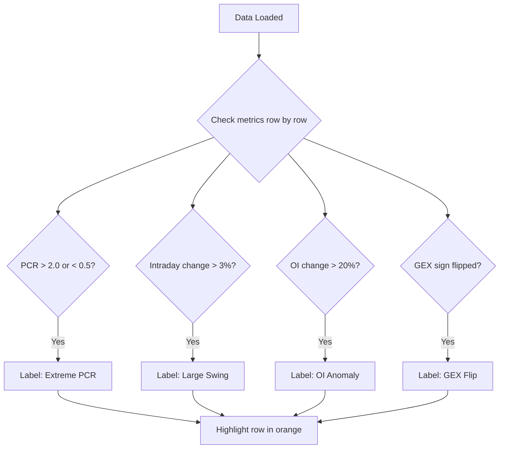

# Multi-Ticker Comparison

The Multi-Ticker Comparison page lets you view core options metrics for multiple tickers simultaneously and automatically detects anomalies.

## Overview

The page displays data for the following tickers in a table format:

- **SPY** -- S&P 500 ETF
- **QQQ** -- Nasdaq 100 ETF
- **IWM** -- Russell 2000 ETF
- **TLT** -- 20+ Year U.S. Treasury Bond ETF
- **XLF** -- Financial Sector ETF

The page includes an **Anomaly Detection** feature. When an anomaly is detected in any metric, the row is highlighted in orange with an anomaly label.

### How to Access

```
/comparison
```

API endpoint:

```bash
curl http://localhost:5001/api/comparison
```

---

## Comparison Table Guide

The table contains the following columns, from left to right:

### Ticker Information

| Column | Description |
|--------|-------------|
| Ticker | Ticker symbol (displayed in blue, fixed on the left side) |
| Spot Price | Current price and intraday change percentage (green for up / red for down) |

### Core Metrics

| Column | Description |
|--------|-------------|
| Max Pain | Max Pain strike price, with the deviation from spot price shown in parentheses (in dollars) |
| PCR | Put/Call Ratio, with a sentiment signal label (Bearish / Bullish / Neutral) |
| GEX | Gamma exposure amount, with a market state label (Positive Gamma / Negative Gamma) |

### Position Data

| Column | Description |
|--------|-------------|
| Call OI | Total call options open interest |
| Put OI | Total put options open interest |

### Anomaly Detection

Anomaly detection is one of the core features of this page. The system automatically scans each metric, and when an anomaly is detected, displays an **orange anomaly label** on that row.

The system detects the following four types of anomalies:

| Anomaly Type | Trigger Condition | Label |
|--------------|-------------------|-------|
| Extreme PCR | `PCR > 2.0 or PCR < 0.5` | `Extreme PCR` |
| Large Price Swing | `Intraday change > 3%` | `Large Swing` |
| OI Anomaly | `OI change > 20% vs 5-day average` | `OI Anomaly` |
| GEX Sign Flip | GEX changes from positive to negative or vice versa | `GEX Flip` |



---

## Usage Tips

### Finding Extreme Values

Click any column header to **sort**. By sorting, you can quickly find:

- Tickers with the highest/lowest PCR
- Tickers with the largest/smallest GEX
- Tickers with the biggest price swings

### Pay Attention to Highlighted Rows

Rows highlighted in orange are tickers with detected anomalies. Prioritize these tickers, as they may be experiencing unusual market conditions.

### Sector Sentiment Comparison

By comparing the PCR signals of SPY (broad market), QQQ (tech), IWM (small caps), and XLF (financials), you can identify sentiment divergence across sectors:

- If QQQ shows "Bearish" while XLF shows "Bullish" -- the tech sector is under pressure, and capital may be rotating into the financial sector
- If all tickers show elevated PCR simultaneously -- systemic risk is rising

### GEX Correlation Observation

Observe whether the GEX states of different tickers are consistent:

- All positive gamma -- The market as a whole is stable
- All negative gamma -- The market may be entering a turbulent period
- Divergence appears -- Different sectors face different volatility risks

:::tip Daily Usage Recommendation
It is recommended to check the comparison page once before the market opens and once before the market closes on each trading day to quickly grasp the full market picture.
:::
