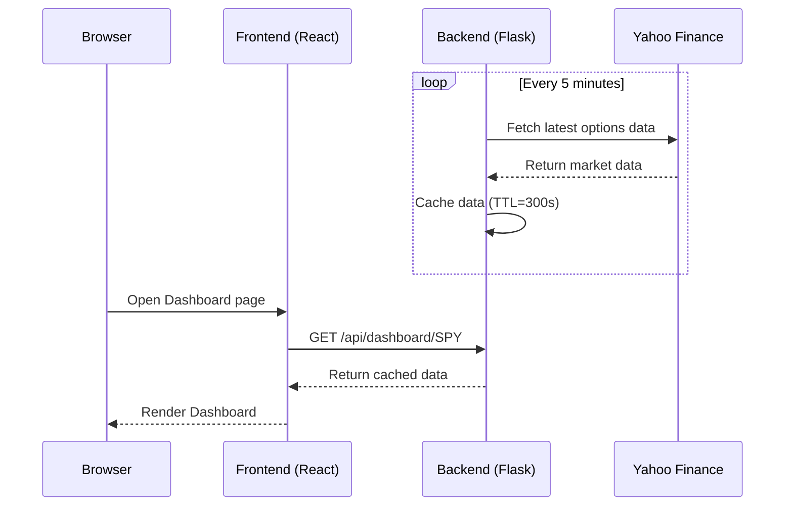

# Dashboard

The Dashboard is the core page of OptionDash, letting you see four key options metrics for any ticker at a glance.

## Overview

The Dashboard displays the following four core data points:

- **Spot Price** -- The current market price of the underlying asset
- **Max Pain** -- The strike price at which option sellers have the minimum total obligation
- **Put/Call Ratio** -- An indicator measuring bullish/bearish market sentiment
- **Gamma Exposure** -- The stabilizing/amplifying effect of market maker hedging behavior on the market

### How to Access

Open the Dashboard page in your browser and use the **Ticker Selector** at the top of the page to enter a ticker symbol (e.g., `SPY`, `QQQ`), then select an expiration date:

```
/dashboard?ticker=SPY
```

You can also fetch data directly via the API:

```bash
curl http://localhost:5001/api/dashboard/SPY
```

After the page loads, it automatically fetches data for the nearest expiration date. You can switch to a different weekly/monthly expiration using the **Expiration Date Selector**.

---

## Interface Guide

The Dashboard consists of four data cards, each displaying a core metric. Below is a detailed explanation of each card.

### Spot Price

This is the current market price of the underlying asset, sourced from Yahoo Finance (approximately 15-minute delay).

The card displays the following information:

| Information | Description |
|------------|-------------|
| Current Price | The latest price of the underlying asset |
| Intraday Change | The price change with color indicators (green for up, red for down) |
| Deviation from Max Pain | The distance (in dollars) between the current price and the Max Pain point |

**How to Interpret:**

- When the spot price is **above** Max Pain, it implies the price may experience downward gravitational pull
- When the spot price is **below** Max Pain, it implies the price may experience upward gravitational pull
- The larger the deviation, the stronger the theoretical pullback force (especially as expiration approaches)

### Max Pain

Max Pain is the price at which option writers/sellers bear the minimum total loss if options are settled at that strike price. It reflects the collective position distribution of options market participants.

The card displays:

| Information | Description |
|------------|-------------|
| Max Pain Strike | The strike price that minimizes total obligations for option sellers |
| Position Label | "Above Spot" or "Below Spot" |

**How to Interpret:**

- As the expiration date approaches, the underlying price tends to gravitate toward Max Pain
- This is because market makers and option sellers influence the price through hedging operations
- The larger the deviation, the stronger the theoretical "gravitational pull"

### Put/Call Ratio

Put/Call Ratio (PCR) is an important indicator for measuring market bullish/bearish sentiment. OptionDash defaults to displaying PCR based on **Open Interest (OI)**.

The card displays:

| Information | Description |
|------------|-------------|
| PCR Value | Put OI / Call OI |
| Sentiment Signal | Automatically determined based on thresholds |

**Sentiment Signal Rules:**

| PCR Range | Signal | Meaning |
|-----------|--------|---------|
| `> 1.2` | Bearish | Put positions far exceed calls, market leans pessimistic |
| 0.7 - 1.2 | Neutral | Bulls and bears are relatively balanced |
| `< 0.7` | Bullish | Call positions far exceed puts, market leans optimistic |

:::tip Contrarian Thinking
Extreme PCR values can sometimes be contrarian signals. For example, when PCR is extremely high (extreme pessimism), the market may already be oversold and could actually bounce back.
:::

### Gamma Exposure

Gamma Exposure (GEX) reflects the impact market makers have on the market when hedging their options positions. It is displayed in dollar amounts with B (billion), M (million), and K (thousand) suffixes.

The card displays:

| Information | Description |
|------------|-------------|
| GEX Value | The formatted gamma exposure amount |
| Market State | Positive Gamma or Negative Gamma |

**Two Gamma States:**

| State | Meaning | Market Behavior |
|-------|---------|-----------------|
| **Positive Gamma** | Market makers hold net positive gamma | Market makers buy on dips and sell on rallies, **stabilizing** the market |
| **Negative Gamma** | Market makers hold net negative gamma | Market makers sell on dips and buy on rallies, **amplifying** volatility |

**How to Interpret:**

- **Positive Gamma** -- The market tends toward mean reversion, volatility is suppressed, and price action is relatively stable
- **Negative Gamma** -- The market tends toward trend acceleration, prone to sharp rallies and sell-offs

---

## Data Refresh

OptionDash keeps data updated through a background polling mechanism:



- **Auto-refresh**: Automatically updated every 5 minutes during trading hours
- **Manual refresh**: Switching tickers or expiration dates immediately triggers a data request
- **Data source**: Yahoo Finance, with approximately 15-minute delay

---

## Usage Tips

Here are several practical tips to help you make better use of the Dashboard:

1. **Compare Max Pain across expirations**: Switch between different expiration dates to observe how the Max Pain point changes over time. The Max Pain for near-term expirations is usually more relevant.

2. **Track PCR signal changes**: Check the PCR multiple times during trading hours to observe whether the signal shifts from "Neutral" to "Bearish" or "Bullish," which can reflect intraday sentiment changes.

3. **Use GEX state to assess market stability**:
   - In a positive gamma environment, mean reversion strategies are more suitable
   - In a negative gamma environment, watch out for trend acceleration risk

4. **Combine all four indicators**: Do not rely on any single indicator alone. For example, when PCR shows bearish but GEX is in positive gamma, the downside may be limited.
