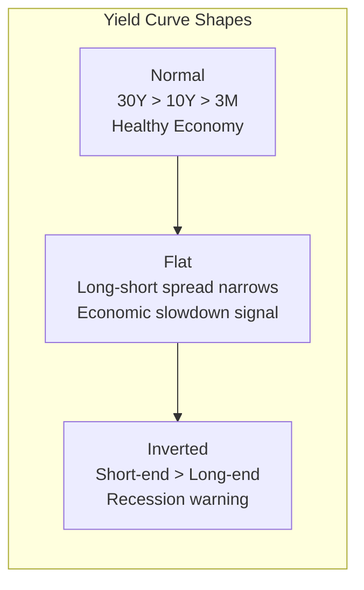

# Macro Dashboard

The Macro Dashboard displays real-time macroeconomic data that affects the options market, helping you understand the market environment from a macro perspective.

## Overview

The page displays the following six macro indicators:

- **VIX** -- CBOE Volatility Index (the "Fear Index")
- **10Y Yield (TNX)** -- 10-Year U.S. Treasury Yield
- **30Y Yield (TYX)** -- 30-Year U.S. Treasury Yield
- **DXY** -- U.S. Dollar Index
- **VVIX** -- Volatility of VIX (the "volatility of volatility")
- **10Y-3M Spread** -- The spread between 10-Year and 3-Month Treasury yields

These are **global indicators** and do not require selecting a ticker. Data auto-refreshes every 5 minutes.

### How to Access

```
/macro
```

API endpoint:

```bash
curl http://localhost:5001/api/macro/current
```

Historical data:

```bash
curl http://localhost:5001/api/macro/history/VIX?period=90d
```

---

## VIX (Fear Index)

VIX (CBOE Volatility Index) measures the **expected volatility** of the S&P 500 Index. It is commonly known as the "Fear Index." It reflects the options market's expectation of volatility over the next 30 days.

### Volatility Ranges

VIX values can be divided into the following ranges, each representing a different market sentiment:

| VIX Range | State | Meaning | Market Sentiment |
|-----------|-------|---------|-----------------|
| `< 15` | Complacency | Extremely low volatility, calm markets | Optimistic but potentially too relaxed |
| 15 - 20 | Normal | Typical market volatility level | Normal |
| 20 - 25 | Caution | Rising uncertainty | Starting to get nervous |
| 25 - 30 | Fear | Significant market pressure | Panic |
| `> 30` | Extreme Fear | Crisis-level panic | Extreme panic |

### How to Interpret

- **Low VIX (< 15)**: The market is complacent and options are cheaply priced. But "low volatility" does not mean "safe" -- history shows that extremely low VIX is often followed by volatility spikes
- **VIX rising rapidly**: Usually accompanied by market declines, representing spreading panic
- **High VIX (> 30)**: The market is in extreme panic. From a contrarian perspective, this could be a panic bottom
- **VIX falling from highs**: Panic is subsiding, and the market may be stabilizing

:::tip VIX and Options Strategies
The higher the VIX, the more expensive options are (higher implied volatility). Selling options in a high VIX environment yields higher premiums, but the risk is also greater.
:::

---

## Treasury Yields

Treasury yields are the benchmark interest rates for financial markets and have a significant impact on stock valuations and capital flows.

### 10-Year Treasury Yield (TNX)

The 10-Year Treasury Yield is the most widely cited long-term interest rate benchmark.

- **Rising yields** -> Bond prices fall -> Capital flows from stocks to bonds -> Puts pressure on growth stocks (tech)
- **Falling yields** -> Bond prices rise -> Capital favors risk assets -> Bullish for stocks

### 30-Year Treasury Yield (TYX)

The 30-Year yield reflects ultra-long-term interest rate expectations and has a greater impact on real estate and long-term investments.

### Yield Curve



---

## U.S. Dollar Index (DXY)

The U.S. Dollar Index (DXY) measures the strength of the U.S. dollar against a basket of major currencies.

### Strength Threshold

Using **100** as the strength dividing line:

| DXY Level | State | Impact on Market |
|-----------|-------|-----------------|
| `> 100` | Strong Dollar | U.S. exports under pressure, multinational corporate profits squeezed, capital outflows from emerging markets |
| `< 100` | Weak Dollar | Beneficial for commodities and emerging markets, U.S. export competitiveness increases |

### How to Interpret

- **Stronger dollar**: Generally bearish for gold, commodities, and emerging market stocks; bearish for multinational companies with high overseas revenue (e.g., AAPL, MSFT)
- **Weaker dollar**: Generally bullish for gold, commodities, and emerging markets
- **Sharp DXY changes**: Rapid movements in either direction can trigger market volatility

---

## VVIX (Volatility of VIX)

VVIX measures the implied volatility of VIX options, i.e., the **volatility of volatility**. It reflects market expectations for the magnitude of future VIX changes.

### Volatility Ranges

| VVIX Level | State | Meaning |
|------------|-------|---------|
| `> 100` | High Volatility | VIX itself is expected to move significantly; market uncertainty is extremely high |
| 80 - 100 | Normal | Typical VIX volatility level |
| `< 80` | Low Volatility | VIX is expected to remain stable; market sentiment is calm |

### How to Interpret

- **VVIX rising**: Even if VIX has not surged, a rising VVIX means the market expects significant future volatility changes
- **VVIX at highs**: Typically occurs during crisis periods, representing high market fear of "surprises"
- **VVIX at lows**: Market expectations for volatility are very stable, usually corresponding to calm market conditions

---

## Term Spread (10Y-3M Spread)

The Term Spread is the difference between the 10-Year Treasury yield and the 3-Month Treasury yield. It is one of the most important leading indicators of economic recession.

```
10Y-3M Spread = 10Y Yield (TNX) - 3M Yield (IRX)
```

### State Classification

| Spread Level | State | Meaning |
|-------------|-------|---------|
| `> 0` | Normal (positive slope) | Yield curve is normal, economy is healthy |
| Near 0 | Flattening | Economic growth slowing signal |
| `< 0` | Inverted (negative slope) | Recession warning signal |

### Historical Significance

:::warning Recession Signal
Yield curve inversion (10Y-3M Spread < 0) is one of the most reliable leading indicators of economic recession in history. A yield curve inversion has preceded every U.S. recession over the past several decades. A recession typically occurs within 6-18 months after the inversion appears.
:::

---

## Trend Charts

The Macro Dashboard also includes trend charts to help you observe the historical movements of each indicator.

### Treasury Yield Trend

A dual-line chart showing the trends of 10-Year and 30-Year yields:

| Line | Color | Description |
|------|-------|-------------|
| 10Y Yield | Blue | 10-Year Treasury Yield |
| 30Y Yield | Purple | 30-Year Treasury Yield |

The distance between the two lines represents the change in term spread.

### VIX and DXY Trends

A dual Y-axis chart, with VIX on the left Y-axis and DXY on the right Y-axis. The chart background includes color-coded bands for VIX ranges, making it easy to visually assess the current volatility state.

---

## Macro Indicators and Options Trading

The ultimate goal of understanding macro indicators is to guide options trading decisions. Below is the relationship between each indicator and options strategies:

| Macro Signal | Market Implication | Options Strategy Reference |
|-------------|-------------------|---------------------------|
| Low VIX + Positive GEX | Calm market | Consider volatility selling strategies (iron condors, short straddles) |
| VIX surge + Negative GEX | Panic + instability | Be cautious with new positions, consider buying protective puts |
| Rising yields + Strong DXY | Interest rate pressure + strong dollar | Watch for IWM/QQQ short opportunities, TLT may face pressure |
| Inverted term spread | Recession expectations | Increase downside protection, reduce aggressive longs |
| VVIX surge | Extremely high uncertainty | Reduce position sizes, avoid shorting volatility |

:::tip Comprehensive Analysis
Never make trading decisions based on a single macro indicator. Combine macro indicators with ticker-level options data (PCR, GEX, Max Pain) for a more complete market perspective.
:::
