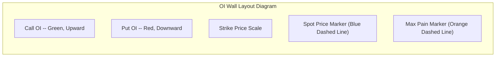
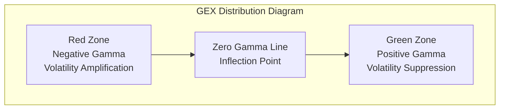

# Strike Analysis

The Strike Analysis page provides three interactive charts to help you analyze options distribution across strike prices from different dimensions.

## Overview

The page contains the following three charts:

- **OI Wall** -- Displays the call/put open interest distribution across strike prices
- **Max Pain Curve** -- Displays the total loss for option sellers at different settlement prices
- **GEX Distribution** -- Displays the gamma exposure distribution across strike prices

You can switch between different expiration dates using the **Expiration Date Selector** at the top of the page. All charts will update simultaneously.

:::info Interactive Features
All charts support hovering to view specific values, scroll wheel zooming, and drag panning.
:::

---

## OI Wall

The OI Wall is a **bidirectional bar chart** displaying the call and put options open interest (Open Interest) at each strike price.

### Chart Layout



The chart structure is as follows:

| Element | Description |
|---------|-------------|
| Green bars (upward) | **Call** open interest at each strike price |
| Red bars (downward) | **Put** open interest at each strike price |
| Blue dashed line | Current spot price position |
| Orange dashed line | Max Pain position |

### How to Read

- **Tall green bars** -- This strike price has a large concentration of Call OI, which may form a **resistance level** (because call sellers do not want the price to rise above this point)
- **Tall red bars** -- This strike price has a large concentration of Put OI, which may form a **support level** (because put sellers do not want the price to fall below this point)
- **Dense OI areas** -- Reflect that market participants are placing concentrated bets at these price levels, and prices may experience more contention in these areas

:::tip Practical Application
Find the high OI strike prices closest to the current spot price -- these levels are the most likely short-term support and resistance levels.
:::

---

## Max Pain Curve

The Max Pain Curve is a **smooth area/line chart** showing the total loss for all option sellers if options expire at a given settlement price.

### Curve Shape

A typical Max Pain curve has a **U-shape or valley shape**:

```text
Loss Amount
    |
    |  \                     /
    |   \                   /
    |    \                 /
    |     \               /
    |      \   Valley    /
    |       \ (Max Pain)/
    |        \_________/
    +-------------------------> Settlement Price
```

| Element | Description |
|---------|-------------|
| Curve | The total loss for option sellers at each settlement price |
| Valley marker | The minimum loss point, i.e., the Max Pain strike price |

### How to Read

- **Valley position** = Max Pain, the settlement price at which option sellers have the minimum loss
- **The steeper the curve** -- Losses increase sharply when deviating from Max Pain, indicating stronger "gravitational pull" and a greater force driving the price back toward Max Pain
- **The flatter the curve** -- Option sellers have similar losses across different settlement prices, and the price may lack a clear direction

:::info Expiration Effect
Max Pain has the highest reference value as the expiration date approaches. When expiration is still several weeks away, the curve may be relatively flat; during the final days before expiration, the valley effect is most pronounced.
:::

---

## GEX Distribution

The GEX Distribution is a **colored bar chart** displaying the net gamma exposure at each strike price.

### Chart Layout

| Element | Description |
|---------|-------------|
| Green bars | **Positive gamma** exposure at this strike price |
| Red bars | **Negative gamma** exposure at this strike price |
| Gray dashed line | Zero gamma dividing line |
| Blue dashed line | Current spot price position |

### How to Read

- **Green areas (positive gamma)** -- When the price is in these areas, market maker hedging behavior tends to pull the price back, providing a **stabilizing** effect
- **Red areas (negative gamma)** -- When the price is in these areas, market maker hedging behavior tends to amplify price movements, providing a **destabilizing** effect
- **Zero gamma inflection point** -- The boundary between positive and negative gamma, where market dynamics undergo a qualitative change



**Key Observations:**

- When the spot price is in the **positive gamma zone**, the market tends to trade in a range
- When the spot price is in the **negative gamma zone**, the market is prone to trending moves
- Observe the position of the zero gamma inflection point, as it marks the critical price level where the market transitions from "stable" to "unstable"

---

## Use Cases

Here are several typical use cases for Strike Analysis:

### Case 1: Finding Support and Resistance

1. Open the **OI Wall** chart
2. Find strike prices with high Call OI near the spot price -- potential resistance levels
3. Find strike prices with high Put OI near the spot price -- potential support levels

### Case 2: Determining Expiration Target Price

1. Open the **Max Pain Curve** chart
2. Read the strike price at the valley position
3. This price is the most likely target for the price to gravitate toward at expiration

### Case 3: Assessing Market Stability

1. Open the **GEX Distribution** chart
2. Confirm whether the current spot price is in the positive or negative gamma zone
3. Combined with the position of the zero gamma inflection point, determine whether the market is trending toward stability or turbulence

### Case 4: Cross-Expiration Comparison

Use the Expiration Date Selector to compare the OI Wall and GEX distribution across different expiration dates, observing how market participants' position distributions change across different time horizons.
